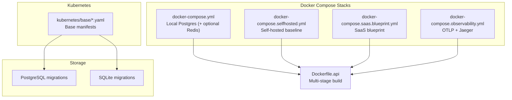
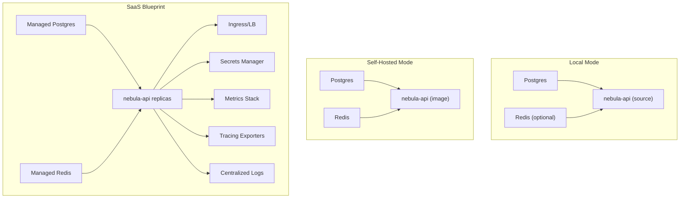
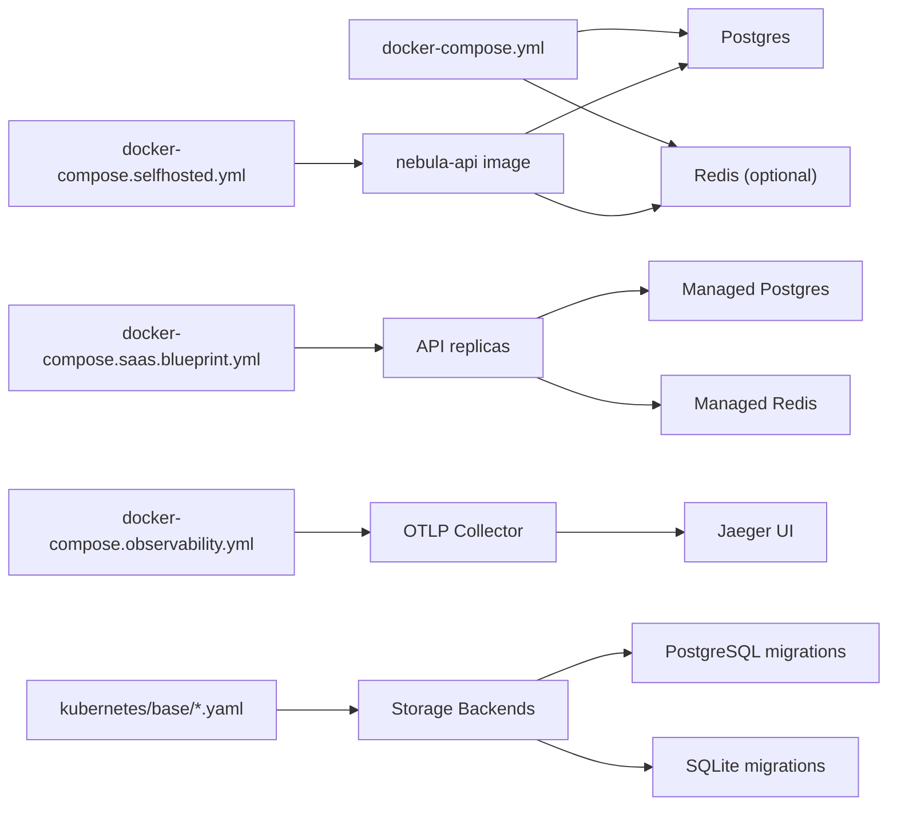

# Deployment and Operations

<cite>
**Referenced Files in This Document**
- [deploy/README.md](file://deploy/README.md)
- [deploy/STACKS.md](file://deploy/STACKS.md)
- [deploy/docker/Dockerfile.api](file://deploy/docker/Dockerfile.api)
- [deploy/docker/docker-compose.yml](file://deploy/docker/docker-compose.yml)
- [deploy/docker/docker-compose.selfhosted.yml](file://deploy/docker/docker-compose.selfhosted.yml)
- [deploy/docker/docker-compose.saas.blueprint.yml](file://deploy/docker/docker-compose.saas.blueprint.yml)
- [deploy/docker/docker-compose.observability.yml](file://deploy/docker/docker-compose.observability.yml)
- [deploy/docker/otel-collector-config.yaml](file://deploy/docker/otel-collector-config.yaml)
- [crates/storage/migrations/postgres/README.md](file://crates/storage/migrations/postgres/README.md)
- [crates/storage/migrations/sqlite/README.md](file://crates/storage/migrations/sqlite/README.md)
- [crates/storage/src/backend/mod.rs](file://crates/storage/src/backend/mod.rs)
</cite>

## Table of Contents
1. [Introduction](#introduction)
2. [Project Structure](#project-structure)
3. [Core Components](#core-components)
4. [Architecture Overview](#architecture-overview)
5. [Detailed Component Analysis](#detailed-component-analysis)
6. [Dependency Analysis](#dependency-analysis)
7. [Performance Considerations](#performance-considerations)
8. [Troubleshooting Guide](#troubleshooting-guide)
9. [Conclusion](#conclusion)
10. [Appendices](#appendices)

## Introduction
This document explains how to deploy and operate Nebula across self-hosted and SaaS-like environments. It covers Docker Compose-based deployments, environment variable configuration, volume management, and observability. It also outlines database migrations and schema evolution, scaling considerations, backup strategies, and operational best practices. The content is designed for both beginners and experienced DevOps engineers.

## Project Structure
Nebula’s deployment assets live under the deploy directory and include:
- Docker Compose stacks for local, self-hosted, SaaS blueprint, and observability
- A multi-stage Dockerfile for building and running the API service
- Kubernetes manifests under kubernetes/ (base templates and supporting files)
- Storage migrations for PostgreSQL and SQLite backends

**Diagram sources**
- [deploy/docker/docker-compose.yml:1-53](file://deploy/docker/docker-compose.yml#L1-L53)
- [deploy/docker/docker-compose.selfhosted.yml:1-124](file://deploy/docker/docker-compose.selfhosted.yml#L1-L124)
- [deploy/docker/docker-compose.saas.blueprint.yml:1-25](file://deploy/docker/docker-compose.saas.blueprint.yml#L1-L25)
- [deploy/docker/docker-compose.observability.yml:1-25](file://deploy/docker/docker-compose.observability.yml#L1-L25)
- [deploy/docker/Dockerfile.api:1-73](file://deploy/docker/Dockerfile.api#L1-L73)
- [crates/storage/migrations/postgres/README.md:1-43](file://crates/storage/migrations/postgres/README.md#L1-L43)
- [crates/storage/migrations/sqlite/README.md:1-31](file://crates/storage/migrations/sqlite/README.md#L1-L31)

**Section sources**
- [deploy/README.md:1-88](file://deploy/README.md#L1-L88)
- [deploy/STACKS.md:1-83](file://deploy/STACKS.md#L1-L83)

## Core Components
- Docker Compose stacks:
  - Local infrastructure stack with Postgres and optional Redis
  - Self-hosted baseline with production-oriented defaults
  - SaaS blueprint for reference (replicas, external managed services)
  - Observability stack for local telemetry validation
- API service image built via a multi-stage Dockerfile with health checks and secure defaults
- Kubernetes base manifests for cluster deployment
- Storage migrations for PostgreSQL and SQLite, ensuring schema parity

**Section sources**
- [deploy/docker/docker-compose.yml:1-53](file://deploy/docker/docker-compose.yml#L1-L53)
- [deploy/docker/docker-compose.selfhosted.yml:1-124](file://deploy/docker/docker-compose.selfhosted.yml#L1-L124)
- [deploy/docker/docker-compose.saas.blueprint.yml:1-25](file://deploy/docker/docker-compose.saas.blueprint.yml#L1-L25)
- [deploy/docker/docker-compose.observability.yml:1-25](file://deploy/docker/docker-compose.observability.yml#L1-L25)
- [deploy/docker/Dockerfile.api:1-73](file://deploy/docker/Dockerfile.api#L1-L73)
- [crates/storage/migrations/postgres/README.md:1-43](file://crates/storage/migrations/postgres/README.md#L1-L43)
- [crates/storage/migrations/sqlite/README.md:1-31](file://crates/storage/migrations/sqlite/README.md#L1-L31)

## Architecture Overview
The deployment architecture supports three primary modes:
- Local: run Postgres and optionally Redis locally; run the API from source
- Self-Hosted: single-node stack with Postgres, Redis, and the API service
- SaaS Blueprint: reference topology with multiple API replicas and external managed services

**Diagram sources**
- [deploy/STACKS.md:10-32](file://deploy/STACKS.md#L10-L32)
- [deploy/STACKS.md:34-50](file://deploy/STACKS.md#L34-L50)
- [deploy/STACKS.md:56-70](file://deploy/STACKS.md#L56-L70)
- [deploy/docker/docker-compose.selfhosted.yml:70-115](file://deploy/docker/docker-compose.selfhosted.yml#L70-L115)
- [deploy/docker/docker-compose.saas.blueprint.yml:5-24](file://deploy/docker/docker-compose.saas.blueprint.yml#L5-L24)

## Detailed Component Analysis

### Docker Compose: Local Infrastructure
Purpose:
- Provide a minimal local stack with Postgres and optional Redis
- Enable quick iteration and development against a production-like persistence model

Key behaviors:
- Postgres configured with environment-driven credentials and exposed port
- Optional Redis profile enables caching/queue features
- Health checks ensure readiness before dependent services start
- Named volumes persist data across runs

Operational notes:
- Use the compose file from the repository root
- Optionally enable the cache profile for queue/cache-enabled workflows

**Section sources**
- [deploy/docker/docker-compose.yml:1-53](file://deploy/docker/docker-compose.yml#L1-L53)

### Docker Compose: Self-Hosted Baseline
Purpose:
- Single-node production-oriented deployment with Postgres, Redis, and the API service

Key behaviors:
- Production-grade defaults: CPU/memory limits, resource constraints, hardened container settings
- Health checks for Postgres, Redis, and API
- Environment variables for database connectivity, logging, binding, worker count, and OAuth client settings
- Volumes for durable storage
- Ports bound to localhost by default for safety

Scaling and tuning:
- Adjust NEBULA_WORKER_COUNT to balance throughput and resource usage
- Tune Redis memory and eviction policy for caching needs

Security hardening:
- Read-only root filesystem, restricted capabilities, non-root users, PID limits, and logging options

**Section sources**
- [deploy/docker/docker-compose.selfhosted.yml:1-124](file://deploy/docker/docker-compose.selfhosted.yml#L1-L124)

### Docker Compose: SaaS Blueprint
Purpose:
- Reference topology simulating a horizontally scalable SaaS baseline
- Not intended for direct production use; serves as an architectural guide

Key behaviors:
- Multiple API replicas
- External managed Postgres and Redis
- Centralized observability, secrets management, ingress, and logging

Operational guidance:
- Replace static environment variables with platform-managed secrets
- Use a container orchestrator (Kubernetes/ECS/Nomad) for scheduling and scaling
- Integrate managed services for reliability and HA

**Section sources**
- [deploy/docker/docker-compose.saas.blueprint.yml:1-25](file://deploy/docker/docker-compose.saas.blueprint.yml#L1-L25)

### Dockerfile: API Service Build and Runtime
Purpose:
- Multi-stage build to produce a lean runtime image with a health check and secure defaults

Key behaviors:
- Planner and builder stages optimize rebuild times using dependency caching
- Development stage sets defaults for local iteration
- Production stage:
  - Minimal base OS, non-root user, health check, and hardened runtime flags
  - Exposes the API port and sets worker count and bind address

CI/CD integration:
- Override the default image tag via an environment variable for automated builds

**Section sources**
- [deploy/docker/Dockerfile.api:1-73](file://deploy/docker/Dockerfile.api#L1-L73)

### Observability Stack: Telemetry and Tracing
Purpose:
- Validate telemetry ingestion and tracing locally using OTLP and Jaeger

Key behaviors:
- OpenTelemetry Collector receives OTLP over gRPC and HTTP
- Jaeger UI exposes a dashboard for trace inspection
- Collector forwards traces to Jaeger

Usage:
- Bring up the observability stack and configure the application to send OTLP to the collector endpoints

**Section sources**
- [deploy/docker/docker-compose.observability.yml:1-25](file://deploy/docker/docker-compose.observability.yml#L1-L25)
- [deploy/docker/otel-collector-config.yaml:1-26](file://deploy/docker/otel-collector-config.yaml#L1-L26)

### Kubernetes Base Manifests
Purpose:
- Provide base Kubernetes manifests for cluster deployment
- Support both external and in-cluster databases and caches

Key behaviors:
- ConfigMaps and Secrets for configuration and credentials
- Deployments, Services, and readiness probes
- Guidance for mounting persistent volumes and integrating with managed services

Note:
- The base directory contains foundational templates; adapt them to your platform and requirements

**Section sources**
- [deploy/README.md:85-88](file://deploy/README.md#L85-L88)

### Database Migrations and Schema Evolution
Purpose:
- Maintain consistent schema across PostgreSQL and SQLite backends
- Support schema parity and controlled evolution

Key behaviors:
- PostgreSQL migrations define a layered schema with typed columns and constraints
- SQLite migrations mirror the PostgreSQL layout with dialect-appropriate types
- Migration ordering ensures logical progression across identity, tenancy, workflow, credentials, execution, quotas, and audit layers

Operational guidance:
- Apply migrations before starting the API service
- Keep PostgreSQL and SQLite migrations in sync to preserve local and production parity

**Section sources**
- [crates/storage/migrations/postgres/README.md:1-43](file://crates/storage/migrations/postgres/README.md#L1-L43)
- [crates/storage/migrations/sqlite/README.md:1-31](file://crates/storage/migrations/sqlite/README.md#L1-L31)
- [crates/storage/src/backend/mod.rs:1-20](file://crates/storage/src/backend/mod.rs#L1-L20)

## Dependency Analysis
The deployment stack exhibits clear separation of concerns:
- Compose files define services and their runtime dependencies
- The API Dockerfile encapsulates build/runtime behavior
- Storage migrations define backend-specific schema evolution
- Kubernetes base manifests provide cluster orchestration scaffolding

**Diagram sources**
- [deploy/docker/docker-compose.yml:7-44](file://deploy/docker/docker-compose.yml#L7-L44)
- [deploy/docker/docker-compose.selfhosted.yml:70-115](file://deploy/docker/docker-compose.selfhosted.yml#L70-L115)
- [deploy/docker/docker-compose.saas.blueprint.yml:5-24](file://deploy/docker/docker-compose.saas.blueprint.yml#L5-L24)
- [deploy/docker/docker-compose.observability.yml:5-24](file://deploy/docker/docker-compose.observability.yml#L5-L24)
- [crates/storage/migrations/postgres/README.md:1-43](file://crates/storage/migrations/postgres/README.md#L1-L43)
- [crates/storage/migrations/sqlite/README.md:1-31](file://crates/storage/migrations/sqlite/README.md#L1-L31)

**Section sources**
- [deploy/docker/docker-compose.yml:1-53](file://deploy/docker/docker-compose.yml#L1-L53)
- [deploy/docker/docker-compose.selfhosted.yml:1-124](file://deploy/docker/docker-compose.selfhosted.yml#L1-L124)
- [deploy/docker/docker-compose.saas.blueprint.yml:1-25](file://deploy/docker/docker-compose.saas.blueprint.yml#L1-L25)
- [deploy/docker/docker-compose.observability.yml:1-25](file://deploy/docker/docker-compose.observability.yml#L1-L25)
- [crates/storage/migrations/postgres/README.md:1-43](file://crates/storage/migrations/postgres/README.md#L1-L43)
- [crates/storage/migrations/sqlite/README.md:1-31](file://crates/storage/migrations/sqlite/README.md#L1-L31)

## Performance Considerations
- Worker count tuning:
  - Adjust NEBULA_WORKER_COUNT to match workload characteristics and available CPU/memory
- Resource limits:
  - Use CPU/memory limits and PID caps to prevent noisy-neighbor issues
- Caching:
  - Configure Redis with appropriate memory limits and eviction policies for your cache patterns
- Database connection pooling:
  - Ensure DATABASE_URL and pool settings align with workload and backend capacity
- Observability overhead:
  - Enable telemetry selectively in staging and production to minimize impact

[No sources needed since this section provides general guidance]

## Troubleshooting Guide
Common issues and resolutions:
- Health checks failing:
  - Verify DATABASE_URL and REDIS_URL are reachable from the API container
  - Confirm Postgres and Redis are healthy before starting dependent services
- Port conflicts:
  - Change exposed ports via environment variables or host bindings
- Telemetry not appearing:
  - Ensure the application sends OTLP to the collector endpoints
  - Validate collector configuration and network connectivity
- Migration errors:
  - Apply migrations before launching the API
  - Confirm schema parity between PostgreSQL and SQLite where applicable

**Section sources**
- [deploy/docker/docker-compose.selfhosted.yml:100-105](file://deploy/docker/docker-compose.selfhosted.yml#L100-L105)
- [deploy/docker/docker-compose.observability.yml:14-24](file://deploy/docker/docker-compose.observability.yml#L14-L24)
- [crates/storage/migrations/postgres/README.md:15-43](file://crates/storage/migrations/postgres/README.md#L15-L43)

## Conclusion
Nebula’s deployment assets provide flexible pathways for local development, self-hosted operations, and SaaS-scale architectures. By leveraging Docker Compose for local and baseline deployments, Kubernetes for production orchestration, and robust storage migrations, teams can achieve reliable, observable, and scalable operations. Follow the environment variable contracts, apply migrations systematically, and adopt the operational best practices outlined here to maintain smooth deployments and operations.

[No sources needed since this section summarizes without analyzing specific files]

## Appendices

### Environment Variables Reference
- Database connectivity:
  - DATABASE_URL
- Caching/connectivity:
  - REDIS_URL
- API binding and concurrency:
  - NEBULA_API_BIND
  - NEBULA_WORKER_COUNT
- Logging:
  - RUST_LOG or NEBULA_LOG
- Telemetry/Sentry:
  - OTEL_EXPORTER_OTLP_ENDPOINT
  - SENTRY_DSN
- OAuth:
  - GITHUB_OAUTH_CLIENT_ID
  - GITHUB_OAUTH_CLIENT_SECRET
  - GITHUB_OAUTH_REDIRECT_URI

**Section sources**
- [deploy/STACKS.md:72-83](file://deploy/STACKS.md#L72-L83)
- [deploy/docker/docker-compose.selfhosted.yml:82-91](file://deploy/docker/docker-compose.selfhosted.yml#L82-L91)

### Backup Strategies
- Postgres:
  - Schedule regular logical backups using the database’s native tools
  - Retain point-in-time recovery snapshots for granular restoration
- Redis:
  - Enable persistence and snapshotting aligned with your RPO/RTO targets
- API data:
  - Treat application-level state as ephemeral where possible; rely on durable stores for critical data
- Immutable artifacts:
  - Store container images in a registry with retention policies and vulnerability scanning

[No sources needed since this section provides general guidance]

### Scaling Procedures
- Horizontal scaling:
  - Increase API replicas behind a load balancer
  - Ensure external managed Postgres and Redis can handle increased load
- Vertical scaling:
  - Adjust CPU/memory limits and worker counts per node
- Queue and cache:
  - Scale Redis or switch to managed offerings for higher throughput

[No sources needed since this section provides general guidance]