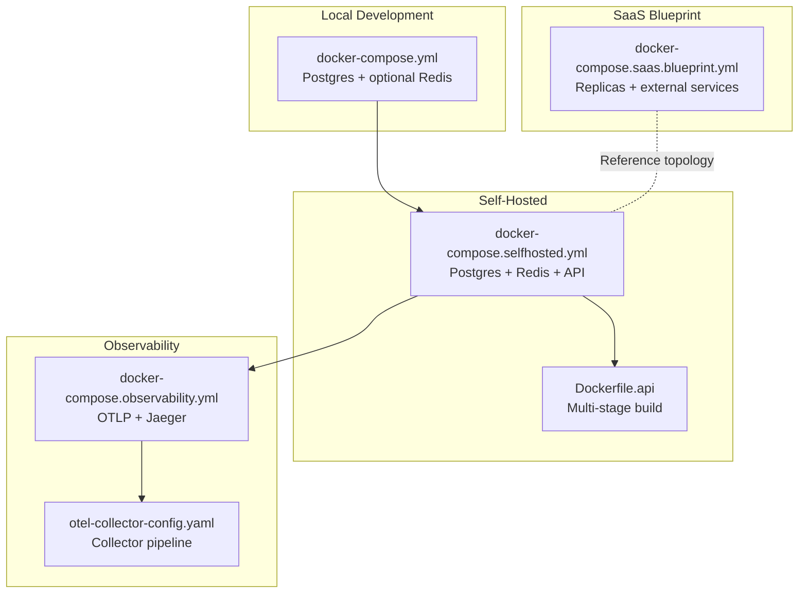
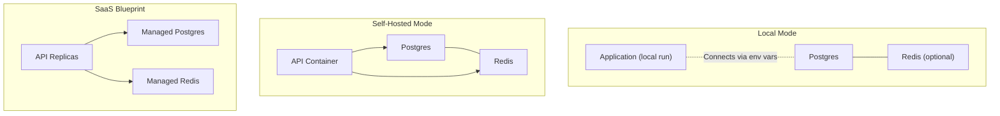
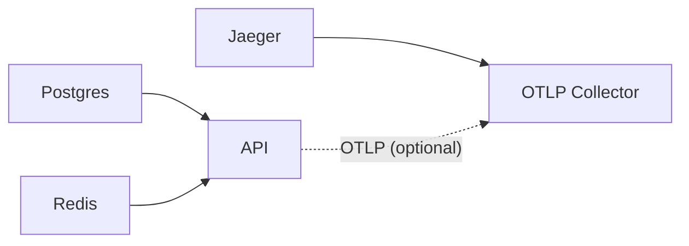

# Docker Deployment

<cite>
**Referenced Files in This Document**
- [docker-compose.yml](file://deploy/docker/docker-compose.yml)
- [docker-compose.selfhosted.yml](file://deploy/docker/docker-compose.selfhosted.yml)
- [docker-compose.saas.blueprint.yml](file://deploy/docker/docker-compose.saas.blueprint.yml)
- [docker-compose.observability.yml](file://deploy/docker/docker-compose.observability.yml)
- [otel-collector-config.yaml](file://deploy/docker/otel-collector-config.yaml)
- [Dockerfile.api](file://deploy/docker/Dockerfile.api)
- [README.md](file://deploy/README.md)
- [STACKS.md](file://deploy/STACKS.md)
- [.dockerignore](file://.dockerignore)
- [OBSERVABILITY.md](file://docs/OBSERVABILITY.md)
</cite>

## Table of Contents
1. [Introduction](#introduction)
2. [Project Structure](#project-structure)
3. [Core Components](#core-components)
4. [Architecture Overview](#architecture-overview)
5. [Detailed Component Analysis](#detailed-component-analysis)
6. [Dependency Analysis](#dependency-analysis)
7. [Performance Considerations](#performance-considerations)
8. [Troubleshooting Guide](#troubleshooting-guide)
9. [Conclusion](#conclusion)
10. [Appendices](#appendices)

## Introduction
This document explains how to deploy Nebula using Docker and Docker Compose across three practical scenarios: local development, self-hosted single-node, and SaaS blueprint. It covers service orchestration for Postgres and Redis, API container configuration, health checks, restart policies, environment variable injection, volume mounts, networking, and observability integration with OpenTelemetry and Jaeger. It also provides deployment steps, scaling considerations, security hardening, and operational procedures.

## Project Structure
Nebula’s Docker deployment is organized under deploy/docker with the following key files:
- Local infrastructure stack: Postgres and optional Redis
- Self-hosted single-node stack: Postgres, Redis, and the API container
- SaaS blueprint: simulated multi-replica API topology
- Observability stack: OpenTelemetry Collector and Jaeger
- API image build: multi-stage Dockerfile producing a minimal production image

**Diagram sources**
- [docker-compose.yml:1-53](file://deploy/docker/docker-compose.yml#L1-L53)
- [docker-compose.selfhosted.yml:1-124](file://deploy/docker/docker-compose.selfhosted.yml#L1-L124)
- [Dockerfile.api:1-73](file://deploy/docker/Dockerfile.api#L1-L73)
- [docker-compose.observability.yml:1-25](file://deploy/docker/docker-compose.observability.yml#L1-L25)
- [otel-collector-config.yaml:1-26](file://deploy/docker/otel-collector-config.yaml#L1-L26)
- [docker-compose.saas.blueprint.yml:1-25](file://deploy/docker/docker-compose.saas.blueprint.yml#L1-L25)

**Section sources**
- [README.md:1-88](file://deploy/README.md#L1-L88)
- [STACKS.md:1-83](file://deploy/STACKS.md#L1-L83)

## Core Components
- Postgres service: persistent relational storage for Nebula metadata and execution journals.
- Redis service (optional): caching and optional queue/backbone features.
- API service: the Nebula unified server binary packaged in a minimal production image with health checks and resource limits.
- Observability stack: OpenTelemetry Collector receiving OTLP over gRPC/HTTP and exporting to Jaeger.

Key orchestration elements:
- Health checks for Postgres, Redis, and API ensure readiness before dependent services start.
- Restart policies enforce continuous operation.
- Volumes persist Postgres and Redis data.
- Networks isolate services and enable internal DNS resolution.
- Environment variables inject configuration such as bind address, worker count, and logging levels.

**Section sources**
- [docker-compose.yml:7-53](file://deploy/docker/docker-compose.yml#L7-L53)
- [docker-compose.selfhosted.yml:13-124](file://deploy/docker/docker-compose.selfhosted.yml#L13-L124)
- [docker-compose.observability.yml:5-25](file://deploy/docker/docker-compose.observability.yml#L5-L25)
- [otel-collector-config.yaml:1-26](file://deploy/docker/otel-collector-config.yaml#L1-L26)
- [Dockerfile.api:50-73](file://deploy/docker/Dockerfile.api#L50-L73)

## Architecture Overview
The deployment supports three modes aligned with the project’s STACKS definition:
- Local: lightweight Postgres plus optional Redis; application runs from source.
- Self-Hosted: single-node production-like stack with Postgres, Redis, and the API container.
- SaaS: blueprint showing horizontal scaling via replicas and external managed services.

**Diagram sources**
- [docker-compose.yml:7-53](file://deploy/docker/docker-compose.yml#L7-L53)
- [docker-compose.selfhosted.yml:13-124](file://deploy/docker/docker-compose.selfhosted.yml#L13-L124)
- [docker-compose.saas.blueprint.yml:5-25](file://deploy/docker/docker-compose.saas.blueprint.yml#L5-L25)

**Section sources**
- [STACKS.md:10-83](file://deploy/STACKS.md#L10-L83)

## Detailed Component Analysis

### Local Development Stack (Postgres + optional Redis)
Purpose:
- Provide a production-like persistence layer for local iteration.
- Optionally enable Redis for queue/cache features.

Implementation highlights:
- Postgres service exposes a host port and persists data in a named volume.
- Redis service is profile-driven and starts only when the cache profile is enabled.
- Health checks validate service readiness.
- A shared network enables internal DNS resolution.

Environment and networking:
- Variables such as POSTGRES_USER, POSTGRES_PASSWORD, POSTGRES_DB, POSTGRES_PORT, REDIS_PORT are configurable via environment variables.
- Internal DNS names are used for DATABASE_URL and REDIS_URL in downstream services.

Operational notes:
- Bring up only Postgres for database-only development.
- Enable the cache profile to include Redis.

**Section sources**
- [docker-compose.yml:1-53](file://deploy/docker/docker-compose.yml#L1-L53)
- [README.md:11-39](file://deploy/README.md#L11-L39)

### Self-Hosted Single-Node Stack (Postgres + Redis + API)
Purpose:
- One-command deployment of a production-like stack on a single host.

Implementation highlights:
- Postgres and Redis configured with health checks, resource limits, PID limits, and restricted privileges.
- API service:
  - Built from source using the multi-stage Dockerfile.api.
  - Depends on Postgres and Redis health before starting.
  - Exposes a health check endpoint and sets resource limits.
  - Runs as a non-root user with restricted capabilities.
  - Mounts temporary filesystem for /tmp and sets read-only root filesystem.

Environment variables:
- DATABASE_URL, REDIS_URL, NEBULA_API_BIND, NEBULA_WORKER_COUNT, RUST_LOG, NEBULA_LOG.
- OAuth client settings for GitHub are supported via environment variables.

Security and isolation:
- Security options include dropping privileges and disabling new privileges.
- Resource controls limit CPU and memory usage.
- Logging configured with rotation.

**Section sources**
- [docker-compose.selfhosted.yml:1-124](file://deploy/docker/docker-compose.selfhosted.yml#L1-L124)
- [Dockerfile.api:50-73](file://deploy/docker/Dockerfile.api#L50-L73)
- [STACKS.md:34-55](file://deploy/STACKS.md#L34-L55)

### SaaS Blueprint (Horizontal Scaling Reference)
Purpose:
- Demonstrate a multi-replica API topology suitable for horizontal scaling.
- Emphasize that production SaaS should run on an orchestrator with managed services.

Implementation highlights:
- API replicas are defined with restart policies.
- External managed Postgres and Redis are assumed.
- Additional platform concerns (ingress, secrets, observability, centralized logs) are noted as mandatory in production.

**Section sources**
- [docker-compose.saas.blueprint.yml:1-25](file://deploy/docker/docker-compose.saas.blueprint.yml#L1-L25)
- [README.md:53-64](file://deploy/README.md#L53-L64)

### Observability Stack (OpenTelemetry Collector + Jaeger)
Purpose:
- Enable local tracing checks using OTLP over gRPC/HTTP and visualize spans in Jaeger.

Implementation highlights:
- OpenTelemetry Collector receives OTLP on ports 4317 (gRPC) and 4318 (HTTP).
- Collector exports to Jaeger via OTLP gRPC.
- Jaeger UI is exposed on port 16686.
- Collector configuration is mounted as a read-only volume.

Integration with the API:
- The API container exposes port 5678 for health checks and can be configured to send OTLP to the collector endpoint.

**Section sources**
- [docker-compose.observability.yml:1-25](file://deploy/docker/docker-compose.observability.yml#L1-L25)
- [otel-collector-config.yaml:1-26](file://deploy/docker/otel-collector-config.yaml#L1-L26)
- [README.md:65-84](file://deploy/README.md#L65-L84)

### API Image Build (Multi-Stage Dockerfile)
Purpose:
- Produce a minimal, secure, and efficient production image for the API.

Implementation highlights:
- Planner and builder stages optimize build caching.
- Development stage sets defaults for interactive runs.
- Production stage:
  - Installs CA certificates and creates a non-root user.
  - Sets environment defaults for bind address and worker count.
  - Defines a health check.
  - Exposes the API port and sets the entrypoint.

Security and performance:
- Non-root execution and health checks improve reliability.
- Minimal base image reduces attack surface.

**Section sources**
- [Dockerfile.api:1-73](file://deploy/docker/Dockerfile.api#L1-L73)

## Dependency Analysis
Service dependencies and relationships:
- API depends on Postgres and Redis health checks before starting.
- Observability stack depends on Jaeger; Collector depends on the observability stack.
- Networking isolates services and enables internal DNS resolution.

**Diagram sources**
- [docker-compose.selfhosted.yml:77-81](file://deploy/docker/docker-compose.selfhosted.yml#L77-L81)
- [docker-compose.observability.yml:18-24](file://deploy/docker/docker-compose.observability.yml#L18-L24)

**Section sources**
- [docker-compose.selfhosted.yml:77-81](file://deploy/docker/docker-compose.selfhosted.yml#L77-L81)
- [docker-compose.observability.yml:14-25](file://deploy/docker/docker-compose.observability.yml#L14-L25)

## Performance Considerations
- Resource limits: CPU and memory caps are set for Postgres, Redis, and API to prevent resource contention.
- PID limits: constrain process creation to maintain stability.
- Worker count: tune NEBULA_WORKER_COUNT to match CPU cores and workload characteristics.
- Disk I/O: Postgres and Redis volumes persist data; ensure adequate disk performance and space.
- Network: internal bridge network minimizes overhead and improves service locality.

[No sources needed since this section provides general guidance]

## Troubleshooting Guide
Common issues and remedies:
- API health check failures:
  - Verify NEBULA_API_BIND and port exposure.
  - Confirm DATABASE_URL and REDIS_URL connectivity.
  - Check RUST_LOG/NEBULA_LOG for error messages.
- Postgres readiness:
  - Ensure POSTGRES_USER, POSTGRES_PASSWORD, and POSTGRES_DB match the API configuration.
  - Confirm health check intervals and retries.
- Redis connectivity:
  - Validate REDIS_URL and that Redis is reachable on the internal network.
- Observability:
  - Confirm OTLP endpoints are reachable from the API.
  - Check Jaeger UI availability on port 16686.
- Logs:
  - Inspect container logs and apply rotation settings to avoid disk pressure.

Operational procedures:
- Stop and remove observability containers when not needed.
- Use compose profiles to selectively start services (e.g., cache profile for Redis).

**Section sources**
- [docker-compose.selfhosted.yml:100-105](file://deploy/docker/docker-compose.selfhosted.yml#L100-L105)
- [docker-compose.yml:19-23](file://deploy/docker/docker-compose.yml#L19-L23)
- [docker-compose.observability.yml:22-24](file://deploy/docker/docker-compose.observability.yml#L22-L24)
- [README.md:79-84](file://deploy/README.md#L79-L84)

## Conclusion
Nebula’s Docker deployment provides a consistent, production-like experience across local, self-hosted, and SaaS reference scenarios. The stacks emphasize health checks, restart policies, environment-driven configuration, and observability. For production SaaS, adopt an orchestrator with managed services and robust secret handling, while retaining the blueprint topology and environment contracts defined in the repository.

[No sources needed since this section summarizes without analyzing specific files]

## Appendices

### Step-by-Step Deployment Instructions
- Local infrastructure only:
  - Start Postgres: see the local compose file usage in the deploy README.
  - Optional Redis: enable the cache profile as described in the README.
- Full local stack:
  - Use the main compose file to bring up Postgres and Redis.
- Self-hosted single-node:
  - Build and start the stack with the self-hosted compose file.
  - Override the API image via NEBULA_API_IMAGE if using a prebuilt image.
- SaaS blueprint:
  - Use the SaaS blueprint compose as a reference for multi-replica API topology.
- Observability:
  - Start the observability stack to enable OTLP ingestion and Jaeger UI.

**Section sources**
- [README.md:11-84](file://deploy/README.md#L11-L84)
- [STACKS.md:10-83](file://deploy/STACKS.md#L10-L83)

### Environment Variables and Contracts
Minimum environment contract:
- DATABASE_URL
- REDIS_URL (when queue/cache is enabled)
- NEBULA_API_BIND
- NEBULA_WORKER_COUNT
- RUST_LOG or NEBULA_LOG

Optional telemetry:
- OTEL_EXPORTER_OTLP_ENDPOINT
- SENTRY_DSN

**Section sources**
- [STACKS.md:72-83](file://deploy/STACKS.md#L72-L83)

### Security Hardening and Resource Limits
- API container:
  - Non-root user, capability drops, no-new-privileges, read-only root filesystem, temporary filesystem for /tmp.
  - Health checks and resource limits.
- Redis:
  - Non-root user, capability drops, resource limits, PID limit, memory tuning.
- Postgres:
  - Resource limits, PID limit, health checks, logging rotation.

**Section sources**
- [docker-compose.selfhosted.yml:94-115](file://deploy/docker/docker-compose.selfhosted.yml#L94-L115)
- [docker-compose.selfhosted.yml:56-68](file://deploy/docker/docker-compose.selfhosted.yml#L56-L68)
- [docker-compose.selfhosted.yml:31-40](file://deploy/docker/docker-compose.selfhosted.yml#L31-L40)

### Observability and Tracing
- Collector pipeline:
  - Receives OTLP over gRPC and HTTP.
  - Exports to Jaeger and includes a debug exporter.
- Telemetry schema:
  - Structured event schema for execution_journal supports drill-down analysis.
- Operator loop:
  - A recommended analysis procedure for investigating failures and stuck runs.

**Section sources**
- [otel-collector-config.yaml:1-26](file://deploy/docker/otel-collector-config.yaml#L1-L26)
- [OBSERVABILITY.md:41-73](file://docs/OBSERVABILITY.md#L41-L73)

### Docker Build and Ignore Rules
- Build context and stages:
  - Multi-stage build for optimized production image.
- Ignore rules:
  - Exclude logs, IDE/editor files, documentation, scripts, apps, and deploy configs from the image to reduce size and risk.

**Section sources**
- [Dockerfile.api:1-73](file://deploy/docker/Dockerfile.api#L1-L73)
- [.dockerignore:1-62](file://.dockerignore#L1-L62)