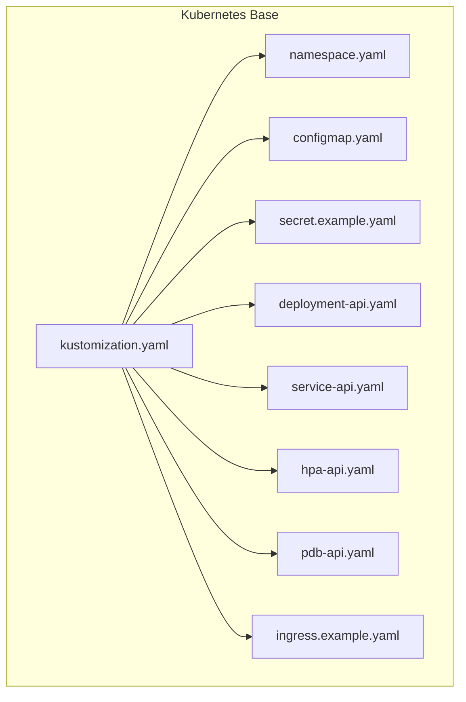
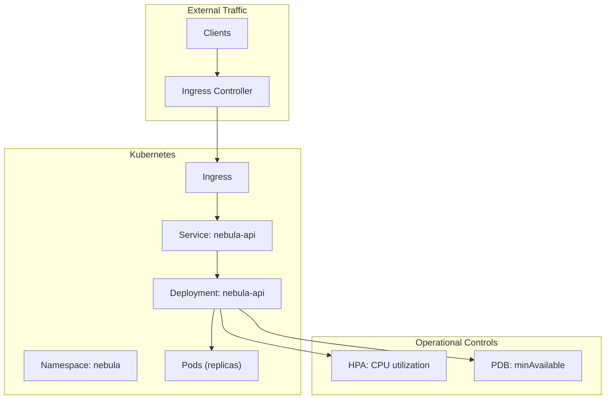
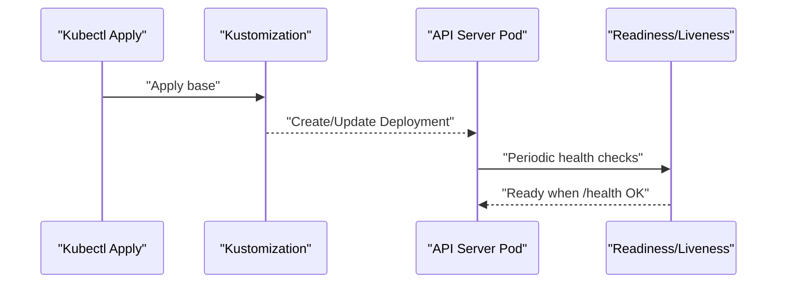
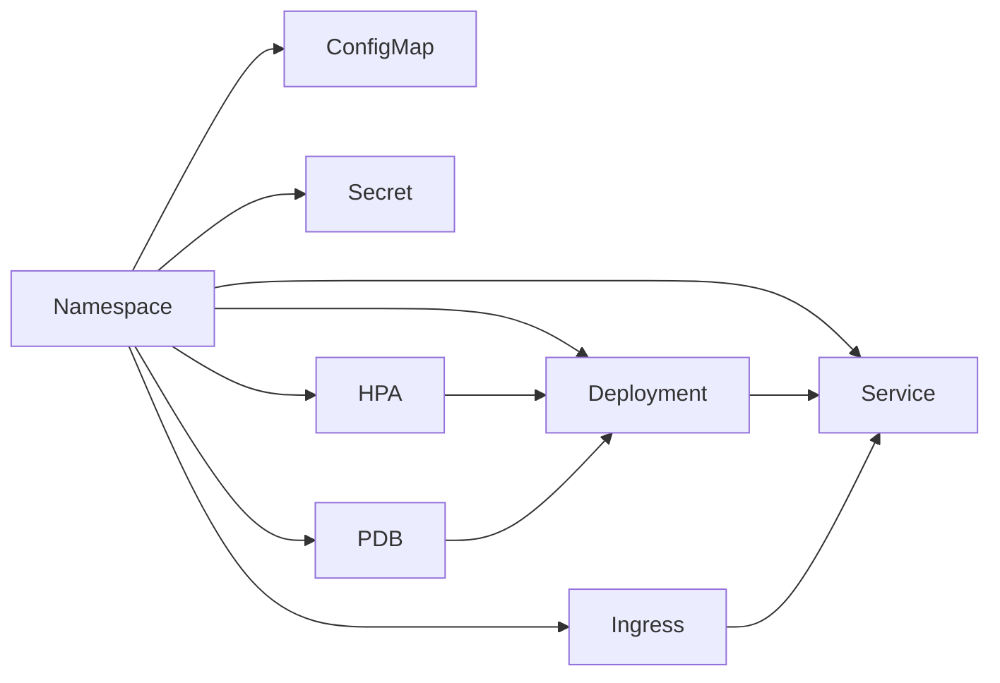

# Kubernetes Deployment

<cite>
**Referenced Files in This Document**
- [kustomization.yaml](file://deploy/kubernetes/base/kustomization.yaml)
- [namespace.yaml](file://deploy/kubernetes/base/namespace.yaml)
- [configmap.yaml](file://deploy/kubernetes/base/configmap.yaml)
- [secret.example.yaml](file://deploy/kubernetes/base/secret.example.yaml)
- [deployment-api.yaml](file://deploy/kubernetes/base/deployment-api.yaml)
- [service-api.yaml](file://deploy/kubernetes/base/service-api.yaml)
- [hpa-api.yaml](file://deploy/kubernetes/base/hpa-api.yaml)
- [pdb-api.yaml](file://deploy/kubernetes/base/pdb-api.yaml)
- [ingress.example.yaml](file://deploy/kubernetes/base/ingress.example.yaml)
- [kubernetes/README.md](file://deploy/kubernetes/README.md)
- [Dockerfile.api](file://deploy/docker/Dockerfile.api)
- [docker-compose.yml](file://deploy/docker/docker-compose.yml)
</cite>

## Table of Contents
1. [Introduction](#introduction)
2. [Project Structure](#project-structure)
3. [Core Components](#core-components)
4. [Architecture Overview](#architecture-overview)
5. [Detailed Component Analysis](#detailed-component-analysis)
6. [Dependency Analysis](#dependency-analysis)
7. [Performance Considerations](#performance-considerations)
8. [Troubleshooting Guide](#troubleshooting-guide)
9. [Conclusion](#conclusion)
10. [Appendices](#appendices)

## Introduction
This document explains how to deploy Nebula’s API service to Kubernetes using Kustomize-based manifests. It covers the purpose and implementation of Kustomization-based deployments, service definitions, and ingress configurations. It documents the deployment manifests including the API Deployment, Service exposure, ConfigMap configuration, and Secret management. It also provides concrete examples from the actual Kubernetes manifests showing how to configure resource requests, environment variables, and persistent volumes. Additional topics include service mesh integration patterns, horizontal pod autoscaling, rolling update strategies, ingress controller setup, SSL termination, load balancing configurations, namespace management, RBAC permissions, and security contexts. Step-by-step deployment instructions for different Kubernetes distributions, scaling procedures, and troubleshooting common Kubernetes deployment issues are included, along with monitoring and logging integration using Kubernetes-native observability tools.

## Project Structure
Nebula’s Kubernetes deployment is organized under deploy/kubernetes/base and uses Kustomize to compose and manage resources. The base layout includes:
- Namespace definition for scoping all resources
- ConfigMap for non-sensitive environment variables
- Secret template for sensitive configuration (to be copied and edited)
- Deployment for the API server with probes, security contexts, and resource requests/limits
- Service to expose the API internally
- HorizontalPodAutoscaler for CPU-driven autoscaling
- PodDisruptionBudget to maintain availability during maintenance
- Optional Ingress for external TLS-terminated access

**Diagram sources**
- [kustomization.yaml:1-13](file://deploy/kubernetes/base/kustomization.yaml#L1-L13)
- [namespace.yaml:1-9](file://deploy/kubernetes/base/namespace.yaml#L1-L9)
- [configmap.yaml:1-15](file://deploy/kubernetes/base/configmap.yaml#L1-L15)
- [secret.example.yaml:1-16](file://deploy/kubernetes/base/secret.example.yaml#L1-L16)
- [deployment-api.yaml:1-72](file://deploy/kubernetes/base/deployment-api.yaml#L1-L72)
- [service-api.yaml:1-17](file://deploy/kubernetes/base/service-api.yaml#L1-L17)
- [hpa-api.yaml:1-23](file://deploy/kubernetes/base/hpa-api.yaml#L1-L23)
- [pdb-api.yaml:1-14](file://deploy/kubernetes/base/pdb-api.yaml#L1-L14)
- [ingress.example.yaml:1-28](file://deploy/kubernetes/base/ingress.example.yaml#L1-L28)

**Section sources**
- [kubernetes/README.md:1-68](file://deploy/kubernetes/README.md#L1-L68)
- [kustomization.yaml:1-13](file://deploy/kubernetes/base/kustomization.yaml#L1-L13)

## Core Components
- Namespace: isolates all Nebula resources in the nebula namespace.
- ConfigMap: supplies non-sensitive environment variables such as logging level, bind address, worker count, and Redis connection string.
- Secret: holds sensitive configuration such as database URL and optional telemetry endpoints; must be copied and edited before applying.
- Deployment: runs the nebula-api container with probes, security contexts, resource requests/limits, and volume mounts.
- Service: exposes the API internally via ClusterIP on port 80, targeting the container’s http port.
- HPA: scales the Deployment based on CPU utilization.
- PDB: ensures a minimum number of pods remain available during voluntary disruptions.
- Ingress: optional external access with TLS termination and host routing.

**Section sources**
- [namespace.yaml:1-9](file://deploy/kubernetes/base/namespace.yaml#L1-L9)
- [configmap.yaml:1-15](file://deploy/kubernetes/base/configmap.yaml#L1-L15)
- [secret.example.yaml:1-16](file://deploy/kubernetes/base/secret.example.yaml#L1-L16)
- [deployment-api.yaml:1-72](file://deploy/kubernetes/base/deployment-api.yaml#L1-L72)
- [service-api.yaml:1-17](file://deploy/kubernetes/base/service-api.yaml#L1-L17)
- [hpa-api.yaml:1-23](file://deploy/kubernetes/base/hpa-api.yaml#L1-L23)
- [pdb-api.yaml:1-14](file://deploy/kubernetes/base/pdb-api.yaml#L1-L14)
- [ingress.example.yaml:1-28](file://deploy/kubernetes/base/ingress.example.yaml#L1-L28)

## Architecture Overview
The Kubernetes deployment orchestrates the API service with internal and optional external exposure, autoscaling, and operational safety nets.

**Diagram sources**
- [ingress.example.yaml:1-28](file://deploy/kubernetes/base/ingress.example.yaml#L1-L28)
- [service-api.yaml:1-17](file://deploy/kubernetes/base/service-api.yaml#L1-L17)
- [deployment-api.yaml:1-72](file://deploy/kubernetes/base/deployment-api.yaml#L1-L72)
- [hpa-api.yaml:1-23](file://deploy/kubernetes/base/hpa-api.yaml#L1-L23)
- [pdb-api.yaml:1-14](file://deploy/kubernetes/base/pdb-api.yaml#L1-L14)
- [namespace.yaml:1-9](file://deploy/kubernetes/base/namespace.yaml#L1-L9)

## Detailed Component Analysis

### Kustomization-based Deployment
Purpose:
- Centralizes resource composition and namespace scoping.
- Enables repeatable, layered deployments across environments.

Implementation highlights:
- Sets the namespace to nebula.
- Composes resources: namespace, ConfigMap, Secret, Deployment, Service, HPA, PDB.
- Supports optional Ingress inclusion.

Best practices:
- Pin images to immutable digests in production.
- Prefer external secret managers and sync to Secrets.

**Section sources**
- [kustomization.yaml:1-13](file://deploy/kubernetes/base/kustomization.yaml#L1-L13)
- [kubernetes/README.md:24-44](file://deploy/kubernetes/README.md#L24-L44)

### API Deployment
Purpose:
- Runs the nebula-api container with secure defaults, probes, and resource constraints.

Key configuration examples from the manifest:
- Probes: readiness and liveness probes configured against the /health endpoint.
- Security: non-root execution, seccomp default profile, dropped capabilities, read-only root filesystem.
- Resources: CPU and memory requests/limits defined.
- Environment: loaded from ConfigMap and Secret via envFrom.
- Storage: emptyDir volume mounted at /tmp.

Rolling updates:
- Default RollingUpdate strategy is applied by the Deployment controller.

**Diagram sources**
- [deployment-api.yaml:1-72](file://deploy/kubernetes/base/deployment-api.yaml#L1-L72)

**Section sources**
- [deployment-api.yaml:1-72](file://deploy/kubernetes/base/deployment-api.yaml#L1-L72)

### Service Exposure
Purpose:
- Exposes the API internally within the cluster.

Key configuration examples from the manifest:
- Type: ClusterIP.
- Selector: targets pods labeled with the API app name.
- Port mapping: exposes port 80 mapped to the container’s http port.

Integration with Ingress:
- Ingress routes traffic to this Service on port 80.

**Section sources**
- [service-api.yaml:1-17](file://deploy/kubernetes/base/service-api.yaml#L1-L17)
- [ingress.example.yaml:16-26](file://deploy/kubernetes/base/ingress.example.yaml#L16-L26)

### ConfigMap Configuration
Purpose:
- Supplies non-sensitive environment variables to the API.

Example configuration items present in the manifest:
- Logging verbosity and subsystem logging level.
- Bind address and port for the API server.
- Worker thread count.
- Redis connection URL.

Usage:
- Mounted via envFrom into the Deployment.

**Section sources**
- [configmap.yaml:1-15](file://deploy/kubernetes/base/configmap.yaml#L1-L15)
- [deployment-api.yaml:31-35](file://deploy/kubernetes/base/deployment-api.yaml#L31-L35)

### Secret Management
Purpose:
- Stores sensitive configuration such as database credentials and optional telemetry endpoints.

Example configuration items present in the manifest:
- DATABASE_URL for the primary database.
- Optional: Sentry DSN and OTLP exporter endpoint.

Operational steps:
- Copy the example Secret to a new file and replace placeholder values.
- Apply the Secret before applying the base Kustomization.

Security considerations:
- Prefer external secret managers and sync to Kubernetes Secrets.
- Avoid committing real secrets to version control.

**Section sources**
- [secret.example.yaml:1-16](file://deploy/kubernetes/base/secret.example.yaml#L1-L16)
- [kubernetes/README.md:26-38](file://deploy/kubernetes/README.md#L26-L38)

### Persistent Volumes and Storage
Purpose:
- Provides temporary storage for the API container.

Example configuration from the manifest:
- An emptyDir volume named tmp is mounted at /tmp.

Guidance:
- Use persistent volumes for stateful workloads (e.g., Postgres).
- For ephemeral temp storage, emptyDir is appropriate for the current configuration.

**Section sources**
- [deployment-api.yaml:65-70](file://deploy/kubernetes/base/deployment-api.yaml#L65-L70)

### Horizontal Pod Autoscaling
Purpose:
- Automatically scales the API Deployment based on CPU utilization.

Key configuration examples from the manifest:
- Scale target: Deployment nebula-api.
- Min/max replicas: 2/10.
- Metric: CPU utilization average at 70%.

Operational notes:
- Ensure metrics are available in the cluster (e.g., metrics-server or Prometheus Adapter).

**Section sources**
- [hpa-api.yaml:1-23](file://deploy/kubernetes/base/hpa-api.yaml#L1-L23)

### PodDisruptionBudget
Purpose:
- Ensures a minimum number of pods remain available during voluntary disruptions.

Key configuration examples from the manifest:
- minAvailable: 1 for the API workload.

**Section sources**
- [pdb-api.yaml:1-14](file://deploy/kubernetes/base/pdb-api.yaml#L1-L14)

### Ingress Configuration
Purpose:
- Provides external access with TLS termination and host-based routing.

Key configuration examples from the manifest:
- Ingress class annotation for NGINX.
- TLS section with host and secret name.
- Host rule and path routing to the Service on port 80.

Load balancing:
- Ingress controller handles load balancing across Service endpoints.

SSL/TLS:
- TLS secret name references a certificate in the same namespace.

**Section sources**
- [ingress.example.yaml:1-28](file://deploy/kubernetes/base/ingress.example.yaml#L1-L28)

### Service Mesh Integration Patterns
Patterns supported by the manifests:
- Sidecar injection: enable sidecars via Deployment annotations/labels if using a service mesh.
- Traffic policies: define VirtualServices and DestinationRules externally to the base manifests.
- Observability: integrate with mTLS, request tracing, and metrics scraping.

Note: These patterns are compatible with the current Service and Deployment but are not defined in the base manifests.

[No sources needed since this section provides general guidance]

### Rolling Update Strategies
The Deployment uses the default RollingUpdate strategy:
- MaxUnavailable: 25% (default).
- MaxSurge: 25% (default).

Adjustments can be made in the Deployment spec to fine-tune update behavior.

**Section sources**
- [deployment-api.yaml:8-10](file://deploy/kubernetes/base/deployment-api.yaml#L8-L10)

### Namespace Management and RBAC
- Namespace: nebula is defined and scoped for all resources.
- RBAC: not defined in the base manifests; grant necessary permissions to the ServiceAccount used by the Deployment if needed.

Recommendations:
- Create a dedicated ServiceAccount and Role/ClusterRoleBindings for least privilege.
- Enforce PodSecurity admission baselines aligned with your cluster policy.

**Section sources**
- [namespace.yaml:1-9](file://deploy/kubernetes/base/namespace.yaml#L1-L9)
- [kubernetes/README.md:62-67](file://deploy/kubernetes/README.md#L62-L67)

### Security Contexts
- Pod-level:
  - runAsNonRoot: true
  - seccompProfile: RuntimeDefault
- Container-level:
  - allowPrivilegeEscalation: false
  - readOnlyRootFilesystem: true
  - capabilities.drop: ALL

These harden the API container against privilege escalation and reduce attack surface.

**Section sources**
- [deployment-api.yaml:20-24](file://deploy/kubernetes/base/deployment-api.yaml#L20-L24)
- [deployment-api.yaml:59-64](file://deploy/kubernetes/base/deployment-api.yaml#L59-L64)

## Dependency Analysis
The following diagram shows how the base resources depend on each other and on the cluster’s control plane.

**Diagram sources**
- [kustomization.yaml:6-12](file://deploy/kubernetes/base/kustomization.yaml#L6-L12)
- [namespace.yaml:1-9](file://deploy/kubernetes/base/namespace.yaml#L1-L9)
- [configmap.yaml:1-15](file://deploy/kubernetes/base/configmap.yaml#L1-L15)
- [secret.example.yaml:1-16](file://deploy/kubernetes/base/secret.example.yaml#L1-L16)
- [deployment-api.yaml:1-72](file://deploy/kubernetes/base/deployment-api.yaml#L1-L72)
- [service-api.yaml:1-17](file://deploy/kubernetes/base/service-api.yaml#L1-L17)
- [hpa-api.yaml:1-23](file://deploy/kubernetes/base/hpa-api.yaml#L1-L23)
- [pdb-api.yaml:1-14](file://deploy/kubernetes/base/pdb-api.yaml#L1-L14)
- [ingress.example.yaml:1-28](file://deploy/kubernetes/base/ingress.example.yaml#L1-L28)

**Section sources**
- [kustomization.yaml:1-13](file://deploy/kubernetes/base/kustomization.yaml#L1-L13)

## Performance Considerations
- Resource requests and limits:
  - Set conservative requests for CPU/memory and align limits to prevent noisy-neighbor issues.
- Worker threads:
  - Tune NEBULA_WORKER_COUNT in the ConfigMap to match CPU capacity.
- HPA:
  - Choose appropriate thresholds and min/max replicas for your traffic profile.
- Probes:
  - Adjust probe intervals and timeouts to avoid premature terminations under load.
- Storage:
  - Use SSD-backed persistent volumes for databases; keep ephemeral temp storage minimal.

[No sources needed since this section provides general guidance]

## Troubleshooting Guide
Common issues and resolutions:
- Pods stuck in Pending:
  - Check resource quotas and cluster capacity; adjust requests/limits accordingly.
- CrashLoopBackOff:
  - Inspect logs for initialization failures; verify ConfigMap and Secret application order.
- Health probes failing:
  - Confirm the /health endpoint responds; adjust probe thresholds if needed.
- Ingress not routing:
  - Verify host, TLS secret, and Ingress class; ensure DNS points to the controller IP.
- Autoscaling not activating:
  - Confirm metrics-server or Prometheus Adapter is installed; validate HPA conditions.
- Rolling updates stalling:
  - Check PodDisruptionBudget constraints and node taints affecting scheduling.

Operational checks:
- Use the recommended kubectl commands to inspect Deployments, Pods, Services, HPA, and PDB.

**Section sources**
- [kubernetes/README.md:52-58](file://deploy/kubernetes/README.md#L52-L58)

## Conclusion
Nebula’s Kubernetes deployment leverages Kustomize to compose a secure, scalable, and observable API service. By combining a hardened Deployment, internal Service, optional Ingress, autoscaling, and operational controls, the manifests provide a production-ready foundation. Follow the step-by-step instructions, adhere to security and operational best practices, and integrate monitoring and logging for robust observability.

[No sources needed since this section summarizes without analyzing specific files]

## Appendices

### Step-by-Step Deployment Instructions
- Prepare Secret:
  - Copy the example Secret to a new file and replace placeholder values.
  - Apply the Secret to the cluster.
- Apply Base:
  - Apply the base Kustomization to create namespace, ConfigMap, Deployment, Service, HPA, and PDB.
- Optional Ingress:
  - Apply the Ingress manifest after the Service exists and TLS secret is provisioned.
- Verify:
  - Use the operational checks to confirm rollout status, logs, and resource health.

**Section sources**
- [kubernetes/README.md:24-58](file://deploy/kubernetes/README.md#L24-L58)

### Scaling Procedures
- Horizontal scaling:
  - Adjust HPA min/max replicas and target CPU utilization.
- Vertical scaling:
  - Increase Deployment resource requests/limits; ensure cluster capacity.
- Blue/green or canary:
  - Deploy a second Deployment/Service pair and shift traffic via Ingress.

**Section sources**
- [hpa-api.yaml:13-21](file://deploy/kubernetes/base/hpa-api.yaml#L13-L21)
- [deployment-api.yaml:52-58](file://deploy/kubernetes/base/deployment-api.yaml#L52-L58)

### Monitoring and Logging Integration
- Logs:
  - Collect container stdout/stderr; integrate with cluster log aggregation.
- Metrics:
  - Expose Prometheus metrics and scrape via a ServiceMonitor or Prometheus Operator.
- Traces:
  - Configure OTLP exporters and integrate with Jaeger or Tempo.
- Observability stack:
  - Use the provided compose stack for local telemetry testing.

**Section sources**
- [Dockerfile.api:67-68](file://deploy/docker/Dockerfile.api#L67-L68)
- [docker-compose.yml:1-53](file://deploy/docker/docker-compose.yml#L1-L53)