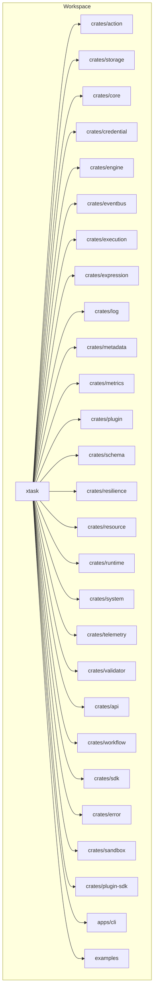
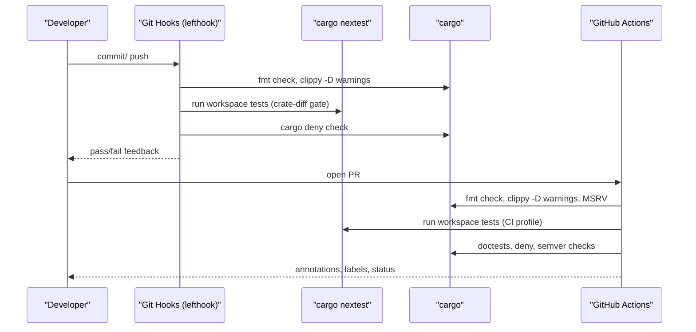
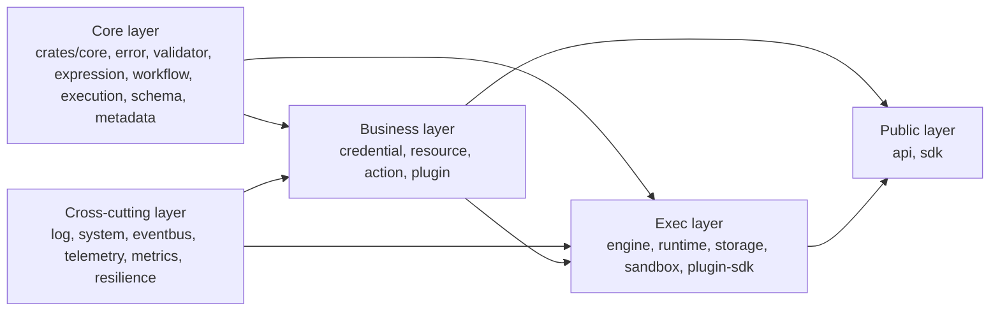

# Development and Contributing

<cite>
**Referenced Files in This Document**
- [CONTRIBUTING.md](file://CONTRIBUTING.md)
- [Cargo.toml](file://Cargo.toml)
- [docs/dev-setup.md](file://docs/dev-setup.md)
- [Taskfile.yml](file://Taskfile.yml)
- [scripts/install-tools.sh](file://scripts/install-tools.sh)
- [.github/PULL_REQUEST_TEMPLATE.md](file://.github/PULL_REQUEST_TEMPLATE.md)
- [.github/workflows/pr-validation.yml](file://.github/workflows/pr-validation.yml)
- [.github/CODEOWNERS](file://.github/CODEOWNERS)
- [.config/nextest.toml](file://.config/nextest.toml)
- [clippy.toml](file://clippy.toml)
- [rustfmt.toml](file://rustfmt.toml)
- [deny.toml](file://deny.toml)
</cite>

## Table of Contents
1. [Introduction](#introduction)
2. [Project Structure](#project-structure)
3. [Core Components](#core-components)
4. [Architecture Overview](#architecture-overview)
5. [Detailed Component Analysis](#detailed-component-analysis)
6. [Dependency Analysis](#dependency-analysis)
7. [Performance Considerations](#performance-considerations)
8. [Troubleshooting Guide](#troubleshooting-guide)
9. [Conclusion](#conclusion)
10. [Appendices](#appendices)

## Introduction
This document explains how to develop and contribute to Nebula. It covers the development environment setup, the Cargo workspace build system, the nextest-based testing framework, code quality gates, contribution workflow (issue reporting, pull requests, reviews, CI), coding standards and idioms, governance and community guidelines, and practical debugging and contribution scenarios. The goal is to help newcomers get productive quickly while providing deep technical context for experienced contributors.

## Project Structure
Nebula is a multi-crate Rust workspace with a strong emphasis on layered architecture and composability. The workspace includes core libraries, execution engines, integrations, applications (CLI and Desktop), and supporting tooling. A Taskfile orchestrates common developer tasks, while lefthook integrates pre-commit, commit-msg, and pre-push checks. nextest provides fast, parallelized test execution with CI-friendly profiles.

**Diagram sources**
- [Cargo.toml:1-40](file://Cargo.toml#L1-L40)
- [Taskfile.yml:32-40](file://Taskfile.yml#L32-L40)

**Section sources**
- [Cargo.toml:1-40](file://Cargo.toml#L1-L40)
- [Taskfile.yml:32-40](file://Taskfile.yml#L32-L40)

## Core Components
- Development environment: Rust toolchain (MSRV 1.95), nightly rustfmt, cargo-nextest, Taskfile, lefthook, and hygiene tools (typos, taplo).
- Build system: Cargo workspace with centralized dependency and lint policies; profiles tuned for dev, release, profiling, and benchmarking.
- Testing: nextest with default and CI profiles; doctests and integration tests complement unit tests.
- Code quality: rustfmt, Clippy (workspace lints), cargo-deny, cargo-semver-checks, cargo-audit, and sccache for caching.
- Contribution workflow: branch naming, conventional commits, PR templates, reviewer assignment, squash-merge, and CI gates.

**Section sources**
- [CONTRIBUTING.md:36-66](file://CONTRIBUTING.md#L36-L66)
- [Cargo.toml:43-305](file://Cargo.toml#L43-L305)
- [.config/nextest.toml:1-30](file://.config/nextest.toml#L1-L30)
- [Taskfile.yml:64-93](file://Taskfile.yml#L64-L93)
- [scripts/install-tools.sh:25-37](file://scripts/install-tools.sh#L25-L37)

## Architecture Overview
The development workflow is centered on a robust local gating system and CI parity. Lefthook enforces formatting, linting, spelling, TOML formatting, and license/advisory checks on pre-commit. The pre-push hook runs nextest and targeted cargo checks for changed crates. CI mirrors these gates and adds MSRV and doctest checks. The Taskfile consolidates frequent operations (build, check, fmt, clippy, test, doc, deny, docker, db, bench, desktop).

**Diagram sources**
- [docs/dev-setup.md:137-151](file://docs/dev-setup.md#L137-L151)
- [.github/workflows/pr-validation.yml:15-47](file://.github/workflows/pr-validation.yml#L15-L47)
- [.config/nextest.toml:8-21](file://.config/nextest.toml#L8-L21)
- [Taskfile.yml:283-308](file://Taskfile.yml#L283-L308)

## Detailed Component Analysis

### Development Environment Setup
- Install Rust toolchain and pick a default toolchain; the workspace MSRV is 1.95.
- Install dev tools with the bootstrap script; it uses cargo-binstall for speed and falls back to cargo install.
- Install lefthook hooks for pre-commit, commit-msg, and pre-push.
- Configure sccache for faster rebuilds; verify with sccache stats.
- Separate rust-analyzer target directory to avoid file-lock contention with cargo.
- Optional linker tuning for faster link times on Linux/macOS.

Concrete steps and rationale are documented in the developer setup guide.

**Section sources**
- [docs/dev-setup.md:1-22](file://docs/dev-setup.md#L1-L22)
- [docs/dev-setup.md:23-36](file://docs/dev-setup.md#L23-L36)
- [docs/dev-setup.md:48-67](file://docs/dev-setup.md#L48-L67)
- [docs/dev-setup.md:85-103](file://docs/dev-setup.md#L85-L103)
- [docs/dev-setup.md:109-136](file://docs/dev-setup.md#L109-L136)
- [scripts/install-tools.sh:1-58](file://scripts/install-tools.sh#L1-L58)

### Build System with Cargo Workspace
- The workspace aggregates crates and defines a central MSRV, edition, and package metadata.
- Workspace dependencies are declared once; crates opt in with workspace lints.
- Profiles:
  - dev: incremental, debug symbols.
  - release: thin LTO, parallel codegen-units, symbol stripping, abort panics for smaller binaries.
  - profiling: inherits release with debug info.
  - bench: debug symbols for benchmarks.
- The Taskfile wraps cargo commands for common tasks and exposes a dev pre-PR gate.

Key references:
- Workspace members and resolver.
- Centralized dependency and lint policies.
- Profile configurations.

**Section sources**
- [Cargo.toml:1-40](file://Cargo.toml#L1-L40)
- [Cargo.toml:55-141](file://Cargo.toml#L55-L141)
- [Cargo.toml:157-283](file://Cargo.toml#L157-L283)
- [Cargo.toml:284-305](file://Cargo.toml#L284-L305)
- [Taskfile.yml:32-60](file://Taskfile.yml#L32-L60)

### Testing Framework with nextest
- nextest replaces cargo test for speed and CI friendliness.
- Profiles:
  - default: parallelism based on CPU cores.
  - ci: retries, slow timeout, fail-fast, JUnit output.
  - agent: fail-fast, minimal output, short slow timeouts for LLM-driven workflows.
- CI mirrors pre-push coverage; pre-push focuses on changed crates.

**Section sources**
- [.config/nextest.toml:1-30](file://.config/nextest.toml#L1-L30)
- [docs/dev-setup.md:137-151](file://docs/dev-setup.md#L137-L151)
- [Taskfile.yml:283-308](file://Taskfile.yml#L283-L308)

### Code Quality Tools
- Formatting: nightly rustfmt with a stable toolchain for build/test; CI pins nightly for formatting checks.
- Linting: Clippy with workspace lints and per-crate overrides; test allowances for ergonomics.
- Hygiene: typos-cli, taplo-cli for spelling and TOML formatting.
- Supply chain/security: cargo-deny for advisories and license checks; cargo-audit for periodic scans.
- SemVer: cargo-semver-checks for compatibility gates.
- Sccache: compilation caching across branches and sessions.

**Section sources**
- [rustfmt.toml:1-56](file://rustfmt.toml#L1-L56)
- [clippy.toml:1-127](file://clippy.toml#L1-L127)
- [deny.toml:1-141](file://deny.toml#L1-L141)
- [scripts/install-tools.sh:25-37](file://scripts/install-tools.sh#L25-L37)

### Contribution Workflow
- Branch naming: use `<username>/neb-<id>-<kebab-title>` for issues or `<type>/<short-kebab-description>` otherwise.
- Conventional Commits enforced in CI and PR title validation.
- PR template includes summary, linked issues, type, affected crates, changes, test plan, breaking changes, docs checklist, safety/security impact, and reviewer notes.
- Auto-reviewer assignment via CODEOWNERS; security-sensitive paths require owner sign-off.
- Squash-merge only; keep main history linear.
- CI gates: fmt, clippy -D warnings, nextest, doctests, MSRV, all-features/no-default-features, cargo deny.

**Section sources**
- [CONTRIBUTING.md:71-117](file://CONTRIBUTING.md#L71-L117)
- [CONTRIBUTING.md:120-141](file://CONTRIBUTING.md#L120-L141)
- [.github/PULL_REQUEST_TEMPLATE.md:1-95](file://.github/PULL_REQUEST_TEMPLATE.md#L1-L95)
- [.github/workflows/pr-validation.yml:15-47](file://.github/workflows/pr-validation.yml#L15-L47)
- [.github/CODEOWNERS:1-85](file://.github/CODEOWNERS#L1-L85)

### Coding Standards and Idioms
- Formatting: nightly rustfmt; CI formatting check pinned to nightly.
- Linting: Clippy with workspace lints; zero warnings in library code; tests and binaries may use expect/unwrap for ergonomics.
- Error handling: thiserror in libraries, anyhow in binaries; doc comments on public items.
- Idioms and anti-patterns are documented in STYLE guidelines; error taxonomy and modern Rust practices are covered in dedicated docs.

**Section sources**
- [CONTRIBUTING.md:83-93](file://CONTRIBUTING.md#L83-L93)
- [rustfmt.toml:1-12](file://rustfmt.toml#L1-L12)
- [clippy.toml:51-62](file://clippy.toml#L51-L62)

### Governance and Community Guidelines
- Maintainer: @vanyastaff owns the majority of the repository via CODEOWNERS.
- Security-sensitive paths require owner sign-off.
- PR template includes a safety/security checklist for critical areas.
- Community expectations and operational guidance for AI-assisted coding are outlined in CLAUDE.md.

**Section sources**
- [.github/CODEOWNERS:9-11](file://.github/CODEOWNERS#L9-L11)
- [.github/CODEOWNERS:45-56](file://.github/CODEOWNERS#L45-L56)
- [.github/PULL_REQUEST_TEMPLATE.md:84-91](file://.github/PULL_REQUEST_TEMPLATE.md#L84-L91)
- [CONTRIBUTING.md:144-161](file://CONTRIBUTING.md#L144-L161)

### Practical Scenarios and Recipes
- Set up environment and install tools:
  - Install rustup, run the tool installer script, install lefthook hooks.
  - Mirror agent environment variables for consistent CI-like runs.
- Run the pre-PR gate locally:
  - Use the Taskfile dev-check task to run formatting, clippy, nextest, doctests, and deny checks.
- Run tests efficiently:
  - Use cargo nextest run for parallelized tests; leverage the agent profile for LLM-driven scripts.
- Build and document:
  - Use Taskfile build/release/doc tasks; adjust flags via CARGO_FLAGS variable.
- Database and infrastructure:
  - Use Taskfile db:* tasks to manage local Postgres and migrations; docker compose tasks for self-hosted stacks.
- Desktop app:
  - Use Taskfile desktop:* tasks to install dependencies, run dev mode, and build the Tauri app.

**Section sources**
- [docs/dev-setup.md:12-19](file://docs/dev-setup.md#L12-L19)
- [scripts/install-tools.sh:13-18](file://scripts/install-tools.sh#L13-L18)
- [Taskfile.yml:283-308](file://Taskfile.yml#L283-L308)
- [Taskfile.yml:96-124](file://Taskfile.yml#L96-L124)
- [Taskfile.yml:156-198](file://Taskfile.yml#L156-L198)
- [Taskfile.yml:257-280](file://Taskfile.yml#L257-L280)

## Dependency Analysis
The workspace enforces architectural layering and dependency bans to maintain separation of concerns. cargo-deny prevents lower layers from depending on upper layers directly, and it ignores benign duplicates and specific crates where appropriate.

**Diagram sources**
- [deny.toml:41-86](file://deny.toml#L41-L86)

**Section sources**
- [deny.toml:41-86](file://deny.toml#L41-L86)

## Performance Considerations
- Use sccache to cache compilations across branches and sessions; verify cache hits.
- Separate rust-analyzer target directory to avoid file-lock contention during indexing and builds.
- Prefer thin LTO in release builds for a balance between stability and optimization.
- Use nextest for parallelized tests; leverage the agent profile for fast, low-noise feedback in LLM workflows.
- Tune linker on Linux/macOS for faster link times if desired, while keeping CI defaults stable.

**Section sources**
- [docs/dev-setup.md:51-67](file://docs/dev-setup.md#L51-L67)
- [docs/dev-setup.md:85-103](file://docs/dev-setup.md#L85-L103)
- [Cargo.toml:290-297](file://Cargo.toml#L290-L297)
- [.config/nextest.toml:22-30](file://.config/nextest.toml#L22-L30)
- [docs/dev-setup.md:115-136](file://docs/dev-setup.md#L115-L136)

## Troubleshooting Guide
- Pre-push too slow: ensure sccache is configured and active; warm caches improve performance.
- Lefthook not running: reinstall hooks and verify hook existence.
- convco not found: install via cargo or rerun the tool installer script.
- MSRV failures: install the pinned toolchain or rely on CI MSRV checks.
- IDE/editor contention: ensure rust-analyzer writes to a separate target directory.
- Linker not found: install the required linker or remove personal overrides.

**Section sources**
- [docs/dev-setup.md:184-200](file://docs/dev-setup.md#L184-L200)

## Conclusion
Nebula’s development workflow emphasizes fast iteration, strong quality gates, and clear contribution practices. By aligning local tooling with CI, enforcing architectural layering, and providing comprehensive developer tasks, contributors can move quickly while maintaining code quality and system reliability.

## Appendices

### Quick Start Commands
- Clone, build, test, and full pre-PR gate:
  - cargo build --workspace
  - cargo nextest run --workspace
  - task dev:check

**Section sources**
- [CONTRIBUTING.md:14-27](file://CONTRIBUTING.md#L14-L27)
- [Taskfile.yml:300-308](file://Taskfile.yml#L300-L308)