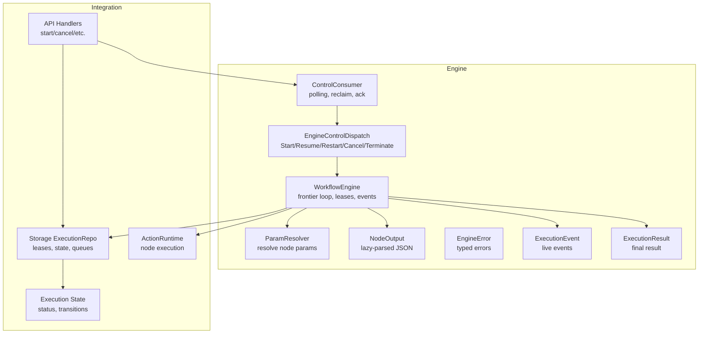
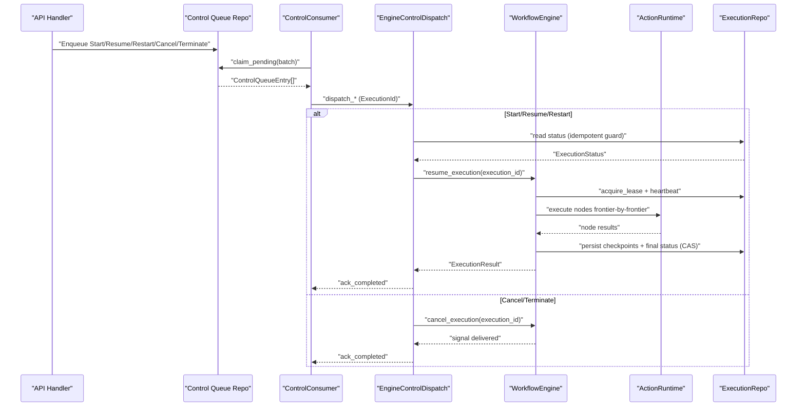
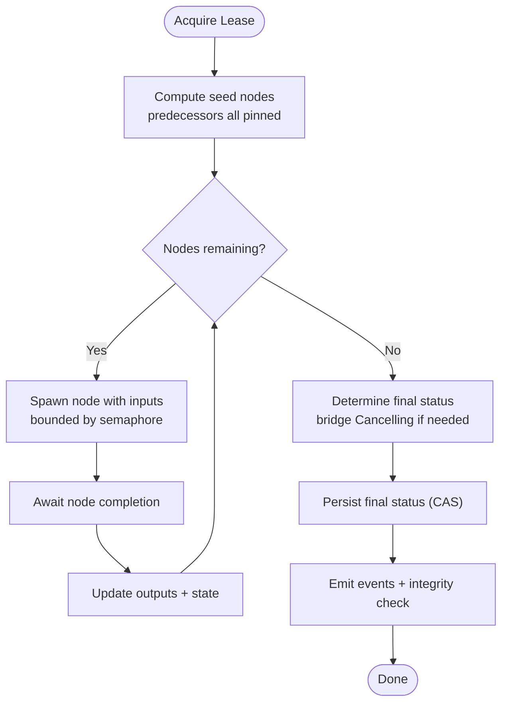
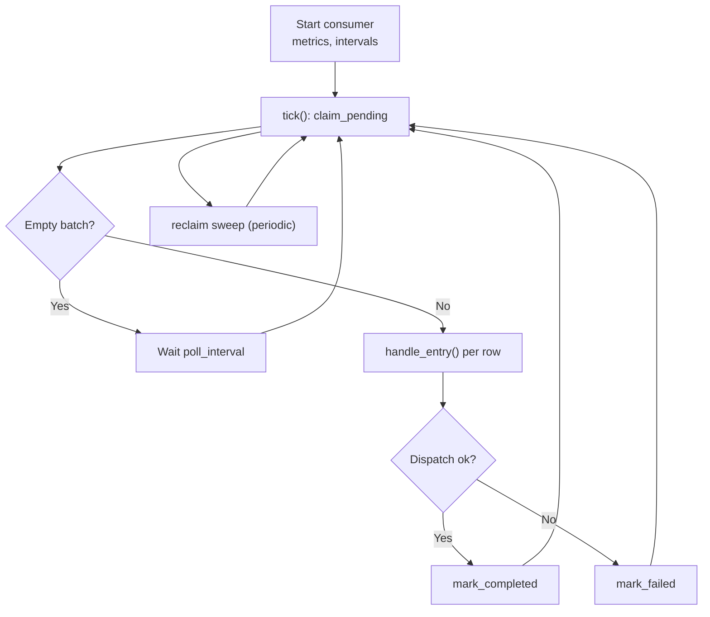
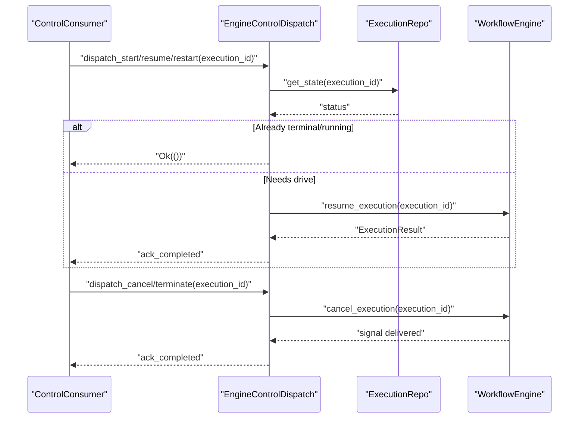
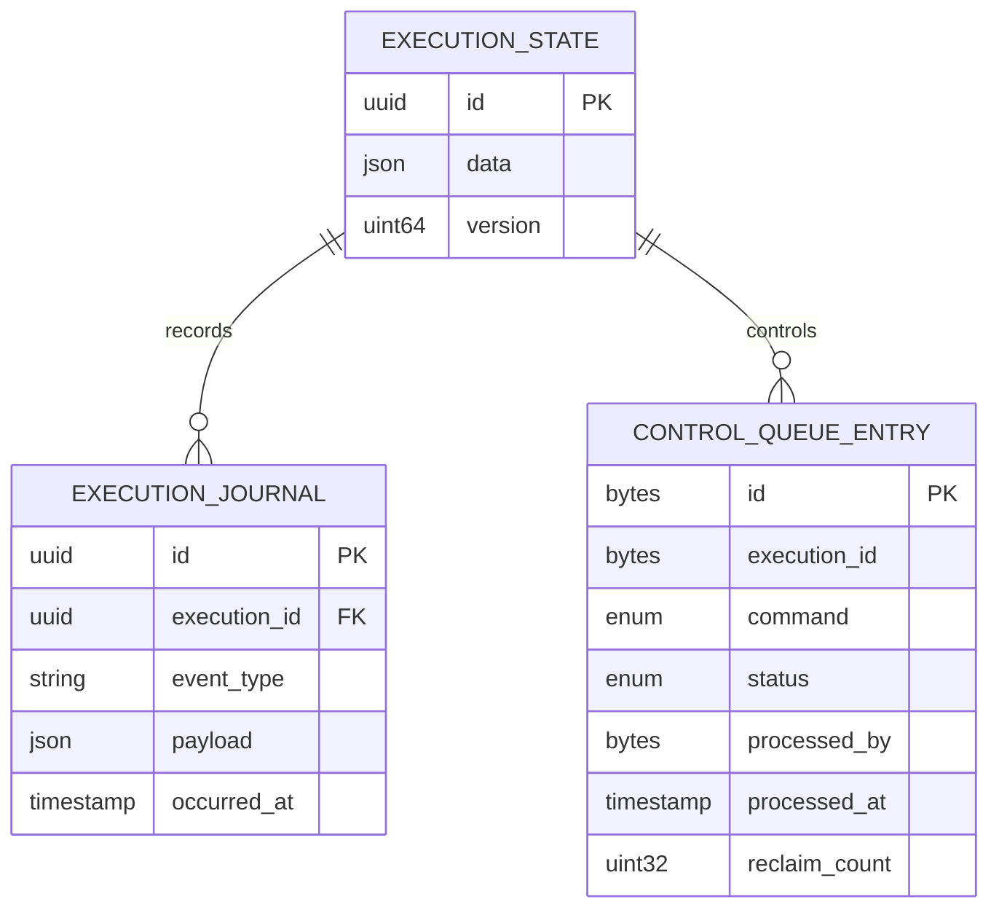
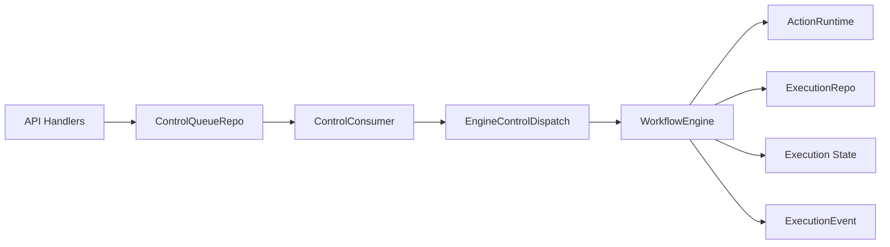

# Engine Orchestration

<cite>
**Referenced Files in This Document**
- [engine.rs](file://crates/engine/src/engine.rs)
- [control_consumer.rs](file://crates/engine/src/control_consumer.rs)
- [control_dispatch.rs](file://crates/engine/src/control_dispatch.rs)
- [error.rs](file://crates/engine/src/error.rs)
- [event.rs](file://crates/engine/src/event.rs)
- [result.rs](file://crates/engine/src/result.rs)
- [resolver.rs](file://crates/engine/src/resolver.rs)
- [node_output.rs](file://crates/engine/src/node_output.rs)
- [execution_repo.rs](file://crates/storage/src/execution_repo.rs)
- [execution.rs](file://crates/storage/src/repos/execution.rs)
- [execution.rs](file://crates/api/src/handlers/execution.rs)
- [execution.rs](file://crates/api/src/models/execution.rs)
- [execution.rs](file://crates/api/src/routes/execution.rs)
- [execution.rs](file://crates/execution/src/state.rs)
- [execution.rs](file://crates/execution/src/transition.rs)
- [execution.rs](file://crates/execution/src/status.rs)
- [execution.rs](file://crates/execution/src/context.rs)
- [execution.rs](file://crates/execution/src/journal.rs)
- [execution.rs](file://crates/execution/src/replay.rs)
- [execution.rs](file://crates/execution/src/attempt.rs)
- [execution.rs](file://crates/execution/src/output.rs)
- [execution.rs](file://crates/execution/src/plan.rs)
- [execution.rs](file://crates/execution/src/result.rs)
- [execution.rs](file://crates/execution/src/error.rs)
- [execution.rs](file://crates/execution/src/idempotency.rs)
- [execution.rs](file://crates/execution/src/replay.rs)
- [execution.rs](file://crates/execution/src/state.rs)
- [execution.rs](file://crates/execution/src/status.rs)
- [execution.rs](file://crates/execution/src/transition.rs)
- [execution.rs](file://crates/execution/src/context.rs)
- [execution.rs](file://crates/execution/src/journal.rs)
- [execution.rs](file://crates/execution/src/replay.rs)
- [execution.rs](file://crates/execution/src/attempt.rs)
- [execution.rs](file://crates/execution/src/output.rs)
- [execution.rs](file://crates/execution/src/plan.rs)
- [execution.rs](file://crates/execution/src/result.rs)
- [execution.rs](file://crates/execution/src/error.rs)
- [execution.rs](file://crates/execution/src/idempotency.rs)
- [execution.rs](file://crates/execution/src/replay.rs)
- [execution.rs](file://crates/execution/src/state.rs)
- [execution.rs](file://crates/execution/src/status.rs)
- [execution.rs](file://crates/execution/src/transition.rs)
- [execution.rs](file://crates/execution/src/context.rs)
- [execution.rs](file://crates/execution/src/journal.rs)
- [execution.rs](file://crates/execution/src/replay.rs)
- [execution.rs](file://crates/execution/src/attempt.rs)
- [execution.rs](file://crates/execution/src/output.rs)
- [execution.rs](file://crates/execution/src/plan.rs)
- [execution.rs](file://crates/execution/src/result.rs)
- [execution.rs](file://crates/execution/src/error.rs)
- [execution.rs](file://crates/execution/src/idempotency.rs)
- [execution.rs](file://crates/execution/src/replay.rs)
- [execution.rs](file://crates/execution/src/state.rs)
- [execution.rs](file://crates/execution/src/status.rs)
- [execution.rs](file://crates/execution/src/transition.rs)
- [execution.rs](file://crates/execution/src/context.rs)
- [execution.rs](file://crates/execution/src/journal.rs)
- [execution.rs](file://crates/execution/src/replay.rs)
- [execution.rs](file://crates/execution/src/attempt.rs)
- [execution.rs](file://crates/execution/src/output.rs)
- [execution.rs](file://crates/execution/src/plan.rs)
- [execution.rs](file://crates/execution/src/result.rs)
- [execution.rs](file://crates/execution/src/error.rs)
- [execution.rs](file://crates/execution/src/idempotency.rs)
- [execution.rs](file://crates/execution/src/replay.rs)
- [execution.rs](file://crates/execution/src/state.rs)
- [execution.rs](file://crates/execution/src/status.rs)
- [execution.rs](file://crates/execution/src/transition.rs)
- [execution.rs](file://crates/execution/src/context.rs)
- [execution.rs](file://crates/execution/src/journal.rs)
- [execution.rs](file://crates/execution/src/replay.rs)
- [execution.rs](file://crates/execution/src/attempt.rs)
- [execution.rs](file://crates/execution/src/output.rs)
- [execution.rs](file://crates/execution/src/plan.rs)
- [execution.rs](file://crates/execution/src/result.rs)
- [execution.rs](file://crates/execution/src/error.rs)
- [execution.rs](file://crates/execution/src/idempotency.rs)
- [execution.rs](file://crates/execution/src/replay.rs)
- [execution.rs](file://crates/execution/src/state.rs)
- [execution.rs](file://crates/execution/src/status.rs)
- [execution.rs](file://crates/execution/src/transition.rs)
- [execution.rs](file://crates/execution/src/context.rs)
- [execution.rs](file://crates/execution/src/journal.rs)
- [execution.rs](file://crates/execution/src/replay.rs)
- [execution.rs](file://crates/execution/src/attempt.rs)
- [execution.rs](file://crates/execution/src/output.rs)
- [execution.rs](file://crates/execution/src/plan.rs)
- [execution.rs](file://crates/execution/src/result.rs)
- [execution.rs](file://crates/execution/src/error.rs)
- [execution.rs](file://crates/execution/src/idempotency.rs)
- [execution.rs](file://crates/execution/src/replay.rs)
- [execution.rs](file://crates/execution/src/state.rs)
- [execution.rs](file://crates/execution/src/status.rs)
- [execution.rs](file://crates/execution/src/transition.rs)
- [execution.rs](file://crates/execution/src/context.rs)
- [execution.rs](file://crates/execution/src/journal.rs)
- [execution.rs](file://crates/execution/src/replay.rs)
- [execution.rs](file://crates/execution/src/attempt.rs)
- [execution.rs](file://crates/execution/src/output.rs)
- [execution.rs](file://crates/execution/src/plan.rs)
- [execution.rs](file://crates/execution/src/result.rs)
- [execution.rs](file://crates/execution/src/error.rs)
- [execution.rs](file://crates/execution/src/idempotency.rs)
- [execution.rs](file://crates/execution/src/replay.rs)
- [execution.rs](file://crates/execution/src/state.rs)
- [execution.rs](file://crates/execution/src/status.rs)
- [execution.rs](file://cr......)
</cite>

## Table of Contents
1. [Introduction](#introduction)
2. [Project Structure](#project-structure)
3. [Core Components](#core-components)
4. [Architecture Overview](#architecture-overview)
5. [Detailed Component Analysis](#detailed-component-analysis)
6. [Dependency Analysis](#dependency-analysis)
7. [Performance Considerations](#performance-considerations)
8. [Troubleshooting Guide](#troubleshooting-guide)
9. [Conclusion](#conclusion)
10. [Appendices](#appendices)

## Introduction
This document explains Nebula’s Engine Orchestration subsystem, focusing on the WorkflowEngine implementation, control plane, durable queue processing, frontier loop execution model, lease management, and execution state transitions. It covers how control commands (Start/Resume/Restart/Cancel/Terminate) are received and dispatched, how credentials and resources are resolved and accessed, and how the engine coordinates with runtime scheduling, storage persistence, and the API layer. It also provides configuration options, error handling strategies, performance considerations, monitoring, and recovery mechanisms.

## Project Structure
The engine crate exposes the orchestration core and integrates with storage, runtime, execution state, and API layers. Key modules include:
- WorkflowEngine: orchestrates execution, manages leases, and drives the frontier loop
- ControlConsumer: durable queue consumer for control commands
- EngineControlDispatch: engine-owned dispatch implementation for control commands
- ExecutionResult: final execution summary
- ExecutionEvent: observable events for live monitoring
- ParamResolver: parameter resolution pipeline
- NodeOutput: efficient node output representation
- Error types: typed engine errors and classifications

**Diagram sources**
- [engine.rs](file://crates/engine/src/engine.rs)
- [control_consumer.rs](file://crates/engine/src/control_consumer.rs)
- [control_dispatch.rs](file://crates/engine/src/control_dispatch.rs)
- [resolver.rs](file://crates/engine/src/resolver.rs)
- [node_output.rs](file://crates/engine/src/node_output.rs)
- [error.rs](file://crates/engine/src/error.rs)
- [event.rs](file://crates/engine/src/event.rs)
- [result.rs](file://crates/engine/src/result.rs)
- [execution_repo.rs](file://crates/storage/src/execution_repo.rs)

**Section sources**
- [engine.rs](file://crates/engine/src/engine.rs)
- [control_consumer.rs](file://crates/engine/src/control_consumer.rs)
- [control_dispatch.rs](file://crates/engine/src/control_dispatch.rs)
- [resolver.rs](file://crates/engine/src/resolver.rs)
- [node_output.rs](file://crates/engine/src/node_output.rs)
- [error.rs](file://crates/engine/src/error.rs)
- [event.rs](file://crates/engine/src/event.rs)
- [result.rs](file://crates/engine/src/result.rs)

## Core Components
- WorkflowEngine: orchestrates node execution frontier-by-frontier with bounded concurrency, evaluates edge conditions, resolves parameters, delegates to ActionRuntime, tracks state, and emits events. It manages execution leases and a registry of running executions for cooperative cancellation.
- ControlConsumer: drains the durable execution_control_queue, claims batches, dispatches typed commands to EngineControlDispatch, handles reclaim sweeps, and acknowledges completion or failure.
- EngineControlDispatch: translates control commands into engine actions, performs idempotent checks against ExecutionRepo, and signals the engine’s cancel registry.
- ExecutionResult: encapsulates final status, node outputs/errors, and duration.
- ExecutionEvent: live observability events for node lifecycle and execution completion.
- ParamResolver: resolves node parameters from expressions, templates, literals, and predecessor outputs.
- NodeOutput: zero-copy lazy-parsed JSON for node outputs.

**Section sources**
- [engine.rs](file://crates/engine/src/engine.rs)
- [control_consumer.rs](file://crates/engine/src/control_consumer.rs)
- [control_dispatch.rs](file://crates/engine/src/control_dispatch.rs)
- [result.rs](file://crates/engine/src/result.rs)
- [event.rs](file://crates/engine/src/event.rs)
- [resolver.rs](file://crates/engine/src/resolver.rs)
- [node_output.rs](file://crates/engine/src/node_output.rs)

## Architecture Overview
The engine is the control plane for workflow execution. It receives control commands from the API layer via the control queue, validates idempotency against storage, and either drives execution or signals cancellation. Execution state is persisted via ExecutionRepo with CAS semantics, and the engine emits live events for monitoring.

**Diagram sources**
- [control_consumer.rs](file://crates/engine/src/control_consumer.rs)
- [control_dispatch.rs](file://crates/engine/src/control_dispatch.rs)
- [engine.rs](file://crates/engine/src/engine.rs)
- [execution_repo.rs](file://crates/storage/src/execution_repo.rs)

## Detailed Component Analysis

### WorkflowEngine: Frontier Loop and Lease Management
- Initialization and configuration:
  - Builder-style configuration for ActionRuntime, MetricsRegistry, PluginRegistry, ParamResolver, ExpressionEngine, optional ExecutionRepo/WorkflowRepo, CredentialResolver/Refresh hooks, ActionCredentials allowlists, event sender, and lease TTL/heartbeat.
  - InstanceId is generated once and used as the lease holder string for durable fencing.
- Lease lifecycle:
  - Acquires an execution lease with TTL and spawns a heartbeat task; returns a LeaseGuard used to coordinate shutdown and detect heartbeat loss.
  - The “single runner fence” is enforced by the lease; concurrent attempts back off with EngineError::Leased.
- Running registry:
  - Tracks in-flight executions with a monotonic registration nonce to prevent race conditions on drop.
- Frontier loop:
  - Executes nodes as soon as all predecessors are resolved and at least one is activated (branching, skip propagation, error routing).
  - Uses a Semaphore to bound concurrency, a CancellationToken for cooperative cancellation, and a DashMap for node outputs.
  - Emits ExecutionEvent for node lifecycle and execution completion; enforces frontier integrity and reports violations.
- Replay:
  - Supports replay from a specific node with pinned outputs and a rerun set, ensuring deterministic behavior and CAS-aware transitions.

**Diagram sources**
- [engine.rs](file://crates/engine/src/engine.rs)

**Section sources**
- [engine.rs](file://crates/engine/src/engine.rs)
- [error.rs](file://crates/engine/src/error.rs)

### ControlConsumer: Durable Queue Consumption and Reclaim
- Polling loop with configurable batch size, poll interval, and exponential backoff on storage errors.
- Claim/ack plumbing: claim_pending, mark_completed, mark_failed; malformed execution_id rows are rejected.
- Reclaim sweep: periodically reclaims stuck Processing rows after DEFAULT_RECLAIM_AFTER, incrementing labeled counters in the metrics registry.
- Idempotency: dispatch methods must be idempotent per (execution_id, command) pair; the consumer relies on this contract.

**Diagram sources**
- [control_consumer.rs](file://crates/engine/src/control_consumer.rs)

**Section sources**
- [control_consumer.rs](file://crates/engine/src/control_consumer.rs)

### Control Dispatch: Start/Resume/Restart/Cancel/Terminate
- EngineControlDispatch binds WorkflowEngine and ExecutionRepo to enforce idempotency:
  - Start/Resume/Restart: converge on resume_execution; idempotency checks short-circuit if already terminal or already running.
  - Cancel/Terminate: always signal the engine’s cancel registry; underlying CancellationToken is idempotent; orphan commands are rejected.
- The dispatch reads persisted status to avoid races and divergent state between consumer and engine.

**Diagram sources**
- [control_dispatch.rs](file://crates/engine/src/control_dispatch.rs)
- [engine.rs](file://crates/engine/src/engine.rs)
- [execution_repo.rs](file://crates/storage/src/execution_repo.rs)

**Section sources**
- [control_dispatch.rs](file://crates/engine/src/control_dispatch.rs)
- [engine.rs](file://crates/engine/src/engine.rs)

### Execution State Transitions and CAS Semantics
- ExecutionRepo provides durable state with versioned transitions (CAS semantics) used throughout the engine.
- The engine enforces:
  - Single-runner fence via leases
  - Integrity checks to avoid reporting Completed with non-terminal nodes
  - CAS conflicts surfaced as EngineError::CasConflict
- Execution state, status, transitions, and journal are modeled in the execution crate and persisted via ExecutionRepo.

**Diagram sources**
- [execution_repo.rs](file://crates/storage/src/execution_repo.rs)
- [execution.rs](file://crates/execution/src/state.rs)
- [execution.rs](file://crates/execution/src/transition.rs)
- [execution.rs](file://crates/execution/src/status.rs)
- [execution.rs](file://crates/execution/src/journal.rs)

**Section sources**
- [execution_repo.rs](file://crates/storage/src/execution_repo.rs)
- [execution.rs](file://crates/execution/src/state.rs)
- [execution.rs](file://crates/execution/src/transition.rs)
- [execution.rs](file://crates/execution/src/status.rs)
- [execution.rs](file://crates/execution/src/journal.rs)

### Parameter Resolution and Node Outputs
- ParamResolver builds an EvaluationContext from predecessor inputs and node outputs, resolving expressions, templates, and references.
- NodeOutput provides zero-copy sharing of raw JSON and caches a parsed Value for reuse.

**Section sources**
- [resolver.rs](file://crates/engine/src/resolver.rs)
- [node_output.rs](file://crates/engine/src/node_output.rs)

### Credential Resolution and Resource Accessors
- WorkflowEngine supports optional CredentialResolver and proactive CredentialRefresh hooks.
- ActionCredentials allowlists enforce deny-by-default for credential acquisition per ActionKey.
- EngineCredentialAccessor and EngineResourceAccessor are injected into action contexts.

**Section sources**
- [engine.rs](file://crates/engine/src/engine.rs)

### API Layer Interfaces and Control Queue Integration
- API handlers enqueue control commands (start, cancel, etc.) into the control queue.
- The queue is consumed by ControlConsumer and dispatched by EngineControlDispatch to WorkflowEngine.

**Section sources**
- [execution.rs](file://crates/api/src/handlers/execution.rs)
- [execution.rs](file://crates/api/src/models/execution.rs)
- [execution.rs](file://crates/api/src/routes/execution.rs)
- [control_consumer.rs](file://crates/engine/src/control_consumer.rs)

## Dependency Analysis
- WorkflowEngine depends on:
  - ActionRuntime for node execution
  - ExecutionRepo for durable state and leases
  - Execution crate for status, transitions, and planning
  - Storage crate for queue and state repositories
  - MetricsRegistry for telemetry
  - Eventbus for ExecutionEvent emission
- ControlConsumer depends on:
  - ControlQueueRepo for durable queue operations
  - MetricsRegistry for reclaim counters
- EngineControlDispatch depends on:
  - ExecutionRepo for idempotency reads
  - WorkflowEngine for execution orchestration

**Diagram sources**
- [execution.rs](file://crates/api/src/handlers/execution.rs)
- [control_consumer.rs](file://crates/engine/src/control_consumer.rs)
- [control_dispatch.rs](file://crates/engine/src/control_dispatch.rs)
- [engine.rs](file://crates/engine/src/engine.rs)
- [execution_repo.rs](file://crates/storage/src/execution_repo.rs)

**Section sources**
- [engine.rs](file://crates/engine/src/engine.rs)
- [control_consumer.rs](file://crates/engine/src/control_consumer.rs)
- [control_dispatch.rs](file://crates/engine/src/control_dispatch.rs)
- [execution_repo.rs](file://crates/storage/src/execution_repo.rs)

## Performance Considerations
- Concurrency control:
  - Bounded by a Semaphore in the frontier loop; tune max_concurrent_nodes via ExecutionBudget.
- Event channel:
  - DEFAULT_EVENT_CHANNEL_CAPACITY bounds memory growth; events are dropped on overflow to avoid stalling the engine.
- Lease tuning:
  - DEFAULT_EXECUTION_LEASE_TTL and DEFAULT_EXECUTION_LEASE_HEARTBEAT_INTERVAL balance crash detection and GC pauses; adjust only in tests or specialized deployments.
- Parameter resolution:
  - ExpressionEngine caching reduces repeated evaluation overhead.
- Backoff and batching:
  - ControlConsumer uses exponential backoff and configurable batch sizes to reduce queue round-trips and operator noise.

[No sources needed since this section provides general guidance]

## Troubleshooting Guide
Common issues and remedies:
- Lease conflicts (EngineError::Leased):
  - Indicates another runner owns the execution; back off and retry. Check instance_id correlation in logs.
- Frontics integrity violations:
  - EngineError::FrontierIntegrity indicates non-terminal nodes at loop exit; investigate scheduler bookkeeping bugs.
- CAS conflicts:
  - EngineError::CasConflict indicates external state transitions; reconcile and retry.
- Control queue reclaim:
  - Reclaim sweep logs show reclaimed/exhausted counts; monitor for sustained exhaustion indicating persistent crashes or slow consumers.
- Event channel drops:
  - EngineError::Leased and warn logs indicate a slow or full event consumer; increase capacity or reduce event volume.

Operational checks:
- Verify ExecutionRepo availability and connectivity
- Confirm ControlConsumer metrics counters for reclaim outcomes
- Monitor lease TTL vs. heartbeat interval alignment
- Validate ActionCredentials allowlists for credential access

**Section sources**
- [error.rs](file://crates/engine/src/error.rs)
- [control_consumer.rs](file://crates/engine/src/control_consumer.rs)
- [engine.rs](file://crates/engine/src/engine.rs)

## Conclusion
Nebula’s Engine Orchestration provides a robust, durable, and observable workflow execution engine. It enforces single-runner fencing via leases, ensures idempotent control dispatch, and maintains integrity through CAS-backed state transitions. The frontier loop model enables responsive, branching execution with bounded concurrency, while the control plane integrates tightly with the API and storage layers for reliable, recoverable operations.

[No sources needed since this section summarizes without analyzing specific files]

## Appendices

### Configuration Options
- WorkflowEngine:
  - Lease TTL and heartbeat interval
  - Event channel capacity
  - Credential resolver and refresh hooks
  - ActionCredentials allowlists
  - ExecutionRepo and WorkflowRepo binding
- ControlConsumer:
  - Batch size, poll interval, reclaim windows, and max reclaim count
  - Metrics registry injection for reclaim counters

**Section sources**
- [engine.rs](file://crates/engine/src/engine.rs)
- [control_consumer.rs](file://crates/engine/src/control_consumer.rs)

### Monitoring and Observability
- ExecutionEvent stream for node lifecycle and execution completion
- MetricsRegistry for engine-specific counters and gauges
- Reclaim sweep counters for stuck row recovery visibility

**Section sources**
- [event.rs](file://crates/engine/src/event.rs)
- [control_consumer.rs](file://crates/engine/src/control_consumer.rs)

### Recovery Mechanisms
- Lease-based recovery: lost heartbeats expire the lease; another runner can claim ownership
- Reclaim sweep: recovers stuck Processing rows after DEFAULT_RECLAIM_AFTER
- Replay: supports replay from a specific node with pinned outputs and rerun set

**Section sources**
- [engine.rs](file://crates/engine/src/engine.rs)
- [control_consumer.rs](file://crates/engine/src/control_consumer.rs)