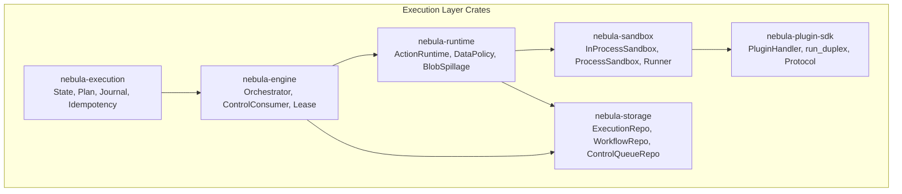
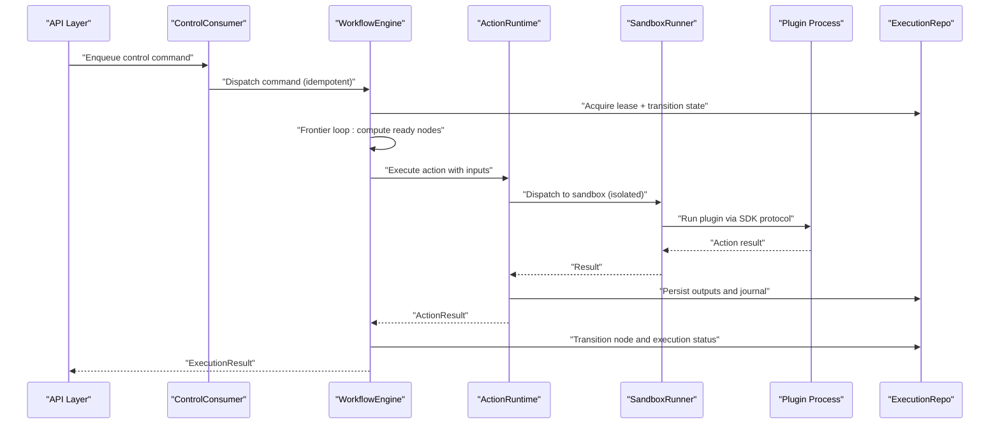
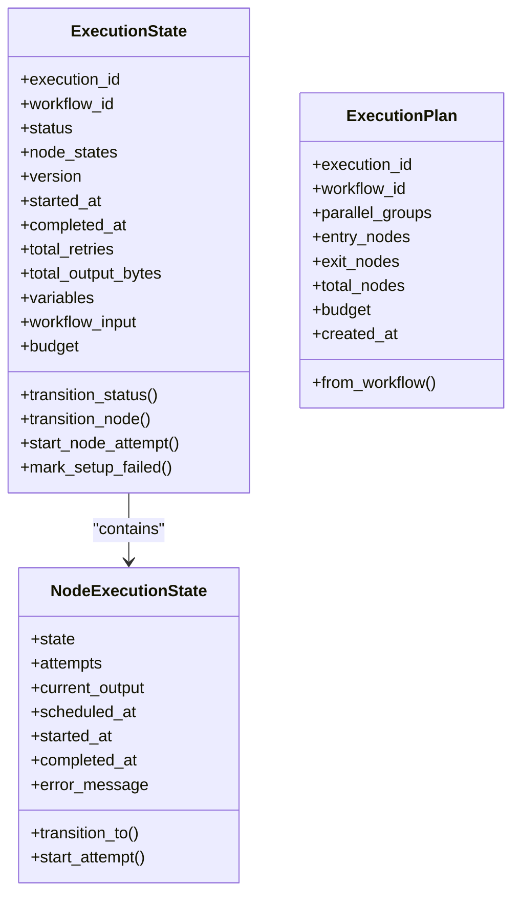
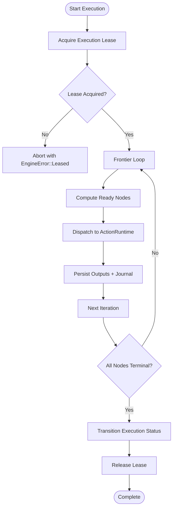
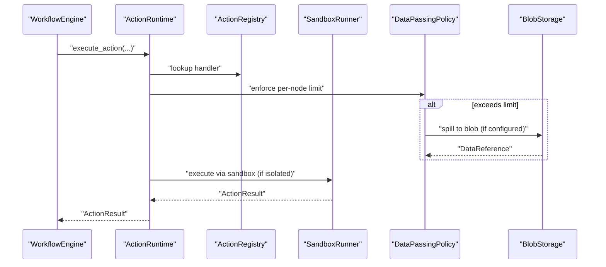
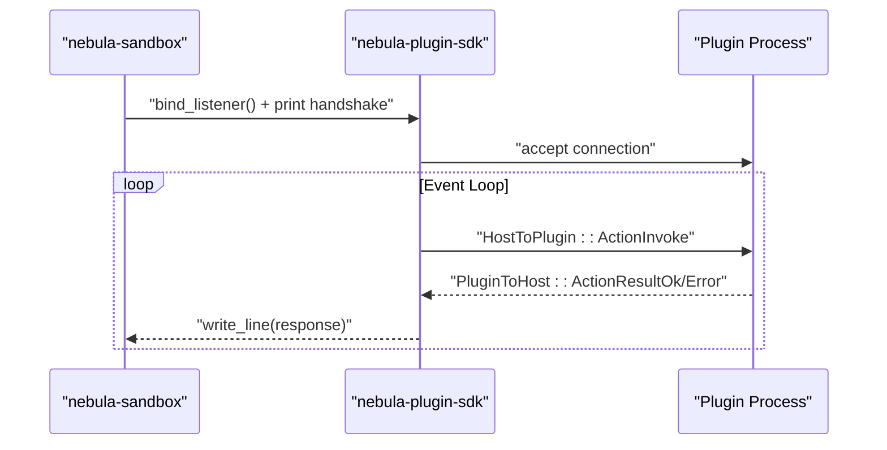
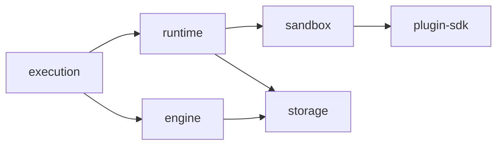

# Execution Layer Documentation

<cite>
**Referenced Files in This Document**
- [Cargo.toml](file://crates/execution/Cargo.toml)
- [lib.rs](file://crates/execution/src/lib.rs)
- [state.rs](file://crates/execution/src/state.rs)
- [status.rs](file://crates/execution/src/status.rs)
- [plan.rs](file://crates/execution/src/plan.rs)
- [Cargo.toml](file://crates/engine/Cargo.toml)
- [lib.rs](file://crates/engine/src/lib.rs)
- [engine.rs](file://crates/engine/src/engine.rs)
- [control_consumer.rs](file://crates/engine/src/control_consumer.rs)
- [Cargo.toml](file://crates/runtime/Cargo.toml)
- [lib.rs](file://crates/runtime/src/lib.rs)
- [runtime.rs](file://crates/runtime/src/runtime.rs)
- [Cargo.toml](file://crates/sandbox/Cargo.toml)
- [lib.rs](file://crates/sandbox/src/lib.rs)
- [Cargo.toml](file://crates/plugin-sdk/Cargo.toml)
- [lib.rs](file://crates/plugin-sdk/src/lib.rs)
- [Cargo.toml](file://crates/storage/Cargo.toml)
- [lib.rs](file://crates/storage/src/lib.rs)
</cite>

## Table of Contents
1. [Introduction](#introduction)
2. [Project Structure](#project-structure)
3. [Core Components](#core-components)
4. [Architecture Overview](#architecture-overview)
5. [Detailed Component Analysis](#detailed-component-analysis)
6. [Dependency Analysis](#dependency-analysis)
7. [Performance Considerations](#performance-considerations)
8. [Troubleshooting Guide](#troubleshooting-guide)
9. [Conclusion](#conclusion)

## Introduction
This document explains Nebula’s Execution Layer: how workflows are planned, scheduled, executed, and persisted. It covers the workflow execution engine, runtime scheduling and dispatch, storage persistence with repository patterns, sandbox isolation for process execution, and the plugin SDK for out-of-process communication. It also documents the frontier loop, lease management, node scheduling, blob spillage, and durable queue consumer patterns, with concrete references to the codebase and practical guidance for both beginners and advanced users.

## Project Structure
The Execution Layer spans several crates:
- execution: execution state machine, planning, journaling, idempotency
- engine: workflow execution orchestrator, control queue consumer, lease management, frontier loop
- runtime: action dispatcher, data policy enforcement, blob spillage, stateful checkpointing
- sandbox: in-process and child-process isolation, plugin broker, capability model
- plugin-sdk: plugin-side duplex protocol, metadata exchange, error model
- storage: repository interfaces for execution/workflow persistence, control queue

**Diagram sources**
- [Cargo.toml:14-21](file://crates/execution/Cargo.toml#L14-L21)
- [Cargo.toml:24-39](file://crates/engine/Cargo.toml#L24-L39)
- [Cargo.toml:14-29](file://crates/runtime/Cargo.toml#L14-L29)
- [Cargo.toml:15-24](file://crates/sandbox/Cargo.toml#L15-L24)
- [Cargo.toml:14-24](file://crates/plugin-sdk/Cargo.toml#L14-L24)
- [Cargo.toml:14-27](file://crates/storage/Cargo.toml#L14-L27)

**Section sources**
- [Cargo.toml:1-25](file://crates/execution/Cargo.toml#L1-L25)
- [Cargo.toml:1-69](file://crates/engine/Cargo.toml#L1-L69)
- [Cargo.toml:1-47](file://crates/runtime/Cargo.toml#L1-L47)
- [Cargo.toml:1-44](file://crates/sandbox/Cargo.toml#L1-L44)
- [Cargo.toml:1-52](file://crates/plugin-sdk/Cargo.toml#L1-L52)
- [Cargo.toml:1-94](file://crates/storage/Cargo.toml#L1-L94)

## Core Components
- Execution crate: defines the execution state machine, planning, idempotency, and journaling. It is the state and planning layer, not the orchestrator or storage implementation.
- Engine crate: orchestrates workflow execution, manages leases, runs the frontier loop, and consumes control commands from a durable queue.
- Runtime crate: dispatches actions, enforces data policies, supports blob spillage, and handles stateful checkpoints.
- Sandbox crate: provides in-process and child-process isolation, bridges to action registries, and implements the plugin broker.
- Plugin SDK crate: plugin-side implementation of the duplex protocol, metadata exchange, and error model.
- Storage crate: repository interfaces for execution/workflow persistence and the control queue.

**Section sources**
- [lib.rs:4-36](file://crates/execution/src/lib.rs#L4-L36)
- [lib.rs:4-47](file://crates/engine/src/lib.rs#L4-L47)
- [lib.rs:4-33](file://crates/runtime/src/lib.rs#L4-L33)
- [lib.rs:4-36](file://crates/sandbox/src/lib.rs#L4-L36)
- [lib.rs:4-84](file://crates/plugin-sdk/src/lib.rs#L4-L84)
- [lib.rs:1-46](file://crates/storage/src/lib.rs#L1-L46)

## Architecture Overview
The Execution Layer coordinates three primary flows:
- Planning and Scheduling: The execution crate computes a parallel execution plan from a workflow definition. The engine uses this plan to schedule nodes via a frontier loop.
- Execution and Dispatch: The engine delegates node execution to the runtime, which enforces data policies and dispatches to the sandbox for isolated execution. Outputs are subject to blob spillage when exceeding limits.
- Persistence and Control: The engine persists state transitions and journal entries via repositories. Control commands (Start, Resume, Cancel, Terminate, Restart) are consumed from a durable queue and applied idempotently.

**Diagram sources**
- [control_consumer.rs:103-197](file://crates/engine/src/control_consumer.rs#L103-L197)
- [engine.rs:763-840](file://crates/engine/src/engine.rs#L763-L840)
- [runtime.rs:274-346](file://crates/runtime/src/runtime.rs#L274-L346)
- [lib.rs:14-35](file://crates/sandbox/src/lib.rs#L14-L35)
- [lib.rs:188-242](file://crates/plugin-sdk/src/lib.rs#L188-L242)
- [lib.rs:99-104](file://crates/storage/src/lib.rs#L99-L104)

## Detailed Component Analysis

### Execution Crate: State Machine, Planning, Journal, Idempotency
- Execution state machine: Tracks node states, timestamps, attempts, and terminal outcomes. It enforces strict transitions and bumps the parent version on every change to support optimistic concurrency.
- Execution plan: Derives parallel execution groups from a workflow’s dependency graph, enabling frontier-based scheduling.
- Journal and idempotency: Provides journal entries and idempotency keys to prevent duplicate processing across restarts.

**Diagram sources**
- [state.rs:20-112](file://crates/execution/src/state.rs#L20-L112)
- [state.rs:120-441](file://crates/execution/src/state.rs#L120-L441)
- [plan.rs:10-67](file://crates/execution/src/plan.rs#L10-L67)

**Section sources**
- [state.rs:20-441](file://crates/execution/src/state.rs#L20-L441)
- [status.rs:8-57](file://crates/execution/src/status.rs#L8-L57)
- [plan.rs:10-67](file://crates/execution/src/plan.rs#L10-L67)

### Engine Crate: Workflow Execution Engine, Control Queue Consumer, Lease Management
- WorkflowEngine: Orchestrates execution via a frontier loop, bounded concurrency, and edge-condition evaluation. It manages execution leases, cooperative cancellation, and emits events.
- ControlConsumer: Durable consumer of control commands from the control queue. It claims batches, dispatches commands to an engine-owned ControlDispatch implementation, and recovers stuck rows via reclaim sweeps.
- Lease management: Enforces single-runner ownership via acquisition and heartbeat renewal. Lost leases trigger graceful teardown and persistence guards.

**Diagram sources**
- [engine.rs:763-840](file://crates/engine/src/engine.rs#L763-L840)
- [engine.rs:247-337](file://crates/engine/src/engine.rs#L247-L337)
- [control_consumer.rs:314-363](file://crates/engine/src/control_consumer.rs#L314-L363)

**Section sources**
- [engine.rs:111-202](file://crates/engine/src/engine.rs#L111-L202)
- [engine.rs:276-337](file://crates/engine/src/engine.rs#L276-L337)
- [engine.rs:763-840](file://crates/engine/src/engine.rs#L763-L840)
- [control_consumer.rs:1-120](file://crates/engine/src/control_consumer.rs#L1-L120)
- [control_consumer.rs:222-297](file://crates/engine/src/control_consumer.rs#L222-L297)
- [control_consumer.rs:314-466](file://crates/engine/src/control_consumer.rs#L314-L466)

### Runtime Crate: Action Dispatch, Data Policy, Blob Spillage, Stateful Checkpoints
- ActionRuntime: Resolves handlers from the registry, enforces data limits, and dispatches to sandbox. It supports stateful actions with checkpointing and cancellation.
- Data policy: Applies per-node and total execution output limits, with strategies to reject or spill large outputs to blob storage.
- Blob spillage: When outputs exceed limits, the runtime can spill JSON payloads to blob storage and replace them with references.

**Diagram sources**
- [runtime.rs:164-260](file://crates/runtime/src/runtime.rs#L164-L260)
- [runtime.rs:274-346](file://crates/runtime/src/runtime.rs#L274-L346)
- [runtime.rs:628-776](file://crates/runtime/src/runtime.rs#L628-L776)

**Section sources**
- [runtime.rs:88-151](file://crates/runtime/src/runtime.rs#L88-L151)
- [runtime.rs:164-260](file://crates/runtime/src/runtime.rs#L164-L260)
- [runtime.rs:274-346](file://crates/runtime/src/runtime.rs#L274-L346)
- [runtime.rs:628-776](file://crates/runtime/src/runtime.rs#L628-L776)

### Sandbox and Plugin SDK: Isolation and Out-of-Process Communication
- Sandbox: Provides in-process and child-process execution modes. Bridges to action registries and implements capability models. Supports discovery and OS-level sandboxing on Linux targets.
- Plugin SDK: Defines the duplex protocol over UDS/named pipes, run_duplex entry point, and error model. Plugins implement PluginHandler and respond to metadata and action invocations.

**Diagram sources**
- [lib.rs:14-35](file://crates/sandbox/src/lib.rs#L14-L35)
- [lib.rs:188-242](file://crates/plugin-sdk/src/lib.rs#L188-L242)
- [lib.rs:244-334](file://crates/plugin-sdk/src/lib.rs#L244-L334)

**Section sources**
- [lib.rs:14-56](file://crates/sandbox/src/lib.rs#L14-L56)
- [lib.rs:67-84](file://crates/plugin-sdk/src/lib.rs#L67-L84)
- [lib.rs:156-186](file://crates/plugin-sdk/src/lib.rs#L156-L186)
- [lib.rs:188-242](file://crates/plugin-sdk/src/lib.rs#L188-L242)

### Storage Crate: Repository Pattern and Control Queue
- Repositories: ExecutionRepo and WorkflowRepo define the production persistence interfaces. Storage provides in-memory and Postgres-backed implementations and exposes ControlQueueRepo for durable control signals.
- Control queue: The engine consumes control commands from ControlQueueRepo, applying idempotent transitions and emitting reclaim metrics.

**Section sources**
- [lib.rs:1-46](file://crates/storage/src/lib.rs#L1-L46)
- [lib.rs:99-104](file://crates/storage/src/lib.rs#L99-L104)
- [control_consumer.rs:1-30](file://crates/engine/src/control_consumer.rs#L1-L30)

## Dependency Analysis
The Execution Layer follows a layered dependency model:
- execution: core state and planning types; no orchestrator or storage
- engine: orchestrator, control queue consumer, lease management; depends on execution, runtime, storage, and telemetry
- runtime: action dispatcher, data policy, blob spillage; depends on sandbox and metrics
- sandbox: isolation and plugin broker; depends on plugin SDK and OS primitives
- plugin-sdk: plugin protocol and transport; minimal external dependencies
- storage: repository interfaces and backends; optional Postgres/Redis/S3 features

**Diagram sources**
- [Cargo.toml:14-21](file://crates/execution/Cargo.toml#L14-L21)
- [Cargo.toml:24-39](file://crates/engine/Cargo.toml#L24-L39)
- [Cargo.toml:14-29](file://crates/runtime/Cargo.toml#L14-L29)
- [Cargo.toml:15-24](file://crates/sandbox/Cargo.toml#L15-L24)
- [Cargo.toml:14-24](file://crates/plugin-sdk/Cargo.toml#L14-L24)
- [Cargo.toml:14-27](file://crates/storage/Cargo.toml#L14-L27)

**Section sources**
- [Cargo.toml:14-21](file://crates/execution/Cargo.toml#L14-L21)
- [Cargo.toml:24-39](file://crates/engine/Cargo.toml#L24-L39)
- [Cargo.toml:14-29](file://crates/runtime/Cargo.toml#L14-L29)
- [Cargo.toml:15-24](file://crates/sandbox/Cargo.toml#L15-L24)
- [Cargo.toml:14-24](file://crates/plugin-sdk/Cargo.toml#L14-L24)
- [Cargo.toml:14-27](file://crates/storage/Cargo.toml#L14-L27)

## Performance Considerations
- Concurrency and batching:
  - Engine uses a semaphore to bound concurrent nodes and a configurable batch size for control queue claiming.
  - Runtime enforces per-node and total execution output limits to cap memory and IO.
- Backoff and reclaim:
  - ControlConsumer applies exponential backoff for storage errors and periodically reclaims stuck rows to maintain liveness.
- Metrics and telemetry:
  - Extensive counters and histograms track execution durations, failures, and reclaim outcomes for observability and tuning.
- Data spillage:
  - Blob spillage reduces memory pressure and avoids large inline payloads, with configurable strategies.

[No sources needed since this section provides general guidance]

## Troubleshooting Guide
Common issues and remedies:
- Lease conflicts:
  - Symptoms: Engine returns leased errors when attempting to run an execution already owned by another runner.
  - Resolution: Verify lease TTL and heartbeat intervals; ensure only one runner owns the execution at a time.
- Control command failures:
  - Symptoms: Commands remain in Processing or fail with marked reasons.
  - Resolution: Check reclaim sweep logs; ensure idempotent dispatch implementations; inspect metrics counters for reclaim outcomes.
- Data limit exceeded:
  - Symptoms: Actions fail with data limit exceeded errors.
  - Resolution: Enable blob spillage or increase limits; verify blob storage availability.
- Stateful checkpoint errors:
  - Symptoms: Iteration progress lost or checkpoint load failures.
  - Resolution: Inspect sink load/save/clear behavior; ensure schema compatibility and sufficient disk space.

**Section sources**
- [engine.rs:763-840](file://crates/engine/src/engine.rs#L763-L840)
- [control_consumer.rs:365-426](file://crates/engine/src/control_consumer.rs#L365-L426)
- [runtime.rs:628-776](file://crates/runtime/src/runtime.rs#L628-L776)
- [runtime.rs:498-515](file://crates/runtime/src/runtime.rs#L498-L515)

## Conclusion
Nebula’s Execution Layer integrates planning, orchestration, isolation, and persistence into a cohesive system. The execution crate models state and planning; the engine orchestrates frontier-based execution with robust lease and control-plane guarantees; the runtime enforces data policies and supports stateful actions; the sandbox and plugin SDK enable secure, out-of-process execution; and storage provides durable repositories for state and control. Together, these components deliver a scalable, observable, and resilient workflow execution platform.