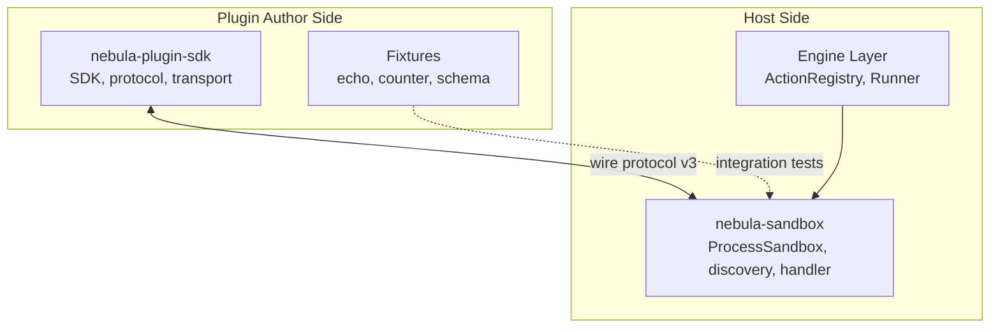
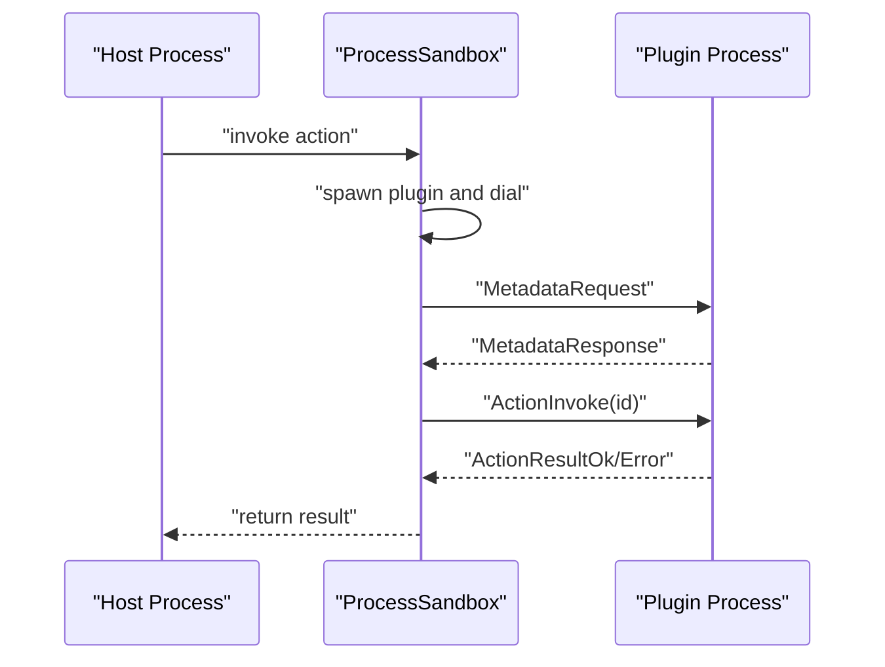
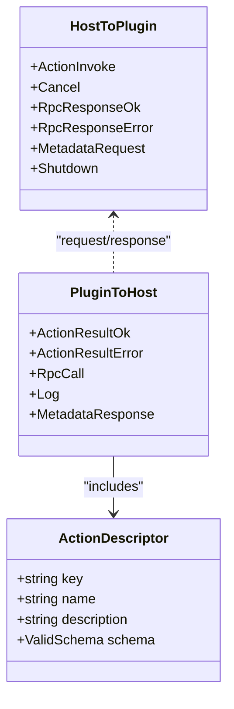
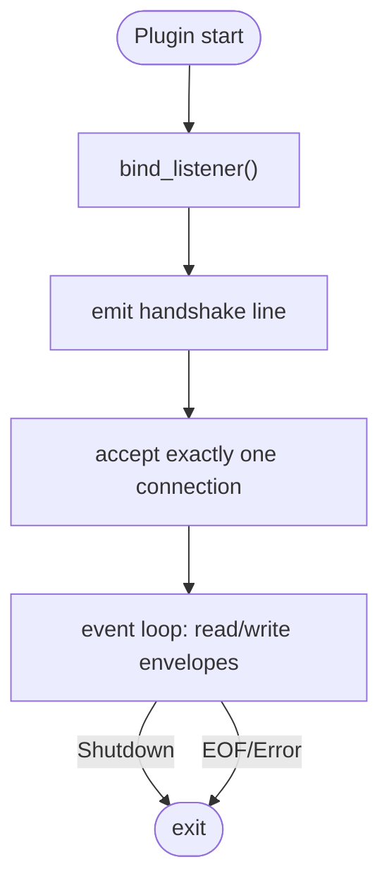
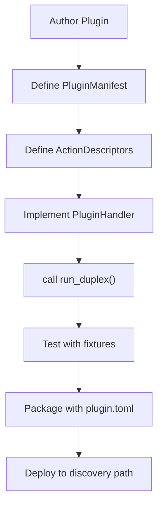
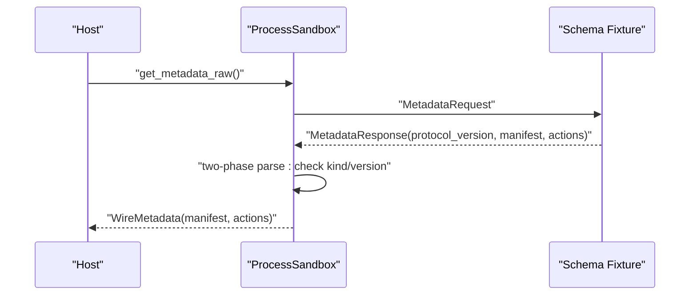
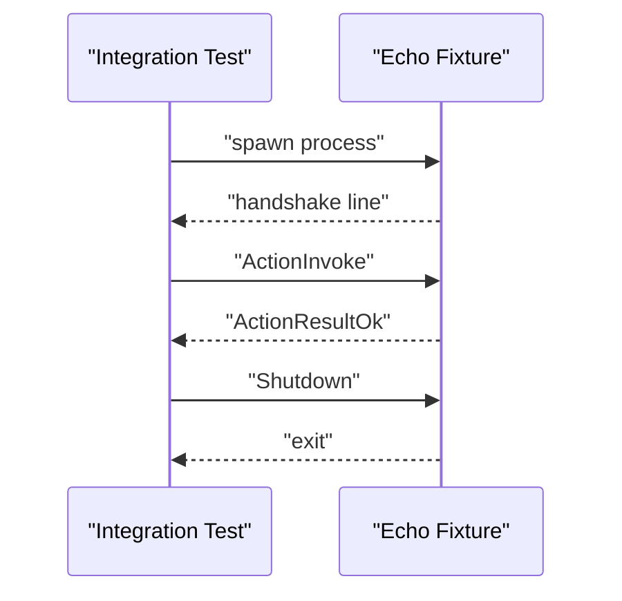
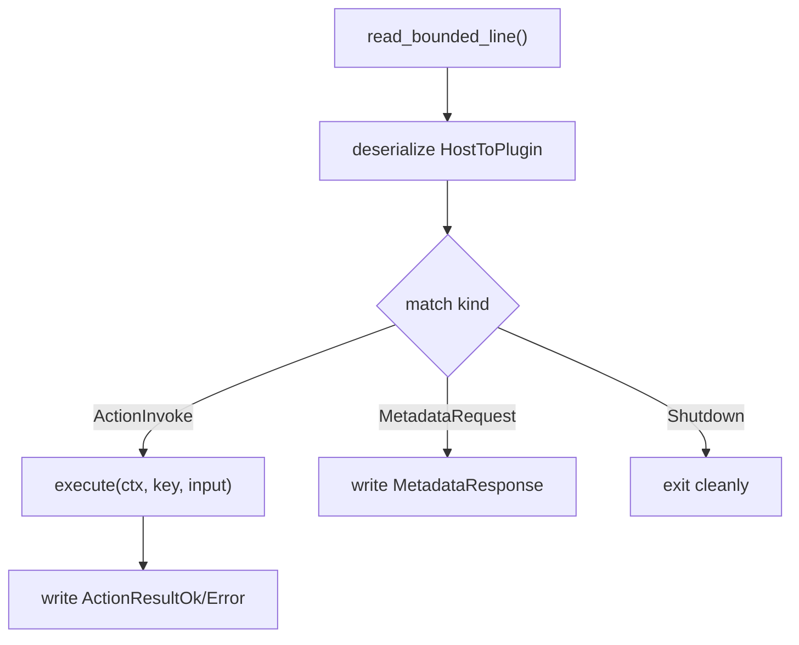
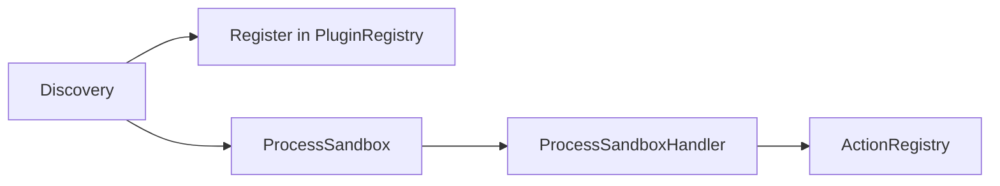
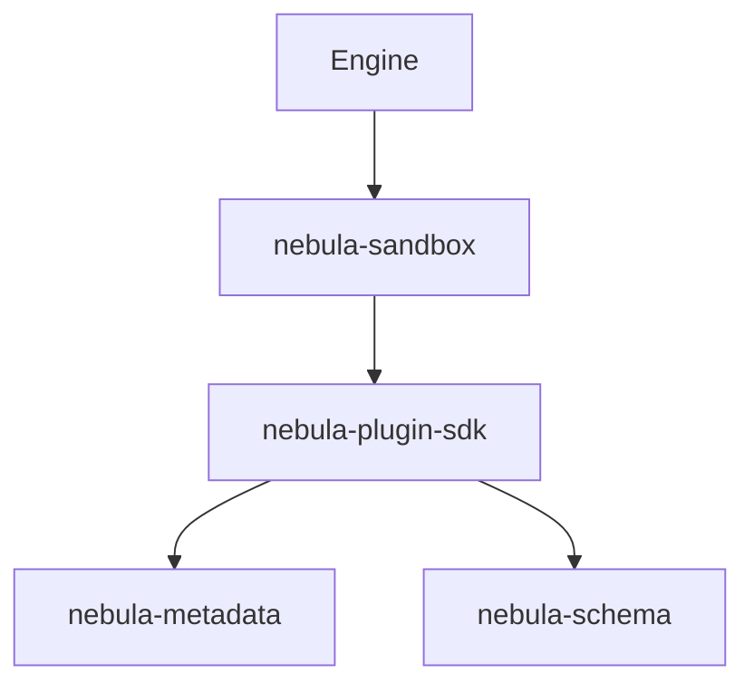

# Plugin SDK

<cite>
**Referenced Files in This Document**
- [Cargo.toml](file://crates/plugin-sdk/Cargo.toml)
- [README.md](file://crates/plugin-sdk/README.md)
- [lib.rs](file://crates/plugin-sdk/src/lib.rs)
- [protocol.rs](file://crates/plugin-sdk/src/protocol.rs)
- [transport.rs](file://crates/plugin-sdk/src/transport.rs)
- [echo_fixture.rs](file://crates/plugin-sdk/src/bin/echo_fixture.rs)
- [counter_fixture.rs](file://crates/plugin-sdk/src/bin/counter_fixture.rs)
- [schema_fixture.rs](file://crates/plugin-sdk/src/bin/schema_fixture.rs)
- [broker_smoke.rs](file://crates/plugin-sdk/tests/broker_smoke.rs)
- [lib.rs](file://crates/plugin/src/lib.rs)
- [lib.rs](file://crates/sandbox/src/lib.rs)
- [process.rs](file://crates/sandbox/src/process.rs)
- [discovery.rs](file://crates/sandbox/src/discovery.rs)
- [handler.rs](file://crates/sandbox/src/handler.rs)
</cite>

## Table of Contents
1. [Introduction](#introduction)
2. [Project Structure](#project-structure)
3. [Core Components](#core-components)
4. [Architecture Overview](#architecture-overview)
5. [Detailed Component Analysis](#detailed-component-analysis)
6. [Dependency Analysis](#dependency-analysis)
7. [Performance Considerations](#performance-considerations)
8. [Troubleshooting Guide](#troubleshooting-guide)
9. [Conclusion](#conclusion)
10. [Appendices](#appendices)

## Introduction
This document describes the Plugin SDK for Nebula’s out-of-process plugin communication and development framework. It explains the duplex JSON envelope protocol, transport mechanisms, bidirectional communication patterns, and the plugin lifecycle. It covers schema fixture generation, echo fixtures for testing, and the development/testing/debugging tooling. It also documents the relationship with sandbox isolation, the execution engine, and the API layer, along with security considerations, performance optimization, and best practices.

## Project Structure
The Plugin SDK is implemented in the `nebula-plugin-sdk` crate and integrates with the host-side sandbox and discovery layers. The key areas are:
- Plugin authoring and runtime: SDK, protocol, transport, and fixtures
- Host-side sandbox: process sandbox, discovery, and handler bridging
- Core integration: plugin distribution unit and metadata

**Diagram sources**
- [lib.rs:1-515](file://crates/plugin-sdk/src/lib.rs#L1-L515)
- [process.rs:1-800](file://crates/sandbox/src/process.rs#L1-L800)
- [discovery.rs:1-789](file://crates/sandbox/src/discovery.rs#L1-L789)

**Section sources**
- [Cargo.toml:1-55](file://crates/plugin-sdk/Cargo.toml#L1-L55)
- [README.md:1-98](file://crates/plugin-sdk/README.md#L1-L98)

## Core Components
- PluginHandler: trait that plugin authors implement to expose manifest, action descriptors, and execute logic.
- PluginCtx: execution context passed to execute (placeholder in slice 1c).
- PluginError: typed error crossing the protocol boundary with retryable/fatal variants.
- run_duplex: main entry point that binds transport, emits handshake, accepts one host connection, and runs the event loop.
- protocol module: wire envelope types HostToPlugin and PluginToHost, action descriptors, and log levels.
- transport module: bind_listener, dial, PluginListener, PluginStream, and handshake line format.

Key behaviors:
- Duplex JSON over OS-native transport (UDS on Unix, Named Pipes on Windows).
- Sequential dispatch within a long-lived plugin process (slice 1c).
- Frame size caps and bounded reads to mitigate DoS.
- Metadata exchange via MetadataRequest/MetadataResponse.

**Section sources**
- [lib.rs:156-390](file://crates/plugin-sdk/src/lib.rs#L156-L390)
- [protocol.rs:39-155](file://crates/plugin-sdk/src/protocol.rs#L39-L155)
- [transport.rs:65-98](file://crates/plugin-sdk/src/transport.rs#L65-L98)

## Architecture Overview
The Plugin SDK and the host sandbox form a duplex broker architecture:
- Plugin side: run_duplex binds transport, prints handshake, accepts one connection, and dispatches messages.
- Host side: ProcessSandbox spawns plugin, reads handshake, dials transport, and manages long-lived connections.
- Discovery: scans plugin directories, validates SDK constraints, probes metadata, and constructs RemoteAction wrappers.

**Diagram sources**
- [process.rs:499-582](file://crates/sandbox/src/process.rs#L499-L582)
- [protocol.rs:46-84](file://crates/plugin-sdk/src/protocol.rs#L46-L84)
- [protocol.rs:101-155](file://crates/plugin-sdk/src/protocol.rs#L101-L155)

**Section sources**
- [process.rs:1-200](file://crates/sandbox/src/process.rs#L1-L200)
- [discovery.rs:1-120](file://crates/sandbox/src/discovery.rs#L1-L120)

## Detailed Component Analysis

### Protocol Specification
The wire protocol is a set of JSON envelopes tagged by kind. Messages are line-delimited and framed by newlines. The host and plugin exchange:
- HostToPlugin: ActionInvoke, Cancel, RpcResponseOk, RpcResponseError, MetadataRequest, Shutdown
- PluginToHost: ActionResultOk, ActionResultError, RpcCall, Log, MetadataResponse

Serialization uses serde_json; the framing ensures single-line envelopes. The protocol version is bumped on incompatible changes. The SDK version constant is exported for host-side validation.

**Diagram sources**
- [protocol.rs:46-84](file://crates/plugin-sdk/src/protocol.rs#L46-L84)
- [protocol.rs:101-155](file://crates/plugin-sdk/src/protocol.rs#L101-L155)
- [protocol.rs:176-187](file://crates/plugin-sdk/src/protocol.rs#L176-L187)

**Section sources**
- [protocol.rs:1-17](file://crates/plugin-sdk/src/protocol.rs#L1-L17)

### Transport Mechanisms
The transport layer supports:
- Handshake line format: NEBULA-PROTO-<version>|<kind>|<address>
- Listener binding: Unix domain sockets or Windows named pipes
- Host dial: parse handshake and connect to announced address
- Stream abstraction: PluginStream implements AsyncRead/AsyncWrite

Security and isolation:
- Unix: socket in a per-plugin directory with restrictive permissions; connect fails for other users
- Windows: session-scoped pipe under LOCAL namespace

Environment controls:
- Host can force plugin to bind a specific address and kind via environment variables to prevent handshake forgery.

**Diagram sources**
- [transport.rs:80-98](file://crates/plugin-sdk/src/transport.rs#L80-L98)
- [transport.rs:335-360](file://crates/plugin-sdk/src/transport.rs#L335-L360)
- [lib.rs:227-242](file://crates/plugin-sdk/src/lib.rs#L227-L242)

**Section sources**
- [transport.rs:9-25](file://crates/plugin-sdk/src/transport.rs#L9-L25)
- [transport.rs:65-98](file://crates/plugin-sdk/src/transport.rs#L65-L98)
- [transport.rs:364-421](file://crates/plugin-sdk/src/transport.rs#L364-L421)

### Bidirectional Communication Patterns
- Plugin-initiated RPC: PluginToHost::RpcCall allows the plugin to request host services (e.g., credentials, network). Responses are RpcResponseOk/RpcResponseError.
- Logging: PluginToHost::Log enables structured logging back to the host.
- Cancellation: HostToPlugin::Cancel signals cooperative cancellation for in-flight actions (ignored in slice 1c; handled in slice 1d).

The SDK event loop dispatches messages and writes responses back to the host.

**Section sources**
- [protocol.rs:121-155](file://crates/plugin-sdk/src/protocol.rs#L121-L155)
- [lib.rs:294-333](file://crates/plugin-sdk/src/lib.rs#L294-L333)

### Plugin Development Lifecycle
- Implement PluginHandler with manifest, actions, and execute
- Call run_duplex in main to start the event loop
- Use fixtures for testing and development
- Package plugin with plugin.toml and validate SDK constraints

**Diagram sources**
- [lib.rs:156-186](file://crates/plugin-sdk/src/lib.rs#L156-L186)
- [echo_fixture.rs:21-67](file://crates/plugin-sdk/src/bin/echo_fixture.rs#L21-L67)
- [counter_fixture.rs:28-150](file://crates/plugin-sdk/src/bin/counter_fixture.rs#L28-L150)

**Section sources**
- [lib.rs:15-84](file://crates/plugin-sdk/src/lib.rs#L15-L84)
- [echo_fixture.rs:1-73](file://crates/plugin-sdk/src/bin/echo_fixture.rs#L1-L73)
- [counter_fixture.rs:1-156](file://crates/plugin-sdk/src/bin/counter_fixture.rs#L1-L156)
- [schema_fixture.rs:1-81](file://crates/plugin-sdk/src/bin/schema_fixture.rs#L1-L81)

### Schema Fixture Generation
The schema fixture demonstrates declaring actions with structured input schemas. The discovery layer validates and reconstructs the schema during metadata probing, ensuring fidelity across the broker envelope.

**Diagram sources**
- [discovery.rs:130-147](file://crates/sandbox/src/discovery.rs#L130-L147)
- [discovery.rs:149-196](file://crates/sandbox/src/discovery.rs#L149-L196)
- [schema_fixture.rs:21-75](file://crates/plugin-sdk/src/bin/schema_fixture.rs#L21-L75)

**Section sources**
- [schema_fixture.rs:1-81](file://crates/plugin-sdk/src/bin/schema_fixture.rs#L1-L81)
- [discovery.rs:130-196](file://crates/sandbox/src/discovery.rs#L130-L196)

### Echo Fixture for Testing
The echo fixture is a minimal plugin that returns inputs unchanged. It is used by integration tests to validate the end-to-end protocol path without the overhead of a full sandbox.

**Diagram sources**
- [broker_smoke.rs:39-120](file://crates/plugin-sdk/tests/broker_smoke.rs#L39-L120)
- [echo_fixture.rs:69-73](file://crates/plugin-sdk/src/bin/echo_fixture.rs#L69-L73)

**Section sources**
- [broker_smoke.rs:1-323](file://crates/plugin-sdk/tests/broker_smoke.rs#L1-L323)
- [echo_fixture.rs:1-73](file://crates/plugin-sdk/src/bin/echo_fixture.rs#L1-L73)

### Protocol Buffer Serialization and Message Routing
The SDK uses JSON serialization (serde_json) for envelopes. The host and plugin route messages as follows:
- Plugin side: read_bounded_line, parse HostToPlugin, dispatch to PluginHandler::execute, write PluginToHost
- Host side: send_envelope/recv_envelope with bounded reads, correlation id validation, and poison-on-error semantics

**Diagram sources**
- [lib.rs:244-334](file://crates/plugin-sdk/src/lib.rs#L244-L334)
- [lib.rs:354-390](file://crates/plugin-sdk/src/lib.rs#L354-L390)
- [process.rs:173-269](file://crates/sandbox/src/process.rs#L173-L269)

**Section sources**
- [lib.rs:244-390](file://crates/plugin-sdk/src/lib.rs#L244-L390)
- [process.rs:173-269](file://crates/sandbox/src/process.rs#L173-L269)

### Error Propagation Mechanisms
- PluginError provides machine-readable code and human-readable message, with retryable flag
- Host translates PluginToHost::ActionResultError into ActionError with retryable/fatal semantics
- Transport-level errors poison the handle and force respawn
- Correlation id mismatches and oversized frames trigger defensive invalidation

**Section sources**
- [lib.rs:106-138](file://crates/plugin-sdk/src/lib.rs#L106-L138)
- [process.rs:560-582](file://crates/sandbox/src/process.rs#L560-L582)
- [process.rs:694-715](file://crates/sandbox/src/process.rs#L694-L715)

### Relationship with Sandbox Isolation and Execution Engine
- Sandbox provides long-lived plugin processes and manages timeouts, cancellations, and retries
- Discovery validates SDK constraints and probes metadata before registering actions
- Handler bridges ProcessSandbox to ActionRegistry as StatelessHandler

**Diagram sources**
- [discovery.rs:445-531](file://crates/sandbox/src/discovery.rs#L445-L531)
- [handler.rs:13-46](file://crates/sandbox/src/handler.rs#L13-L46)
- [process.rs:499-582](file://crates/sandbox/src/process.rs#L499-L582)

**Section sources**
- [lib.rs:1-56](file://crates/sandbox/src/lib.rs#L1-L56)
- [discovery.rs:1-70](file://crates/sandbox/src/discovery.rs#L1-L70)
- [handler.rs:1-46](file://crates/sandbox/src/handler.rs#L1-L46)

## Dependency Analysis
The Plugin SDK depends on core metadata and schema types for manifests and schemas. The host-side sandbox depends on the SDK protocol types to speak the same wire format.

**Diagram sources**
- [Cargo.toml:14-24](file://crates/plugin-sdk/Cargo.toml#L14-L24)
- [lib.rs:85-91](file://crates/plugin-sdk/src/lib.rs#L85-L91)
- [lib.rs:1-56](file://crates/sandbox/src/lib.rs#L1-L56)

**Section sources**
- [Cargo.toml:1-55](file://crates/plugin-sdk/Cargo.toml#L1-L55)
- [lib.rs:85-91](file://crates/plugin-sdk/src/lib.rs#L85-L91)
- [lib.rs:1-56](file://crates/sandbox/src/lib.rs#L1-L56)

## Performance Considerations
- Sequential dispatch: slice 1c executes actions sequentially within a plugin process; parallelism is planned for slice 1d.
- Bounded reads: both host and plugin enforce frame caps to prevent memory exhaustion.
- Buffered I/O: host uses BufReader for throughput; plugin uses split streams for concurrency-safe reads/writes.
- Long-lived handles: ProcessSandbox caches a PluginHandle to avoid repeated spawns.
- Correlation ids: monotonic id allocation prevents misuse and supports robust response matching.

[No sources needed since this section provides general guidance]

## Troubleshooting Guide
Common issues and diagnostics:
- Protocol version mismatch: ensure plugin SDK version satisfies host SDK constraint
- Oversized frames: adjust NEBULA_PLUGIN_MAX_FRAME_BYTES or reduce payload sizes
- Handshake errors: verify handshake line format and environment variables for host-controlled binding
- Transport poisoning: monitor logs for PluginLineTooLarge, HandshakeLineTooLarge, TransportPoisoned
- Unknown action: confirm action key matches declared descriptors
- Cancellation and timeouts: ensure proper cancellation tokens and timeouts are respected

**Section sources**
- [process.rs:21-33](file://crates/sandbox/src/process.rs#L21-L33)
- [process.rs:193-229](file://crates/sandbox/src/process.rs#L193-L229)
- [transport.rs:336-352](file://crates/plugin-sdk/src/transport.rs#L336-L352)
- [broker_smoke.rs:252-278](file://crates/plugin-sdk/tests/broker_smoke.rs#L252-L278)

## Conclusion
The Plugin SDK provides a robust, versioned duplex protocol over OS-native transports, enabling secure and reliable out-of-process plugin execution. The host sandbox manages lifecycle, isolation, and retries, while discovery and handler layers integrate plugins into the broader execution engine. By following the development patterns, using fixtures, and adhering to security and performance best practices, plugin authors can build scalable, maintainable integrations.

[No sources needed since this section summarizes without analyzing specific files]

## Appendices

### Development Tools and Testing Utilities
- Fixtures: echo, counter, and schema fixtures for testing and demonstrations
- Integration tests: end-to-end broker smoke tests validating handshake, dispatch, and error handling
- Environment controls: NEBULA_PLUGIN_MAX_FRAME_BYTES, host-controlled socket binding via environment variables

**Section sources**
- [echo_fixture.rs:1-73](file://crates/plugin-sdk/src/bin/echo_fixture.rs#L1-L73)
- [counter_fixture.rs:1-156](file://crates/plugin-sdk/src/bin/counter_fixture.rs#L1-L156)
- [schema_fixture.rs:1-81](file://crates/plugin-sdk/src/bin/schema_fixture.rs#L1-L81)
- [broker_smoke.rs:1-323](file://crates/plugin-sdk/tests/broker_smoke.rs#L1-L323)
- [transport.rs:53-63](file://crates/plugin-sdk/src/transport.rs#L53-L63)

### Security Considerations
- Isolation honesty: child-process execution provides OS-level separation; not attacker-grade isolation
- Capability model: iOS-style capability declarations are supported but not enforced until discovery wiring is complete
- Transport security: Unix sockets use restrictive permissions; Windows pipes are session-scoped
- Host-controlled binding: handshake forgery prevention via environment variables

**Section sources**
- [lib.rs:8-35](file://crates/sandbox/src/lib.rs#L8-L35)
- [transport.rs:19-25](file://crates/plugin-sdk/src/transport.rs#L19-L25)
- [transport.rs:68-98](file://crates/plugin-sdk/src/transport.rs#L68-L98)

### Best Practices for Plugin Development and Deployment
- Keep actions deterministic and idempotent when possible
- Validate inputs using schema descriptors
- Use structured logging via PluginToHost::Log
- Respect cancellation and timeouts
- Monitor frame sizes and optimize payloads
- Align SDK versions with host constraints

**Section sources**
- [README.md:75-98](file://crates/plugin-sdk/README.md#L75-L98)
- [process.rs:499-582](file://crates/sandbox/src/process.rs#L499-L582)