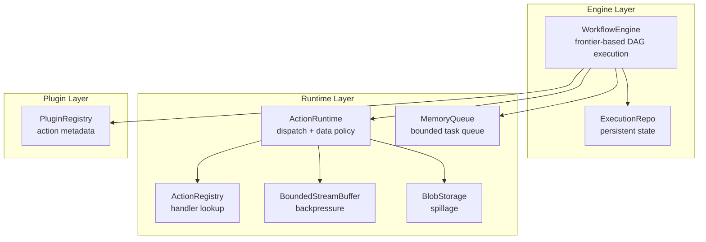
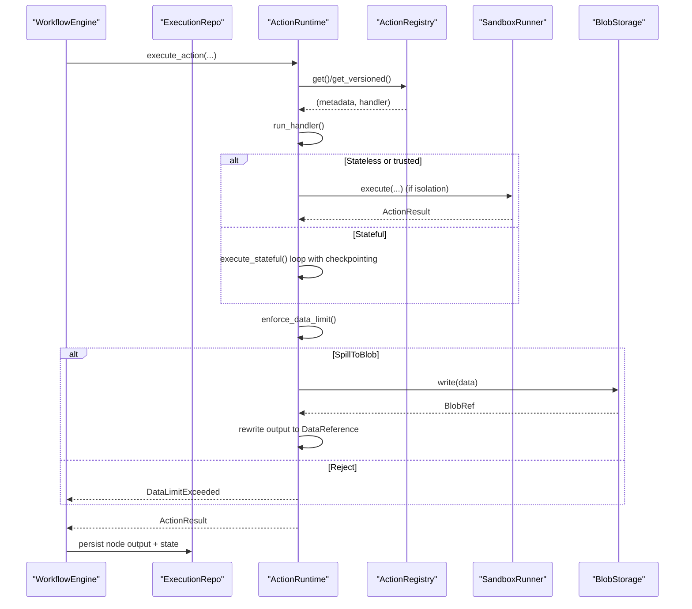
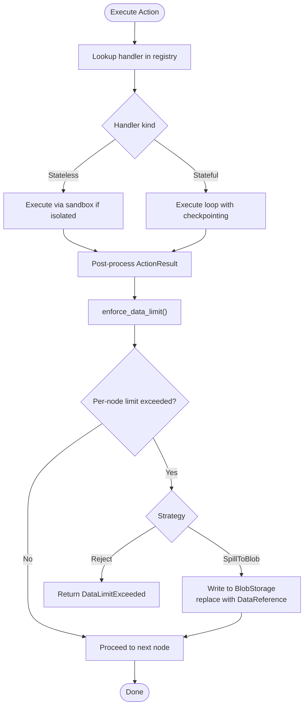
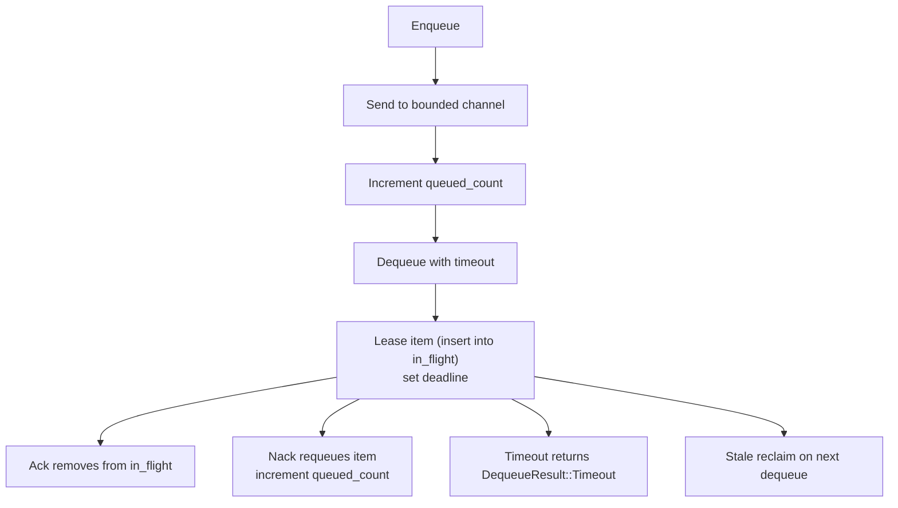
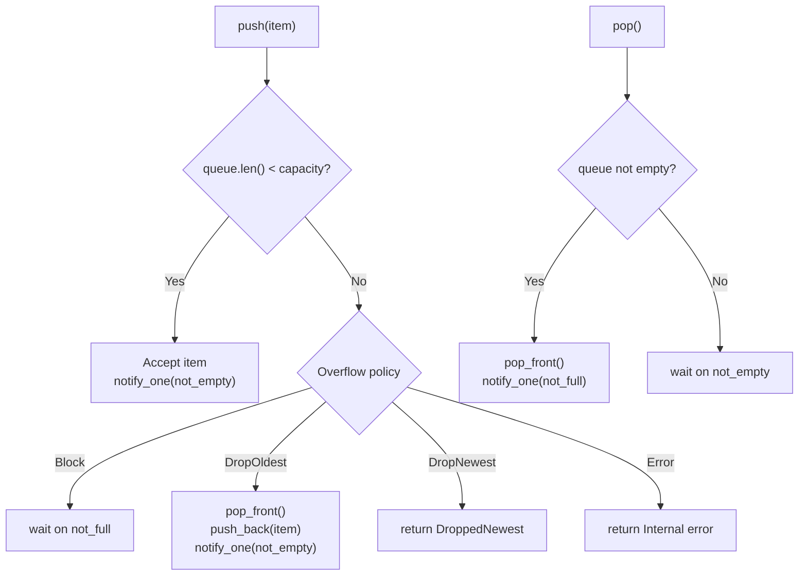
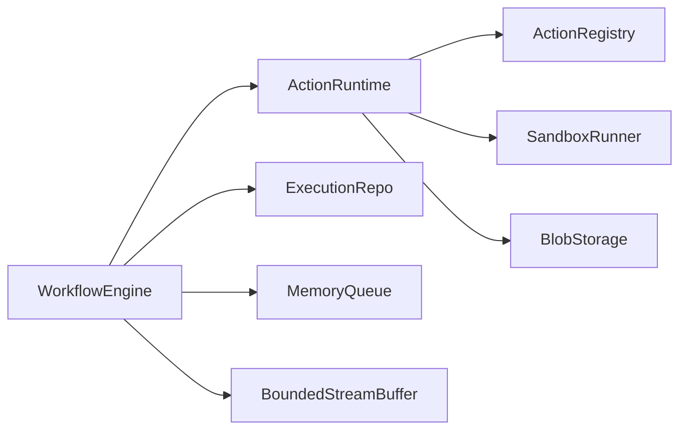

# Runtime Scheduling

<cite>
**Referenced Files in This Document**
- [runtime.rs](file://crates/runtime/src/runtime.rs)
- [queue.rs](file://crates/runtime/src/queue.rs)
- [blob.rs](file://crates/runtime/src/blob.rs)
- [data_policy.rs](file://crates/runtime/src/data_policy.rs)
- [stream_backpressure.rs](file://crates/runtime/src/stream_backpressure.rs)
- [error.rs](file://crates/runtime/src/error.rs)
- [registry.rs](file://crates/runtime/src/registry.rs)
- [engine.rs](file://crates/engine/src/engine.rs)
- [execution.rs](file://crates/storage/src/repos/execution.rs)
- [2026-04-06-runtime-v2-design.md](file://docs/superpowers/specs/2026-04-06-runtime-v2-design.md)
- [28-nebula-engine-redesign.md](file://docs/plans/archive/2026-04-15-arch-specs/28-nebula-engine-redesign.md)
- [0008-execution-control-queue-consumer.md](file://docs/adr/0008-execution-control-queue-consumer.md)
- [stream_backpressure_integration.rs](file://crates/runtime/tests/stream_backpressure_integration.rs)
</cite>

## Table of Contents
1. [Introduction](#introduction)
2. [Project Structure](#project-structure)
3. [Core Components](#core-components)
4. [Architecture Overview](#architecture-overview)
5. [Detailed Component Analysis](#detailed-component-analysis)
6. [Dependency Analysis](#dependency-analysis)
7. [Performance Considerations](#performance-considerations)
8. [Troubleshooting Guide](#troubleshooting-guide)
9. [Conclusion](#conclusion)
10. [Appendices](#appendices)

## Introduction
This document explains Nebula’s Runtime Scheduling subsystem with a focus on node execution and queue management. It covers runtime scheduling algorithms, node execution ordering, concurrent processing patterns, blob spillage for large data, stream backpressure management, queue strategies, data policy enforcement, execution queuing, and resource allocation. It also documents relationships with engine orchestration, storage, and plugin execution, along with configuration parameters, performance tuning, capacity planning, monitoring, and scaling strategies.

## Project Structure
The runtime scheduling layer is implemented primarily in the runtime crate and integrates with the engine, storage, and plugin systems. The runtime provides:
- Action dispatch and sandbox routing
- Data policy enforcement and blob spillage
- Stream backpressure primitives
- In-memory task queues for worker coordination

**Diagram sources**
- [engine.rs:111-138](file://crates/engine/src/engine.rs#L111-L138)
- [runtime.rs:88-110](file://crates/runtime/src/runtime.rs#L88-L110)
- [queue.rs:122-136](file://crates/runtime/src/queue.rs#L122-L136)
- [stream_backpressure.rs:33-37](file://crates/runtime/src/stream_backpressure.rs#L33-L37)
- [blob.rs:19-36](file://crates/runtime/src/blob.rs#L19-L36)
- [registry.rs:39-44](file://crates/runtime/src/registry.rs#L39-L44)

**Section sources**
- [engine.rs:111-138](file://crates/engine/src/engine.rs#L111-L138)
- [runtime.rs:88-110](file://crates/runtime/src/runtime.rs#L88-L110)
- [queue.rs:122-136](file://crates/runtime/src/queue.rs#L122-L136)
- [stream_backpressure.rs:33-37](file://crates/runtime/src/stream_backpressure.rs#L33-L37)
- [blob.rs:19-36](file://crates/runtime/src/blob.rs#L19-L36)
- [registry.rs:39-44](file://crates/runtime/src/registry.rs#L39-L44)

## Core Components
- ActionRuntime: Orchestrates action execution, enforces data policies, emits telemetry, and delegates to sandbox. It manages per-execution output totals and supports blob spillage.
- ActionRegistry: Lock-free, version-aware registry of action handlers keyed by ActionKey.
- MemoryQueue: In-memory bounded queue with visibility timeouts, at-least-once semantics, and concurrent consumers.
- BoundedStreamBuffer: Async bounded buffer with explicit overflow policies for stream-oriented outputs.
- BlobStorage: Trait for spilling oversized outputs to external storage.
- DataPassingPolicy: Configurable limits and strategies for node and execution-wide output sizes.

**Section sources**
- [runtime.rs:88-110](file://crates/runtime/src/runtime.rs#L88-L110)
- [registry.rs:39-44](file://crates/runtime/src/registry.rs#L39-L44)
- [queue.rs:122-136](file://crates/runtime/src/queue.rs#L122-L136)
- [stream_backpressure.rs:33-37](file://crates/runtime/src/stream_backpressure.rs#L33-L37)
- [blob.rs:19-36](file://crates/runtime/src/blob.rs#L19-L36)
- [data_policy.rs:7-18](file://crates/runtime/src/data_policy.rs#L7-L18)

## Architecture Overview
The engine drives node execution using a frontier-based scheduler and delegates individual node execution to ActionRuntime. ActionRuntime resolves handlers from the registry, executes via sandbox when required, enforces data policies, and manages spillage to blob storage. Persistent state is coordinated through ExecutionRepo, and control signals are delivered via the execution control queue.

**Diagram sources**
- [engine.rs:111-138](file://crates/engine/src/engine.rs#L111-L138)
- [runtime.rs:274-346](file://crates/runtime/src/runtime.rs#L274-L346)
- [runtime.rs:628-776](file://crates/runtime/src/runtime.rs#L628-L776)
- [blob.rs:19-36](file://crates/runtime/src/blob.rs#L19-L36)
- [execution.rs:10-40](file://crates/storage/src/repos/execution.rs#L10-L40)

## Detailed Component Analysis

### ActionRuntime: Execution, Scheduling, and Policy Enforcement
- Dispatch path selection: routes to stateless or stateful execution depending on handler kind and isolation level.
- Telemetry: records duration histograms and counters for successes/failures; rejection paths are separately accounted to avoid skewing metrics.
- Data policy enforcement: computes per-node and per-execution output sizes, applies configured strategy (Reject or SpillToBlob), and updates execution-wide totals.
- Blob spillage: when configured, serializes oversized JSON values and writes them to external storage, replacing the payload with a DataReference.

**Diagram sources**
- [runtime.rs:274-346](file://crates/runtime/src/runtime.rs#L274-L346)
- [runtime.rs:628-776](file://crates/runtime/src/runtime.rs#L628-L776)
- [blob.rs:19-36](file://crates/runtime/src/blob.rs#L19-L36)

**Section sources**
- [runtime.rs:274-346](file://crates/runtime/src/runtime.rs#L274-L346)
- [runtime.rs:628-776](file://crates/runtime/src/runtime.rs#L628-L776)
- [data_policy.rs:7-18](file://crates/runtime/src/data_policy.rs#L7-L18)
- [blob.rs:19-36](file://crates/runtime/src/blob.rs#L19-L36)

### ActionRegistry: Version-Aware Handler Lookup
- Maintains DashMap of ActionKey to sorted Vec of ActionEntry by semantic version.
- Provides get(), get_by_str(), and get_versioned() for latest or exact version retrieval.
- Auto-adapts stateless/stateful/trigger/resource actions for registration.

**Section sources**
- [registry.rs:39-44](file://crates/runtime/src/registry.rs#L39-L44)
- [registry.rs:74-107](file://crates/runtime/src/registry.rs#L74-L107)
- [registry.rs:109-218](file://crates/runtime/src/registry.rs#L109-L218)

### MemoryQueue: Concurrency and Visibility Management
- Bounded async channel with in-flight tracking and visibility timeouts.
- Supports concurrent consumers without mutex contention on receive.
- Provides enqueue/dequeue/ack/nack with len/queued_len/in_flight_len views.
- Reclaims stale in-flight tasks after visibility timeout.

**Diagram sources**
- [queue.rs:188-262](file://crates/runtime/src/queue.rs#L188-L262)

**Section sources**
- [queue.rs:122-136](file://crates/runtime/src/queue.rs#L122-L136)
- [queue.rs:188-262](file://crates/runtime/src/queue.rs#L188-L262)

### BoundedStreamBuffer: Stream Backpressure
- Async bounded buffer supporting four overflow policies: Block, DropOldest, DropNewest, Error.
- Uses Notify primitives to coordinate producers/consumers without busy-waiting.
- Enables streaming outputs where producer and consumer rates diverge.

**Diagram sources**
- [stream_backpressure.rs:55-99](file://crates/runtime/src/stream_backpressure.rs#L55-L99)
- [stream_backpressure.rs:101-118](file://crates/runtime/src/stream_backpressure.rs#L101-L118)

**Section sources**
- [stream_backpressure.rs:13-22](file://crates/runtime/src/stream_backpressure.rs#L13-L22)
- [stream_backpressure.rs:39-99](file://crates/runtime/src/stream_backpressure.rs#L39-L99)
- [stream_backpressure.rs:101-129](file://crates/runtime/src/stream_backpressure.rs#L101-L129)
- [stream_backpressure_integration.rs:7-53](file://crates/runtime/tests/stream_backpressure_integration.rs#L7-L53)

### Blob Spillage: Large Data Handling
- When DataPassingPolicy strategy is SpillToBlob and per-node output exceeds limit, ActionRuntime serializes the payload and writes it to BlobStorage, replacing the output with a DataReference.
- If no BlobStorage is configured, spills fall back to rejecting the output.

**Section sources**
- [runtime.rs:677-736](file://crates/runtime/src/runtime.rs#L677-L736)
- [blob.rs:19-36](file://crates/runtime/src/blob.rs#L19-L36)
- [data_policy.rs:44-51](file://crates/runtime/src/data_policy.rs#L44-L51)

### Data Passing Policy: Enforcement and Execution Budgeting
- Per-node limit and optional execution-wide limit with default thresholds.
- Two strategies: Reject oversized outputs or SpillToBlob.
- Runtime tracks per-execution totals and enforces the global cap.

**Section sources**
- [data_policy.rs:7-18](file://crates/runtime/src/data_policy.rs#L7-L18)
- [data_policy.rs:20-42](file://crates/runtime/src/data_policy.rs#L20-L42)
- [runtime.rs:740-773](file://crates/runtime/src/runtime.rs#L740-L773)

### Engine Orchestration, Storage, and Control Flow
- Engine coordinates frontier-based execution, bounded concurrency, and edge activation.
- ExecutionRepo persists state transitions and node outputs; the engine ensures all state changes occur via CAS on version.
- Execution control queue delivers commands (Start, Resume, Restart, Cancel, Terminate) via an outbox pattern; the engine consumes these commands and propagates cancellations cooperatively.

**Section sources**
- [engine.rs:111-138](file://crates/engine/src/engine.rs#L111-L138)
- [execution.rs:10-40](file://crates/storage/src/repos/execution.rs#L10-L40)
- [0008-execution-control-queue-consumer.md:1-22](file://docs/adr/0008-execution-control-queue-consumer.md#L1-L22)

## Dependency Analysis
Runtime scheduling components exhibit clear separation of concerns:
- Engine depends on ActionRuntime for node execution and on ExecutionRepo for persistence.
- ActionRuntime depends on ActionRegistry for handler lookup, SandboxRunner for isolation, and BlobStorage for spillage.
- MemoryQueue and BoundedStreamBuffer are foundational primitives used by runtime and potentially by engine workers.

**Diagram sources**
- [engine.rs:111-138](file://crates/engine/src/engine.rs#L111-L138)
- [runtime.rs:88-110](file://crates/runtime/src/runtime.rs#L88-L110)
- [queue.rs:122-136](file://crates/runtime/src/queue.rs#L122-L136)
- [stream_backpressure.rs:33-37](file://crates/runtime/src/stream_backpressure.rs#L33-L37)

**Section sources**
- [engine.rs:111-138](file://crates/engine/src/engine.rs#L111-L138)
- [runtime.rs:88-110](file://crates/runtime/src/runtime.rs#L88-L110)
- [queue.rs:122-136](file://crates/runtime/src/queue.rs#L122-L136)
- [stream_backpressure.rs:33-37](file://crates/runtime/src/stream_backpressure.rs#L33-L37)

## Performance Considerations
- Concurrency and parallelism
  - MemoryQueue supports multiple concurrent consumers without mutex contention on receive, enabling parallel draining of saturated queues.
  - Bounded concurrency in the engine’s frontier loop prevents resource exhaustion; tune semaphore permits to match CPU and I/O capacity.
- Backpressure and throughput
  - BoundedStreamBuffer with Block policy prevents unbounded memory growth under producer-consumer imbalance.
  - DropNewest/DropOldest policies trade data fidelity for throughput; choose based on workload SLAs.
- Data limits and spillage
  - Tune DataPassingPolicy thresholds to balance memory footprint and downstream throughput.
  - Blob spillage reduces in-memory pressure but adds I/O latency; ensure storage is sized for peak burst.
- Queue sizing and visibility
  - Increase MemoryQueue capacity to smooth transient spikes; adjust visibility timeout to tolerate checkpoint/write latency.
- Metrics and observability
  - Monitor runtime histograms and counters for action durations and failures; track engine lease contention and event channel capacity.

[No sources needed since this section provides general guidance]

## Troubleshooting Guide
Common issues and remedies:
- DataLimitExceeded
  - Symptom: Action returns DataLimitExceeded.
  - Causes: Per-node or per-execution limits exceeded.
  - Actions: Increase thresholds in DataPassingPolicy or enable SpillToBlob with a configured BlobStorage.
- Spillage failures
  - Symptom: Oversized outputs rejected despite SpillToBlob.
  - Causes: BlobStorage unavailable or write failures.
  - Actions: Verify BlobStorage implementation and connectivity; confirm runtime is initialized with with_blob_storage.
- Queue saturation and stalls
  - Symptom: Workers idle despite queued work; long dequeue times.
  - Causes: Single-threaded dequeue or insufficient worker count.
  - Actions: Use concurrent consumers; verify MemoryQueue capacity and visibility timeout.
- Backpressure-induced drops
  - Symptom: Streamed items dropped under load.
  - Causes: DropNewest or DropOldest policy.
  - Actions: Switch to Block or increase buffer; evaluate upstream throttling.
- Engine control signals not applied
  - Symptom: Cancel/Terminate not observed.
  - Causes: Control queue not consumed or commands not written atomically.
  - Actions: Ensure outbox pattern and consumer are wired; verify lease lifecycle and heartbeat intervals.

**Section sources**
- [error.rs:37-45](file://crates/runtime/src/error.rs#L37-L45)
- [runtime.rs:677-736](file://crates/runtime/src/runtime.rs#L677-L736)
- [queue.rs:188-262](file://crates/runtime/src/queue.rs#L188-L262)
- [stream_backpressure.rs:55-99](file://crates/runtime/src/stream_backpressure.rs#L55-L99)
- [0008-execution-control-queue-consumer.md:1-22](file://docs/adr/0008-execution-control-queue-consumer.md#L1-L22)

## Conclusion
Nebula’s runtime scheduling balances deterministic orchestration with robust runtime primitives. ActionRuntime provides safe, policy-enforced execution with spillage and backpressure controls. The engine’s frontier-based design, combined with durable storage and control queues, ensures reliable, observable workflow execution. Proper configuration of data limits, queue capacities, and spillage backends, coupled with strong observability, yields predictable performance at scale.

[No sources needed since this section summarizes without analyzing specific files]

## Appendices

### Configuration Parameters and Tuning
- DataPassingPolicy
  - max_node_output_bytes: per-node output size limit (default ~10 MB).
  - max_total_execution_bytes: per-execution total payload cap (default ~100 MB).
  - large_data_strategy: Reject or SpillToBlob.
- MemoryQueue
  - Capacity: queue depth; tune for burst tolerance.
  - Visibility timeout: lease period before stale tasks are reclaimed.
- BoundedStreamBuffer
  - Capacity: buffer size; Overflow policy: Block, DropOldest, DropNewest, Error.
- Engine
  - Concurrency permits and event channel capacity; lease TTL and heartbeat intervals.

**Section sources**
- [data_policy.rs:7-18](file://crates/runtime/src/data_policy.rs#L7-L18)
- [queue.rs:138-161](file://crates/runtime/src/queue.rs#L138-L161)
- [stream_backpressure.rs:42-53](file://crates/runtime/src/stream_backpressure.rs#L42-L53)
- [engine.rs:71-83](file://crates/engine/src/engine.rs#L71-L83)

### Capacity Planning and Scaling Strategies
- Horizontal scaling: run multiple engine instances with proper lease acquisition and heartbeat to avoid duplicate execution.
- Vertical scaling: increase worker concurrency and queue capacities; provision BlobStorage with adequate IOPS.
- Monitoring: track runtime histograms, engine lease contention, queue lengths, and event channel backpressure.

**Section sources**
- [engine.rs:71-83](file://crates/engine/src/engine.rs#L71-L83)
- [execution.rs:10-40](file://crates/storage/src/repos/execution.rs#L10-L40)

### References to Related Specifications
- Runtime v2 design: outlines sandbox routing, SpillToBlob activation, and registry integration.
- Engine redesign: consolidates runtime responsibilities into engine with durable state and control-plane integration.

**Section sources**
- [2026-04-06-runtime-v2-design.md:1-45](file://docs/superpowers/specs/2026-04-06-runtime-v2-design.md#L1-L45)
- [28-nebula-engine-redesign.md:86-120](file://docs/plans/archive/2026-04-15-arch-specs/28-nebula-engine-redesign.md#L86-L120)