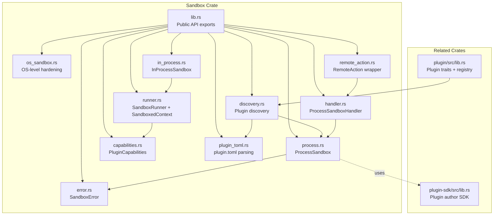
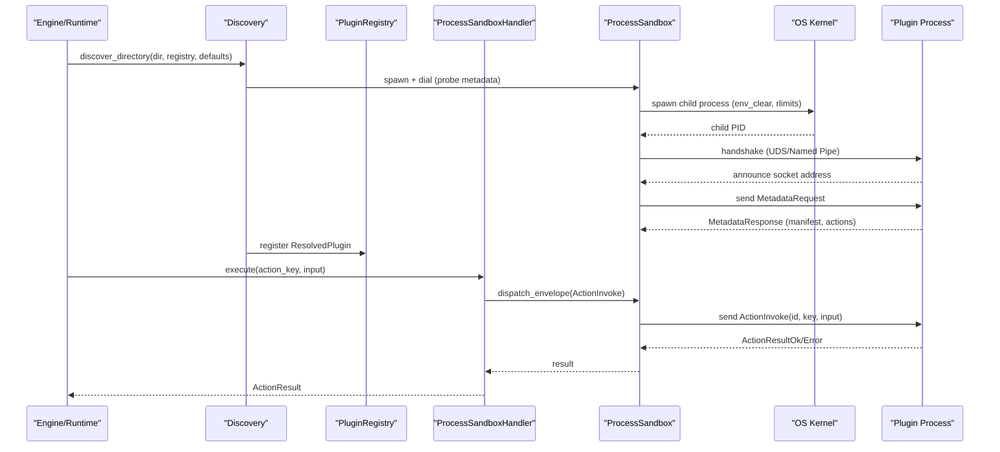
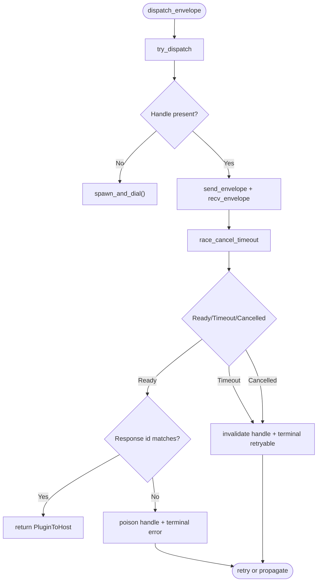
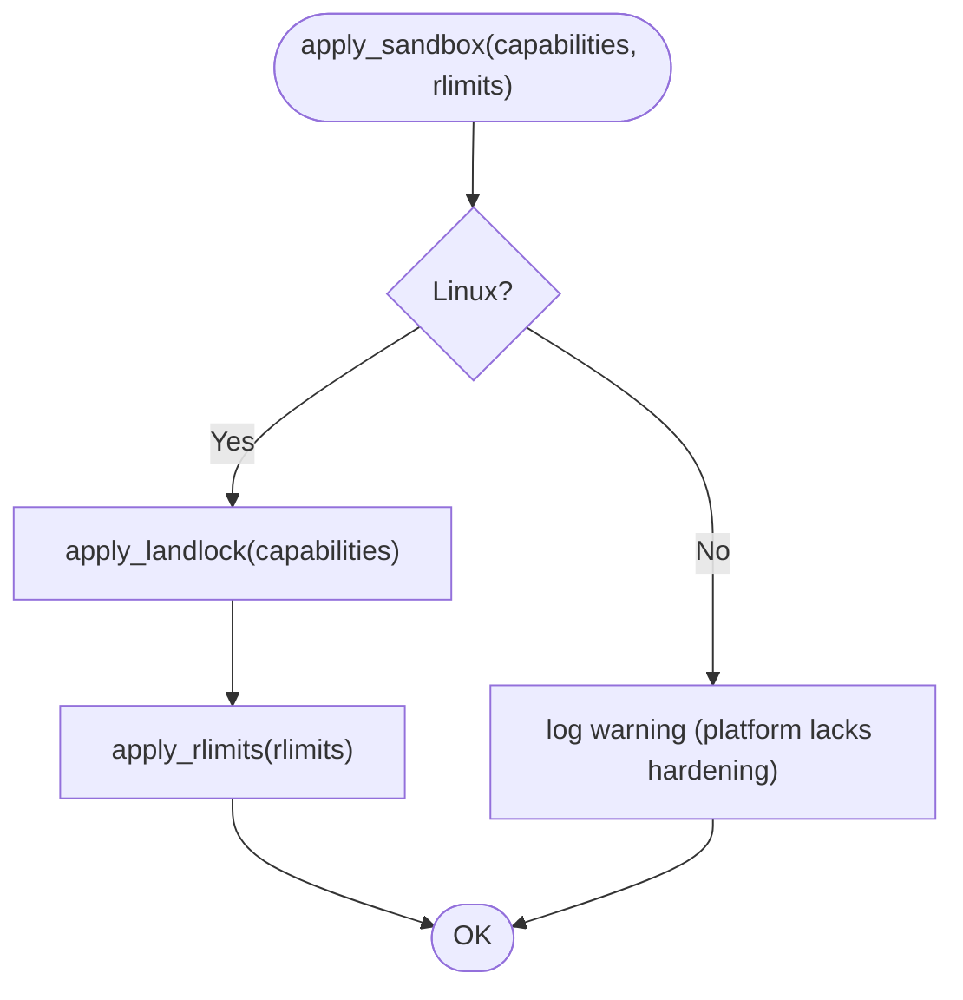
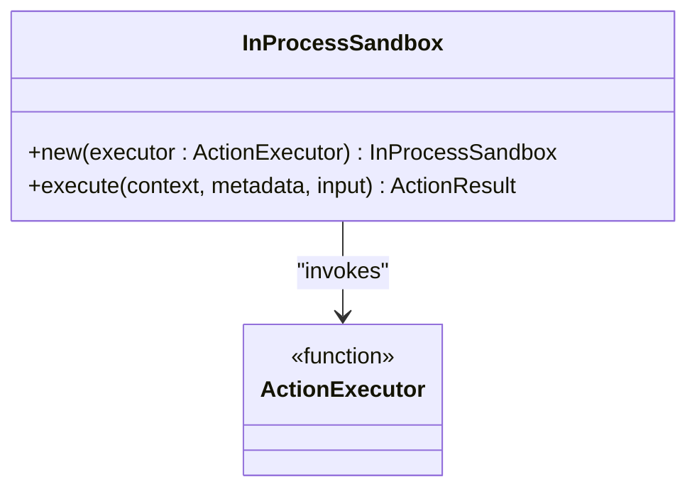
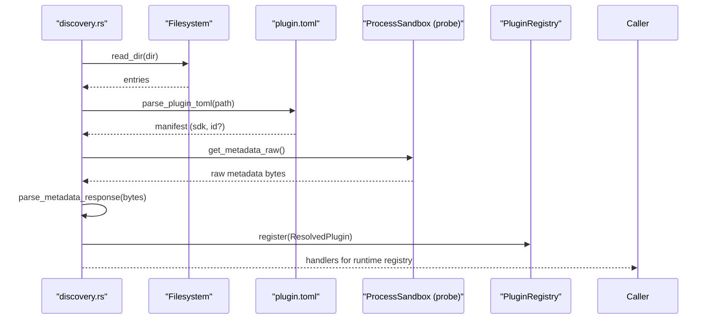
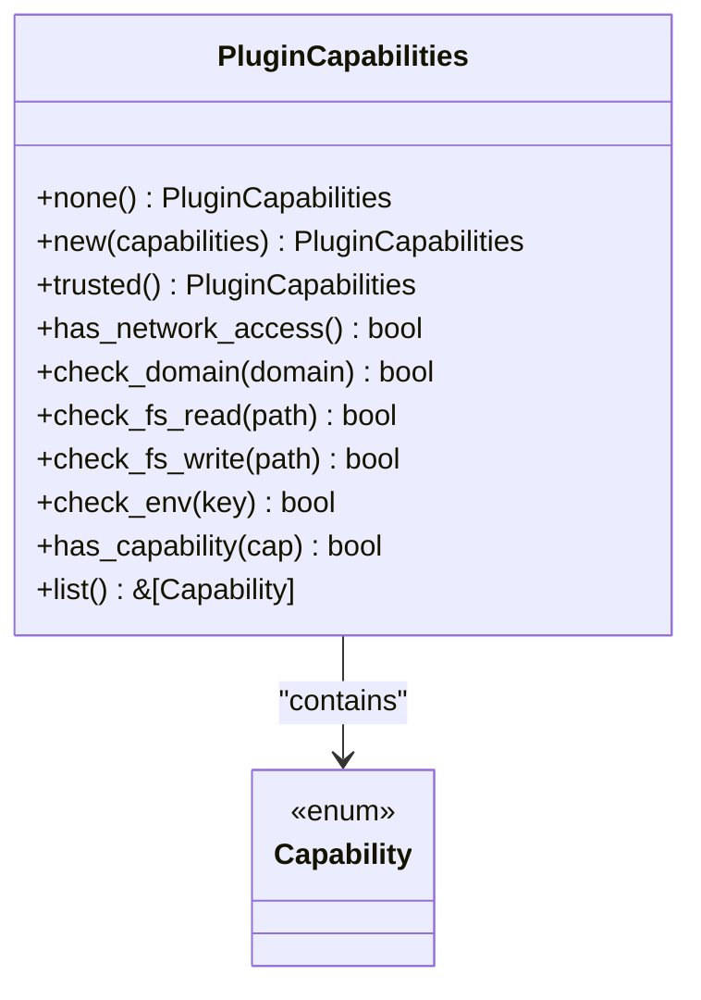
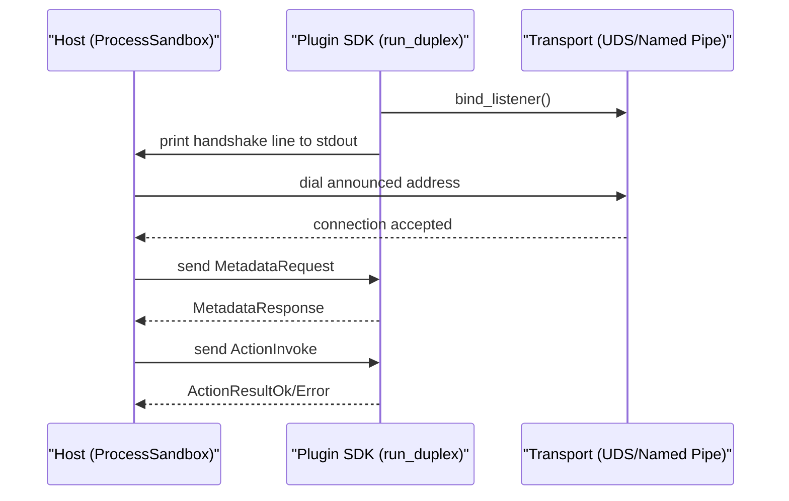
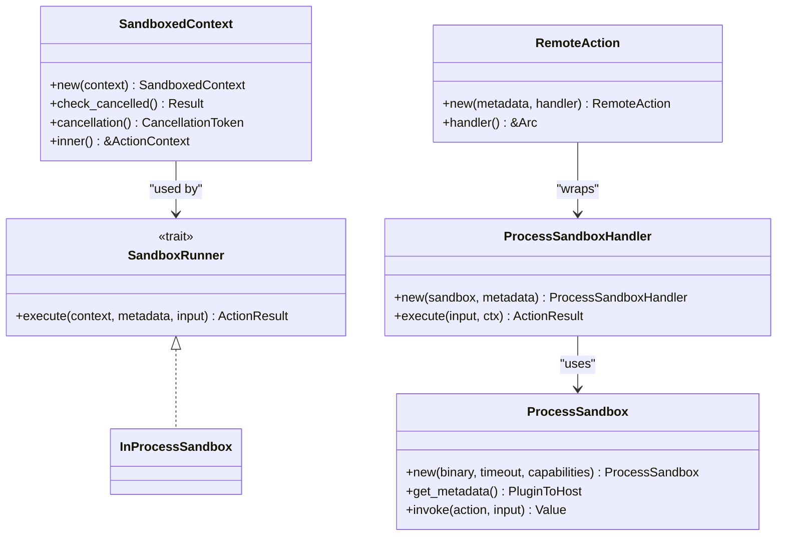
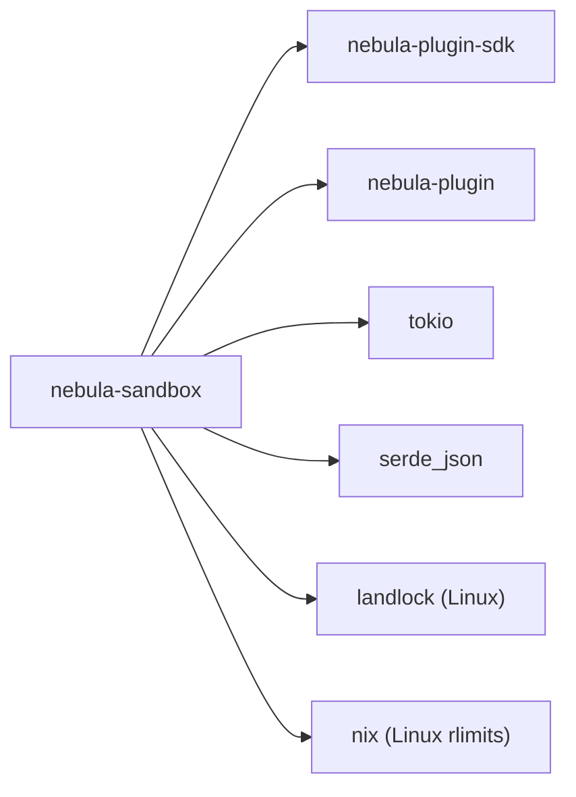

# Sandbox Isolation

<cite>
**Referenced Files in This Document**
- [lib.rs](file://crates/sandbox/src/lib.rs)
- [process.rs](file://crates/sandbox/src/process.rs)
- [os_sandbox.rs](file://crates/sandbox/src/os_sandbox.rs)
- [in_process.rs](file://crates/sandbox/src/in_process.rs)
- [discovery.rs](file://crates/sandbox/src/discovery.rs)
- [runner.rs](file://crates/sandbox/src/runner.rs)
- [capabilities.rs](file://crates/sandbox/src/capabilities.rs)
- [plugin_toml.rs](file://crates/sandbox/src/plugin_toml.rs)
- [handler.rs](file://crates/sandbox/src/handler.rs)
- [remote_action.rs](file://crates/sandbox/src/remote_action.rs)
- [error.rs](file://crates/sandbox/src/error.rs)
- [README.md](file://crates/sandbox/README.md)
- [sandbox_demo.rs](file://crates/sandbox/examples/sandbox_demo.rs)
- [lib.rs](file://crates/plugin-sdk/src/lib.rs)
- [lib.rs](file://crates/plugin/src/lib.rs)
- [registry.rs](file://crates/plugin/src/registry.rs)
</cite>

## Table of Contents
1. [Introduction](#introduction)
2. [Project Structure](#project-structure)
3. [Core Components](#core-components)
4. [Architecture Overview](#architecture-overview)
5. [Detailed Component Analysis](#detailed-component-analysis)
6. [Dependency Analysis](#dependency-analysis)
7. [Performance Considerations](#performance-considerations)
8. [Troubleshooting Guide](#troubleshooting-guide)
9. [Conclusion](#conclusion)
10. [Appendices](#appendices)

## Introduction
This document explains Nebula’s sandbox isolation model for plugin execution. It focuses on how the system discovers and loads out-of-process plugins, how capability-based sandboxing constrains their behavior, and how secure process execution is orchestrated. It also documents the OS-level sandbox implementation, in-process execution fallback, inter-process communication (IPC) protocols, and the plugin runner architecture. Finally, it covers configuration options, security considerations, monitoring approaches, and troubleshooting techniques for sandbox-related issues.

## Project Structure
The sandbox crate provides:
- Two execution modes: in-process for trusted actions and child-process for community plugins.
- A discovery mechanism that scans directories for plugin binaries and validates metadata via a duplex JSON envelope.
- A capability model for allowlisted access to network, filesystem, environment variables, and other resources.
- OS-level hardening primitives (Linux) and robust transport error handling.
- A runner abstraction that integrates with the execution engine and runtime.

**Diagram sources**
- [lib.rs:37-56](file://crates/sandbox/src/lib.rs#L37-L56)
- [process.rs:86-117](file://crates/sandbox/src/process.rs#L86-L117)
- [os_sandbox.rs:42-61](file://crates/sandbox/src/os_sandbox.rs#L42-L61)
- [in_process.rs:14-27](file://crates/sandbox/src/in_process.rs#L14-L27)
- [discovery.rs:44-42](file://crates/sandbox/src/discovery.rs#L44-L42)
- [runner.rs:44-62](file://crates/sandbox/src/runner.rs#L44-L62)
- [capabilities.rs:73-95](file://crates/sandbox/src/capabilities.rs#L73-L95)
- [plugin_toml.rs:17-28](file://crates/sandbox/src/plugin_toml.rs#L17-L28)
- [handler.rs:13-29](file://crates/sandbox/src/handler.rs#L13-L29)
- [remote_action.rs:20-44](file://crates/sandbox/src/remote_action.rs#L20-L44)
- [error.rs:17-24](file://crates/sandbox/src/error.rs#L17-L24)
- [lib.rs:1-10](file://crates/plugin-sdk/src/lib.rs#L1-L10)
- [lib.rs:1-32](file://crates/plugin/src/lib.rs#L1-L32)

**Section sources**
- [lib.rs:4-35](file://crates/sandbox/src/lib.rs#L4-L35)
- [README.md:10-28](file://crates/sandbox/README.md#L10-L28)

## Core Components
- ProcessSandbox: child-process execution over a duplex JSON envelope (ADR 0006). Maintains a long-lived PluginHandle, supports monotonic correlation ids, and applies strict line-length caps and transport poisoning.
- InProcessSandbox: trusted in-process execution for built-in actions with capability checks and cooperative cancellation.
- ProcessSandboxHandler and RemoteAction: bridge ProcessSandbox into the ActionRegistry and runtime, enabling seamless dispatch of out-of-process actions.
- SandboxRunner and SandboxedContext: abstraction for sandboxed execution, providing capability checks and cancellation integration.
- PluginCapabilities: iOS-style allowlists for network, filesystem, environment variables, and other resources.
- OS-level hardening (Linux): Landlock filesystem access control and rlimits for resource limits.
- Discovery: scans plugin directories, validates SDK compatibility, probes metadata, reconciles keys, and constructs ResolvedPlugin entries.
- Error taxonomy: SandboxError distinguishes transport, protocol, and poisoning conditions for diagnostics and security monitoring.

**Section sources**
- [process.rs:86-117](file://crates/sandbox/src/process.rs#L86-L117)
- [in_process.rs:14-48](file://crates/sandbox/src/in_process.rs#L14-L48)
- [handler.rs:13-45](file://crates/sandbox/src/handler.rs#L13-L45)
- [remote_action.rs:20-73](file://crates/sandbox/src/remote_action.rs#L20-L73)
- [runner.rs:44-74](file://crates/sandbox/src/runner.rs#L44-L74)
- [capabilities.rs:73-178](file://crates/sandbox/src/capabilities.rs#L73-L178)
- [os_sandbox.rs:42-61](file://crates/sandbox/src/os_sandbox.rs#L42-L61)
- [discovery.rs:44-42](file://crates/sandbox/src/discovery.rs#L44-L42)
- [error.rs:17-117](file://crates/sandbox/src/error.rs#L17-L117)

## Architecture Overview
The sandbox architecture separates concerns across discovery, capability modeling, OS hardening, and IPC transport. The plugin SDK provides the plugin-side of the duplex protocol, while the sandbox crate hosts the broker and orchestrates secure execution.

**Diagram sources**
- [discovery.rs:446-531](file://crates/sandbox/src/discovery.rs#L446-L531)
- [process.rs:466-767](file://crates/sandbox/src/process.rs#L466-L767)
- [handler.rs:31-45](file://crates/sandbox/src/handler.rs#L31-L45)
- [lib.rs:188-242](file://crates/plugin-sdk/src/lib.rs#L188-L242)

## Detailed Component Analysis

### ProcessSandbox: Secure Child-Process Execution
ProcessSandbox manages a long-lived plugin process and a PluginHandle for bidirectional envelope transport. It:
- Enforces strict line-length caps for handshake and envelopes to mitigate DoS.
- Tracks and poisons the transport on protocol violations or oversized reads.
- Uses monotonic correlation ids to detect stale responses and prevent cross-request confusion.
- Races per-call timeouts against cancellation tokens to honor cooperative cancellation.
- Clears cached handles on transport errors and respawns on stale-handle failures.

**Diagram sources**
- [process.rs:584-767](file://crates/sandbox/src/process.rs#L584-L767)

**Section sources**
- [process.rs:86-117](file://crates/sandbox/src/process.rs#L86-L117)
- [process.rs:160-269](file://crates/sandbox/src/process.rs#L160-L269)
- [process.rs:351-411](file://crates/sandbox/src/process.rs#L351-L411)
- [process.rs:413-464](file://crates/sandbox/src/process.rs#L413-L464)
- [process.rs:466-767](file://crates/sandbox/src/process.rs#L466-L767)

### OS-Level Hardening (Linux)
On Linux, the sandbox applies:
- Landlock filesystem rules derived from PluginCapabilities.
- Resource limits (address space, file descriptors, CPU seconds, process count, core dump size).
- Advisory-only behavior on non-Linux platforms with warnings.

**Diagram sources**
- [os_sandbox.rs:42-74](file://crates/sandbox/src/os_sandbox.rs#L42-L74)
- [os_sandbox.rs:127-135](file://crates/sandbox/src/os_sandbox.rs#L127-L135)
- [os_sandbox.rs:182-222](file://crates/sandbox/src/os_sandbox.rs#L182-L222)

**Section sources**
- [os_sandbox.rs:13-40](file://crates/sandbox/src/os_sandbox.rs#L13-L40)
- [os_sandbox.rs:42-74](file://crates/sandbox/src/os_sandbox.rs#L42-L74)
- [os_sandbox.rs:127-252](file://crates/sandbox/src/os_sandbox.rs#L127-L252)

### In-Process Execution Fallback
InProcessSandbox executes trusted actions directly in the host process with capability checks and cooperative cancellation. It is intended for built-in actions and does not provide OS-level isolation.

**Diagram sources**
- [in_process.rs:14-48](file://crates/sandbox/src/in_process.rs#L14-L48)

**Section sources**
- [in_process.rs:14-48](file://crates/sandbox/src/in_process.rs#L14-L48)

### Plugin Discovery and Loader
Discovery scans plugin directories, validates SDK constraints, probes metadata via a short-lived sandbox, reconciles keys, and constructs RemoteAction wrappers and ResolvedPlugin entries. It registers them into the PluginRegistry and returns handler lists for runtime registries.

**Diagram sources**
- [discovery.rs:446-531](file://crates/sandbox/src/discovery.rs#L446-L531)
- [plugin_toml.rs:101-142](file://crates/sandbox/src/plugin_toml.rs#L101-L142)
- [process.rs:513-544](file://crates/sandbox/src/process.rs#L513-L544)

**Section sources**
- [discovery.rs:1-789](file://crates/sandbox/src/discovery.rs#L1-L789)
- [plugin_toml.rs:17-142](file://crates/sandbox/src/plugin_toml.rs#L17-L142)

### Capability-Based Sandbox
PluginCapabilities define allowlists for network domains, filesystem paths, environment variables, and other resources. The model is inspired by mobile OS permission systems and defaults to no capabilities. Enforcement is passed to ProcessSandbox at spawn time; per-call enforcement is not yet wired (work in progress).

**Diagram sources**
- [capabilities.rs:73-178](file://crates/sandbox/src/capabilities.rs#L73-L178)
- [capabilities.rs:10-71](file://crates/sandbox/src/capabilities.rs#L10-L71)

**Section sources**
- [capabilities.rs:73-178](file://crates/sandbox/src/capabilities.rs#L73-L178)
- [README.md:64-66](file://crates/sandbox/README.md#L64-L66)

### Inter-Process Communication Protocol
The duplex protocol uses line-delimited JSON envelopes over OS-native transports (UDS on Unix, Named Pipes on Windows). The plugin SDK binds a listener, prints a handshake line to stdout, and accepts a single connection from the host. The host dials the announced address and exchanges envelopes.

**Diagram sources**
- [lib.rs:188-242](file://crates/plugin-sdk/src/lib.rs#L188-L242)
- [process.rs:42-45](file://crates/sandbox/src/process.rs#L42-L45)

**Section sources**
- [lib.rs:188-242](file://crates/plugin-sdk/src/lib.rs#L188-L242)
- [process.rs:42-45](file://crates/sandbox/src/process.rs#L42-L45)

### Plugin Runner Architecture
SandboxRunner abstracts sandboxed execution. SandboxedContext wraps ActionContext and provides capability checks and cancellation. ProcessSandboxHandler and RemoteAction integrate ProcessSandbox into the ActionRegistry and runtime.

**Diagram sources**
- [runner.rs:44-74](file://crates/sandbox/src/runner.rs#L44-L74)
- [handler.rs:13-45](file://crates/sandbox/src/handler.rs#L13-L45)
- [remote_action.rs:20-73](file://crates/sandbox/src/remote_action.rs#L20-L73)
- [process.rs:466-583](file://crates/sandbox/src/process.rs#L466-L583)

**Section sources**
- [runner.rs:44-74](file://crates/sandbox/src/runner.rs#L44-L74)
- [handler.rs:13-45](file://crates/sandbox/src/handler.rs#L13-L45)
- [remote_action.rs:20-73](file://crates/sandbox/src/remote_action.rs#L20-L73)
- [process.rs:466-583](file://crates/sandbox/src/process.rs#L466-L583)

### Concrete Examples from the Codebase
- Sandbox demo: Demonstrates long-lived plugin process behavior, metadata probing, sequential invokes, error propagation, auto-respawn on crash, timeout behavior, and throughput measurements.
- Discovery example: Shows how plugin.toml is parsed, SDK constraints validated, metadata probed, and RemoteAction wrappers constructed.

**Section sources**
- [sandbox_demo.rs:43-214](file://crates/sandbox/examples/sandbox_demo.rs#L43-L214)
- [discovery.rs:130-196](file://crates/sandbox/src/discovery.rs#L130-L196)

## Dependency Analysis
The sandbox crate depends on:
- nebula-plugin-sdk for wire protocol types and plugin-side SDK behavior.
- nebula-plugin for plugin traits, manifests, and the in-memory registry.
- tokio for async process spawning, I/O, and cancellation.
- serde_json for envelope serialization/deserialization.
- landlock and nix for Linux OS-level hardening.

**Diagram sources**
- [lib.rs:37-56](file://crates/sandbox/src/lib.rs#L37-L56)
- [lib.rs:1-10](file://crates/plugin-sdk/src/lib.rs#L1-L10)
- [lib.rs:1-32](file://crates/plugin/src/lib.rs#L1-L32)

**Section sources**
- [lib.rs:37-56](file://crates/sandbox/src/lib.rs#L37-L56)
- [lib.rs:1-10](file://crates/plugin-sdk/src/lib.rs#L1-L10)
- [lib.rs:1-32](file://crates/plugin/src/lib.rs#L1-L32)

## Performance Considerations
- Long-lived plugin processes amortize spawn costs; sequential dispatch per process avoids contention but limits throughput.
- Bounded line reads and BufReader improve throughput for envelope I/O.
- Linux rlimits constrain resource usage to protect the host.
- Transport poisoning prevents reuse after protocol violations, avoiding wasted retries.
- Correlation ids and monotonic sequencing reduce ambiguity and support robust error handling.

[No sources needed since this section provides general guidance]

## Troubleshooting Guide
Common issues and diagnostics:
- Oversized envelopes or handshake lines: The transport is poisoned; logs indicate “envelope line exceeded cap” or “handshake line exceeded cap.” The handle is cleared and the next call respawns.
- Plugin closed transport without response: Indicates abnormal exit; handle is cleared and respawn is triggered.
- Response id mismatch: Indicates stale or replayed response; transport is poisoned and connection is reset.
- Timeout or cancellation mid-round-trip: The handle is cleared; classified as terminal to avoid duplicate side-effects.
- OS-level sandbox unavailable: On non-Linux platforms, warnings are logged indicating advisory-only behavior.

Operational tips:
- Monitor logs for “plugin transport poisoned,” “plugin response id mismatch,” and “plugin closed transport.”
- Validate plugin.toml SDK constraints before spawning.
- Confirm handshake address matches host-allocated socket address.
- Use the sandbox demo to reproduce and isolate transport and timeout behaviors.

**Section sources**
- [error.rs:24-117](file://crates/sandbox/src/error.rs#L24-L117)
- [process.rs:717-766](file://crates/sandbox/src/process.rs#L717-L766)
- [os_sandbox.rs:55-60](file://crates/sandbox/src/os_sandbox.rs#L55-L60)

## Conclusion
Nebula’s sandbox provides a correctness boundary for plugin execution: in-process execution for trusted actions and child-process execution for community plugins over a duplex JSON envelope. While not an attacker-grade isolation, it offers capability-based allowlists, OS-level hardening on Linux, and robust transport error handling. Discovery, capability modeling, and the runner abstraction integrate tightly with the plugin system and runtime, enabling secure and observable plugin orchestration.

[No sources needed since this section summarizes without analyzing specific files]

## Appendices

### Configuration Options and Security Policies
- ProcessSandbox configuration:
  - Binary path, per-call timeout, and PluginCapabilities.
  - Linux rlimits override via with_linux_rlimits.
- PluginCapabilities:
  - Network allowlists, filesystem read/write paths, environment variable keys, and platform-specific capabilities.
- OS-level hardening:
  - Landlock filesystem rules and rlimits; availability checked per platform.
- Discovery policy:
  - SDK semver constraint enforcement and optional plugin id guard via plugin.toml.

**Section sources**
- [process.rs:466-496](file://crates/sandbox/src/process.rs#L466-L496)
- [capabilities.rs:73-178](file://crates/sandbox/src/capabilities.rs#L73-L178)
- [os_sandbox.rs:16-40](file://crates/sandbox/src/os_sandbox.rs#L16-L40)
- [plugin_toml.rs:17-28](file://crates/sandbox/src/plugin_toml.rs#L17-L28)

### Relationship with Plugin System and Execution Engine
- PluginRegistry stores ResolvedPlugin instances keyed by PluginKey.
- RemoteAction and ProcessSandboxHandler enable seamless integration with ActionRegistry and runtime.
- Discovery constructs RemoteAction wrappers and registers them into the registry.

**Section sources**
- [registry.rs:9-154](file://crates/plugin/src/registry.rs#L9-L154)
- [remote_action.rs:20-73](file://crates/sandbox/src/remote_action.rs#L20-L73)
- [handler.rs:13-45](file://crates/sandbox/src/handler.rs#L13-L45)
- [discovery.rs:446-531](file://crates/sandbox/src/discovery.rs#L446-L531)