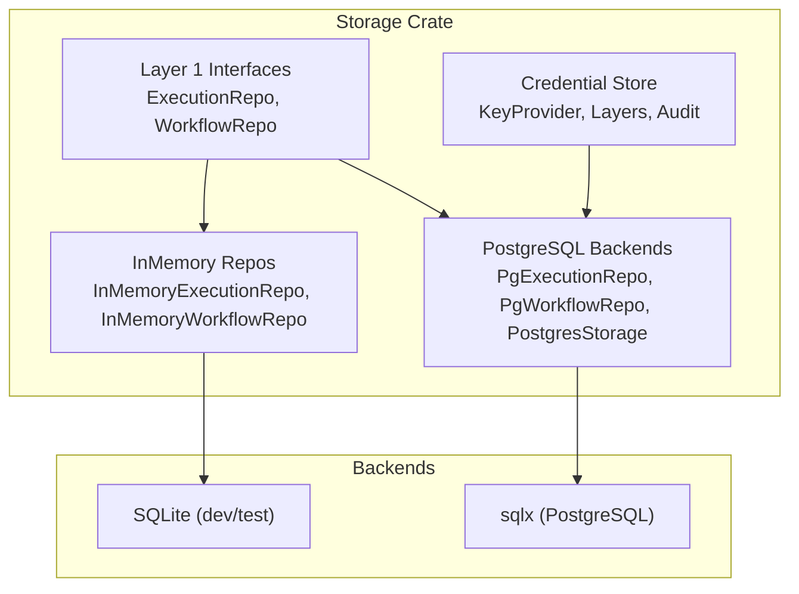
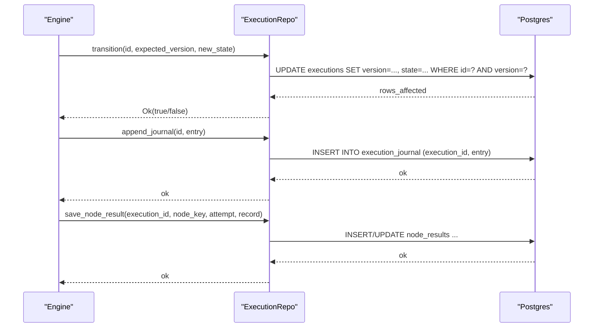
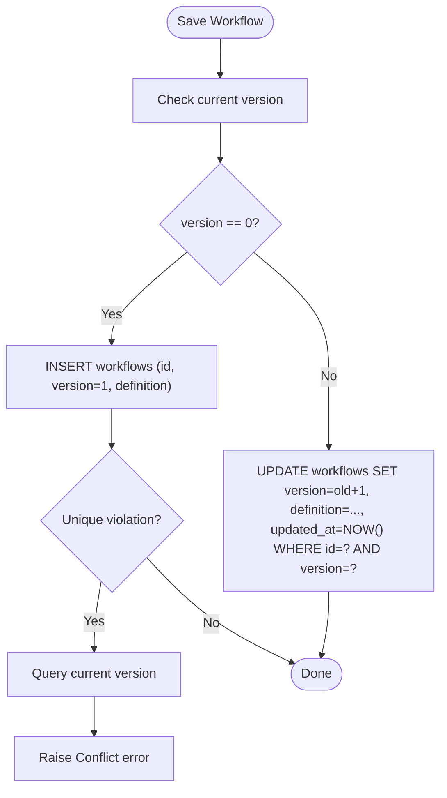
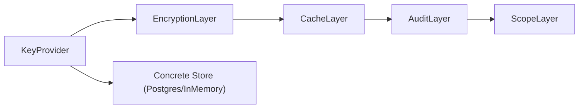
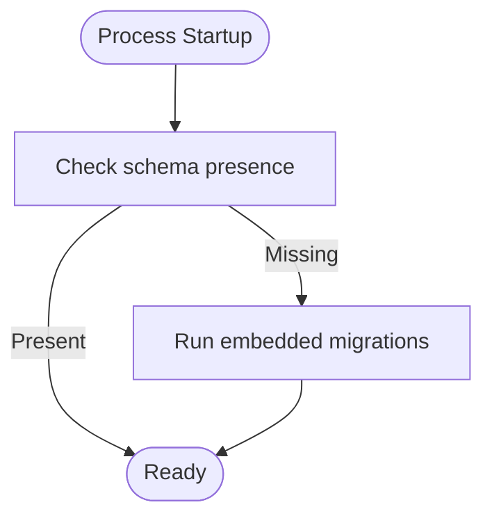
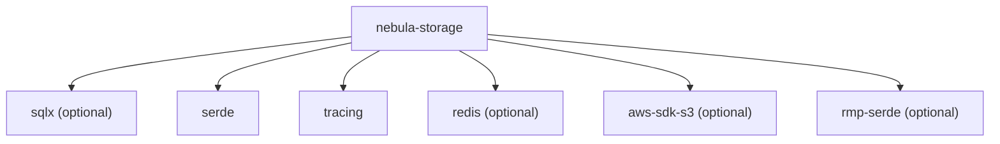

# Storage Persistence

<cite>
**Referenced Files in This Document**
- [lib.rs](file://crates/storage/src/lib.rs)
- [Cargo.toml](file://crates/storage/Cargo.toml)
- [execution_repo.rs](file://crates/storage/src/execution_repo.rs)
- [workflow_repo.rs](file://crates/storage/src/workflow_repo.rs)
- [mod.rs (credential)](file://crates/storage/src/credential/mod.rs)
- [mod.rs (backend)](file://crates/storage/src/backend/mod.rs)
- [pg_execution.rs](file://crates/storage/src/backend/pg_execution.rs)
- [postgres.rs](file://crates/storage/src/backend/postgres.rs)
- [00000000000002_create_workflows.sql](file://crates/storage/migrations/sqlite/00000000000002_create_workflows.sql)
- [00000000000003_create_executions.sql](file://crates/storage/migrations/sqlite/00000000000003_create_executions.sql)
- [00000000000005_create_execution_journal.sql](file://crates/storage/migrations/sqlite/00000000000005_create_execution_journal.sql)
- [00000000000006_create_idempotency_keys.sql](file://crates/storage/migrations/sqlite/00000000000006_create_idempotency_keys.sql)
- [00000000000007_add_execution_leases.sql](file://crates/storage/migrations/sqlite/00000000000007_add_execution_leases.sql)
- [00000000000009_add_resume_persistence.sql](file://crates/storage/migrations/sqlite/00000000000009_add_resume_persistence.sql)
- [00000000000002_create_workflows.sql (postgres)](file://crates/storage/migrations/postgres/00000000000002_create_workflows.sql)
- [00000000000003_create_executions.sql (postgres)](file://crates/storage/migrations/postgres/00000000000003_create_executions.sql)
- [00000000000005_create_execution_journal.sql (postgres)](file://crates/storage/migrations/postgres/00000000000005_create_execution_journal.sql)
- [00000000000006_create_idempotency_keys.sql (postgres)](file://crates/storage/migrations/postgres/00000000000006_create_idempotency_keys.sql)
- [00000000000007_add_execution_leases.sql (postgres)](file://crates/storage/migrations/postgres/00000000000007_add_execution_leases.sql)
- [00000000000009_add_resume_persistence.sql (postgres)](file://crates/storage/migrations/postgres/00000000000009_add_resume_persistence.sql)
</cite>

## Table of Contents
1. [Introduction](#introduction)
2. [Project Structure](#project-structure)
3. [Core Components](#core-components)
4. [Architecture Overview](#architecture-overview)
5. [Detailed Component Analysis](#detailed-component-analysis)
6. [Dependency Analysis](#dependency-analysis)
7. [Performance Considerations](#performance-considerations)
8. [Troubleshooting Guide](#troubleshooting-guide)
9. [Conclusion](#conclusion)
10. [Appendices](#appendices)

## Introduction
This document explains Nebula’s storage persistence layer with a focus on the repository pattern, execution journaling, audit logging, and migration management. It covers how the system persists workflows and executions, coordinates concurrent state transitions, enforces idempotency, and supports both SQLite and PostgreSQL backends. It also documents the credential storage layer, resource lifecycle persistence, and user/organization data handling, along with configuration, performance, backup/restore, and operational guidance for production.

## Project Structure
The storage crate defines production repository interfaces and concrete backends:
- Layer 1 interfaces: ExecutionRepo and WorkflowRepo are the primary persistence contracts.
- Backends: In-memory (for tests and single-process) and PostgreSQL (for production).
- Credential storage: A layered store with encryption, caching, scoping, and audit.
- Migrations: Embedded SQLx migrations for PostgreSQL and SQLite.

**Diagram sources**
- [lib.rs:1-105](file://crates/storage/src/lib.rs#L1-L105)
- [execution_repo.rs:119-410](file://crates/storage/src/execution_repo.rs#L119-L410)
- [workflow_repo.rs:76-117](file://crates/storage/src/workflow_repo.rs#L76-L117)
- [mod.rs (backend):11-19](file://crates/storage/src/backend/mod.rs#L11-L19)
- [pg_execution.rs:1-200](file://crates/storage/src/backend/pg_execution.rs#L1-L200)
- [postgres.rs:21-117](file://crates/storage/src/backend/postgres.rs#L21-L117)
- [mod.rs (credential):1-37](file://crates/storage/src/credential/mod.rs#L1-L37)

**Section sources**
- [lib.rs:1-105](file://crates/storage/src/lib.rs#L1-L105)
- [Cargo.toml:1-98](file://crates/storage/Cargo.toml#L1-L98)

## Core Components
- ExecutionRepo: Manages execution state snapshots, journaling, leases, idempotency, node outputs/results, and stateful checkpoints. It exposes CAS transitions, append-only journaling, and resume persistence APIs.
- WorkflowRepo: Manages workflow definitions with optimistic concurrency control and list/count operations.
- InMemoryExecutionRepo and InMemoryWorkflowRepo: Reference implementations for tests and single-process scenarios.
- PgExecutionRepo and PgWorkflowRepo: PostgreSQL-backed implementations using sqlx.
- PostgresStorage: Connection pool wrapper with embedded migration runner.
- Credential store: KeyProvider abstractions and layered stores (encryption, cache, audit, scope).
- Migrations: Embedded migrations for SQLite and PostgreSQL.

**Section sources**
- [execution_repo.rs:119-410](file://crates/storage/src/execution_repo.rs#L119-L410)
- [workflow_repo.rs:76-117](file://crates/storage/src/workflow_repo.rs#L76-L117)
- [pg_execution.rs:1-200](file://crates/storage/src/backend/pg_execution.rs#L1-L200)
- [postgres.rs:21-117](file://crates/storage/src/backend/postgres.rs#L21-L117)
- [mod.rs (credential):1-37](file://crates/storage/src/credential/mod.rs#L1-L37)

## Architecture Overview
The persistence layer separates concerns:
- Repository interfaces define the contract for engines and APIs.
- Backends implement the interfaces for different databases.
- Migrations manage schema evolution.
- Credential and audit layers augment persistence with security and observability.

```mermaid
classDiagram
class ExecutionRepo {
+get_state(id) -> Option<(version, state)>
+transition(id, expected_version, new_state) -> bool
+get_journal(id) -> Vec<entry>
+append_journal(id, entry) -> Result
+acquire_lease(id, holder, ttl) -> bool
+renew_lease(id, holder, ttl) -> bool
+release_lease(id, holder) -> bool
+create(id, workflow_id, state) -> Result
+save_node_output(execution_id, node_key, attempt, output) -> Result
+load_node_output(execution_id, node_key) -> Option<output>
+load_all_outputs(execution_id) -> Map<NodeKey, output>
+set_workflow_input(execution_id, input) -> Result
+get_workflow_input(execution_id) -> Option<input>
+save_node_result(execution_id, node_key, attempt, record) -> Result
+load_node_result(execution_id, node_key) -> Option<record>
+load_all_results(execution_id) -> Map<NodeKey, record>
+list_running() -> Vec<ExecutionId>
+list_running_for_workflow(workflow_id) -> Vec<ExecutionId>
+count(workflow_id?) -> u64
+check_idempotency(key) -> bool
+mark_idempotent(key, execution_id, node_key) -> Result
+save_stateful_checkpoint(execution_id, node_key, attempt, iteration, state) -> Result
+load_stateful_checkpoint(execution_id, node_key, attempt) -> Option<checkpoint>
+delete_stateful_checkpoint(execution_id, node_key, attempt) -> Result
}
class WorkflowRepo {
+get_with_version(id) -> Option<(version, definition)>
+get(id) -> Option<definition>
+save(id, version, definition) -> Result
+delete(id) -> bool
+list(offset, limit) -> Vec<(id, definition)>
+count() -> usize
}
class InMemoryExecutionRepo
class InMemoryWorkflowRepo
class PgExecutionRepo
class PgWorkflowRepo
class PostgresStorage
ExecutionRepo <|.. InMemoryExecutionRepo
ExecutionRepo <|.. PgExecutionRepo
WorkflowRepo <|.. InMemoryWorkflowRepo
WorkflowRepo <|.. PgWorkflowRepo
PostgresStorage --> PgExecutionRepo : "provides pool"
PostgresStorage --> PgWorkflowRepo : "provides pool"
```

**Diagram sources**
- [execution_repo.rs:119-410](file://crates/storage/src/execution_repo.rs#L119-L410)
- [workflow_repo.rs:76-117](file://crates/storage/src/workflow_repo.rs#L76-L117)
- [pg_execution.rs:18-36](file://crates/storage/src/backend/pg_execution.rs#L18-L36)
- [postgres.rs:119-142](file://crates/storage/src/backend/postgres.rs#L119-L142)

## Detailed Component Analysis

### Execution Repository Pattern and Journaling
- State snapshots and CAS: get_state returns (version, state) and transition updates only if expected_version matches, ensuring optimistic concurrency.
- Journaling: append_journal writes immutable entries; get_journal reads ordered entries for replay and diagnostics.
- Leases: acquire/renew/release coordinate exclusive ownership of an execution with TTL semantics.
- Idempotency: check_idempotency and mark_idempotent prevent duplicate processing of external events.
- Node outputs/results: save/load per-node outputs and full node-result records for resume.
- Resume persistence: set/get workflow input and save/load node results enable deterministic replay.
- Stateful checkpoints: save/load/delete per (execution, node, attempt) iteration boundaries.

**Diagram sources**
- [execution_repo.rs:128-152](file://crates/storage/src/execution_repo.rs#L128-L152)
- [execution_repo.rs:260-278](file://crates/storage/src/execution_repo.rs#L260-L278)
- [pg_execution.rs:88-107](file://crates/storage/src/backend/pg_execution.rs#L88-L107)
- [pg_execution.rs:126-142](file://crates/storage/src/backend/pg_execution.rs#L126-L142)

**Section sources**
- [execution_repo.rs:119-410](file://crates/storage/src/execution_repo.rs#L119-L410)
- [pg_execution.rs:72-200](file://crates/storage/src/backend/pg_execution.rs#L72-L200)

### Workflow Repository Pattern
- Optimistic concurrency: save requires matching version; inserts enforce uniqueness.
- Listing and counting: list returns definitions with stable ordering; count reflects total stored.

**Diagram sources**
- [workflow_repo.rs:161-200](file://crates/storage/src/workflow_repo.rs#L161-L200)
- [postgres.rs:161-200](file://crates/storage/src/backend/postgres.rs#L161-L200)

**Section sources**
- [workflow_repo.rs:76-117](file://crates/storage/src/workflow_repo.rs#L76-L117)
- [postgres.rs:119-200](file://crates/storage/src/backend/postgres.rs#L119-L200)

### Credential Storage Layer
- Canonical home of CredentialStore trait and DTOs is in the credential crate; storage provides concrete implementations and layers.
- KeyProvider abstractions enable pluggable key management.
- Layers include encryption, caching, scoping, and audit.
- Rotation backup is gated by a feature flag and integrates with credential rotation.

**Diagram sources**
- [mod.rs (credential):1-37](file://crates/storage/src/credential/mod.rs#L1-L37)

**Section sources**
- [mod.rs (credential):1-37](file://crates/storage/src/credential/mod.rs#L1-L37)

### Resource Lifecycle Persistence
- Resources are managed by the resource runtime and topology; persistence is handled by the storage layer through repositories and migrations.
- The resource lifecycle includes creation, evaluation, pooling, recovery, and release; storage ensures durable state for resource operations.

[No sources needed since this section synthesizes concepts without analyzing specific files]

### User/Organization Data Handling
- User, organization, membership, roles, teams, and related tenant data are modeled in the application migrations and accessed via the storage layer.
- Multi-tenancy is enforced at the row level with tenant-aware queries and scopes.

[No sources needed since this section synthesizes concepts without analyzing specific files]

### Backend Support: SQLite and PostgreSQL
- SQLite: Default for development and tests; in-memory execution repository is used for single-process scenarios.
- PostgreSQL: Production backend with sqlx-based repositories and embedded migrations.

**Section sources**
- [lib.rs:3-45](file://crates/storage/src/lib.rs#L3-L45)
- [Cargo.toml:38-75](file://crates/storage/Cargo.toml#L38-L75)

### Migration Management
- PostgreSQL: Embedded migrations executed via PostgresStorage.run_migrations, which embeds the ./migrations directory.
- SQLite: Migrations live under ./crates/storage/migrations/sqlite and are intended for dev/test.
- Both sets include schema for workflows, executions, execution_journal, idempotency_keys, execution leases, and resume persistence.

**Diagram sources**
- [postgres.rs:90-117](file://crates/storage/src/backend/postgres.rs#L90-L117)

**Section sources**
- [postgres.rs:90-117](file://crates/storage/src/backend/postgres.rs#L90-L117)
- [00000000000002_create_workflows.sql](file://crates/storage/migrations/sqlite/00000000000002_create_workflows.sql)
- [00000000000003_create_executions.sql](file://crates/storage/migrations/sqlite/00000000000003_create_executions.sql)
- [00000000000005_create_execution_journal.sql](file://crates/storage/migrations/sqlite/00000000000005_create_execution_journal.sql)
- [00000000000006_create_idempotency_keys.sql](file://crates/storage/migrations/sqlite/00000000000006_create_idempotency_keys.sql)
- [00000000000007_add_execution_leases.sql](file://crates/storage/migrations/sqlite/00000000000007_add_execution_leases.sql)
- [00000000000009_add_resume_persistence.sql](file://crates/storage/migrations/sqlite/00000000000009_add_resume_persistence.sql)
- [00000000000002_create_workflows.sql (postgres)](file://crates/storage/migrations/postgres/00000000000002_create_workflows.sql)
- [00000000000003_create_executions.sql (postgres)](file://crates/storage/migrations/postgres/00000000000003_create_executions.sql)
- [00000000000005_create_execution_journal.sql (postgres)](file://crates/storage/migrations/postgres/00000000000005_create_execution_journal.sql)
- [00000000000006_create_idempotency_keys.sql (postgres)](file://crates/storage/migrations/postgres/00000000000006_create_idempotency_keys.sql)
- [00000000000007_add_execution_leases.sql (postgres)](file://crates/storage/migrations/postgres/00000000000007_add_execution_leases.sql)
- [00000000000009_add_resume_persistence.sql (postgres)](file://crates/storage/migrations/postgres/00000000000009_add_resume_persistence.sql)

### Audit Logging
- Audit layer augments the credential store with auditable operations and sinks for compliance and monitoring.
- Audit events capture operations, results, and contextual metadata.

**Section sources**
- [mod.rs (credential):29-32](file://crates/storage/src/credential/mod.rs#L29-L32)

### Transaction Management and Data Access Patterns
- CAS updates: Both ExecutionRepo.transition and WorkflowRepo.save use conditional updates to maintain consistency.
- Idempotency: mark_idempotent records keys atomically; check_idempotency prevents duplicate work.
- Journaling: append_journal is append-only and ordered, enabling replay and diagnostics.
- Lease acquisition: Conditional update with TTL ensures exclusive ownership.

**Section sources**
- [execution_repo.rs:128-181](file://crates/storage/src/execution_repo.rs#L128-L181)
- [workflow_repo.rs:161-200](file://crates/storage/src/workflow_repo.rs#L161-L200)
- [pg_execution.rs:144-200](file://crates/storage/src/backend/pg_execution.rs#L144-L200)

## Dependency Analysis
- Dependencies: sqlx for PostgreSQL, serde for serialization, tracing for observability, and optional AWS SDK and Redis for alternate backends.
- Features: postgres, redis, s3, msgpack-storage, rotation, credential-in-memory, test-util.

**Diagram sources**
- [Cargo.toml:14-75](file://crates/storage/Cargo.toml#L14-L75)

**Section sources**
- [Cargo.toml:14-75](file://crates/storage/Cargo.toml#L14-L75)

## Performance Considerations
- Connection pooling: Configure PostgresStorageConfig with appropriate max/min connections and timeouts.
- Indexes and ordering: Ensure proper indexing on frequently queried columns (e.g., execution_id, created_at).
- Serialization: Choose efficient formats (JSON vs MessagePack) via features.
- Caching: Use CacheLayer for credential store to reduce database load.
- Batch operations: Prefer bulk inserts for node outputs and journal entries where applicable.

[No sources needed since this section provides general guidance]

## Troubleshooting Guide
- Connection errors: Verify DATABASE_URL and network connectivity; adjust PostgresStorageConfig accordingly.
- Schema not applied: Run PostgresStorage.run_migrations during startup or apply migrations out-of-band.
- CAS conflicts: Retry with refreshed versions; inspect actual vs expected versions.
- Unknown schema versions: Upgrade binaries to support newer node-result schema versions.
- Lease conflicts: Ensure holders release or renew leases; avoid long-held leases.

**Section sources**
- [execution_repo.rs:18-84](file://crates/storage/src/execution_repo.rs#L18-L84)
- [workflow_repo.rs:14-49](file://crates/storage/src/workflow_repo.rs#L14-L49)
- [postgres.rs:90-117](file://crates/storage/src/backend/postgres.rs#L90-L117)

## Conclusion
Nebula’s storage persistence layer cleanly separates concerns through repository interfaces, supports both SQLite and PostgreSQL backends, and provides robust mechanisms for execution journaling, idempotency, leases, and resume persistence. The credential store integrates encryption, caching, auditing, and scoping. With embedded migrations and configurable pools, the system is suitable for production deployments requiring durability and observability.

[No sources needed since this section summarizes without analyzing specific files]

## Appendices

### Configuration Options
- PostgresStorageConfig fields: connection_string, max_connections, min_connections, connect_timeout.
- Environment variable: DATABASE_URL defaults to a local Postgres connection string.

**Section sources**
- [postgres.rs:21-55](file://crates/storage/src/backend/postgres.rs#L21-L55)

### Backup and Restore Procedures
- PostgreSQL: Use logical backups (e.g., pg_dump/pg_restore) for full database backups; restore into a clean schema and re-run migrations if necessary.
- Credentials: Rotation backup artifacts can be used to restore rotated credentials; ensure backups are encrypted and securely stored.

**Section sources**
- [mod.rs (credential):21-25](file://crates/storage/src/credential/mod.rs#L21-L25)

### Operational Considerations for Production
- Always run migrations on startup or pre-deploy.
- Monitor connection pool saturation and adjust pool sizes.
- Enforce multi-tenancy at the application level and ensure schema correctness.
- Use audit logs for compliance and incident response.
- Plan capacity for journal growth and node result persistence.

[No sources needed since this section provides general guidance]