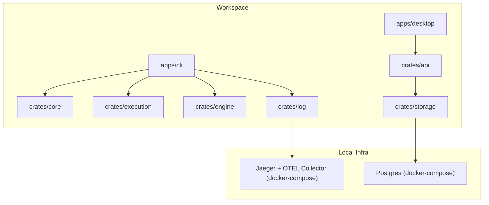
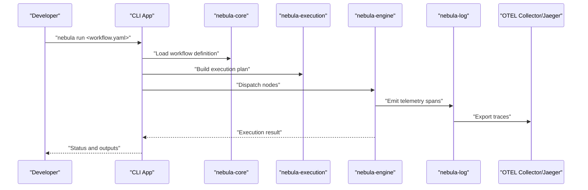
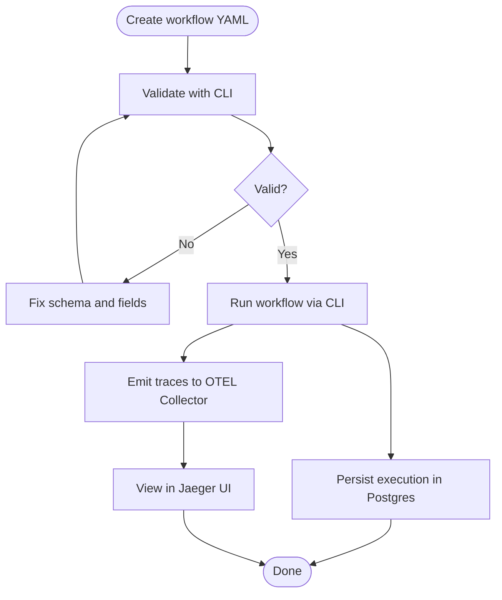
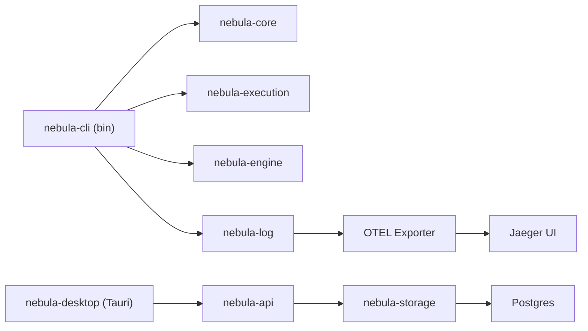

# Getting Started

<cite>
**Referenced Files in This Document**
- [README.md](file://README.md)
- [Cargo.toml](file://Cargo.toml)
- [rust-toolchain.toml](file://rust-toolchain.toml)
- [.cargo/config.toml](file://.cargo/config.toml)
- [Taskfile.yml](file://Taskfile.yml)
- [apps/cli/Cargo.toml](file://apps/cli/Cargo.toml)
- [apps/cli/src/main.rs](file://apps/cli/src/main.rs)
- [apps/cli/examples/hello.yaml](file://apps/cli/examples/hello.yaml)
- [apps/cli/examples/pipeline.yaml](file://apps/cli/examples/pipeline.yaml)
- [apps/desktop/package.json](file://apps/desktop/package.json)
- [apps/desktop/src/main.tsx](file://apps/desktop/src/main.tsx)
- [apps/desktop/src-tauri/Cargo.toml](file://apps/desktop/src-tauri/Cargo.toml)
- [deploy/docker/docker-compose.yml](file://deploy/docker/docker-compose.yml)
- [deploy/docker/docker-compose.observability.yml](file://deploy/docker/docker-compose.observability.yml)
- [deploy/docker/otel-collector-config.yaml](file://deploy/docker/otel-collector-config.yaml)
</cite>

## Table of Contents
1. [Introduction](#introduction)
2. [Project Structure](#project-structure)
3. [Core Components](#core-components)
4. [Architecture Overview](#architecture-overview)
5. [Detailed Component Analysis](#detailed-component-analysis)
6. [Dependency Analysis](#dependency-analysis)
7. [Performance Considerations](#performance-considerations)
8. [Troubleshooting Guide](#troubleshooting-guide)
9. [Conclusion](#conclusion)
10. [Appendices](#appendices)

## Introduction
This guide helps you quickly set up Nebula, install prerequisites, configure your development environment, and run your first workflow using either the CLI or the desktop application. You will also learn how to stand up local infrastructure (Postgres, observability), run tests, and troubleshoot common issues.

Nebula is a modular, type-safe workflow automation engine written in Rust. It supports both command-line and desktop entry points, with a focus on production-grade security, resilience, and composability.

## Project Structure
At a high level, the repository is a Cargo workspace containing:
- Core and business crates for workflows, execution, credentials, and runtime
- Public applications: CLI and a Tauri-based desktop app
- Deployment assets for local infrastructure and observability stacks

**Diagram sources**
- [Cargo.toml:1-40](file://Cargo.toml#L1-L40)
- [apps/cli/Cargo.toml:57-66](file://apps/cli/Cargo.toml#L57-L66)
- [apps/desktop/src-tauri/Cargo.toml:43-43](file://apps/desktop/src-tauri/Cargo.toml#L43-L43)
- [deploy/docker/docker-compose.yml:7-26](file://deploy/docker/docker-compose.yml#L7-L26)
- [deploy/docker/docker-compose.observability.yml:5-24](file://deploy/docker/docker-compose.observability.yml#L5-L24)

**Section sources**
- [Cargo.toml:1-40](file://Cargo.toml#L1-L40)
- [README.md:93-98](file://README.md#L93-L98)

## Core Components
- CLI application: Provides commands to run, validate, replay, watch workflows, manage plugins and developer scaffolding, and generate shell completions.
- Desktop application: A Tauri + React shell for interacting with Nebula features.
- Local infrastructure: Postgres for persistence and Jaeger + OTEL collector for observability.

Key entry points:
- CLI: [apps/cli/src/main.rs:18-40](file://apps/cli/src/main.rs#L18-L40)
- Desktop: [apps/desktop/src/main.tsx:7-13](file://apps/desktop/src/main.tsx#L7-L13)
- Infrastructure: [deploy/docker/docker-compose.yml:7-26](file://deploy/docker/docker-compose.yml#L7-L26), [deploy/docker/docker-compose.observability.yml:5-24](file://deploy/docker/docker-compose.observability.yml#L5-L24)

**Section sources**
- [apps/cli/src/main.rs:18-40](file://apps/cli/src/main.rs#L18-L40)
- [apps/desktop/src/main.tsx:7-13](file://apps/desktop/src/main.tsx#L7-L13)
- [deploy/docker/docker-compose.yml:7-26](file://deploy/docker/docker-compose.yml#L7-L26)
- [deploy/docker/docker-compose.observability.yml:5-24](file://deploy/docker/docker-compose.observability.yml#L5-L24)

## Architecture Overview
The CLI integrates with core Nebula crates to execute workflows. The desktop app consumes the API layer and storage layer for persistence. Observability is wired through OpenTelemetry to Jaeger.

**Diagram sources**
- [apps/cli/src/main.rs:61-105](file://apps/cli/src/main.rs#L61-L105)
- [apps/cli/Cargo.toml:57-66](file://apps/cli/Cargo.toml#L57-L66)
- [deploy/docker/otel-collector-config.yaml:1-26](file://deploy/docker/otel-collector-config.yaml#L1-L26)

## Detailed Component Analysis

### Prerequisites and Toolchain
- Rust 1.95+ and edition 2024 are required. The repository pins the toolchain and enforces the minimum version.
- Optional: cargo-nextest for faster test runs.

What to install:
- Rust toolchain: [rust-toolchain.toml:16-18](file://rust-toolchain.toml#L16-L18)
- Workspace requirements: [Cargo.toml:43-46](file://Cargo.toml#L43-L46)
- Optional test runner: [README.md:120-120](file://README.md#L120-L120)

Environment variables:
- Configure via Figment-based layered config in the CLI (defaults → files → env → CLI flags). See [apps/cli/Cargo.toml:49-49](file://apps/cli/Cargo.toml#L49-L49).

**Section sources**
- [rust-toolchain.toml:16-18](file://rust-toolchain.toml#L16-L18)
- [Cargo.toml:43-46](file://Cargo.toml#L43-L46)
- [README.md:120-120](file://README.md#L120-L120)
- [apps/cli/Cargo.toml:49-49](file://apps/cli/Cargo.toml#L49-L49)

### Local Infrastructure Setup

#### Postgres (required)
- Start Postgres with Docker Compose and run migrations.
- Configure environment variables for connection via the CLI config mechanism.

Commands:
- Start Postgres: [Taskfile.yml:156-164](file://Taskfile.yml#L156-L164)
- Run migrations: [Taskfile.yml:171-184](file://Taskfile.yml#L171-L184)
- Compose file: [deploy/docker/docker-compose.yml:7-26](file://deploy/docker/docker-compose.yml#L7-L26)

Environment variables:
- POSTGRES_USER, POSTGRES_PASSWORD, POSTGRES_DB, POSTGRES_PORT (from compose file)
- DATABASE_URL (required by migrations): [Taskfile.yml:171-174](file://Taskfile.yml#L171-L174)

**Section sources**
- [Taskfile.yml:156-184](file://Taskfile.yml#L156-L184)
- [deploy/docker/docker-compose.yml:11-16](file://deploy/docker/docker-compose.yml#L11-L16)

#### Observability Stack (Jaeger + OTEL Collector)
- Start Jaeger and OTEL collector for local tracing.
- Configure OTEL endpoints to export to Jaeger.

Commands:
- Start observability stack: [Taskfile.yml:245-253](file://Taskfile.yml#L245-L253)
- Collector config: [deploy/docker/otel-collector-config.yaml:1-26](file://deploy/docker/otel-collector-config.yaml#L1-L26)
- Jaeger compose: [deploy/docker/docker-compose.observability.yml:5-24](file://deploy/docker/docker-compose.observability.yml#L5-L24)

**Section sources**
- [Taskfile.yml:245-253](file://Taskfile.yml#L245-L253)
- [deploy/docker/otel-collector-config.yaml:1-26](file://deploy/docker/otel-collector-config.yaml#L1-L26)
- [deploy/docker/docker-compose.observability.yml:5-24](file://deploy/docker/docker-compose.observability.yml#L5-L24)

### Desktop Application Development
- Install frontend dependencies and launch the Tauri app in development mode.
- The desktop app integrates with Nebula’s plugin system and exposes a Tauri backend crate.

Commands:
- Install dependencies: [Taskfile.yml:257-267](file://Taskfile.yml#L257-L267)
- Launch dev mode: [Taskfile.yml:263-267](file://Taskfile.yml#L263-L267)
- Frontend scripts: [apps/desktop/package.json:6-17](file://apps/desktop/package.json#L6-L17)
- Entry point: [apps/desktop/src/main.tsx:7-13](file://apps/desktop/src/main.tsx#L7-L13)
- Backend crate: [apps/desktop/src-tauri/Cargo.toml:43-43](file://apps/desktop/src-tauri/Cargo.toml#L43-L43)

**Section sources**
- [Taskfile.yml:257-267](file://Taskfile.yml#L257-L267)
- [apps/desktop/package.json:6-17](file://apps/desktop/package.json#L6-L17)
- [apps/desktop/src/main.tsx:7-13](file://apps/desktop/src/main.tsx#L7-L13)
- [apps/desktop/src-tauri/Cargo.toml:43-43](file://apps/desktop/src-tauri/Cargo.toml#L43-L43)

### First Workflow Creation (CLI)
Follow these steps to create and run your first workflow:

1. Prepare a workflow YAML (examples are provided).
   - Minimal workflow: [apps/cli/examples/hello.yaml:1-20](file://apps/cli/examples/hello.yaml#L1-L20)
   - Multi-node pipeline: [apps/cli/examples/pipeline.yaml:1-37](file://apps/cli/examples/pipeline.yaml#L1-L37)

2. Validate the workflow definition.
   - CLI command: [apps/cli/src/main.rs:61-105](file://apps/cli/src/main.rs#L61-L105)

3. Run the workflow.
   - CLI command: [apps/cli/src/main.rs:61-105](file://apps/cli/src/main.rs#L61-L105)

4. Observe traces in Jaeger.
   - Access UI at http://localhost:16686 after starting the observability stack.
   - Collector endpoints: [deploy/docker/otel-collector-config.yaml:4-7](file://deploy/docker/otel-collector-config.yaml#L4-L7)

**Diagram sources**
- [apps/cli/examples/hello.yaml:1-20](file://apps/cli/examples/hello.yaml#L1-L20)
- [apps/cli/examples/pipeline.yaml:1-37](file://apps/cli/examples/pipeline.yaml#L1-L37)
- [apps/cli/src/main.rs:61-105](file://apps/cli/src/main.rs#L61-L105)
- [deploy/docker/otel-collector-config.yaml:1-26](file://deploy/docker/otel-collector-config.yaml#L1-L26)

**Section sources**
- [apps/cli/examples/hello.yaml:1-20](file://apps/cli/examples/hello.yaml#L1-L20)
- [apps/cli/examples/pipeline.yaml:1-37](file://apps/cli/examples/pipeline.yaml#L1-L37)
- [apps/cli/src/main.rs:61-105](file://apps/cli/src/main.rs#L61-L105)
- [deploy/docker/otel-collector-config.yaml:1-26](file://deploy/docker/otel-collector-config.yaml#L1-L26)

### Basic CLI Usage
Common commands and entry points:
- Entry point and dispatch: [apps/cli/src/main.rs:18-40](file://apps/cli/src/main.rs#L18-L40)
- Command routing: [apps/cli/src/main.rs:61-105](file://apps/cli/src/main.rs#L61-L105)
- Crate dependencies (core execution): [apps/cli/Cargo.toml:57-66](file://apps/cli/Cargo.toml#L57-L66)

Typical workflows:
- Validate a workflow YAML
- Run a workflow once
- Replay a previous execution
- Watch for file changes and auto-run
- Manage plugins and developer scaffolding

**Section sources**
- [apps/cli/src/main.rs:18-40](file://apps/cli/src/main.rs#L18-L40)
- [apps/cli/src/main.rs:61-105](file://apps/cli/src/main.rs#L61-L105)
- [apps/cli/Cargo.toml:57-66](file://apps/cli/Cargo.toml#L57-L66)

### Running Tests
Recommended local gate:
- Run nextest across the workspace, plus documentation and deny checks.

Command:
- [Taskfile.yml:300-308](file://Taskfile.yml#L300-L308)

Workspace-wide test runner:
- [README.md:116-118](file://README.md#L116-L118)

**Section sources**
- [Taskfile.yml:300-308](file://Taskfile.yml#L300-L308)
- [README.md:116-118](file://README.md#L116-L118)

## Dependency Analysis
The CLI depends on core Nebula crates for execution and logging. The desktop app depends on the API crate and integrates with storage for persistence. Observability is configured via OTEL exporter to Jaeger.

**Diagram sources**
- [apps/cli/Cargo.toml:57-66](file://apps/cli/Cargo.toml#L57-L66)
- [apps/desktop/src-tauri/Cargo.toml:43-43](file://apps/desktop/src-tauri/Cargo.toml#L43-L43)
- [deploy/docker/docker-compose.yml:7-26](file://deploy/docker/docker-compose.yml#L7-L26)
- [deploy/docker/docker-compose.observability.yml:5-24](file://deploy/docker/docker-compose.observability.yml#L5-L24)

**Section sources**
- [apps/cli/Cargo.toml:57-66](file://apps/cli/Cargo.toml#L57-L66)
- [apps/desktop/src-tauri/Cargo.toml:43-43](file://apps/desktop/src-tauri/Cargo.toml#L43-L43)
- [deploy/docker/docker-compose.yml:7-26](file://deploy/docker/docker-compose.yml#L7-L26)
- [deploy/docker/docker-compose.observability.yml:5-24](file://deploy/docker/docker-compose.observability.yml#L5-L24)

## Performance Considerations
- Prefer nextest for faster test runs in local development.
- Use the provided Taskfile tasks for formatting, linting, and quality gates to maintain a smooth iteration cycle.
- Keep incremental builds disabled in the workspace to avoid cache-related rebuild issues.

**Section sources**
- [Taskfile.yml:300-308](file://Taskfile.yml#L300-L308)
- [.cargo/config.toml:26-30](file://.cargo/config.toml#L26-L30)

## Troubleshooting Guide
Common issues and resolutions:

- Rust version mismatch
  - Ensure you are using Rust 1.95+ as required by the workspace.
  - Verify pinned toolchain: [rust-toolchain.toml:16-18](file://rust-toolchain.toml#L16-L18)
  - Confirm workspace minimum: [Cargo.toml:43-46](file://Cargo.toml#L43-L46)

- Postgres connectivity
  - Confirm environment variables are set for Postgres and DATABASE_URL.
  - Start containers and migrations: [Taskfile.yml:156-184](file://Taskfile.yml#L156-L184)
  - Check compose configuration: [deploy/docker/docker-compose.yml:11-16](file://deploy/docker/docker-compose.yml#L11-L16)

- Observability not appearing in Jaeger
  - Ensure observability stack is up: [Taskfile.yml:245-253](file://Taskfile.yml#L245-L253)
  - Verify OTEL endpoints: [deploy/docker/otel-collector-config.yaml:4-7](file://deploy/docker/otel-collector-config.yaml#L4-L7)
  - Access UI at http://localhost:16686

- Desktop app fails to start
  - Install frontend dependencies: [Taskfile.yml:257-267](file://Taskfile.yml#L257-L267)
  - Launch dev mode: [Taskfile.yml:263-267](file://Taskfile.yml#L263-L267)
  - Check frontend scripts: [apps/desktop/package.json:6-17](file://apps/desktop/package.json#L6-L17)

- Logging and environment variables
  - CLI respects RUST_LOG and NEBULA_LOG; otherwise uses configured level.
  - See logging initialization: [apps/cli/src/main.rs:42-59](file://apps/cli/src/main.rs#L42-L59)

**Section sources**
- [rust-toolchain.toml:16-18](file://rust-toolchain.toml#L16-L18)
- [Cargo.toml:43-46](file://Cargo.toml#L43-L46)
- [Taskfile.yml:156-184](file://Taskfile.yml#L156-L184)
- [deploy/docker/docker-compose.yml:11-16](file://deploy/docker/docker-compose.yml#L11-L16)
- [Taskfile.yml:245-253](file://Taskfile.yml#L245-L253)
- [deploy/docker/otel-collector-config.yaml:4-7](file://deploy/docker/otel-collector-config.yaml#L4-L7)
- [Taskfile.yml:257-267](file://Taskfile.yml#L257-L267)
- [apps/desktop/package.json:6-17](file://apps/desktop/package.json#L6-L17)
- [apps/cli/src/main.rs:42-59](file://apps/cli/src/main.rs#L42-L59)

## Conclusion
You now have the essentials to install prerequisites, configure your environment, start local infrastructure, and run your first workflow using the CLI or desktop app. Use the provided tasks and examples to iterate quickly, and refer to the troubleshooting section for common setup issues.

## Appendices

### Quick Start Commands
- Clone and build:
  - [README.md:113-118](file://README.md#L113-L118)
- Start Postgres and migrations:
  - [Taskfile.yml:156-184](file://Taskfile.yml#L156-L184)
- Start observability stack:
  - [Taskfile.yml:245-253](file://Taskfile.yml#L245-L253)
- Run tests:
  - [Taskfile.yml:300-308](file://Taskfile.yml#L300-L308)
- Desktop dev:
  - [Taskfile.yml:257-267](file://Taskfile.yml#L257-L267)