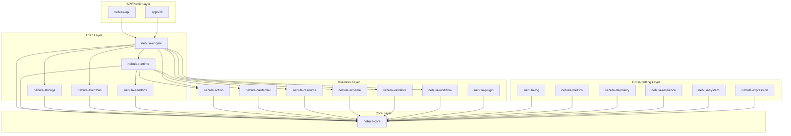
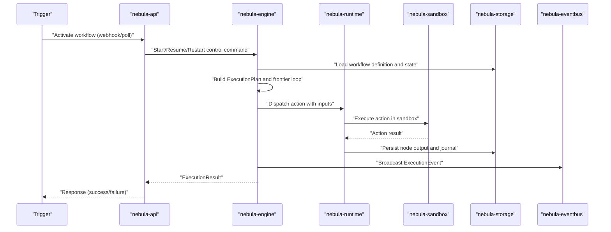
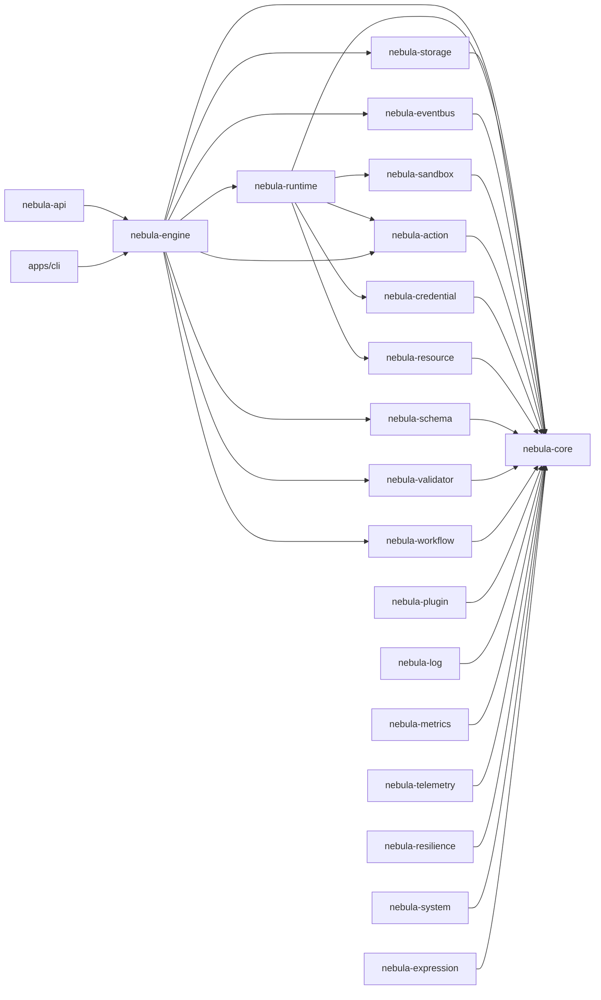

# Architecture Overview

<cite>
**Referenced Files in This Document**
- [Cargo.toml](file://Cargo.toml)
- [deny.toml](file://deny.toml)
- [crates/core/src/lib.rs](file://crates/core/src/lib.rs)
- [crates/action/src/lib.rs](file://crates/action/src/lib.rs)
- [crates/engine/src/lib.rs](file://crates/engine/src/lib.rs)
- [crates/engine/src/engine.rs](file://crates/engine/src/engine.rs)
- [crates/api/src/lib.rs](file://crates/api/src/lib.rs)
- [crates/api/src/app.rs](file://crates/api/src/app.rs)
- [crates/execution/src/lib.rs](file://crates/execution/src/lib.rs)
- [crates/eventbus/src/lib.rs](file://crates/eventbus/src/lib.rs)
- [crates/runtime/src/lib.rs](file://crates/runtime/src/lib.rs)
- [crates/storage/src/lib.rs](file://crates/storage/src/lib.rs)
- [crates/sdk/src/lib.rs](file://crates/sdk/src/lib.rs)
- [crates/sandbox/src/lib.rs](file://crates/sandbox/src/lib.rs)
</cite>

## Table of Contents
1. [Introduction](#introduction)
2. [Project Structure](#project-structure)
3. [Core Components](#core-components)
4. [Architecture Overview](#architecture-overview)
5. [Detailed Component Analysis](#detailed-component-analysis)
6. [Dependency Analysis](#dependency-analysis)
7. [Performance Considerations](#performance-considerations)
8. [Troubleshooting Guide](#troubleshooting-guide)
9. [Conclusion](#conclusion)
10. [Appendices](#appendices)

## Introduction
This document presents the Nebula architecture overview with a focus on the layered architecture approach and component relationships. Nebula organizes its 39 member crates into seven conceptual layers: Core, Business, Exec, API/Public, and Cross-cutting. Mechanical layer boundaries are enforced by cargo deny to maintain strict one-way dependencies. The document explains the crate map, data flow from triggers to action execution, and the architectural patterns in use, including composition root pattern, ports & adapters, repository pattern, observer pattern, and strategy pattern. Both high-level conceptual understanding and detailed technical implementation are provided.

## Project Structure
Nebula uses a Cargo workspace with a curated set of member crates grouped by functional domains. The workspace members include core libraries, business logic crates, execution orchestration, API gateway, runtime and sandbox, storage, and developer SDKs. The deny.toml configuration enforces layering by banning lower-layer crates from depending on upper-layer crates, with narrowly permitted exceptions for specific integration scenarios.

```mermaid
graph TB
subgraph "Workspace Roots"
WS["Cargo.toml<br/>members = [apps, crates, examples]"]
DENY["deny.toml<br/>layer enforcement"]
end
subgraph "Core Layer"
CORE["nebula-core"]
end
subgraph "Business Layer"
ACTION["nebula-action"]
SCHEMA["nebula-schema"]
VALIDATOR["nebula-validator"]
METADATA["nebula-metadata"]
WORKFLOW["nebula-workflow"]
CREDENTIAL["nebula-credential"]
RESOURCE["nebula-resource"]
PLUGIN["nebula-plugin"]
PLUGIN_SDK["nebula-plugin-sdk"]
ERROR["nebula-error"]
end
subgraph "Exec Layer"
EXECUTION["nebula-execution"]
ENGINE["nebula-engine"]
RUNTIME["nebula-runtime"]
STORAGE["nebula-storage"]
SANDBOX["nebula-sandbox"]
EVENTBUS["nebula-eventbus"]
end
subgraph "API/Public Layer"
API["nebula-api"]
CLI["apps/cli"]
end
subgraph "Cross-cutting Layer"
LOG["nebula-log"]
METRICS["nebula-metrics"]
TELEMETRY["nebula-telemetry"]
RESILIENCE["nebula-resilience"]
SYSTEM["nebula-system"]
EXPRESSION["nebula-expression"]
VALIDATOR["nebula-validator"]
end
WS --> CORE
WS --> ACTION
WS --> EXECUTION
WS --> ENGINE
WS --> RUNTIME
WS --> STORAGE
WS --> SANDBOX
WS --> API
WS --> CLI
WS --> LOG
WS --> METRICS
WS --> TELEMETRY
WS --> RESILIENCE
WS --> SYSTEM
WS --> EXPRESSION
DENY --> API
DENY --> ENGINE
DENY --> RUNTIME
DENY --> SANDBOX
DENY --> STORAGE
DENY --> SDK["nebula-sdk"]
DENY --> PLUGIN_SDK
```

**Diagram sources**
- [Cargo.toml:1-39](file://Cargo.toml#L1-L39)
- [deny.toml:51-86](file://deny.toml#L51-L86)

**Section sources**
- [Cargo.toml:1-39](file://Cargo.toml#L1-L39)
- [deny.toml:51-86](file://deny.toml#L51-L86)

## Core Components
This section introduces the seven-layer architecture and the purpose of each layer, along with the enforced dependency relationships.

- Core layer
  - Provides shared vocabulary and foundational types used across all other layers. It defines identifiers, keys, scopes, context contracts, guards, lifecycle primitives, and observability identities. This layer is foundational and must not depend on any other layer.
  - Example crates: nebula-core.

- Business layer
  - Contains domain logic and contracts for actions, credentials, resources, schemas, validators, plugins, workflows, and metadata. It defines the ports and contracts that the execution layer consumes.
  - Example crates: nebula-action, nebula-credential, nebula-resource, nebula-schema, nebula-validator, nebula-plugin, nebula-workflow, nebula-metadata.

- Exec layer
  - Implements execution orchestration, runtime dispatch, storage repositories, sandboxing, and event broadcasting. It depends on Core and Business layers but must not depend on API/Public layer.
  - Example crates: nebula-execution, nebula-engine, nebula-runtime, nebula-storage, nebula-sandbox, nebula-eventbus.

- API/Public layer
  - Exposes HTTP entry points and public integrations. It depends on Core and Business layers for domain logic and on Exec layer for orchestration. It must not depend on lower layers.
  - Example crates: nebula-api, apps/cli.

- Cross-cutting layer
  - Provides shared concerns like logging, metrics, telemetry, resilience, system utilities, and expression evaluation. These crates support all other layers without introducing upward dependencies.
  - Example crates: nebula-log, nebula-metrics, nebula-telemetry, nebula-resilience, nebula-system, nebula-expression.

Mechanical layer boundaries are enforced by cargo deny bans. For example:
- API (uppermost) must not be depended on by lower layers except in narrowly permitted cases.
- Exec layer crates (engine, runtime, storage, sandbox) must not be depended on by business/core crates.
- SDK and Plugin-SDK have controlled access to prevent misuse.

**Section sources**
- [crates/core/src/lib.rs:1-111](file://crates/core/src/lib.rs#L1-L111)
- [crates/action/src/lib.rs:1-152](file://crates/action/src/lib.rs#L1-L152)
- [crates/engine/src/lib.rs:1-79](file://crates/engine/src/lib.rs#L1-L79)
- [crates/execution/src/lib.rs:1-63](file://crates/execution/src/lib.rs#L1-L63)
- [crates/eventbus/src/lib.rs:1-156](file://crates/eventbus/src/lib.rs#L1-L156)
- [crates/runtime/src/lib.rs:1-50](file://crates/runtime/src/lib.rs#L1-L50)
- [crates/storage/src/lib.rs:1-105](file://crates/storage/src/lib.rs#L1-L105)
- [crates/api/src/lib.rs:1-60](file://crates/api/src/lib.rs#L1-L60)
- [crates/sdk/src/lib.rs:1-279](file://crates/sdk/src/lib.rs#L1-L279)
- [crates/sandbox/src/lib.rs:1-56](file://crates/sandbox/src/lib.rs#L1-L56)
- [deny.toml:51-86](file://deny.toml#L51-L86)

## Architecture Overview
Nebula’s layered architecture enforces one-way dependencies and a clear separation of concerns. The composition root pattern centralizes initialization of the execution engine, while ports & adapters decouple the API from business logic. The repository pattern separates persistence concerns, observer pattern enables event-driven communication, and strategy pattern supports pluggable policies and behaviors.

**Diagram sources**
- [crates/api/src/lib.rs:1-60](file://crates/api/src/lib.rs#L1-L60)
- [crates/engine/src/lib.rs:1-79](file://crates/engine/src/lib.rs#L1-L79)
- [crates/runtime/src/lib.rs:1-50](file://crates/runtime/src/lib.rs#L1-L50)
- [crates/storage/src/lib.rs:1-105](file://crates/storage/src/lib.rs#L1-L105)
- [crates/eventbus/src/lib.rs:1-156](file://crates/eventbus/src/lib.rs#L1-L156)
- [crates/action/src/lib.rs:1-152](file://crates/action/src/lib.rs#L1-L152)
- [crates/core/src/lib.rs:1-111](file://crates/core/src/lib.rs#L1-L111)

## Detailed Component Analysis

### Seven-Layer Crate Map
Below is the organized crate map across the seven layers. Each crate is listed with its layer, purpose, and key responsibilities.

- Core layer
  - nebula-core: Shared identifiers, keys, scopes, context contracts, guards, lifecycle, and observability identities.

- Business layer
  - nebula-action: Action trait family, execution metadata, ports, and result types.
  - nebula-credential: Credential contracts, resolution, rotation, and access control.
  - nebula-resource: Resource lifecycle, pooling, and scoped resource management.
  - nebula-schema: JSON schema builders, validation, and field definitions.
  - nebula-validator: Validation macros and utilities.
  - nebula-workflow: Workflow definition, DAG, connections, and control flow.
  - nebula-plugin: Plugin manifests, registries, and discovery.
  - nebula-plugin-sdk: Protocol and transport for out-of-process plugins.
  - nebula-error: Error types and macros for consistent error handling.

- Exec layer
  - nebula-execution: Execution state machine, journal, idempotency, and planning.
  - nebula-engine: Composition root orchestrator, control queue consumer, and dispatch.
  - nebula-runtime: Action dispatcher, registry, data policies, and sandbox integration.
  - nebula-storage: Execution and workflow repositories, persistence interfaces, and backends.
  - nebula-sandbox: In-process and process sandbox execution, capability model, and runner abstractions.
  - nebula-eventbus: In-process publish-subscribe channel with back-pressure.

- API/Public layer
  - nebula-api: HTTP entry point, handlers, middleware, webhook transport, and state.
  - apps/cli: Command-line interface and TUI.

- Cross-cutting layer
  - nebula-log: Logging configuration, layers, and observability hooks.
  - nebula-metrics: Metrics adapters, filters, and naming.
  - nebula-telemetry: Telemetry integration and exporters.
  - nebula-resilience: Circuit breaker, retries, timeouts, hedging, and bulkheads.
  - nebula-system: System utilities and platform abstractions.
  - nebula-expression: Expression engine for templates and runtime evaluation.

- Developer SDK
  - nebula-sdk: Integration authoring façade, builders, and test harness.

**Section sources**
- [crates/core/src/lib.rs:1-111](file://crates/core/src/lib.rs#L1-L111)
- [crates/action/src/lib.rs:1-152](file://crates/action/src/lib.rs#L1-L152)
- [crates/engine/src/lib.rs:1-79](file://crates/engine/src/lib.rs#L1-L79)
- [crates/execution/src/lib.rs:1-63](file://crates/execution/src/lib.rs#L1-L63)
- [crates/eventbus/src/lib.rs:1-156](file://crates/eventbus/src/lib.rs#L1-L156)
- [crates/runtime/src/lib.rs:1-50](file://crates/runtime/src/lib.rs#L1-L50)
- [crates/storage/src/lib.rs:1-105](file://crates/storage/src/lib.rs#L1-L105)
- [crates/api/src/lib.rs:1-60](file://crates/api/src/lib.rs#L1-L60)
- [crates/sdk/src/lib.rs:1-279](file://crates/sdk/src/lib.rs#L1-L279)
- [crates/sandbox/src/lib.rs:1-56](file://crates/sandbox/src/lib.rs#L1-L56)

### Data Flow: Triggers to Action Execution
The execution path begins when a trigger activates a workflow. The engine builds an execution plan, resolves node inputs, transitions execution state, and dispatches actions to the runtime, which executes them via the sandbox. Events are broadcast through the EventBus for observability and monitoring.

**Diagram sources**
- [crates/api/src/app.rs:18-69](file://crates/api/src/app.rs#L18-L69)
- [crates/engine/src/engine.rs:111-200](file://crates/engine/src/engine.rs#L111-L200)
- [crates/runtime/src/lib.rs:1-50](file://crates/runtime/src/lib.rs#L1-L50)
- [crates/sandbox/src/lib.rs:1-56](file://crates/sandbox/src/lib.rs#L1-L56)
- [crates/storage/src/lib.rs:1-105](file://crates/storage/src/lib.rs#L1-L105)
- [crates/eventbus/src/lib.rs:1-156](file://crates/eventbus/src/lib.rs#L1-L156)

### Architectural Patterns
- Composition root pattern
  - The engine acts as the composition root, wiring repositories, registries, and policies into a cohesive execution environment. The API layer constructs the engine and exposes control commands.

- Ports & adapters
  - The API uses port traits injected into AppState to delegate business logic to the engine. The engine consumes action contracts from nebula-action and delegates to runtime and sandbox.

- Repository pattern
  - ExecutionRepo and WorkflowRepo define persistence interfaces. The engine relies on these ports to persist state, journals, and checkpoints without binding to a specific storage implementation.

- Observer pattern
  - The EventBus provides a publish-subscribe mechanism for asynchronous event distribution. Domain crates publish typed events, and subscribers receive them with back-pressure semantics.

- Strategy pattern
  - Pluggable policies are supported via traits and registries (e.g., credential allowlists, data passing policies, and sandbox runners). Strategies can be swapped without changing the core orchestration logic.

**Section sources**
- [crates/engine/src/lib.rs:1-79](file://crates/engine/src/lib.rs#L1-L79)
- [crates/api/src/lib.rs:1-60](file://crates/api/src/lib.rs#L1-L60)
- [crates/storage/src/lib.rs:1-105](file://crates/storage/src/lib.rs#L1-L105)
- [crates/eventbus/src/lib.rs:1-156](file://crates/eventbus/src/lib.rs#L1-L156)
- [crates/runtime/src/lib.rs:1-50](file://crates/runtime/src/lib.rs#L1-L50)

### Enforcement Mechanisms
- Mechanical layer boundaries
  - cargo deny bans enforce one-way dependencies. For example, API is topmost and lower layers must not depend on it directly, except for narrowly permitted exceptions (e.g., CLI and specific tests). Exec-layer crates are similarly restricted from being consumed by business/core layers.

- Cross-crate communication via EventBus
  - The EventBus enables in-process, ephemeral event broadcasting without coupling producers to consumers. It is transport-only and avoids introducing upward dependencies.

- Controlled SDK and Plugin-SDK access
  - SDK and Plugin-SDK have restricted access to prevent misuse and ensure integration surfaces remain stable.

**Section sources**
- [deny.toml:51-86](file://deny.toml#L51-L86)
- [crates/eventbus/src/lib.rs:1-156](file://crates/eventbus/src/lib.rs#L1-L156)
- [crates/sdk/src/lib.rs:1-279](file://crates/sdk/src/lib.rs#L1-L279)
- [crates/sandbox/src/lib.rs:1-56](file://crates/sandbox/src/lib.rs#L1-L56)

## Dependency Analysis
The dependency relationships are governed by cargo deny bans and the layered architecture. The following diagram shows representative dependencies among major crates, highlighting the directionality enforced by layering.

**Diagram sources**
- [crates/api/src/lib.rs:1-60](file://crates/api/src/lib.rs#L1-L60)
- [crates/engine/src/lib.rs:1-79](file://crates/engine/src/lib.rs#L1-L79)
- [crates/runtime/src/lib.rs:1-50](file://crates/runtime/src/lib.rs#L1-L50)
- [crates/storage/src/lib.rs:1-105](file://crates/storage/src/lib.rs#L1-L105)
- [crates/eventbus/src/lib.rs:1-156](file://crates/eventbus/src/lib.rs#L1-L156)
- [crates/action/src/lib.rs:1-152](file://crates/action/src/lib.rs#L1-L152)
- [crates/core/src/lib.rs:1-111](file://crates/core/src/lib.rs#L1-L111)

**Section sources**
- [deny.toml:51-86](file://deny.toml#L51-L86)

## Performance Considerations
- Bounded concurrency and back-pressure
  - The engine’s frontier-based execution and bounded concurrency reduce contention and memory pressure. EventBus uses bounded channels with lagged recovery semantics to prevent unbounded memory growth.

- Idempotency and CAS transitions
  - ExecutionRepo enforces CAS transitions and idempotency checks to ensure safe retries and recovery without duplicating work.

- Streaming and large payload handling
  - Runtime employs streaming buffers and blob storage for large outputs, with data-passing policies to limit payload sizes.

- Observability and metrics
  - Metrics and telemetry are integrated across layers to monitor performance and detect bottlenecks early.

[No sources needed since this section provides general guidance]

## Troubleshooting Guide
- Layering violations
  - If cargo deny reports a violation, review the dependency chain and ensure the consuming crate belongs to a higher layer or falls under an explicitly permitted exception.

- Execution stalls or memory growth
  - Investigate slow subscribers on the EventBus and adjust buffer sizes or back-pressure policies. Verify that the engine’s event channel capacity is sufficient for the workload.

- Credential access denials
  - Confirm that the action’s credential allowlist is configured correctly in the engine and that the requested credential is present in the allowlist for the given action key.

- Sandbox execution issues
  - Check sandbox runner configuration and capability declarations. Ensure the plugin manifest and discovery paths are correct.

**Section sources**
- [deny.toml:51-86](file://deny.toml#L51-L86)
- [crates/eventbus/src/lib.rs:1-156](file://crates/eventbus/src/lib.rs#L1-L156)
- [crates/engine/src/engine.rs:148-155](file://crates/engine/src/engine.rs#L148-L155)
- [crates/runtime/src/lib.rs:1-50](file://crates/runtime/src/lib.rs#L1-L50)
- [crates/sandbox/src/lib.rs:1-56](file://crates/sandbox/src/lib.rs#L1-L56)

## Conclusion
Nebula’s layered architecture, enforced by cargo deny, ensures clear separation of concerns and predictable dependency flow. The composition root pattern centers orchestration in the engine, while ports & adapters, repository pattern, observer pattern, and strategy pattern enable flexibility and maintainability. The crate map and data flow diagrams illustrate how triggers propagate through the API, engine, runtime, and sandbox to produce action outcomes, all while leveraging cross-cutting concerns for reliability and observability.

[No sources needed since this section summarizes without analyzing specific files]

## Appendices

### Appendix A: Layering Enforcement Details
- API (nebula-api) may only be depended on by itself (dev-dep for test-util feature) and by narrowly permitted crates.
- Engine (nebula-engine) is exec-layer orchestration and must not be depended on by business/core crates.
- Runtime (nebula-runtime) is exec-layer and may only be depended on by designated upper-layer crates.
- Sandbox (nebula-sandbox) is the exec/infra boundary and may only be depended on by runtime and CLI.
- Storage (nebula-storage) is exec-layer and must not be depended on by business/core crates.
- SDK (nebula-sdk) is the external integration surface and may only be depended on by the examples workspace member.
- Plugin-SDK (nebula-plugin-sdk) is the out-of-process plugin protocol and may only be depended on by sandbox.

**Section sources**
- [deny.toml:51-86](file://deny.toml#L51-L86)