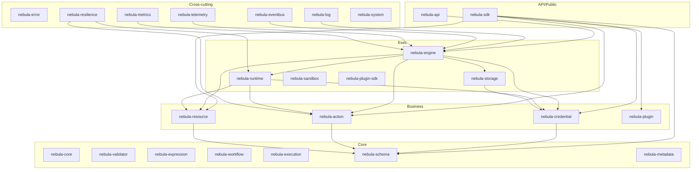
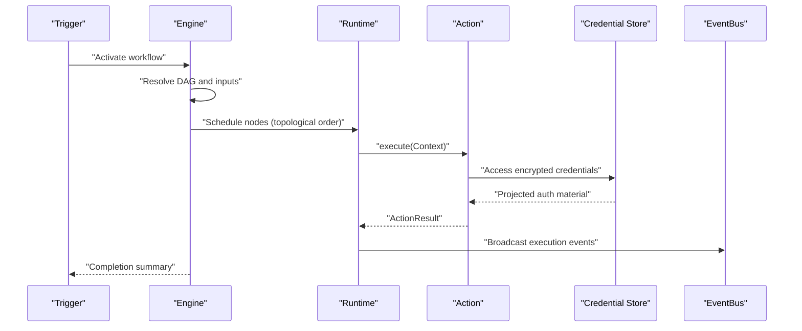
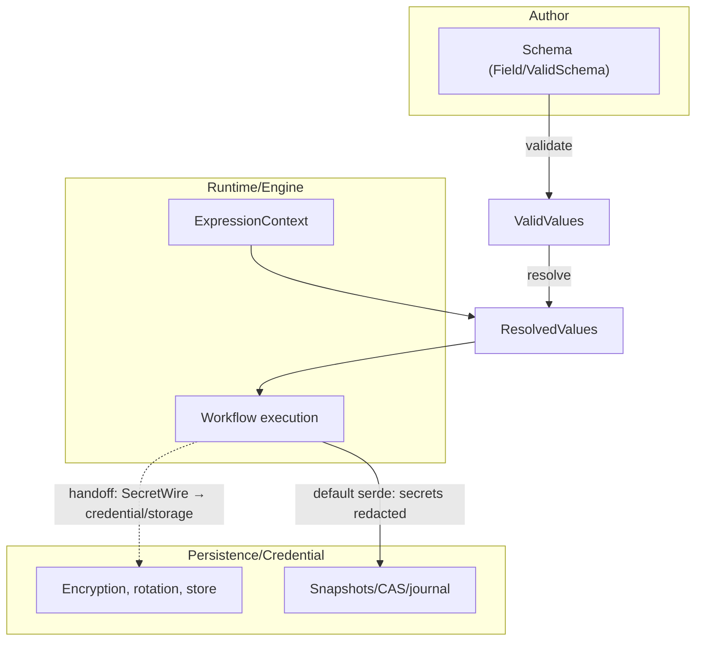
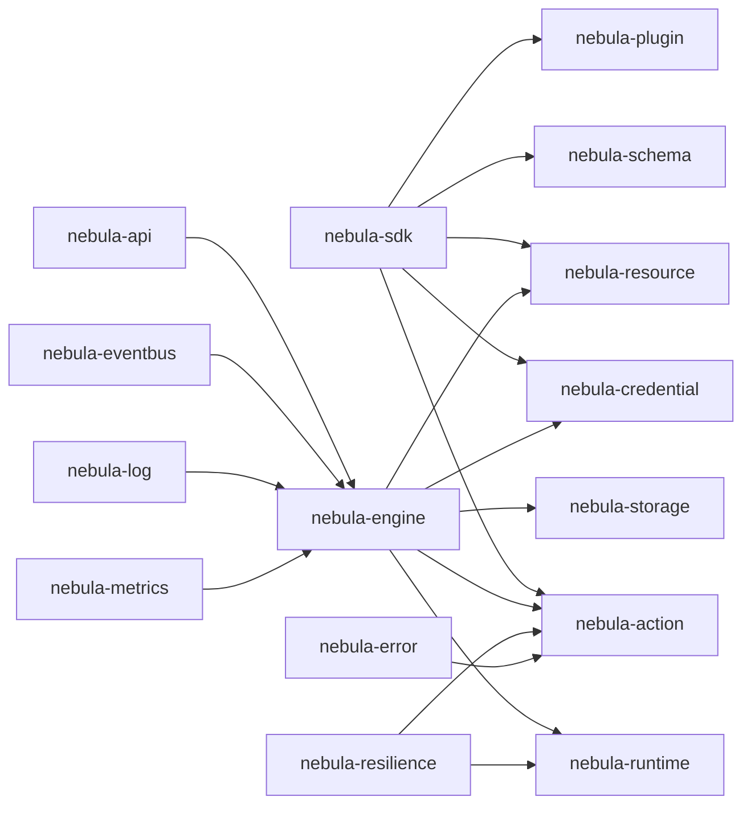

# Competitive Analysis

<cite>
**Referenced Files in This Document**
- [README.md](file://README.md)
- [COMPETITIVE.md](file://docs/COMPETITIVE.md)
- [PRODUCT_CANON.md](file://docs/PRODUCT_CANON.md)
- [INTEGRATION_MODEL.md](file://docs/INTEGRATION_MODEL.md)
- [n8n-action-pain-points.md](file://docs/research/n8n-action-pain-points.md)
- [temporal-peer-research.md](file://docs/research/temporal-peer-research.md)
- [Cargo.toml](file://Cargo.toml)
- [sdk/lib.rs](file://crates/sdk/src/lib.rs)
- [action/lib.rs](file://crates/action/src/lib.rs)
- [credential/lib.rs](file://crates/credential/src/lib.rs)
- [engine/lib.rs](file://crates/engine/src/lib.rs)
- [resilience/lib.rs](file://crates/resilience/src/lib.rs)
- [schema/lib.rs](file://crates/schema/src/lib.rs)
- [storage/Cargo.toml](file://crates/storage/Cargo.toml)
</cite>

## Table of Contents
1. [Introduction](#introduction)
2. [Project Structure](#project-structure)
3. [Core Components](#core-components)
4. [Architecture Overview](#architecture-overview)
5. [Detailed Component Analysis](#detailed-component-analysis)
6. [Dependency Analysis](#dependency-analysis)
7. [Performance Considerations](#performance-considerations)
8. [Troubleshooting Guide](#troubleshooting-guide)
9. [Conclusion](#conclusion)
10. [Appendices](#appendices)

## Introduction
This competitive analysis positions Nebula against major workflow automation platforms: n8n, Zapier, and Temporal. Nebula is a Rust-native, composable workflow engine emphasizing:
- Rust-based type safety across Actions, Credentials, Resources, and Schemas
- Security-by-default credential system with encryption-at-rest, AAD binding, and rotation
- Composable library architecture with explicit layering and cross-crate contracts
- Production-grade resilience patterns (retry, circuit breaker, hedging, bulkheads)
- First-class integration authoring via the SDK and plugin model

We compare feature parity, performance characteristics, security posture, and extensibility, and we highlight both strengths and limitations to help users choose when Nebula is the right fit versus established alternatives.

## Project Structure
Nebula is a layered, crate-based workspace with one-way dependencies and cross-cutting concerns. The high-level layers and their responsibilities are:
- API/Public: REST server, webhooks, SDK façade
- Exec: Engine, Runtime, Storage, Sandbox, Plugin SDK
- Business: Credential, Resource, Action, Plugin
- Core: Core types, Validator, Expression, Workflow, Execution, Schema, Metadata
- Cross-cutting: Log, System, EventBus, Telemetry, Metrics, Resilience, Error

**Diagram sources**
- [README.md:36-44](file://README.md#L36-L44)
- [Cargo.toml:1-39](file://Cargo.toml#L1-L39)

**Section sources**
- [README.md:36-44](file://README.md#L36-L44)
- [Cargo.toml:1-39](file://Cargo.toml#L1-L39)

## Core Components
Nebula’s differentiators are anchored in its core integration model and runtime guarantees:

- Typed authoring contracts: Actions, Credentials, Resources, Plugins, and Schema form a uniform structural contract with metadata and validated configuration. This is the foundation for compile-time safety and predictable runtime behavior.
- Security-by-default: Credentials are encrypted-at-rest with AES-256-GCM and Argon2id KDF, bound to records via AAD, and rotated by the engine. Debug output redacts secrets; rotation is built-in, not future-optional.
- Composable library architecture: One-way layer dependencies, typed pub/sub via EventBus, and explicit cross-crate contracts enable embedding and extending without monolithic coupling.
- Production-grade resilience: Composable patterns (retry, circuit breaker, rate limiting, hedging, bulkhead, load shedding) with explicit error modeling and observability sinks.
- Execution honesty: Durable execution with checkpoints, cancellation, leases, and journals; operators can explain what happened and why.

**Section sources**
- [README.md:16-27](file://README.md#L16-L27)
- [README.md:100-110](file://README.md#L100-L110)
- [PRODUCT_CANON.md:49-58](file://PRODUCT_CANON.md#L49-L58)
- [resilience/lib.rs:1-184](file://crates/resilience/src/lib.rs#L1-L184)

## Architecture Overview
Nebula’s runtime orchestrates DAG workflows, resolves typed inputs, and executes nodes with explicit resilience and observability. The engine builds an execution plan from a workflow DAG, schedules nodes topologically, and delegates action execution to the runtime. Typed boundaries and schema validation bridge dynamic graph execution with strongly typed nodes.

**Diagram sources**
- [README.md:48-59](file://README.md#L48-L59)
- [engine/lib.rs:28-38](file://crates/engine/src/lib.rs#L28-L38)

**Section sources**
- [README.md:48-59](file://README.md#L48-L59)
- [engine/lib.rs:28-38](file://crates/engine/src/lib.rs#L28-L38)

## Detailed Component Analysis

### Positioning Against n8n
- Insight: n8n offers a visual graph, self-hosted option, and a large node library.
- Ceiling: JS runtime lacks compile-time contracts; node quality is inconsistent; engine-level durability is limited; concurrency does not scale without operational pain.
- Nebula’s bet: Typed Rust integration contracts plus honest durability beat a large but soft ecosystem; a smaller library of reliable nodes wins over time.

Nebula mitigates n8n’s pain points through:
- Typed Action contracts and schema validation to eliminate author-responsibility for error routing, paired item lineage, and version migrations.
- Engine-managed contracts: typed onError policies, lineage tracking, and streaming item pipelines with backpressure.
- Security-by-default credentials with rotation and AAD binding, preventing credential drift and leaks across workflows.

Concrete advantages in production:
- Compile-time validation of Action I/O and parameter schemas eliminates runtime surprises.
- Encrypted credentials with rotation reduce risk and operational overhead.
- Composable resilience patterns integrated at outbound call sites improve reliability under network flakiness.

**Section sources**
- [COMPETITIVE.md:37-42](file://docs/COMPETITIVE.md#L37-L42)
- [n8n-action-pain-points.md:37-94](file://docs/research/n8n-action-pain-points.md#L37-L94)
- [credential/lib.rs:32-37](file://crates/credential/src/lib.rs#L32-L37)
- [sdk/lib.rs:26-41](file://crates/sdk/src/lib.rs#L26-L41)

### Positioning Against Temporal
- Insight: Temporal’s durable execution as a first-class primitive is powerful; replaying workflows from history is valuable.
- Ceiling: Operational complexity is real (worker fleet, persistence cluster, replay constraints bleed into authoring); DX is heavy outside large teams; local path often means Docker Compose or equivalent.
- Nebula’s bet: Checkpoint-based recovery with explicit persisted state is operationally simpler and equally honest for targeted use cases; local-first must mean a single binary/minimal deps, not a compose file as the default dev path.

Nebula’s advantages:
- Determinism is not required; scheduling order is static from the graph. Replay tests are a first-class CLI feature.
- Typed search attributes and execution timelines improve observability.
- Simpler local path with SQLite/local storage and clear control-plane durability via execution control queues.

Operational parity and improvements:
- Execution journal and structured errors provide explainability.
- Per-action-type concurrency limits and payload-size warnings mitigate history blowup and worker contention.

**Section sources**
- [COMPETITIVE.md:43-48](file://docs/COMPETITIVE.md#L43-L48)
- [temporal-peer-research.md:34-55](file://docs/research/temporal-peer-research.md#L34-L55)
- [temporal-peer-research.md:228-275](file://docs/research/temporal-peer-research.md#L228-L275)

### Positioning Against Zapier
- Insight: Integration breadth and low friction for non-developers.
- Ceiling: Not a developer-first self-hosted product; limited operational insight for authors; pricing/hosting model is SaaS-centric.
- Nebula’s bet: Not competing here—different primary user and deployment model.

Nebula’s value proposition:
- Developer-first integration authoring with typed contracts and robust testing harnesses.
- Strong security posture and local-first deployment path suitable for self-hosted environments.

**Section sources**
- [COMPETITIVE.md:55-59](file://docs/COMPETITIVE.md#L55-L59)

### Conceptual Overview
Nebula’s integration model treats Credentials, Resources, Actions, Plugins, and Schema as orthogonal concepts sharing a uniform structural contract. This reduces accidental complexity and improves operability.

**Diagram sources**
- [INTEGRATION_MODEL.md:31-84](file://docs/INTEGRATION_MODEL.md#L31-L84)

**Section sources**
- [INTEGRATION_MODEL.md:13-116](file://docs/INTEGRATION_MODEL.md#L13-L116)

## Dependency Analysis
Nebula’s workspace enforces one-way layer dependencies and cross-cutting imports. The SDK re-exports the full integration surface and adds convenience types for authoring and testing. The engine depends on runtime, storage, and integration crates, while resilience and error crates are cross-cutting.

**Diagram sources**
- [sdk/lib.rs:46-57](file://crates/sdk/src/lib.rs#L46-L57)
- [engine/lib.rs:48-79](file://crates/engine/src/lib.rs#L48-L79)
- [resilience/lib.rs:12-22](file://crates/resilience/src/lib.rs#L12-L22)

**Section sources**
- [sdk/lib.rs:46-57](file://crates/sdk/src/lib.rs#L46-L57)
- [engine/lib.rs:48-79](file://crates/engine/src/lib.rs#L48-L79)
- [resilience/lib.rs:12-22](file://crates/resilience/src/lib.rs#L12-L22)

## Performance Considerations
- Throughput: Async-native engine with bounded concurrency and small memory per execution; benchmarks in CI (e.g., CodSpeed) track regressions.
- Latency: Resilience patterns (retry, timeout, hedge) applied at outbound call sites; observability sinks capture p99 latencies.
- Storage backends: SQLite (local) and Postgres (self-hosted) are the supported production paths; optional Redis/S3 features gated behind feature flags.

Practical guidance:
- Prefer composable resilience pipelines close to external calls to minimize tail latency spikes.
- Use streaming item pipelines with backpressure to avoid memory pressure on large datasets.
- Monitor execution timelines and payload sizes to prevent history blowup.

**Section sources**
- [PRODUCT_CANON.md:98-113](file://PRODUCT_CANON.md#L98-L113)
- [temporal-peer-research.md:181-190](file://docs/research/temporal-peer-research.md#L181-L190)
- [storage/Cargo.toml:61-76](file://crates/storage/Cargo.toml#L61-L76)

## Troubleshooting Guide
Common concerns and how Nebula addresses them:

- Maturity and ecosystem support: Nebula is in active alpha with core crates stable and execution engine under active development. The SDK and plugin model provide a clear path for building integrations; operators can rely on documented per-crate maturity and product guarantees.
- Operational honesty: Execution journal, structured errors, and metrics enable operators to explain what happened and why. Control queue and cancellation semantics are explicit contracts.
- Security posture: Encrypted credentials with AAD binding, rotation, and redaction in logs. The credential subsystem underwent extensive adversarial reviews and SOC2 grading.
- Extensibility: Plugin packaging via Cargo.toml + plugin.toml + impl Plugin; cross-plugin dependencies enforced via Cargo graph; discovery validates SDK constraints and cross-plugin references.

Actionable tips:
- Use the SDK’s TestRuntime and RunReport for integration tests.
- Apply resilience pipelines at outbound call sites and instrument metrics sinks.
- Audit execution journals and timelines to diagnose failures and cancellations.

**Section sources**
- [README.md:160-165](file://README.md#L160-L165)
- [PRODUCT_CANON.md:118-141](file://PRODUCT_CANON.md#L118-L141)
- [credential/lib.rs:32-37](file://crates/credential/src/lib.rs#L32-L37)
- [INTEGRATION_MODEL.md:196-287](file://docs/INTEGRATION_MODEL.md#L196-L287)

## Conclusion
Nebula distinguishes itself by combining Rust-based type safety, security-by-default credentials, composable library architecture, and production-grade resilience. While n8n offers breadth and Temporal provides durable execution, Nebula targets a middle ground: a reliable, explainable, and developer-first workflow engine with strong operational honesty and a clear path to self-hosting. For teams needing embedded, extensible automation they can trust with production credentials, Nebula is the compelling choice.

## Appendices

### Feature Parity and Extensibility Matrix (Conceptual)
- Actions: Typed trait family with explicit execution semantics; schema-driven parameters; composable resilience at call sites.
- Credentials: Universal auth schemes, engine-owned rotation, encrypted-at-rest with AAD binding, rotation subsystem.
- Resources: Engine-owned lifecycle for long-lived connections; scoped and inspectable.
- Plugins: Cargo-first packaging; cross-plugin dependency rules; discovery validates SDK constraints.
- Schema: Shared typed configuration system; proof-token pipeline (validate → resolve).
- Resilience: Composable patterns (retry, circuit breaker, rate limiting, hedge, bulkhead, load shed) with observability.

**Section sources**
- [action/lib.rs:11-32](file://crates/action/src/lib.rs#L11-L32)
- [credential/lib.rs:20-31](file://crates/credential/src/lib.rs#L20-L31)
- [INTEGRATION_MODEL.md:85-116](file://docs/INTEGRATION_MODEL.md#L85-L116)
- [schema/lib.rs:110-112](file://crates/schema/src/lib.rs#L110-L112)
- [resilience/lib.rs:17-31](file://crates/resilience/src/lib.rs#L17-L31)