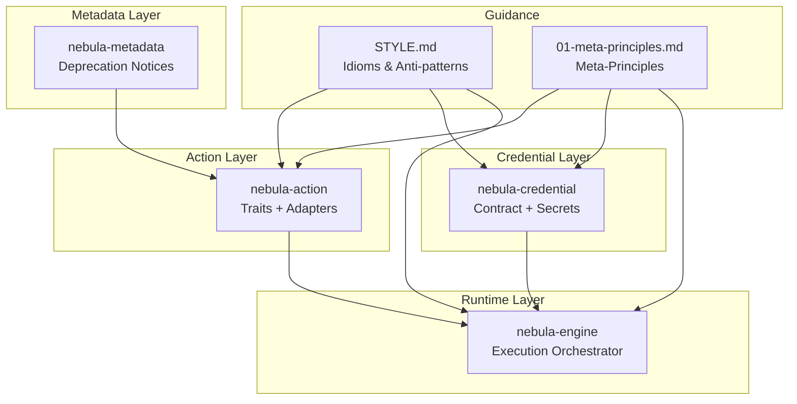
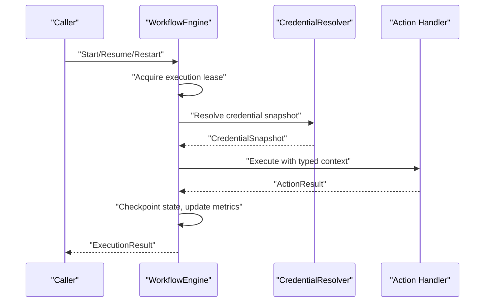
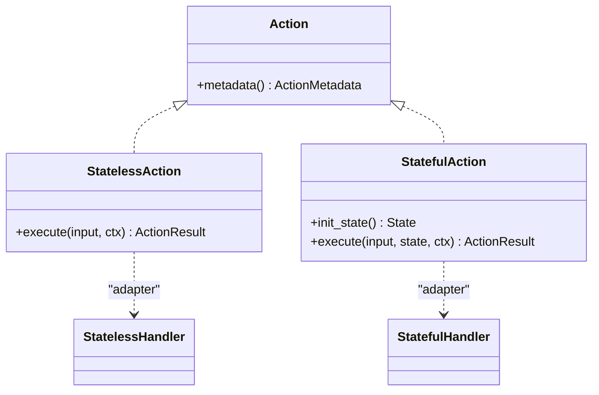
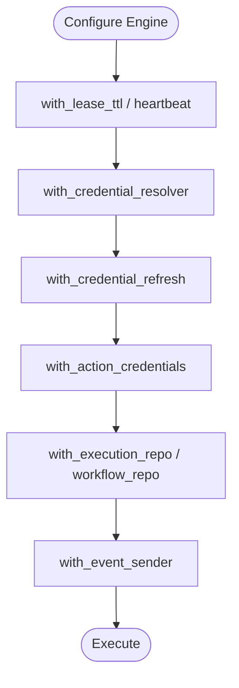
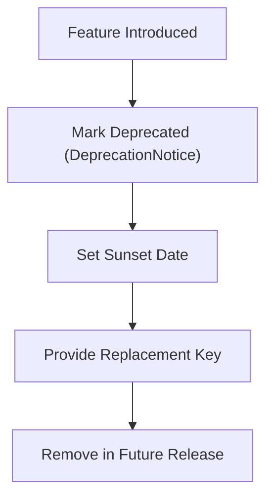
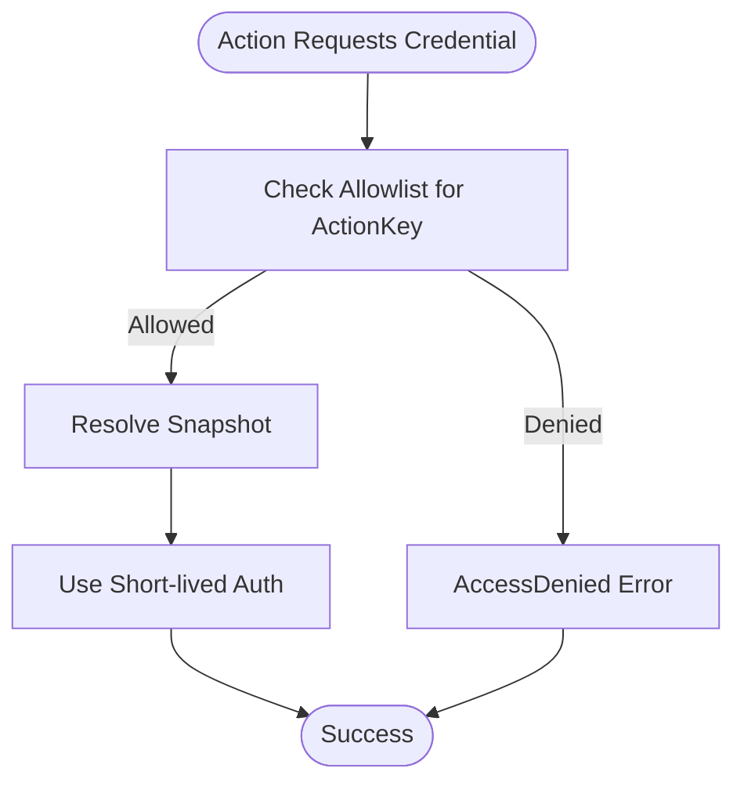
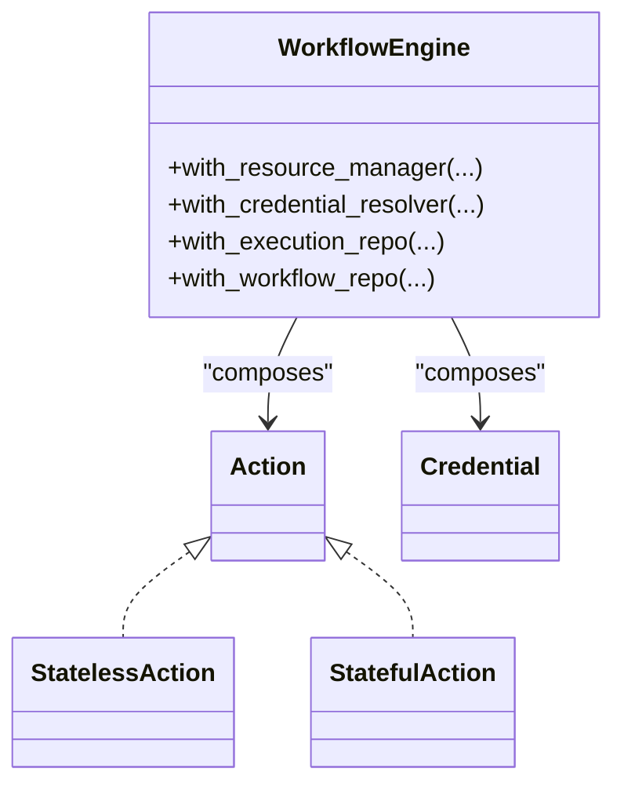
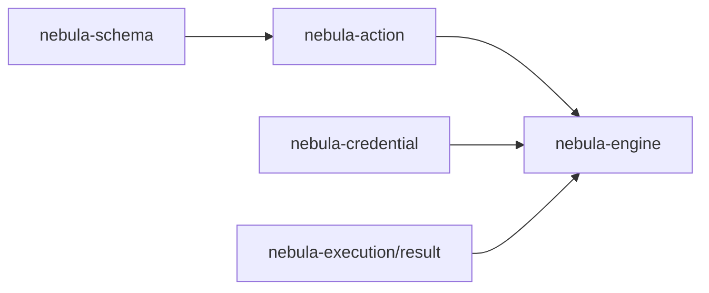

# Design Principles and Philosophy

<cite>
**Referenced Files in This Document**
- [01-meta-principles.md](file://docs/guidelines/01-meta-principles.md)
- [STYLE.md](file://docs/STYLE.md)
- [lib.rs](file://crates/action/src/lib.rs)
- [action.rs](file://crates/action/src/action.rs)
- [stateless.rs](file://crates/action/src/stateless.rs)
- [stateful.rs](file://crates/action/src/stateful.rs)
- [lib.rs](file://crates/credential/src/lib.rs)
- [mod.rs](file://crates/credential/src/contract/mod.rs)
- [mod.rs](file://crates/credential/src/secrets/mod.rs)
- [lib.rs](file://crates/engine/src/lib.rs)
- [engine.rs](file://crates/engine/src/engine.rs)
- [deprecation.rs](file://crates/metadata/src/deprecation.rs)
- [credential_encryption_invariants.rs](file://crates/storage/tests/credential_encryption_invariants.rs)
</cite>

## Table of Contents
1. [Introduction](#introduction)
2. [Project Structure](#project-structure)
3. [Core Components](#core-components)
4. [Architecture Overview](#architecture-overview)
5. [Detailed Component Analysis](#detailed-component-analysis)
6. [Dependency Analysis](#dependency-analysis)
7. [Performance Considerations](#performance-considerations)
8. [Troubleshooting Guide](#troubleshooting-guide)
9. [Conclusion](#conclusion)

## Introduction
This document presents Nebula’s design principles and philosophy, grounded in concrete implementation choices across the type-safe action framework, the security-by-default credential system, and the composable library approach. The five guiding principles are:
- Types over tests
- Explicit over magic
- Delete over deprecate
- Security by default
- Composition over inheritance

These principles shape how Nebula models workflows, enforces correctness, secures sensitive data, and composes modular building blocks into a cohesive platform.

## Project Structure
Nebula organizes functionality into focused crates that reflect the five principles:
- Action framework: strongly typed actions, adapters, and result semantics
- Credential system: secure, composable, and privacy-preserving
- Engine: orchestrator with explicit policies and deny-by-default controls
- Metadata: structured deprecation and maturity
- Style and principles: shared idioms and anti-patterns

**Diagram sources**
- [lib.rs:1-152](file://crates/action/src/lib.rs#L1-L152)
- [lib.rs:1-175](file://crates/credential/src/lib.rs#L1-L175)
- [lib.rs:1-79](file://crates/engine/src/lib.rs#L1-L79)
- [deprecation.rs:1-93](file://crates/metadata/src/deprecation.rs#L1-L93)
- [STYLE.md:1-231](file://docs/STYLE.md#L1-L231)
- [01-meta-principles.md:1-58](file://docs/guidelines/01-meta-principles.md#L1-L58)

**Section sources**
- [lib.rs:1-152](file://crates/action/src/lib.rs#L1-L152)
- [lib.rs:1-175](file://crates/credential/src/lib.rs#L1-L175)
- [lib.rs:1-79](file://crates/engine/src/lib.rs#L1-L79)
- [deprecation.rs:1-93](file://crates/metadata/src/deprecation.rs#L1-L93)
- [STYLE.md:1-231](file://docs/STYLE.md#L1-L231)
- [01-meta-principles.md:1-58](file://docs/guidelines/01-meta-principles.md#L1-L58)

## Core Components
- Type-safe action framework: trait families, adapters, and result semantics enforce correctness at compile time.
- Secure credential system: deny-by-default allowlists, encryption at rest, and redacted logging.
- Engine with explicit policies: lease-based execution, event channels, and composability via builder methods.
- Structured deprecation: non-exhaustive notices with sunset and replacement guidance.
- Shared idioms and anti-patterns: consistent naming, sealed traits, and explicit error handling.

**Section sources**
- [action.rs:1-21](file://crates/action/src/action.rs#L1-L21)
- [stateless.rs:1-639](file://crates/action/src/stateless.rs#L1-L639)
- [stateful.rs:1-800](file://crates/action/src/stateful.rs#L1-L800)
- [lib.rs:1-175](file://crates/credential/src/lib.rs#L1-L175)
- [engine.rs:1-800](file://crates/engine/src/engine.rs#L1-L800)
- [deprecation.rs:1-93](file://crates/metadata/src/deprecation.rs#L1-L93)
- [STYLE.md:1-231](file://docs/STYLE.md#L1-L231)
- [01-meta-principles.md:1-58](file://docs/guidelines/01-meta-principles.md#L1-L58)

## Architecture Overview
The engine coordinates workflow execution, injecting typed capabilities (credentials, resources) into action contexts. The action framework provides strongly typed traits and adapters, while the credential system enforces security by default and deny-by-default policies.

**Diagram sources**
- [engine.rs:356-443](file://crates/engine/src/engine.rs#L356-L443)
- [engine.rs:445-476](file://crates/engine/src/engine.rs#L445-L476)
- [lib.rs:95-152](file://crates/action/src/lib.rs#L95-L152)
- [lib.rs:108-175](file://crates/credential/src/lib.rs#L108-L175)

## Detailed Component Analysis

### Principle 1: Types over tests
- Compile-time guarantees: the action trait family encodes identity, metadata, and execution semantics in types. The engine stores actions as trait objects, but registration and metadata are statically verifiable.
- Strong typing in adapters: adapters translate between typed Rust and JSON at runtime, surfacing validation errors as typed ActionError rather than relying on tests to catch mismatches.
- Stateful checkpointing: stateful actions require serializable, cloneable state, ensuring engine checkpointing correctness without runtime tests.

Implementation highlights:
- Action trait and metadata contract
- Stateless and stateful handler adapters
- Typed result semantics and error classification

**Diagram sources**
- [action.rs:1-21](file://crates/action/src/action.rs#L1-L21)
- [stateless.rs:68-91](file://crates/action/src/stateless.rs#L68-L91)
- [stateful.rs:35-75](file://crates/action/src/stateful.rs#L35-L75)
- [stateless.rs:320-346](file://crates/action/src/stateless.rs#L320-L346)
- [stateful.rs:390-465](file://crates/action/src/stateful.rs#L390-L465)

**Section sources**
- [action.rs:1-21](file://crates/action/src/action.rs#L1-L21)
- [stateless.rs:1-639](file://crates/action/src/stateless.rs#L1-L639)
- [stateful.rs:1-800](file://crates/action/src/stateful.rs#L1-L800)

### Principle 2: Explicit over magic
- Explicit capabilities: actions declare dependencies (credentials/resources) via typed methods; runtime injection is explicit through ActionContext.
- Explicit policies: engine builder methods configure leases, resolvers, refresh hooks, and event channels; defaults are explicit and tunable.
- Explicit error handling: typed ActionError distinguishes retryable vs fatal; structured error taxonomy ensures predictable behavior.

Implementation highlights:
- ActionDependencies methods (credential(), resources()) with where Self: Sized
- Engine builder methods with explicit signatures
- Typed error classification and structured details

**Diagram sources**
- [engine.rs:315-337](file://crates/engine/src/engine.rs#L315-L337)
- [engine.rs:356-443](file://crates/engine/src/engine.rs#L356-L443)
- [engine.rs:445-476](file://crates/engine/src/engine.rs#L445-L476)
- [engine.rs:478-514](file://crates/engine/src/engine.rs#L478-L514)

**Section sources**
- [action.rs:14-16](file://crates/action/src/action.rs#L14-L16)
- [engine.rs:315-514](file://crates/engine/src/engine.rs#L315-L514)
- [STYLE.md:74-84](file://docs/STYLE.md#L74-L84)

### Principle 3: Delete over deprecate
- Non-exhaustive metadata: public enums and structs use #[non_exhaustive] to evolve without breaking changes.
- Structured deprecation: DeprecationNotice captures sunset dates, replacements, and reasons; removal timelines are explicit.
- Removal-focused evolution: when features are superseded, structured notices guide migration rather than indefinite support.

Implementation highlights:
- #[non_exhaustive] on public types
- DeprecationNotice fields and builder methods
- Removal guidance in documentation and metadata

**Diagram sources**
- [deprecation.rs:19-68](file://crates/metadata/src/deprecation.rs#L19-L68)

**Section sources**
- [deprecation.rs:1-93](file://crates/metadata/src/deprecation.rs#L1-L93)
- [STYLE.md:117-118](file://docs/STYLE.md#L117-L118)

### Principle 4: Security by default
- Deny-by-default allowlists: engine enforces allowlists for credential acquisition; missing entries deny access.
- Encryption at rest: AES-256-GCM with Argon2id KDF; secrets are wrapped in zeroizing types and redacted in logs.
- Privacy-preserving error messages: secrets are not included in error strings; structured identifiers are used instead.

Implementation highlights:
- with_action_credentials deny-by-default policy
- SecretString, CredentialGuard, and redacted Debug/Serialize
- Encryption primitives and tests

**Diagram sources**
- [engine.rs:445-476](file://crates/engine/src/engine.rs#L445-L476)
- [lib.rs:1-175](file://crates/credential/src/lib.rs#L1-L175)
- [mod.rs:1-35](file://crates/credential/src/secrets/mod.rs#L1-L35)

**Section sources**
- [engine.rs:445-476](file://crates/engine/src/engine.rs#L445-L476)
- [lib.rs:32-36](file://crates/credential/src/lib.rs#L32-L36)
- [mod.rs:1-35](file://crates/credential/src/secrets/mod.rs#L1-L35)
- [credential_encryption_invariants.rs:1-38](file://crates/storage/tests/credential_encryption_invariants.rs#L1-L38)

### Principle 5: Composition over inheritance
- Trait composition: action traits compose capabilities (StatelessAction, StatefulAction, TriggerAction) rather than inheriting from a base class.
- Delegation and embedding: engine composes components (resolver, resource manager, execution repo) via builder methods and typed fields.
- Sealed traits: integration points (Action, Credential, Resource) are sealed to control implementations and evolution.

Implementation highlights:
- Trait families and adapters
- Engine builder methods and typed fields
- Sealed traits and extension points

**Diagram sources**
- [lib.rs:48-79](file://crates/engine/src/lib.rs#L48-L79)
- [engine.rs:349-498](file://crates/engine/src/engine.rs#L349-L498)
- [lib.rs:37-91](file://crates/action/src/lib.rs#L37-L91)
- [lib.rs:105-175](file://crates/credential/src/lib.rs#L105-L175)

**Section sources**
- [lib.rs:37-91](file://crates/action/src/lib.rs#L37-L91)
- [lib.rs:48-79](file://crates/engine/src/lib.rs#L48-L79)
- [lib.rs:105-175](file://crates/credential/src/lib.rs#L105-L175)
- [STYLE.md:114-115](file://docs/STYLE.md#L114-L115)

## Dependency Analysis
Nebula’s design favors low coupling and explicit contracts:
- Action framework depends on schema and result types; adapters isolate JSON translation.
- Credential system encapsulates secrets and rotation; engine depends on typed resolver interfaces.
- Engine composes optional components (resource manager, execution repo, workflow repo) via builder methods.

**Diagram sources**
- [lib.rs:1-152](file://crates/action/src/lib.rs#L1-L152)
- [lib.rs:1-175](file://crates/credential/src/lib.rs#L1-L175)
- [lib.rs:1-79](file://crates/engine/src/lib.rs#L1-L79)

**Section sources**
- [lib.rs:1-152](file://crates/action/src/lib.rs#L1-L152)
- [lib.rs:1-175](file://crates/credential/src/lib.rs#L1-L175)
- [lib.rs:1-79](file://crates/engine/src/lib.rs#L1-L79)

## Performance Considerations
- Zero-cost abstractions: static dispatch via generics and adapters minimizes overhead while preserving type safety.
- Bounded event channels: engine event buffers are bounded to prevent memory blowups under backpressure.
- Efficient checkpointing: stateful actions serialize state only when necessary, and adapters checkpoint before propagating errors.

[No sources needed since this section provides general guidance]

## Troubleshooting Guide
- Typed errors: use ActionError classification to distinguish retryable vs fatal failures; structured details aid diagnosis.
- Logging hygiene: avoid exposing secrets in logs; use redacted Debug/Serialize and SecretString exposure scopes.
- Deprecation awareness: heed DeprecationNotice for sunset dates and replacements to avoid surprises during upgrades.

**Section sources**
- [stateless.rs:80-91](file://crates/action/src/stateless.rs#L80-L91)
- [stateful.rs:423-465](file://crates/action/src/stateful.rs#L423-L465)
- [STYLE.md:120-231](file://docs/STYLE.md#L120-L231)
- [deprecation.rs:19-68](file://crates/metadata/src/deprecation.rs#L19-L68)

## Conclusion
Nebula’s five principles—Types over tests, Explicit over magic, Delete over deprecate, Security by default, and Composition over inheritance—shape a robust, composable, and secure automation platform. Together, they enable:
- Compile-time correctness through strong typing and adapters
- Predictable behavior via explicit policies and error handling
- Safe evolution with structured deprecation and removal
- Privacy-preserving operations with deny-by-default and encryption
- Modular composition of capabilities and components