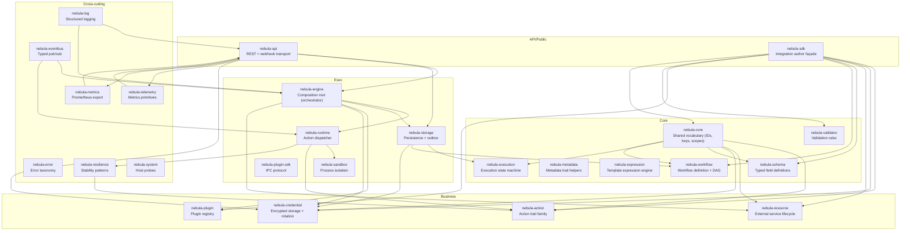
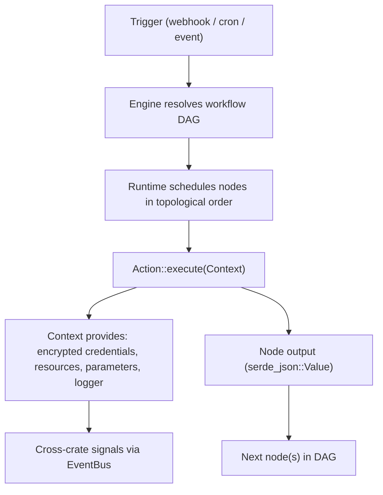
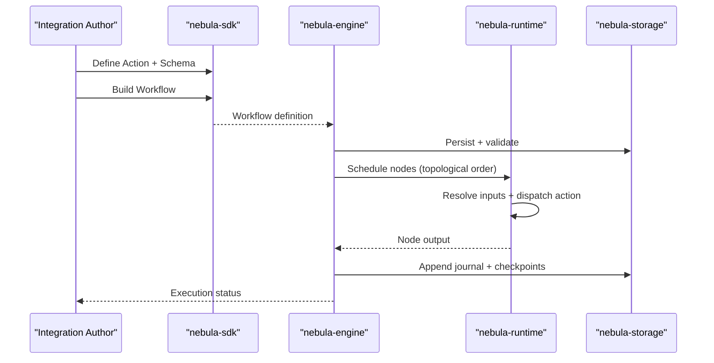
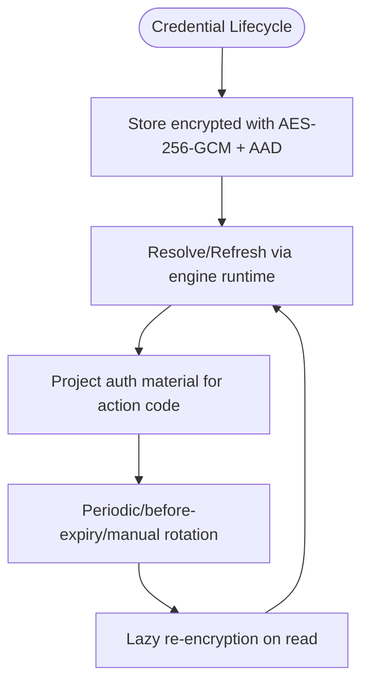
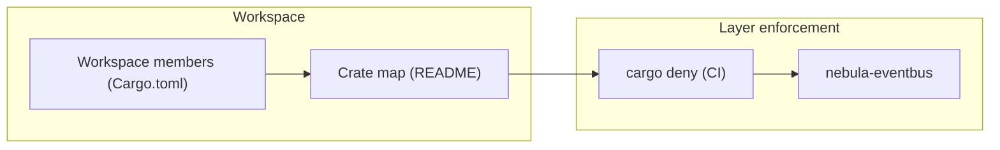

# Introduction and Purpose

<cite>
**Referenced Files in This Document**
- [README.md](file://README.md)
- [PRODUCT_CANON.md](file://docs/PRODUCT_CANON.md)
- [COMPETITIVE.md](file://docs/COMPETITIVE.md)
- [Cargo.toml](file://Cargo.toml)
- [core crate README](file://crates/core/README.md)
- [engine crate README](file://crates/engine/README.md)
- [sdk crate README](file://crates/sdk/README.md)
- [credential crate README](file://crates/credential/README.md)
- [resilience crate README](file://crates/resilience/README.md)
- [storage crate README](file://crates/storage/README.md)
- [runtime crate README](file://crates/runtime/README.md)
- [api crate README](file://crates/api/README.md)
- [INTEGRATION_MODEL.md](file://docs/INTEGRATION_MODEL.md)
- [MATURITY.md](file://docs/MATURITY.md)
</cite>

## Table of Contents
1. [Introduction](#introduction)
2. [Project Structure](#project-structure)
3. [Core Components](#core-components)
4. [Architecture Overview](#architecture-overview)
5. [Detailed Component Analysis](#detailed-component-analysis)
6. [Dependency Analysis](#dependency-analysis)
7. [Performance Considerations](#performance-considerations)
8. [Troubleshooting Guide](#troubleshooting-guide)
9. [Conclusion](#conclusion)

## Introduction
Nebula is a DAG-based workflow automation engine built from scratch in Rust. It is positioned as a composable library rather than a monolithic platform, designed for teams that want workflow automation they can embed, extend, and trust with production credentials. Nebula distinguishes itself from runtime-interpreted platforms by enforcing strong typing at boundaries, explicit runtime orchestration, durable execution state, and a first-class integration SDK. Its mission is to provide a reliable, observable, and security-first foundation for building robust automation systems, with a focus on operational honesty, resilience, and clarity of execution.

Nebula’s core philosophy centers on:
- DAG-based workflows with typed boundaries and durable execution
- First-class credentials and resources, with encryption at rest and rotation integrated into the runtime
- Composable libraries that can be embedded and extended, not hidden behind a proprietary platform
- Trustworthy production credentials and operational guarantees grounded in explicit contracts

This introduction explains what Nebula is, why it exists, and how it differs from other workflow automation tools. It provides both conceptual overviews for beginners and technical details for experienced developers evaluating the Rust ecosystem fit.

## Project Structure
Nebula is organized as a multi-crate Rust workspace with a layered architecture. The workspace is intentionally structured to enforce one-way dependencies and cross-cutting concerns, enabling modularity and composability. The top-level crates are grouped into layers that reflect their responsibilities: Core, Business, Exec, API/Public, and Cross-cutting.

**Diagram sources**
- [README.md:36-46](file://README.md#L36-L46)
- [Cargo.toml:1-39](file://Cargo.toml#L1-L39)

**Section sources**
- [README.md:36-46](file://README.md#L36-L46)
- [Cargo.toml:1-39](file://Cargo.toml#L1-L39)

## Core Components
Nebula’s core components are organized around a clear set of orthogonal concepts that form the integration model. These concepts are unified by a structural contract: each concept is described by Metadata and a Schema, and they share the same configuration pipeline across Actions, Credentials, Resources, and Plugins.

- Resource: Long-lived managed object (e.g., connection pools, SDK clients). Engine owns lifecycle (acquire, health, release).
- Credential: Who you are and how authentication is maintained. Engine owns rotation and the stored-state vs consumer-facing auth-material split.
- Action: What a step does. Dispatch via a trait family (Stateless, Stateful, Trigger, Resource, Control). Metadata declares ports, parameters, isolation, and checkpoint behavior.
- Plugin: Distribution and registration unit. Plugin is the unit of registration, not the unit of size. Supports both full and micro-plugins.
- Schema: Cross-cutting typed configuration system. Shared across Actions, Credentials, and Resources. Provides a proof-token pipeline: validate → ValidValues → resolve → ResolvedValues.

This model ensures that integration authors write only the integration logic, while the engine handles orchestration, resilience, and operational guarantees.

**Section sources**
- [INTEGRATION_MODEL.md:13-116](file://docs/INTEGRATION_MODEL.md#L13-L116)
- [sdk crate README:22-28](file://crates/sdk/README.md#L22-L28)

## Architecture Overview
Nebula’s architecture is DAG-centric, with explicit runtime orchestration and durable execution state. The engine resolves the workflow DAG, schedules nodes in topological order, and delegates action dispatch to the runtime. Cross-crate signals propagate via the event bus, and persistence is provided by a repository interface with optimistic concurrency control and a transactional outbox for control signals.

**Diagram sources**
- [README.md:48-59](file://README.md#L48-L59)
- [engine crate README:12-27](file://crates/engine/README.md#L12-L27)
- [runtime crate README:12-21](file://crates/runtime/README.md#L12-L21)

**Section sources**
- [README.md:48-59](file://README.md#L48-L59)
- [engine crate README:12-27](file://crates/engine/README.md#L12-L27)
- [runtime crate README:12-21](file://crates/runtime/README.md#L12-L21)

## Detailed Component Analysis

### Why Nebula Exists
Nebula exists to address two fundamental failures of common automation engines:
- Integrations are second-class: node/connector authoring is an afterthought, with inconsistent DX and unmaintained long tail.
- The happy path is assumed: real workflows run long, hit flaky APIs, get restarted mid-flight, and need retries and recovery as first principles.

Nebula’s thesis is to handle concurrent, durable execution reliably so integration developers can focus on integration logic, not orchestration infrastructure. Performance and resilience are the runtime’s job; the author describes what the node does and trusts the engine at scale.

**Section sources**
- [PRODUCT_CANON.md:63-71](file://docs/PRODUCT_CANON.md#L63-L71)

### Positioning Against Competitors
Nebula positions itself as a Rust-native workflow automation engine: DAG workflows, typed boundaries, durable execution state, explicit runtime orchestration, and first-class credentials/resources/actions. It is closest to self-hosted workflow engines with durable execution, not to SaaS iPaaS platforms.

Nebula’s competitive bets emphasize:
- Runtime honesty over feature breadth
- Typed authoring contracts over scriptable glue with opt-in validation
- Local-first (single process/minimal deps) over “managed infrastructure minimum”

**Section sources**
- [COMPETITIVE.md:11-31](file://docs/COMPETITIVE.md#L11-L31)
- [COMPETITIVE.md:33-70](file://docs/COMPETITIVE.md#L33-L70)

### Embeddability, Extensibility, and Trustworthiness
Nebula is designed as a composable library-first product. The SDK serves as the integration author façade, re-exporting the cross-cutting integration surface and providing a workflow builder, test runtime, and convenience macros. The engine acts as a composition root, assembling exec-layer crates and driving the golden-path workflow from activation to termination. The API crate provides a thin HTTP shell delegating all business logic to the engine layer.

- Embeddability: The SDK exposes a single dependency surface for integration authors; the engine and runtime are designed as composition roots for embedding.
- Extensibility: Plugins are the unit of registration, supporting both full and micro-plugins. Cross-plugin dependencies are explicit via Cargo.toml, with activation-time checks.
- Trustworthiness: The credential subsystem encrypts at rest with AES-256-GCM, enforces AAD binding, and integrates rotation into the runtime. The error taxonomy and structured API errors ensure explicit, typed failure modes.

**Diagram sources**
- [sdk crate README:22-28](file://crates/sdk/README.md#L22-L28)
- [engine crate README:12-27](file://crates/engine/README.md#L12-L27)
- [runtime crate README:12-21](file://crates/runtime/README.md#L12-L21)
- [storage crate README:12-29](file://crates/storage/README.md#L12-L29)

**Section sources**
- [sdk crate README:22-28](file://crates/sdk/README.md#L22-L28)
- [engine crate README:12-27](file://crates/engine/README.md#L12-L27)
- [runtime crate README:12-21](file://crates/runtime/README.md#L12-L21)
- [storage crate README:12-29](file://crates/storage/README.md#L12-L29)

### Security-First Approach and Production Credentials
Nebula treats credentials as a first-class concern, not a bolt-on. Every secret is encrypted at rest with AES-256-GCM, bound to its record via AAD to prevent swapping attacks, and wiped from memory on drop. Key rotation is built into the storage layer, not a future feature. The credential system underwent extensive adversarial review and SOC2 grading before shipping.

- Auth schemes: 12 universal auth patterns (OAuth2Token, SecretToken, IdentityPassword, KeyPair, Certificate, SigningKey, FederatedAssertion, ChallengeSecret, OtpSeed, ConnectionUri, InstanceBinding, SharedKey) plus an open AuthScheme trait for extensibility.
- Rotation subsystem: Periodic, before-expiry, scheduled, and manual with blue-green and grace period support.
- Operational honesty: No secrets in logs, error strings, or metrics labels; Zeroize/ZeroizeOnDrop on key material; redacted Debug on credential wrappers.

**Diagram sources**
- [credential crate README:32-50](file://crates/credential/README.md#L32-L50)
- [credential crate README:82-87](file://crates/credential/README.md#L82-L87)

**Section sources**
- [credential crate README:12-23](file://crates/credential/README.md#L12-L23)
- [credential crate README:32-50](file://crates/credential/README.md#L32-L50)
- [credential crate README:82-87](file://crates/credential/README.md#L82-L87)

### Modularity and Layering
Nebula enforces strict layering with one-way dependencies and cross-cutting crates importable at any level. The workspace uses cargo deny in CI to enforce wrapper policies, and cross-crate communication occurs via the event bus rather than direct imports. This modularity enables:
- Using nebula-credential without touching nebula-engine
- Embedding nebula-resilience in projects unrelated to workflows
- Clear ownership boundaries for operators and authors

**Section sources**
- [README.md:26-27](file://README.md#L26-L27)
- [core crate README:20-27](file://crates/core/README.md#L20-L27)

### Practical Examples Demonstrating Modularity and Security
- Modular nature: The SDK re-exports the integration surface (Action, Credential, Resource, Schema, Workflow, Plugin, Validator, Core) through a single dependency, enabling authors to import one crate and get the façade plus test harness.
- Security-first approach: The credential subsystem encrypts at rest with AES-256-GCM and AAD binding, rotates keys via a built-in subsystem, and redacts secrets in logs and metrics. The engine’s credential runtime surface manages resolver/registry/executor and rotation orchestration.

**Section sources**
- [sdk crate README:22-28](file://crates/sdk/README.md#L22-L28)
- [credential crate README:32-50](file://crates/credential/README.md#L32-L50)
- [credential crate README:82-87](file://crates/credential/README.md#L82-L87)

## Dependency Analysis
Nebula’s dependency model emphasizes composability and operational honesty. The workspace members are declared in the workspace manifest, and the crate map outlines responsibilities across layers. Cross-cutting crates (error, resilience, log, eventbus, telemetry, metrics, system) are importable at any level and enforce layer boundaries.

**Diagram sources**
- [Cargo.toml:1-39](file://Cargo.toml#L1-L39)
- [README.md:61-92](file://README.md#L61-L92)

**Section sources**
- [Cargo.toml:1-39](file://Cargo.toml#L1-L39)
- [README.md:61-92](file://README.md#L61-L92)

## Performance Considerations
Nebula prioritizes throughput and safety with an async-native engine (Tokio), bounded concurrency, and memory per execution in the hundreds-of-KB range for common paths. Benchmarks exist in CI (e.g., CodSpeed) to detect regressions in benchmarked paths. Resilience patterns (retry, circuit breaker, rate limiter, hedge, bulkhead) are composable building blocks purpose-built for the engine’s concurrency model.

**Section sources**
- [PRODUCT_CANON.md:98-101](file://docs/PRODUCT_CANON.md#L98-L101)
- [resilience crate README:12-29](file://crates/resilience/README.md#L12-L29)

## Troubleshooting Guide
Operational honesty is a cornerstone: operators must be able to explain what happened in a run. Nebula provides:
- Durable execution state and append-only journal for replayable history
- Structured errors and metrics for diagnosing failures
- Explicit guarantees about durability, validation, retry, resume, and plugin trust
- Knife scenario (execution and integration bar) to ensure the golden path remains green

Common troubleshooting steps:
- Use the execution journal and metrics to trace failures without reading source code
- Validate workflows end-to-end with structured RFC 9457 errors during activation
- Confirm cancel signals are durable and engine-consumable via the control queue
- Audit secret exposure and rotation behavior using the credential subsystem’s redaction and rotation features

**Section sources**
- [PRODUCT_CANON.md:134-141](file://docs/PRODUCT_CANON.md#L134-L141)
- [PRODUCT_CANON.md:391-427](file://docs/PRODUCT_CANON.md#L391-L427)
- [api crate README:53-82](file://crates/api/README.md#L53-L82)
- [storage crate README:69-100](file://crates/storage/README.md#L69-L100)
- [credential crate README:51-57](file://crates/credential/README.md#L51-L57)

## Conclusion
Nebula is a DAG-based workflow automation engine built from the ground up in Rust to serve teams that need a composable, embeddable, and trustworthy automation foundation. By enforcing typed boundaries, explicit runtime orchestration, durable execution state, and a first-class integration SDK, Nebula shifts the burden of reliability and resilience from integration authors to the engine. Its security-first approach, with encryption at rest, rotation, and operational honesty, provides production credentials that operators can trust. The layered architecture and strict dependency rules ensure modularity and extensibility, while the integration model offers a clear, orthogonal set of concepts that operators and authors can rely on.