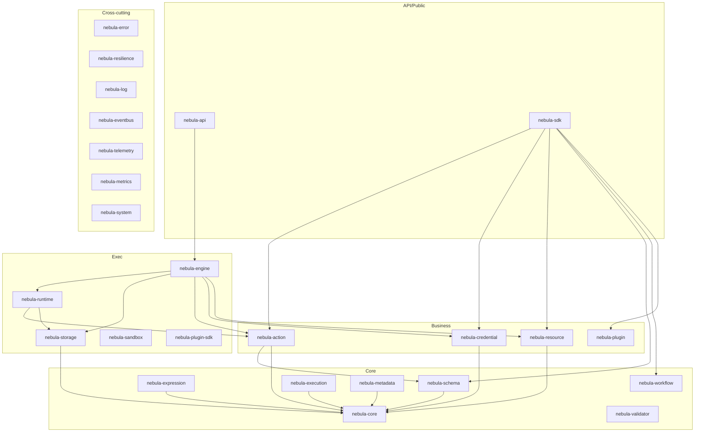
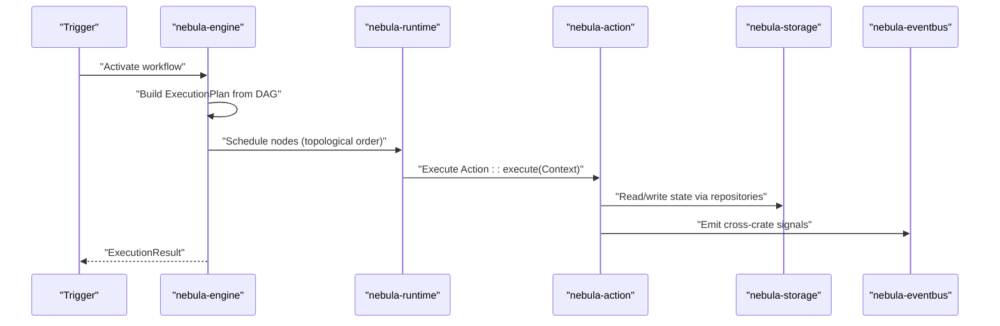
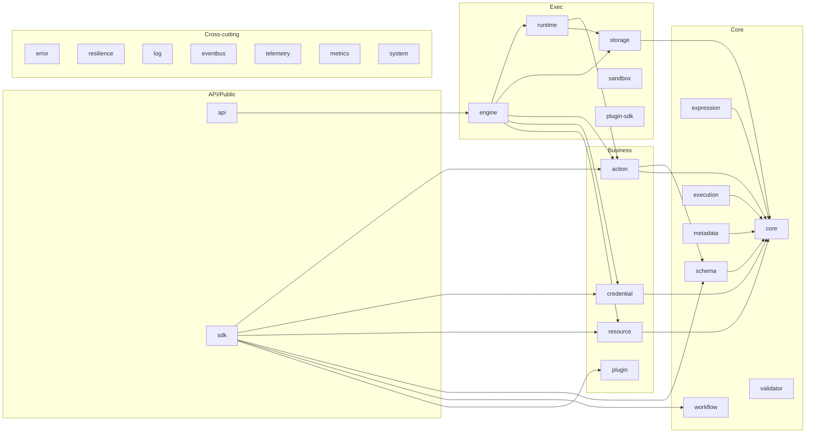
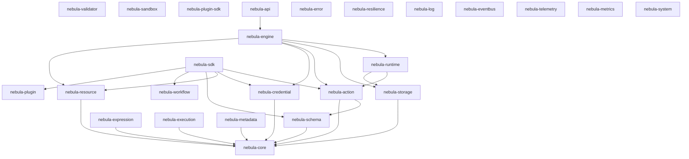

# Project Overview

<cite>
**Referenced Files in This Document**
- [README.md](file://README.md)
- [Cargo.toml](file://Cargo.toml)
- [docs/PRODUCT_CANON.md](file://docs/PRODUCT_CANON.md)
- [docs/MATURITY.md](file://docs/MATURITY.md)
- [docs/COMPETITIVE.md](file://docs/COMPETITIVE.md)
- [crates/core/README.md](file://crates/core/README.md)
- [crates/credential/README.md](file://crates/credential/README.md)
- [crates/action/README.md](file://crates/action/README.md)
- [crates/engine/README.md](file://crates/engine/README.md)
- [crates/sdk/README.md](file://crates/sdk/README.md)
- [crates/sdk/src/lib.rs](file://crates/sdk/src/lib.rs)
- [crates/action/src/lib.rs](file://crates/action/src/lib.rs)
- [crates/execution/src/lib.rs](file://crates/execution/src/lib.rs)
- [crates/storage/Cargo.toml](file://crates/storage/Cargo.toml)
- [crates/api/Cargo.toml](file://crates/api/Cargo.toml)
</cite>

## Table of Contents
1. [Introduction](#introduction)
2. [Project Structure](#project-structure)
3. [Core Components](#core-components)
4. [Architecture Overview](#architecture-overview)
5. [Detailed Component Analysis](#detailed-component-analysis)
6. [Dependency Analysis](#dependency-analysis)
7. [Performance Considerations](#performance-considerations)
8. [Troubleshooting Guide](#troubleshooting-guide)
9. [Conclusion](#conclusion)

## Introduction
Nebula is a modular, type-safe workflow automation engine built in Rust. It is a DAG-based composable library designed for teams who need embedded, extensible automation they can trust with production credentials. Unlike runtime-interpreted platforms, Nebula expresses workflow structure, action I/O, parameter schemas, and auth patterns as Rust types, enabling compile-time validation of workflow shape and strong guarantees around execution, resiliency, and security.

Nebula positions itself as a Rust-native alternative to n8n, Zapier, and Temporal, emphasizing:
- Runtime honesty and operational clarity
- Typed integration contracts over scriptable glue
- Local-first simplicity without managed infrastructure minimums
- Composable resilience and explicit orchestration

Current status: Alpha. Core crates are stable; the execution engine, runtime, and API layer are under active development. The desktop app is in early development.

**Section sources**
- [README.md:8-12](file://README.md#L8-L12)
- [docs/COMPETITIVE.md:13-29](file://docs/COMPETITIVE.md#L13-L29)
- [docs/PRODUCT_CANON.md:43-59](file://docs/PRODUCT_CANON.md#L43-L59)
- [README.md:160-164](file://README.md#L160-L164)

## Project Structure
Nebula organizes functionality into a seven-layer architecture with strict one-way dependencies enforced by tooling and documented inclusions. The layers are:
- API/Public: HTTP REST and webhook transport, plus the integration author façade
- Exec: Engine, runtime, storage, sandbox, plugin SDK
- Business: Credential, resource, action, plugin
- Core: Core types, schema, validator, expression, workflow, execution
- Cross-cutting: Error, resilience, log, eventbus, telemetry, metrics, system

The workspace members and crate map are defined in the repository root manifest and expanded in the product documentation.

**Diagram sources**
- [README.md:36-92](file://README.md#L36-L92)
- [Cargo.toml:1-39](file://Cargo.toml#L1-L39)

**Section sources**
- [README.md:36-92](file://README.md#L36-L92)
- [Cargo.toml:1-39](file://Cargo.toml#L1-L39)

## Core Components
Nebula’s core design principles are grounded in the product canon and reinforced by the layered architecture:
- Types over tests: compile-time validation of workflow shape and integration contracts
- Explicit over magic: no global state, no hidden services, actions receive all dependencies via context
- Delete over deprecate (internals): remove wrong APIs; public deprecation paths are preserved for integration authors
- Security by default: secrets encrypted at rest, redacted in logs, mandatory AAD binding, and no legacy compatibility flags
- Composition over inheritance: storage layers, auth schemes, and resilience patterns compose via traits and pipelines

Practical examples demonstrating modularity and security-first design:
- Modular nature: The SDK re-exports the integration surface (Action, Credential, Resource, Schema, Workflow, Plugin) and provides builders and a test runtime, enabling a single dependency for integration authors
- Security-first: The credential subsystem encrypts secrets at rest with AES-256-GCM and AAD, enforces redaction in debug output, and separates stored state from projected auth material

**Section sources**
- [docs/PRODUCT_CANON.md:94-133](file://docs/PRODUCT_CANON.md#L94-L133)
- [crates/sdk/README.md:12-28](file://crates/sdk/README.md#L12-L28)
- [crates/sdk/src/lib.rs:46-71](file://crates/sdk/src/lib.rs#L46-L71)
- [crates/credential/README.md:51-57](file://crates/credential/README.md#L51-L57)

## Architecture Overview
Nebula’s architecture is DAG-based and execution-driven. The data flow begins with a trigger (webhook, cron, or event), resolves the workflow DAG, schedules nodes in topological order, and executes actions with explicit context injection. Cross-crate signals propagate via the event bus, and the engine coordinates control-plane commands through a durable outbox.

**Diagram sources**
- [README.md:48-59](file://README.md#L48-L59)
- [crates/engine/README.md:12-34](file://crates/engine/README.md#L12-L34)
- [crates/execution/src/lib.rs:18-36](file://crates/execution/src/lib.rs#L18-L36)

**Section sources**
- [README.md:48-59](file://README.md#L48-L59)
- [crates/engine/README.md:12-34](file://crates/engine/README.md#L12-L34)
- [crates/execution/src/lib.rs:18-36](file://crates/execution/src/lib.rs#L18-L36)

## Detailed Component Analysis

### Layered Architecture and Crate Map
The seven-layer architecture is reflected in the crate map. Each layer depends only on layers below it, with cross-cutting crates importable at any level. The workspace manifest enumerates all crates and enforces workspace-wide policies.

**Diagram sources**
- [README.md:61-92](file://README.md#L61-L92)
- [Cargo.toml:1-39](file://Cargo.toml#L1-L39)

**Section sources**
- [README.md:61-92](file://README.md#L61-L92)
- [Cargo.toml:1-39](file://Cargo.toml#L1-L39)

### Engine: Composition Root and Control Plane
The engine is the composition root that assembles exec-layer crates and drives execution from activated workflow to terminal state. It owns the durable control-plane consumer and integrates with the execution repository for state transitions.

Key responsibilities:
- Build ExecutionPlan from workflow DAG
- Resolve node inputs and thread outputs across execution levels
- Transition execution state through ExecutionRepo (CAS on version)
- Delegate action dispatch to runtime
- Own control-queue consumer and command dispatch (Start/Resume/Restart/Cancel/Terminate)

Security and operational guarantees:
- Deny-by-default credential allowlist
- No resource allowlist (scoped by topology)
- Cross-layer bridges for credential/resource accessors

**Section sources**
- [crates/engine/README.md:12-67](file://crates/engine/README.md#L12-L67)
- [crates/engine/README.md:130-145](file://crates/engine/README.md#L130-L145)
- [docs/PRODUCT_CANON.md:350-360](file://docs/PRODUCT_CANON.md#L350-L360)

### Action System: Typed Contracts and DX Specializations
The action crate defines the trait family and execution policy metadata. It provides typed contracts for stateless, stateful, trigger, and resource actions, plus DX specializations for pagination, batching, webhooks, polling, and control nodes.

Highlights:
- Trait family: Action, StatelessAction, StatefulAction, TriggerAction, ResourceAction
- DX specializations: PaginatedAction, BatchAction, WebhookAction, PollAction, ControlAction
- Metadata: ActionMetadata, IsolationLevel, ActionCategory
- Result and output: ActionResult, ActionOutput
- Context and capabilities: ActionContext, TriggerContext, ResourceAccessor, ActionLogger, ExecutionEmitter

Operational contracts:
- Engine-level retry from ActionResult::Retry is planned and gated behind an unstable feature flag
- Idempotency keys must be used for non-idempotent side effects
- Trigger delivery semantics are at-least-once with deduplication

**Section sources**
- [crates/action/README.md:12-66](file://crates/action/README.md#L12-L66)
- [crates/action/README.md:80-89](file://crates/action/README.md#L80-L89)
- [crates/action/src/lib.rs:11-32](file://crates/action/src/lib.rs#L11-L32)

### Credential System: First-Class Security and Rotation
The credential subsystem models the integration credentials contract with a stored-state vs projected auth-material split. Runtime orchestration (resolver/executor/refresh) resides in the engine. Built-in schemes cover real-world auth patterns, and rotation is feature-gated with blue-green and grace-period support.

Highlights:
- 12 universal auth schemes
- Open AuthScheme trait with derive macro
- Layered storage: encryption -> cache -> audit -> scope
- Interactive flows: OAuth2 with PKCE, multi-step auth, challenge-response
- Rotation subsystem (feature-gated)

Security invariants:
- AES-256-GCM with Argon2id KDF, AAD binding, zeroize on drop
- Redacted Debug output, no legacy_compat flag
- Refresh/rotation must not strand in-flight executions

**Section sources**
- [crates/credential/README.md:12-31](file://crates/credential/README.md#L12-L31)
- [crates/credential/README.md:51-57](file://crates/credential/README.md#L51-L57)
- [crates/credential/README.md:80-87](file://crates/credential/README.md#L80-L87)

### SDK: Integration Author Façade
The SDK provides a single-crate façade for integration authors, re-exporting the cross-cutting integration surface and offering a prelude, workflow builder, action builder, and test runtime. It avoids duplicating OAuth façades and tracks credential/OAuth type movements in the credential crate.

Highlights:
- Re-exports: nebula_action, nebula_credential, nebula_resource, nebula_schema, nebula_workflow, nebula_plugin, nebula_validator
- Modules: prelude, action, workflow, runtime, testing (feature)
- Macros: params!, json!, workflow!, simple_action!

**Section sources**
- [crates/sdk/README.md:12-28](file://crates/sdk/README.md#L12-L28)
- [crates/sdk/src/lib.rs:46-71](file://crates/sdk/src/lib.rs#L46-L71)

### Execution and Persistence Guarantees
The execution crate models the execution state machine, journal, idempotency, and planning types. It emphasizes durable execution state and operational honesty, with explicit persistence semantics and control-plane guarantees.

Highlights:
- Execution state machine with CAS transitions
- Journal for append-only audit history
- Idempotency keys for at-least-once delivery and deduplication
- Planning types derived from the workflow DAG

**Section sources**
- [crates/execution/src/lib.rs:18-36](file://crates/execution/src/lib.rs#L18-L36)
- [docs/PRODUCT_CANON.md:263-325](file://docs/PRODUCT_CANON.md#L263-L325)

### Storage Backends and Optional Integrations
The storage crate defines a flexible backend surface with optional features for Postgres, Redis, S3, and message pack serialization. It composes layers (encryption, cache, audit) and maintains test utilities and rotation features.

**Section sources**
- [crates/storage/Cargo.toml:61-76](file://crates/storage/Cargo.toml#L61-L76)

### API Layer Dependencies and OAuth Integration
The API crate depends on core execution and storage crates, integrating resilience and telemetry. OAuth ceremony surface is gated behind a feature flag and optionally depends on HTTP clients and cryptographic primitives.

**Section sources**
- [crates/api/Cargo.toml:14-27](file://crates/api/Cargo.toml#L14-L27)
- [crates/api/Cargo.toml:90-104](file://crates/api/Cargo.toml#L90-L104)

## Dependency Analysis
Nebula enforces layer-wise dependencies and cross-cutting imports. The workspace manifest and crate maps define the dependency graph, while per-crate READMEs and the product canon codify contracts and seams.

**Diagram sources**
- [README.md:61-92](file://README.md#L61-L92)
- [Cargo.toml:1-39](file://Cargo.toml#L1-L39)

**Section sources**
- [README.md:61-92](file://README.md#L61-L92)
- [Cargo.toml:1-39](file://Cargo.toml#L1-L39)

## Performance Considerations
- Throughput: Async-native engine with bounded concurrency and topological scheduling
- Memory footprint: Hundreds-of-KB per execution for common paths
- Resilience: Composable pipelines (retry, circuit breakers, rate limiting, hedging, bulkheads) integrated into actions
- Persistence: Checkpoint-based recovery with explicit durability semantics; operators must distinguish durable vs best-effort artifacts

[No sources needed since this section provides general guidance]

## Troubleshooting Guide
Common issues and guidance:
- False capabilities: Public types/variants that the engine does not honor end-to-end must be hidden or removed
- Discard-and-log workers: A control-plane consumer that only logs and discards commands does not satisfy the durable control-plane invariant
- Validation-as-a-side-tool: Shape validation must occur at activation, not only at a separate endpoint
- README drift: Advertising capabilities not present in code is a documentation bug

Operational checks:
- Execution authority: State transitions must go through ExecutionRepo with CAS on version
- Idempotency: For non-idempotent side effects, apply idempotency keys before external side effects
- Trigger delivery: At-least-once delivery with stable event identity and deduplication

**Section sources**
- [docs/PRODUCT_CANON.md:429-444](file://docs/PRODUCT_CANON.md#L429-L444)
- [docs/PRODUCT_CANON.md:350-360](file://docs/PRODUCT_CANON.md#L350-L360)
- [docs/PRODUCT_CANON.md:287-294](file://docs/PRODUCT_CANON.md#L287-L294)

## Conclusion
Nebula offers a Rust-native, type-safe workflow automation engine with a layered architecture that prioritizes runtime honesty, operational clarity, and security by default. Its DAG-based design, composable library approach, and explicit orchestration enable teams to embed reliable automation they can trust with production credentials. While in active alpha, the foundation is solid, and the direction is clear, with per-crate maturity dashboards and product canons guiding evolution.

**Section sources**
- [README.md:160-164](file://README.md#L160-L164)
- [docs/MATURITY.md:19-46](file://docs/MATURITY.md#L19-L46)
- [docs/COMPETITIVE.md:13-29](file://docs/COMPETITIVE.md#L13-L29)