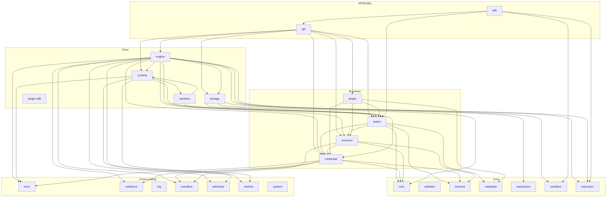
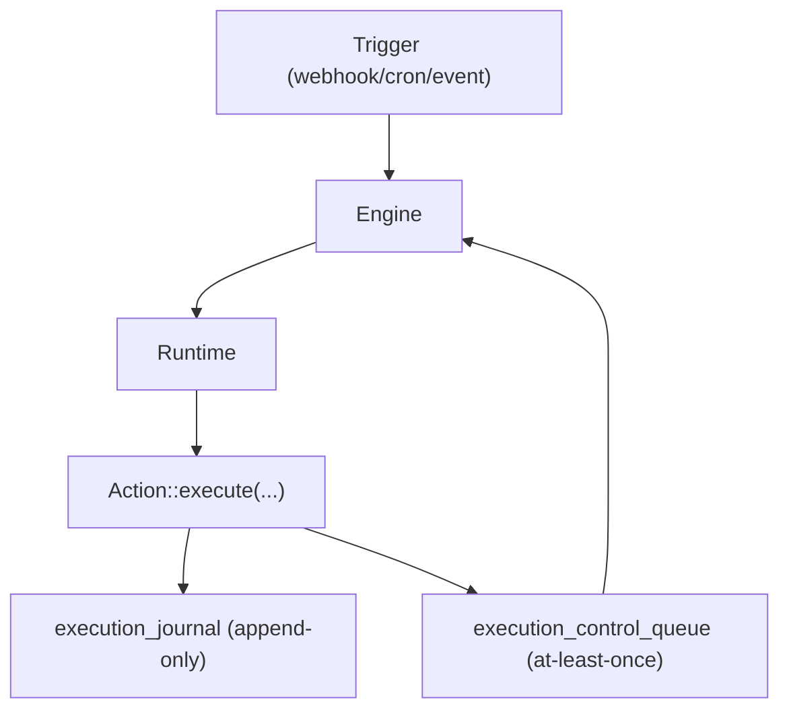
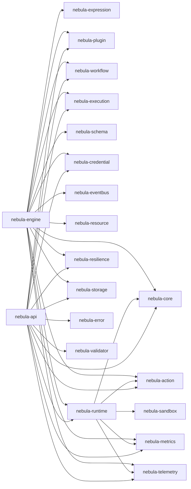
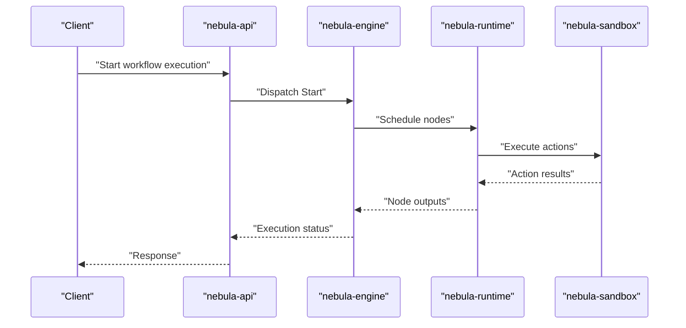

# Status and Maturity

<cite>
**Referenced Files in This Document**
- [README.md](file://README.md)
- [docs/MATURITY.md](file://docs/MATURITY.md)
- [docs/ENGINE_GUARANTEES.md](file://docs/ENGINE_GUARANTEES.md)
- [docs/UPGRADE_COMPAT.md](file://docs/UPGRADE_COMPAT.md)
- [CONTRIBUTING.md](file://CONTRIBUTING.md)
- [crates/engine/Cargo.toml](file://crates/engine/Cargo.toml)
- [crates/runtime/Cargo.toml](file://crates/runtime/Cargo.toml)
- [crates/api/Cargo.toml](file://crates/api/Cargo.toml)
- [crates/action/Cargo.toml](file://crates/action/Cargo.toml)
- [crates/credential/Cargo.toml](file://crates/credential/Cargo.toml)
- [crates/action/tests/contracts.rs](file://crates/action/tests/contracts.rs)
- [crates/engine/tests/integration.rs](file://crates/engine/tests/integration.rs)
- [crates/runtimes/benches/queue_bench.rs](file://crates/runtime/benches/queue_bench.rs)
- [crates/expression/benches/baseline.rs](file://crates/expression/benches/baseline.rs)
</cite>

## Table of Contents
1. [Introduction](#introduction)
2. [Project Structure](#project-structure)
3. [Core Components](#core-components)
4. [Architecture Overview](#architecture-overview)
5. [Detailed Component Analysis](#detailed-component-analysis)
6. [Dependency Analysis](#dependency-analysis)
7. [Performance Considerations](#performance-considerations)
8. [Troubleshooting Guide](#troubleshooting-guide)
9. [Conclusion](#conclusion)
10. [Appendices](#appendices)

## Introduction
Nebula is currently in active alpha development. The project emphasizes modular, type-safe workflow automation with a strong focus on security, composability, and resilience. The core layer, credential system, resilience patterns, parameter system, and error infrastructure are considered stable and well-tested. The execution engine, runtime, API layer, and desktop app are under active development and integration. This document provides a comprehensive status and maturity report aligned with the repository’s stability indicators, including the per-crate maturity matrix, active development areas, production readiness posture, API stability guarantees, migration considerations, and guidance for different user types.

**Section sources**
- [README.md:160-164](file://README.md#L160-L164)

## Project Structure
Nebula is organized as a multi-crate Rust workspace with layered responsibilities:
- Core: foundational types, schemas, validators, expressions, workflows, and execution state machines
- Business: credentials, resources, actions, and plugins
- Exec: engine, runtime, storage, sandbox, and plugin SDK
- API/Public: REST API server and SDK façade
- Cross-cutting: logging, telemetry, metrics, resilience, and error handling

The crate map and layering are defined in the repository’s README, with per-crate stability tracked in docs/MATURITY.md.

**Diagram sources**
- [README.md:61-92](file://README.md#L61-L92)

**Section sources**
- [README.md:61-92](file://README.md#L61-L92)

## Core Components
This section summarizes the current maturity state across all 39 crates using the per-crate dashboard in docs/MATURITY.md. Crates are classified as:
- Stable: end-to-end works, tested, safe to depend on
- Frontier: actively moving; breakage expected; do not add consumers without coordinating
- Partial: works for declared happy path; known gaps documented in the crate README
- Planned: not yet implemented

Legend and criteria are defined in docs/MATURITY.md.

**Section sources**
- [docs/MATURITY.md:13-17](file://docs/MATURITY.md#L13-L17)
- [docs/MATURITY.md:19-46](file://docs/MATURITY.md#L19-L46)

## Architecture Overview
The execution lifecycle is governed by the execution layer and durable artifacts. The engine maintains control over execution state transitions, journal entries, and control queue dispatch. The runtime schedules nodes and manages backpressure. The API layer exposes REST and webhook endpoints and integrates with the engine and runtime.

**Diagram sources**
- [docs/ENGINE_GUARANTEES.md:7-11](file://docs/ENGINE_GUARANTEES.md#L7-L11)

**Section sources**
- [docs/ENGINE_GUARANTEES.md:7-22](file://docs/ENGINE_GUARANTEES.md#L7-L22)

## Detailed Component Analysis

### Alpha Stage Status and Stability Indicators
- Core layer: stable and well-tested; includes IDs, validators, schemas, expressions, workflows, and execution state machines
- Credential system: mature with 12 universal auth patterns, layered storage, interactive flows, and rotation subsystem
- Resilience patterns: purpose-built, audited, and designed for the engine’s concurrency model
- Execution engine and runtime: actively integrated; engine control plane and runtime wiring are in progress
- API layer: partial integration; OAuth and control dispatch are progressing
- Desktop app: early development (Tauri)

Production readiness: not yet production-ready. APIs will change. Foundation is solid, direction is clear.

**Section sources**
- [README.md:12](file://README.md#L12)
- [README.md:160-164](file://README.md#L160-L164)

### Maturity Matrix (39 Crates)
The per-crate maturity matrix defines stability classifications across API stability, test coverage, documentation completeness, engine integration, and SLI readiness. The matrix is maintained in docs/MATURITY.md and reviewed on PRs that touch public surfaces, tests, or docs.

Key highlights:
- Stable crates: error, eventbus, execution, expression, log, metrics, plugin, resilience, telemetry, workflow
- Frontier crates: action, core, credential, metadata, plugin-sdk, resource, schema, sdk, validator
- Partial crates: engine, runtime, storage, system, sandbox, api
- Planned: testing

Review cadence and last updates are documented in docs/MATURITY.md.

**Section sources**
- [docs/MATURITY.md:19-46](file://docs/MATURITY.md#L19-L46)
- [docs/MATURITY.md:50-58](file://docs/MATURITY.md#L50-L58)

### Active Development Areas
- Execution engine: control consumer skeleton, control command dispatch (Start/Resume/Restart, Cancel/Terminate), reclaim sweep, and engine-owned credential runtime surface
- Runtime: node scheduling, dispatch, blob spill, queue throughput benchmarking
- API layer: REST server, webhook transport, middleware, OAuth rollout gating, knife scenario integration
- Desktop app: Tauri + React reference shell (not a release artifact)

Evidence:
- Engine features and dependencies demonstrate control plane and credential runtime integration
- Runtime benches show queue throughput scaling
- API Cargo features include OAuth gating and test utilities
- Action crate exposes unstable retry scheduler feature for future integration

**Section sources**
- [crates/engine/Cargo.toml:11-23](file://crates/engine/Cargo.toml#L11-L23)
- [crates/engine/Cargo.toml:24-41](file://crates/engine/Cargo.toml#L24-L41)
- [crates/runtime/Cargo.toml:14-31](file://crates/runtime/Cargo.toml#L14-L31)
- [crates/api/Cargo.toml:98-113](file://crates/api/Cargo.toml#L98-L113)
- [crates/action/Cargo.toml:14-21](file://crates/action/Cargo.toml#L14-L21)

### Production Readiness Status
- Not production-ready: APIs will change; operators should pin commit SHAs when running off main
- Storage migrations are the primary compatibility surface; both SQLite and Postgres migrations must run cleanly forward
- Engine guarantees define durability and failure semantics; operators must validate control queue path and observability

**Section sources**
- [README.md:160-164](file://README.md#L160-L164)
- [docs/UPGRADE_COMPAT.md:5-14](file://docs/UPGRADE_COMPAT.md#L5-L14)
- [docs/ENGINE_GUARANTEES.md:11-22](file://docs/ENGINE_GUARANTEES.md#L11-L22)

### API Stability Guarantees and Migration Considerations
- Current state: pre-1.0 alpha; every commit on main may break workflow JSON, execution semantics, plugin SDK types, and storage schema
- Compatibility surfaces: workflow definitions, engine/runtime behavior, plugin SDK + binaries
- Baseline policy post-1.0: patch/minor/major rules with mandatory release notes, migrations, and integration bar validation
- Plugin binary compatibility: native Rust plugin binaries are not implicitly ABI-stable; rebuild against target SDK when engine bumps

**Section sources**
- [docs/UPGRADE_COMPAT.md:5-46](file://docs/UPGRADE_COMPAT.md#L5-L46)
- [docs/UPGRADE_COMPAT.md:47-53](file://docs/UPGRADE_COMPAT.md#L47-L53)
- [docs/UPGRADE_COMPAT.md:69-80](file://docs/UPGRADE_COMPAT.md#L69-L80)

### Guidance by User Type

- Integration authors (evaluating for production use)
  - Prefer stable crates for core functionality (execution, expression, workflow, resilience, metrics, telemetry)
  - Avoid depending on frontier crates unless you coordinate changes; expect breakage
  - Monitor docs/MATURITY.md for changes; track PRs touching public surfaces
  - Validate against the knife scenario and integration bar before adopting new releases

- Operators (considering deployment)
  - Pin commit SHA when running off main; rebuild plugins after every bump
  - Ensure storage migrations run cleanly for both SQLite and Postgres
  - Verify control queue path and observability before letting real workflows through
  - Follow the upgrade checklist: backup, validate workflow definitions, verify control queue, rebuild/retest plugins, run knife scenario, confirm observability

- Contributors (helping develop)
  - Follow the development workflow: branch naming, style, tests, commits
  - Use cargo-nextest for test runs; adhere to zero-warnings policy
  - Reviewers enforce truthfulness of docs/MATURITY.md; include “MATURITY.md row updated” in PRs that change crate state

**Section sources**
- [docs/MATURITY.md:50-58](file://docs/MATURITY.md#L50-L58)
- [docs/UPGRADE_COMPAT.md:69-80](file://docs/UPGRADE_COMPAT.md#L69-L80)
- [CONTRIBUTING.md:69-141](file://CONTRIBUTING.md#L69-L141)

### Roadmap Implications and Timeline
- The project is in active alpha with clear direction and ongoing integration of engine, runtime, and API layers
- The maturity dashboard is a living document updated on PRs that touch public surfaces, tests, or docs
- Specific ADRs and slices (e.g., credential cleanup, plugin load-path stabilization) indicate active work toward stabilization

**Section sources**
- [docs/MATURITY.md:50-130](file://docs/MATURITY.md#L50-L130)

## Dependency Analysis
The execution engine depends on core, action, expression, plugin, workflow, execution, schema, credential, eventbus, resource, runtime, resilience, storage, metrics, telemetry, and async primitives. The runtime depends on core, action, sandbox, metrics, telemetry, and async primitives. The API depends on error, storage, core, execution, validator, metrics, telemetry, workflow, action, runtime, plugin, resilience, and credential (optional).

**Diagram sources**
- [crates/engine/Cargo.toml:24-41](file://crates/engine/Cargo.toml#L24-L41)
- [crates/runtime/Cargo.toml:14-29](file://crates/runtime/Cargo.toml#L14-L29)
- [crates/api/Cargo.toml:14-27](file://crates/api/Cargo.toml#L14-L27)

**Section sources**
- [crates/engine/Cargo.toml:24-41](file://crates/engine/Cargo.toml#L24-L41)
- [crates/runtime/Cargo.toml:14-29](file://crates/runtime/Cargo.toml#L14-L29)
- [crates/api/Cargo.toml:14-27](file://crates/api/Cargo.toml#L14-L27)

## Performance Considerations
- Runtime queue throughput: concurrent dequeue benchmark demonstrates scaling characteristics for MemoryQueue under varying worker counts
- Expression engine: benchmarks cover template parsing, rendering, evaluation with and without cache, context operations, and concurrent access
- These benchmarks provide concrete indicators of performance behavior for high-throughput scenarios

**Section sources**
- [crates/runtime/benches/queue_bench.rs:1-68](file://crates/runtime/benches/queue_bench.rs#L1-L68)
- [crates/expression/benches/baseline.rs:1-295](file://crates/expression/benches/baseline.rs#L1-L295)

## Troubleshooting Guide
- Engine integration tests validate end-to-end behavior: linear pipelines, fan-out, diamond merges, error propagation, cancellation, metrics coverage, concurrency control, and disabled-node skip behavior
- Action contract tests freeze JSON serialization of boundary types used by engine/runtime/API; changes require intentional updates and documentation in MIGRATION.md
- Operators should validate the control queue path and observability; follow the upgrade checklist to ensure continuity

**Diagram sources**
- [crates/engine/tests/integration.rs:1-777](file://crates/engine/tests/integration.rs#L1-L777)

**Section sources**
- [crates/engine/tests/integration.rs:1-777](file://crates/engine/tests/integration.rs#L1-L777)
- [crates/action/tests/contracts.rs:1-346](file://crates/action/tests/contracts.rs#L1-L346)
- [docs/UPGRADE_COMPAT.md:69-80](file://docs/UPGRADE_COMPAT.md#L69-L80)

## Conclusion
Nebula is in active alpha with a solid foundation in core, credentials, resilience, and cross-cutting concerns. The execution engine, runtime, API layer, and desktop app are actively integrated and evolving. Users should expect API changes until a tagged release ships. The per-crate maturity dashboard, upgrade compatibility guidance, and integration tests provide concrete indicators of stability and readiness. Operators should pin commit SHAs, validate control queues, and follow the upgrade checklist. Integration authors should prefer stable crates and monitor docs/MATURITY.md. Contributors should follow the development workflow and maintain truthfulness in the maturity dashboard.

[No sources needed since this section summarizes without analyzing specific files]

## Appendices

### Stability Classification Legend
- Stable: end-to-end works, tested, safe to depend on
- Frontier: actively moving; breakage expected; do not add consumers without coordinating
- Partial: works for declared happy path; known gaps documented in the crate README
- Planned: not yet implemented

**Section sources**
- [docs/MATURITY.md:13-17](file://docs/MATURITY.md#L13-L17)