# Troubleshooting and FAQ

<cite>
**Referenced Files in This Document**
- [README.md](file://crates/log/README.md)
- [README.md](file://crates/error/README.md)
- [README.md](file://crates/resilience/README.md)
- [OBSERVABILITY.md](file://docs/OBSERVABILITY.md)
- [error.rs](file://crates/engine/src/error.rs)
- [error.rs](file://crates/action/src/error.rs)
- [error.rs](file://crates/execution/src/error.rs)
- [errors.rs](file://crates/api/src/errors.rs)
- [executor.rs](file://crates/engine/src/credential/executor.rs)
- [credential_accessor.rs](file://crates/engine/src/credential_accessor.rs)
- [validation.rs](file://crates/credential/src/rotation/validation.rs)
- [discovery.rs](file://crates/sandbox/src/discovery.rs)
- [custom_observability.rs](file://crates/log/examples/custom_observability.rs)
- [log_hot_path.rs](file://crates/log/benches/log_hot_path.rs)
- [telemetry-design.md](file://docs/superpowers/specs/2026-04-06-telemetry-design.md)
- [2026-04-16-dev-environment-hardening.md](file://docs/plans/archive/2026-04-16-dev-environment-hardening.md)
- [detail_types.rs](file://crates/error/src/detail_types.rs)
- [collection.rs](file://crates/error/src/collection.rs)
- [adapter.rs](file://crates/metrics/adapter.rs)
</cite>

## Table of Contents
1. [Introduction](#introduction)
2. [Project Structure](#project-structure)
3. [Core Components](#core-components)
4. [Architecture Overview](#architecture-overview)
5. [Detailed Component Analysis](#detailed-component-analysis)
6. [Dependency Analysis](#dependency-analysis)
7. [Performance Considerations](#performance-considerations)
8. [Troubleshooting Guide](#troubleshooting-guide)
9. [Conclusion](#conclusion)
10. [Appendices](#appendices)

## Introduction
This document provides a comprehensive Troubleshooting and FAQ guide for Nebula. It focuses on diagnosing and resolving common issues across installation, runtime, performance, and integration domains. It explains systematic approaches to log analysis, performance profiling, error investigation, and system monitoring. It also documents concrete examples from the codebase that show how to debug workflow execution failures, credential resolution issues, and plugin communication problems. Finally, it answers frequently asked questions about architecture decisions, design trade-offs, and best practices, balancing accessibility for newcomers with technical depth for advanced troubleshooting.

## Project Structure
Nebula’s observability and error handling are anchored by three pillars:
- Logging and structured tracing: unified subscriber setup, redaction, and multi-format output.
- Error taxonomy and classification: a shared classification boundary across the workspace.
- Resilience patterns: canonical in-process fault tolerance for outbound calls.

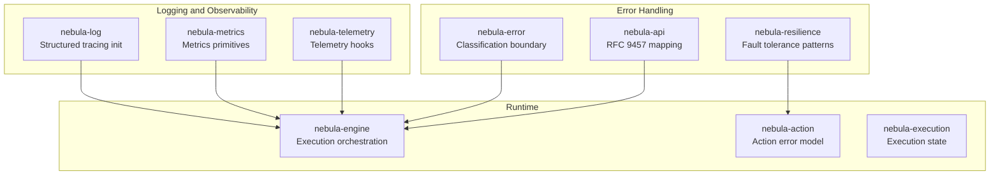

**Diagram sources**
- [README.md:1-90](file://crates/log/README.md#L1-L90)
- [README.md:1-68](file://crates/error/README.md#L1-L68)
- [README.md:1-85](file://crates/resilience/README.md#L1-L85)

**Section sources**
- [README.md:1-90](file://crates/log/README.md#L1-L90)
- [README.md:1-68](file://crates/error/README.md#L1-L68)
- [README.md:1-85](file://crates/resilience/README.md#L1-L85)

## Core Components
- Logging and structured tracing: centralized subscriber setup, environment-driven configuration, and hooks for custom observability sinks.
- Error taxonomy and classification: a shared classification boundary enabling consistent retry guidance and error routing.
- Resilience patterns: a composable pipeline for retry, timeouts, circuit breakers, and other stability patterns.
- API error mapping: RFC 9457 Problem Details for HTTP APIs with structured validation errors and JSON pointers.

**Section sources**
- [README.md:1-90](file://crates/log/README.md#L1-L90)
- [README.md:1-68](file://crates/error/README.md#L1-L68)
- [README.md:1-85](file://crates/resilience/README.md#L1-L85)
- [errors.rs:1-580](file://crates/api/src/errors.rs#L1-L580)

## Architecture Overview
The observability and error handling architecture ensures consistent diagnostics across binaries and integration tests. The logging pipeline enforces redaction and structured fields, while the error taxonomy provides explicit retry guidance. Resilience patterns consume classification to compose robust outbound calls. API errors are mapped to RFC 9457 Problem Details, enabling precise client feedback.

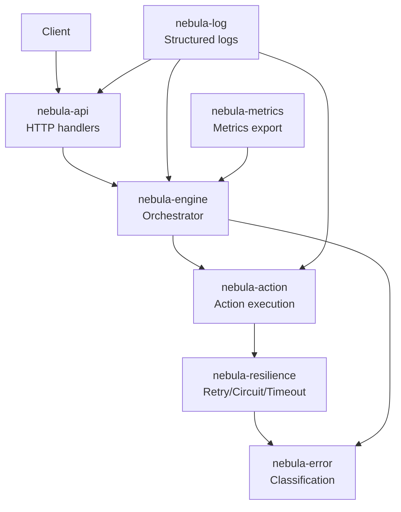

**Diagram sources**
- [README.md:1-90](file://crates/log/README.md#L1-L90)
- [README.md:1-68](file://crates/error/README.md#L1-L68)
- [README.md:1-85](file://crates/resilience/README.md#L1-L85)
- [errors.rs:1-580](file://crates/api/src/errors.rs#L1-L580)

## Detailed Component Analysis

### Logging and Observability
- Centralized subscriber setup with environment-driven configuration and runtime reload.
- Structured event schema for consistent fields and redaction of secrets.
- Hooks for custom analytics and system health reporting.

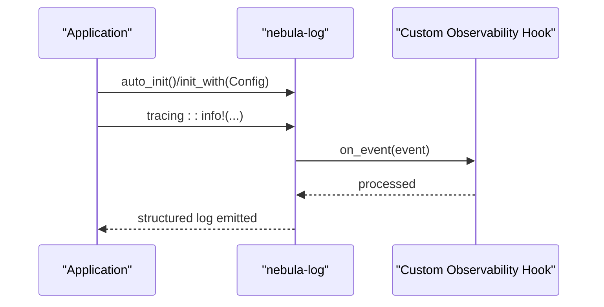

**Diagram sources**
- [README.md:1-90](file://crates/log/README.md#L1-L90)
- [custom_observability.rs:149-313](file://crates/log/examples/custom_observability.rs#L149-L313)

**Section sources**
- [README.md:1-90](file://crates/log/README.md#L1-L90)
- [custom_observability.rs:149-313](file://crates/log/examples/custom_observability.rs#L149-L313)
- [log_hot_path.rs:26-50](file://crates/log/benches/log_hot_path.rs#L26-L50)

### Error Taxonomy and Classification
- Shared classification boundary across the workspace with explicit retry guidance.
- Structured details for help links, request info, and routing hints.
- Error collections for batch and validation scenarios.

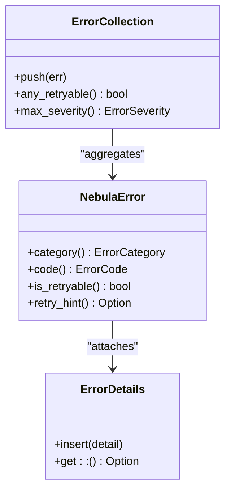

**Diagram sources**
- [README.md:1-68](file://crates/error/README.md#L1-L68)
- [detail_types.rs:443-484](file://crates/error/src/detail_types.rs#L443-L484)
- [collection.rs:342-379](file://crates/error/src/collection.rs#L342-L379)

**Section sources**
- [README.md:1-68](file://crates/error/README.md#L1-L68)
- [detail_types.rs:443-484](file://crates/error/src/detail_types.rs#L443-L484)
- [collection.rs:342-379](file://crates/error/src/collection.rs#L342-L379)

### Resilience Patterns
- Composable pipeline for retry, timeouts, circuit breakers, and hedging.
- Retry filtering based on classification to avoid retrying permanent errors.
- Observability hooks for pipeline events.

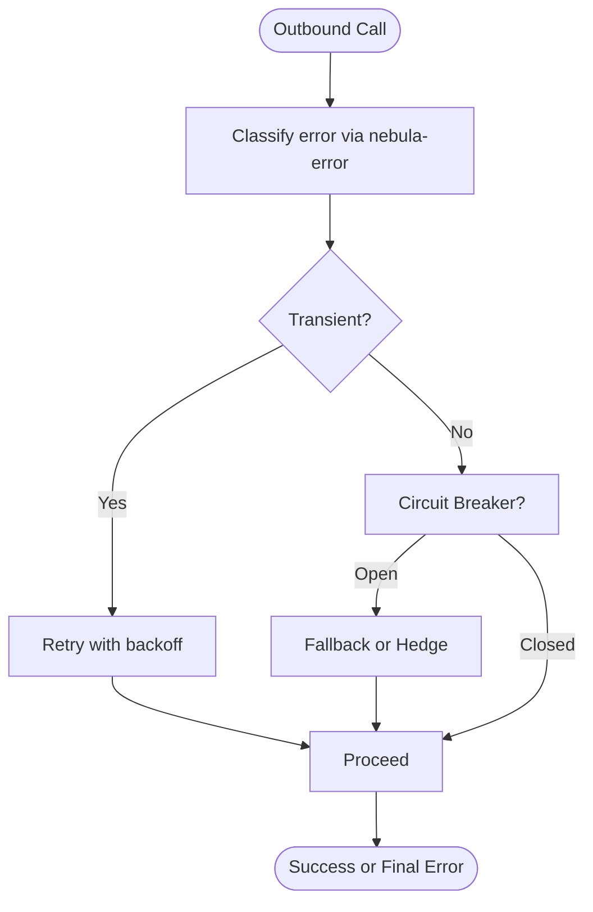

**Diagram sources**
- [README.md:1-85](file://crates/resilience/README.md#L1-L85)

**Section sources**
- [README.md:1-85](file://crates/resilience/README.md#L1-L85)

### API Error Mapping (RFC 9457)
- Converts internal errors to Problem Details with status codes and JSON pointers for validation errors.
- Ensures secure logging and consistent client feedback.

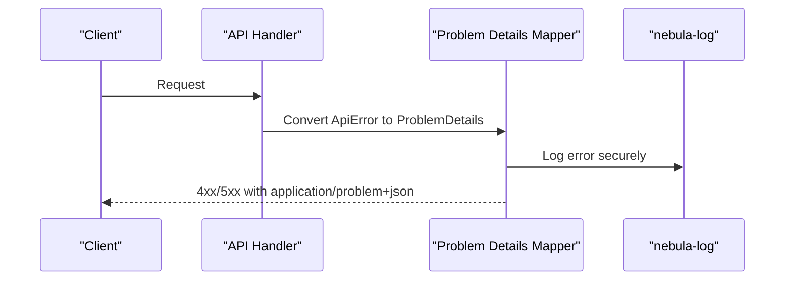

**Diagram sources**
- [errors.rs:315-448](file://crates/api/src/errors.rs#L315-L448)

**Section sources**
- [errors.rs:1-580](file://crates/api/src/errors.rs#L1-L580)

### Engine Error Model
- Comprehensive error variants for planning, parameter resolution, edge evaluation, runtime, execution, and frontier integrity.
- Classification boundary for retryability and categorization.

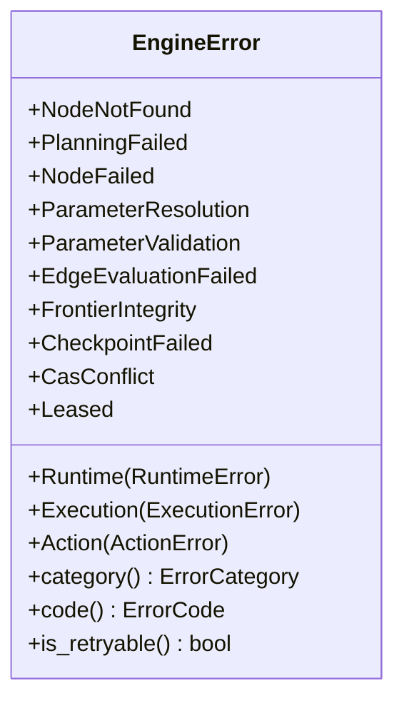

**Diagram sources**
- [error.rs:1-322](file://crates/engine/src/error.rs#L1-L322)

**Section sources**
- [error.rs:1-322](file://crates/engine/src/error.rs#L1-L322)

### Action Error Model
- Distinction between retryable, fatal, validation, sandbox violations, cancellations, and data limit exceeded.
- Retry hints for smarter engine-level retry strategies.

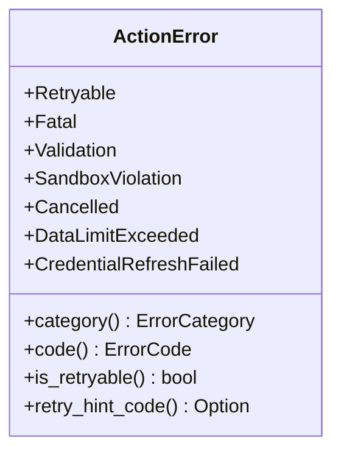

**Diagram sources**
- [error.rs:1-800](file://crates/action/src/error.rs#L1-L800)

**Section sources**
- [error.rs:1-800](file://crates/action/src/error.rs#L1-L800)

### Execution Error Model
- Validation, node not found, plan validation, budget exceeded, serialization, and cancellation.

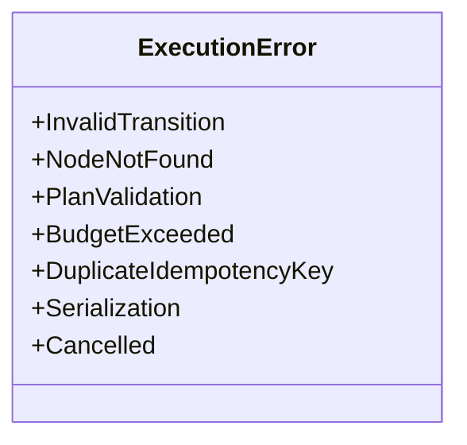

**Diagram sources**
- [error.rs:1-106](file://crates/execution/src/error.rs#L1-L106)

**Section sources**
- [error.rs:1-106](file://crates/execution/src/error.rs#L1-L106)

### Credential Resolution and Rotation
- Timeout-based resolution with pending-state handling.
- Access control enforcement and allowlisting.
- Failure classification for transient vs permanent issues.

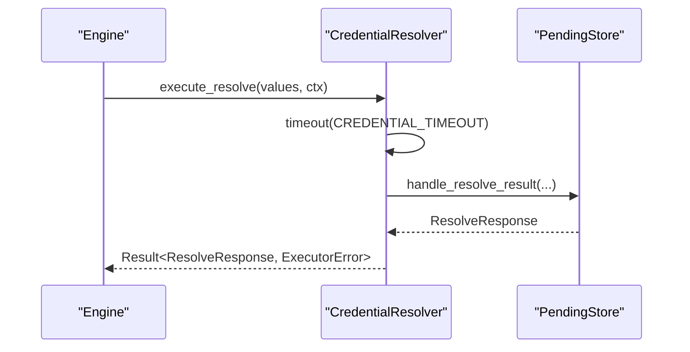

**Diagram sources**
- [executor.rs:36-72](file://crates/engine/src/credential/executor.rs#L36-L72)
- [credential_accessor.rs:27-50](file://crates/engine/src/credential_accessor.rs#L27-L50)
- [validation.rs:501-539](file://crates/credential/src/rotation/validation.rs#L501-L539)

**Section sources**
- [executor.rs:36-72](file://crates/engine/src/credential/executor.rs#L36-L72)
- [credential_accessor.rs:27-50](file://crates/engine/src/credential_accessor.rs#L27-L50)
- [validation.rs:501-539](file://crates/credential/src/rotation/validation.rs#L501-L539)

### Plugin Communication and Discovery
- Plugin discovery with strict key reconciliation and transport error handling.
- Clear skip reasons for diagnostics.

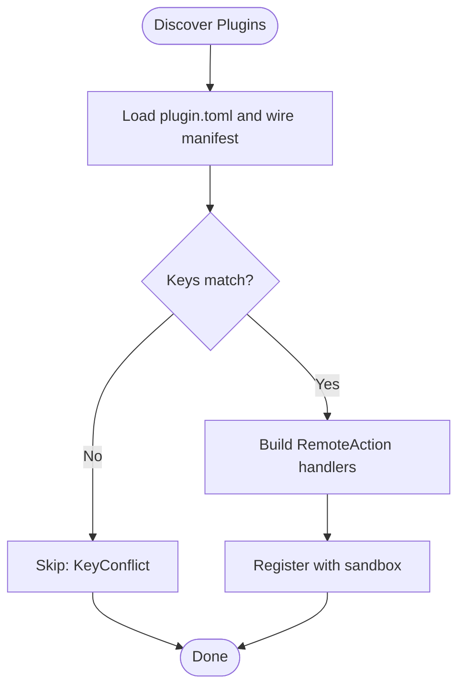

**Diagram sources**
- [discovery.rs:343-565](file://crates/sandbox/src/discovery.rs#L343-L565)

**Section sources**
- [discovery.rs:343-565](file://crates/sandbox/src/discovery.rs#L343-L565)

## Dependency Analysis
- Logging depends on tracing and supports file rolling, OTLP, and Sentry integrations.
- Error taxonomy is a foundational dependency for engine, action, and API layers.
- Resilience consumes classification to drive retry policies.
- API mapping depends on error taxonomy and validator outputs.

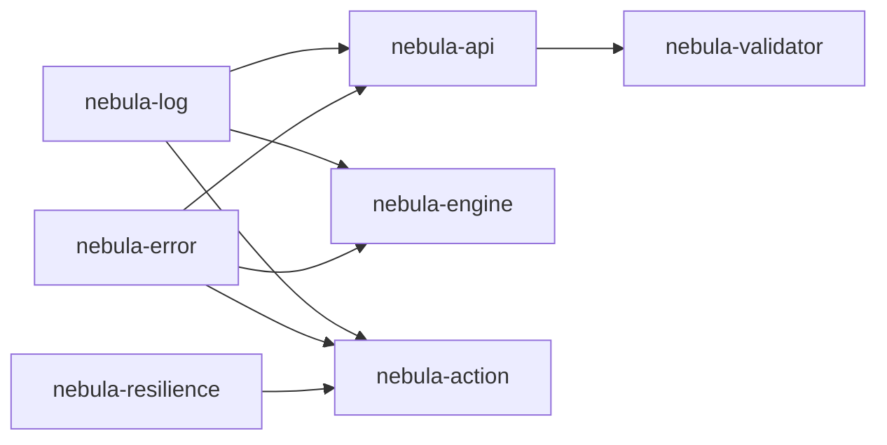

**Diagram sources**
- [README.md:1-90](file://crates/log/README.md#L1-L90)
- [README.md:1-68](file://crates/error/README.md#L1-L68)
- [README.md:1-85](file://crates/resilience/README.md#L1-L85)
- [errors.rs:1-580](file://crates/api/src/errors.rs#L1-L580)

**Section sources**
- [README.md:1-90](file://crates/log/README.md#L1-L90)
- [README.md:1-68](file://crates/error/README.md#L1-L68)
- [README.md:1-85](file://crates/resilience/README.md#L1-L85)
- [errors.rs:1-580](file://crates/api/src/errors.rs#L1-L580)

## Performance Considerations
- Logging hot path benchmarks demonstrate hook budget and queue capacity considerations.
- Metrics adapter exposes canonical histograms for action durations and labeled variants.
- Telemetry design emphasizes tail-based sampling, cardinality reduction, and correlation bridges.

**Section sources**
- [log_hot_path.rs:26-50](file://crates/log/benches/log_hot_path.rs#L26-L50)
- [adapter.rs:127-153](file://crates/metrics/adapter.rs#L127-L153)
- [telemetry-design.md:580-599](file://docs/superpowers/specs/2026-04-06-telemetry-design.md#L580-L599)

## Troubleshooting Guide

### Systematic Diagnosis Playbook
- Identify the failure stage: installation, plugin discovery, credential resolution, action execution, or API handling.
- Collect structured logs with consistent fields and trace identifiers.
- Inspect error categories and codes to determine retryability.
- Use execution journal and telemetry to reconstruct timelines.
- Apply targeted fixes: environment variables, plugin keys, credentials, or resilience tuning.

**Section sources**
- [OBSERVABILITY.md:63-73](file://docs/OBSERVABILITY.md#L63-L73)

### Installation Problems
Common symptoms:
- Plugin discovery fails with key conflicts or missing manifests.
- Binary parent directory issues or SDK version mismatches.

Resolution steps:
- Verify plugin.toml id matches the wire manifest key.
- Confirm host SDK version satisfies required constraints.
- Ensure the binary path has a parent directory and is executable.
- Check environment variables for logging and telemetry configuration.

Concrete references:
- [discovery.rs:343-565](file://crates/sandbox/src/discovery.rs#L343-L565)

**Section sources**
- [discovery.rs:343-565](file://crates/sandbox/src/discovery.rs#L343-L565)

### Runtime Errors
Common symptoms:
- Engine planning failures, parameter resolution errors, or frontier integrity violations.
- Action-level retryable/fatal errors with validation failures or sandbox violations.

Resolution steps:
- Review engine error codes and categories to determine retryability.
- Inspect action error hints (e.g., AuthExpired, RateLimited) to guide smarter retries.
- Validate workflow definitions and parameter schemas to prevent validation errors.
- Enforce capability grants to avoid sandbox violations.

Concrete references:
- [error.rs:179-233](file://crates/engine/src/error.rs#L179-L233)
- [error.rs:239-274](file://crates/action/src/error.rs#L239-L274)
- [errors.rs:315-448](file://crates/api/src/errors.rs#L315-L448)

**Section sources**
- [error.rs:179-233](file://crates/engine/src/error.rs#L179-L233)
- [error.rs:239-274](file://crates/action/src/error.rs#L239-L274)
- [errors.rs:315-448](file://crates/api/src/errors.rs#L315-L448)

### Performance Issues
Common symptoms:
- High CPU/memory usage, slow action execution, or excessive logging overhead.

Resolution steps:
- Profile logging hot path and adjust hook budget and queue capacity.
- Use metrics histograms for action durations and correlate with traces.
- Enable tail-based sampling and cardinality reduction in telemetry.

Concrete references:
- [log_hot_path.rs:26-50](file://crates/log/benches/log_hot_path.rs#L26-L50)
- [adapter.rs:127-153](file://crates/metrics/adapter.rs#L127-L153)
- [telemetry-design.md:580-599](file://docs/superpowers/specs/2026-04-06-telemetry-design.md#L580-L599)

**Section sources**
- [log_hot_path.rs:26-50](file://crates/log/benches/log_hot_path.rs#L26-L50)
- [adapter.rs:127-153](file://crates/metrics/adapter.rs#L127-L153)
- [telemetry-design.md:580-599](file://docs/superpowers/specs/2026-04-06-telemetry-design.md#L580-L599)

### Integration Problems
Common symptoms:
- Plugin transport errors, cross-namespace action mismatches, or registration failures.

Resolution steps:
- Validate plugin manifest and namespace alignment.
- Check transport connectivity and error propagation.
- Ensure registration succeeds and namespace boundaries are respected.

Concrete references:
- [discovery.rs:343-565](file://crates/sandbox/src/discovery.rs#L343-L565)

**Section sources**
- [discovery.rs:343-565](file://crates/sandbox/src/discovery.rs#L343-L565)

### Debugging Tools and Monitoring Approaches
- Logging: initialize with environment variables, enable JSON/Logfmt output, and configure OTLP/Sentry.
- Metrics: use canonical histograms and labeled metrics for action durations.
- Telemetry: leverage tail-based sampling and correlation bridges for traces and USDT probes.

Concrete references:
- [README.md:78-88](file://crates/log/README.md#L78-L88)
- [adapter.rs:127-153](file://crates/metrics/adapter.rs#L127-L153)
- [telemetry-design.md:580-599](file://docs/superpowers/specs/2026-04-06-telemetry-design.md#L580-L599)

**Section sources**
- [README.md:78-88](file://crates/log/README.md#L78-L88)
- [adapter.rs:127-153](file://crates/metrics/adapter.rs#L127-L153)
- [telemetry-design.md:580-599](file://docs/superpowers/specs/2026-04-06-telemetry-design.md#L580-L599)

### Error Classification, Log Interpretation, and Telemetry Analysis
- Use error categories and codes to classify transient vs permanent failures.
- Interpret structured logs with consistent fields and redaction of secrets.
- Correlate trace_ids with execution journal entries to identify root causes.

Concrete references:
- [OBSERVABILITY.md:41-73](file://docs/OBSERVABILITY.md#L41-L73)
- [README.md:29-42](file://crates/error/README.md#L29-L42)

**Section sources**
- [OBSERVABILITY.md:41-73](file://docs/OBSERVABILITY.md#L41-L73)
- [README.md:29-42](file://crates/error/README.md#L29-L42)

### Frequently Asked Questions (FAQ)

Q1: How do I interpret error codes and categories?
- Use the classification boundary to map variants to categories and codes. Retryability is derived from classification or default rules.

Q2: How do I safely include contextual details in logs without leaking secrets?
- Use redacted wrappers before passing values to tracing macros and rely on the logging pipeline’s redaction contract.

Q3: How do I tune resilience for my actions?
- Compose retry/backoff, timeouts, and circuit breakers around outbound calls. Use retry hints to inform smarter strategies.

Q4: How do I troubleshoot plugin communication?
- Validate keys, manifests, and namespaces. Inspect skip reasons and transport errors.

Q5: How do I analyze slow executions?
- Use metrics histograms, tail-based sampling, and correlation bridges between traces and USDT probes.

Q6: How do I harden my developer environment?
- Follow the developer setup guide for toolchain and hooks.

**Section sources**
- [README.md:29-42](file://crates/error/README.md#L29-L42)
- [README.md:44-46](file://crates/log/README.md#L44-L46)
- [README.md:30-41](file://crates/resilience/README.md#L30-L41)
- [discovery.rs:533-565](file://crates/sandbox/src/discovery.rs#L533-L565)
- [telemetry-design.md:580-599](file://docs/superpowers/specs/2026-04-06-telemetry-design.md#L580-L599)
- [2026-04-16-dev-environment-hardening.md:291-311](file://docs/plans/archive/2026-04-16-dev-environment-hardening.md#L291-L311)

## Conclusion
By leveraging Nebula’s unified logging, classification boundary, and resilience patterns, teams can systematically diagnose and resolve issues across installation, runtime, performance, and integration domains. The structured observability and error handling contracts enable consistent diagnostics and actionable remediation, whether for newcomers or advanced practitioners.

## Appendices

### Environment Variables and Configuration
- Logging: NEBULA_LOG/RUST_LOG, NEBULA_LOG_FORMAT, NEBULA_SERVICE, NEBULA_ENV, NEBULA_VERSION, NEBULA_INSTANCE, NEBULA_REGION, OTLP/Sentry variables.
- Telemetry: OTEL_EXPORTER_OTLP_ENDPOINT, SENTRY_* variables.

**Section sources**
- [README.md:78-88](file://crates/log/README.md#L78-L88)