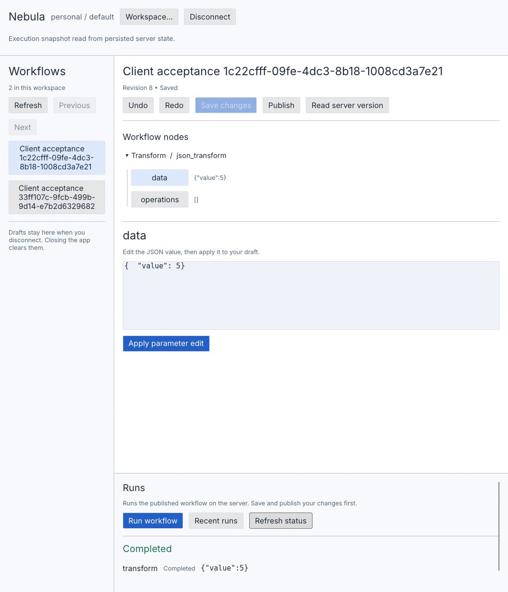

# Nebula client



The workbench uses a light palette, Inter body text, resizable navigation and runs
panes, and a parameter editor in the main document area. Narrow windows stack these
sections vertically. The screenshot shows an isolated acceptance fixture.

First-party egui/eframe workbench for an **existing** Nebula HTTP server. Run native
from the workspace root with `cargo run -p nebula-client`. For the browser, install
Trunk with `cargo binstall trunk`, install `wasm32-unknown-unknown`, and run
`trunk serve` from `apps/client` (Trunk requires the package directory). Deployment can serve the static build under
the same origin as `/api/v1`; it does not start a server or worker.

Sign in with email/password (optional TOTP) or a PAT. Enter organization and workspace
slugs/IDs, select a workflow, expand a node, select a literal parameter, edit its JSON
value and apply. Undo/redo operates on local commands. Save changes, publish, run the
server's current publication, then read persisted execution status. Recent runs make
accepted work discoverable after reconnect. Creation, graph editing, expression/template
editing, managed local launch, packaging and updates are subsequent slices.

The editor requires the workflow detail `definition` and storage `revision`, added
alongside this app. Old metadata-only servers are explicitly unsupported for editing.
Save supplies `expected_revision`; 409 preserves the draft. Read the server version,
compare nodes, then explicitly discard the draft or reapply parameter commands to it.
Reapply may overwrite the same parameters changed remotely, but preserves other server
changes. Publication is also revision-fenced. Run captures the server's current
publication at server admission; it is not an atomic save/publish/run transaction.

Drafts survive disconnects and server/workspace switches **in memory**, keyed by
normalized endpoint, authenticated principal, organization, workspace and workflow.
Closing/reloading the app clears them; no secrets or parameter values are written to
disk/localStorage. Network work runs outside rendering. Session generation and request
sequence reject stale replies before state changes. Indeterminate saves/publications
require a server read and explicit draft recovery. An indeterminate run retains its
Idempotency-Key; **Reconcile pending run** repeats that same intent, never a new key.
Disconnect does not cancel or stop server workflows and does not revoke a server session.

HTTPS is required except on loopback. Native password auth captures only the two
Nebula cookies and sends their CSRF token with mutations. Browser password auth requires
same-origin hosting; cookies retain their server-owned Secure/HttpOnly/SameSite policy.
PAT requests omit browser cookies, and remote browser access requires operator-approved
CORS. Both transports reject redirects, bound responses to 1 MiB and requests to 30s,
and never automatically replay writes. Failures exclude raw URLs, tokens, bodies and
provider error prose. TLS certificates must be trusted by the host. Credentials stay
in memory; password/token inputs are cleared after submission.

Checks from the workspace root:

```text
cargo nextest run -p nebula-client --lib
cargo clippy -p nebula-client --all-targets -- -D warnings
cargo build -p nebula-client --bin nebula-client
cargo build -p nebula-client --target wasm32-unknown-unknown --lib
```

The ignored live acceptance test requires a **fresh isolated** ordinary SQLite server
enrolled through `nebula-server setup begin` with email `client-acceptance@example.test`,
display name `Client acceptance`, organization name `Client acceptance`, and the public
fixture password `isolated-client-acceptance-password` supplied through piped stdin.
The enrollment creates `personal/default`. Configure the server's test SQLite path,
loopback bind, credential dev key and synthetic worker artifact digest according to
[server instructions](../server/README.md). Do not run this fixture on a real deployment.
Set `NEBULA_CLIENT_TEST_ENDPOINT` to that isolated endpoint, then run:

```text
cargo nextest run -p nebula-client --lib --run-ignored ignored-only live_existing_server
```

This uses the app's HTTP adapter and pure document commands against the ordinary
server/worker: password session, list/load, competing save, 409, explicit reapply, save,
publish, keyed start/replay, completed persisted status and the edited node output.
It creates one test workflow per run. Windows/native and WASM compilation are separate
checks from runtime verification on macOS/Linux, browser auth/CORS, keyboard/IME,
clipboard, accessibility, packaging and updates. Those require their own release evidence.

The UI uses Inter from the Google Fonts `ofl/inter` distribution (SIL Open Font
License, retained in `licenses/Inter-OFL.txt`) and unmodified fallback fonts from
`epaint_default_fonts 0.36.2`. Their original
notices are retained in `licenses/` and copied into the browser bundle. Native
distribution must include those notices alongside the executable.
