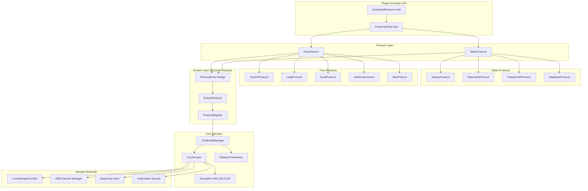
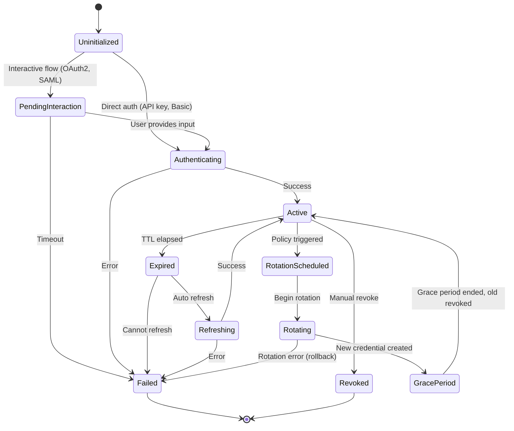

# Architecture

## Positioning

`nebula-credential` is a security-critical infrastructure crate — the security boundary for secrets in the Nebula workflow platform.

**System goals:**
1. **Protocol-Agnostic** — supports OAuth2, SAML, LDAP, mTLS, JWT, API Keys, Kerberos
2. **Type-Safe** — leverages Rust's type system for compile-time verification
3. **Async-First** — built on Tokio for high-performance async I/O
4. **Extensible** — new auth protocols addable without touching core
5. **Production-Ready** — audit logging, metrics, rotation, distributed coordination

Dependency direction:
- runtime/action/api layers -> `nebula-credential`
- `nebula-credential` should not depend on workflow business logic

## High-Level Architecture



> **Protocol Registry Layer (between Protocol and Core Services):** Typed protocols (`FlowProtocol`, `StaticProtocol`) are bridged via `ProtocolDriver` adapters to `ErasedProtocol` (object-safe, `serde_json::Value`-based). `ProtocolRegistry` maps `CredentialKey → Arc<dyn ErasedProtocol>` for runtime-composable protocol management.

## Module Map

| Module | Key types exported | Role |
|--------|-------------------|------|
| `core` | `CredentialId` (from nebula-core), `ScopeLevel` (via `CredentialContext.caller_scope`), `CredentialContext`, `CredentialMetadata`, `CredentialDescription`, `CredentialFilter`, `CredentialState`, `CredentialRef<C>`, `ErasedCredentialRef`, `CredentialProvider`, `CredentialError`, `StorageError`, `CryptoError`, `ValidationError`, `ManagerError`, `SecretString` | Identity, scope, errors, primitives |
| `traits` (domain) | `CredentialType`, `StaticProtocol`, `FlowProtocol`, `InteractiveCredential`, `CredentialResource`, `Refreshable`, `Revocable`, `TestableCredential`, `RotatableCredential` | Credential / protocol contracts |
| `traits` (infrastructure) | `StorageProvider`, `StateStore`, `DistributedLock` | Storage/locking/rotation infrastructure |
| `providers` | `MockStorageProvider`, `LocalStorageProvider`\*, `AwsSecretsManagerProvider`\*, `HashiCorpVaultProvider`\*, `KubernetesSecretsProvider`\*, `ProviderConfig`, `StorageMetrics` | Concrete backends (feature-gated) |
| `manager` | `CredentialManager`, `CredentialManagerBuilder`, `CacheLayer`, `CacheConfig`, `CacheStats`, `ValidationResult`, `ValidationDetails`, `ManagerConfig`, `EvictionStrategy`, `ProtocolRegistry`, `ErasedProtocol`, `ProtocolDriver`, `StaticProtocolDriver`, `ProtocolCapabilities` | High-level CRUD, caching, validation, type registry |
| `protocols` | `ApiKeyProtocol`, `BasicAuthProtocol`, `DatabaseProtocol`, `HeaderAuthProtocol`, `OAuth2Protocol`+config+state+flow, `LdapProtocol`, `SamlConfig`, `KerberosConfig`, `MtlsConfig` | Protocol-specific models |
| `rotation` | `RotationPolicy`, `RotationTransaction`, `RotationState`, `RotationError`, `GracePeriodConfig`, rotation scheduler, blue-green helpers | Policy-driven rotation orchestration |
| `utils` | `EncryptionKey`, `EncryptedData`, `encrypt`, `decrypt`, `SecretString`, `RetryPolicy` | Crypto, secret handling, retry |

\* Feature-gated: `storage-local`, `storage-aws`, `storage-vault`, `storage-k8s`

### Core vs Traits

- **Core (`core`)** contains only identities, context, descriptions, metadata, errors, and the reference layer (`CredentialRef<C>`, `ErasedCredentialRef`, `CredentialProvider`) without knowledge of protocols or rotation. The `core::adapter` module is currently disabled in source and is not part of the active public contract.
- **Domain traits (`traits::credential`)** describe credential types and protocols:
  - `CredentialType` — schema + initialize for a concrete credential
  - `StaticProtocol` — pure form → State without IO (API keys, BasicAuth, DB, header auth)
  - `FlowProtocol` — async protocols with Config/State (OAuth2, LDAP, SAML, Kerberos, mTLS)
  - `InteractiveCredential` — continuation of interactive flows via `InitializeResult`/`UserInput`
  - `CredentialResource` — links resource client to `CredentialType::State` (authorize)
  - `Refreshable` / `Revocable` / `TestableCredential` / `RotatableCredential` — optional capabilities
- **Erased traits (`traits::erased`)** bridge typed protocols to the runtime registry:
  - `ErasedProtocol` — object-safe trait; all state as `serde_json::Value`
  - `ProtocolDriver<P: FlowProtocol>` — captures config, bridges to `ErasedProtocol`
  - `StaticProtocolDriver<P: StaticProtocol>` — bridges static protocols
  - `ProtocolRegistry` — `HashMap<CredentialKey, Arc<dyn ErasedProtocol>>`
  - `ProtocolCapabilities` — capability negotiation (interactive, refresh, revoke, rotate)
- **Infrastructure traits (`traits::storage`, `traits::lock`)** describe storage/locking:
  - `StorageProvider`, `StateStore`, `StateVersion` — encrypted credential blob storage and rotation state
  - `DistributedLock`, `LockGuard`, `LockError` — distributed locks for refresh/rotation

> **Design note:** `where Self: Sized` on `FlowProtocol` methods means the trait is not directly object-safe. For the dynamic registry, `ProtocolDriver<P>` bridges to `ErasedProtocol` which IS object-safe. Typed `FlowProtocol` is for implementors; `ErasedProtocol` is for the registry and API layer.

## Credential Lifecycle State Machine

### States

```rust
pub enum CredentialLifecycle {
    Uninitialized,         // Created, not yet authenticated
    PendingInteraction,    // Waiting for user action (OAuth2 redirect, device code)
    Authenticating,        // Auth in progress (token exchange, LDAP bind)
    Active,                // Successfully authenticated, ready for use
    Expired,               // TTL elapsed, needs refresh
    Refreshing,            // Refresh in progress
    RotationScheduled,     // Policy triggered, rotation pending
    Rotating,              // Rotation in progress (backup → new → validate)
    GracePeriod,           // Both old and new credentials valid
    Revoked,               // Manually revoked (terminal)
    Failed,                // Unrecoverable error (terminal)
}
```

### Transition Graph



### State Properties

```rust
impl CredentialLifecycle {
    pub fn is_usable(&self) -> bool {
        matches!(self, Self::Active | Self::GracePeriod)
    }

    pub fn requires_interaction(&self) -> bool {
        matches!(self, Self::PendingInteraction)
    }

    pub fn is_terminal(&self) -> bool {
        matches!(self, Self::Revoked | Self::Failed)
    }
}
```

### State Transition Validation

Illegal transitions return `Err(StateError::IllegalTransition { from, to })`. Example: `Active → Authenticating` is forbidden; `Active → Expired` is allowed.

### Public API: CredentialStatus

`CredentialLifecycle` is an internal type — never exposed in API responses or public types. External callers see `CredentialStatus`, a lean 6-state enum (D-016):

```rust
pub enum CredentialStatus {
    PendingInteraction,   // waiting for user action (OAuth2, Device Flow, SAML)
    Active,               // ready for use; also covers GracePeriod transparently
    Rotating,             // rotation in progress (covers RotationScheduled + Rotating)
    Expired,              // needs refresh; cannot serve requests
    Revoked,              // terminal — manually revoked
    Failed,               // terminal — unrecoverable error
}
```

Mapping from internal to public:

| Internal `CredentialLifecycle` | Public `CredentialStatus` |
|-------------------------------|--------------------------|
| `Uninitialized`, `Authenticating` | *(not yet in storage — not returned)* |
| `PendingInteraction` | `PendingInteraction` |
| `Active` | `Active` |
| `Refreshing` | `Active` (transparent — old token still valid) |
| `GracePeriod` | `Active` (both credentials valid; caller unaffected) |
| `RotationScheduled`, `Rotating` | `Rotating` |
| `Expired` | `Expired` |
| `Revoked` | `Revoked` |
| `Failed` | `Failed` |

This boundary prevents internal state machine changes from breaking the public API contract.

## Type-State Pattern (Design Direction)

For compile-time enforcement of credential flow correctness:

```rust
struct Uninitialized;
struct Interactive;
struct Authenticated;

struct OAuth2Flow<State> {
    config: OAuth2Config,
    _state: PhantomData<State>,
}

impl OAuth2Flow<Uninitialized> {
    pub fn start(self) -> OAuth2Flow<Interactive> { /* ... */ }
}

impl OAuth2Flow<Interactive> {
    pub async fn complete(self, code: String) -> OAuth2Flow<Authenticated> { /* ... */ }
}

impl OAuth2Flow<Authenticated> {
    pub fn access_token(&self) -> &SecretString { /* ... */ }
}
```

This ensures calling `access_token()` on an uninitialized flow is a compile error.

## Data and Control Flow

### Credential Acquire (happy path)

```
caller
  │
  ├─→ CredentialManager::retrieve(id, ctx)
  │         │
  │         ├─→ scope check (CredentialContext validates tenant/scope)
  │         │
  │         ├─→ CacheLayer::get(id)  ──hit──→ scope check via scope_id match
  │         │        │
  │         │       miss
  │         │        │
  │         ├─→ StorageProvider::retrieve(id)
  │         │        │
  │         │   StorageError::NotFound → None
  │         │   StorageError::* → CredentialError::Storage
  │         │        │
  │         ├─→ CacheLayer::insert(id, data, ttl)
  │         │
  │         └─→ return Some((EncryptedData, CredentialMetadata))
  │
  └── caller decrypts with EncryptionKey → SecretString
```

The `CredentialContext` carries the caller's runtime scope:

```rust
pub struct CredentialContext {
    pub owner_id:  String,              // credential owner
    pub caller_scope: Option<ScopeLevel>, // optional scope for multi-tenancy
    pub trace_id:  Uuid,                 // for audit/tracing
    pub timestamp: DateTime<Utc>,
}
```

### Rotation Flow (RotationTransaction)

```
RotationScheduler detects policy trigger
  │
  ├─→ RotationTransaction::begin()
  │         │
  │         ├─→ backup current credential
  │         ├─→ generate/acquire new credential
  │         ├─→ store new encrypted state via StorageProvider
  │         ├─→ grace period: old credential still valid
  │         │
  │         ├── failure at any point → rollback to backup
  │         │
  │         └─→ revoke old credential (end of grace period)
  │
  └─→ CredentialManager emits CredentialRotated event
            │
            └─→ resource::Manager::notify_credential_rotated(id, &new_state)
                      → linked CredentialResource instances call authorize(&new_state)
                      → pool drained; new acquires use updated auth
```

## Concurrency Model

### Read-Heavy Optimization

- `CredentialManager` is `Clone`; clones share the same `Arc<StorageProvider>` and `Arc<CacheLayer>`
- Cache uses `RwLock` — multiple concurrent readers, exclusive writer
- `StorageProvider::retrieve` is idempotent and safe to retry
- Optimistic concurrency control (CAS) for rotation state updates

### Distributed Coordination

- `DistributedLock` trait with `acquire(key, ttl)` and `try_acquire(key, ttl)`
- Production: Redlock algorithm (Redis-based, quorum across multiple instances)
- Prevents double-rotation when multiple nodes detect the same policy trigger
- Lock guard released automatically on drop (Lua script for atomic check-and-delete)

### Channel Usage

- Work queues: bounded mpsc (rotation tasks)
- Events: broadcast (credential rotated notifications — stateless only)
- Response: oneshot (rotation result delivery)
- Shared state: `RwLock` preferred for read-heavy cache

## Key Internal Invariants

- `#![forbid(unsafe_code)]` enforced at lib root
- `CredentialManager` is `Clone`; clones share the same `Arc<StorageProvider>` and `Arc<CacheLayer>`
- Cache is keyed by `CredentialId`; scope isolation enforced at retrieve time via `caller_scope.is_contained_in_strict(&entry.owner_scope, resolver)` — never serve credentials outside the caller's scope
- `CryptoError::DecryptionFailed` is never retried; it is fatal (fail-secure)
- `SecretString` implements `Debug` with redaction; never exposes raw secret in error messages or logs
- `StorageProvider::retrieve` is idempotent and safe to retry; `store`/`delete` are not
- Rotation failure always triggers rollback to the backup credential; new state is never partially applied
- `core::adapter` module is disabled in source and excluded from public API

## Security Boundaries

- Encrypted credential payloads are first-class values (never stored plaintext)
- Context + scope used for tenant isolation on every operation
- Secret value handling centralized in `SecretString` and `EncryptedData`
- Unsafe code forbidden at crate root
- See crate-level security requirements in this architecture and API documentation.

## Operational Properties

- Async-first API surface
- Provider abstraction allows environment-specific backend choice
- Cache layer is optional and configurable (TTL, max size, eviction strategy)
- Rotation subsystem supports periodic/scheduled/manual/before-expiry patterns

## Manager vs CredentialProvider

- **CredentialManager**: process object for storage, cache, validation, rotation. Does not know concrete protocols.
- **CredentialProvider**: trait for action/resource/engine. `CredentialManager` implements it: id-based `get(id)` works when `encryption_key` is set on the builder; type-based `credential<C>()` returns error (requires type registry, Phase 4).

## Rotation Subsystem Boundary

- Manager calls: `rotate_credential`, `rotate_periodic`, `rotate_before_expiry`, `rotate_scheduled`, `rotate_blue_green`, `rotate_with_grace_period`, `rotate_atomic`.
- Rotation owns: state machine, rollback, grace period, blue-green, 2PC, events, metrics.
- Public rotation types: `RotationResult`, `RotationError`, `TransactionLog`, `GracePeriodConfig`, `RotationPolicy`.

### Four Rotation Policies

| Policy | Trigger | Use Case |
|--------|---------|----------|
| **Periodic** | Fixed interval (e.g. 90 days) | DB passwords, API keys, compliance |
| **Before-Expiry** | TTL threshold (e.g. 80%) | OAuth2 tokens, TLS certs, Vault leases |
| **Scheduled** | Specific date/time | Maintenance windows, change management |
| **Manual** | External trigger | Security incidents, personnel changes |

Policies can be combined: whichever trigger fires first initiates rotation.

`RotationTransaction` coordinates the full rotation sequence transactionally (saga with rollback): backup → generate → store → grace period → revoke old. Any failure at any phase triggers automatic rollback to the backup credential.

## Production Architecture (Target)

```
CredentialManager
    │
    ├── L1 Cache: in-memory LRU, per-node, ~5 min TTL
    ├── L2 Cache: Redis, shared across fleet, ~30 min TTL  ← production add
    ├── StateStore: PostgreSQL / DynamoDB                   ← production add
    ├── DistributedLock: Redis/etcd for rotation            ← production add
    └── AuditLog: S3/Kafka for compliance                   ← production add
```

Current implementation has L1 cache only. See [ROADMAP.md](ROADMAP.md) for path to production.

## Extension Points

### Adding a New Protocol

1. Define protocol struct (e.g. `MyProtocol`)
2. Implement `StaticProtocol` (sync) or `FlowProtocol` (async)
3. Define `State` type implementing `CredentialState`
4. Register in `ProtocolRegistry` (or via `#[derive(Credential)]` macro)
5. Optionally implement `Refreshable`, `Revocable`, `RotatableCredential`

No changes to `core/` or `manager/` required.

### Adding a New Storage Backend

1. Implement `StorageProvider` trait
2. Add feature flag in `Cargo.toml`
3. Add `ProviderConfig` variant
4. Implement `capabilities() -> ProviderCapabilities` (P-001)

## Known Complexity Hotspots

- Wide feature matrix for providers and protocols
- Large rotation subsystem with many safety components
- `CredentialManager::manager.rs` (~2900 lines) — candidate for further decomposition

## Auth Scenarios

| Scenario | Protocols | Integration |
|----------|-----------|-------------|
| HTTP APIs | ApiKey, BasicAuth, HeaderAuth, OAuth2 | `CredentialResource::authorize(state)` injects token/header into HTTP client |
| Enterprise IdP | LdapProtocol, SamlProtocol, KerberosProtocol | FlowProtocol + Config + State; TLS/Binding via config |
| DB + mTLS | DatabaseProtocol, MtlsConfig | Resource pools receive State; client certs stored in State |

See [PROTOCOLS.md](PROTOCOLS.md) for protocol mapping and DX examples.

## Comparative Analysis

Sources: n8n, Node-RED, Activepieces/Activeflow, Temporal/Prefect/Airflow (credential-relevant parts).

- **Adopt:** Encrypted credential storage; scope/tenant isolation; provider abstraction; OAuth2 flows; credential type schemas; rotation with grace period
- **Reject:** Plaintext credential storage; global credential namespace; credentials in workflow JSON; string-based credential type selection
- **Defer:** Credential sharing between workflows; credential versioning UI; HSM integration
