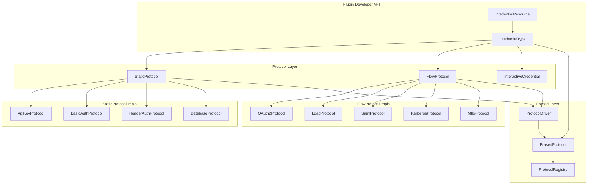
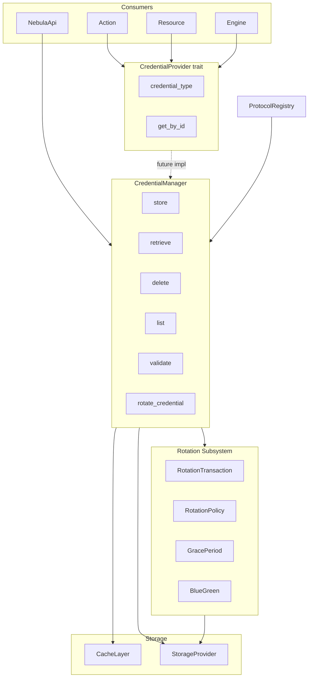

# Target Architecture (Refactoring Plan)

## Protocol Layer

## Management Layer

## Manager vs Provider API Gaps (Phase 4)

| API doc (nebula-api) | Current Manager | Status |
|----------------------|-----------------|--------|
| `create(type_id, input)` → `InitializeResult` | Stub (returns error) | **Stub** |
| `continue_flow(id, UserInput)` → `InitializeResult<Complete>` | Stub (returns error) | **Stub** |
| `list_types()` → `Vec<CredentialTypeSchema>` | Returns empty vec | **Stub** — requires `ProtocolRegistry` with registered `CredentialKey → ErasedProtocol` mappings |
| `list(filter)` → `Vec<CredentialMetadata>` | `list(context)` → `Vec<CredentialId>` | Partial |
| `get(id)` → `(Metadata, CredentialStatus)` | `retrieve(id, ctx)` → `(EncryptedData, Metadata)` | Partial |
| `CredentialManager` implements `CredentialProvider` | `get(id)` works with `encryption_key` | **Done** |

## Rotation Boundaries

- **Manager** calls high-level rotation entry points; does not implement state machine.
- **Rotation** owns: `RotationTransaction`, `RotationState`, `TransactionPhase`, `GracePeriodTracker`, `BlueGreenRotation`, `FailureHandler`, `TransactionLog`.
- **Public types**: `RotationResult`, `RotationError`, `TransactionLog`, `GracePeriodConfig`, `RotationPolicy`.

## Auth Scenarios

| Scenario | Protocols | CredentialResource |
|----------|------------|--------------------|
| HTTP APIs | ApiKey, BasicAuth, HeaderAuth, OAuth2 | HTTP client receives State, applies via `authorize` |
| Enterprise IdP | LdapProtocol, SamlProtocol, KerberosProtocol | LDAP/SAML/Kerberos clients |
| DB + mTLS | DatabaseProtocol, MtlsConfig | DB connection pools, TLS clients |

## Phased Refactoring

1. **Phase 1**: Document gaps (this file); no code changes.
2. **Phase 2**: Add `CredentialManager::create`, `continue`, `list_types` stubs; implement `CredentialProvider` for `CredentialManager` (id-based only initially).
3. **Phase 3**: Align `list`/`get` with API contract; add `CredentialStatus`, `CredentialTypeSchema`.
4. **Phase 4**: Full nebula-api integration; type registry for `credential<C>()`.
