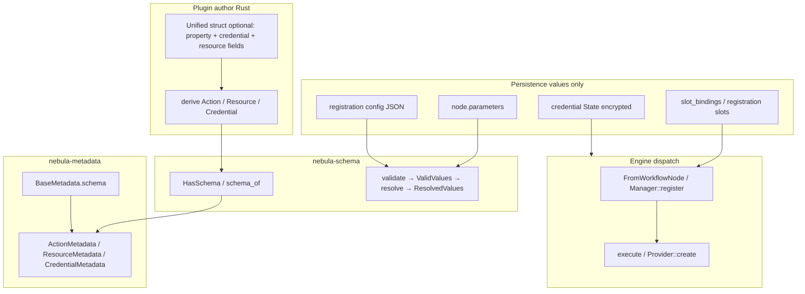
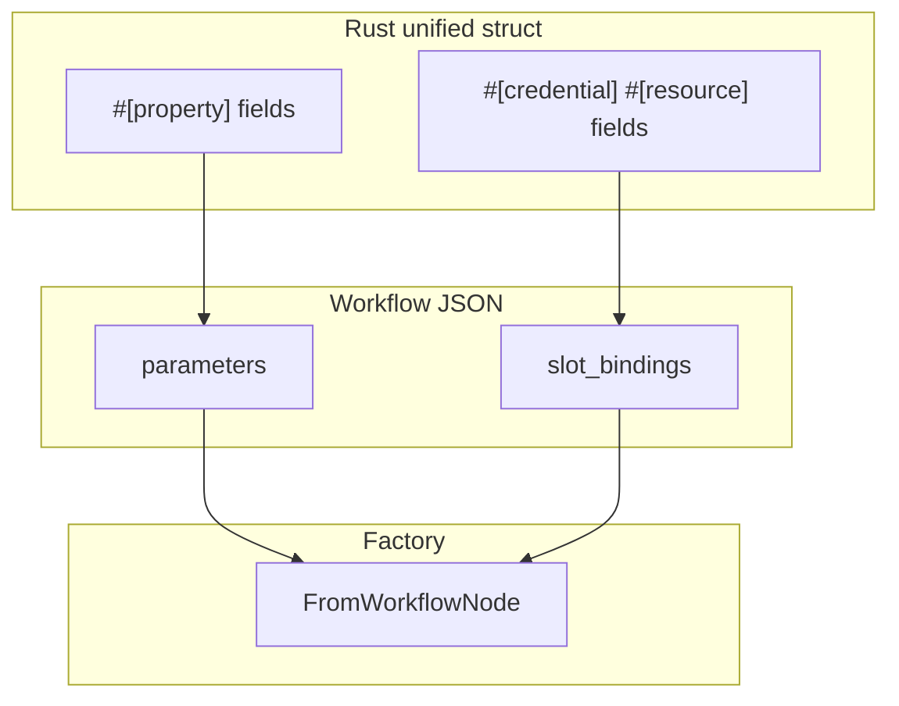
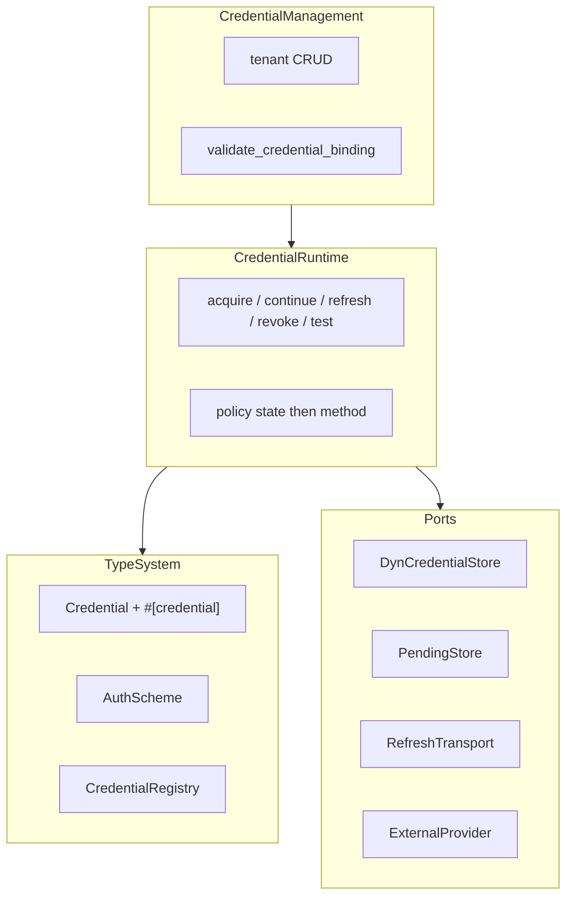
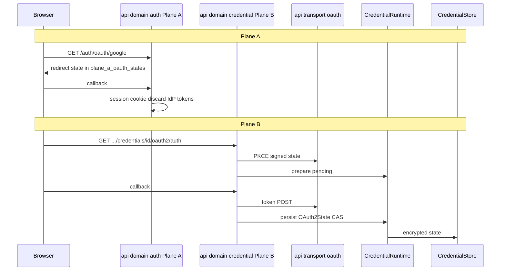

# nebula-credential — subsystem design (spec-first)

| Field | Value |
|-------|-------|
| **Status** | Draft — review before implementation. **Reviewed by the design conference 2026-06-12 (see [CONFERENCE.md](CONFERENCE.md)); corrections folded into §9–§11, §15, §19 and §21.** |
| **Scope** | Primary: `nebula-credential` runtime/management rewrite (ADR-0092 completion). Cross-crate: `nebula-action`, `nebula-resource`, `nebula-schema`, `nebula-metadata`, `nebula-api`, `nebula-engine` contracts touched for one coherent picture. |
| **Supersedes** | Ad-hoc merge layout from #791; incomplete ADR-0088 migration steps 2–3–6–8 |
| **Conference** | [CONFERENCE.md](CONFERENCE.md) — 6 industry seats (Temporal, n8n, Airflow, Windmill, Vault, AWS SDK) + 4 adversarial critics. Findings drive §21. |
| **Related** | [ADR-0088](../../../docs/adr/0088-credential-subsystem-rewrite.md), [ADR-0092](../../../docs/adr/0092-credential-subsystem-consolidation.md), [ADR-0081](../../../docs/adr/0081-m6-resource-credential-integration.md), [ADR-0084](../../../docs/adr/0084-pre-expiry-credential-refresh-deferred.md), [ADR-0085](../../../docs/adr/0085-oauth-identity-providers-from-secrets.md), [ADR-0056](../../../docs/adr/0056-type-safe-dag.md), [INTEGRATION_MODEL](../../../docs/INTEGRATION_MODEL.md), [PRODUCT_CANON](../../../docs/PRODUCT_CANON.md) §3.5 / §15 |

---

## 1. Executive summary

Consolidation (ADR-0092) moved credential code into one crate but **did not finish** the logical rewrite from ADR-0088. Today there are parallel resolve/refresh paths, a monolithic OAuth2 credential type, and docs that still say “engine owns orchestration” while code lives in `nebula-credential`.

This design specifies:

1. **One runtime pipeline** (`CredentialRuntime`) for acquire, continue, refresh, revoke, and test.
2. **Management separated from runtime** — tenant CRUD vs execution-time resolve.
3. **OAuth Plane Law** — operator login (Plane A) vs workflow credential OAuth (Plane B); zero HTTP routes in the credential crate.
4. **Protocol + provider config** — not one Rust type per SaaS API.
5. **Shared integration authoring** across Action, Resource, and Credential: `#[property]` / `#[credential]` / `#[resource]`, with **schema from types** (`nebula-schema` + `nebula-metadata`) and **values-only persistence** in storage.
6. **Consumption unchanged at the edge** — `CredentialGuard<Scheme>`, slot bindings, `ResourceGuard`, engine accessor; refactor is **under** that surface.

**No Rust refactor ships until this document is approved.**

---

## 2. Purpose and non-goals

### In scope (1.0)

- Finish ADR-0088 migration in ADR-0092 topology (single crate).
- Reactive refresh only ([ADR-0084](../../../docs/adr/0084-pre-expiry-credential-refresh-deferred.md)).
- Plane B credential lifecycle ([ADR-0033](../../../docs/adr/HISTORICAL.md) mechanics; storage [ADR-0029](../../../docs/adr/HISTORICAL.md)).
- Resource ↔ credential binding ([ADR-0081](../../../docs/adr/0081-m6-resource-credential-integration.md)).
- Unified DX plan for Action / Resource / Credential macros (Phase 5 — after runtime green).

### Explicit non-goals

| Area | Out of scope |
|------|----------------|
| **Plane A** | Operator OAuth / Nebula session ([ADR-0085](../../../docs/adr/0085-oauth-identity-providers-from-secrets.md)) — `api/domain/auth` only |
| **Storage implementation** | Decorators, CAS, encryption layers stay in `nebula-storage` |
| **Resource fan-out** | Rotation fan-out, `on_credential_refresh` — `nebula-resource` + engine |
| **Proactive refresh scheduler** | 1.1 — not 1.0 |
| **Return to 4 credential crates** | ADR-0092 rejected that split |
| **Pure `Protocol` trait object** | ADR-0088 rejected — loses compile-time method presence (E0046) |
| **Per-row JSON Schema in DB** | Values only; schema from registry at catalog + dispatch |

---

## 3. ADR reconciliation

ADR chain is **evolutionary**, not contradictory. Code and canon drift when different stages are mixed.

### Orchestration ownership

| Stage | ADR | Resolve / refresh / lease | Management CRUD | OAuth HTTP |
|-------|-----|---------------------------|-----------------|------------|
| Historical | 0030 | Engine | credential trait | 0031 → API |
| M6 contract | 0081 | `nebula-credential-runtime` (Exec) | separate runtime crate | API ceremony |
| Rewrite draft | 0088 D7 (proposed) | Engine coordinator | merge into credential (**rejected**) | acquisition into credential |
| **Current target** | **0092** | **`nebula-credential` `runtime/` + `service/`** | same crate | `RefreshTransport` injected from API |

**Canon/README drift:** “engine owns orchestration” describes 0030/0088 D7, not 0092. Update after implementation.

### Three OAuth surfaces (do not merge)

| Surface | ADR | Location | Result |
|---------|-----|----------|--------|
| **Plane A** — sign in to Nebula | 0085 | `api/domain/auth`, `plane_a_oauth_states` | Session cookie; IdP tokens discarded |
| **Plane B HTTP** — token exchange | 0031 / 0088 | `api/transport/oauth` | SSRF-hardened reqwest; callback routes |
| **Plane B logic** — state, pending, PKCE | 0033 / 0088 | `nebula-credential` | `OAuth2State`, pending types, `RefreshTransport` |

### ADR-0088 migration checklist (post-0092)

| Step | Intent | Status |
|------|--------|--------|
| 1 | `nebula-crypto` extract | Done (#766) |
| 2 | Protocol + policy contract | **Partial** — `CredentialPolicy`, `#[credential]` exist; OAuth2 monolith; no shared protocol module |
| 3 | Collapse registries → one | **Partial** — `CredentialRegistry` + `DispatchOps` remain |
| 4 | Facade + scope dedup | **Partial** — facade in credential; dual tenant enforcement |
| 5 | Engine trim, rotation data down | Done relocation; engine shim remains |
| 6 | API thin; OAuth routing | **Open** — dual kickoff, split pending stores |
| 7 | Delete dead CredentialRow SQL | Verify |
| 8 | Delete sub-trait dispatch center | **Not done** |

---

## 4. Cross-crate integration model

Nebula integrations are **five concepts** with one structural contract ([INTEGRATION_MODEL](../../../docs/INTEGRATION_MODEL.md)):

| Concept | Crate | Metadata | Schema type | Values persistence |
|---------|-------|----------|-------------|-------------------|
| **Action** | `nebula-action` | `ActionMetadata` | `A::Input: HasSchema` | Workflow `node.parameters` |
| **Resource** | `nebula-resource` | `ResourceMetadata` | `R::Config: HasSchema` | Registration config JSON |
| **Credential** | `nebula-credential` | `CredentialMetadata` | `C::Properties: HasSchema` | Setup `FieldValues` → encrypted **State** |
| **Schema** | `nebula-schema` | — | `ValidSchema`, `Field`, proof-token pipeline | — |
| **Catalog prefix** | `nebula-metadata` | `BaseMetadata<K>` embeds `ValidSchema` | key, name, description, icon, tags | — |

**Slots (dependencies)** are orthogonal: `#[credential]` / `#[resource]` on Action or Resource types → workflow `slot_bindings` or registration slot bindings — **not** mixed into parameter schema.



---

## 5. Schema, metadata, API, and UI

### Rule: schema lives in types; DB stores values

| Stored in DB / workflow JSON | **Not** stored per row |
|------------------------------|------------------------|
| `parameters`: field name → `ParamValue` (literal or expression) | labels, types, `secret`, `validate`, JSON Schema |
| `slot_bindings`: slot_key → resource/credential id | slot scheme metadata |
| Resource registration config JSON | `ResourceConfig` schema |
| Credential encrypted State + create-time values | `Properties` schema |

Schema and catalog fields come from the **registered type** when the UI or engine needs them.

### Pipeline: `#[property]` → schema → metadata → API

1. Author marks fields with `#[property]` (alias for `nebula-schema` `#[field(...)]`) or separate `#[derive(Schema)]` companion struct.
2. `HasSchema::schema()` / `nebula_schema::schema_of::<T>()` builds `ValidSchema`.
3. `ActionMetadata::for_action`, `ResourceMetadata::for_resource`, `CredentialMetadata::for_credential` embed schema in `BaseMetadata`.
4. In-process registry → API catalog (`ActionRegistry`, resource catalog, `CredentialSchemaPort`).
5. API projects credential schema for wire (`project_public_schema` strips internal rules).
6. Client renders dynamic forms from catalog — **not** from workflow rows.

Symmetric constructors already in code:

- `CredentialMetadata::for_credential` → `schema_of::<C::Properties>()`
- `ActionMetadata::for_action` → `<A::Input as HasSchema>::schema()`
- `ResourceMetadata::for_resource` → `<R::Config as HasSchema>::schema()`

Unified macros (Phase 5) must **emit the same pipeline** — no ad-hoc `serde_json::json!` form schemas in plugins.

### Design time vs run time (one schema source)

| Phase | Consumer | Schema source | Values source |
|-------|----------|---------------|---------------|
| **Catalog / editor** | Client UI | Registry → `*Metadata.base.schema` | User saves into persistence |
| **Dispatch** | Engine → factory | Same `HasSchema` on type | DB values + expression eval |

When a plugin updates field metadata, the catalog reflects it without migrating stored JSON Schema snapshots. Old workflows may fail validation at dispatch if values no longer match — intentional.

### Action execution-time parameter pipeline

Documented in `crates/action/tests/schema_validator_expression_pipeline.rs`:

1. **Schema** — `schema_of::<A::Input>()` from registry (not DB).
2. **Validate** — `ValidSchema::validate(&FieldValues)` — literals + expression syntax + `#[validate]` rules.
3. **Expression** — resolve `{{ }}` against `ExpressionContext`.
4. **Deserialize** — typed `Input` (or unified `#[property]` fields on `self`).
5. **Slots** — `FromWorkflowNode`: `slot_bindings` → `credential_by_key` / `resource_by_key`.
6. **Execute** — `execute(&self, ctx)`; hot path uses `self.*` for slots.

**Credential:** catalog `CredentialTypeDescriptor.schema_json` + `CredentialSchemaPort::validate_data` on create; then `resolve` → encrypted State.

**Resource:** catalog schema + validate config at `Manager::register`; `create` reads `self` properties + bound `SlotCell`s.

### Gap (honest)

`validate_workflow` today is **structural** (graph, refs, retry). Cross-checking every `node.parameters` against live `ActionRegistry` schema at activation is **planned** (Phase 5 optional activation port). Per-step validate at dispatch is the typed path above.

**Credential properties:** no expression pipeline in credential setup — `serde_json::from_value::<Properties>` after validate ([`properties_pipeline`](../tests/properties_pipeline.rs)).

---

## 6. Persistence: three value buckets + slots

Unified struct is **authoring sugar**. Storage stays split.

| Integration | `#[property]` bucket | Dependency bucket |
|-------------|---------------------|-------------------|
| **Action** | `NodeDefinition.parameters` | `node.slot_bindings` |
| **Resource** | registration config JSON | registration `slot_bindings` |
| **Credential** | setup form → `FieldValues` at create | no child credential slots (spec 23) |



**Reject:**

- Merging secrets into `parameters`.
- One merged `node.fields` map (breaking serde, no benefit).
- Removing `SlotCell` / `slot_bindings` (rotation epoch, fan-out).

Three meanings of “slot”:

1. **Declaration** — `slot_key` on `#[credential]` / `#[resource]` field.
2. **Persistence** — entry in `slot_bindings` map.
3. **Runtime** — `SlotCell`, resolved `CredentialGuard` / `ResourceGuard`.

---

## 7. Unified authoring (`#[property]` / `#[credential]` / `#[resource]`)

> **NOT YET BUILT — Phase 5 spec (conference Finding 6).** `#[property]` and
> `#[action(unified)]` do **not** exist in the macros today; the examples in this
> section do not compile yet. Action authoring is still `#[action(... input = FooInput)]`,
> credential authoring is `#[credential]` on an `impl` (T2) or a manual `impl` (T3),
> and `#[derive(Credential)]` is a **legacy second path slated for deletion** (do it
> now, per §16 — the two macros have opposite philosophies and are a cargo-cult trap).
> Treat everything below as the target DX, not current capability.

### Shared vocabulary (Phase 5)

| Attribute | Action | Resource | Credential |
|-----------|--------|----------|------------|
| `#[property]` / `#[field]` | `node.parameters` | registration config | setup form → State |
| `#[credential]` | `CredentialGuard` / Lazy | `SlotCell<Guard>` | forbidden on credential type |
| `#[resource]` | `ResourceGuard` | — | rare `#[uses_resource]` |
| Legacy | `input = FooInput` | separate `FooConfig` | separate `Properties` + T2/T3 |

### Action (target)

```rust
#[derive(Action)]
#[action(key = "send.message", unified, output = SendOutput)]
struct SendMessage {
    #[property(label = "Chat ID")]
    chat_id: String,
    #[resource(key = "slack")]
    slack: ResourceGuard<SlackClient>,
    #[credential(key = "fallback")]
    token: Lazy<CredentialGuard<SecretToken>>,
}

impl StatelessAction for SendMessage {
    async fn execute(&self, ctx: &impl ActionContext) -> Result<ActionResult<SendOutput>, ActionError> {
        self.slack.send(&self.chat_id, self.token.get().await?).await?;
        ...
    }
}
```

Macro emits: property-only `HasSchema`, `dependencies()` from slot fields, `FromWorkflowNode`, optional `type Input` for legacy.

### Resource (target)

```rust
#[derive(Resource)]
#[resource(key = "postgres", unified)]
struct Postgres {
    #[property(label = "Host")]
    host: String,
    #[credential(key = "db")]
    db: SlotCell<CredentialGuard<DbUserCred>>,
}

impl Provider for Postgres {
    async fn create(&self, ctx: &ResourceContext) -> Result<PgPool, Error> {
        let user = self.db_slot()?.expose();
        build_pool(self.host, user, ...).await?
    }
}
```

### Credential — three tiers (macro never required for registry)

| Tier | Shape | When |
|------|-------|------|
| **T1** | Unified derive + `#[property]` | Most builtins / plugins |
| **T2** | `#[credential]` on `impl` block (`api_key.rs` style) | Power users |
| **T3** | Manual `impl Credential` | Tests, maximum control (`bearer_token`, probes) |

**Policy:** macros are DX shortcuts; `CredentialRegistry::register` accepts any `Credential` impl.

### `self.*` vs `ctx.*`

| Model | Verdict |
|-------|---------|
| Metadata list `#[resources([...])]` on struct without fields | **Rejected** — loses types, Option/Lazy, `self.*` |
| Field slots `#[credential]` / `#[resource]` on struct | **Target** |

- **Factory / register** uses `ctx` once to resolve slots.
- **execute / create** uses `self.field` / `self.db_slot()` in hot path.
- **ctx** remains for ad-hoc helpers, `ResourceAction::configure`, dynamic keys from parameters.

---

## 8. Unified `ctx` API (Phase 4b)

Symmetric naming aligned with metadata **`key`**:

| Method | Key source |
|--------|------------|
| `ctx.resource::<R>()` / `ctx.credential::<C>()` | `R::key()` / `C::KEY` |
| `ctx.resource_by_key::<R>(key)` / `ctx.credential_by_key::<C>(key)` | runtime key (slot default or override) |
| `ctx.try_*` / `ctx.try_*_by_key` | `Option` semantics |

Deprecate: `acquire_resource_by_id`, `resolve_credential_by_id`, `credential_by_id`.

Single prelude import: `nebula_action::prelude::SlotContextExt` (or equivalent).

`Lazy<Guard>` on **declared fields** — not `Lazy` on `ctx` in 1.0.

---

## 9. Credential crate — target architecture

### Bounded contexts (one crate)



### Public surfaces after refactor

| Surface | Consumers | Role |
|---------|-----------|------|
| `nebula_credential::{Credential, AuthScheme, …}` | action, resource, plugin | Authoring |
| `CredentialRuntime` | engine, api (via service) | **Single** execution pipeline |
| `CredentialService` | api management routes | CRUD + delegate runtime |
| `rotation::*` | storage, api | Contract + orchestration unified tree |

### Data flow (canon §15.4–15.5)

```
Properties (setup form, HasSchema)
  → resolve / acquire / continue_acquire
  → State (encrypted at rest, CredentialState)
  → project()
  → Scheme (AuthScheme material)
  → CredentialGuard<Scheme> at slot
```

Action receives **Scheme**, never raw State.

### Capability and policy (ADR-0088 D2) — **corrected by conference Finding 1/2**

- **Shape** — `CredentialPolicy` / `RefreshStrategy` / `RevokeStrategy` (data).
- **Code** — `Refreshable`, `Interactive`, … (compile-time presence).
- **Routing** — runtime reads `policy(&State)` **then** calls the capability method
  if the strategy allows (OAuth2 without `refresh_token` → `ReAcquire`, not blind
  `refresh()`).

> **Current code does NOT do this — the conference proved it (CONFERENCE.md
> Finding 1).** The macro-synthesized `policy()` ignores its `&State` argument
> (`macros/src/credential_attr.rs:435-447`), and the resolver routes on
> `state.expires_at()` + a hardcoded `C::KEY != OAuth2Credential::KEY` branch
> (`runtime/resolver.rs:209,536`) — `policy()` has zero production consumers.
> Worse, capability is mirrored in two desyncable places (the `Capabilities`
> bitflag **and** `policy.refresh`).

**Target (adopted):**

1. The routing decision is a **total, state-derived, time-free** function
   `decide_refresh(&State, now) -> Decision { Usable | NeedsRefresh | NeedsReacquire | Dead }`
   (Vault `framework.CalculateTTL` shape), consulted by the resolver for **every**
   strategy — the `C::KEY` string branch is **deleted**. The `Decision` carries **no**
   `deadline`/`next_check` field (planёрka F2: a non-`Option` deadline cannot make
   leased-never-refresh unrepresentable — same type for `MAX` and a real value).
2. Policy↔capability disagreement is a **compile error**, not silent inference:
   the macro emits `assert_impl!(C: Refreshable)` under `RefreshStrategy::Refresh*`
   (Temporal/AWS), so "declared refreshable but no `refresh` method" is `E0046`.
3. **Liveness is framework-clocked, not author-supplied** (planёrka F2, the same
   "remove the author's hand from the privileged seam" move as owner-isolation): the
   staleness ceiling is a constructor-validated bound (`Duration::MAX` unconstructible
   on the lease path) and the resolver returns a **framework lease handle, never a raw
   `&Secret`**. A leased secret (`expires_at: None`, refreshable) must return
   `NeedsRefresh`, not `Usable` (Finding 2 / the Leased category silently never renews
   otherwise).
4. State-dependent capability (OAuth2 client-credentials vs auth-code in one type)
   is expressed through `decide_refresh(&State)` + a grant discriminant on `OAuth2State`
   (planёрka Q2 — `client_credentials` re-acquires non-interactively, `device_code`
   reauths interactively; not a shared `ReauthRequired`), not a type-level bitflag.

> **F2 RESOLVED (planёrka 2026-06-12 — §19.1):** the **open trait + sub-trait model
> wins**; the sealed `enum ProtocolKind` is **dead** (it forecloses F3 third-party
> protocols). The capability *binding* axis instead becomes a per-protocol zero-cost
> **marker type** (`Slot<S: Scheme>`, F3 verdict). **Owner ruled (2026-06-12): no
> "valid forever" category** — even a static credential with no freshness signal (a
> plain API key) carries a framework-imposed mandatory re-validation floor, so
> `decide_refresh` returns `NeedsRefresh`/`NeedsReacquire` past the floor even when
> `expires_at: None`. See §17 Phase-1 spec deltas.

### Remove as public concepts

- Parallel `execute_resolve` / facade resolve / resolver refresh / `DispatchOps` consumer API → internal to one pipeline.
- `nebula_engine::credential::*` (except test `default_in_memory_coordinator`).
- Legacy `#[derive(Credential)]` if `#[credential]` attr covers all cases.

### OAuth2 target (not 1500-line type)

- Shared `OAuth2Protocol` (or category `RefreshPair` + `OAuth2State`).
- `OAuth2ProviderConfig` as registry **data** (`github`, `slack`, …).
- Kickoff logic types in credential; **HTTP only** via API transport + injected `RefreshTransport`.

### Rotation

Single tree: `rotation::{contract, orchestration}` — not duplicate `rotation/` modules.

### Tenant isolation

Single `owner_id` format via `Scope::credential_owner_id` (0088 D7 amend). Facade + `ScopeLayer` roles documented; no `org/workspace` vs `org:workspace` split.

---

## 10. OAuth Plane Law



### Hard rules (agent checklist)

1. **`nebula-credential` never mounts HTTP routes.**
2. **Plane A** — only `api/domain/auth`, `plane_a_oauth_states`; never `OAuth2Credential` ceremony.
3. **Plane B ceremony** — only `api/transport/oauth` + `api/domain/credential/oauth.rs`; thin handlers.
4. **One PKCE/state kernel** — credential crypto or api transport; not duplicated in monolith credential.
5. **Credential crate owns** — `OAuth2State`, pending **types**, `continue_resolve` **logic**, `refresh` with transport.
6. **Remove dual kickoff** — deprecate `OAuth2Credential::initiate_authorization_code` as public; single workspace API kickoff.
7. **AGENTS.md** — “Adding OAuth? Which plane?”
8. **The `RefreshTransport` seam is a TYPE invariant, not a convention (conference Finding 3/4).** The seam type carries only `(Url + form) → capped bytes`; it must be **structurally unable** to carry `&mut OAuth2State` or keys, so a second composition root (CLI / test / worker) cannot inject a permissive transport that bypasses SSRF. DNS-rebind TOCTOU is closed by a **connect-layer resolver (MUST, not SHOULD)** in addition to the pre-call host/IP check.
9. **Owner isolation is a TYPE, not a discipline (conference Finding 3).** The store port takes a privately-constructed `OwnerScopedKey` (length-prefixed `owner_id` + id) and exposes **no `get(&str)`** — the resolver cannot *express* an unscoped load. `ValidatedCredentialBinding` carries the `OwnerScopedKey`; `resolve_for_slot` stops relying on the tautological `fingerprint == fingerprint` check.
10. **No revoked-credential resurrection / stale-serve.** `revoke` writes a tombstone epoch that the refresh-CAS consults (no delete-then-CAS-upsert); the circuit-breaker serves a stale token only on **transient** failures, never after a terminal `invalid_grant`.
11. **`pending.get` honors the full 4-D binding** (kind, owner, session, token) even on device-code polling — a leaked 32-byte token alone must not read another tenant's pending state.
12. **Plugin egress policy** — a plugin's `test` / `acquire` / `project` cannot make arbitrary outbound calls; SSRF hardening is not OAuth2-branch-only. (Windmill shipped exactly this guard in commit #9428 — resolve the token through the caller's permissioned path so a developer cannot exfiltrate a secret by pointing a resource token at it.)
13. **Refresh persists the WHOLE rotated state atomically (real bug — n8n #30345/#25926).** When a provider rotates the `refresh_token` on refresh, the refresh outcome captures the **new** `refresh_token` and the CAS write persists the complete new `State`. Losing the rotated token is the #1 cause of "credential needs to reconnect" loops. A refresh that does not write back the rotated token is a defect, not a latency tweak.
14. **No stale in-memory credential (real bug — n8n #1695, Windmill #1732).** A refresh updates the durable State **and** the live material a consumer sees — never DB-only. Long, multi-call actions hold a `CredentialRef` that re-resolves fresh (or read through the `SlotCell` ArcSwap), so the second call after a refresh does not reuse the expired token a captured-once guard would hold.
15. **Refresh is atomic — a bad provider response never corrupts stored State (real bug — n8n #12742).** The provider response is validated **before** the CAS write; a malformed / error / rate-limited response leaves the prior `State` intact (no partial / garbled write that disables future refresh).
16. **Refresh triggers on stored expiry, not a magic status code (real bug — n8n #17450/#18517).** The primary trigger is `policy(&State)` over the stored `expires_at` / lease TTL (proactive buffer + jitter, AWS) — not "retry only on HTTP 401". The "this response means expired" signal is **provider-config data** (some APIs answer 403 / empty body), never a hardcoded 401.
17. **External-provider port has a bounded-timeout + cache + fail-closed contract (Airflow lesson).** A slow/owned secrets backend on the hot path must not block execution unbounded; the `ExternalProvider` chain has an ordered priority (env → external provider → store), a per-call timeout, a short TTL cache, and fail-closed semantics — not "every resolve is an uncapped network call."
18. **Provider-returned strings are UNTRUSTED input (real bug class — n8n [#23182](https://github.com/n8n-io/n8n/issues/23182)/[#28055](https://github.com/n8n-io/n8n/issues/28055) "`dummy.stack.replace` leaks into the UI" + IdP echo of `refresh_token` in `error_description`).** Every IdP-supplied field that crosses into an operator-facing surface — `error`, `error_description`, `error_uri`, `WWW-Authenticate` — is treated as adversarial: `error_uri` is `Url::parse`d + `https`-scheme-allowlisted + length-capped before it appears in any log/span/alert (a raw concat is a SIEM/log-injection + phishing vector); `error_description` is redacted for token-shaped substrings (`(access|refresh)_token`, `bearer`, `client_secret`, `api_key`, `password`) **before** it enters a `tracing` event or a `CredentialError::refresh` message — providers routinely echo the offending token in `invalid_grant`. No provider string is ever string-interpolated into a template/placeholder pipeline.
19. **"Success" is content-determined, not status-line-determined (real bug — n8n [#23410](https://github.com/n8n-io/n8n/issues/23410)).** A `200 OK` carrying `{"error":"invalid_grant"}` / `{"code":401}` in the body is a **failure**, and a refresh trigger keys on the typed refresh outcome (parsed body), never on the HTTP status alone — otherwise an error-in-200 is recorded as a fresh token and the credential silently rots.

### Current pain (dual path)

| Issue | Location |
|-------|----------|
| Two Plane B kickoffs | `oauth2.rs` vs `api/domain/credential/oauth.rs` |
| Split pending stores | `PendingStateStore`, `oauth_pending_store`, `oauth_state_tokens` |
| HTTP “disabled” in credential but logic scattered | agents add wrong layer |

---

## 11. Plugin / protocol extensibility

**Code per protocol, config per provider** — not type per Slack/GitHub.

| Axis | Example |
|------|---------|
| Protocol (~10 families) | OAuth2 acquire/refresh, static secret, signed request |
| Provider config | GitHub auth URL, scopes |
| Catalog KEY | `github_oauth` — UI label + slot binding |
| AuthScheme output | `OAuth2Token`, `SecretToken`, custom |

### Protocol families (1.0 focus)

| Family | Category | Platform owns |
|--------|----------|---------------|
| API key / PAT / Basic | `StaticSecret` | encrypt, guard, slots |
| Bearer + expiry | `BearerWithExp` | reactive refresh if policy says so |
| HMAC / SigV4 | `SignedRequest` | scheme projection |
| OAuth2 | `RefreshPair` / interactive | Plane B HTTP, pending store, PKCE |
| Connection string | `ConnectionString` | often pairs with Resource |
| Key pair / cert | `KeyPair` / `Certificate` | secure storage, resource `create` |

### Plugin author does **not**

| Task | Owner |
|------|-------|
| Operator login | Plane A |
| Browser redirect / callback HTTP | API transport |
| Token exchange HTTP | `RefreshTransport` / ceremony client |
| Persist encrypted state | `CredentialService` + storage |
| Slot resolve at execution | engine + `CredentialRuntime` |

### Plugin author **may**

- New `AuthScheme` in plugin (slot scheme compatibility).
- `Interactive` + pending type for non-OAuth flows (device code, LDAP) — ceremony HTTP only if browser needed.

**Anti-pattern:** new `OAuth2Credential` per API or oauth callback in credential crate.

---

## 12. Consumption layer (Action / Resource)

### Three ways to get auth material

| API | Resolves | Use when |
|-----|----------|----------|
| Declared `#[credential]` / `#[resource]` on struct | slot binding → guard on `self` | **Default** |
| `ctx.credential_by_key::<C>(key)` | explicit key | factory, ad-hoc |
| `ctx.credential::<C>()` | `C::KEY` | type-key lookup, no node override |
| `ResourceGuard<R>` | pre-authorized instance | auth inside resource `create` |

### Multi-slot

- Action: multiple `#[credential]` / `#[resource]` — independent `slot_bindings`.
- Resource: multiple `SlotCell` — separate registration keys per resolved credential set.

### Preferred paths

1. **Resource carries auth** — `#[resource] pool: ResourceGuard<Postgres>`; Action uses pool only.
2. **Direct credential** — `#[credential] api: CredentialGuard<SecretToken>` for SDK one-shots.

Credential refactor **does not change** slot vocabulary — only unifies runtime behind accessor.

---

## 13. Resource auth beyond HTTP

OAuth HTTP ceremony is **one** protocol. DB, queue, SSH, mTLS use **driver auth** in `Provider::create`.

| Layer | Holds |
|-------|-------|
| `ResourceConfig` / `#[property]` | host, port, pool size — **no secrets** |
| `#[credential]` slot | `CredentialGuard<Scheme>` |
| `Provider::create` | wires config + guard → driver |

`AuthPattern` matrix (`ConnectionUri`, `IdentityPassword`, `KeyPair`, `RequestSigning`, …) in `nebula_core::auth` — see INTEGRATION_MODEL.

Rotation hooks (`on_credential_refresh`) are driver-specific (pool swap, reconnect SSH, reload mTLS) — same `SlotCell` epoch model.

**Anti-pattern:** forcing all resources through OAuth HTTP or `RefreshTransport`.

---

## 14. TypedDAG forward compatibility (ADR-0056)

Typed workflows compile to the same `WorkflowDefinition` IR.

| Layer | TypedDAG | YAML/UI today |
|-------|----------|---------------|
| Data edges | `Connect<A,B>` — Output → Input | connections + expressions |
| Infra slots | Phase 3 workflow generics | `slot_bindings` |
| Runtime | Same `FromWorkflowNode`, same factory | same |

Slots are **orthogonal** to `Connect<Output,Input>`. Unified struct + field slots survive TypedDAG: factory reads same `NodeDefinition`.

Do not merge slots into `Input` for Connect typing.

---

## 15. Industry reference: n8n (brief)

n8n stays sane via **TYPE (recipe) / INSTANCE (encrypted blob) / RUNTIME (CredentialsHelper)** — not via 400 neat folders.

| n8n | Nebula target |
|-----|---------------|
| `ICredentialType` | `Credential` + protocol + provider config |
| `properties` | `Properties: HasSchema` |
| `extends oAuth2Api` | `OAuth2ProviderConfig` data |
| `CredentialsHelper` (pre-auth/auth **orchestration**) | `CredentialRuntime` |
| `OauthService.refreshOAuth2CredentialById` (refresh **mechanics** — separate from the Helper) | `RefreshTransport` (POST) **+** credential-side `OAuth2State` logic |
| `CredentialsService` CRUD | `CredentialManagement` |
| SSO vs `oauth2-credential` routes | Plane A vs Plane B (same lesson) |

> **Conference correction (n8n seat, CONFERENCE.md Finding 4):** n8n does **not**
> put refresh mechanics inside `CredentialsHelper` — it delegates to `OauthService`
> + `@n8n/client-oauth2`. Mapping `CredentialsHelper → CredentialRuntime` 1:1 is
> misleading; the refresh-HTTP role is the `RefreshTransport` seam (D5), which is why
> splitting it out is *more* correct than n8n's own layering, not less.

Nebula merge debt = violating single runtime helper + incomplete protocol/config split.

---

## 16. Current vs target (gap summary)

| Symptom | Root cause | Target |
|---------|------------|--------|
| 4 resolve entry points | Incomplete 0088 step 3 | `CredentialRuntime` only |
| Dual refresh CAS paths | facade + resolver | single coordinator |
| Sub-trait dispatch ignores `policy` | D2 not wired | policy-first routing |
| `oauth2.rs` monolith | D1 not done | protocol + config |
| Facade 1400 LOC mixed CRUD/runtime | D4 partial | Management vs Runtime |
| Engine credential re-exports | 0092 incomplete | direct `nebula_credential` |
| Dual OAuth kickoff | step 6 open | OAuth Plane Law |
| Canon “engine orchestrates” | doc drift | update post-merge |

---

## 17. Phased rollout (after this doc is approved)

> **Scale & moat DoD addendum:** §24 adds cross-cutting scale-invariants to the
> Phase-1/2 DoD (sharded coalescer map, single claim/cache key derivation, batch
> `get_many`, pure cached `policy`, ExternalProvider timeout+single-flight+env-fail-open,
> staggered rotation fan-out). §23 makes closing the confused-deputy (Finding 3 /
> §10 rule 9) **Phase-1 priority #1** — the one real moat is worthless while it leaks.

### Phase 1 — Single runtime pipeline

- `CredentialRuntime` merges resolve/continue/refresh/revoke/test.
- `DispatchOps` internal only; auto-wire on `register::<C>()`.
- Policy before `Refreshable::refresh`.

**DoD:** one call graph; OAuth2 ReAcquire vs RefreshToken tests; **`policy(&State)` has
≥1 production consumer** — the resolver routes the serve/refresh decision through
`decide_refresh`, not an ad-hoc inline `expires_at` test (**done, increment 1b**);
**`RefreshStrategy::Lease` with `expires_at: None` enters the refresh window** (Wall-1 /
Finding 2 regression); **confused-deputy closed on the slot path** (**done, increment 2**) —
the binding carries an `OwnerScopedKey` and `resolve_for_slot` re-verifies the stored row's
owner at load (cross-tenant id → `NotFound`; regression test); sealing the store port itself
so no caller can express `get(&str)` is the increment-2b follow-up; **contender blocks on claim
watch/notify**, `claims_exhausted == 0` under a 7s synthetic IdP + 30 contenders;
**the resolve / material-access path emits a fail-closed audit event** (owner,
credential_id, scheme, slot, caller) — read auditing, not refresh-only (§23 SOC 2 gap);
**provider-returned strings are redacted/validated before any log or error** — a
regression test asserts an `error_description` echoing a token and an `error_uri` with
control chars + a non-`https` scheme never reach a `tracing` event or a
`CredentialError` message (§10 rules 18/19); **a single generic store / transport /
`ExternalProvider` contract-test suite** runs against every backend impl (in-memory,
Postgres, SQLite, and any vault adapter) so a new backend is correct-by-passing-the-suite,
not by hand-written per-impl tests.

**Phase-1 spec deltas (planёрка 2026-06-12 — by construction, refining the DoD above):**

- **F2 — liveness off the author's hand (sequenced *with* confused-deputy #1, same move).**
  The refresh `Decision` is **time-free classificatory** `{ Usable, NeedsRefresh,
  NeedsReacquire, Dead }` — it carries **no** `deadline`/`next_check` field (a non-`Option`
  deadline has the identical type for `Deadline::MAX` and a real value, so a deadline field
  cannot make leased-never-refresh unrepresentable). Liveness is **framework-clocked**: the
  staleness ceiling is a constructor-validated bound such that `Duration::MAX` is
  **unconstructible** on the lease path, and the resolver returns a **framework-owned lease
  handle, never a raw `&Secret`**. Tests replace the strawman "did the author type a number"
  fixture: a constructor-reject/compile-fail for `MAX_STALENESS = Duration::MAX` (the *real*
  failure mode), and an arch/type test that **no `&Secret` is reachable except through the
  lease handle** (construction, not a `KEY` grep). Jitter is applied **once at the scheduler
  seam, structurally non-zero** (not an author-supplied `Duration` that can be `ZERO`) — W2
  needs the non-zero property proven under N replicas computing the same state-derived deadline.
  **Owner ruling (2026-06-12): no "valid forever" category.** Even a static credential (no
  expiry, no refresh — a plain API key) carries a framework-imposed **mandatory re-validation
  floor**: `decide_refresh` returns `NeedsRefresh`/`NeedsReacquire` once the floor elapses **even
  when `expires_at: None`**, so the never-revalidated class is closed by construction for the one
  credential whose state has no honest freshness signal. The floor is not author-opt-out-able;
  its default cadence is a tuning param. Test: a static credential past its re-validation floor
  does **not** return `Usable`.
- **Q8 — the decision function is total.** Replace the `policy()` / `C::KEY != OAuth2Credential::KEY`
  routing with a **total** `decide_refresh(state, now) -> { Fresh, RefreshNow }`; the leased
  case (`expires_at: None` but refreshable) returns `RefreshNow`, not `Fresh` (the proven-bug
  regression guard). Extract the miss-triggered refresh into a named coordinator method
  `on_access` so 1.1 proactive refresh adds an entry point instead of re-plumbing. **Do not**
  add a `RefreshAt(Instant)` arm, a `DurableTimer` port, or a no-1.0-producer arch-test — the
  1.1 trigger is a sharded sweeper (Vault fairshare / W2), not a per-credential `Instant`, and
  extending an internal enum later is non-breaking (only `nebula-sdk` is public).
- **Q2 — OAuth2 grant discriminant.** `OAuth2State` carries a grant discriminant (add
  `grant_type: GrantType`, or split `RefreshStrategy` so `ReAcquire` distinguishes
  `NonInteractive`-replay from `Interactive`-reauth) so `client_credentials` is **not** routed
  to human reauth. Test matrix includes the non-`authorization_code` falsifiers:
  `client_credentials` (real `expires_at`, no refresh_token) → non-interactive re-acquire;
  `device_code` → interactive reauth — never a shared `ReauthRequired`. When the engine-side
  HTTP refresh is re-enabled, it selects `grant_type` from state, never hardcodes
  `grant_type=refresh_token`.
- **F3 — two-axis binding.** `Scheme` is a **sealed trait with per-protocol zero-cost marker
  impls**, not an enum with an `Opaque`/`Box<dyn>` arm; the bind site is `Slot<S: Scheme>` so a
  cross-protocol bind (Stripe-cred → Twilio-slot) is a **nominal compile error** (trybuild
  compile-fail fixture). The protocol **family** is the sealed enum owning egress shape + the
  state-derived `decide_refresh`. Open-world = a plugin author defines a marker type and
  declares an existing family; a **registration-time check rejects an unsound family choice**
  (a token-bearer protocol declared as `StaticHeader` so it never refreshes) — the one place
  discipline could re-enter, closed at registration. Arch-test: `Scheme` has no `Box<dyn>` /
  catch-all variant.
- **Q9/Q10 — close the latent wrong-source defect structurally.** `ensure_local_source` is
  currently gated at the facade call-sites but **absent from `resolve_for_slot`** (it resolves
  a raw id) — a latent wrong-source defect *on the moat path*. Fix it by construction: move the
  source check **into the resolver tail** (`External` → `Unsupported`/`ExternalSourceNotWired`,
  never local bytes), not a fourth per-call gate. The confused-deputy fix passes the **validated
  binding** (not a raw `credential_id`) into the resolver, so the scope gate and the data-source
  are not split across the facade/resolver boundary. Q9 safe-delete = binding-validation rejects
  a tombstoned id with a typed `CredentialTombstoned` **before any guard is produced** — via the
  existing engine→credential inbound `validate_credential_binding` path, with **no `references()`
  port in the credential crate** (that would invert `service→runtime→contract`). Tests:
  `resolve_for_slot` on an `External`-configured service returns `Unsupported`; binding-validation
  against a tombstoned id fails before a guard exists.

### Phase 2 — Management vs runtime

- Thin `CredentialService`; facade delegates.
- Unified `owner_id`; single validation path with API schema port.

**DoD:** facade < 400 LOC; tenant tests green.

### Phase 3 — Protocol model + OAuth2

- `OAuth2Protocol` + provider registry data; shrink monolith.
- Plugin static credential registration test.
- **OAuth2 refreshes through its own grant-discriminant-driven `Refreshable::refresh`**
  (transport reachable from the trait, Q2), so the resolver no longer special-cases the
  refresh mechanism by key. This is what makes deleting the `C::KEY != OAuth2Credential::KEY`
  compare (`resolver.rs` `try_oauth2_refresh`) safe — it cannot land in Phase 1 because that
  compare is currently the only working OAuth2 refresh path (`OAuth2Credential::refresh` is
  HTTP-disabled per ADR-0031).

**DoD:** oauth2 core < 500 LOC; e2e OAuth green; **no hardcoded `*Credential::KEY` compare
in `runtime/`** (arch-test) — the routing decision is already key-free after Phase 1, this
gate confirms the refresh mechanism is too.

### Phase 4 — Cleanup

- Remove engine shim, unify rotation, deprecated shims.
- **4b:** `SlotContextExt` symmetric ctx API.

**DoD:** `task dev:check`; no `nebula_engine::credential` except test harness.

### Phase 5 — Unified macros (DX, cross-crate)

- **5a** Action unified struct
- **5b** Resource unified struct
- **5c** Credential unified + T1/T2/T3 docs
- Optional: activation validator with action registry port

Credential Phases 1–4 **do not block** Phase 5; Phase 5 must not block runtime refactor.

---

## 18. Agent guardrails (`crates/credential/AGENTS.md` updates)

- **OAuth?** Plane A → `domain/auth`. Plane B → `transport/oauth` only.
- **New SaaS API?** Provider config, not new OAuth2 credential type.
- **Parameters?** `#[property]` → schema crate; values in DB only.
- **Slots?** Never in `parameters`; always `slot_bindings`.
- **Execute style?** `self.*` for declared slots; `ctx` for factory/ad-hoc.
- **HTTP in credential crate?** Never.

---

## 19. Decisions & open questions

### 19.1 Planёрка decisions (2026-06-12 — decision round)

A second meeting (proponent → adversary → chair, full synthesis in
[CONFERENCE.md](CONFERENCE.md) "Planёрка") forced the six coupled open decisions.
Several adversaries **read the as-built source** and found the branch has already
moved past assumed bugs (e.g. `OAuth2Credential::refresh` returns a typed
`ReauthRequired`, not a hard error; `policy` is hand-written and state-reading for
OAuth2) — and found one *new* latent defect (`ensure_local_source` is absent from
`resolve_for_slot`). Verdicts:

| # | Decision | Verdict | One-line |
|---|----------|---------|----------|
| **F2** | capability model (open trait + `policy` vs sealed enum) | **Decided (owner 2026-06-12)** | Open trait wins (sealed enum forecloses F3); liveness moves **off the author's return value** into a framework-clocked lease seam. **Owner ruled: even a static credential carries a framework-imposed mandatory re-validation floor** — there is no "valid forever" category; a no-expiry secret still gets a periodic re-validation. |
| **Q2** | OAuth2 KEY (one `oauth2` + provider-data vs per-provider) | **Decide: A** | One `oauth2` protocol KEY, provider-as-data; attack failed on the KEY axis but surfaced a separate grant-discriminant gap (a Phase-1 rider, not a KEY change). |
| **F3** | open-world plugins (sealed set vs `Custom(Box<dyn>)`) | **Decide: A + marker types** | Two axes: sealed **family enum** for runtime mechanics; per-protocol zero-cost **marker type** for the binding axis. No `Opaque`/`Box<dyn>` escape hatch. |
| **Q8** | durable-timer port (define-now vs defer) | **Decide: C-minus** | Ship the state-derived `decide_refresh(state, now) -> {Fresh, RefreshNow}` seam + extract an `on_access` trigger method; do **not** ship a `RefreshAt(Instant)` arm, a `DurableTimer` port, or a no-producer arch-test. |
| **Kestra** | hierarchical inherited scope | **Decided (owner 2026-06-12): retroactive inheritance is required** | Ship flat in 1.0, but **keep the read-key seam** — owner ruled a newly-created child MUST auto-inherit parent secrets provisioned before it existed, with **no** re-provision (else "a pile of tickets — people expected one thing, got problems"). That **overrides** the planёрka's reference-at-write recommendation (it cannot do retroactive). 1.1 target = **read-time inherited resolution through an authority-vouched `InheritedScopeKey`** (carries the proven ancestor chain, privately constructed — the resolver still cannot express an unscoped/unvouched load, so the moat holds). |
| **Q9/Q10** | impact-on-delete + reference-not-copy scope | **Decide (split)** | Q9 tombstone + **binding-validation rejects tombstoned creds** (typed `CredentialTombstoned`, no `references()` port — that would invert F1). Q10 1.0 = the **resolver-source-aware correctness fix only**; the real unleased/leased providers are 1.1. |

**Two items the owner decided (2026-06-12) — they were product/values calls the type
system cannot make:**

1. **F2 — static-credential disposition → mandatory re-validation floor.** Liveness is
   framework-clocked (a constructor-enforced ceiling so `Duration::MAX` is unconstructible
   on the lease path; the resolver hands out a lease handle, never a raw `&Secret`). **Owner
   ruled there is no "valid forever" category:** even a credential with no honest freshness
   signal (a plain API key, no expiry, no refresh) carries a framework-imposed mandatory
   re-validation floor — a periodic re-validation (`test`/probe) the author cannot opt out
   of. So `decide_refresh` returns `NeedsRefresh`/`NeedsReacquire` once the floor elapses
   **even when `expires_at: None`** — the leased/static never-revalidated class is closed by
   construction, not by operator discipline. (Cost accepted: a periodic provider call per
   static secret; the floor's default cadence is a tuning param, not a fork.)
2. **Kestra — retroactive inheritance is required.** **Owner ruled** a newly-created child
   MUST auto-inherit parent-org secrets provisioned **before** the child existed, with no
   re-provision — "if not auto-inherit, a pile of tickets: people expected one thing and got
   problems." This **overrides** the planёrka's reference-at-write recommendation (which only
   inherits what existed at provisioning time). Consequence: 1.0 ships flat, but the spec
   **keeps** the read-key seam (it is no longer dead weight), and the 1.1 target is **read-time
   inherited resolution done safely** — an `InheritedScopeKey` that carries the *proven*
   ancestor chain the caller's leaf is entitled to, privately constructed by the authority that
   verified the chain, so the resolver still cannot express an unscoped/unvouched load (the
   moat's "no `get(&str)`" invariant extends to "no un-vouched ancestry load" — it does **not**
   become a free tree-walk). 1.0 itself does not walk ancestry.

The four `Decide:` verdicts are engineering calls the meeting settled against the
as-built; with the two owner rulings above, **all six decisions are now closed.** They
fold into §17 Phase-1 DoD below.

### 19.2 Residual minor open questions

1. Exact module path for unified PKCE kernel (credential `secrets` vs api `transport/oauth` re-export).
2. ~~OAuth2 KEY strategy~~ **DECIDED (Q2 above): one `oauth2` KEY + provider config data.**
3. Phase 5 default: opt-in `unified` vs auto-detect `#[property]` fields.
4. Activation-time parameter schema check: required for 1.0 or 1.1?
5. ~~F1 crate split~~ **RESOLVED 2026-06-12 — single crate stays (ADR-0092; AI-discoverability over compile-firewall; boundary kept by an in-crate dep-direction arch-test, §21).**

---

## 20. Approval

| Reviewer | Date | Status |
|----------|------|--------|
| Owner (vanyastaff) | 2026-06-12 | **Approved — Phase 1 authorized** (all 6 forks closed; §19.1) |

**After approval:** implement Phase 1; no folder-only refactors before pipeline design is coded.

---

## 21. Conference adoptions (2026-06-12)

Full synthesis in [CONFERENCE.md](CONFERENCE.md). Ten seats (Temporal, n8n, Airflow,
Windmill, Vault, AWS SDK + 4 adversarial critics) graded D1–D8. **D4/D5/D7 validated
by every industry seat; D2/D3 found unimplemented and self-contradictory in code;
D1/D6 carry named risks.** Adopted into the target model (Phase-1 DoD unless noted):

1. Resolver reads `policy(&State)`; the `C::KEY` string branch is deleted (§9).
2. Lease is first-class: `LeaseHandle` + unified `Decision{Use|Refresh|ReAcquire|Revoke}`; `is_auto_renewable` is consulted so Leased/k8s credentials actually renew (§9).
3. `OwnerScopedKey` newtype; store port drops `get(&str)`; binding carries the scoped key — owner isolation by type, not discipline (§10 rule 9).
4. `RefreshTransport` seam typed so it cannot carry `OAuth2State`; connect-layer DNS-rebind resolver = MUST (§10 rule 8).
5. revoke tombstone epoch consulted by refresh-CAS; circuit-breaker serves stale only on transient failures; plugin egress policy (§10 rules 10–12).
6. code-per-protocol-**per-grant**, config-per-provider; client-credentials a first-class family; `OAuth2ProviderConfig`/`provider()` are still **zero-implementation** today — DESIGN is spec, not present tense (§11).
7. `durable-timer` port defined in 1.0; L1 coalescer gets `buffer_time` + `jitter` + `load_timeout`; cache partition keyed `owner × scheme × provider-fingerprint` (AWS) (§17 Phase 1).
8. observable `refresh_error` / `last_refresh_at` in `State`, projected to catalog (Windmill); typed error + trace span on validate-fail (Temporal) — observability is DoD.
9. `RefreshClaimRepo` secondary index credential→owner for mass-revoke + recovery-on-startup of pending claims (Vault).
10. Doc fixes already applied: §2 non-goals confirms Encryption/Cache/Audit decorators stay in `nebula-storage` (ADR-0092 step-3 revert — do not draw them as credential Ports); §15 n8n table split (Helper vs OauthService); §7 unified authoring marked not-yet-built.

See §22 for the real-world failure modes this design must beat by construction.

Strategic forks (all three now decided by the planёrka — §19.1): **F1** single crate;
**F2** open trait wins (sealed enum dead; liveness framework-clocked; owner ruled no
"valid forever" — even a static API key carries a mandatory re-validation floor); **F3**
sealed family enum + per-protocol marker type (no `Box<dyn>` escape hatch); **Kestra**
owner ruled retroactive inheritance required → 1.0 flat + read-key seam kept, 1.1
read-time inherited resolution via authority-vouched `InheritedScopeKey`. See §19.1 + CONFERENCE.md.

### F1 enforcement — keeping the boundary without a crate firewall

The owner chose one crate (AI-discoverability). The conference's named risk —
`pub(crate)` discipline does **not** stop `type_system`/`runtime` from reaching
"up" into `service` (Management), so the three contexts erode into the same
god-object that ADR-0092 was meant to cure (critic-arch A1, Temporal grab #2) —
is real and must be answered structurally, not by convention. The replacement for
the lost crate firewall, inside one crate:

1. **Three top-level modules = the three bounded contexts:** `contract` (TypeSystem),
   `runtime`, `service` (Management). Allowed dependency direction is **service →
   runtime → contract**, plus all three → `ports`. Never the reverse.
2. **A `#[cfg(test)]` architecture test enforces the direction** — assert no
   `use crate::service` appears under `contract/` or `runtime/`, and no
   `use crate::runtime` appears under `contract/`. A reversed edge fails CI, exactly
   as `cargo deny` would have failed a cross-crate edge. This is the
   "type-enforce, not discipline" substitute for the firewall.
3. **`service` (the facade) is capped** — it delegates to `runtime`/`ports` and holds
   no resolve/refresh CAS logic of its own (Phase-2 DoD: facade < 400 LoC), so the
   "Management god-object" failure mode is a measured, gated invariant, not a hope.

Net: one crate for discoverability, one in-crate gate for the boundary the firewall
used to give for free.

---

## 22. Industry failure-mode coverage (real GitHub issues)

The point of the conference and the issue-mining was **not** to copy n8n — it was to
find the credential bugs that actually bite n8n / Windmill / Airflow users in
production and make Nebula beat each **by construction**. Each row is a real reported
failure; "Defense" is the Nebula mechanism; every row is a worked scenario the
implementation must pass before the matching capability is called done.

| # | Real failure (source) | Root cause | Nebula defense (by construction) | Where |
|---|----------------------|------------|----------------------------------|-------|
| **A** | Rotated `refresh_token` not persisted → works for 1 h, then `invalid_grant` → endless "reconnect" (n8n [#30345](https://github.com/n8n-io/n8n/issues/30345), [#25926](https://github.com/n8n-io/n8n/issues/25926); Windmill Revolut #4582) | client keeps using the old refresh token after the provider rotated it | refresh outcome captures the **new** refresh_token; CAS persists the **whole** new `State` atomically | §10 rule 13 |
| **B** | Concurrent executions on one credential refresh in parallel, burn one-time refresh tokens, garble token data (n8n [#12742](https://github.com/n8n-io/n8n/issues/12742)) | no single-flight; HTTP node doesn't wait for refresh+persist | **L1 single-flight coalescer per `(owner, credential_id)`** + durable `RefreshClaimRepo` CAS (only one replica refreshes per window) | D6 / §9 |
| **C** | Refresh updates DB but the in-memory loaded credential stays stale → next call in the same run fails (n8n [#1695](https://github.com/n8n-io/n8n/issues/1695); Windmill [#1732](https://github.com/windmill-labs/windmill/issues/1732) "old token returned unless you re-fetch") | two copies of the secret; refresh writes only one | `SlotCell` ArcSwap hot-swap + `CredentialRef` lazy re-resolve; no captured-once stale guard for multi-call actions | §10 rule 14 |
| **D** | Token never refreshed because provider signals expiry with 403 / empty body, or `expires_in` ignored; refresh only on 401 (n8n [#17450](https://github.com/n8n-io/n8n/issues/17450), [#18517](https://github.com/n8n-io/n8n/issues/18517)) | refresh trigger hardcoded to HTTP 401 | trigger is `policy(&State)` over stored `expires_at`/lease TTL (proactive buffer + jitter); "expired" signal is provider-config **data** | §10 rule 16 |
| **E** | A mangled / error / rate-limited provider response corrupts stored credential and disables future refresh (n8n [#12742](https://github.com/n8n-io/n8n/issues/12742)) | non-atomic write; light response parsing | response validated **before** CAS; bad response leaves prior `State` intact | §10 rule 15 |
| **F** | A developer / agent points a resource (MCP) token at a secret they may not read → exfiltration; SSRF via resource URL (Windmill commit [#9428](https://github.com/windmill-labs/windmill/commit/8053266), 2026-06-03) | token resolved without the caller's permission scope; no SSRF guard | `OwnerScopedKey` (no unscoped `get`); resolve through the caller's permissioned path; typed narrow `RefreshTransport` + connect-layer SSRF resolver; plugin egress policy | §10 rules 8/9/12 |
| **G** | Sharees / project-viewers / folder-writers can't (or wrongly can) refresh-reconnect a shared credential (n8n role checks; Windmill [#1168](https://github.com/windmill-labs/windmill/issues/1168)) | OAuth-reconnect authz tangled with read sharing | management contract: starting an OAuth (re)auth requires a write-equivalent role on the credential; read-share ≠ reconnect | §2 (Management) |
| **H** | Secrets backend (Vault / cloud SM) latency or outage on the hot path stalls task/DAG parsing (Airflow) | uncapped network call per resolve, no cache/timeout | `ExternalProvider` chain: ordered priority (env → provider → store), per-call timeout, short-TTL cache, fail-closed | §10 rule 17 |
| **I** | Worker can't reach the refresh path / keys live where refresh doesn't run → token not refreshed (Windmill [#1732](https://github.com/windmill-labs/windmill/issues/1732); Airflow client/server split; Temporal worker-side codec) | refresh mechanism and key material split across the wrong process | `RefreshTransport` + `Cipher` injected at the **one** composition root (`nebula-api`); engine/worker hold no keys and no reqwest | §10 rule 8, ADR-0092 |
| **J** | A midnight batch of correlated-expiry tokens (8000 credentials sharing one OAuth app, 12 replicas) hammers one provider past its rate limit → `429` storm → every refresh fails together | per-replica concurrency caps don't compose into a per-app ceiling; coalescing is per-`(owner,credential_id)`, not per-app | **per-provider / per-OAuth-app concurrency bucket** shared across replicas (`Z × per-replica-semaphore` cannot exceed one app's limit); claim key sharded by `owner × scheme`; jittered claim attempts | §24 Wall 2 |
| **K** | Provider answers `200 OK` with an error body (`{"error":"invalid_grant"}` / `{"code":401}`); client records it as a fresh token → credential silently rots until a human reconnects (n8n [#23410](https://github.com/n8n-io/n8n/issues/23410)) | success keyed on HTTP status line, not response content | refresh keys on the **typed parsed outcome**, not the status code; an error-in-200 is a failure that leaves prior `State` intact (composes with row E) | §10 rule 19 |
| **L** | A git-pull / config import / restore overwrites the stored credential row and **wipes the live OAuth tokens**, forcing a manual reconnect after every deploy (n8n [#26499](https://github.com/n8n-io/n8n/issues/26499)) | backup/sync path treats the whole row as syncable; no config-vs-runtime-material seam on export | the State/Material split extends to the **export/import boundary**: config (provider, scopes, client_id) is exportable/syncable; runtime material (tokens, lease) is never exported and an import **never clobbers** live material | §6 (three value buckets) |
| **M** | A compromised / MITM IdP injects control chars + a phishing URL via `error_uri`, or echoes the `refresh_token` in `error_description`, straight into operator alerts / SIEM rows / `Display`-rendered errors (n8n [#23182](https://github.com/n8n-io/n8n/issues/23182)/[#28055](https://github.com/n8n-io/n8n/issues/28055) placeholder-leak family) | IdP-supplied strings concatenated raw into operator-facing messages and logs | every provider-returned string is untrusted: `error_uri` URL-validated + `https`-allowlisted + length-capped; `error_description` token-redacted before any log/span/error | §10 rule 18 |

**Status note (honest):** these are the bars, not the current code. The conference
proved several are **not yet met** in the branch (policy ignores state, resolver
routes by hardcoded `KEY`, confused-deputy fingerprint is tautological, leased never
refreshes). §17 Phase-1/2 DoD = turn each row above into a passing test before the
matching surface is called done. The matrix is the regression contract.

---

## 23. Differentiation & competitive moat (conference round 2)

Round 2 asked every seat: where does Nebula's credential design **diverge** from
yours — moat or mistake? — and the moat-skeptic critic stress-tested the
positioning. The sharpest, most useful verdict:

**Of the apparent differentiators, most are renamed industry patterns; exactly one
is a real structural moat — and it is currently the security hole.**

| Claimed differentiator | Verdict | Why |
|------------------------|---------|-----|
| Active credential lifecycle as an engine primitive | **Parity** (moat vs Temporal/Dagster/Prefect/Airflow who have none; **parity** vs n8n `refreshOrFetchToken` / Windmill background refresh) | n8n/Windmill already ship reactive+background refresh; ours is only *better* if correct-by-construction — and today it is behind (policy ignores state, resolver hardcodes `C::KEY`). |
| code-per-protocol / config-per-provider | **Parity** | literally n8n `extends ['oAuth2Api']`, Airflow `provider.yaml`, Vault `FieldSchema`, AWS `ImdsProvider`+config. And unimplemented here (zero grep hits; oauth2.rs still 1481 LoC). |
| reactive-only refresh | **Behind** | n8n/Windmill refresh proactively on `expires_in`; deferring proactive to 1.1 while the lease scheduler already renews at N% TTL is a half-finished position, and it silently never-refreshes server-TTL credentials (Finding 2). |
| OAuth Plane Law / zero routes in credential | **Internal hygiene, not a market diff** | no customer picks an engine because "the credential crate mounts no routes"; the narrow seam is correct but currently `SHOULD`, not enforced. |
| single crate (AI-discoverability) | **Self-imposed tax** | AWS keeps `aws-credential-types` separate *to* touch the contract without recompiling runtime; a `#[cfg(test)]` arch-test is discipline-with-a-test, not a firewall. |
| **`CredentialGuard<Scheme>` + `OwnerScopedKey` + typed slot-binding through the DAG** | **THE moat** | compile-time owner-isolation (no `get(&str)`) + scheme-bound guard + credential→resource→action slot type-checking across a durable DAG. **No competitor can express this**: n8n/Windmill/Prefect/Vault all do owner-isolation by discipline/RBAC/ACL at runtime; a slot type-mismatch is a runtime error there, a **compile error** here. |

**Strategic correction (adopted):**

1. **The moat thesis is the typed integration spine, not OAuth mechanics.** State it
   explicitly: *a credential binds to an output `Scheme`; a resource slot declares
   the scheme it needs; an action binds a resource; the DAG type-checks the whole
   chain at compile time, and owner-isolation is unforgeable because the store port
   has no unscoped load.* Falsifiable criterion: "slot scheme/owner mismatch = a
   compile error or a structurally-impossible state in Nebula; a runtime error or a
   policy check everywhere else." This is the moat per
   `project_competitive_positioning`; it is currently buried under OAuth plumbing.
2. **Catch up on OAuth mechanics silently; do not sell them as a moat.** The §22
   "beat them at their own bugs" matrix is a **quality/parity** play (same features,
   fewer bugs), valuable but not differentiation. Frame it as table-stakes hardening,
   not the pitch.
3. **Double down on the one real moat — and close its hole first.** It is worthless
   while the confused-deputy is open (`resolve_for_slot` tautological fingerprint,
   raw `store.get(credential_id)` at `resolver.rs:491`). Finding 3 / §10 rule 9 is
   therefore **Phase-1 priority #1**, not a follow-up.

**Scope the comparison to the cohort that actually matters.** The moat-skeptic's
"mostly parity" verdict above is measured against **n8n / Windmill** — JS/Python
incumbents with mature OAuth stacks. That is the right bar for OAuth *mechanics* and it
is honest: on refresh/rotation we are catching up, not ahead. But Nebula does not
compete with n8n on substrate; it competes with the **Rust-native workflow/orchestration
field**, and there the picture inverts. A survey of ~27 Rust-native workflow/orchestration
projects found:

- **0** ship a credential subsystem of comparable depth;
- **0** encrypt credentials at rest;
- **0** use `zeroize` / `secrecy`-style in-memory protection — every credential is a plain `String`;
- **0** do OAuth2 token refresh / PKCE / scope handling at the credential layer;
- **0** have typed credential kinds (a `SlackToken` distinct from a `DatabaseUrl`);
- multi-tenant credential ownership appears **only as a gap**: the one peer with a SQL
  credential vault ships it **without an owner/user column**, so any authenticated user
  reads any credential — the *exact* confused-deputy hole `OwnerScopedKey` closes.

Two conclusions follow. (1) The round-2 tension dissolves: OAuth mechanics are parity
vs n8n; **the subsystem existing at all, encrypted, typed, owner-scoped, with live
refresh, is sui generis vs the cohort Nebula ships into.** The differentiation pitch is
"most Rust workflow engines have no credential layer; the few that try have documented
owner-isolation gaps," not "our OAuth refresh is best-in-class." (2) That a real peer
shipped a credential vault and *still* missed per-owner scoping is field evidence that
owner-isolation is the hard, non-obvious part — which is precisely why closing the
confused-deputy by construction (compile-time, no unscoped `get`) is the moat and the
Phase-1 #1 priority, not a runtime RBAC afterthought like everyone else's.

**Two honest product gaps round 2 surfaced (not security, but adoption):**

- **Hierarchical / inherited scope (Kestra).** Kestra inherits a secret from a parent
  namespace to all children — a team killer-feature. Nebula's flat `OwnerScopedKey`
  has no inheritance model; for multi-team self-hosted this would feel like a regress.
  **DECIDED (owner 2026-06-12, §19.1): retroactive inheritance is required** — 1.0 ships
  flat (resolver never walks ancestry), 1.1 adds read-time inherited resolution through an
  authority-vouched `InheritedScopeKey` (proven ancestor chain, privately constructed; the
  resolver still cannot express an unscoped/unvouched load, so the confused-deputy stays
  closed — it is not a free tree-walk).
- **External secret manager as a first-class, shipped backend (Kestra EE / Airflow).**
  Our `ExternalProvider` chain is architecturally stronger (fail-closed + bounded
  timeout) but is **spec, not shipped**; competitors ship Vault/AWS-SM/Azure/GCP
  today. Parity item, not a moat.
- **Reference-not-copy mode (DB-dump resistance) — both an adoption item and a moat
  reinforcement.** A real production pattern (n8n's resolvable/dynamic credentials)
  keeps the OAuth material in an external resolver/vault and stores only a *reference*
  in the engine DB, so a dump of the engine database cannot steal live tokens — the
  blast radius of a DB compromise drops to nothing. The State/Material split already
  expresses this (the `State` can be a pointer, not the secret), and the §10-rule-17
  `ExternalProvider` chain is the resolve mechanism. Offering both **replacement**
  (Nebula stores the secret, encrypted — default) and **cache+refresh against a
  corporate vault** (Nebula stores a reference, refreshes via the live-credential path)
  makes Nebula adoptable where policy mandates secrets live in a corporate vault, and
  the reference mode is a security differentiator: DB compromise ≠ token theft. Decide
  the seam (open question — §19).

**One security/observability gap to close before any SOC 2 / regulated-industry
conversation:** the subsystem audits **refresh / rotation / revoke**, but the
**read / material-access** hot path (resolve a slot, hand a guard to an action) emits no
audit event. "Who read which credential, for which slot, on whose behalf, when" is a
baseline control for SOC 2 / HIPAA / PCI, and it is the one box the enterprise pitch
above cannot tick today. Closing it is a §17 Phase-1 DoD item (fail-closed audit on the
resolve path), not a follow-up — per the project rule that a new hot path ships with its
trace span + audit, not later.

---

## 24. Scalability — the three walls (conference round 2)

Every one of the ten seats independently named the **same three walls**, and the
scale-critic grounded them in the current code (`coordinator.rs`, `l1.rs`,
`resolver.rs`). These are the load points where the design breaks, with the metric
and the mitigation. They become §17 DoD scale-invariants.

### Wall 1 — L1 single-flight serializes a burst on a hot shared credential

**Mechanism.** `L1 single-flight per (owner, credential_id)` (the correct fix for
the token-burn storm, §22-B) means that when one shared credential (a tenant-wide
SaaS account) is hit by N concurrent nodes in the expiry window, N-1 block behind
one refresh. **Worse, the constants are inconsistent** (`coordinator.rs:79-90`):
backoff cap = 5s, `MAX_ATTEMPTS` = 5, but `refresh_timeout` = 8s and `claim_ttl` =
30s. If the IdP refresh takes > 5s (real p99 for slow SaaS), a contender exhausts
its 5 polling retries (~25s wall-clock) **before** the winner releases the claim,
yielding `ContentionExhausted` even though single-flight "worked".

**Metric.** `refresh_latency_p99 > backoff_cap` AND K >= 2 contenders => `claims_exhausted > 0`; tail resolve latency up to `MAX_ATTEMPTS x backoff_cap` (~25s).

**Mitigation (adopted, §17 Phase-1 DoD):** contenders **block on a watch/notify on
the claim row**, not polling-retry; dynamic backoff cap = `min(claim_ttl,
observed_refresh_p99)`; **proactive `buffer_time` + `jitter` refresh BEFORE expiry,
off the hot path** (AWS `ExpiringCache` model) so the first post-expiry request does
not pay synchronous refresh latency. Regression test: 7s synthetic IdP + 30
contenders => `claims_exhausted == 0`. *No competitor hits this because none
coalesce (n8n/Windmill accept the storm); the fix is proactive-buffer, which keeps
the coalescer off the hot path.*

### Wall 2 — `RefreshClaimRepo` CAS contention at Z replicas + O(N·M) fan-out

**Mechanism.** The durable CAS guarantees one-refresh-per-window for the IdP, but
the claim itself is a write to one hot row per `(owner, credential_id)`. Each losing
replica issues a `try_claim` CAS on **each** of its retries, up to `Z x MAX_ATTEMPTS`
CAS writes on one row per window (hot-row lock-wait in Postgres). §22-B's "only one
replica refreshes" is true for the IdP POST, **false for CAS load**. Correlated
expiry (a batch import with identical `expires_in`, or all tokens 1h to the :00
boundary) multiplies this across many rows at once. Mass-revoke / rotation is O(N·M)
tombstone writes via the secondary index.

**Metric.** Z replicas x correlated expiry window => CAS-abort rate and DB write-IOPS
grow super-linearly; mass-revoke of N tenants x M credentials = O(N·M) writes.

**Mitigation (adopted):** **shard the claim key by `owner x scheme`** and add jitter
to the *claim attempt* (not just the refresh window) — Vault's `fairshare.JobManager`
lesson (shard the work, don't fight for the row); **batched owner-epoch tombstone**
(one epoch bump invalidates all M of a tenant's credentials, not M per-credential
CAS); **a per-provider / per-OAuth-app concurrency bucket** shared across replicas so
`Z x per-replica-semaphore(32)` cannot exceed one app's rate limit (the midnight-batch
8000-credential / 12-replica -> 384-concurrent-against-one-app -> 429-storm scenario).
This per-provider bucket is **new §22 row J** and a thing no competitor has.

### Wall 3 — in-process registry: P types -> cold-start, binary, no cross-replica config invalidation, blast radius

**Mechanism.** ADR-0091 links all protocol/provider types into one binary,
registered eagerly at start. `code-per-protocol` (~10 families) is fine, but if
**config-per-provider lives in the registry/binary** too, then: cold-start grows
O(P); every replica carries every provider even for one-tenant-one-provider; a
provider-config change can't propagate without a restart -> replicas diverge (one
knows the new scope/auth-url, another doesn't) -> non-deterministic refresh; and one
panicking plugin `acquire`/`test` (the `.expect(...)` sites in builtins) kills the
process for **all** tenants — no per-tenant code isolation (Dagster code-locations /
Vault plugin-processes get this for free).

**Metric.** P providers => linear cold-start + binary size; provider-config edit =>
cross-replica divergence until full restart; one plugin panic => all-tenant outage.

**Mitigation (adopted, honors §11 "config per provider"):** keep **code-per-protocol
in the binary** (the ~10 families, with the E0046 compile-gate) but move
**config-per-provider to durable store data with pub/sub invalidation** (eventbus),
so adding/rotating a provider is a data write visible to all replicas at once — not a
recompile and not a per-binary copy. The registry resolves protocol *code* in-process
and provider *config* from the store. This keeps the single-crate AI-discoverability
win (F1) while removing the binary-bloat / divergence wall. Plugin blast-radius stays
an accepted single-process trade-off (ADR-0091) mitigated by the §10 rule 12 egress
policy and a panic-isolation boundary around plugin `acquire`/`test`.

### Cross-cutting scale invariants (new §17 Phase-1/2 DoD)

- The L1 coalescer registry is a **sharded map** (per-shard lock / `DashMap`), never a
  single `Mutex<HashMap>` — else it becomes AWS's single-mutex-on-the-whole-cache
  bottleneck under a burst of *distinct* credentials.
- The cache partition key and `OwnerScopedKey` derive from **one** function
  (`owner x scheme x provider-fingerprint`) — two derivations = the same desync class
  as the Capabilities-bitflag-vs-policy bug (AWS S3Express partition lesson).
- The store port has a composite `(owner_id, id)` index and a **batch
  `get_many(owner, [ids])`** — a workflow with M credential slots resolves in one
  round-trip, not M (no N+1).
- `policy(&State)` is **pure / cached**, and a cache-hit resolve does **not** write
  durable state (the `refresh_error`/`last_refresh_at` projection, §21.8, writes only
  on actual refresh) — else every hot-path resolve is a write.
- The `ExternalProvider` chain has a numeric budget (per-call timeout default <= 2s,
  TTL cache keyed identically, **single-flight per cache key**) + **fail-open on a
  guaranteed-local first layer (env), fail-closed only on terminal errors**
  (Airflow's deliberate choice — a slow external SM must not become a SPOF that stops
  every workflow; serve-stale-from-cache on transient 5xx/timeout).
- Rotation fan-out is **staggered / token-bucket rate-limited** (reconnect QPS <= a
  configured ceiling), not a synchronous O(F·S) burst — else rotating one shared DB
  master credential triggers a connection-storm on the downstream (the HikariCP
  #1836 class the project already knows). This invariant lives with the fan-out in
  `nebula-resource` but is a credential-rotation contract.

**Honest framing:** all three walls are the cost of Nebula's central design choice —
pulling credential coordination *inside* a single-node-oriented engine (which is the
DX/security moat) where Temporal/Restate/Vault *push it out* to sharded
logs/partitions/job-managers. For 1.0 single-node / self-hosted this is the right
trade; **the first multi-replica install hits Wall 1 and Wall 2**, so the mitigations
above are 1.0 design constraints, not 1.1 nice-to-haves.
