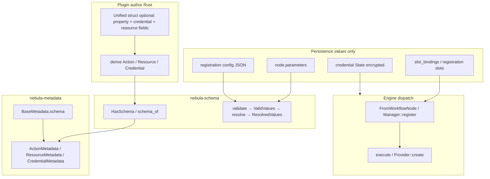
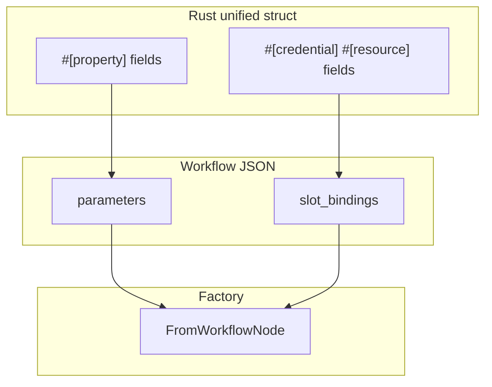
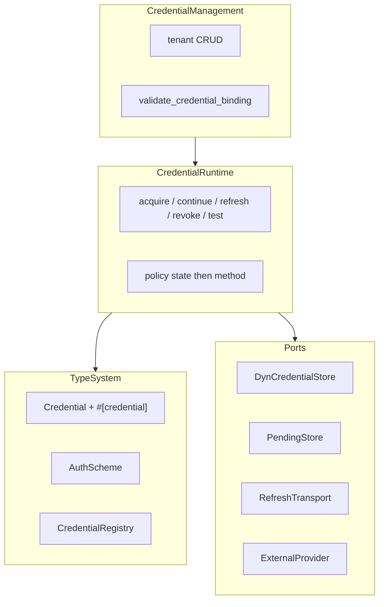
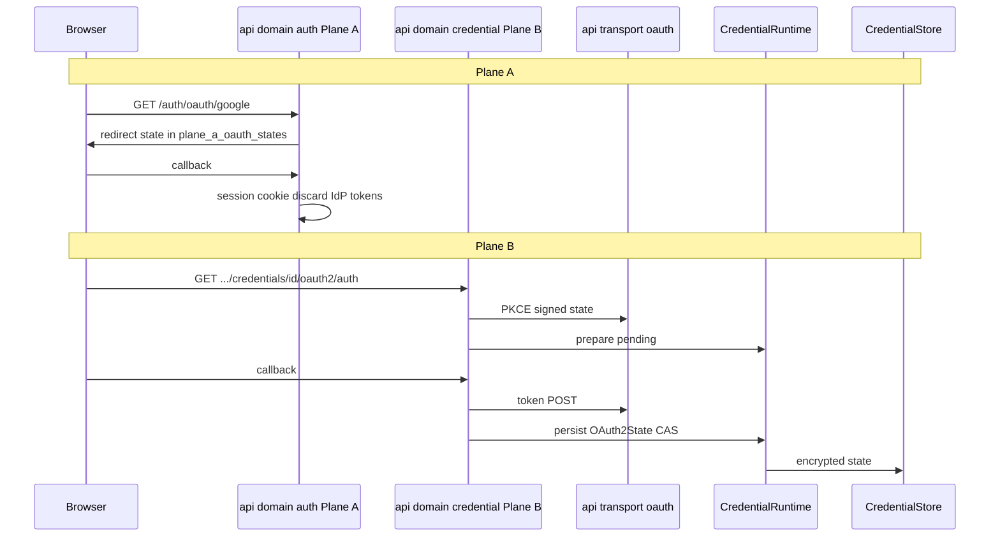

# nebula-credential — subsystem design (spec-first)

| Field | Value |
|-------|-------|
| **Status** | Accepted (2026-06-12) — implementation proceeds per §17 phasing |
| **Scope** | Primary: `nebula-credential` runtime/management rewrite (ADR-0092 completion). Cross-crate: `nebula-action`, `nebula-resource`, `nebula-schema`, `nebula-metadata`, `nebula-api`, `nebula-engine` contracts touched for one coherent picture. |
| **Supersedes** | Ad-hoc merge layout from #791; incomplete ADR-0088 migration steps 2–3–6–8 |
| **Related** | [ADR-0088](../../../docs/adr/0088-credential-subsystem-rewrite.md), [ADR-0092](../../../docs/adr/0092-credential-subsystem-consolidation.md), [ADR-0081](../../../docs/adr/0081-m6-resource-credential-integration.md), [ADR-0084](../../../docs/adr/0084-pre-expiry-credential-refresh-deferred.md), [ADR-0085](../../../docs/adr/0085-oauth-identity-providers-from-secrets.md), [ADR-0056](../../../docs/adr/0056-type-safe-dag.md), [INTEGRATION_MODEL](../../../docs/INTEGRATION_MODEL.md), [PRODUCT_CANON](../../../docs/PRODUCT_CANON.md) §3.5 / §15 |

---

## 1. Executive summary

Consolidation (ADR-0092) moved credential code into one crate but **did not finish** the logical rewrite from ADR-0088. Today there are parallel resolve/refresh paths, a monolithic OAuth2 credential type, and docs that still say “engine owns orchestration” while code lives in `nebula-credential`.

This design specifies:

1. **One runtime pipeline** (`CredentialRuntime`) for acquire, continue, refresh, revoke, and test.
2. **Management separated from runtime** — tenant CRUD vs execution-time resolve.
3. **OAuth Plane Law** — operator login (Plane A) vs workflow credential OAuth (Plane B); zero HTTP routes in the credential crate.
4. **Protocol + provider config** — not one Rust type per SaaS API.
5. **Shared integration authoring** across Action, Resource, and Credential: `#[property]` / `#[credential]` / `#[resource]`, with **schema from types** (`nebula-schema` + `nebula-metadata`) and **values-only persistence** in storage.
6. **Consumption unchanged at the edge** — `CredentialGuard<Scheme>`, slot bindings, `ResourceGuard`, engine accessor; refactor is **under** that surface.

**Approved 2026-06-12 (§20); implementation proceeds per §17 phasing — no folder-only refactors outside that plan.**

### Prior work consumed

- `docs/plans/2026-06-03-credential-facade-nongeneric.md` — **executed**: `CredentialService` is non-generic; collaborators are dyn-erased (`Arc<dyn DynCredentialStore>`, `ErasedPendingStore`).
- `f35e6e35` — `CredentialHandle` is a shared live cell (`Arc<Inner>` + `ArcSwap`: clones share the cell, a refresh is visible to every clone's next `snapshot()`); `HandleCache` + `materialize_handle` live in the resolver; `SchemeFactory` is wired for resource pools. Phase 1 must keep the hot-swap handle test green.

---

## 2. Purpose and non-goals

### In scope (1.0)

- Finish ADR-0088 migration in ADR-0092 topology (single crate).
- Reactive refresh only ([ADR-0084](../../../docs/adr/0084-pre-expiry-credential-refresh-deferred.md)).
- Plane B credential lifecycle ([ADR-0033](../../../docs/adr/HISTORICAL.md) mechanics; storage [ADR-0029](../../../docs/adr/HISTORICAL.md)).
- Resource ↔ credential binding ([ADR-0081](../../../docs/adr/0081-m6-resource-credential-integration.md)).
- Unified DX plan for Action / Resource / Credential macros (Phase 5 — after runtime green).

### Explicit non-goals

| Area | Out of scope |
|------|----------------|
| **Plane A** | Operator OAuth / Nebula session ([ADR-0085](../../../docs/adr/0085-oauth-identity-providers-from-secrets.md)) — `api/domain/auth` only |
| **Storage implementation** | Decorators, CAS, encryption layers stay in `nebula-storage` |
| **Resource fan-out** | Rotation fan-out, `on_credential_refresh` — `nebula-resource` + engine |
| **Proactive refresh scheduler** | 1.1 — not 1.0 |
| **Return to 4 credential crates** | ADR-0092 rejected that split |
| **Pure `Protocol` trait object** | ADR-0088 rejected — loses compile-time method presence (E0046) |
| **Per-row JSON Schema in DB** | Values only; schema from registry at catalog + dispatch |

---

## 3. ADR reconciliation

ADR chain is **evolutionary**, not contradictory. Code and canon drift when different stages are mixed.

### Orchestration ownership

| Stage | ADR | Resolve / refresh / lease | Management CRUD | OAuth HTTP |
|-------|-----|---------------------------|-----------------|------------|
| Historical | 0030 | Engine | credential trait | 0031 → API |
| M6 contract | 0081 | `nebula-credential-runtime` (Exec) | separate runtime crate | API ceremony |
| Rewrite draft | 0088 D7 (proposed) | Engine coordinator | merge into credential (**rejected**) | acquisition into credential |
| **Current target** | **0092** | **`nebula-credential` `runtime/` + `service/`** | same crate | `RefreshTransport` injected from API |

**Canon/README drift:** “engine owns orchestration” describes 0030/0088 D7, not 0092. Update after implementation.

### Three OAuth surfaces (do not merge)

| Surface | ADR | Location | Result |
|---------|-----|----------|--------|
| **Plane A** — sign in to Nebula | 0085 | `api/domain/auth`, `plane_a_oauth_states` | Session cookie; IdP tokens discarded |
| **Plane B HTTP** — token exchange | 0031 / 0088 | `api/transport/oauth` | SSRF-hardened reqwest; callback routes |
| **Plane B logic** — state, pending, PKCE | 0033 / 0088 | `nebula-credential` | `OAuth2State`, pending types, `RefreshTransport` |

### ADR-0088 migration checklist (post-0092)

| Step | Intent | Status |
|------|--------|--------|
| 1 | `nebula-crypto` extract | Done (#766) |
| 2 | Protocol + policy contract | **Partial** — `CredentialPolicy`, `#[credential]` exist; OAuth2 monolith; no shared protocol module |
| 3 | Collapse registries → one | **Partial** — `CredentialRegistry` + `DispatchOps` remain |
| 4 | Facade + scope dedup | **Partial** — facade in credential; dual tenant enforcement |
| 5 | Engine trim, rotation data down | Done relocation; engine shim remains |
| 6 | API thin; OAuth routing | **Open** — dual kickoff, split pending stores |
| 7 | Delete dead CredentialRow SQL | Verify |
| 8 | Delete sub-trait dispatch center | **Not done** |

---

## 4. Cross-crate integration model

Nebula integrations are **five concepts** with one structural contract ([INTEGRATION_MODEL](../../../docs/INTEGRATION_MODEL.md)):

| Concept | Crate | Metadata | Schema type | Values persistence |
|---------|-------|----------|-------------|-------------------|
| **Action** | `nebula-action` | `ActionMetadata` | `A::Input: HasSchema` | Workflow `node.parameters` |
| **Resource** | `nebula-resource` | `ResourceMetadata` | `R::Config: HasSchema` | Registration config JSON |
| **Credential** | `nebula-credential` | `CredentialMetadata` | `C::Properties: HasSchema` | Setup `FieldValues` → encrypted **State** |
| **Schema** | `nebula-schema` | — | `ValidSchema`, `Field`, proof-token pipeline | — |
| **Catalog prefix** | `nebula-metadata` | `BaseMetadata<K>` embeds `ValidSchema` | key, name, description, icon, tags | — |

**Slots (dependencies)** are orthogonal: `#[credential]` / `#[resource]` on Action or Resource types → workflow `slot_bindings` or registration slot bindings — **not** mixed into parameter schema.



---

## 5. Schema, metadata, API, and UI

### Rule: schema lives in types; DB stores values

| Stored in DB / workflow JSON | **Not** stored per row |
|------------------------------|------------------------|
| `parameters`: field name → `ParamValue` (literal or expression) | labels, types, `secret`, `validate`, JSON Schema |
| `slot_bindings`: slot_key → resource/credential id | slot scheme metadata |
| Resource registration config JSON | `ResourceConfig` schema |
| Credential encrypted State + create-time values | `Properties` schema |

Schema and catalog fields come from the **registered type** when the UI or engine needs them.

### Pipeline: `#[property]` → schema → metadata → API

1. Author marks fields with `#[property]` (alias for `nebula-schema` `#[field(...)]`) or separate `#[derive(Schema)]` companion struct.
2. `HasSchema::schema()` / `nebula_schema::schema_of::<T>()` builds `ValidSchema`.
3. `ActionMetadata::for_action`, `ResourceMetadata::for_resource`, `CredentialMetadata::for_credential` embed schema in `BaseMetadata`.
4. In-process registry → API catalog (`ActionRegistry`, resource catalog, `CredentialSchemaPort`).
5. API projects credential schema for wire (`project_public_schema` strips internal rules).
6. Client renders dynamic forms from catalog — **not** from workflow rows.

Symmetric constructors already in code:

- `CredentialMetadata::for_credential` → `schema_of::<C::Properties>()`
- `ActionMetadata::for_action` → `<A::Input as HasSchema>::schema()`
- `ResourceMetadata::for_resource` → `<R::Config as HasSchema>::schema()`

Unified macros (Phase 5) must **emit the same pipeline** — no ad-hoc `serde_json::json!` form schemas in plugins.

### Design time vs run time (one schema source)

| Phase | Consumer | Schema source | Values source |
|-------|----------|---------------|---------------|
| **Catalog / editor** | Client UI | Registry → `*Metadata.base.schema` | User saves into persistence |
| **Dispatch** | Engine → factory | Same `HasSchema` on type | DB values + expression eval |

When a plugin updates field metadata, the catalog reflects it without migrating stored JSON Schema snapshots. Old workflows may fail validation at dispatch if values no longer match — intentional.

### Action execution-time parameter pipeline

Documented in `crates/action/tests/schema_validator_expression_pipeline.rs`:

1. **Schema** — `schema_of::<A::Input>()` from registry (not DB).
2. **Validate** — `ValidSchema::validate(&FieldValues)` — literals + expression syntax + `#[validate]` rules.
3. **Expression** — resolve `{{ }}` against `ExpressionContext`.
4. **Deserialize** — typed `Input` (or unified `#[property]` fields on `self`).
5. **Slots** — `FromWorkflowNode`: `slot_bindings` → `credential_by_key` / `resource_by_key`.
6. **Execute** — `execute(&self, ctx)`; hot path uses `self.*` for slots.

**Credential:** catalog `CredentialTypeDescriptor.schema_json` + `CredentialSchemaPort::validate_data` on create; then `resolve` → encrypted State.

**Resource:** catalog schema + validate config at `Manager::register`; `create` reads `self` properties + bound `SlotCell`s.

### Gap (honest)

`validate_workflow` today is **structural** (graph, refs, retry). Cross-checking every `node.parameters` against live `ActionRegistry` schema at activation is **planned** (Phase 5 optional activation port). Per-step validate at dispatch is the typed path above.

**Credential properties:** no expression pipeline in credential setup — `serde_json::from_value::<Properties>` after validate ([`properties_pipeline`](../../tests/properties_pipeline.rs)).

---

## 6. Persistence: three value buckets + slots

Unified struct is **authoring sugar**. Storage stays split.

| Integration | `#[property]` bucket | Dependency bucket |
|-------------|---------------------|-------------------|
| **Action** | `NodeDefinition.parameters` | `node.slot_bindings` |
| **Resource** | registration config JSON | registration `slot_bindings` |
| **Credential** | setup form → `FieldValues` at create | no child credential slots (spec 23) |



**Reject:**

- Merging secrets into `parameters`.
- One merged `node.fields` map (breaking serde, no benefit).
- Removing `SlotCell` / `slot_bindings` (rotation epoch, fan-out).

Three meanings of “slot”:

1. **Declaration** — `slot_key` on `#[credential]` / `#[resource]` field.
2. **Persistence** — entry in `slot_bindings` map.
3. **Runtime** — `SlotCell`, resolved `CredentialGuard` / `ResourceGuard`.

---

## 7. Unified authoring (`#[property]` / `#[credential]` / `#[resource]`)

### Shared vocabulary (Phase 5)

| Attribute | Action | Resource | Credential |
|-----------|--------|----------|------------|
| `#[property]` / `#[field]` | `node.parameters` | registration config | setup form → State |
| `#[credential]` | `CredentialGuard` / Lazy | `SlotCell<Guard>` | forbidden on credential type |
| `#[resource]` | `ResourceGuard` | — | rare `#[uses_resource]` |
| Legacy | `input = FooInput` | separate `FooConfig` | separate `Properties` + T2/T3 |

### Action (target)

```rust
#[derive(Action)]
#[action(key = "send.message", unified, output = SendOutput)]
struct SendMessage {
    #[property(label = "Chat ID")]
    chat_id: String,
    #[resource(key = "slack")]
    slack: ResourceGuard<SlackClient>,
    #[credential(key = "fallback")]
    token: Lazy<CredentialGuard<SecretToken>>,
}

impl StatelessAction for SendMessage {
    async fn execute(&self, ctx: &impl ActionContext) -> Result<ActionResult<SendOutput>, ActionError> {
        self.slack.send(&self.chat_id, self.token.get().await?).await?;
        ...
    }
}
```

Macro emits: property-only `HasSchema`, `dependencies()` from slot fields, `FromWorkflowNode`, optional `type Input` for legacy.

### Resource (target)

```rust
#[derive(Resource)]
#[resource(key = "postgres", unified)]
struct Postgres {
    #[property(label = "Host")]
    host: String,
    #[credential(key = "db")]
    db: SlotCell<CredentialGuard<DbUserCred>>,
}

impl Provider for Postgres {
    async fn create(&self, ctx: &ResourceContext) -> Result<PgPool, Error> {
        let user = self.db_slot()?.expose();
        build_pool(self.host, user, ...).await?
    }
}
```

### Credential — three tiers (macro never required for registry)

| Tier | Shape | When |
|------|-------|------|
| **T1** | Unified derive + `#[property]` | Most builtins / plugins |
| **T2** | `#[credential]` on `impl` block (`api_key.rs` style) | Power users |
| **T3** | Manual `impl Credential` | Tests, maximum control (`bearer_token`, probes) |

**Policy:** macros are DX shortcuts; `CredentialRegistry::register` accepts any `Credential` impl.

### `self.*` vs `ctx.*`

| Model | Verdict |
|-------|---------|
| Metadata list `#[resources([...])]` on struct without fields | **Rejected** — loses types, Option/Lazy, `self.*` |
| Field slots `#[credential]` / `#[resource]` on struct | **Target** |

- **Factory / register** uses `ctx` once to resolve slots.
- **execute / create** uses `self.field` / `self.db_slot()` in hot path.
- **ctx** remains for ad-hoc helpers, `ResourceAction::configure`, dynamic keys from parameters.

---

## 8. Unified `ctx` API (Phase 4b)

Symmetric naming aligned with metadata **`key`**:

| Method | Key source |
|--------|------------|
| `ctx.resource::<R>()` / `ctx.credential::<C>()` | `R::key()` / `C::KEY` |
| `ctx.resource_by_key::<R>(key)` / `ctx.credential_by_key::<C>(key)` | runtime key (slot default or override) |
| `ctx.try_*` / `ctx.try_*_by_key` | `Option` semantics |

Deprecate: `acquire_resource_by_id`, `resolve_credential_by_id`, `credential_by_id`.

Single prelude import: `nebula_action::prelude::SlotContextExt` (or equivalent).

`Lazy<Guard>` on **declared fields** — not `Lazy` on `ctx` in 1.0.

---

## 9. Credential crate — target architecture

### Bounded contexts (one crate)



### Public surfaces after refactor

| Surface | Consumers | Role |
|---------|-----------|------|
| `nebula_credential::{Credential, AuthScheme, …}` | action, resource, plugin | Authoring |
| `CredentialRuntime` | engine, api (via service) | **Single** execution pipeline |
| `CredentialService` | api management routes | CRUD + delegate runtime |
| `rotation::*` | storage, api | Contract + orchestration unified tree |

The public `refresh` verb stays on `CredentialService` (it delegates to the
runtime). A warm-up / proactive scheduler would need an ADR-0084 amendment —
1.1, not this design.

### Data flow (canon §15.4–15.5)

```
Properties (setup form, HasSchema)
  → resolve / acquire / continue_acquire
  → State (encrypted at rest, CredentialState)
  → project()
  → Scheme (AuthScheme material)
  → CredentialGuard<Scheme> at slot
```

Action receives **Scheme**, never raw State.

### Capability and policy (ADR-0088 D2)

- **Shape** — `CredentialPolicy` / `RefreshStrategy` / `RevokeStrategy` (data).
- **Code** — `Refreshable`, `Interactive`, … (compile-time presence).
- **Routing** — runtime reads `policy(state)` **then** calls capability method if strategy allows (e.g. OAuth2 without `refresh_token` → `ReAcquire`, not blind `refresh()`).

Macro `#[credential]` derives policy from which methods exist; runtime must **not** ignore policy.

### Remove as public concepts

- Parallel `execute_resolve` / facade resolve / resolver refresh / `DispatchOps` consumer API → internal to one pipeline.
- `nebula_engine::credential::*` (except test `default_in_memory_coordinator`). The "shim" is precisely the `engine/src/credential/mod.rs` re-exports; the engine's `credential_accessor` closure bridge **stays**.
- Legacy `#[derive(Credential)]` if `#[credential]` attr covers all cases.

### OAuth2 target (not 1500-line type)

- Shared `OAuth2Protocol` (or category `RefreshPair` + `OAuth2State`).
- `OAuth2ProviderConfig` as registry **data** (`github`, `slack`, …).
- Kickoff logic types in credential; **HTTP only** via API transport + injected `RefreshTransport`.

### Rotation

Single tree: `rotation::{contract, orchestration}` — not duplicate `rotation/` modules.

### Tenant isolation

Single `owner_id` format via `Scope::credential_owner_id` (0088 D7 amend). Facade + `ScopeLayer` roles documented; no `org/workspace` vs `org:workspace` split.

### Concurrency & failure model

- **Persist-then-swap ordering.** A refresh writes the new state to the
  store via CAS **before** swapping the live scheme cell of cached handles
  (`CredentialHandle::replace`). On CAS conflict the winner's state is
  re-read and projected; the loser never swaps. If a process dies between
  CAS and swap, cached handles keep serving the stale-but-valid scheme until
  the next resolve re-materializes from the store — recovery is read-repair;
  no compensating write exists or is needed.
- **`refresh_via_l1_only` is removed** (Phase 1). Non-parseable string ids
  exist only in test fixtures; `resolve_with_refresh` parses the id up front
  and returns a typed error for non-parseable input. One coordinated path
  remains: L1 coalescer + L2 `RefreshClaimRepo` (ADR-0041).
- **Reclaim / sentinel invariants** (`runtime/refresh/{reclaim,sentinel}.rs`)
  are preserved by the pipeline merge: claims are heartbeat-owned, expired
  claims are reclaimed, and a provider-rejected refresh marks the row
  (`reauth_required`) instead of letting other replicas re-hit the IdP.
- **Phase 1 DoD includes the chaos test**
  ([ADR-0084](../../../docs/adr/0084-pre-expiry-credential-refresh-deferred.md)
  lineage): 3 replicas × 100 credentials — exactly one IdP refresh per
  credential, no token loss, `ReauthRequired` routing under
  `ProviderRejected`.

---

## 10. OAuth Plane Law



### Hard rules (agent checklist)

1. **`nebula-credential` never mounts HTTP routes.**
2. **Plane A** — only `api/domain/auth`, `plane_a_oauth_states`; never `OAuth2Credential` ceremony.
3. **Plane B ceremony** — only `api/transport/oauth` + `api/domain/credential/oauth.rs`; thin handlers.
4. **One PKCE/state kernel** — credential crypto or api transport; not duplicated in monolith credential.
5. **Credential crate owns** — `OAuth2State`, pending **types**, `continue_resolve` **logic**, `refresh` with transport.
6. **Remove dual kickoff** — deprecate `OAuth2Credential::initiate_authorization_code` as public; single workspace API kickoff.
7. **AGENTS.md** — “Adding OAuth? Which plane?”

### Pending-state handling (named Phase 3 deliverable)

Pending OAuth state is **secret-bearing** (PKCE verifier, CSRF secret,
provider refs):

- Encrypted at rest through the same `Cipher` port as credential `State`.
- Mandatory TTL; zeroize on consume **and** on expiry.
- **One pending store.** Today there are three (`PendingStateStore`,
  `AppState.oauth_pending_store`, `oauth_state_tokens`). Phase 3 DoD: one
  store; `oauth_pending_store` / `oauth_state_tokens` deleted; the signed
  state parameter carries only a lookup key and is validated against the
  stored row. Migration is expand-contract with a drain window for
  in-flight OAuth flows.

### Current pain (dual path)

| Issue | Location |
|-------|----------|
| Two Plane B kickoffs | `oauth2.rs` vs `api/domain/credential/oauth.rs` |
| Split pending stores | `PendingStateStore`, `oauth_pending_store`, `oauth_state_tokens` |
| HTTP “disabled” in credential but logic scattered | agents add wrong layer |

---

## 11. Plugin / protocol extensibility

**Code per protocol, config per provider** — not type per Slack/GitHub.

| Axis | Example |
|------|---------|
| Protocol (~10 families) | OAuth2 acquire/refresh, static secret, signed request |
| Provider config | GitHub auth URL, scopes |
| Catalog KEY | `github_oauth` — UI label + slot binding |
| AuthScheme output | `OAuth2Token`, `SecretToken`, custom |

### Protocol families (1.0 focus)

| Family | Category | Platform owns |
|--------|----------|---------------|
| API key / PAT / Basic | `StaticSecret` | encrypt, guard, slots |
| Bearer + expiry | `BearerWithExp` | reactive refresh if policy says so |
| HMAC / SigV4 | `SignedRequest` | scheme projection |
| OAuth2 | `RefreshPair` / interactive | Plane B HTTP, pending store, PKCE |
| Connection string | `ConnectionString` | often pairs with Resource |
| Key pair / cert | `KeyPair` / `Certificate` | secure storage, resource `create` |

### Plugin author does **not**

| Task | Owner |
|------|-------|
| Operator login | Plane A |
| Browser redirect / callback HTTP | API transport |
| Token exchange HTTP | `RefreshTransport` / ceremony client |
| Persist encrypted state | `CredentialService` + storage |
| Slot resolve at execution | engine + `CredentialRuntime` |

### Plugin author **may**

- New `AuthScheme` in plugin (slot scheme compatibility).
- `Interactive` + pending type for non-OAuth flows (device code, LDAP) — ceremony HTTP only if browser needed.

**Anti-pattern:** new `OAuth2Credential` per API or oauth callback in credential crate.

---

## 12. Consumption layer (Action / Resource)

### Three ways to get auth material

| API | Resolves | Use when |
|-----|----------|----------|
| Declared `#[credential]` / `#[resource]` on struct | slot binding → guard on `self` | **Default** |
| `ctx.credential_by_key::<C>(key)` | explicit key | factory, ad-hoc |
| `ctx.credential::<C>()` | `C::KEY` | type-key lookup, no node override |
| `ResourceGuard<R>` | pre-authorized instance | auth inside resource `create` |

### Multi-slot

- Action: multiple `#[credential]` / `#[resource]` — independent `slot_bindings`.
- Resource: multiple `SlotCell` — separate registration keys per resolved credential set.

### Preferred paths

1. **Resource carries auth** — `#[resource] pool: ResourceGuard<Postgres>`; Action uses pool only.
2. **Direct credential** — `#[credential] api: CredentialGuard<SecretToken>` for SDK one-shots.

Credential refactor **does not change** slot vocabulary — only unifies runtime behind accessor.

---

## 13. Resource auth beyond HTTP

OAuth HTTP ceremony is **one** protocol. DB, queue, SSH, mTLS use **driver auth** in `Provider::create`.

| Layer | Holds |
|-------|-------|
| `ResourceConfig` / `#[property]` | host, port, pool size — **no secrets** |
| `#[credential]` slot | `CredentialGuard<Scheme>` |
| `Provider::create` | wires config + guard → driver |

`AuthPattern` matrix (`ConnectionUri`, `IdentityPassword`, `KeyPair`, `RequestSigning`, …) in `nebula_core::auth` — see INTEGRATION_MODEL.

Rotation hooks (`on_credential_refresh`) are driver-specific (pool swap, reconnect SSH, reload mTLS) — same `SlotCell` epoch model.

**Anti-pattern:** forcing all resources through OAuth HTTP or `RefreshTransport`.

---

## 14. TypedDAG forward compatibility (ADR-0056)

Typed workflows compile to the same `WorkflowDefinition` IR.

| Layer | TypedDAG | YAML/UI today |
|-------|----------|---------------|
| Data edges | `Connect<A,B>` — Output → Input | connections + expressions |
| Infra slots | Phase 3 workflow generics | `slot_bindings` |
| Runtime | Same `FromWorkflowNode`, same factory | same |

Slots are **orthogonal** to `Connect<Output,Input>`. Unified struct + field slots survive TypedDAG: factory reads same `NodeDefinition`.

Do not merge slots into `Input` for Connect typing.

---

## 15. Industry reference: n8n (brief)

n8n stays sane via **TYPE (recipe) / INSTANCE (encrypted blob) / RUNTIME (CredentialsHelper)** — not via 400 neat folders.

| n8n | Nebula target |
|-----|---------------|
| `ICredentialType` | `Credential` + protocol + provider config |
| `properties` | `Properties: HasSchema` |
| `extends oAuth2Api` | `OAuth2ProviderConfig` data |
| `CredentialsHelper` | `CredentialRuntime` |
| `CredentialsService` CRUD | `CredentialManagement` |
| SSO vs `oauth2-credential` routes | Plane A vs Plane B (same lesson) |

Nebula merge debt = violating single runtime helper + incomplete protocol/config split.

---

## 16. Current vs target (gap summary)

| Symptom | Root cause | Target |
|---------|------------|--------|
| 4 resolve entry points | Incomplete 0088 step 3 | `CredentialRuntime` only |
| Dual refresh CAS paths | facade + resolver | single coordinator |
| Sub-trait dispatch ignores `policy` | D2 not wired | policy-first routing |
| `oauth2.rs` monolith | D1 not done | protocol + config |
| Facade 1400 LOC mixed CRUD/runtime | D4 partial | Management vs Runtime |
| Engine credential re-exports | 0092 incomplete | direct `nebula_credential` |
| Dual OAuth kickoff | step 6 open | OAuth Plane Law |
| Canon “engine orchestrates” | doc drift | update post-merge |

---

## 17. Phased rollout (after this doc is approved)

### Phase 1 — Single runtime pipeline

- `CredentialRuntime` merges resolve/continue/refresh/revoke/test.
- `DispatchOps` internal only; auto-wire on `register::<C>()`.
- Policy before `Refreshable::refresh`; `refresh_via_l1_only` deleted.

**DoD:** one call graph; OAuth2 ReAcquire vs RefreshToken routing tests;
ADR-0084 chaos test green; hot-swap handle test stays green.

**Phase 1.5 — M12.4 bind-population (immediately after Phase 1):** first
production consumer of `CredentialRuntime::resolve_for_slot` wires the
engine `register_and_bind` contract (`ValidatedCredentialBinding`,
tenant-fingerprint). DoD: e2e workflow with a resource slot bound to a live
credential through registry → bind → acquire → guard.

### Phase 2 — Management vs runtime

- Thin `CredentialService`; facade delegates.
- Unified `owner_id`; single validation path with API schema port.
- **owner_id data migration**: rewrite existing rows or dual-read with
  cutover; document why a separator collision is impossible.

**DoD:** facade < 400 LOC; facade makes **no direct store/resolver/ops
calls** in runtime verbs; tenant tests green; old-format fixture rows
resolve.

### Phase 3 — Protocol model + OAuth2

- `OAuth2Protocol` + provider registry data; shrink monolith.
- One pending store (§10 deliverable); one kickoff path.
- Plugin static credential registration test.

**DoD:** oauth2 core < 500 LOC; **one exchange/refresh path**; e2e OAuth
green; CSRF/PKCE negative tests preserved.

### Phase 4 — Cleanup

- Remove engine shim, unify rotation, deprecated shims.
- **4b:** `SlotContextExt` symmetric ctx API.

**DoD:** `task dev:check`; `rg nebula_engine::credential` empty outside the
test harness; **one rotation tree**; canon/README "engine orchestrates"
drift fixed.

### Phase 5 — Unified macros (DX, cross-crate)

- **5a** Action unified struct
- **5b** Resource unified struct
- **5c** Credential unified + T1/T2/T3 docs
- Optional: activation validator with action registry port (warning-lint in
  1.0 per §19.4)

**Interface freezes** (replaces "phases do not block each other"):

- Phase 1 freezes the `CredentialPolicy` / `RegisterOps` emission contract
  of `#[credential]` — Phase 5c unified derive must emit the identical
  contract.
- Phase 4b ships **before** 5a/5b so unified macros target the final ctx
  names (`*_by_key`).

---

## 18. Agent guardrails (`crates/credential/AGENTS.md` updates)

- **OAuth?** Plane A → `domain/auth`. Plane B → `transport/oauth` only.
- **New SaaS API?** Provider config, not new OAuth2 credential type.
- **Parameters?** `#[property]` → schema crate; values in DB only.
- **Slots?** Never in `parameters`; always `slot_bindings`.
- **Execute style?** `self.*` for declared slots; `ctx` for factory/ad-hoc.
- **HTTP in credential crate?** Never.

---

## 19. Resolved decisions (review 2026-06-12)

1. **PKCE kernel** → `nebula_credential::secrets::pkce` (pure crypto, zero
   HTTP). `nebula-api` re-exports it; Plane A callers in
   `api/transport/oauth/flow.rs` switch to the re-export — one kernel for
   both planes.
2. **OAuth2 KEY strategy** → **per-provider KEYS** (`github_oauth`,
   `slack_oauth`, …): pairs of (shared protocol code,
   `OAuth2ProviderConfig` data) registered per provider.
3. **Phase 5 mode** → explicit opt-in `unified` flag; no auto-detect from
   `#[property]` fields.
4. **Activation-time parameter schema check** → warning-lint behind the
   registry port in 1.0; blocking in 1.1. Typed dispatch-time validation
   remains the 1.0 gate.

---

## 20. Approval

| Reviewer | Date | Status |
|----------|------|--------|
| vanyastaff | 2026-06-12 | Accepted |

**After approval:** implement Phase 1; no folder-only refactors before pipeline design is coded.
