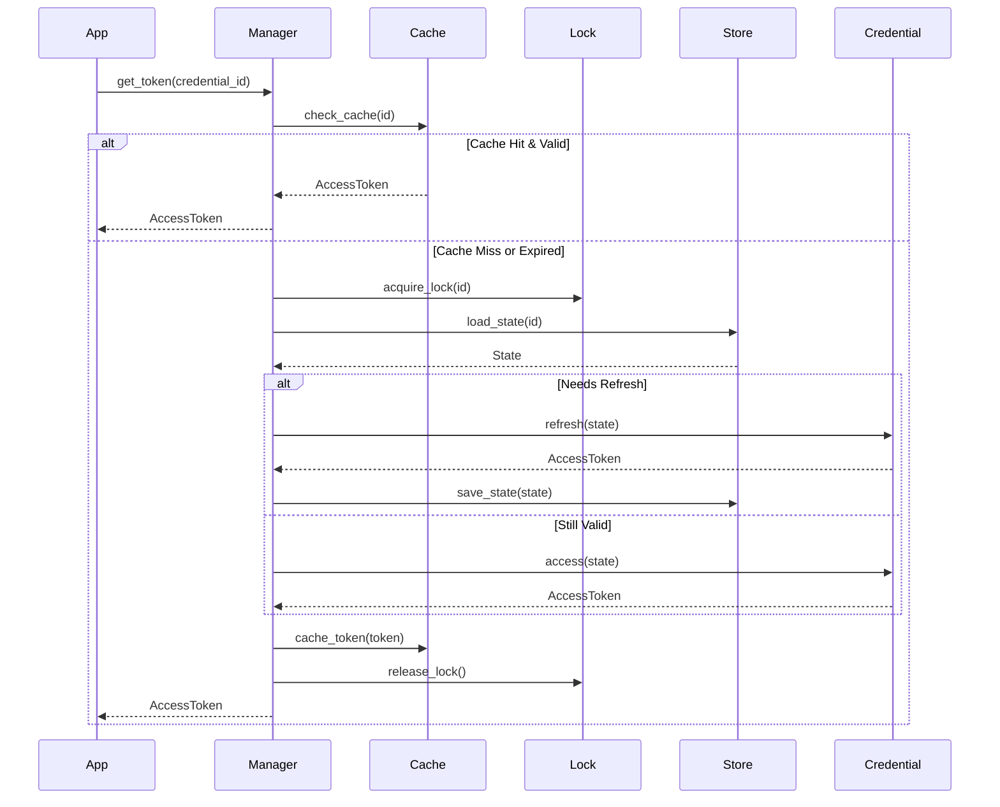
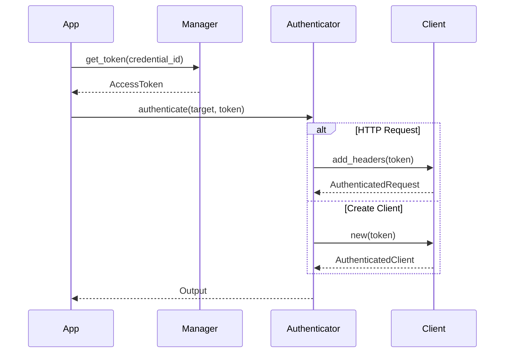

# Nebula Credential - Final Production Architecture

## 🏗️ System Architecture Overview

```
┌─────────────────────────────────────────────────────────────────┐
│                         Application Layer                        │
│  ┌──────────────┐  ┌──────────────┐  ┌──────────────┐         │
│  │   Actions    │  │   Services   │  │    Nodes     │         │
│  └──────┬───────┘  └──────┬───────┘  └──────┬───────┘         │
└─────────┼──────────────────┼──────────────────┼─────────────────┘
          │                  │                  │
          ▼                  ▼                  ▼
┌─────────────────────────────────────────────────────────────────┐
│                    Credential Manager API                        │
│  ┌────────────────────────────────────────────────────────┐    │
│  │  get_token(id) → AccessToken                           │    │
│  │  create_credential(type, input) → CredentialId         │    │
│  │  refresh_credential(id) → AccessToken                  │    │
│  │  authenticate_with(auth, token) → Client               │    │
│  └────────────────────────────────────────────────────────┘    │
└─────────────────────────────────────────────────────────────────┘
          │
          ▼
┌─────────────────────────────────────────────────────────────────┐
│                     Core Components                              │
│                                                                  │
│  ┌──────────────┐  ┌──────────────┐  ┌──────────────┐         │
│  │   Manager    │  │    Traits    │  │Authenticator │         │
│  │              │  │              │  │              │         │
│  │ • Get Token  │  │ • Credential │  │ • Target     │         │
│  │ • Refresh    │  │ • StateStore │  │ • Output     │         │
│  │ • Cache      │  │ • TokenCache │  │ • Chain      │         │
│  │ • Lock       │  │ • Lock       │  │              │         │
│  └──────────────┘  └──────────────┘  └──────────────┘         │
└─────────────────────────────────────────────────────────────────┘
          │
          ▼
┌─────────────────────────────────────────────────────────────────┐
│                    Node-Specific Implementations                 │
│                                                                  │
│  ┌────────────┐  ┌────────────┐  ┌────────────┐  ┌──────────┐ │
│  │  Telegram  │  │   OpenAI   │  │    AWS     │  │  GitHub  │ │
│  │            │  │            │  │            │  │          │ │
│  │ • TgCred   │  │ • OAICred  │  │ • AwsCred  │  │ • GhCred │ │
│  │ • TgAuth   │  │ • OAIAuth  │  │ • SigV4    │  │ • GhAuth │ │
│  └────────────┘  └────────────┘  └────────────┘  └──────────┘ │
└─────────────────────────────────────────────────────────────────┘
          │
          ▼
┌─────────────────────────────────────────────────────────────────┐
│                    Storage & Infrastructure                      │
│                                                                  │
│  ┌────────────┐  ┌────────────┐  ┌────────────┐  ┌──────────┐ │
│  │   Redis    │  │  Postgres  │  │  DynamoDB  │  │   KMS    │ │
│  │            │  │            │  │            │  │          │ │
│  │ • Cache    │  │ • States   │  │ • States   │  │ • Crypto │ │
│  │ • Locks    │  │ • Audit    │  │ • Audit    │  │ • Keys   │ │
│  └────────────┘  └────────────┘  └────────────┘  └──────────┘ │
└─────────────────────────────────────────────────────────────────┘
```

## 📦 Crate Structure

```
nebula/
├── nebula-credential/                  # Core crate - minimal dependencies
│   ├── Cargo.toml
│   ├── README.md
│   └── src/
│       ├── lib.rs                     # Public API
│       │
│       ├── core/                      # Core types
│       │   ├── mod.rs
│       │   ├── token.rs               # AccessToken
│       │   ├── secure.rs              # SecureString
│       │   ├── error.rs               # CredentialError
│       │   ├── state.rs               # CredentialState trait
│       │   ├── context.rs             # CredentialContext
│       │   ├── metadata.rs            # CredentialMetadata
│       │   └── ephemeral.rs           # Ephemeral<T> wrapper
│       │
│       ├── traits/                    # Core traits
│       │   ├── mod.rs
│       │   ├── credential.rs          # Credential trait
│       │   ├── storage.rs             # StateStore trait
│       │   ├── cache.rs               # TokenCache trait
│       │   └── lock.rs                # DistributedLock trait
│       │
│       ├── authenticator/             # Authentication pattern
│       │   ├── mod.rs
│       │   ├── trait.rs               # ClientAuthenticator trait
│       │   ├── chain.rs               # ChainAuthenticator
│       │   └── common.rs              # HttpBearer, ApiKeyHeader
│       │
│       └── manager/                   # Credential management
│           ├── mod.rs
│           ├── manager.rs             # CredentialManager
│           ├── builder.rs             # ManagerBuilder
│           ├── policy.rs              # RefreshPolicy
│           └── registry.rs            # Type registry
│
├── nebula-storage-redis/              # Redis storage implementation
│   ├── Cargo.toml
│   └── src/
│       ├── lib.rs
│       ├── state_store.rs            # Redis StateStore impl
│       ├── token_cache.rs            # Redis TokenCache impl
│       └── distributed_lock.rs       # Redis Lock impl
│
├── nebula-storage-postgres/           # PostgreSQL storage
│   ├── Cargo.toml
│   └── src/
│       ├── lib.rs
│       ├── state_store.rs            # Postgres StateStore impl
│       └── migrations/                # SQL migrations
│
├── nebula-oauth2/                     # Shared OAuth2 utilities (optional)
│   ├── Cargo.toml
│   └── src/
│       ├── lib.rs
│       ├── client.rs                 # OAuth2Client
│       ├── provider.rs               # Provider trait
│       ├── flows/                    # Auth flows
│       │   ├── authorization_code.rs
│       │   ├── client_credentials.rs
│       │   └── device_code.rs
│       └── oidc.rs                   # OpenID Connect
│
├── nebula-node-telegram/              # Telegram node
│   ├── Cargo.toml
│   └── src/
│       ├── credential/                # Telegram credentials
│       │   ├── mod.rs
│       │   ├── bot.rs                # TelegramBotCredential
│       │   ├── state.rs              # TelegramBotState
│       │   └── authenticator.rs      # TeloxideBotAuthenticator
│       ├── actions/
│       └── lib.rs
│
├── nebula-node-openai/                # OpenAI node
│   ├── Cargo.toml
│   └── src/
│       ├── credential/                # OpenAI credentials
│       │   ├── mod.rs
│       │   ├── api_key.rs            # OpenAICredential
│       │   ├── state.rs              # OpenAIState
│       │   └── authenticator.rs      # OpenAIAuthenticator
│       ├── actions/
│       └── lib.rs
│
├── nebula-node-github/                # GitHub node
│   ├── Cargo.toml
│   └── src/
│       ├── credential/                # GitHub credentials
│       │   ├── mod.rs
│       │   ├── oauth.rs              # GitHubOAuthCredential
│       │   ├── pat.rs                # PersonalAccessToken
│       │   └── authenticator.rs      # GitHubAuthenticator
│       └── lib.rs
│
└── nebula-node-aws/                   # AWS node
    ├── Cargo.toml
    └── src/
        ├── credential/                # AWS credentials
        │   ├── mod.rs
        │   ├── access_key.rs         # AwsAccessKeyCredential
        │   ├── sts.rs                # STS AssumeRole
        │   ├── state.rs              # AwsState
        │   └── authenticator.rs      # AwsSigV4Authenticator
        └── lib.rs
```

## 🔑 Core Concepts

### 1. Credential Trait (Core)

```rust
// nebula-credential/src/traits/credential.rs
#[async_trait]
pub trait Credential: Send + Sync + 'static {
    type Input: Serialize + DeserializeOwned + Send + Sync;
    type State: CredentialState;
    
    fn metadata(&self) -> CredentialMetadata;
    
    async fn initialize(
        &self,
        input: &Self::Input,
        ctx: &mut CredentialContext,
    ) -> Result<(Self::State, Option<AccessToken>), CredentialError>;
    
    async fn refresh(
        &self,
        state: &mut Self::State,
        ctx: &mut CredentialContext,
    ) -> Result<AccessToken, CredentialError> {
        Err(CredentialError::RefreshNotSupported)
    }
}
```

### 2. ClientAuthenticator Trait (Core)

```rust
// nebula-credential/src/authenticator/trait.rs
#[async_trait]
pub trait ClientAuthenticator: Send + Sync {
    type Target;
    type Output;
    
    async fn authenticate(
        &self,
        target: Self::Target,
        token: &AccessToken,
    ) -> Result<Self::Output, CredentialError>;
}
```

### 3. Node-Specific Implementation

```rust
// nebula-node-telegram/src/credential/bot.rs
pub struct TelegramBotCredential;

impl Credential for TelegramBotCredential {
    type Input = TelegramBotInput;
    type State = TelegramBotState;
    // ... implementation
}

// nebula-node-telegram/src/credential/authenticator.rs
pub struct TeloxideBotAuthenticator;

impl ClientAuthenticator for TeloxideBotAuthenticator {
    type Target = ();
    type Output = teloxide::Bot;
    // ... implementation
}
```

## 🛡️ Security Architecture

```
┌──────────────────────────────────────────┐
│          Security Layers                  │
│                                           │
│  1. Memory Security                      │
│     • SecureString with zeroization      │
│     • Ephemeral<T> for temp data         │
│                                           │
│  2. Storage Security                     │
│     • Encryption at rest (KMS)           │
│     • CAS for atomic updates             │
│                                           │
│  3. Runtime Security                     │
│     • Distributed locks                  │
│     • Token refresh with jitter          │
│     • Negative cache for errors          │
│                                           │
│  4. Audit & Compliance                   │
│     • All operations logged              │
│     • Tamper-evident audit trail         │
└──────────────────────────────────────────┘
```

## 📊 Data Flow

### Token Retrieval Flow



### Authentication Flow



## 🔌 Integration Patterns

### 1. Action Integration

```rust
#[derive(Action)]
#[credential(telegram_bot)]
pub struct SendTelegramMessage;

impl ProcessAction for SendTelegramMessage {
    async fn execute(&self, ctx: &Context) -> Result<Output> {
        // Token automatically injected
        let token = ctx.credential_token("telegram_bot").await?;
        let bot = ().authenticate_with(&TeloxideBotAuthenticator, &token).await?;
        // Use bot...
    }
}
```

### 2. Service Integration

```rust
pub struct TelegramService {
    manager: Arc<CredentialManager>,
    credential_id: String,
}

impl TelegramService {
    pub async fn get_bot(&self) -> Result<Bot> {
        let token = self.manager.get_token(&self.credential_id).await?;
        ().authenticate_with(&TeloxideBotAuthenticator, &token).await
    }
}
```

### 3. Multi-Credential Composition

```rust
pub struct MultiServiceAction {
    telegram: TeloxideBotAuthenticator,
    openai: OpenAIAuthenticator,
    github: GitHubAuthenticator,
}

impl MultiServiceAction {
    pub async fn execute(&self, manager: &CredentialManager) -> Result<()> {
        // Get all tokens
        let tg_token = manager.get_token("telegram").await?;
        let ai_token = manager.get_token("openai").await?;
        let gh_token = manager.get_token("github").await?;
        
        // Create authenticated clients
        let bot = ().authenticate_with(&self.telegram, &tg_token).await?;
        let ai = ().authenticate_with(&self.openai, &ai_token).await?;
        let gh = ().authenticate_with(&self.github, &gh_token).await?;
        
        // Use all three...
        Ok(())
    }
}
```

## 🧪 Testing Strategy

### Unit Tests (Per Node)

```rust
// nebula-node-telegram/src/credential/tests.rs
#[cfg(test)]
mod tests {
    #[test]
    fn test_telegram_credential_initialization() {
        // Test credential creation
    }
    
    #[test]
    fn test_telegram_authenticator() {
        // Test bot creation
    }
}
```

### Integration Tests

```rust
// tests/integration/telegram.rs
#[tokio::test]
async fn test_telegram_full_flow() {
    let storage = MemoryStateStore::new();
    let manager = CredentialManager::builder()
        .with_storage(storage)
        .build();
    
    manager.register_credential(TelegramBotCredential);
    
    let id = manager.create_credential(
        "telegram_bot",
        TelegramBotInput { bot_token: "test".into() },
    ).await.unwrap();
    
    let token = manager.get_token(&id).await.unwrap();
    let bot = ().authenticate_with(&TeloxideBotAuthenticator, &token).await.unwrap();
}
```

## 📈 Performance Optimizations

```
┌─────────────────────────────────────────┐
│         Performance Features             │
│                                          │
│  • L1/L2 Token Cache                    │
│    - Memory: 10s TTL                    │
│    - Redis: 5min TTL                    │
│                                          │
│  • Refresh Strategy                     │
│    - 80% TTL threshold                  │
│    - Jitter: 0-5s                       │
│    - Exponential backoff                │
│                                          │
│  • Distributed Lock                     │
│    - Auto-renewal                       │
│    - Lost lock detection                │
│                                          │
│  • Negative Cache                       │
│    - Error cool-off: 60s                │
│    - Retry-After respect                │
└─────────────────────────────────────────┘
```

## 💡 Key Design Principles

1. **Core Minimalism** - Core crate has zero service-specific knowledge
2. **Node Ownership** - Each node owns its credential implementation
3. **Type Safety** - Compile-time verification everywhere
4. **Security First** - Every secret is protected, every operation is audited
5. **Composability** - Authenticators can be chained and composed
6. **Testability** - Every component is independently testable
7. **Performance** - Smart caching, refresh, and locking strategies
8. **Extensibility** - Easy to add new credential types and authenticators

## 🚀 Usage Example

```rust
// Application setup
#[tokio::main]
async fn main() -> Result<(), Box<dyn std::error::Error>> {
    // Initialize storage
    let redis = RedisStateStore::new("redis://localhost").await?;
    let cache = RedisTokenCache::new("redis://localhost").await?;
    let lock = RedisDistributedLock::new("redis://localhost").await?;
    
    // Create manager
    let mut manager = CredentialManager::builder()
        .with_storage(Arc::new(redis))
        .with_cache(Arc::new(cache))
        .with_lock(Arc::new(lock))
        .with_policy(RefreshPolicy::default())
        .build()?;
    
    // Register credentials from nodes
    manager.register_credential(TelegramBotCredential);
    manager.register_credential(OpenAICredential);
    manager.register_credential(GitHubOAuthCredential);
    
    // Create credentials
    let telegram_id = manager.create_credential(
        "telegram_bot",
        TelegramBotInput {
            bot_token: env::var("TELEGRAM_BOT_TOKEN")?,
            webhook_secret: None,
        },
    ).await?;
    
    // Use in your application
    let token = manager.get_token(&telegram_id).await?;
    let bot = ().authenticate_with(&TeloxideBotAuthenticator, &token).await?;
    
    // Start your application...
    Ok(())
}
```

This architecture provides a **production-ready**, **secure**, and **extensible** credential management system with clear separation of concerns and maximum flexibility for node-specific implementations.