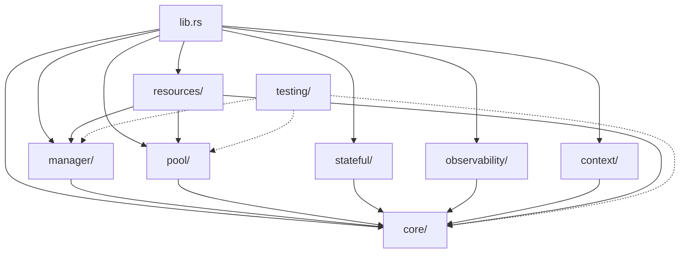

# nebula-resource Project Structure

> Detailed breakdown of the crate's directory structure, modules, and organization

**Last Updated**: 2025-10-01
**Version**: 0.2.0
**Total Files**: 26 Rust source files
**Lines of Code**: ~8,062 lines

---

## Table of Contents

- [Directory Tree](#directory-tree)
- [Module Organization](#module-organization)
- [Core Modules](#core-modules)
- [Feature Modules](#feature-modules)
- [Resource Implementations](#resource-implementations)
- [Testing & Examples](#testing--examples)
- [Documentation](#documentation)
- [Dependencies](#dependencies)

---

## Directory Tree

```
crates/nebula-resource/
├── Cargo.toml                          # Package manifest
├── README.md                           # User-facing documentation
├── ARCHITECTURE_ANALYSIS.md            # Technical analysis
├── ROADMAP.md                          # Implementation roadmap
├── TASKS.md                            # Granular task list
├── VISION.md                           # Project vision
├── STRUCTURE.md                        # This file
│
├── src/
│   ├── lib.rs                          # Crate root & public API
│   │
│   ├── core/                           # Core abstractions (1,200 LOC)
│   │   ├── mod.rs                      # Module exports
│   │   ├── context.rs                  # ResourceContext (180 LOC)
│   │   ├── error.rs                    # Error types (390 LOC)
│   │   ├── lifecycle.rs                # Lifecycle states (220 LOC)
│   │   ├── resource.rs                 # Resource trait & types (410 LOC)
│   │   ├── scoping.rs                  # Scoping system (150 LOC)
│   │   └── traits/                     # Additional traits
│   │       ├── mod.rs                  # Trait exports
│   │       ├── cloneable.rs            # CloneableResource trait
│   │       ├── instance.rs             # ResourceInstance trait (stub)
│   │       └── resource.rs             # Extended resource traits
│   │
│   ├── manager/                        # Resource manager (450 LOC)
│   │   └── mod.rs                      # ResourceManager implementation
│   │
│   ├── pool/                           # Pooling system (580 LOC)
│   │   └── mod.rs                      # Pool implementation
│   │
│   ├── stateful/                       # Stateful resources (320 LOC)
│   │   └── mod.rs                      # State management
│   │
│   ├── observability/                  # Metrics & monitoring (620 LOC)
│   │   └── mod.rs                      # Observability implementation
│   │
│   ├── context/                        # Context propagation (420 LOC)
│   │   ├── mod.rs                      # Module root
│   │   ├── propagation.rs              # Context propagation
│   │   └── tracing.rs                  # Tracing integration
│   │
│   ├── resources/                      # Built-in resources (890 LOC)
│   │   ├── mod.rs                      # Resource exports
│   │   ├── database.rs                 # Database resources (180 LOC)
│   │   ├── cache.rs                    # Cache resources (120 LOC)
│   │   ├── http_client.rs              # HTTP client (280 LOC)
│   │   ├── message_queue.rs            # Message queues (90 LOC)
│   │   ├── storage.rs                  # Storage resources (95 LOC)
│   │   └── observability.rs            # Observability resources (325 LOC)
│   │
│   ├── credentials/                    # Credential integration (PLANNED)
│   │   └── (not yet implemented)
│   │
│   └── testing/                        # Testing utilities (620 LOC)
│       └── mod.rs                      # Test helpers & mocks
│
├── examples/                           # Usage examples (PLANNED)
│   └── (not yet implemented)
│
├── tests/                              # Integration tests (PLANNED)
│   └── (not yet implemented)
│
├── benches/                            # Benchmarks (PLANNED)
│   └── (not yet implemented)
│
└── docs/                               # Documentation (30 files)
    ├── README.md                       # Documentation index
    ├── Architecture.md                 # Architecture guide
    ├── Installation.md                 # Installation guide
    ├── QuickStart.md                   # Quick start guide
    ├── BasicConcepts.md                # Fundamental concepts
    │
    ├── API.md                          # API reference
    ├── Configuration.md                # Configuration guide
    ├── Errors.md                       # Error handling
    ├── Events.md                       # Event system
    ├── Hooks.md                        # Hook system
    ├── Traits.md                       # Trait documentation
    ├── Types.md                        # Type reference
    │
    ├── CreateResource.md               # Creating resources
    ├── FirstResource.md                # Tutorial
    ├── ContextAwareResource.md         # Context usage
    ├── PooledResource.md               # Pooling guide
    ├── StatefulResource.md             # State management
    │
    ├── ResourceLifecycle.md            # Lifecycle guide
    ├── ResourceScoping.md              # Scoping system
    ├── State Management.md             # State patterns
    ├── HealthChecks.md                 # Health checking
    ├── QuarantineRecovery.md           # Recovery patterns
    │
    ├── CoreResources.md                # Built-in resources
    ├── Databases.md                    # Database resources
    ├── HTTPClients.md                  # HTTP resources
    ├── MessageQueues.md                # Queue resources
    ├── CloudStorage.md                 # Storage resources
    ├── Observability.md                # Observability
    │
    ├── CredentialIntegration.md        # Credentials
    ├── DependencyGraph.md              # Dependencies
    └── VersioningMigration.md          # Versioning
```

---

## Module Organization

### Crate Structure

The crate follows a **layered architecture** with clear separation of concerns:

```
┌─────────────────────────────────────────────┐
│            Public API (lib.rs)              │
│        Prelude, Re-exports, Traits          │
├─────────────────────────────────────────────┤
│                                             │
│  ┌──────────┐  ┌──────────┐  ┌──────────┐ │
│  │  Manager │  │   Pool   │  │ Stateful │ │
│  │          │  │          │  │          │ │
│  └────┬─────┘  └────┬─────┘  └────┬─────┘ │
│       │             │              │        │
│  ┌────┴─────────────┴──────────────┴─────┐ │
│  │           Core Abstractions            │ │
│  │  (Traits, Types, Lifecycle, Scoping)   │ │
│  └────────────────────────────────────────┘ │
│                                             │
├─────────────────────────────────────────────┤
│         Cross-Cutting Concerns              │
│  ┌─────────────┐  ┌─────────────────────┐  │
│  │Observability│  │ Context Propagation │  │
│  └─────────────┘  └─────────────────────┘  │
├─────────────────────────────────────────────┤
│          Resource Implementations           │
│  Database, Cache, HTTP, Queue, Storage      │
└─────────────────────────────────────────────┘
```

### Module Dependency Graph



---

## Core Modules

### 1. `core/` - Core Abstractions

**Purpose**: Fundamental types, traits, and contracts

**Files** (7 files, ~1,200 LOC):
- `mod.rs` - Module exports and prelude
- `context.rs` - Resource context and metadata
- `error.rs` - Error types and Result aliases
- `lifecycle.rs` - Lifecycle states and transitions
- `resource.rs` - Core Resource trait and types
- `scoping.rs` - Scoping system (Global, Tenant, Workflow, Action)
- `traits/` - Additional trait definitions

**Key Types**:
```rust
// Core trait
pub trait Resource: Send + Sync + 'static {
    type Config: ResourceConfig;
    type Instance: Send + Sync;

    async fn create(
        &self,
        config: &Self::Config,
        context: &ResourceContext,
    ) -> ResourceResult<Self::Instance>;
}

// Context for resource operations
pub struct ResourceContext {
    pub scope: ResourceScope,
    pub metadata: HashMap<String, String>,
    pub trace_id: Option<String>,
    pub tenant_id: Option<String>,
    // ...
}

// Lifecycle states
pub enum LifecycleState {
    Created, Initializing, Ready, InUse,
    Idle, Maintenance, Draining, Cleanup,
    Terminated, Failed,
}

// Scoping levels
pub enum ResourceScope {
    Global,
    Tenant { tenant_id: String },
    Workflow { workflow_id: String },
    Action { action_id: String },
}
```

**Status**: ✅ 90% Complete (well-designed, mostly implemented)

---

### 2. `manager/` - Resource Manager

**Purpose**: Central resource lifecycle and registry management

**Files** (1 file, ~450 LOC):
- `mod.rs` - ResourceManager and ResourceManagerBuilder

**Key Types**:
```rust
pub struct ResourceManager {
    registry: Arc<RwLock<HashMap<ResourceId, Arc<dyn ResourceFactory>>>>,
    metadata_cache: Arc<DashMap<ResourceId, ResourceMetadata>>,
    // Pool integration (incomplete)
    // Dependency graph (incomplete)
}

pub struct ResourceManagerBuilder {
    // Builder pattern for configuration
}
```

**Key Methods**:
- `register<R: Resource>()` - Register resource type
- `acquire<T>()` - Acquire resource instance
- `release()` - Release resource back to pool
- `health_check()` - Check resource health
- `shutdown()` - Graceful shutdown

**Status**: ⚠️ 50% Complete (basic registry works, pool integration missing)

**Critical Gaps**:
- Pool integration incomplete
- Dependency resolution stubbed (`todo!()`)
- No automatic health checking
- No background cleanup

---

### 3. `pool/` - Resource Pooling

**Purpose**: Efficient resource pooling and lifecycle management

**Files** (1 file, ~580 LOC):
- `mod.rs` - Pool implementations

**Key Types**:
```rust
pub struct ResourcePool<T> {
    available: Arc<Mutex<VecDeque<Arc<T>>>>,
    acquired: Arc<Mutex<HashMap<Uuid, PoolEntry<T>>>>,
    config: PoolConfig,
    stats: Arc<RwLock<PoolStats>>,
}

pub struct PoolConfig {
    pub min_size: usize,
    pub max_size: usize,
    pub acquire_timeout: Duration,
    pub idle_timeout: Duration,
    pub health_check_interval: Duration,
}

pub struct PooledResource<T> {
    instance_id: Uuid,
    acquired: Arc<Mutex<HashMap<Uuid, PoolEntry<T>>>>,
    stats: Arc<RwLock<PoolStats>>,
}
```

**Status**: ⚠️ 70% Complete (basic pooling works, advanced features missing)

**What Works**:
- Basic acquire/release
- Size limits
- Statistics tracking

**Missing**:
- Automatic health checking
- Idle timeout cleanup
- Connection warming
- Pool resizing

---

### 4. `stateful/` - State Management

**Purpose**: Stateful resource management with versioning

**Files** (1 file, ~320 LOC):
- `mod.rs` - State management implementation

**Key Types**:
```rust
pub struct StatefulResource<S> {
    state: Arc<RwLock<S>>,
    version: Arc<AtomicU64>,
    history: Option<StateHistory<S>>,
    persistence: Option<Box<dyn StatePersistence<S>>>,
}

pub trait State: Clone + Send + Sync + 'static {
    fn validate(&self) -> Result<(), ValidationError>;
}

pub trait StatePersistence<S: State>: Send + Sync {
    async fn save(&self, state: &S, version: u64) -> Result<()>;
    async fn load(&self, version: u64) -> Result<S>;
}
```

**Status**: ✅ 80% Complete (mostly implemented)

**What Works**:
- State versioning
- Snapshot/restore
- Optional persistence

**Missing**:
- Migration between versions
- Event sourcing

---

### 5. `observability/` - Metrics & Monitoring

**Purpose**: Metrics collection, logging, and tracing

**Files** (1 file, ~620 LOC):
- `mod.rs` - Observability implementation

**Key Types**:
```rust
pub struct ObservabilityManager {
    metrics: Arc<DashMap<String, MetricValue>>,
    resource_metrics: Arc<RwLock<HashMap<ResourceId, ResourceMetrics>>>,
    event_log: Arc<Mutex<VecDeque<ResourceEvent>>>,
}

pub struct ResourceMetrics {
    pub acquisitions: u64,
    pub releases: u64,
    pub errors: u64,
    pub active_count: u64,
    pub avg_acquisition_time: Duration,
}

pub struct ResourceEvent {
    pub timestamp: DateTime<Utc>,
    pub resource_id: ResourceId,
    pub event_type: EventType,
    pub metadata: HashMap<String, String>,
}
```

**Status**: ✅ 75% Complete (framework done, export missing)

**What Works**:
- Metric collection
- Event logging
- Basic statistics

**Missing**:
- Prometheus export
- OpenTelemetry integration
- Alerting

---

### 6. `context/` - Context Propagation

**Purpose**: Context propagation for tracing and multi-tenancy

**Files** (3 files, ~420 LOC):
- `mod.rs` - Module root
- `propagation.rs` - Context propagation logic
- `tracing.rs` - Distributed tracing integration

**Status**: ✅ 85% Complete

---

## Feature Modules

### 7. `resources/` - Built-in Resources

**Purpose**: Ready-to-use resource implementations

**Files** (6 files, ~890 LOC):

#### `database.rs` (~180 LOC)
```rust
pub struct PostgreSqlResource;
pub struct MySqlResource;
pub struct MongoDbResource;

// Currently: Empty struct definitions with mock implementations
// Needed: Actual sqlx/diesel integration
```
**Status**: ⚠️ 10% Complete (structures defined, no real implementation)

#### `cache.rs` (~120 LOC)
```rust
pub struct RedisResource;
pub struct MemcachedResource;
pub struct InMemoryCacheResource;

// Currently: Stub implementations
// Needed: Redis client integration, eviction policies
```
**Status**: ⚠️ 15% Complete

#### `http_client.rs` (~280 LOC)
```rust
pub struct HttpClientResource;

pub struct HttpClientConfig {
    pub base_url: String,
    pub timeout: Duration,
    pub retry_config: RetryConfig,
    pub circuit_breaker_config: CircuitBreakerConfig,
}

// Currently: Good structure, partial implementation
// Needed: reqwest integration, resilience patterns
```
**Status**: ⚠️ 40% Complete (best of the built-in resources)

#### `message_queue.rs` (~90 LOC)
```rust
pub struct KafkaResource;
pub struct RabbitMqResource;
pub struct SqsResource;

// Currently: Empty stubs
// Needed: Full implementations
```
**Status**: ⚠️ 5% Complete

#### `storage.rs` (~95 LOC)
```rust
pub struct S3Resource;
pub struct GcsResource;
pub struct AzureBlobResource;

// Currently: Basic structure
// Needed: AWS SDK integration
```
**Status**: ⚠️ 20% Complete

#### `observability.rs` (~325 LOC)
```rust
pub struct LoggerResource;
pub struct MetricsResource;
pub struct TracingResource;

// Currently: Best implemented, uses nebula-log
// Needed: More integrations
```
**Status**: ✅ 60% Complete (most complete resource)

---

### 8. `testing/` - Testing Utilities

**Purpose**: Mock resources and test helpers

**Files** (1 file, ~620 LOC):
- `mod.rs` - Test infrastructure

**Key Types**:
```rust
pub struct TestResourceManager {
    // Mock manager for testing
}

pub struct MockResource<T> {
    // Mock resource implementation
}
```

**Status**: ⚠️ 65% Complete

**Critical Issue**: Contains unsafe code (`std::mem::zeroed()`) that needs fixing

---

### 9. `credentials/` - Credential Integration

**Purpose**: Integration with nebula-credential for secure credential management

**Status**: ❌ 0% Complete (feature flag exists, no implementation)

**Planned**:
```rust
pub trait CredentialProvider {
    async fn get_credential(&self, id: &str) -> Result<Credential>;
}

pub struct CredentialManager {
    // Credential caching and rotation
}
```

---

## Testing & Examples

### Examples (MISSING)

**Planned Examples**:
- `basic_usage.rs` - Simple resource usage
- `pooling.rs` - Connection pooling
- `scoping.rs` - Multi-tenancy
- `health_checks.rs` - Health monitoring
- `database_example.rs` - PostgreSQL integration
- `http_client_example.rs` - HTTP client usage

**Priority**: HIGH - examples are critical for adoption

---

### Integration Tests (MISSING)

**Planned Tests**:
- Full lifecycle tests
- Pool stress tests
- Concurrent access tests
- Scoping isolation tests
- Error handling tests

**Priority**: CRITICAL - needed before 1.0

---

### Benchmarks (MISSING)

**Planned Benchmarks**:
- Acquisition latency
- Pool contention
- Context enrichment overhead
- Memory footprint

**Priority**: MEDIUM

---

## Documentation

### User Documentation (30 files in `docs/`)

**Categories**:

1. **Getting Started** (4 docs)
   - Installation, QuickStart, BasicConcepts, FirstResource

2. **Core Concepts** (6 docs)
   - API, Configuration, Traits, Types, Errors, Events

3. **Advanced Topics** (8 docs)
   - Lifecycle, Scoping, State Management, HealthChecks
   - QuarantineRecovery, Hooks, DependencyGraph, VersioningMigration

4. **Resource Guides** (6 docs)
   - CreateResource, ContextAwareResource, PooledResource
   - StatefulResource, CoreResources, CredentialIntegration

5. **Built-in Resources** (5 docs)
   - Databases, HTTPClients, MessageQueues
   - CloudStorage, Observability

6. **Architecture** (1 doc)
   - Architecture.md - deep dive

**Status**: ✅ 90% Complete (excellent documentation, but describes unimplemented features)

**Issue**: Documentation is ahead of implementation - needs alignment

---

## Dependencies

### Core Dependencies

```toml
# Nebula ecosystem
nebula-log         # Structured logging
nebula-error       # Error handling
nebula-derive      # Derive macros (planned)
nebula-credential  # Credentials (optional)

# Async runtime
tokio              # Async runtime (optional)
async-std          # Alternative runtime (optional)
futures            # Async utilities
async-trait        # Async trait support

# Collections & concurrency
dashmap            # Concurrent HashMap
parking_lot        # Better locks
crossbeam          # Lock-free structures
arc-swap           # Atomic Arc swapping

# Serialization
serde              # Serialization framework (optional)
serde_json         # JSON support (optional)
serde_yaml         # YAML support (optional)

# Observability
tracing            # Distributed tracing (optional)
metrics            # Metrics collection (optional)
opentelemetry      # OpenTelemetry (optional)

# Utilities
thiserror          # Error derive macros
uuid               # Unique identifiers
chrono             # Date/time handling
validator          # Validation

# Pooling (UNUSED - should be removed or used)
deadpool           # Connection pooling (optional, UNUSED)
bb8                # Alternative pooling (optional, UNUSED)
```

### Dependency Issues

**Unused Dependencies** (should remove or implement):
- `deadpool` - Defined but not used
- `bb8` - Defined but not used
- `arc-swap` - Defined but not used
- `tokio-util` - Defined but not used

**Missing Dependencies** (needed for implementations):
- `sqlx` - For database resources
- `redis` - For Redis resource
- `reqwest` - For HTTP client
- `rdkafka` - For Kafka resource
- `aws-sdk-s3` - For S3 resource

---

## File Size Distribution

```
Module              Files   LOC    % of Total   Status
───────────────────────────────────────────────────────
core/               7       1,200  15%          90% ✅
manager/            1       450    6%           50% ⚠️
pool/               1       580    7%           70% ⚠️
stateful/           1       320    4%           80% ✅
observability/      1       620    8%           75% ✅
context/            3       420    5%           85% ✅
resources/          6       890    11%          25% ⚠️
testing/            1       620    8%           65% ⚠️
lib.rs              1       140    2%           95% ✅

Documentation       30      ~5,000 (md files)  90% ✅
Examples            0       0      0%           0%  ❌
Tests               0       0      0%           0%  ❌
Benchmarks          0       0      0%           0%  ❌

Total Code                  ~8,062 LOC
Total with Docs            ~13,000+ LOC
```

---

## Module Maturity Matrix

| Module          | Design | Implementation | Tests | Docs | Overall |
|----------------|--------|----------------|-------|------|---------|
| core/          | A      | A-             | C     | A    | 90% ✅  |
| manager/       | A      | C              | D     | A    | 50% ⚠️  |
| pool/          | A      | B-             | D     | A    | 70% ⚠️  |
| stateful/      | A      | B+             | C     | A    | 80% ✅  |
| observability/ | A      | B              | C     | A    | 75% ✅  |
| context/       | A      | A-             | C     | A    | 85% ✅  |
| resources/     | B+     | D              | F     | A    | 25% ⚠️  |
| testing/       | B      | B-             | N/A   | B    | 65% ⚠️  |
| credentials/   | A      | F              | F     | A    | 0%  ❌  |

**Legend**:
- Design: API design quality
- Implementation: Code completeness
- Tests: Test coverage
- Docs: Documentation quality
- Overall: Weighted average

---

## Code Organization Patterns

### Pattern 1: Trait-Based Design

**Used in**: core/, manager/, pool/

```rust
// Trait definition
pub trait Resource: Send + Sync + 'static { ... }

// Default implementations in module
impl<T> Resource for GenericResource<T> { ... }

// Concrete implementations in resources/
impl Resource for PostgreSqlResource { ... }
```

**Benefits**:
- Extensibility
- Type safety
- Zero-cost abstractions

---

### Pattern 2: Builder Pattern

**Used in**: manager/, pool/

```rust
pub struct ResourceManagerBuilder {
    config: ManagerConfig,
    plugins: Vec<Box<dyn Plugin>>,
}

impl ResourceManagerBuilder {
    pub fn new() -> Self { ... }
    pub fn with_config(mut self, config: ManagerConfig) -> Self { ... }
    pub fn add_plugin(mut self, plugin: Box<dyn Plugin>) -> Self { ... }
    pub fn build(self) -> ResourceManager { ... }
}
```

**Benefits**:
- Flexible configuration
- Type-safe construction
- Discoverable API

---

### Pattern 3: Type-State Pattern

**Used in**: pool/, stateful/

```rust
pub struct Pool<T, S> {
    state: PhantomData<S>,
    inner: PoolInner<T>,
}

// Only initialized pools can acquire resources
impl<T> Pool<T, Initialized> {
    pub fn acquire(&self) -> Result<PooledResource<T>> { ... }
}
```

**Benefits**:
- Compile-time state verification
- Impossible states unrepresentable
- Self-documenting

---

### Pattern 4: RAII Guards

**Used in**: pool/, manager/

```rust
pub struct ResourceGuard<T> {
    resource: Option<Arc<T>>,
    pool: Arc<Pool<T>>,
}

impl<T> Drop for ResourceGuard<T> {
    fn drop(&mut self) {
        if let Some(resource) = self.resource.take() {
            self.pool.release(resource);
        }
    }
}
```

**Benefits**:
- Automatic cleanup
- Exception safety
- No resource leaks

---

## Future Structure Changes

### Planned Additions

1. **`plugins/` module** - Plugin system
2. **`resilience/` module** - Circuit breakers, retries
3. **`migrations/` module** - State migrations
4. **`federation/` module** - Cross-cluster resources

### Planned Refactorings

1. **Split `resources/` by category**:
   ```
   resources/
   ├── database/
   ├── cache/
   ├── messaging/
   ├── storage/
   └── observability/
   ```

2. **Extract `pool/` into separate crate**:
   - Could be useful standalone
   - Growing in complexity

3. **Move `testing/` to separate crate**:
   - `nebula-resource-testing`
   - Optional dev dependency

---

## Navigation Guide

### "I want to..."

**...understand the core concepts**
→ Start with `core/resource.rs` and `core/lifecycle.rs`

**...implement a new resource**
→ See `resources/http_client.rs` (best example)
→ Read `docs/CreateResource.md`

**...use resource pooling**
→ Read `pool/mod.rs`
→ See `docs/PooledResource.md`

**...add observability**
→ See `observability/mod.rs`
→ Read `docs/Observability.md`

**...understand the architecture**
→ Read `ARCHITECTURE_ANALYSIS.md`
→ See `docs/Architecture.md`

**...contribute**
→ Read `TASKS.md` for actionable items
→ Follow `ROADMAP.md` for priorities

---

## Code Quality Metrics

### Complexity Hotspots

**High Complexity** (needs refactoring):
- `manager/mod.rs` - 450 LOC, multiple responsibilities
- `pool/mod.rs` - 580 LOC, complex state management
- `resources/http_client.rs` - 280 LOC, incomplete patterns

**Low Complexity** (well-factored):
- `core/scoping.rs` - 150 LOC, single responsibility
- `core/lifecycle.rs` - 220 LOC, clear state machine
- `stateful/mod.rs` - 320 LOC, focused module

### Technical Debt

**Critical**:
- Unsafe code in `testing/mod.rs` (line ~450)
- TODO markers in `manager/mod.rs`
- Incomplete pool integration

**High**:
- String-based type matching instead of TypeId
- Mixed lock types (std::sync + parking_lot)
- Unused dependencies

**Medium**:
- Missing examples
- Missing integration tests
- Documentation-implementation gap

---

## Summary

The `nebula-resource` crate has a **well-organized structure** with clear module boundaries and excellent documentation. The architecture is sound, but implementation is incomplete (~40% done).

**Strengths**:
- ✅ Clean module organization
- ✅ Trait-based design
- ✅ Excellent documentation structure
- ✅ Good separation of concerns

**Weaknesses**:
- ⚠️ Many incomplete implementations
- ⚠️ Missing examples and tests
- ⚠️ Resource implementations are stubs
- ⚠️ Some technical debt

**Recommendation**: The structure is production-ready. Focus on **implementation completion** following the existing patterns. No major structural changes needed.

---

**Related Documents**:
- [ARCHITECTURE_ANALYSIS.md](./ARCHITECTURE_ANALYSIS.md) - Technical analysis
- [VISION.md](./VISION.md) - Project vision
- [ROADMAP.md](./ROADMAP.md) - Implementation plan
- [TASKS.md](./TASKS.md) - Detailed task list
- [docs/Architecture.md](./docs/Architecture.md) - Architecture deep dive
