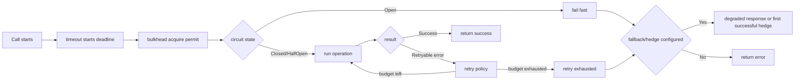
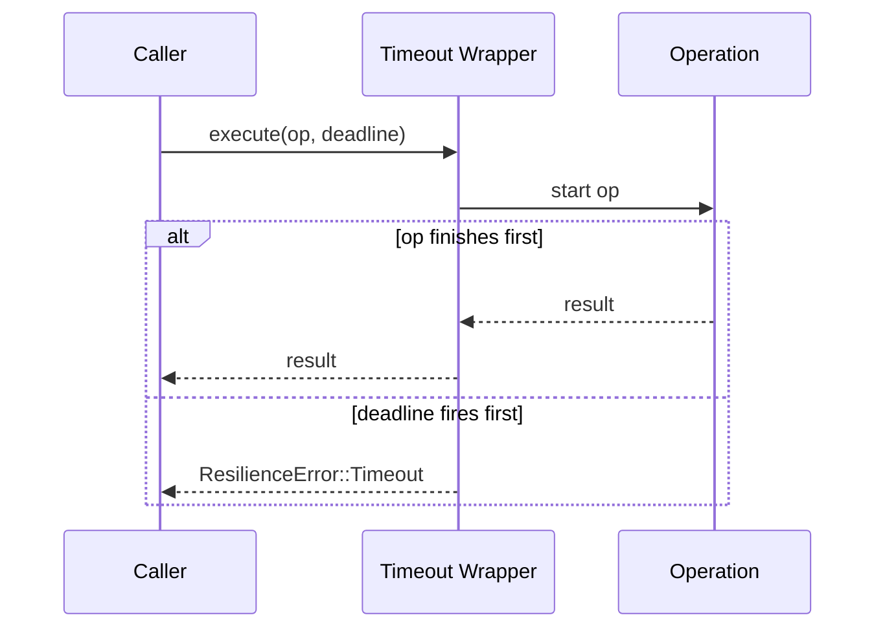
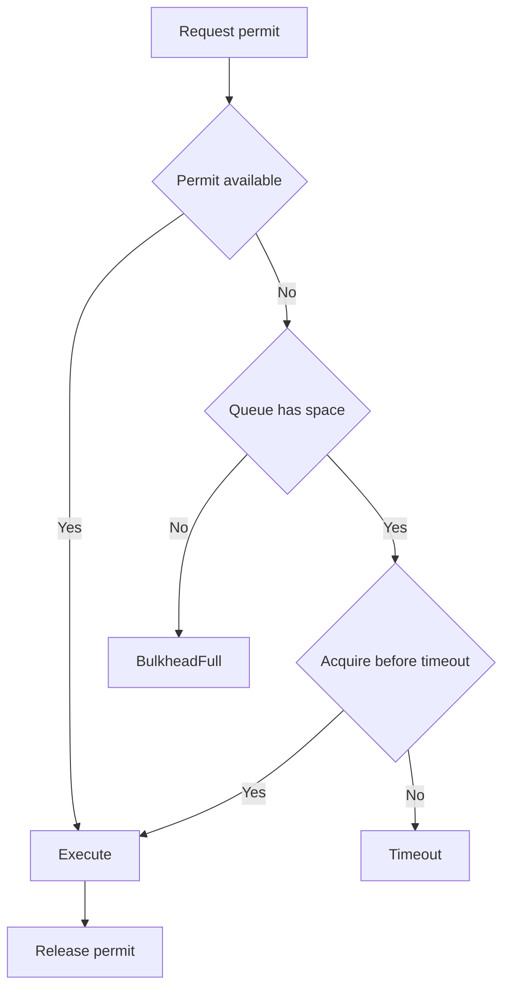
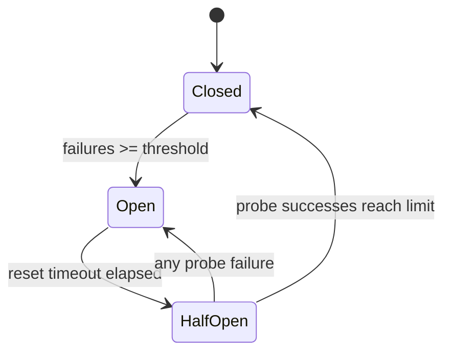
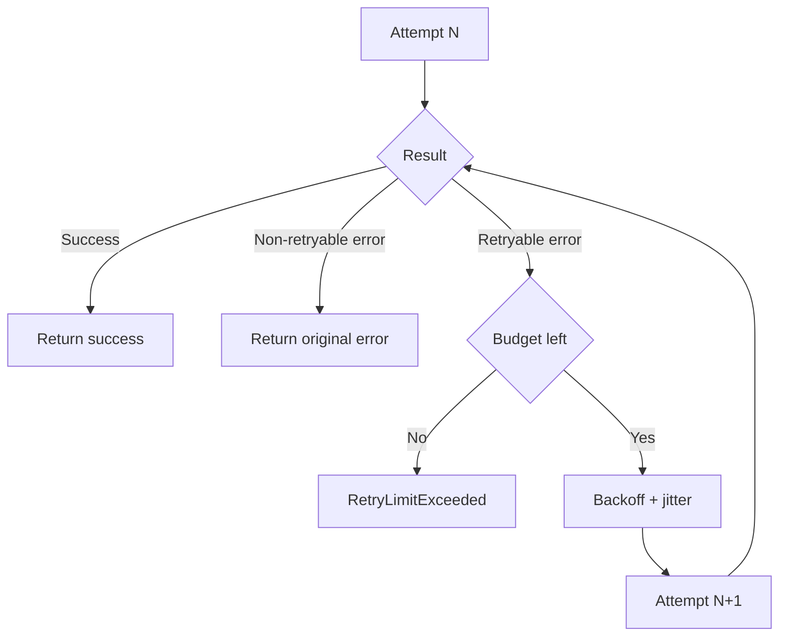
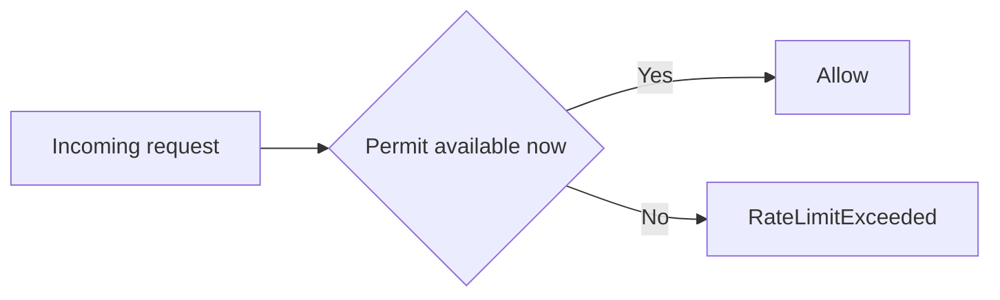
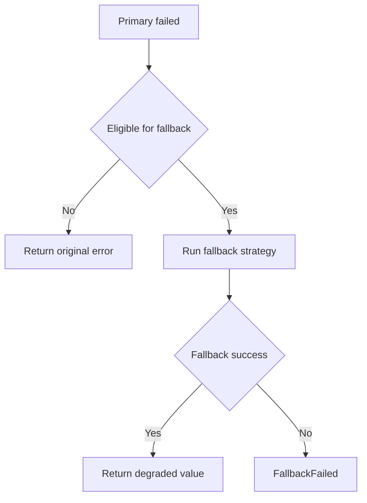
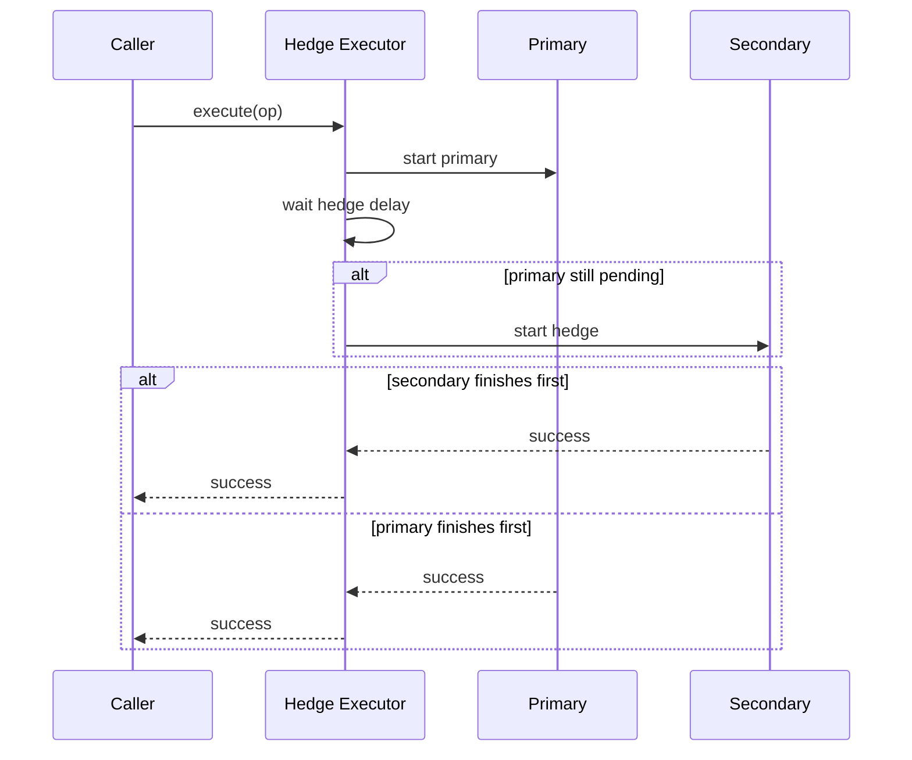

# Patterns Guide

This guide explains when and how to use each `nebula-resilience` pattern in production workflows.

## Recommended Composition Order

Default order for most service calls:

`timeout -> bulkhead -> circuit_breaker -> retry -> fallback/hedge (opt-in)`

Why:
- `timeout` bounds total time early.
- `bulkhead` prevents local saturation.
- `circuit_breaker` fails fast when dependency is unhealthy.
- `retry` handles transient failures with bounded cost.
- `fallback`/`hedge` are explicit degraded-latency/availability trade-offs.

## End-to-End Execution Flow

How to read this flow:
- `timeout` and `bulkhead` are protective envelopes around all inner work.
- `circuit_breaker` decides whether execution is allowed right now.
- `retry` is a bounded loop, never an unbounded background process.
- `fallback` and `hedge` are explicit opt-in paths when strict failure is not desired.

## timeout

- **Use when:** every call must have a hard upper bound.
- **Configure:** deadline by dependency class (DB, HTTP, queue).
- **Expect:** `ResilienceError::Timeout`.
- **Notes:** sub-10ms deadlines are platform/runtime sensitive; validate empirically.

Runtime behavior:
1. Start a deadline timer.
2. Run inner future.
3. If inner future completes before deadline, return result.
4. If deadline fires first, return timeout error and cancel pending work path.

Tuning rules:
- Set timeout from observed tail latency (`p95/p99`) plus safety headroom.
- For very small deadlines, validate on target OS/runtime (timer granularity matters).
- Tune timeout and retry together to avoid retry amplification.

## bulkhead

- **Use when:** concurrent requests can overwhelm local resources.
- **Configure:** `max_concurrency`, queue limit, acquire timeout.
- **Expect:** `BulkheadFull` when capacity/queue exhausted.
- **Notes:** keep queue bounded; unbounded waiting hides overload.

Runtime behavior:
1. Request permit.
2. If permit available, execute immediately.
3. If full, wait in bounded queue (if configured).
4. If wait budget/queue is exceeded, fail fast with backpressure signal.

Tuning rules:
- `max_concurrency` should reflect real downstream capacity, not CPU core count alone.
- Queue size should be small and explicit; large queues convert overload into latency spikes.
- Use acquire timeout to bound waiting and keep latency predictable.

## circuit_breaker

- **Use when:** downstream has recurring outage windows.
- **Configure:** failure threshold, reset timeout, half-open probe behavior.
- **Expect:** `CircuitBreakerOpen` during open state.
- **Notes:** protects downstream and your own thread/async pools from retry storms.

State model:
- `Closed`: normal traffic passes.
- `Open`: fail-fast; no normal calls allowed.
- `HalfOpen`: limited probes decide recovery.

Tuning rules:
- Threshold too low causes false trips; too high delays protection.
- Reset timeout should match realistic dependency recovery time.
- Half-open probe count should be small to avoid overload during recovery.

## retry

- **Use when:** failures are transient and operation is safe to retry.
- **Configure:** max attempts, backoff strategy, jitter policy, retryability condition.
- **Expect:** success after transient recovery or `RetryLimitExceeded`.
- **Notes:** always cap retry budget (`attempts` and/or total duration).

Runtime behavior:
1. Attempt operation.
2. If success, return.
3. If error is non-retryable, stop immediately.
4. If retryable and budget remains, delay by backoff+jitter and try again.
5. If budget exhausted, return terminal retry exhaustion error.

Tuning rules:
- Use exponential backoff for unstable dependencies.
- Enable jitter under concurrency to avoid synchronized retry waves.
- Treat retries as a bounded resilience tool, not a reliability substitute.

## rate_limiter

- **Use when:** service must enforce throughput or burst limits.
- **Configure:** algorithm (`token_bucket`, `leaky_bucket`, `sliding_window`, `governor`), rate, burst.
- **Expect:** `RateLimitExceeded` (optionally with retry hint).
- **Notes:** start conservative; increase burst before sustained rate when tuning.

Algorithm intuition:
- `token_bucket`: allows bursts up to bucket size, then enforces refill rate.
- `leaky_bucket`: smooths outgoing rate to a steady drain.
- `sliding_window`: enforces request count over moving time window.
- `governor`: high-performance quota enforcement with low overhead.

Tuning rules:
- Set limits per service class, not globally for unrelated traffic shapes.
- Increase burst first when occasional spikes are legitimate.
- Keep sustained rate conservative enough to protect downstream SLO.

## fallback

- **Use when:** degraded value is acceptable for read-like flows.
- **Configure:** strategy chain (value/function/cache), stale-if-error behavior.
- **Expect:** fallback value or `FallbackFailed`.
- **Notes:** avoid fallback on side-effecting write paths.

Runtime behavior:
1. Primary operation fails.
2. Evaluate whether error is fallback-eligible.
3. Run fallback strategy/chain.
4. Return degraded value if successful, otherwise return fallback failure.

Tuning rules:
- Use fallback only where stale/default data is business-safe.
- Keep chains short (typically 2-3) to avoid hidden latency explosions.
- Prefer deterministic fallbacks before expensive dynamic ones.

## hedge

- **Use when:** tail latency is worse than median and backend can absorb extra load.
- **Configure:** hedge delay near tail percentile, bounded extra requests.
- **Expect:** first successful replica wins; failure if all fail/timeout.
- **Notes:** hedge increases downstream load; tune carefully.

Runtime behavior:
1. Send primary request.
2. Wait hedge delay.
3. If no result yet, send one (or more bounded) duplicate request(s).
4. Return first successful completion and cancel/ignore slower replicas.

Tuning rules:
- Start with `max_extra_requests = 1`.
- Set hedge delay near observed tail trigger (often around `p95`).
- Disable or reduce hedging when downstream saturation risk increases.

## gate

- **Use when:** a group of concurrent tasks must fully complete before shutdown proceeds.
- **Configure:** none — `Gate` is zero-configuration.
- **Expect:** `Err(GateClosed)` from `enter()` once `close()` has been called.
- **Notes:** use for background maintenance tasks, request handlers, or any work that must fully drain before a resource or service is torn down.

Runtime behavior:
1. Workers call `gate.enter()` before beginning work; receive a `GateGuard`.
2. Workers drop their `GateGuard` when work is complete.
3. Owner calls `gate.close().await` during shutdown.
4. `close()` blocks until all outstanding guards are dropped, then returns.
5. Any `enter()` called after `close()` starts returns `Err(GateClosed)`.

Tuning rules:
- Acquire the guard as early as possible in a task and hold it for its full duration.
- Do not hold guards across unrelated idle waits — release promptly to avoid stalling shutdown.
- `Gate` is `Clone`; share a single gate across all workers that guard the same shutdown boundary.

## Quick Policy Profiles

- **Strict correctness (writes):** timeout + bulkhead + circuit_breaker + retry (conservative), no fallback.
- **Read-heavy low-latency:** timeout + bulkhead + retry + fallback (stale-if-error optional).
- **Tail-latency critical:** timeout + bulkhead + circuit_breaker + hedge (+ conservative retry).

## Common Anti-Patterns

- Retrying terminal validation/config errors.
- Large retry count with no jitter under high concurrency.
- Enabling fallback for non-idempotent writes.
- Aggressive hedge with no downstream capacity budget.
- Leaving queue-like controls effectively unbounded.

## Pattern Selection Cheat Sheet

| Problem observed | First pattern to apply | Usually paired with |
|---|---|---|
| Slow/hanging calls | `timeout` | `retry`, `circuit_breaker` |
| Local worker saturation | `bulkhead` | `timeout` |
| Repeated dependency outages | `circuit_breaker` | `retry`, `timeout` |
| Short transient faults | `retry` | `timeout` |
| Traffic spikes | `rate_limiter` | `bulkhead` |
| Read-path graceful degradation | `fallback` | `timeout`, `retry` |
| High tail latency | `hedge` | `timeout`, `bulkhead` |
| Graceful shutdown drain | `gate` | `timeout` (stall guard) |
