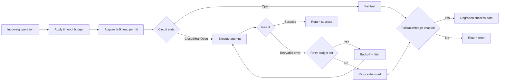
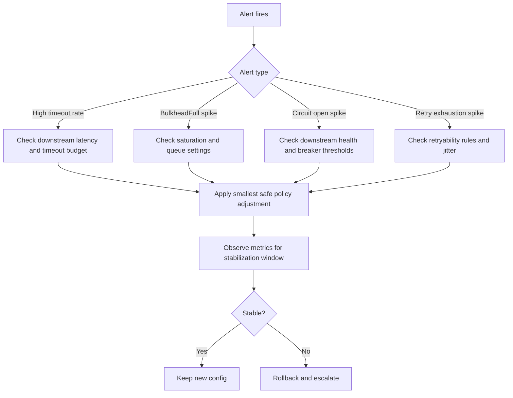

# Reliability

## SLO Targets

- **Availability:** N/A — resilience is a library, not a service. No uptime target.
- **Latency:** pattern overhead (circuit check, retry delay, bulkhead acquire) should be sub-millisecond in hot path; timeout enforcement adds configured delay.
- **Error budget:** N/A. Resilience reduces downstream error impact; circuit breaker and retry limits bound failure propagation.

## Failure Modes

- **Dependency outage:** when external service (HTTP, DB, queue) fails, resilience applies retry/circuit/fallback. Circuit opens after threshold; retries stop after limit.
- **Timeout/backpressure:** timeout aborts long-running ops; bulkhead limits concurrency; rate limiter throttles. `BulkheadFull`, `RateLimitExceeded` returned to caller.
- **Partial degradation:** circuit open → fail-fast; bulkhead full → reject; rate limit → throttle. Fallback/hedge provide alternative paths when configured.
- **Data corruption:** resilience does not persist state; policy config corruption caught by validation. No data integrity concerns.

## Resilience Strategies

- **Retry policy:** exponential/fixed/linear backoff; jitter; `max_attempts`; `Retryable` trait for error classification.
- **Circuit breaking:** failure threshold, reset timeout, half-open probe; fail-fast when open.
- **Fallback behavior:** `FallbackStrategy`, `ValueFallback`; primary failure triggers fallback path.
- **Graceful degradation:** hedge (parallel slow path); bulkhead isolation; rate limiting to protect downstream.

## Reliability Control Loop (Diagram-First)

This is the core runtime control loop that keeps failure handling bounded and predictable.

What this gives you operationally:
- bounded time (`timeout`),
- bounded concurrency (`bulkhead`),
- bounded retry cost (`retry budget`),
- controlled degradation (`fallback`/`hedge` only when explicitly configured).

## Incident Decision Flow

Use this sequence to triage alerts quickly and apply safe mitigations.

Safe-change principle:
- change one control at a time,
- prefer tightening safety envelopes before increasing throughput,
- always observe post-change metrics before additional tuning.

## Pattern Interaction Notes

How controls interact in production:
- `timeout + retry`: retries multiply total latency unless both budgets are coordinated.
- `bulkhead + retry`: retries under saturation can worsen queue pressure; keep retry budgets conservative.
- `circuit_breaker + retry`: breaker protects dependencies from retry storms once failure threshold is crossed.
- `fallback/hedge + timeout`: both should still be bounded by explicit deadlines.

Common target order remains:

`timeout -> bulkhead -> circuit_breaker -> retry -> fallback/hedge (opt-in)`

### Fallback Fault-Injection Coverage

- Integration coverage now validates fallback behavior across `value`, `function`, `cache`, and `chain` strategies.
- Negative-path checks include cache expiry, missing cache data, first-chain-strategy failure, and non-fallbackable `InvalidConfig` propagation.
- Reference test suite: `crates/resilience/tests/integration_fallback_fault_injection.rs`.

### Hedge Stress and Correctness Coverage

- Integration coverage validates `HedgeExecutor` correctness when primary is fast, when hedge wins tail-latency races, and under concurrent stress.
- Adaptive coverage validates `AdaptiveHedgeExecutor` under concurrent mixed-latency workloads and warmup-driven hedge activation.
- Reference test suite: `crates/resilience/tests/integration_hedge_stress.rs`.

### Bulkhead Fairness and Starvation Coverage

- Integration coverage validates sustained queued progress under high contention and checks that late arrivals still complete within bounded wait budgets.
- Backpressure coverage validates queue-bound behavior under saturation and ensures over-capacity requests are rejected predictably.
- Reference test suite: `crates/resilience/tests/integration_bulkhead_fairness.rs`.

### Retry Storm-Guard and Jitter Coverage

- Integration coverage validates retry amplification guardrails through `max_total_duration` and terminal-error short-circuiting.
- Jitter tuning coverage validates that `Full` jitter de-synchronizes second-attempt retry waves relative to fixed-delay no-jitter behavior.
- Reference test suite: `crates/resilience/tests/integration_retry_storm_guard.rs`.

#### Retry Storm-Guard Guidance

- Always set a bounded retry budget (`max_attempts` and/or `max_total_duration`) for high-fanout services.
- Prefer conservative retry conditions on configuration/validation paths to avoid retrying terminal errors.
- Use `Full` or `Decorrelated` jitter for high-concurrency traffic to reduce synchronized retry spikes.
- Treat `JitterPolicy::None` as acceptable only for low-concurrency or deterministic local workflows.

### Fallback Staleness and Bounded-Chain Guidance

- `CacheFallback` now supports explicit `stale-if-error` behavior via `with_stale_if_error(true)` for read-mostly degraded paths.
- Use `stale-if-error` only where stale responses are business-safe; keep fail-closed default for strict correctness paths.
- Keep fallback chains short and bounded (recommended: 2-3 strategies) to avoid cascading latency and ambiguity in degraded mode.
- Order chain strategies from cheapest/most deterministic to most expensive/least deterministic.
- Reference coverage: `crates/resilience/tests/integration_fallback_fault_injection.rs` (including stale cache acceptance after TTL expiry when configured).

### Timeout Short-Deadline Platform Guidance

- Timeout wrapper overhead is low, but very short deadlines are constrained by runtime/OS timer granularity rather than wrapper code path cost.
- Current local Windows benchmark evidence shows noticeable overshoot for 1-5ms deadlines (`timeout/cancellation/*` in `crates/resilience/benches/timeout.rs`), so treat sub-10ms deadlines as best-effort on this profile.
- For latency-sensitive production paths, prefer deadline budgets that include scheduler/timer headroom instead of matching raw p50 service latency.

#### Recommended Timeout Budgeting by Deadline Class

| Deadline class | Recommended use | Guardrails |
|---|---|---|
| `< 10ms` | Only when explicitly validated per platform/runtime | Require environment-specific validation and alerting on false timeouts before rollout. |
| `10-50ms` | Fast intra-service calls with strict SLOs | Keep retry budget conservative and avoid layered retries across service boundaries. |
| `> 50ms` | General network/storage operations | Use standard retry+timeout composition and tune from observed tail latency (p95/p99). |

#### Operational Rules

- Tune timeout and retry together: increasing retry without adjusting timeout can amplify queue pressure.
- For Windows-sensitive short deadlines, prefer fewer retries with jitter over aggressive retry loops.
- Re-validate short-deadline policies after runtime, kernel, or host-class changes.

## Phase 7 Consolidated Hardening Summary

Phase 7 operationally hardens four patterns (`bulkhead`, `retry`, `fallback`, `timeout`) beyond baseline correctness.

| Pattern | Hardening outcome | Primary evidence |
|---|---|---|
| `bulkhead` | Added contention benchmark baseline + fairness/starvation stress coverage | `benches/bulkhead.rs`, `tests/integration_bulkhead_fairness.rs` |
| `retry` | Added retry storm guard validation (`max_total_duration`, terminal-error short-circuit) + jitter de-synchronization checks | `tests/integration_retry_storm_guard.rs`, `benches/retry.rs` |
| `fallback` | Added explicit stale-cache degraded-mode control (`stale-if-error`) + bounded-chain guidance | `tests/integration_fallback_fault_injection.rs`, `patterns/fallback.rs` |
| `timeout` | Added platform-sensitive short-deadline budgeting rules and gate policy separation for cancellation-latency signals | `benches/timeout.rs` |

### Operator Checklist

- Set explicit retry budgets (`max_attempts` and/or `max_total_duration`) on high-fanout paths.
- Keep bulkhead queue limits finite and validate queue behavior under sustained contention.
- Enable fallback stale-cache mode only for read-safe degraded responses.
- Treat sub-10ms timeout deadlines as platform-validated exceptions, not defaults.

## Consolidated Pattern Defaults and Limits

This section is the operational baseline for Phase 6 patterns (`governor`, `timeout`, `fallback`, `hedge`).

| Pattern | Default posture | Operational limits | Recommended starting point | Scale-up / rollback guidance |
|---|---|---|---|---|
| `GovernorRateLimiter` | Fail-closed (`RateLimitExceeded`) | Keep per-instance limits explicit; avoid effectively-unbounded burst values. | Start with strict per-service quotas and burst close to expected short spike size. | If throttling is excessive, increase burst first, then sustained rate; if downstream saturates, reduce burst before reducing base rate. |
| `timeout` | Fail-closed (`Timeout`) | Wrapper overhead is low (~`timeout/overhead/wrapped_yield_once`), but short deadlines are timer-granularity-sensitive on Windows (`timeout/cancellation/*`). | Use SLO-derived deadlines with headroom above expected OS/runtime timer jitter. | If false timeouts increase, widen timeout budget before retry budget; for overload, lower timeout only with downstream idempotency guarantees. |
| `fallback` | Fail-open only when explicitly configured | Fallback chain/cache quality defines correctness risk; stale or missing cache returns `FallbackFailed`. | Enable only for read/derived paths with acceptable degraded values; keep chain short and deterministic. | If degradation rate rises, validate fallback freshness and error eligibility; disable fallback on write/side-effect paths. |
| `hedge` | Fail-open only when explicitly configured | Extra replicas increase downstream load; aggressive hedge delay can amplify fan-out. | Begin with small `max_hedges` (1-2) and hedge delay near tail percentile target. | If downstream pressure increases, raise hedge delay or reduce `max_hedges`; if tail latency remains high, tune delay percentile before raising hedge count. |

### Evidence and References

- Governor benchmark evidence: `crates/resilience/benches/rate_limiter.rs`.
- Timeout benchmark evidence: `crates/resilience/benches/timeout.rs`.
- Fallback reliability evidence: `crates/resilience/tests/integration_fallback_fault_injection.rs`.
- Hedge reliability evidence: `crates/resilience/tests/integration_hedge_stress.rs`.

## Fail-Open / Fail-Closed Defaults

The crate uses **fail-closed by default** for protective controls. Explicit graceful-degradation patterns (`fallback`, `hedge`) are opt-in.

| Pattern | Default | Behavior |
|---|---|---|
| `timeout` | **Fail-closed** | On deadline exceed returns `ResilienceError::Timeout`; operation result is not accepted. |
| `bulkhead` | **Fail-closed** | At capacity/queue overflow returns `BulkheadFull`; acquire timeout returns `Timeout`. |
| `rate_limiter` | **Fail-closed** | On limit hit returns `RateLimitExceeded` with retry hint where available. |
| `circuit_breaker` | **Fail-closed** | In open state rejects with `CircuitBreakerOpen` until half-open probe window. |
| `retry` | **Conditional fail-closed** | Retries only retryable errors; terminal/no-budget paths end with original error or `RetryLimitExceeded`. |
| `fallback` | **Fail-open (opt-in)** | If configured and eligible, returns degraded value; if fallback chain fails -> `FallbackFailed` (fail-closed). |
| `hedge` | **Fail-open (opt-in)** | Returns first successful replica; if none succeeds, returns failure/timeout. |

### Operational Contract

- Without `fallback`/`hedge`, resilience never masks failures: errors propagate upstream.
- `fallback`/`hedge` are explicit business decisions to trade strict correctness for availability/latency.
- Invalid policy updates are treated as no-op (existing runtime state remains active), preventing accidental fail-open behavior from bad config.

### Override Guidance

- Prefer fail-closed for write paths and side-effecting operations.
- Allow fail-open only for read/derived data where stale/default responses are acceptable.
- Record degraded-path usage with observability hooks and alert on sustained activation.

## Operational Runbook

- **Alert conditions:** high circuit-open rate; retry exhaustion; bulkhead rejections; rate limit hits. Emit via observability hooks.
- **Dashboards:** circuit state, retry attempts, bulkhead utilization, rate limit usage. Use `ObservabilityHook`, `MetricsHook`, spans.
- **Incident triage:** 1) check circuit state and failure threshold; 2) verify downstream service health; 3) adjust policy (e.g., increase timeout, retry limit) or fix root cause; 4) reset circuit if safe.

## Capacity Planning

- **Load profile assumptions:** configurable per service; default timeouts (30s), retries (3), circuit threshold (5). Tune for HTTP (10s), DB (5s), queue (30s).
- **Scaling constraints:** circuit breaker and rate limiter are per-instance; bulkhead limits concurrency. For horizontal scaling, consider per-node limits and global rate limits (future).

## Security Baseline

- **Trust boundary:** this crate is in-process and does not own authn/authz; callers enforce access control.
- **Input safety:** validate policy payloads before apply (`ResiliencePolicy::validate`, retry config validation).
- **Secret safety:** do not put secrets in policy metadata, error messages, or observability labels.
- **Abuse resistance:** combine bounded retries + bulkhead + circuit breaker + rate limiting to mitigate retry/traffic storms.

## Verification and Performance Gates

- **Core verification commands:**
	- `cargo check -p nebula-resilience --all-features`
	- `cargo test -p nebula-resilience`
	- `cargo clippy -p nebula-resilience -- -D warnings`
	- `cargo doc --no-deps -p nebula-resilience`
- **Benchmark focus areas:** manager overhead, limiter contention, circuit fast-path, timeout wrapper, fallback/hedge overhead.
- **Gate policy:** treat significant regressions on hot paths as release blockers; rerun noisy benches before final decision.
