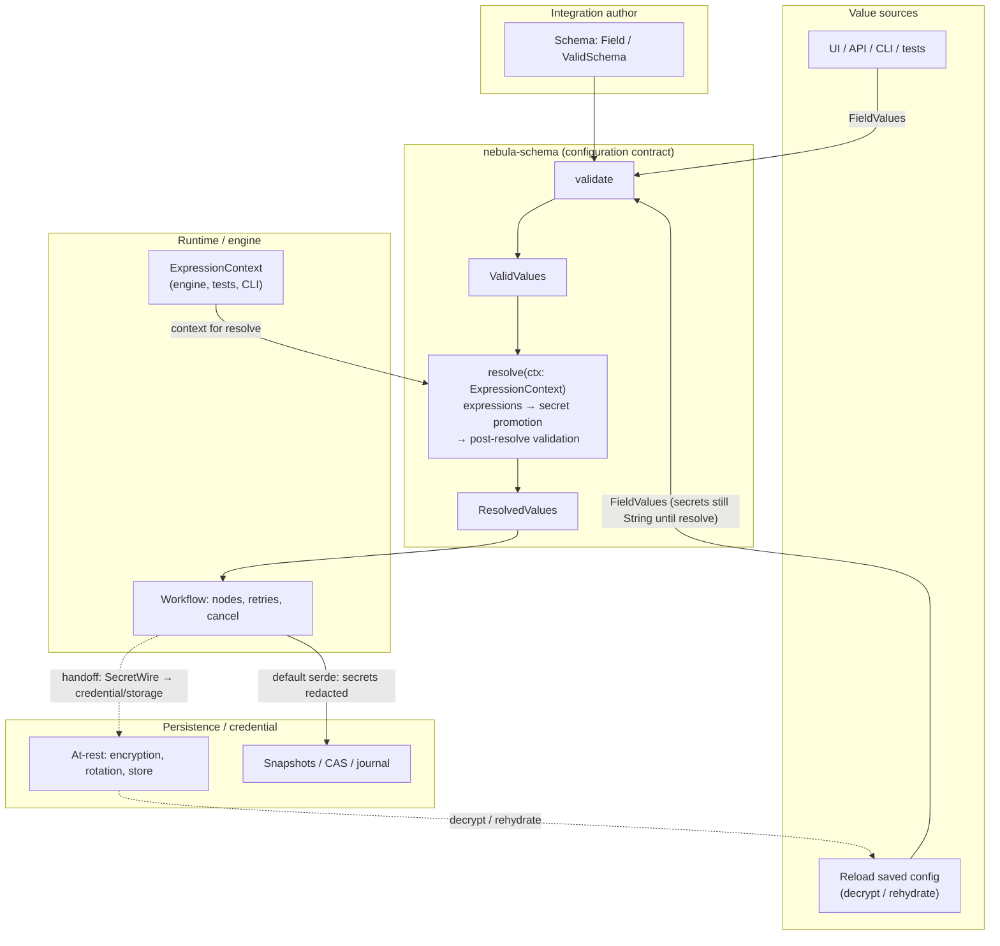

# Nebula integration model

---

## Integration model — one pattern, five concepts

Most engines give integration authors one abstraction: a **"node"** that receives credentials and config as loosely typed JSON and returns output. **Authentication, connection management, retry, and validation** are the author's problem, solved ad hoc per integration.

**Nebula's bet:** the right model is a **small set of orthogonal concepts**, each with a single clear responsibility — and **all sharing the same structural contract**. This is the complement to §2.5: not "faster n8n," but a **different authoring and operations model**.

### Structural contract (uniform across concepts)

Every concept in Nebula's integration layer is described by two things:


| Piece | Role |
|---|---|
| `*Metadata` | UI-facing description — id, display name, icon, version, concept-specific fields (categories, isolation, checkpoint policy for Actions). |
| `Schema` | Typed configuration schema (`nebula-schema`: `Field`, `Schema`, `ValidValues`, `ResolvedValues`). One schema system used across Resource config, Credential setup, and Action inputs. |

The **schema subsystem** (`nebula-schema` crate) is the **fifth concept** — cross-cutting configuration machinery, shared across integration kinds. It provides a **proof-token pipeline**: `ValidSchema::validate` returns `ValidValues` only after schema-time validation succeeds; `ValidValues::resolve` returns `ResolvedValues` only after runtime expression resolution succeeds. A caller cannot skip validation or resolution — the types enforce the sequence.

### Configuration pipeline (diagram)

End-to-end view: all value sources funnel through **one** schema validation step into the **`ValidValues` proof token**; **`resolve`** (in `nebula-schema`) consumes an `ExpressionContext` from runtime and yields **`ResolvedValues`**; workflow execution persists snapshots and hands secret material to credential/storage via an explicit boundary (the workflow is **not** “the encryption implementation”). The same figure and notes appear in [ADR-0034](adr/0034-schema-secret-value-credential-seam.md), which remains the **decision record** for `SecretValue`, `SecretWire`, and loader redaction — edit both places when the pipeline changes.



**Dashed edges:** `ENC -.-> LOAD` is **data flow** (decrypt / materialize into loader input). `WF -.-> ENC` is a **trust boundary handoff** (runtime initiates persistence; encryption-at-rest stays in credential/storage — see [ADR-0028](adr/0028-cross-crate-credential-invariants.md) / [ADR-0029](adr/0029-storage-owns-credential-persistence.md)).

**Security note — plaintext lifetime:** Before `resolve`, secret-shaped fields live as ordinary `String` inside `FieldValues`. **`ValidValues::resolve`** promotes them to `FieldValue::SecretLiteral(SecretValue)` and re-validates. After promotion, `SecretValue` redacts in `Debug` / `Display` / default `Serialize`; intentional plaintext exit points are **audited** (`expose()` with `#[track_caller]`, `SecretWire` for stores). Snapshots written through default serialization paths should treat secrets as **redacted on the wire**; **`LOAD` trust** depends on storage integrity and the decrypt path (credential/storage plane — see [ADR-0029](adr/0029-storage-owns-credential-persistence.md)).

**Where `S` lives:** today the **shape** of `ValidSchema` comes from **author-time Rust** in integration/plugin crates (and registry wiring), not from the snapshot store. Persisted artifacts are **config values and history** (`SNAP`), not the Rust type graph. If product ever versions **schema definitions as data**, the diagram can gain an optional `SNAP -.-> S` edge; until then, keeping `S` only under **author** avoids visual clutter.

**Non-decision (diagram scope):** `resolve` is treated as **synchronous** here; async resolve, cancellation mid-flight, and “partial promotion” safety are not modeled in this picture.

### How the four integration kinds relate (structural, not "whatever exists at runtime")

These are **schema-level** links: metadata and parameter types say what an Action **requires** and what a Credential **composes** — the engine **resolves** them from registered types. Nothing is satisfied by implicit global lookup.

**Resource** — `[ ResourceMetadata + Schema ]` — **base, independent.**

Long-lived managed object: connection pool, SDK client, file handle. Engine owns lifecycle: init, health-check, hot-reload via **ReloadOutcome**, scope-aware teardown. The author declares what the Resource **is**; the engine provides it **healthy** or fails loudly. **Concrete shape:** see §3.6 (`nebula-resource`).

**Credential** — `[ CredentialMetadata + Schema ]` — **optionally composes a Resource** in metadata/schema (e.g. HTTP client **Resource** for token refresh).

**Who** you are and **how** authentication is maintained. Engine owns rotation, refresh, and the **stored state vs consumer-facing auth material** split — the author binds to a Credential type, never hand-rolls refresh or pending OAuth steps, and never relies on secrets appearing in logs. A set of universal auth schemes (OAuth2, API key, mTLS, and others — full list in `crates/credential/README.md`) plus extensibility via the `AuthScheme` trait in `crates/credential/src/scheme/auth.rs`; the author picks a type and fills the schema. **Concrete shape:** see §3.7 (`nebula-credential`).

**Action** — `[ ActionMetadata + Schema ]` — **declares zero or more Resource and/or Credential kinds it needs** (by stable id / type reference in the **integration schema**, not ad hoc runtime lookup).

**What** the step does — with explicit semantics. The engine dispatches by **which action trait** the type implements (`StatelessAction`, `StatefulAction`, `TriggerAction`, `ResourceAction`, …) — not by a single metadata "kind" field. **`ActionMetadata`** carries key, ports, parameters, isolation, **`ActionCategory`** (Data / Control / Trigger / …), and checkpoint behavior declaration (e.g. **`CheckpointPolicy`**) for UI/validation/runtime policy; this metadata supplements but does not replace trait-based routing. The trait family determines iteration (Continue / Break), trigger lifecycle, graph-scoped resource nodes, and flow-control **`ActionResult`** variants; the **runtime** applies checkpoint, retry, and cancel rules from those contracts — the author does not re-implement those invariants per action (aligned with `nebula-resilience`). **Concrete shape:** see §3.8 (`nebula-action`).

**Wiring rule:** every Resource and Credential an Action references must be **provided by this plugin's own `impl Plugin` registry** **or** by a type from **another plugin crate** that is a **declared dependency** in **`Cargo.toml`** (engine loads providers before dependents; see §7.1). Referencing a type that is "in the process" but **not** reachable through that **closed dependency graph** — even if another plugin registered it — is a **misconfiguration**, caught at **activation** (or equivalent validation), not a silent runtime grab.

**Plugin** — `[ registry: Actions + Resources + Credentials ]` → **+ localization + additional features**

**Distribution and registration unit.** A Plugin is not only a bundle — it is the **registry** that wires Actions, Resources, and Credentials together under a **versioned** identity, with localization and metadata for the UI. Types **defined in other plugins** are available only when the dependent crate **depends on the provider plugin crate** in **`Cargo.toml`** and the engine respects that **acyclic** graph at load/activation — same closure idea as **Cargo**, not an open global namespace. **Plugin is the unit of registration, not the unit of size:** a "full" integration crate and a **micro-plugin** (one or two registry entries) are **the same kind of thing** — same `plugin.toml` contract, same registration story; see §7.1. Deployment strategies: **native** in-process (maximum performance), **process-isolated** via IPC (third-party sandboxing), **FFI** via stabby (cross-language, stable ABI). Third-party plugins are **first-class by design**; document any gap vs native until the model is complete.

### Why the uniform pattern matters

**For authors:** learn `{ *Metadata + Schema }` once — apply to any concept. Write Stripe logic; do not write credential rotation, connection management, or retry folklore. Each concept has one job.

**For operators:** each concept has a clear **owner**. Credential rotation fails → Credential layer. Connection pool leaks → Resource layer. "Something went wrong in the node" is no longer the only diagnostic category.

**For the ecosystem:** Plugin is the **unit of distribution**. Actions, Resources, and Credentials **version together** under one identity; **cross-plugin composition** is explicit via **Cargo dependencies** between plugin crates plus activation-time checks (§7.1), so versioning and install sets stay honest. The UI consumes metadata uniformly. Localization is a **Plugin** concern, not a per-action afterthought.

**Positioning:** this **pattern + separation** is **rare** in our competitive set (§2.5). Treat it as a **primary architectural differentiator** — and **defend it**: do not collapse metadata, parameters, Resources, Credentials, Actions, or Plugin registration back into a single untyped "node struct" in new public APIs without a canon update.

**Canon vs crate docs:** §3.6–§3.9 name the **Rust crates** that realize each integration concept. **Authoritative mechanics** — APIs, topology names, crypto parameters, benchmarks — belong in `crates/*/README.md` and source. This file states **what and why** so the product story does not rot when internals refactor (contrast §14 *spec theater*).

## `nebula-resource`

**What / why:** typed **Resource** implementations with **engine-owned** lifecycle (acquire, health, release) instead of ad hoc singletons — so connection pools and clients are **scoped and inspectable**.

**Where to read:** `crates/resource/README.md`, `crates/resource/src/lib.rs`.

## `nebula-credential`

**What / why:** unified **Credential** contract — stored state vs projected auth material, refresh/resolve/test paths — so secrets and rotation stay **out of Action code** and logs.

**Plane B (integration credentials):** workflow-facing secrets for **external** systems (API keys, OAuth to third parties, certificates, …) live in this model. They are **not** the same as authenticating **to Nebula** (browser/API session, future SSO/LDAP to the control plane — see [ADR-0033](adr/0033-integration-credentials-plane-b.md) and a future Plane A / `nebula-auth` crate).

**Where to read:** `crates/credential/README.md`, `crates/credential/src/lib.rs`, [ADR-0033 — Integration credentials (Plane B)](adr/0033-integration-credentials-plane-b.md).

### Industry reference — n8n credential taxonomy vs Nebula axes

Popular integration tools ship **many** credential types: in [n8n](https://github.com/n8n-io/n8n), credential definitions are TypeScript modules under [`packages/nodes-base/credentials/`](https://github.com/n8n-io/n8n/tree/master/packages/nodes-base/credentials) (glob `*.credentials.ts`). Raw file counts are **on the order of 400** on recent upstream snapshots and **drift by release** — re-check that directory when refreshing this example. Those modules are **product-facing labels** — what the UI stores and how nodes authenticate — not Nebula’s internal split.

The table below is an **external, illustrative** bucketing (by auth *shape* / transport), **not** a Nebula API. Counts come from **one manual classification** of the catalog into these buckets (totalling **428** definitions in that exercise); they are **not** guaranteed to sum to a fresh clone’s file count, which varies by n8n revision.

| Bucket (illustrative) | Typical meaning | Count (example) |
| --- | --- | ---: |
| API key / Bearer | Static secret, header or query | 252 |
| OAuth 2.0 | Authorization-code / client flows to third-party IdPs | 108 |
| Basic | Username + password (often HTTP Basic) | 25 |
| Custom | Multi-step, signed requests, LDAP, vendor-specific | 12 |
| Database | Host, port, user, password, SSL / SSH tunnel | 10 |
| Message queue | AMQP, MQTT, Kafka | 4 |
| AWS access keys | Static AWS key style | 2 |
| AWS AssumeRole | STS role chain | 1 |
| FTP / SFTP | Protocol-specific connection + auth | 2 |
| SMTP / IMAP | Mail server | 2 |
| OAuth 1.0a | OAuth 1 | 2 |
| SSH | Password or private key | 2 |
| Unclassified | Vendor bucket not mapped elsewhere | 2 |
| mTLS | Client certificate | 1 |
| Digest | HTTP Digest | 1 |
| JWT | JWT auth | 1 |
| Service-account JWT | e.g. RS256 bearer to Google APIs | 1 |

**How this maps to Nebula (Plane B):** n8n’s buckets mix **transport** (DB, queue, mail), **protocol family** (OAuth2 vs API key), and **acquisition UX** (custom wizards) in one flat namespace. Nebula keeps those concerns **orthogonal** — see [ADR-0033](adr/0033-integration-credentials-plane-b.md): **acquisition** (how the secret first entered the system), **`AuthScheme` / `AuthPattern`** (what material actions receive), and **persistence** (encrypted stored state vs projected auth). High counts for **API key** and **OAuth2** align with treating them as major **auth families**, not as hundreds of unrelated one-off schemes. **Database**, **queue**, and **SSH**-shaped credentials often pair **connection topology** (Resource or schema fields) with **auth material** (Credential); collapsing both into a single “credential type” is the same ad hoc pattern Nebula avoids.

## `nebula-action`

**What / why:** **Action** traits, declared dependencies, **`ActionResult`** flow, and metadata-declared execution policy (including **`CheckpointPolicy`** in `ActionMetadata`) so the engine can enforce checkpoints, branching, and retries **honestly** — not untyped "JSON in / out."

> **Status of `CheckpointPolicy`:** see `crates/action/README.md` for implementation state; current engine honoring of this policy is tracked in `docs/MATURITY.md` row for `nebula-action`.

**Where to read:** `crates/action/src/lib.rs` (module map; crate `README.md` may lag).

## `nebula-schema`

**What / why:** one **schema** system (`Field`, `Schema`, `ValidValues`, `ResolvedValues`, proof-token pipeline) shared by Actions, Credentials, Resources — so configuration is **typed and validated once**, not re-invented per integration.

**Where to read:** `crates/schema/README.md`, `crates/schema/src/lib.rs`.

## Cross-cutting crates (at a glance)

Besides the **integration** reference crates (§3.6–§3.9), the workspace ships **shared infrastructure** — depended on from many layers; they **support** the model above without replacing it.

- **`nebula-core`** — shared identifiers and keys (`ExecutionId`, `ActionKey`, `CredentialKey`, …), scope levels, context and accessor traits, guards, dependency declaration types, observability identity types — the **cross-cutting vocabulary** every crate shares. Credential-domain types (**`AuthScheme`**, **`AuthPattern`**, **`SecretString`**, **`CredentialEvent`**, …) live in **`nebula-credential`** (see §3.7), not here — see `crates/core/README.md`.
- **`nebula-error`** — **`Classify`**, **`NebulaError`**, categories/codes, structured details — **one** error taxonomy at boundaries instead of ad hoc strings.
- **`nebula-resilience`** — composable **pipelines** (retry, timeout, circuit breaker, bulkhead, …); pairs with **`ActionError`** / retry hints in **`nebula-action`** (§3.8).
- **`nebula-validator`** — programmatic validators + declarative **`Rule`**; **`nebula-schema`** embeds rules in **`Field`** definitions.
- **`nebula-config`** — multi-source, merged, optionally hot-reloaded **host** configuration (binaries/services) — **not** the per-node **`Schema`** story.
- **`nebula-log`** — structured **`tracing`** pipeline (init, sinks, optional OTel/Sentry hooks).
- **`nebula-telemetry`** — in-memory **metric** primitives (registry, histograms, label interning).
- **`nebula-metrics`** — **`nebula_*` naming**, adapters, Prometheus-style **export** and label-safety guards — sits on top of **`nebula-telemetry`**.
- **`nebula-eventbus`** — typed **broadcast** bus with back-pressure policy; **transport only** — domain **`E`** types live in owning crates.
- **`nebula-expression`** — workflow **expression** evaluation (variable access, operators, functions) for dynamic fields — headless, not a UI.
- **`nebula-system`** — cross-platform **host** probes (CPU/memory/network/disk pressure) for ops and telemetry inputs.
- **`nebula-workflow`** + **`nebula-execution`** — the execution semantics core: workflow validation/shape and durable execution lifecycle/state transitions. Read these when the question is "what does the engine guarantee at runtime," not just "how integrations are authored."

**Layering:** cross-cutting crates sit **below** API/engine-specific surfaces (see CLAUDE.md boundaries); they must not **depend upward** on integration-only crates. **Canon use:** reuse these crates for their domains instead of duplicating helpers; if something truly belongs in **`nebula-core`** (a new stable identifier or key type), extend it deliberately rather than inventing a parallel type in a leaf crate. New **auth material** types belong in **`nebula-credential`** unless an ADR moves shared vocabulary.

---

## Plugin packaging: `Cargo.toml`, `plugin.toml`, and `impl Plugin`

Nebula recognizes **two legitimate packaging patterns** — not "official vs hack." Both use the same **Rust crate + `plugin.toml` marker + `impl Plugin`** story.

**Full plugin** — e.g. `nebula-plugin-slack/`: many actions, credentials, resources, locales.

**Micro-plugin** — e.g. `nebula-resource-slack/`: one or two registry entries.

**Principle:** **Plugin is the unit of registration, not the unit of size.** Same loader and respect for both shapes.

### Three sources of truth (no drift)

Avoid **double declaration** — listing every action in TOML **and** in `fn actions()` is **spec theater** (§14): two sources that will diverge.


| Artifact                             | Responsibility                                                                                                                                                                                                                                                                   |
| ------------------------------------ | -------------------------------------------------------------------------------------------------------------------------------------------------------------------------------------------------------------------------------------------------------------------------------- |
| **`Cargo.toml`**                     | Rust **package** identity: `[package].name`, `version`, `authors`, `license`, `homepage`, `description`, and **`[dependencies]`** on other crates — **including other plugin crates**. This is the **dependency graph** the host already knows how to resolve.                   |
| **`plugin.toml`**                    | **Trust + compatibility boundary** — read **without compiling**: **SDK constraint**, optional stable **plugin id**, and (when used) **signing** over a **stable** manifest (see **Signing** below). **Do not** duplicate registry contents (actions/resources/credentials) here. |
| **`impl Plugin` + `PluginManifest`** | **Runtime source of truth** for **what** gets registered (`actions()`, `resources()`, `credentials()`, locales) and for **bundle metadata** (`PluginManifest`: human name, icon, categories, long description, maturity, deprecation, etc.) **after** load.                                            |


**Pre-compile discovery** (registry, CLI list) uses **`Cargo.toml` + minimal `plugin.toml`** only. Full **`PluginManifest`** is authoritative **once the plugin is loaded**; do not require a second copy of every field in TOML.

**Versioning:** `Cargo.toml` `[package].version` is the **crate** version — do **not** duplicate it in `plugin.toml`.

**`Cargo.toml` stays Rust-standard:** no Nebula-specific tables in `Cargo.toml` — Nebula-specific policy lives in **`plugin.toml`** + Rust code.

**The boundary "this is a Nebula plugin":** a **`plugin.toml`** file exists at the crate root with at least:

```toml
[nebula]
sdk = "^0.8"   # semver constraint on nebula-api / plugin SDK — read by cargo-nebula / CLI without `cargo build`
```

**Optional `[plugin].id`** — set this **only** when the stable Nebula plugin id must **differ** from the Cargo package name (registry/UI **before** load):

```toml
[plugin]
id = "nebula-plugin-slack"   # if [package].name is e.g. "slack-plugin"
```

**If `id` is omitted**, the **effective plugin id** for discovery and compatibility is **`[package].name`** from `Cargo.toml` — hosts and pre-compile tooling **must** use that string (no other implicit default). Internal mapping to typed keys (e.g. `PluginKey`) must be **deterministic** and **documented** in loader/tooling; if the package name does not map cleanly, authors **must** set `id` explicitly. **Do not** silently derive a different id from Cargo without an explicit `[plugin].id`.

### Signing: why `plugin.toml`, not `Cargo.toml`

> **Status: planned.** The `[signing]` block fields and canonical serialization are tooling-defined and not frozen. Verification logic is on the isolation roadmap (see canon §12.6). Do not rely on signing as an active trust boundary until this status changes.

**`Cargo.toml` mutates** whenever dependencies are added, bumped, or re-resolved (`cargo update`, new crates). Signing it would mean **signatures churn constantly** or cover irrelevant churn — a poor trust anchor.

**`plugin.toml` is intentionally stable:** it holds **identity-for-trust**, **SDK compatibility**, and (when enabled) **cryptographic attestation** — not the full registry. That is what you **sign**: the author attests "this **plugin identity** and **policy** are mine." Same idea as **Android** signing **`AndroidManifest.xml`** (policy/identity), not every `.java` file; or treating a **lockfile** / manifest as the attested surface while sources ship beside it.

- **Canonical signed payload:** the **bytes of `plugin.toml`** (or a defined canonical serialization of it — tooling decides). **`impl Plugin` / `PluginManifest` are not the signed blob** — they describe **content** and can change without invalidating publisher identity, as long as the **attested manifest** is unchanged or re-signed.

Illustrative **`[signing]`** shape (field names and algorithms are **tooling-defined** until frozen):

```toml
[nebula]
sdk = "^0.8"

[plugin]
id = "nebula-plugin-slack"

[signing]
publisher   = "vanya@example.com"
fingerprint = "sha256:abc123..."
signature   = "base64:..."
```

**Three layers (summary):**


| Layer             | Role                                                                                            |
| ----------------- | ----------------------------------------------------------------------------------------------- |
| **`plugin.toml`** | **Trust + compatibility** — SDK bound, optional id, **signature** (what the publisher attests). |
| **`Cargo.toml`**  | **Build graph** — what compiles; **not** the Nebula trust document.                             |
| **`impl Plugin`** | **Content** — what registers at runtime.                                                        |


### Why not list `[[actions]]` in `plugin.toml`?

Flutter-style **pubspec** asset lists work because there is no second source. Here, **`impl Plugin`** already returns the registry — a parallel TOML table would **duplicate** it. **SDK constraint + Cargo metadata + Rust registry** keeps a **single** responsibility per layer.

### Plugin dependency rule (cross-plugin types)

For **Rust** plugins, **another plugin's** types are brought in only via **`Cargo.toml` `[dependencies]`** on the **provider plugin crate**. The engine loads / activates providers **before** dependents according to that **acyclic** graph (topological order).

- **Versioning & discoverability:** `cargo tree`, lockfiles, and `Cargo.toml` already say "A depends on B."
- **Isolation:** an Action in crate A that references a Resource type from crate B **without** a Cargo dependency on B is **invalid** — fail at **activation** / compile time, not a silent global lookup.

If a future **non-Rust** host needs a manifest-only dependency list, that can be a **separate** extension — the canon for **Rust-native** plugins is **Cargo-first**.

### Layout

Directories such as `actions/`, `credentials/`, `resources/`, `locales/` are **recommended**; only **`plugin.toml`** (minimal) + **`Cargo.toml`** are **required** at the canon level for the marker story above.

Illustrative (non-normative) layouts:

```text
nebula-plugin-slack/          # full plugin
  plugin.toml                 # required manifest
  actions/
    send_message.rs
    create_channel.rs
  credentials/
    oauth.rs
    bot_token.rs
  resources/
    http_client.rs
  locales/
    en.json
    ru.json

nebula-resource-slack/        # micro-plugin
  plugin.toml                 # same manifest contract
  resource.rs
  credential.rs
```

### Discovery and load lifecycle

1. Pre-compile discovery reads `Cargo.toml` + minimal `plugin.toml` (no compile required for SDK constraint and stable id).
2. Host resolves the dependency closure via the Cargo graph (Rust-native plugins) and orders providers before dependents.
3. Plugin loads and `impl Plugin` registers actions / resources / credentials / locales — runtime is the source of truth.
4. `PluginManifest` returned from `impl Plugin` becomes authoritative for catalog display once the plugin is loaded.

### Rust-native vs FFI ABI

Rust-native plugins follow Cargo-first dependency and build semantics. The compiled artefact is **not** implicitly ABI-stable across SDK or engine upgrades — recompile against the matching SDK version and rely on the `nebula.sdk` semver constraint in `plugin.toml` to fail-fast on incompatibility. A binary-stable cross-version ABI is an explicit FFI concern and tracked separately on the isolation roadmap (canon §12.6); options under consideration include `stabby`-style stable Rust ABI surfaces. There is no implicit promise of `.so` / `.dll` compatibility today.

### Tooling notes

> **Status — planned, not enforced today.** Canon §11.6 truth: `cargo-nebula`
> does not yet exist, and `crates/sandbox/README.md` lines 64-65 mark
> `PluginCapabilities` enforcement from `plugin.toml` through discovery as a
> **false capability** — the allowlist is defined but the discovery path
> hardcodes `PluginCapabilities::none()` until that TODO is closed. The
> behaviours below are the *target* once the discovery wiring lands.

`cargo-nebula` and the CLI are **expected to** validate `plugin.toml` markers
early — before invoking `cargo build` — rejecting missing SDK constraints,
malformed identifiers, and unresolved cross-plugin types with diagnostics that
name the plugin id, the package name, and the missing provider dependency.
Activation **must eventually** reject any plugin whose declared cross-plugin
type references a Cargo dependency outside the resolved closure, rather than
silently falling back to global lookup. Until the sandbox discovery roadmap
item is closed, neither check is wired and the validation surface is honest
about that gap.
