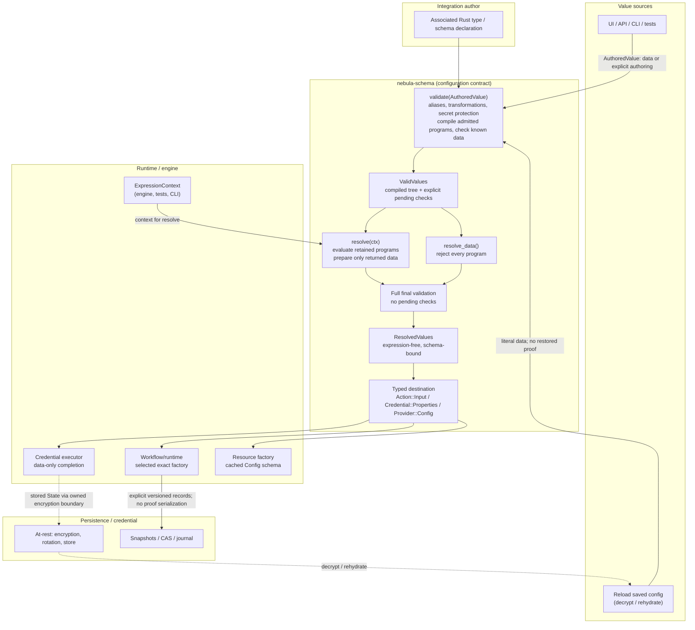

# Nebula integration model

> **Doc stack:** Invariants live in `docs/PRODUCT_CANON.md`. **Decisions** live as
> ADRs in the maintainers' private design vault (accepted ADRs are immutable; not in
> this repo). This file carries **mechanics** only. Agents: read `docs/README.md` first;
> `ADR-NNNN` ids are stable textual references.

---

## Integration model — one pattern, five concepts

Most engines give integration authors one abstraction: a **"node"** that receives credentials and config as loosely typed JSON and returns output. **Authentication, connection management, retry, and validation** are the author's problem, solved ad hoc per integration.

**Nebula's bet:** the right model is a **small set of orthogonal concepts**, each with a single clear responsibility — and **all sharing the same structural contract**. This is the complement to §2.5: not "faster n8n," but a **different authoring and operations model**.

### Structural contract (uniform across concepts)

Every concept in Nebula's integration layer is described by two things:


| Piece | Role |
|---|---|
| `*MetadataDraft` | Author-owned UI/catalog intent: key, checked display name, version, lifecycle, and concept-specific declarations. A draft cannot supply a schema or claim admission. |
| Associated Rust type | The schema source of truth: `Action::{Input, Output}`, `Credential::Properties`, or `Provider::Config`. |
| admitted `*Metadata` | Immutable catalog definition produced only by the owning factory/registry after deriving schemas and checking identity/package invariants. |
| `Recorded*Metadata` | Deserialized evidence. It regains admitted status only by exact comparison with a fresh definition from the currently selected factory/registry. |

This is the canon's `*Metadata + Schema` contract expressed as a one-way
lifecycle, not permission for authors to construct terminal metadata. Action
factories derive both schemas and stamp the action kind; `CredentialRegistry`
derives the properties schema; `ResourceFactory` derives and caches the config
schema. `BaseMetadata` and admitted leaf metadata expose getters and serialize
for catalogs, but have no setters or `Deserialize` implementation. Only the
recorded DTOs deserialize, and readmission returns the fresh definition rather
than promoting recorded fields. `PluginManifest` remains the bundle descriptor
and uses its own checked builder; it is not a catalog-leaf admission bypass.

### Phase-5 authoring target (implementation pending)

[`crates/schema/docs/PHASE5_PROPERTY.md`](../crates/schema/docs/PHASE5_PROPERTY.md)
specifies the revised target contract for separate value and slot grammars with
explicit associated data types. Implementation is pending.

**Current implementation:** value derives use the existing `#[field(...)]` /
`#[validate(...)]` helpers; integration fields use `#[credential(...)]` /
`#[resource(...)]` for slots. The schema-free draft/admission lifecycle above
already exists. The new grammar and remaining builder parity below are targets,
not shipped APIs.

**Target authoring:** `#[property(display(...), input(...), validate(...),
options(...))]` describes values only; the blocks are optional according to the
property's needs. `#[slot(credential, ...)]` and `#[slot(resource, ...)]` declare
dependencies separately. `Action::Input`, `Credential::Properties`, and
`Provider::Config` remain permanently supported, canonical explicit data types;
`Action::Output` remains explicit too. They are not migration-only escape hatches,
and no derive requires an associated type to be `Self`.

| Declaration | Target authoring location | Included in `HasSchema` | Persisted as values | Binding source |
|---|---|---:|---:|---|
| Parameter / config / credential property | `#[property(...)]` on the associated data type or schema-only type | yes | yes, subject to existing disclosure rules | authored values |
| Credential slot | `#[slot(credential, ...)]` on an action or resource | no | no | `slot_bindings` |
| Resource slot | `#[slot(resource, ...)]` on an action | no | no | `slot_bindings` |

Target `#[schema_type(input)]`, `#[schema_type(output)]` or `#[schema_type(input, output)]`
owns real library Serde derives plus Schema on the same DTO and generates recursive
InputCodec/OutputCodec evidence. Inputs/properties require input evidence; action
outputs require output evidence; resource configs require both as a new target
round-trip authoring contract, independent of fingerprinting. Schema-only derive
remains valid but supplies no codec witness. Custom codecs require explicit reviewed
adapter newtypes; SDK hidden paths are not a native-code security boundary.

`#[derive(Schema)]` describes value fields, not dependency declarations. Slots and
their bindings remain outside parameters, credential properties, and persisted
config values. Catalog export may describe slots beside the value schema; that
does not put them into `ValidSchema` or establish a shipped catalog extension.
Declaration keys, catalog type keys, and selected instance IDs remain distinct.
Declaring or displaying a slot never grants binding or tenant authority.

Existing behavior families and canon remain unchanged: actions keep
`execute(&self, input, ...)`, resources keep a handwritten `impl Provider` with
`create(&self, config, ...)`, and credential resolve/project remain static typed
contracts. The existing `#[credential]` macro on an impl block continues to infer
capability membership from methods. A struct derive cannot inspect a separate
impl block and must not claim to infer those capabilities. No new behavior
family or hidden companion data type is introduced by this proposal.

**Target output boundary, unshipped:** every action family rejects protected output
domains recursively at admission before handlers/serializers, including absent or
inactive nested/external branches. Validate actual ordinary output against the
outbound schema before publish/persist, without inbound transforms/defaults;
serializer and validation errors are payload-free. Codec evidence is not admission.

**Presentation boundary, target only:** `display(...)` must not change value
requiredness, suppress validation, or grant slot authority. Value validity belongs
to the input/validation contract. Semantic decoupling requires a future, explicitly
versioned migration with compatibility and recorded-definition handling; current
runtime semantics remain in effect until then. Full schema equality remains
conservative and includes presentation/UI fields. This proposal does not split
presentation identity or rewrite existing schema or plan bytes.

### Shared metadata authoring (current foundation, target parity)

`nebula-metadata` owns shared catalog metadata; leaf crates compose it and own
entity-specific admission. Property display hints belong to schema authoring,
not to a new catalog-leaf metadata type. SDK personas curate these contracts.

| Metadata row | Shared owner / entity extra | Authoring and admission |
|---|---|---|
| Identity and text | `MetadataDraft<K>`: typed key, `MetadataName`, description | Checked `new` or fallible `try_new`; no key replacement |
| Revision | `MetadataVersion` | `with_version`; compatibility checked separately |
| Icon | `Icon::None`, `Icon::Inline`, `Icon::Url` | `with_icon`, `with_inline_icon`, `with_url_icon`; one representation |
| Documentation and discovery | Documentation URL, tags | `with_documentation_url`, `with_tags`, `add_tag` |
| Lifecycle | Active maturity or deprecation notice | `mark_experimental`, `mark_beta`, `mark_stable`, `with_deprecation`; notice wins |
| Canonical value schema | `BaseMetadata<K>` | Owning factory/registry binds the associated type's checked schema; never supplied by a leaf draft |
| Action extras | Ports, isolation, checkpoint/effect policy, concurrency; admitted kind and output schema | Existing leaf `with_*` / `add_*` methods; factory derives both schemas and stamps kind |
| Credential extras | Admitted auth pattern; capability membership remains trait-derived | Target admission derives pattern from `C::Scheme`; current draft still takes it as a fourth constructor argument |
| Resource extras | No additional catalog fields beyond the shared base | Factory derives `R::Config` schema and checks `Provider::key()`; topology and live instance stay resource contracts |

The exact common constructor contract is the following, with `K` replaced by
`ActionKey`, `CredentialKey`, or `ResourceKey` on each concrete leaf draft:

```rust,ignore
pub fn new(key: K, name: MetadataName, description: impl Into<String>) -> Self;
pub fn try_new(
    key: K,
    name: impl Into<String>,
    description: impl Into<String>,
) -> Result<Self, MetadataError>;
```

All three drafts retain the existing `with_*`, `add_tag`, and `mark_*` names above,
with the existing typed arguments and consuming `Self` returns. `with_tags`
replaces tags; `add_tag` appends. Drafts remain private-field, `#[must_use]`,
schema-free, and non-deserializable. Only the owning factory/registry binds leaf
schemas and creates admitted metadata; recorded DTOs still require readmission
against a fresh definition. No public leaf `build()` or schema setter is added.

Issue 1018 covers the remaining constructor and SDK export parity: add Action's
`try_new`, remove the credential constructor's redundant pattern argument in
favor of admission from `C::Scheme`, and curate equivalent draft/ornament imports
for manual authoring. All three drafts already delegate typed icons and shared
`with_*` methods to `nebula-metadata`; this is not an icon repair from scratch.

**Further metadata evolution, proposed:** the
[Phase-5 metadata contract](../crates/schema/docs/PHASE5_PROPERTY.md#metadata-evolution)
goes beyond constructor parity: typed catalog categories and related links,
cross-family replacement references, explicit removal schedules, and a versioned
catalog protocol. Leaf facts are projected from existing factories/registries,
not authored capability flags. Plugin packaging retains package/SDK constraints;
tenant availability and future locale overlays remain separate host projections.
These additions require their own checked admission, exact evidence and revision
compatibility cases. The shared lower draft's `bind_schema` becomes fallible to
enforce those bounds; leaf factories propagate its error without exposing a leaf
`build()` method. These changes are not implemented by this documentation change.

### Runtime schema boundaries (current)

The **schema subsystem** (`nebula-schema` crate) is the **fifth concept**, shared across integration kinds. `HasSchema::schema()` / `schema_of` and metadata admission are fallible: invalid definitions do not become catalog entries. Runtime data then moves through four distinct phases:

| Phase | Representation | Guarantee |
|---|---|---|
| Authored | `AuthoredValue` | Explicitly data or template authoring; no validation proof. |
| Valid | `ValidValues` | Aliases/transforms applied once, programs compiled, declared secrets protected, pending checks explicit, schema snapshot retained. |
| Resolved | `ResolvedValues` | Programs absent and every final rule/policy satisfied; still bound to the exact schema snapshot. |
| Typed | `Action::Input`, `Credential::Properties`, `Provider::Config`, or another destination type | Trusted decode at the owning boundary; proof wrappers do not enter author code. |

`ValidSchema::validate` consumes authored input. Only consuming completion
through `resolve(context)` or data-only `resolve_data()` can produce
`ResolvedValues`; both perform full final validation. These proof values cannot
be deserialized or caller-constructed, and they are technical implementation
types rather than the supported SDK authoring model.

Every admitted schema has one authoritative `RootShape`: unknown JSON, a concrete
scalar domain, a record, or a tagged union. Unit types have JSON `null` inputs;
empty braced structs have object inputs. A consumer must not substitute an empty
object or `Any` for a known scalar, or discard submitted properties to manufacture
a unit value. Existing persisted empty-record schemas remain records. New scalar
descriptors require an explicitly supporting plan epoch and schema envelope;
neither the historical raw-JSON canonical bytes nor old plan identities are
silently migrated by changing the in-memory value tree.

### Configuration pipeline (diagram)

All value sources enter the same consuming preparation boundary. Literal JSON ingress through `AuthoredValue::from_data` never interprets template-looking strings or expression-shaped objects as code. Authoring expressions requires `from_template_json`, an equivalent SDK authoring helper, or the versioned authored wire format, and the exact schema node must permit them. Expression results are data, never recursively reinterpreted as programs. Credential orchestration uses only the synchronous data-only completion path, then decodes `C::Properties` before provider dispatch. Persistence and encryption remain the responsibility of their existing aggregate owners.

Inside the runtime, erased action dispatch may carry raw transport data or a
completed schema-bound proof. `ActionInput` and `PreparedActionInput` name that
technical seam; they are not SDK authoring types. Named workflow parameters are
already in the schema's internal authored form; transport JSON and whole
predecessor wire values instead enter through `values_from_wire`. The selected
action handle verifies full schema equality, performs the trusted typed decode,
and mints an opaque proof bound to that exact handle. Equal schemas from two
factories are not interchangeable authority. No intermediate JSON round trip
may discard expression admission or cause transforms to run again. Explicit
template syntax remains string-valued through compilation, serialization, and
execution.


```mermaid
flowchart TB
  subgraph author["Integration author"]
    S["Associated Rust type / schema declaration"]
  end

  subgraph callers["Value sources"]
    UI["UI / API / CLI / tests"]
    LOAD["Reload saved config\n(decrypt / rehydrate)"]
  end

  subgraph schema["nebula-schema (configuration contract)"]
    VAL["validate(AuthoredValue)\naliases, transformations, secret protection\ncompile admitted programs, check known data"]
    VV["ValidValues\ncompiled tree + explicit pending checks"]
    RES["resolve(ctx)\nevaluate retained programs\nprepare only returned data"]
    DATA["resolve_data()\nreject every program"]
    FULL["Full final validation\nno pending checks"]
    RV["ResolvedValues\nexpression-free, schema-bound"]
    TYPED["Typed destination\nAction::Input / Credential::Properties / Provider::Config"]
  end

  subgraph runtime["Runtime / engine"]
    EX["ExpressionContext\n(engine, tests, CLI)"]
    WF["Workflow/runtime\nselected exact factory"]
    CRED["Credential executor\ndata-only completion"]
    RESOURCE["Resource factory\ncached Config schema"]
  end

  subgraph persist["Persistence / credential"]
    ENC["At-rest: encryption, rotation, store"]
    SNAP["Snapshots / CAS / journal"]
  end

  S --> VAL
  UI -->|"AuthoredValue: data or explicit authoring"| VAL
  LOAD -->|"literal data; no restored proof"| VAL
  ENC -.->|"decrypt / rehydrate"| LOAD

  VAL --> VV
  VV --> RES
  VV --> DATA
  EX -->|"context for resolve"| RES
  RES --> FULL
  DATA --> FULL
  FULL --> RV
  RV --> TYPED
  TYPED --> WF
  TYPED --> CRED
  TYPED --> RESOURCE
  WF -->|"explicit versioned records; no proof serialization"| SNAP
  CRED -.->|"stored State via owned encryption boundary"| ENC
```

**Dashed edges:** storage materializes data for a new validation pass; credential runtime hands stored state to its encryption and persistence boundary. These are explicit data/authority crossings, not implicit serialization of schema proof tokens.

**Secret custody:** declared string secrets become `ValueTree::Secret` before `ValidValues` is returned, including aliases and nested fields. Predicate and loader contexts exclude protected material. Debug and diagnostic JSON redact secrets; authored wire serialization rejects secret-bearing trees instead of writing redaction markers as restorable values. Ordinary typed extraction refuses secrets. A typed `#[field(secret)]` destination must implement the explicit owned-and-zeroizing `SecretInput` marker. `into_typed_exposing_secrets` feeds protected leaves directly to the target deserializer without first materializing plaintext in an ordinary `serde_json::Value`; `get_secret`/`expose` and `SecretWire` remain explicit trusted disclosure operations. Credential preparation checks the normalized values against `C::Properties` without an expression engine; it never validates one copy and resolves a newly ingested, unnormalized copy.

**Where `S` lives:** today the **shape** of `ValidSchema` comes from **author-time Rust** in integration/plugin crates (and registry wiring), not from the snapshot store. Persisted artifacts are **config values and history** (`SNAP`), not the Rust type graph. If product ever versions **schema definitions as data**, the diagram can gain an optional `SNAP -.-> S` edge; until then, keeping `S` only under **author** avoids visual clutter.

**Execution and persistence scope:** expression resolution is asynchronous and consuming; cancellation cannot yield a partial proof. `resolve_data` is synchronous and rejects admitted programs. Paths through value and validation trees use RFC 6901 `ValuePath` / `FieldPath`: root is `""`, arrays are ordinary pointer segments, and `~` / `/` are escaped. The value-tree wire/canonical formats are versioned independently of persisted plan identity. Existing plan records retain `canonical_json_v1` bytes; a value-model change must not silently rewrite their identities. This diagram does not change refresh, lease, journal, or aggregate write ownership.

### Exact factories and durable records

Preparation authority follows the selected catalog entry. Action handles mint
opaque typed input proofs bound to the handle's private identity. Resource
validation and registration reuse the selected factory's cached admitted
metadata and `R::Config` schema, then keep the typed config inside manager
registration. Credential preparation similarly terminates in
`C::Properties`; `Credential::resolve` never receives `ValidValues` or
`ResolvedValues`. Public schema equality alone is therefore necessary but not
sufficient to dispatch through another factory.

The durable plan/flavor revision catalog is first-writer-wins over bytes but
idempotent over parsed JSON meaning. Reinserting an immutable identity with
only whitespace or object-key-order differences returns `AlreadyPresent`;
different parsed content returns `ContentConflict`. The first accepted bytes
remain authoritative and exact loads return them unchanged. Semantic comparison
does not canonicalize, replace, or silently migrate a historical record.

### Supported Rust perimeter

`nebula-sdk` is the sole supported and branded Rust dependency. Integration
authors use its persona modules, derives, associated Rust types, and
`*MetadataDraft` values. Admitted metadata, validated/resolved value proof
wrappers, erased or prepared action inputs, registries/factories, persistence
ports, and runtime authority types stay outside the curated perimeter. Workspace
crates may expose those technical seams so first-party composition can function,
but direct use does not receive an independent compatibility promise.

### How the four integration kinds relate (structural, not "whatever exists at runtime")

These are **schema-level** links: metadata and parameter types declare a closed dependency graph that activation validates before the runtime resolves anything. Nothing is satisfied by implicit global lookup.

**Credential** — `[ CredentialMetadata + Schema ]` — **leaf.**

**Who** you are and **how** authentication is maintained. Credential code receives provider and transport capabilities through injected ports; a Credential must not depend on a Resource, Action, or ambient registry lookup. The `nebula-credential` crate owns rotation-state, refresh, lease, and the **stored state vs consumer-facing auth material** split (its runtime was consolidated there by ADR-0092; the engine keeps only accessor bridges). Authors declare a typed `Credential::Properties`, stored `State`, and projected `Scheme`; the runtime validates and typed-decodes properties before calling `resolve`. Initial acquisition and refresh receive separate narrow transports, and only refresh runs under the owned provider-to-persistence critical section. The built-in OAuth credential implements Authorization Code (mandatory PKCE S256) and Client Credentials only; there is no supported device-flow variant. Other auth families are available only where a concrete credential/composition path actually wires them. **Concrete shape:** see §3.7 (`nebula-credential`).

**Resource** — `[ ResourceMetadata + Schema ]` — **may depend on Credential and/or other Resource types.**

Long-lived managed object: connection pool, SDK client, file handle. Resource lifecycle owns init, health-check, hot-reload via **ReloadOutcome**, bindings, per-slot credential-rotation fan-out, and scope-aware teardown. Authors return `ResourceMetadataDraft`; the selected `ResourceFactory` derives and caches the exact `R::Config` schema, and validation/registration consume that one definition before typed manager admission. A Resource may declare typed Credential slots and may build on other Resource types, but the resource dependency subgraph must remain acyclic and activation-validated. The author declares what the Resource **is**; the runtime provides it **healthy** or fails loudly. **Concrete shape:** see §3.6 (`nebula-resource`).

**Action** — `[ ActionMetadata + Schema ]` — **declares zero or more Resource and/or Credential kinds it needs** (by stable id / type reference in the **integration schema**, not ad hoc runtime lookup).

**What** the step does — with explicit semantics. Authors return `ActionMetadataDraft`; the selected factory derives `Action::{Input, Output}` schemas, stamps the structural kind, checks the package, and retains immutable `ActionMetadata`. The engine dispatches by **which action trait** the type implements (`StatelessAction`, `StatefulAction`, `TriggerAction`, `ResourceAction`, …), not by an author-selected metadata kind. Internal erased input is prepared once and becomes an exact-handle-bound typed proof before dispatch; neither `ActionInput` nor admitted metadata is an SDK author surface. Graph is the flagship execution direction, not a production-readiness claim. Existing Stream / Agent / Interactive names or variants are shape-only reservations for future capability-gated profiles; they do not establish current runtime semantics or a supported SDK capability. Each future profile requires its own persisted state, admission, recovery, and compatibility contract. The runtime applies checkpoint, retry, and cancel rules only for behavior implemented end-to-end — the author does not re-implement those invariants per action (aligned with `nebula-resilience`). **Concrete shape:** see §3.8 (`nebula-action`).

**Wiring rule:** the canonical dependency direction is Credential leaf; Resource → Credential and/or Resource; Action → Credential and/or Resource. Every referenced type must be **provided by this plugin's own `impl Plugin` registry** **or** by a type from **another plugin crate** that is a **declared dependency** in **`Cargo.toml`**. The complete plugin/type closure must be acyclic and activation-validated before execution (engine loads providers before dependents; see §7.1). Referencing a type that is "in the process" but not reachable through that closure is a misconfiguration, even if some unrelated plugin registered it.

**Plugin** — `[ registry: Actions + Resources + Credentials ]` → **+ localization + additional features**

**Distribution and registration unit.** A Plugin is not only a bundle — it is the **registry** that wires Actions, Resources, and Credentials together under a **versioned** identity, with localization and metadata for the UI. Types **defined in other plugins** are available only when the dependent crate **depends on the provider plugin crate** in **`Cargo.toml`** and the engine respects that **acyclic** graph at load/activation — same closure idea as **Cargo**, not an open global namespace. **Plugin is the unit of registration, not the unit of size:** a "full" integration crate and a **micro-plugin** (one or two registry entries) are **the same kind of thing** — same `plugin.toml` contract, same registration story; see §7.1. Deployment is native, statically linked, trusted, and in-process (ADR-0091); a plugin change requires recompiling and redeploying every worker / host that includes it. Remote plugin execution, dynamically loaded plugin ABIs, process isolation, out-of-process / IPC execution, and WASM / WASI are abandoned non-goals (canon §12.6). Reconsideration requires an explicit canon revision followed by an accepted ADR and threat model; an ADR alone is insufficient. Third-party plugins are **first-class by design** within this native model; document any implementation gap until the model is complete.

### Why the uniform pattern matters

**For authors:** learn `{ *Metadata + Schema }` once — apply to any concept. Write Stripe logic; do not write credential rotation, connection management, or retry folklore. Each concept has one job.

**For operators:** each concept has a clear **owner**. Credential rotation fails → Credential layer. Connection pool leaks → Resource layer. "Something went wrong in the node" is no longer the only diagnostic category.

**For the ecosystem:** Plugin is the **unit of distribution**. Actions, Resources, and Credentials **version together** under one identity; **cross-plugin composition** is explicit via **Cargo dependencies** between plugin crates plus activation-time checks (§7.1), so versioning and install sets stay honest. The UI consumes metadata uniformly. Localization is a **Plugin** concern, not a per-action afterthought.

**Positioning:** this **pattern + separation** is **rare** in our competitive set (§2.5). Treat it as a **primary architectural differentiator** — and **defend it**: do not collapse metadata, parameters, Resources, Credentials, Actions, or Plugin registration back into a single untyped "node struct" in new public APIs without a canon update.

**Canon vs crate docs:** §3.6–§3.9 name the **Rust crates** that realize each integration concept. **Authoritative mechanics** — APIs, topology names, crypto parameters, benchmarks — belong in `crates/*/README.md` and source. This file states **what and why** so the product story does not rot when internals refactor (contrast §14 *spec theater*).

## `nebula-resource`

**What / why:** typed **Resource** implementations with **engine-owned** lifecycle (acquire, health, release) instead of ad hoc singletons — so connection pools and clients are **scoped and inspectable**.

**Where to read:** `crates/resource/README.md`, `crates/resource/src/lib.rs`.

## `nebula-credential`

**What / why:** unified **Credential** contract — typed setup `Properties`, stored state, projected auth material, and separately authorized acquisition/refresh paths — so schema proof objects, secrets, and rotation stay **out of provider and Action code** except at explicit typed disclosure points. Registry admission derives the properties schema and rejects invalid definitions before they enter the catalog.

**Plane B (integration credentials):** workflow-facing secrets for **external** systems (API keys, OAuth to third parties, certificates, …) live in this model. They are **not** the same as authenticating **to Nebula**. Plane-A identity policy, fixed Google/GitHub.com sign-in profiles, provider client secrets, browser/API sessions, PATs, and MFA belong to the `nebula-api` auth boundary plus the server composition root — never `CredentialService`. The selected Memory backend provides process-local atomicity; PostgreSQL delegates its short user/link/session-or-MFA finalizer and globally capped OAuth-state admission to storage-owned seams. Provider egress never runs under finalizer locks, `(provider, subject)` is authoritative, and verified email alone never authorizes account linking. Future SSO/LDAP work must extend Plane A rather than leaking host identity into `nebula-credential`. This crate split is an implementation boundary: `nebula-sdk` remains the sole supported, branded Rust surface.

**Rotation/refresh failure contract:** an integration receives projected auth material, never claim
tokens or storage mutation authority. Refresh/revoke is single-flight in-process and across
replicas. The durable claim is marked `RefreshInFlight` before provider egress; caller
cancellation cannot cancel the owned provider→persistence section. A confirmed result may release
the exact claim, while an ambiguous or post-provider unpersisted result retains it. Once expired,
that row is durable poison: it records one incident by claim UUID, denies all provider replay, and
requires an explicit owner-qualified reconciliation command. The N-in-window sentinel threshold
is an operational escalation observation, not retry authority and not itself a durable
`ReauthRequired` mutation.

**Where to read:** `crates/credential/README.md`, `crates/credential/src/lib.rs`, **ADR-0033** — Integration credentials (Plane B).

### Industry reference — n8n credential taxonomy vs Nebula axes

Popular integration tools ship **many** credential types: in [n8n](https://github.com/n8n-io/n8n), credential definitions are TypeScript modules under [`packages/nodes-base/credentials/`](https://github.com/n8n-io/n8n/tree/master/packages/nodes-base/credentials) (glob `*.credentials.ts`). Raw file counts are **on the order of 400** on recent upstream snapshots and **drift by release** — re-check that directory when refreshing this example. Those modules are **product-facing labels** — what the UI stores and how nodes authenticate — not Nebula’s internal split.

The table below is an **external, illustrative** bucketing (by auth *shape* / transport), **not** a Nebula API. Counts come from **one manual classification** of the catalog into these buckets (totalling **428** definitions in that exercise); they are **not** guaranteed to sum to a fresh clone’s file count, which varies by n8n revision.

| Bucket (illustrative) | Typical meaning | Count (example) |
| --- | --- | ---: |
| API key / Bearer | Static secret, header or query | 252 |
| OAuth 2.0 | Authorization-code / client flows to third-party IdPs | 108 |
| Basic | Username + password (often HTTP Basic) | 25 |
| Custom | Multi-step, signed requests, LDAP, vendor-specific | 12 |
| Database | Host, port, user, password, SSL / SSH tunnel | 10 |
| Message queue | AMQP, MQTT, Kafka | 4 |
| AWS access keys | Static AWS key style | 2 |
| AWS AssumeRole | STS role chain | 1 |
| FTP / SFTP | Protocol-specific connection + auth | 2 |
| SMTP / IMAP | Mail server | 2 |
| OAuth 1.0a | OAuth 1 | 2 |
| SSH | Password or private key | 2 |
| Unclassified | Vendor bucket not mapped elsewhere | 2 |
| mTLS | Client certificate | 1 |
| Digest | HTTP Digest | 1 |
| JWT | JWT auth | 1 |
| Service-account JWT | e.g. RS256 bearer to Google APIs | 1 |

**How this maps to Nebula (Plane B):** n8n’s buckets mix **transport** (DB, queue, mail), **protocol family** (OAuth2 vs API key), and **acquisition UX** (custom wizards) in one flat namespace. Nebula keeps those concerns **orthogonal** — see **ADR-0033**: **acquisition** (how the secret first entered the system), **`AuthScheme` / `AuthPattern`** (what material actions receive), and **persistence** (encrypted stored state vs projected auth). High counts for **API key** and **OAuth2** align with treating them as major **auth families**, not as hundreds of unrelated one-off schemes. **Database**, **queue**, and **SSH**-shaped credentials often pair **connection topology** (Resource or schema fields) with **auth material** (Credential); collapsing both into a single “credential type” is the same ad hoc pattern Nebula avoids.

## `nebula-action`

**What / why:** **Action** traits, declared dependencies, **`ActionResult`** flow, draft metadata, and factory-owned typed input preparation so the engine can enforce branching and retries **honestly** — not untyped "JSON in / out." `CheckpointPolicy` is factory-admitted from `ActionMetadataDraft` into immutable `ActionMetadata` (default `Inherit`); the runtime does not yet enforce non-`Inherit` cadences.

> **Status of `CheckpointPolicy`:** field on `ActionMetadata` (`checkpoint_policy`, default `Inherit`); engine enforcement of non-`Inherit` cadences not yet wired end-to-end. See `crates/action/README.md` and `docs/MATURITY.md` row for `nebula-action`.

**Where to read:** `crates/action/src/lib.rs` (module map; crate `README.md` may lag).

## `nebula-schema`

**What / why:** one **schema** system with explicit authored, valid, resolved, and typed phases shared by Actions, Credentials, and Resources — so configuration is **typed and prepared once**, not re-invented per integration. Literal data and template authoring are distinct, declared secrets become protected tree nodes before a valid proof exists, and only an owning trusted boundary performs final typed extraction.

**Where to read:** `crates/schema/README.md`, `crates/schema/src/lib.rs`.

## Cross-cutting crates (at a glance)

Besides the **integration** reference crates (§3.6–§3.9), the workspace ships **shared infrastructure** — depended on from many layers; they **support** the model above without replacing it.

- **`nebula-core`** — shared identifiers and keys (`ExecutionId`, `ActionKey`, `CredentialKey`, …), scope levels, context and accessor traits, guards, dependency declaration types, observability identity types, **auth types** (`AuthScheme`, `AuthPattern`), **role/permission enums** (`OrgRole`, `WorkspaceRole`, `Permission`), **multi-tenant context** (`TenantContext`, `ResolvedIds`), and **slug validation** (`Slug`, `SlugKind`) — the **cross-cutting vocabulary** every crate shares. `AuthScheme` and `AuthPattern` are **canonical in `nebula-core`**, re-exported by `nebula-credential` for discoverability. Other credential-domain types (**`SecretString`**, **`CredentialEvent`**, …) live in **`nebula-credential`** (see §3.7) — see `crates/core/README.md`.
- **`nebula-error`** — **`Classify`**, **`NebulaError`**, categories/codes, structured details — **one** error taxonomy at boundaries instead of ad hoc strings.
- **`nebula-resilience`** — composable **pipelines** (retry, timeout, circuit breaker, bulkhead, …); pairs with **`ActionError`** / retry hints in **`nebula-action`** (§3.8).
- **`nebula-validator`** — programmatic validators + declarative **`Rule`**; **`nebula-schema`** embeds rules in **`Field`** definitions. Paths are complete RFC 6901 pointers, including root and array indices. Invalid regex/range configurations fail during construction, and deferred rules remain explicit until full evaluation.
- **`nebula-log`** — structured **`tracing`** pipeline (init, sinks, layers, reload). Cargo features `telemetry` (OpenTelemetry OTLP tracing exporter) and `sentry` ship the distributed-tracing/error-reporting integrations; both are off by default.
- **`nebula-metrics`** — the single metrics path: lock-free in-memory primitives (`MetricsRegistry`, `Counter`, `Gauge`, `Histogram`, label interning) **plus** `nebula_*` naming, label-safety guards, and Prometheus-style export. Absorbs the former `nebula-telemetry` metric-primitives crate (ADR-0046).
- **`nebula-eventbus`** — typed **broadcast** bus for ephemeral observations and wake hints. Domain event types live in owning crates, and consumers must tolerate loss, duplication, and reordering. Durable commands and business facts use persisted state or explicit outbox/inbox ports; this bus is never authoritative transport.
- **`nebula-expression`** — workflow **expression** evaluation (variable access, operators, functions) for dynamic fields — headless, not a UI. `CompiledProgram` retains explicit `ProgramSyntax` and shares immutable source/AST state through `Arc`; contexts likewise share immutable JSON values. Parsing and evaluation enforce source, token, AST, result, depth, builtin-output, and per-call work bounds. Schema locations use RFC 6901 `ValuePath`, not declaration-key strings.
- **`nebula-workflow`** + **`nebula-execution`** — the execution semantics core: workflow validation/shape and durable execution lifecycle/state transitions. Read these when the question is "what does the engine guarantee at runtime," not just "how integrations are authored."

**Layering:** cross-cutting crates sit **below** API/engine-specific surfaces (see AGENTS.md boundaries); they must not **depend upward** on integration-only crates. **Canon use:** reuse these crates for their domains instead of duplicating helpers; if something truly belongs in **`nebula-core`** (a new stable identifier or key type), extend it deliberately rather than inventing a parallel type in a leaf crate. New **auth material** types belong in **`nebula-credential`** unless an ADR moves shared vocabulary (as was done for `AuthScheme`/`AuthPattern` → `nebula-core`).

---

## Plugin packaging: `Cargo.toml`, `plugin.toml`, and `impl Plugin`

Nebula recognizes **two legitimate packaging patterns** — not "official vs hack." Both use the same **Rust crate + `plugin.toml` marker + `impl Plugin`** story.

**Full plugin** — e.g. `nebula-plugin-slack/`: many actions, credentials, resources, locales.

**Micro-plugin** — e.g. `nebula-resource-slack/`: one or two registry entries.

**Principle:** **Plugin is the unit of registration, not the unit of size.** Same loader and respect for both shapes.

### Three sources of truth (no drift)

Avoid **double declaration** — listing every action in TOML **and** in `fn actions()` is **spec theater** (§14): two sources that will diverge.


| Artifact                             | Responsibility                                                                                                                                                                                                                                                                   |
| ------------------------------------ | -------------------------------------------------------------------------------------------------------------------------------------------------------------------------------------------------------------------------------------------------------------------------------- |
| **`Cargo.toml`**                     | Rust **package** identity: `[package].name`, `version`, `authors`, `license`, `homepage`, `description`, and **`[dependencies]`** on other crates — **including other plugin crates**. This is the **dependency graph** the host already knows how to resolve.                   |
| **`plugin.toml`**                    | **Trust + compatibility boundary** — read **without compiling**: **SDK constraint**, optional stable **plugin id**, and (when used) **signing** over a **stable** manifest (see **Signing** below). **Do not** duplicate registry contents (actions/resources/credentials) here. |
| **`impl Plugin` + `PluginManifest`** | **Runtime source of truth** for **what** gets registered (`actions()`, `resources()`, `credentials()`, locales) and for **bundle metadata** (`PluginManifest`: human name, icon, categories, long description, maturity, deprecation, etc.) **after** load.                                            |


**Pre-compile discovery** (registry, CLI list) uses **`Cargo.toml` + minimal `plugin.toml`** only. Full **`PluginManifest`** is authoritative **once the plugin is loaded**; do not require a second copy of every field in TOML.

**Versioning:** `Cargo.toml` `[package].version` is the **crate** version — do **not** duplicate it in `plugin.toml`.

**`Cargo.toml` stays Rust-standard:** no Nebula-specific tables in `Cargo.toml` — Nebula-specific policy lives in **`plugin.toml`** + Rust code.

**The boundary "this is a Nebula plugin":** a **`plugin.toml`** file exists at the crate root with at least:

```toml
[nebula]
sdk = "^0.6"   # semver constraint on the supported nebula-sdk — read by cargo-nebula / CLI without `cargo build`
```

**Optional `[plugin].id`** — set this **only** when the stable Nebula plugin id must **differ** from the Cargo package name (registry/UI **before** load):

```toml
[plugin]
id = "nebula-plugin-slack"   # if [package].name is e.g. "slack-plugin"
```

**If `id` is omitted**, the **effective plugin id** for discovery and compatibility is **`[package].name`** from `Cargo.toml` — hosts and pre-compile tooling **must** use that string (no other implicit default). Internal mapping to typed keys (e.g. `PluginKey`) must be **deterministic** and **documented** in loader/tooling; if the package name does not map cleanly, authors **must** set `id` explicitly. **Do not** silently derive a different id from Cargo without an explicit `[plugin].id`.

### Signing: why `plugin.toml`, not `Cargo.toml`

> **Status: planned.** The `[signing]` block fields and canonical serialization are tooling-defined and not frozen. Verification logic is planned (see canon §12.6). Do not rely on signing as an active trust boundary until this status changes.

**`Cargo.toml` mutates** whenever dependencies are added, bumped, or re-resolved (`cargo update`, new crates). Signing it would mean **signatures churn constantly** or cover irrelevant churn — a poor trust anchor.

**`plugin.toml` is intentionally stable:** it holds **identity-for-trust**, **SDK compatibility**, and (when enabled) **cryptographic attestation** — not the full registry. That is what you **sign**: the author attests "this **plugin identity** and **policy** are mine." Same idea as **Android** signing **`AndroidManifest.xml`** (policy/identity), not every `.java` file; or treating a **lockfile** / manifest as the attested surface while sources ship beside it.

- **Canonical signed payload:** the **bytes of `plugin.toml`** (or a defined canonical serialization of it — tooling decides). **`impl Plugin` / `PluginManifest` are not the signed blob** — they describe **content** and can change without invalidating publisher identity, as long as the **attested manifest** is unchanged or re-signed.

Illustrative **`[signing]`** shape (field names and algorithms are **tooling-defined** until frozen):

```toml
[nebula]
sdk = "^0.6"

[plugin]
id = "nebula-plugin-slack"

[signing]
publisher   = "vanya@example.com"
fingerprint = "sha256:abc123..."
signature   = "base64:..."
```

**Three layers (summary):**


| Layer             | Role                                                                                            |
| ----------------- | ----------------------------------------------------------------------------------------------- |
| **`plugin.toml`** | **Trust + compatibility** — SDK bound, optional id, **signature** (what the publisher attests). |
| **`Cargo.toml`**  | **Build graph** — what compiles; **not** the Nebula trust document.                             |
| **`impl Plugin`** | **Content** — what registers at runtime.                                                        |


### Why not list `[[actions]]` in `plugin.toml`?

Flutter-style **pubspec** asset lists work because there is no second source. Here, **`impl Plugin`** already returns the registry — a parallel TOML table would **duplicate** it. **SDK constraint + Cargo metadata + Rust registry** keeps a **single** responsibility per layer.

### Plugin dependency rule (cross-plugin types)

For **Rust** plugins, **another plugin's** types are brought in only via **`Cargo.toml` `[dependencies]`** on the **provider plugin crate**. The engine loads / activates providers **before** dependents according to that **acyclic** graph (topological order).

- **Versioning & discoverability:** `cargo tree`, lockfiles, and `Cargo.toml` already say "A depends on B."
- **Isolation:** an Action in crate A that references a Resource type from crate B **without** a Cargo dependency on B is **invalid** — fail at **activation** / compile time, not a silent global lookup.

If a future **non-Rust** host needs a manifest-only dependency list, that can be a **separate** extension — the canon for **Rust-native** plugins is **Cargo-first**.

### Layout

Directories such as `actions/`, `credentials/`, `resources/`, `locales/` are **recommended**; only **`plugin.toml`** (minimal) + **`Cargo.toml`** are **required** at the canon level for the marker story above.

Illustrative (non-normative) layouts:

```text
nebula-plugin-slack/          # full plugin
  plugin.toml                 # required manifest
  actions/
    send_message.rs
    create_channel.rs
  credentials/
    oauth.rs
    bot_token.rs
  resources/
    http_client.rs
  locales/
    en.json
    ru.json

nebula-resource-slack/        # micro-plugin
  plugin.toml                 # same manifest contract
  resource.rs
  credential.rs
```

### Discovery and load lifecycle

1. Pre-compile discovery reads `Cargo.toml` + minimal `plugin.toml` (no compile required for SDK constraint and stable id).
2. Host resolves the dependency closure via the Cargo graph (Rust-native plugins) and orders providers before dependents.
3. Plugin loads and `impl Plugin` registers actions / resources / credentials / locales — runtime is the source of truth.
4. `PluginManifest` returned from `impl Plugin` becomes authoritative for catalog display once the plugin is loaded.

### Native plugin build and deployment

Rust-native plugins follow Cargo-first dependency and build semantics and are statically linked into each worker / host. Changing plugin code or the selected SDK / engine version requires recompiling and redeploying that worker / host. The `nebula.sdk` semver constraint in `plugin.toml` provides an early compatibility check; it does not create an independently deployable binary plugin surface.

### Tooling notes

> **Status — planned, not enforced today.** Canon §11.6 truth: `cargo-nebula`
> does not yet exist, and `PluginCapabilities` enforcement from `plugin.toml`
> through discovery is a **false capability** today — the allowlist is defined
> but the discovery path hardcodes `PluginCapabilities::none()` until that
> wiring lands. The behaviours below are the *target* once the discovery
> wiring lands.

`cargo-nebula` and the CLI are **expected to** validate `plugin.toml` markers
early — before invoking `cargo build` — rejecting missing SDK constraints,
malformed identifiers, and unresolved cross-plugin types with diagnostics that
name the plugin id, the package name, and the missing provider dependency.
Activation **must eventually** reject any plugin whose declared cross-plugin
type references a Cargo dependency outside the resolved closure, rather than
silently falling back to global lookup. Until the capability-discovery wiring
is closed, neither check is wired and the validation surface is honest
about that gap.

---

## Accepted decisions index (ADR 0042+)

Pointers only. Design records (ADRs, roadmap, specs, research) are maintained in
the maintainers' private design vault and are not tracked in this public
repository.

| ADR | Topic | Where it shows up here |
|-----|-------|-------------------------|
| 0080 | Schema & validation platform (**contract** — absorbs ADR-0052, 0058–0064) | § Schema / validator |
| 0081 | M6 resource & credential integration (**contract** — absorbs ADR-0042–0045, 0051, 0066–0067) | § Resource / credential |
| 0082 | API edge contracts (**contract** — absorbs ADR-0047–0049) | API / webhooks |
| 0046 | Metrics + telemetry merge | → `docs/OBSERVABILITY.md` |
| 0050 | W3C trace context | → `docs/OBSERVABILITY.md` |
| 0053 | Two-struct DX | §3.8 |
| 0054 | Typed capabilities | § Credential caps |
| 0055 | `nebula-sdk` façade | § Plugin / SDK |
| 0056 | Type-safe DAG | Workflow (pointer) |
| 0057 | AI agent SDK (**proposed**) | Deferred — product strategy maintained in the maintainers' private design vault |
| 0065 | Visual rendering modes | Canvas supply edges |
| 0068 | Layered retry (resilience vs node policy) | § Action retry — see `nebula-resilience` |
| 0069 | Action surface hybrid | §3.8 `nebula-action` |
| 0072 | Spec-16 storage port / adapter / tenancy | Storage plane (pointer) |

Absorbed feature-era ADRs (0042–0067 stubs) are enumerated in each contract
ADR's supersession table; the full ADR text lives in the maintainers' private
design vault, not in this public repository.
