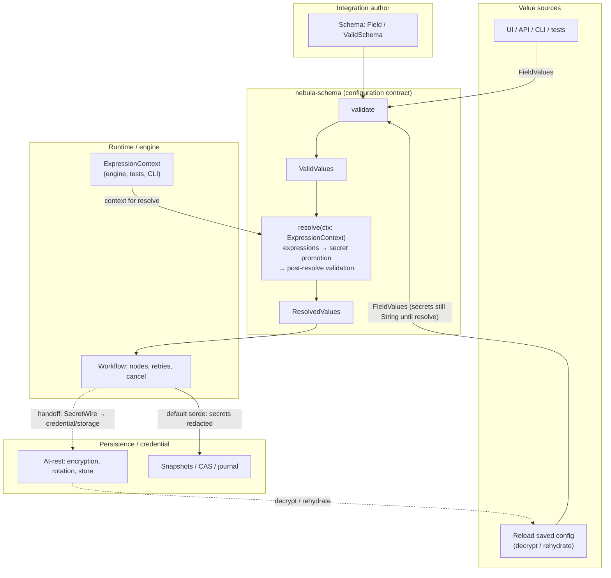

# 0034. `SecretValue` in `nebula-schema` + explicit seam to `nebula-credential`

## Context

`Field::Secret` exists, but wire and in-memory values still use `FieldValue::Literal(serde_json::Value::String(_))` — the same representation as a normal string. That breaks three properties the integration model promises for credentials and actions:

- **In-memory distinction** — debug/logging/serde cannot tell “password material” from plain text.
- **Proof-token honesty** — `ResolvedValues` is documented as the post-resolution tree, but nothing prevents consumers from reading secrets through the same `get()` path as public fields.
- **Layering** — encryption at rest, rotation, and HSM-adjacent work stay in `nebula-credential` / storage, while schema must only define **field semantics** and **safe defaults** (redaction, opt-in wire exposure, optional KDF at resolve time). Without an explicit seam, new code tends to re-invent ad-hoc `String` secrets in engine-adjacent crates.

Phase 3 of the nebula-schema design
(`docs/superpowers/specs/2026-04-16-nebula-schema-phase3-security-design.md`) specifies `SecretValue`, `Zeroize`, `SecretWire`, optional KDF parameters on `SecretField`, `ResolvedValues::get_secret`, and a redacted view for loader context.

## Decision

1. **Own `SecretValue` in `nebula-schema`.** The type lives in `crates/schema/src/secret.rs` and appears in the value tree as `FieldValue::SecretLiteral(SecretValue)` after **resolve-time promotion** from string literals. Default JSON serialization of secret-bearing values **redacts**; plaintext on the wire to encrypted stores uses **`SecretWire`**, with call sites kept auditable (credential/storage paths).

2. **`nebula-credential` does not duplicate `SecretValue`’s in-memory role.** It continues to own encryption-at-rest, `AuthScheme` material, orchestration, and store APIs. When persisting or migrating user input, the boundary converts using explicit APIs (e.g. `From` / `SecretWire` / `expose()`), rather than a second, competing secret string type in the credential crate. Follow-up PRs in the credential series wire `get_secret` / `SecretWire` as needed; this ADR only fixes the schema side of the contract.

3. **Predicate / root-rule JSON at schema-time** — `FieldValues::to_json` is still used to build the object passed to root `Rule`s. **Before** resolution, secret fields are plain strings (unchanged from today’s behavior). **After** `ValidValues::resolve` promotes secrets, repeated validation uses `FieldValue::to_json` rules that **redact** `SecretLiteral`, so post-resolve root rules and downstream JSON snapshots do not re-introduce plaintext through `to_json` for promoted secrets.

4. **Loader callbacks** get `LoaderContext::with_secrets_redacted` when callers pass a `&ValidSchema`, replacing secret-shaped subtree values with a stable placeholder for dependency injection into loaders, matching the design spec’s “no accidental leak to loader” intent.

5. **KDF (optional) on `SecretField`** is represented as `Option<KdfParams>` with at least one concrete variant in-tree (Argon2id) so the resolve step can replace a user-provided string with a `SecretValue::Bytes` hash without claiming encryption-at-rest — that remains credential/storage.

## Consequences

- [L2] New field variant and resolve semantics require seam tests in `nebula-schema` and documentation touch points (`CHANGELOG`, `GLOSSARY` for `SecretValue` / `get_secret`, crate `lib.rs` module list).
- Callers that previously used `ResolvedValues::get` for secret keys must switch to `get_secret`; `get` returns `None` for `Field::Secret` to enforce the “no accidental plain `serde_json::Value`” rule.
- **security-lead** review is merge-blocking for this workstream per `docs/plans/nebula-schema-pr2-phase3-security.md` (complements this ADR).

## Non-decisions (explicit)

- **Key management, KMS, envelope encryption** — out of scope; see ADR-0028 series for credential home crates.
- **Global `clippy::disallowed_methods` on `SecretWire::new`** — may follow in a follow-up that touches workspace lint config; not required to accept this ADR.

## Configuration pipeline (diagram)

**Also duplicated** in [`docs/INTEGRATION_MODEL.md`](../INTEGRATION_MODEL.md) (same Mermaid + notes). When the pipeline changes, update **both** files so the integration model and this ADR stay aligned.

End-to-end view: all value sources funnel through **one** schema validation step into the **`ValidValues` proof token**; **`resolve`** (also in `nebula-schema`) consumes an `ExpressionContext` from runtime and yields **`ResolvedValues`**; workflow execution persists snapshots and hands secret material to credential/storage via an explicit boundary (the workflow is **not** “the encryption implementation”).

**Dashed edges:** `ENC -.-> LOAD` is **data flow** (decrypt / materialize into loader input). `WF -.-> ENC` is a **trust boundary handoff** (runtime initiates persistence; encryption-at-rest stays in credential/storage — see [ADR-0028](0028-cross-crate-credential-invariants.md) / [ADR-0029](0029-storage-owns-credential-persistence.md)).

**Security note — plaintext lifetime:** Before `resolve`, secret-shaped fields live as ordinary `String` inside `FieldValues`. **`ValidValues::resolve`** promotes them to `FieldValue::SecretLiteral(SecretValue)` and re-validates. After promotion, `SecretValue` redacts in `Debug` / `Display` / default `Serialize`; intentional plaintext exit points are **audited** (`expose()` with `#[track_caller]`, `SecretWire` for stores). Snapshots written through default serialization paths should treat secrets as **redacted on the wire**; **`LOAD` trust** depends on storage integrity and the decrypt path (credential/storage plane — see [ADR-0029](0029-storage-owns-credential-persistence.md)).

**Where `S` lives:** today the **shape** of `ValidSchema` comes from **author-time Rust** in integration/plugin crates (and registry wiring), not from the snapshot store. Persisted artifacts are **config values and history** (`SNAP`), not the Rust type graph. If product ever versions **schema definitions as data**, the diagram can gain an optional `SNAP -.-> S` edge; until then, keeping `S` only under **author** avoids visual clutter.

**Non-decision (diagram scope):** `resolve` is treated as **synchronous** here; async resolve, cancellation mid-flight, and “partial promotion” safety are not modeled in this picture.
