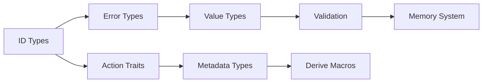

# NEBULA DOCUMENTATION - ALL FILES

---
## FILE: docs/README.md
---

# Nebula Workflow Engine

Nebula - это высокопроизводительный workflow engine, написанный на Rust, предназначенный для визуальной автоматизации процессов с фокусом на type safety, расширяемость и developer experience.

## 🎯 Ключевые особенности

- **Visual-first подход**: Интуитивный UI для создания workflows без программирования
- **Type-safe**: Строгая типизация на всех уровнях
- **Расширяемый**: Динамическая загрузка custom nodes
- **Производительный**: Zero-cost abstractions, эффективное использование памяти
- **Open Source**: Прозрачная разработка с фокусом на сообщество

## 📚 Документация

- [Архитектура](./ARCHITECTURE.md) - Общий обзор архитектуры
- [Статус проекта](./PROJECT_STATUS.md) - Текущее состояние разработки
- [Roadmap](./ROADMAP.md) - План развития
- [Технические заметки](./TECHNICAL_NOTES.md) - Детали реализации

### Документация по компонентам

- [Crates](./crates/) - Описание каждого crate
- [Roadmaps](./roadmaps/) - Детальные планы по фазам
- [Guides](./guides/) - Руководства для разработчиков

---
## FILE: docs/ARCHITECTURE.md
---

# Архитектура Nebula

## Общий обзор

Nebula построена как модульная система с четким разделением ответственности между компонентами.

### Основные принципы

1. **Type Safety First** - Максимальное использование системы типов Rust
2. **Zero-Cost Abstractions** - Производительность без компромиссов
3. **Progressive Complexity** - Простой старт, возможность глубокой кастомизации
4. **Event-Driven** - Асинхронная, event-based архитектура

### Высокоуровневая архитектура

```
┌─────────────────────────────────────────────────────────┐
│                    User Interface                        │
│              (Web UI / Desktop App / CLI)                │
└─────────────────────────────────────────────────────────┘
                            │
┌─────────────────────────────────────────────────────────┐
│                      API Layer                           │
│                  (REST + WebSocket)                       │
└─────────────────────────────────────────────────────────┘
                            │
┌─────────────────────────────────────────────────────────┐
│                  Orchestration Layer                     │
├─────────────────┬─────────────────┬────────────────────┤
│     Engine      │     Runtime     │      Workers       │
│  (Scheduling)   │   (Triggers)    │   (Execution)      │
└─────────────────┴─────────────────┴────────────────────┘
                            │
┌─────────────────────────────────────────────────────────┐
│                     Core Layer                           │
├─────────────────┬─────────────────┬────────────────────┤
│     Value       │     Memory      │    Expression      │
│    (Types)      │   (Caching)     │   (Evaluation)     │
└─────────────────┴─────────────────┴────────────────────┘
                            │
┌─────────────────────────────────────────────────────────┐
│                   Storage Layer                          │
├─────────────────┬─────────────────┬────────────────────┤
│   PostgreSQL    │  Object Store   │   Message Bus      │
│   (Metadata)    │   (Binary)      │    (Kafka)         │
└─────────────────┴─────────────────┴────────────────────┘
```

### Поток данных

1. **Workflow Definition** → API → Engine → Storage
2. **Trigger Event** → Runtime → Kafka → Engine
3. **Execution** → Worker → Node → Storage → Next Worker
4. **Results** → Storage → API → UI

### Компоненты системы

#### Core Components
- **nebula-core**: Базовые trait'ы и типы
- **serde / serde_json::Value**: Значения и сериализация (crate nebula-value не используется)
- **nebula-memory**: In-memory состояние и кеширование

#### Execution Components
- **nebula-engine**: Orchestration и scheduling
- **nebula-runtime**: Управление triggers
- **nebula-worker**: Выполнение nodes

#### Storage Components
- **nebula-storage**: Абстракции хранилища
- **nebula-binary**: Управление бинарными данными

#### Developer Components
- **nebula-sdk**: All-in-one SDK
- **nebula-derive**: Procedural macros
- **nebula-node-registry**: Управление nodes

---
## FILE: docs/PROJECT_STATUS.md
---

# Project Status

**Последнее обновление**: 2024-12-19

## Общий статус

🟡 **Pre-Alpha** - Активная разработка архитектуры

## Статус по компонентам

| Компонент | Статус | Прогресс | Примечания |
|-----------|--------|----------|------------|
| nebula-core | 🟡 Проектирование | 0% | Определены основные traits |
| nebula-memory | 🟡 Проектирование | 0% | Определена архитектура |
| nebula-derive | 🔴 Не начато | 0% | Ожидает nebula-core |
| nebula-expression | 🔴 Не начато | 0% | Требует дизайн грамматики |
| nebula-engine | 🔴 Не начато | 0% | - |
| nebula-storage | 🔴 Не начато | 0% | - |
| nebula-binary | 🔴 Не начато | 0% | - |
| nebula-runtime | 🔴 Не начато | 0% | - |
| nebula-worker | 🔴 Не начато | 0% | - |
| nebula-api | 🔴 Не начато | 0% | - |
| nebula-node-registry | 🔴 Не начато | 0% | - |
| nebula-sdk | 🔴 Не начато | 0% | - |

### Легенда
- 🟢 Готово
- 🟡 В разработке
- 🔴 Не начато
- ⚫ Заблокировано

## Текущие задачи

1. Завершить проектирование архитектуры
2. Начать имплементацию nebula-core
3. Создать POC для validation концепции

## Блокеры

- Нет текущих блокеров

## Milestone 1: Core Foundation (Phase 1)

**Цель**: Базовые компоненты для построения системы

**Deadline**: TBD

**Компоненты**:
- [ ] nebula-core
- [ ] nebula-memory
- [ ] nebula-derive (basic)

---
## FILE: docs/ROADMAP.md
---

# Nebula Complete Roadmap

## 🎯 Master Roadmap

### Phase 1: Core Foundation (Weeks 1-3)

#### 1. nebula-core (Week 1)
- [ ] 1.1 **Project Setup**
  - [ ] 1.1.1 Initialize crate structure
  - [ ] 1.1.2 Setup CI/CD pipeline
  - [ ] 1.1.3 Configure linting and formatting
  - [ ] 1.1.4 Add base dependencies

- [ ] 1.2 **Identifier Types**
  - [ ] 1.2.1 Implement WorkflowId with validation
  - [ ] 1.2.2 Implement NodeId with string normalization
  - [ ] 1.2.3 Implement ExecutionId with UUID
  - [ ] 1.2.4 Implement TriggerId
  - [ ] 1.2.5 Add Display and Debug traits
  - [ ] 1.2.6 Add serialization support
  - [ ] 1.2.7 Write property-based tests

- [ ] 1.3 **Error Handling**
  - [ ] 1.3.1 Design Error enum hierarchy
  - [ ] 1.3.2 Implement error contexts
  - [ ] 1.3.3 Add error conversion traits
  - [ ] 1.3.4 Create Result type alias
  - [ ] 1.3.5 Add error chaining support
  - [ ] 1.3.6 Write error documentation

- [ ] 1.4 **Core Traits**
  - [ ] 1.4.1 Define Action trait
  - [ ] 1.4.2 Define TriggerAction trait
  - [ ] 1.4.3 Define PollingAction trait
  - [ ] 1.4.4 Define SupplyAction trait
  - [ ] 1.4.5 Define ProcessAction trait
  - [ ] 1.4.6 Add async trait support
  - [ ] 1.4.7 Write trait documentation

- [ ] 1.5 **Metadata Types**
  - [ ] 1.5.1 Implement ActionMetadata
  - [ ] 1.5.2 Implement NodeMetadata
  - [ ] 1.5.3 Implement WorkflowMetadata
  - [ ] 1.5.4 Implement ParameterDescriptor
  - [ ] 1.5.5 Add builder patterns
  - [ ] 1.5.6 Add validation logic

#### 2. Value layer: serde / serde_json::Value (Week 1-2)
Отдельный crate nebula-value не используется.
- [ ] 2.1 Использовать `serde_json::Value` для данных workflow, serde для сериализации
- [ ] 2.2 Валидаторы поверх Value (nebula-validator / core), интеграция с параметрами

#### 3. nebula-memory (Week 2)
- [ ] 3.1 **Core Structure**
  - [ ] 3.1.1 Create NebulaMemory struct
  - [ ] 3.1.2 Implement ExecutionMemory
  - [ ] 3.1.3 Implement ResourceMemory
  - [ ] 3.1.4 Implement TriggerMemory
  - [ ] 3.1.5 Add memory configuration
  - [ ] 3.1.6 Add builder pattern

- [ ] 3.2 **Caching System**
  - [ ] 3.2.1 Define Cache trait
  - [ ] 3.2.2 Implement LRU cache
  - [ ] 3.2.3 Implement TTL cache
  - [ ] 3.2.4 Add cache statistics
  - [ ] 3.2.5 Add eviction callbacks
  - [ ] 3.2.6 Add cache warming

- [ ] 3.3 **Resource Pooling**
  - [ ] 3.3.1 Create ObjectPool generic
  - [ ] 3.3.2 Add pool configuration
  - [ ] 3.3.3 Implement health checking
  - [ ] 3.3.4 Add pool metrics
  - [ ] 3.3.5 Add async acquisition
  - [ ] 3.3.6 Add timeout handling

- [ ] 3.4 **Memory Optimization**
  - [ ] 3.4.1 Implement StringInterner
  - [ ] 3.4.2 Implement CowStorage
  - [ ] 3.4.3 Add memory budgets
  - [ ] 3.4.4 Add pressure monitoring
  - [ ] 3.4.5 Implement auto-eviction
  - [ ] 3.4.6 Add memory profiling

#### 4. nebula-derive (Week 3)
- [ ] 4.1 **Macro Setup**
  - [ ] 4.1.1 Create proc-macro crate
  - [ ] 4.1.2 Setup syn and quote
  - [ ] 4.1.3 Add error handling
  - [ ] 4.1.4 Setup testing framework

- [ ] 4.2 **Parameters Derive**
  - [ ] 4.2.1 Parse struct attributes
  - [ ] 4.2.2 Generate parameter_collection()
  - [ ] 4.2.3 Generate from_values()
  - [ ] 4.2.4 Add validation attributes
  - [ ] 4.2.5 Add display attributes
  - [ ] 4.2.6 Generate documentation

- [ ] 4.3 **Action Derive**
  - [ ] 4.3.1 Parse action attributes
  - [ ] 4.3.2 Generate metadata
  - [ ] 4.3.3 Generate boilerplate
  - [ ] 4.3.4 Add node attributes
  - [ ] 4.3.5 Validate at compile time

### Phase 2: Execution Engine (Weeks 4-6)

[Продолжение в том же формате для всех остальных фаз и компонентов...]

---
## FILE: docs/TECHNICAL_NOTES.md
---

# Technical Notes

## Архитектурные решения

### 1. Почему Rust?

**Причины выбора**:
- Zero-cost abstractions для производительности
- Memory safety без GC
- Отличная поддержка async
- Strong type system
- Great ecosystem

**Альтернативы рассмотрены**:
- Go: Проще, но менее выразительная система типов
- C++: Сложнее, больше footguns
- Java/C#: GC overhead неприемлем для нашего use case

### 2. Event-driven vs Direct execution

**Выбрано**: Event-driven через Kafka

**Причины**:
- Лучшая масштабируемость
- Natural fault tolerance
- Easier debugging (event log)
- Возможность replay

**Trade-offs**:
- Сложнее initial setup
- Небольшой overhead на сериализацию
- Требует external dependency (Kafka)

### 3. Plugin system через dynamic libraries

**Выбрано**: libloading с convention-based discovery

**Причины**:
- Нативная производительность
- Простота для Rust разработчиков
- Нет overhead на IPC

**Альтернативы**:
- WASM: Безопаснее, но overhead и ограничения
- gRPC: Проще изоляция, но network overhead
- Embedded scripting: Ограниченные возможности

### 4. Type system design

**Принципы**:
- Максимум проверок at compile time
- Rich types вместо примитивов
- Explicit conversions
- No implicit coercions

**Примеры**:
```rust
// ❌ Плохо
fn set_timeout(seconds: i32) { }

// ✅ Хорошо  
fn set_timeout(timeout: Duration) { }
```

### 5. Memory management strategy

**Подход**:
- Arena allocation для execution context
- Object pooling для переиспользуемых ресурсов
- Copy-on-write для больших данных
- String interning для повторяющихся строк

**Метрики целевые**:
- Node execution overhead: <1ms
- Memory per execution: <10MB base
- Concurrent executions: 10k+ per worker

## Технические долги

### Признанные компромиссы

1. **Kafka dependency с самого начала**
   - Risk: Сложность для self-hosted
   - Mitigation: Абстракция для замены на Redis Streams

2. **PostgreSQL only для MVP**
   - Risk: Vendor lock-in
   - Mitigation: Storage trait позволит добавить другие БД

3. **No WASM support initially**
   - Risk: Ограничены Rust nodes
   - Mitigation: Можно добавить позже без breaking changes

## Производительность

### Целевые метрики

| Метрика | Цель | Примечание |
|---------|------|------------|
| Node execution latency | <10ms | Для простых nodes |
| Workflow start latency | <100ms | От trigger до первого node |
| Throughput | 1000 exec/sec | На single worker |
| Memory usage | <1GB | Base worker memory |
| Concurrent workflows | 10k+ | На single instance |

### Оптимизации

1. **Lazy loading** для nodes
2. **Batch processing** в Kafka
3. **Connection pooling** везде
4. **Smart caching** с TTL
5. **Zero-copy** где возможно

## Security Considerations

### Threat Model

1. **Malicious nodes**
   - Mitigation: Capability system
   - Future: Full sandboxing

2. **Resource exhaustion**
   - Mitigation: Resource limits
   - Monitoring

3. **Data leakage**
   - Mitigation: Execution isolation
   - Credential encryption

### Security Roadmap

- [ ] Phase 1: Basic validation
- [ ] Phase 2: Resource limits
- [ ] Phase 3: Capability system
- [ ] Phase 4: Sandboxing
- [ ] Phase 5: Full audit

---
## FILE: docs/crates/nebula-core.md
---

# nebula-core

## Назначение

`nebula-core` - это фундаментальный crate, содержащий базовые trait'ы, типы и абстракции, используемые во всей системе Nebula.

## Ответственность

- Определение основных trait'ов (Action, TriggerAction, etc.)
- Базовые типы данных (WorkflowId, NodeId, ExecutionId)
- Error types
- Common utilities

## Архитектура

### Основные компоненты

```rust
// Traits
pub trait Action { }
pub trait TriggerAction: Action { }
pub trait PollingAction: TriggerAction { }
pub trait SupplyAction: Action { }

// Types
pub struct Workflow { }
pub struct Node { }
pub struct Execution { }

// Identifiers  
pub struct WorkflowId(Uuid);
pub struct NodeId(String);
pub struct ExecutionId(Uuid);
```

### Зависимости

- Минимальные внешние зависимости
- Только стабильные, широко используемые crates

## Roadmap

### Milestone 1: Basic Types (Week 1)
- [x] Проектирование типов
- [ ] WorkflowId, NodeId, ExecutionId
- [ ] Error types
- [ ] Basic traits

### Milestone 2: Action System (Week 1-2)
- [ ] Action trait
- [ ] TriggerAction trait
- [ ] Metadata types
- [ ] Tests

### Milestone 3: Workflow Types (Week 2)
- [ ] Workflow struct
- [ ] Node struct
- [ ] Connection types
- [ ] Validation

### Milestone 4: Documentation (Week 2-3)
- [ ] API documentation
- [ ] Examples
- [ ] Integration guide

## API Design

```rust
// Example usage
use nebula_core::prelude::*;

#[derive(Debug)]
pub struct MyAction;

impl Action for MyAction {
    type Input = String;
    type Output = String;
    
    async fn execute(&self, input: Self::Input, ctx: &ActionContext) -> Result<Self::Output> {
        Ok(input.to_uppercase())
    }
}
```

## Testing Strategy

- Unit tests для каждого компонента
- Property-based testing для ID types
- Doc tests для всех примеров

## Performance Considerations

- Zero-cost abstractions
- No allocations в hot paths
- Efficient serialization

---
## FILE: docs/crates/value-layer.md (serde / serde_json::Value)
---

# Value layer: serde / serde_json::Value

Отдельный crate nebula-value не используется. Единый тип данных в runtime — `serde_json::Value`, сериализация — через serde.

## Ответственность

- Данные workflow: `serde_json::Value`
- Сериализация/десериализация: serde
- Валидация: nebula-validator или core поверх Value

---
## FILE: docs/crates/nebula-memory.md
---

# nebula-memory

## Назначение

`nebula-memory` управляет in-memory состоянием системы, включая кеширование, resource pooling и оптимизацию использования памяти.

## Ответственность

- Execution state management
- Resource pooling (HTTP clients, DB connections)
- Caching (expressions, node outputs)
- Memory optimization (string interning, CoW)

## Архитектура

### Components

```rust
pub struct NebulaMemory {
    // Execution state
    execution_memory: Arc<ExecutionMemory>,
    
    // Resource pools
    resource_memory: Arc<ResourceMemory>,
    
    // Trigger state
    trigger_memory: Arc<TriggerMemory>,
    
    // Caching
    cache_memory: Arc<CacheMemory>,
}
```

### Memory Optimization

```rust
pub struct CacheMemory {
    // String interning
    string_interner: StringInterner,
    
    // Object pooling
    value_pool: ObjectPool<Value>,
    
    // Copy-on-write storage
    cow_storage: CowStorage<Value>,
}
```

## Roadmap

### Milestone 1: Basic Structure (Week 1)
- [ ] Core types
- [ ] Basic allocation
- [ ] Simple caching
- [ ] Tests

### Milestone 2: Resource Pooling (Week 2)
- [ ] Generic object pool
- [ ] HTTP client pool
- [ ] DB connection pool
- [ ] Pool metrics

### Milestone 3: Optimization (Week 2-3)
- [ ] String interning
- [ ] Copy-on-write
- [ ] Memory budgets
- [ ] Eviction policies

### Milestone 4: Monitoring (Week 3)
- [ ] Memory metrics
- [ ] Usage tracking
- [ ] Alerts
- [ ] Dashboard

## Usage Example

```rust
use nebula_memory::prelude::*;

// Create memory system
let memory = NebulaMemory::builder()
    .with_execution_cache_size(1000)
    .with_string_intern_capacity(10000)
    .build()?;

// Use in execution
let mut ctx = ExecutionContext::with_memory(memory);
ctx.set_node_output(node_id, large_value)?; // Automatically optimized

// Resource pooling
let client = ctx.memory()
    .resource_pool()
    .get::<HttpClient>()
    .await?;
```

## Performance Targets

- Execution state lookup: <1μs
- Resource acquisition: <10μs
- String interning: 90%+ hit rate
- Memory overhead: <20% vs raw data

[Продолжение для всех остальных файлов crates/...]

---
## FILE: docs/roadmaps/phase-1-core.md
---

# Phase 1: Core Foundation - Detailed Roadmap

## Overview

Phase 1 устанавливает фундамент для всей системы Nebula. Эта фаза критически важна, так как все последующие компоненты будут строиться на этой основе.

## Timeline: Weeks 1-3

### Week 1: Core Types and Traits

#### nebula-core (Days 1-3)
- **Day 1**: Setup и базовая структура
  - [ ] Инициализация crate
  - [ ] Настройка CI/CD
  - [ ] Базовые зависимости
  - [ ] Структура модулей

- **Day 2**: Identifier types
  - [ ] WorkflowId implementation
  - [ ] NodeId implementation  
  - [ ] ExecutionId implementation
  - [ ] TriggerId implementation
  - [ ] Tests для ID types

- **Day 3**: Error handling
  - [ ] Error enum design
  - [ ] Error contexts
  - [ ] Error conversion traits
  - [ ] Result type alias

#### Value layer: serde / serde_json::Value (Days 4-5)
- **Day 4**: Единый тип значений — `serde_json::Value`, интеграция с параметрами
- **Day 5**: Сериализация (serde), валидация поверх Value

### Week 1 Checklist
- [ ] CI/CD работает
- [ ] Все ID types готовы
- [ ] Error handling complete
- [ ] serde_json::Value в контуре данных
- [ ] Serialization тесты проходят

### Week 2: Advanced Types and Memory

#### Доп. валидация (Days 6-8)
- Валидаторы поверх serde_json::Value, извлечение типизированных полей

#### nebula-memory (Days 9-10)
- **Day 9**: Basic structure
  - [ ] NebulaMemory struct
  - [ ] ExecutionMemory
  - [ ] ResourceMemory
  - [ ] Basic allocation

- **Day 10**: Caching foundation
  - [ ] Cache traits
  - [ ] LRU implementation
  - [ ] Cache metrics
  - [ ] Eviction policies

### Week 2 Checklist
- [ ] Все value types готовы
- [ ] Validation работает
- [ ] Memory structure defined
- [ ] Basic caching работает
- [ ] 80%+ test coverage

### Week 3: Integration and Polish

#### nebula-core (Days 11-12)
- **Day 11**: Action traits
  - [ ] Action trait finalization
  - [ ] TriggerAction trait
  - [ ] SupplyAction trait
  - [ ] Trait composition tests

- **Day 12**: Metadata types
  - [ ] ActionMetadata
  - [ ] NodeMetadata
  - [ ] WorkflowMetadata
  - [ ] ParameterDescriptor

#### nebula-derive basics (Days 13-14)
- **Day 13**: Setup
  - [ ] Proc macro crate setup
  - [ ] Basic derive infrastructure
  - [ ] Error handling for macros

- **Day 14**: Simple derives
  - [ ] #[derive(NodeId)]
  - [ ] #[derive(WorkflowId)]
  - [ ] Basic validation

#### Integration (Day 15)
- **Day 15**: Cross-crate testing
  - [ ] Integration tests
  - [ ] Example workflows
  - [ ] Performance benchmarks
  - [ ] Documentation review

### Week 3 Checklist
- [ ] All traits finalized
- [ ] Basic derives working
- [ ] Integration tests pass
- [ ] Documentation complete
- [ ] Ready for Phase 2

## Success Metrics

### Code Quality
- Test coverage: >80%
- Documentation coverage: 100%
- Clippy warnings: 0
- Security audit: Pass

### Performance
- Value creation: <100ns
- Serialization: <1μs for simple values
- Memory allocation: <1KB per execution base

### Developer Experience
- Clear examples for each component
- Intuitive API
- Helpful error messages
- Complete rustdoc

## Risks and Mitigations

### Risk 1: API Design Changes
**Probability**: Medium
**Impact**: High
**Mitigation**: 
- Extensive design review
- Create POC before full implementation
- Get early feedback

### Risk 2: Performance Issues
**Probability**: Low
**Impact**: Medium
**Mitigation**:
- Benchmark from day 1
- Profile regularly
- Have optimization plan

### Risk 3: Complexity Explosion
**Probability**: Medium
**Impact**: Medium
**Mitigation**:
- Start simple
- Add features incrementally
- Regular refactoring

## Dependencies Between Tasks



## Definition of Done

### For each component:
- [ ] Code complete
- [ ] Unit tests (>80% coverage)
- [ ] Integration tests
- [ ] Documentation
- [ ] Examples
- [ ] Benchmarks
- [ ] Security review
- [ ] Performance validation

## Next Phase Preparation

### Handoff to Phase 2:
1. Stable API for core types
2. Working value system
3. Basic memory management
4. Clear integration patterns

### Required for Phase 2:
- Stable Action trait
- Working Value types
- Memory allocation system
- Error handling patterns

[Продолжение для остальных phase roadmaps...]

---
## FILE: docs/guides/getting-started.md
---

# Getting Started with Nebula

Welcome to Nebula! This guide will help you get started with creating your first workflow.

## Installation

### Prerequisites
- Rust 1.93 or higher
- PostgreSQL 14+
- Kafka (optional for development)

### Clone and Build
```bash
git clone https://github.com/yourusername/nebula.git
cd nebula
cargo build --release
```

## Your First Workflow

### 1. Create a Simple Node
```rust
use nebula_sdk::prelude::*;

#[derive(Action, Parameters)]
#[action(
    id = "hello_world",
    name = "Hello World",
    category = "Examples"
)]
pub struct HelloWorldNode {
    #[param(label = "Name", default = "World")]
    name: String,
}

#[async_trait]
impl ExecutableNode for HelloWorldNode {
    type Output = String;
    
    async fn execute(&self, ctx: &ExecutionContext) -> Result<Self::Output> {
        Ok(format!("Hello, {}!", self.name))
    }
}
```

### 2. Register Your Node
```rust
use nebula_node_registry::NodeRegistry;

let mut registry = NodeRegistry::new();
registry.register(HelloWorldNode)?;
```

### 3. Create a Workflow
```json
{
  "id": "my-first-workflow",
  "name": "My First Workflow",
  "nodes": [
    {
      "id": "hello",
      "type": "hello_world",
      "parameters": {
        "name": "Nebula User"
      }
    }
  ]
}
```

## Next Steps
- Read the [Node Development Guide](./node-development.md)
- Explore [Standard Nodes](../crates/)
- Join our [Community](https://github.com/yourusername/nebula/discussions)

---
## FILE: docs/guides/node-development.md
---

# Node Development Guide

This guide covers everything you need to know about developing custom nodes for Nebula.

## Basic Node Structure

### Simple Function Node
```rust
use nebula_sdk::prelude::*;

#[node]
async fn uppercase(input: String) -> Result<String> {
    Ok(input.to_uppercase())
}
```

### Parameterized Node
```rust
#[derive(Action, Parameters)]
pub struct HttpRequestNode {
    #[param(required, label = "URL")]
    url: String,
    
    #[param(
        label = "Method",
        default = "GET",
        options = ["GET", "POST", "PUT", "DELETE"]
    )]
    method: String,
    
    #[param(label = "Headers", optional)]
    headers: HashMap<String, String>,
}
```

## Parameter Types

### Text Parameters
```rust
#[param(
    type = "text",
    label = "API Key",
    placeholder = "Enter your API key",
    validation = "min_length:10"
)]
api_key: String,
```

### Number Parameters
```rust
#[param(
    type = "number",
    label = "Timeout",
    min = 1,
    max = 300,
    default = 30
)]
timeout_seconds: u32,
```

### Select Parameters
```rust
#[param(
    type = "select",
    label = "Region",
    options = ["us-east-1", "eu-west-1", "ap-south-1"],
    default = "us-east-1"
)]
region: String,
```

## Advanced Features

### Using Resources
```rust
impl ExecutableNode for DatabaseQueryNode {
    async fn execute(&self, ctx: &ExecutionContext) -> Result<Value> {
        // Get database connection from pool
        let db = ctx.resource_pool()
            .get::<DatabaseConnection>()
            .await?;
            
        let result = sqlx::query(&self.query)
            .fetch_all(&db)
            .await?;
            
        Ok(json!(result))
    }
}
```

### Error Handling
```rust
#[derive(Debug, thiserror::Error)]
pub enum MyNodeError {
    #[error("Invalid configuration: {0}")]
    InvalidConfig(String),
    
    #[error("External API error: {0}")]
    ApiError(#[from] reqwest::Error),
}
```

### Testing Your Node
```rust
#[cfg(test)]
mod tests {
    use super::*;
    use nebula_sdk::testing::*;
    
    #[tokio::test]
    async fn test_my_node() {
        let ctx = MockContext::new();
        let node = MyNode { param: "test".into() };
        
        let result = node.execute(&ctx).await;
        assert!(result.is_ok());
    }
}
```

## Best Practices

1. **Keep nodes focused** - Each node should do one thing well
2. **Use descriptive names** - Both for the node and its parameters
3. **Handle errors gracefully** - Provide helpful error messages
4. **Document your node** - Include examples and edge cases
5. **Test thoroughly** - Include unit and integration tests

---
## FILE: docs/guides/contributing.md
---

# Contributing to Nebula

Thank you for your interest in contributing to Nebula! This guide will help you get started.

## Getting Started

1. Fork the repository
2. Clone your fork
3. Create a feature branch
4. Make your changes
5. Submit a pull request

## Development Setup

```bash
# Clone the repo
git clone https://github.com/yourusername/nebula.git
cd nebula

# Install dependencies
cargo build

# Run tests
cargo test

# Run with all features
cargo test --all-features
```

## Code Style

We use standard Rust formatting:
```bash
cargo fmt -- --check
cargo clippy -- -D warnings
```

## Testing

All new features must include tests:
- Unit tests for individual components
- Integration tests for cross-crate functionality
- Documentation tests for examples

## Documentation

- All public APIs must be documented
- Include examples in doc comments
- Update relevant guides

## Pull Request Process

1. Update the CHANGELOG.md
2. Update documentation
3. Ensure all tests pass
4. Request review from maintainers

## Code of Conduct

Please note we have a code of conduct, please follow it in all your interactions with the project.

## Questions?

Feel free to open an issue or join our Discord community!
