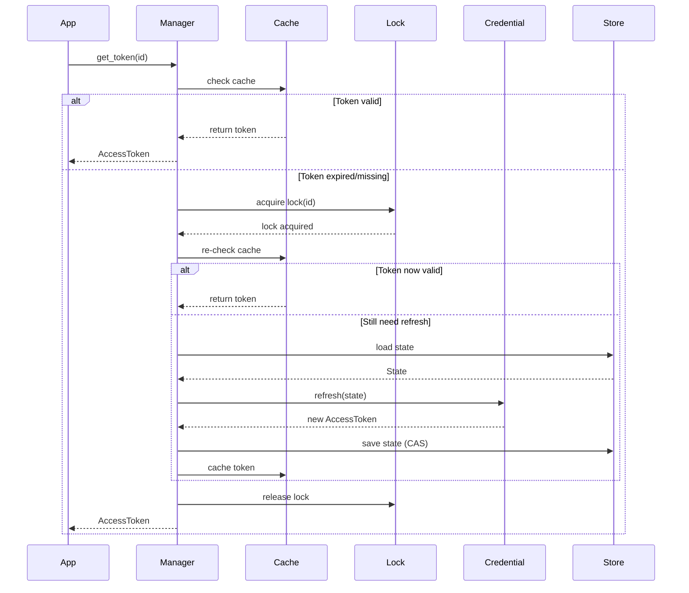

# Nebula Credential System - Complete Architecture

## 🏗️ System Architecture Overview

```
┌─────────────────────────────────────────────────────────────────┐
│                         Application Layer                        │
│  ┌──────────────┐  ┌──────────────┐  ┌──────────────┐         │
│  │   Actions    │  │   Services   │  │   Workers    │         │
│  └──────┬───────┘  └──────┬───────┘  └──────┬───────┘         │
└─────────┼──────────────────┼──────────────────┼─────────────────┘
          │                  │                  │
          ▼                  ▼                  ▼
┌─────────────────────────────────────────────────────────────────┐
│                    Credential Manager API                        │
│  ┌────────────────────────────────────────────────────────┐    │
│  │  get_token(id) → AccessToken                           │    │
│  │  create_credential(type, input) → CredentialId         │    │
│  │  refresh_credential(id) → AccessToken                  │    │
│  │  revoke_credential(id) → ()                           │    │
│  └────────────────────────────────────────────────────────┘    │
└─────────────────────────────────────────────────────────────────┘
          │
          ▼
┌─────────────────────────────────────────────────────────────────┐
│                     Core Components                              │
│                                                                  │
│  ┌──────────────┐  ┌──────────────┐  ┌──────────────┐         │
│  │   Manager    │  │   Registry   │  │ Authenticator│         │
│  │              │  │              │  │              │         │
│  │ • Get Token  │  │ • OAuth2     │  │ • HTTP       │         │
│  │ • Refresh    │  │ • API Key    │  │ • gRPC       │         │
│  │ • Cache      │  │ • AWS        │  │ • WebSocket  │         │
│  │ • Lock       │  │ • Telegram   │  │ • Database   │         │
│  └──────┬───────┘  └──────┬───────┘  └──────────────┘         │
└─────────┼──────────────────┼────────────────────────────────────┘
          │                  │
          ▼                  ▼
┌─────────────────────────────────────────────────────────────────┐
│                    Storage & Caching Layer                       │
│                                                                  │
│  ┌────────────┐  ┌────────────┐  ┌────────────┐  ┌──────────┐ │
│  │   State    │  │   Token    │  │  Negative  │  │   Audit  │ │
│  │   Store    │  │   Cache    │  │   Cache    │  │    Log   │ │
│  │            │  │            │  │            │  │          │ │
│  │ • Postgres │  │ • Redis L2 │  │ • Memory   │  │ • S3     │ │
│  │ • DynamoDB │  │ • Memory L1│  │ • Redis    │  │ • Kafka  │ │
│  └────────────┘  └────────────┘  └────────────┘  └──────────┘ │
└─────────────────────────────────────────────────────────────────┘
          │
          ▼
┌─────────────────────────────────────────────────────────────────┐
│                    Infrastructure Layer                          │
│                                                                  │
│  ┌────────────┐  ┌────────────┐  ┌────────────┐  ┌──────────┐ │
│  │   Redis    │  │     KMS    │  │ Distributed│  │  Metrics │ │
│  │            │  │            │  │    Lock    │  │          │ │
│  │ • Tokens   │  │ • AWS KMS  │  │ • Redis    │  │ • Prom   │ │
│  │ • Locks    │  │ • Vault    │  │ • etcd     │  │ • OTel   │ │
│  └────────────┘  └────────────┘  └────────────┘  └──────────┘ │
└─────────────────────────────────────────────────────────────────┘
```

## 📦 Module Structure

```
nebula-credential/
├── Cargo.toml
├── src/
│   ├── lib.rs                    # Public API exports
│   │
│   ├── core/                     # Core types and traits
│   │   ├── mod.rs
│   │   ├── credential.rs         # Credential trait
│   │   ├── token.rs             # AccessToken type
│   │   ├── secure.rs            # SecureString with zeroization
│   │   ├── ephemeral.rs         # Ephemeral<T> wrapper
│   │   ├── state.rs             # CredentialState trait
│   │   ├── error.rs             # CredentialError enum
│   │   └── context.rs           # CredentialContext
│   │
│   ├── manager/                  # Credential management
│   │   ├── mod.rs
│   │   ├── manager.rs           # CredentialManager implementation
│   │   ├── cache.rs             # Token caching logic
│   │   ├── refresh.rs           # Refresh orchestration
│   │   ├── policy.rs            # RefreshPolicy configuration
│   │   └── registry.rs          # Credential type registry
│   │
│   ├── storage/                  # Persistence layer
│   │   ├── mod.rs
│   │   ├── traits.rs            # StateStore trait
│   │   ├── postgres.rs          # PostgreSQL backend
│   │   ├── dynamodb.rs          # DynamoDB backend
│   │   └── memory.rs            # In-memory backend (testing)
│   │
│   ├── cache/                    # Caching implementations
│   │   ├── mod.rs
│   │   ├── redis.rs             # Redis token cache
│   │   ├── encrypted.rs         # Encrypted cache wrapper
│   │   └── tiered.rs            # L1/L2 cache hierarchy
│   │
│   ├── lock/                     # Distributed locking
│   │   ├── mod.rs
│   │   ├── traits.rs            # DistributedLock trait
│   │   ├── redis.rs             # Redis-based locks
│   │   └── memory.rs            # In-memory locks (testing)
│   │
│   ├── credentials/              # Built-in credential types
│   │   ├── mod.rs
│   │   │
│   │   ├── oauth2/              # OAuth 2.0 implementation
│   │   │   ├── mod.rs
│   │   │   ├── credential.rs   # OAuth2Credential
│   │   │   ├── client.rs       # OAuth2Client
│   │   │   ├── state.rs        # OAuth2State
│   │   │   ├── provider.rs     # Provider trait & profiles
│   │   │   ├── flows.rs        # Auth code, device, client creds
│   │   │   └── oidc.rs         # ID token verification
│   │   │
│   │   ├── providers/           # OAuth2 provider implementations
│   │   │   ├── google.rs       # Google with extras
│   │   │   ├── microsoft.rs    # Azure AD
│   │   │   ├── github.rs       # GitHub
│   │   │   ├── salesforce.rs   # Salesforce with instance_url
│   │   │   └── custom.rs       # Generic OAuth2
│   │   │
│   │   ├── apikey/              # API Key credentials
│   │   │   ├── mod.rs
│   │   │   ├── basic.rs        # Basic API key
│   │   │   ├── bearer.rs       # Bearer token
│   │   │   └── telegram.rs     # Telegram bot token
│   │   │
│   │   ├── aws/                 # AWS credentials
│   │   │   ├── mod.rs
│   │   │   ├── credential.rs   # AwsCredential
│   │   │   ├── sigv4.rs        # SigV4 signing
│   │   │   └── sts.rs          # STS assume role
│   │   │
│   │   ├── database/            # Database credentials
│   │   │   ├── postgres.rs     # PostgreSQL
│   │   │   ├── mysql.rs        # MySQL
│   │   │   └── mongodb.rs      # MongoDB
│   │   │
│   │   └── ldap/                # LDAP credentials
│   │       ├── simple.rs       # Simple bind
│   │       └── sasl.rs         # SASL auth
│   │
│   ├── authn/                    # Client authenticators
│   │   ├── mod.rs
│   │   ├── traits.rs            # ClientAuthenticator trait
│   │   ├── http.rs              # HTTP Bearer/Basic
│   │   ├── grpc.rs              # gRPC metadata
│   │   ├── websocket.rs         # WebSocket auth
│   │   └── database.rs          # Database connection auth
│   │
│   ├── security/                 # Security features
│   │   ├── mod.rs
│   │   ├── kms.rs               # KMS client trait
│   │   ├── encryption.rs        # At-rest encryption
│   │   ├── audit.rs             # Audit logging
│   │   └── validation.rs        # Input validation
│   │
│   ├── interactive/              # Interactive auth flows
│   │   ├── mod.rs
│   │   ├── browser.rs           # Browser-based OAuth
│   │   ├── device.rs            # Device code flow
│   │   └── cli.rs               # CLI prompts
│   │
│   └── testing/                  # Test utilities
│       ├── mod.rs
│       ├── mocks.rs             # Mock implementations
│       ├── fixtures.rs          # Test fixtures
│       └── helpers.rs           # Test helpers
```

## 🔑 Core Concepts

### 1. Credential Lifecycle

```rust
// 1. Definition
pub struct MyCredential;

impl Credential for MyCredential {
    type Input = MyInput;    // Initial configuration
    type State = MyState;    // Persistent state
    
    async fn initialize(input: Input) -> (State, Option<AccessToken>)
    async fn refresh(state: &mut State) -> AccessToken
}

// 2. Registration
manager.register_credential_type::<MyCredential>();

// 3. Creation
let id = manager.create_credential("my_credential", input).await?;

// 4. Usage
let token = manager.get_token(&id).await?;  // Auto-refresh if needed

// 5. Revocation
manager.revoke_credential(&id).await?;
```

### 2. State Management

```rust
State Separation:
┌─────────────────────────────────────┐
│           Persistent State           │
│  • Refresh tokens                    │
│  • Client credentials                │
│  • Configuration                     │
│  • Provider extras                   │
└─────────────────────────────────────┘
           ▼ Stored in StateStore
           
┌─────────────────────────────────────┐
│           Ephemeral Data             │
│  • Access tokens → Cache             │
│  • Temp values → Ephemeral<T>        │
│  • Metrics → Never persisted         │
└─────────────────────────────────────┘
           ▼ Stored in TokenCache
```

### 3. Refresh Flow



## 🛡️ Security Architecture

### 1. Secret Management

```
┌──────────────────────────────────────────┐
│          Secret Lifecycle                 │
│                                           │
│  Input → SecureString → Encrypted<T>     │
│    ↓         ↓              ↓            │
│  Clear   Zeroized      KMS Encrypted     │
│                                           │
└──────────────────────────────────────────┘

Features:
• Automatic memory zeroization (secrecy + zeroize)
• Constant-time comparison (subtle)
• Base64 serialization only
• KMS encryption at rest
• No secrets in logs (redacted Debug)
```

### 2. Concurrency Control

```
┌──────────────────────────────────────────┐
│         Distributed Locking               │
│                                           │
│  Process A ──┐                           │
│              ├→ Redis Lock → Refresh     │
│  Process B ──┘    (single)               │
│                                           │
│  Features:                                │
│  • Auto-renewal for long operations      │
│  • Lost lock detection                   │
│  • CAS for state updates                 │
│  • Negative cache for errors             │
└──────────────────────────────────────────┘
```

## 📊 Performance Optimizations

### 1. Tiered Caching

```
Request → L1 Cache (Local Memory, 10s TTL)
            ↓ miss
          L2 Cache (Redis, 5min TTL cap)
            ↓ miss
          Refresh (with distributed lock)
```

### 2. Refresh Strategy

```rust
RefreshPolicy {
    threshold: 0.8,        // Refresh at 80% of TTL
    skew: 45s,            // Safety margin
    jitter: 0-5s,         // Prevent thundering herd
    max_age: 1h,          // Force refresh for eternal tokens
    neg_cache_ttl: 60s,   // Error cool-off
}
```

## 🔌 Integration Points

### 1. With Actions

```rust
#[derive(Action)]
#[auth(oauth2_google, api_key)]
pub struct MyAction;

impl ProcessAction for MyAction {
    async fn execute(&self, ctx: &Context) -> Result<Output> {
        // Tokens automatically injected
        let google_client = ctx.get_client::<GoogleClient>("oauth2_google").await?;
        let api_client = ctx.get_client::<ApiClient>("api_key").await?;
    }
}
```

### 2. Client Authenticators

```rust
// HTTP
let req = reqwest::Request::new();
let req = HttpBearer.authenticate(req, token).await?;

// gRPC
let req = tonic::Request::new(payload);
let req = GrpcBearer.authenticate(req, token).await?;

// WebSocket
let ws = WebSocketAuth.authenticate(ws, token).await?;

// Database
let conn = PostgresAuth.authenticate(config, token).await?;
```

## 🧪 Testing Strategy

```rust
// Unit Tests - Mock everything
let store = MockStateStore::new();
let lock = MemoryDistributedLock::new();
let manager = CredentialManager::new(store, lock);

// Integration Tests - Real Redis
#[tokio::test]
#[ignore]
async fn test_concurrent_refresh() {
    let redis = setup_test_redis().await;
    // Test with real Redis locks
}

// Property Tests - Invariants
proptest! {
    #[test]
    fn secure_string_never_leaks(s in "\\PC*") {
        let secure = SecureString::new(s);
        let serialized = serde_json::to_string(&secure)?;
        assert!(!serialized.contains(&s));
    }
}
```

## 📈 Metrics & Observability

```rust
Metrics Collected:
• credential.cache.hit/miss
• credential.refresh.start/success/error
• credential.refresh.duration
• credential.lock.acquired/contended
• credential.state.save.success/conflict

Traces:
• credential.get span
  └── cache.lookup span
  └── lock.acquire span
  └── refresh span
      └── state.load span
      └── token.refresh span
      └── state.save span

Audit Events:
• CredentialCreated
• CredentialRefreshed
• CredentialRevoked
• CredentialAccessed
```

## 🚀 Production Deployment

### 1. Environment Configuration

```yaml
# Kubernetes ConfigMap
apiVersion: v1
kind: ConfigMap
metadata:
  name: credential-config
data:
  REDIS_URL: "redis://redis-cluster:6379"
  STATE_STORE: "postgres"
  KMS_PROVIDER: "aws"
  REFRESH_THRESHOLD: "0.8"
  TOKEN_CACHE_TTL: "300"
```

### 2. High Availability Setup

```
┌─────────────────────────────────────────┐
│         Multi-Region Setup               │
│                                          │
│  Region A          Region B              │
│  ┌──────┐          ┌──────┐             │
│  │ App  │          │ App  │             │
│  └──┬───┘          └──┬───┘             │
│     │                 │                  │
│     ▼                 ▼                  │
│  ┌──────┐          ┌──────┐             │
│  │Redis │◄────────►│Redis │  Replicated │
│  └──────┘          └──────┘             │
│     │                 │                  │
│     ▼                 ▼                  │
│  ┌──────────────────────┐               │
│  │   Global Database    │               │
│  └──────────────────────┘               │
└─────────────────────────────────────────┘
```

## 💡 Key Design Decisions

1. **State Independence**: Refresh uses only State, no Input access
2. **Ephemeral Separation**: Access tokens never in persistent state
3. **Type Safety**: No runtime downcasts, compile-time guarantees
4. **Zero-Copy Security**: Secrets zeroized, never logged
5. **Distributed Safety**: CAS + locks prevent races
6. **Provider Extensibility**: Profile + Hooks pattern for OAuth2
7. **Tiered Performance**: L1/L2 cache with smart refresh
8. **Error Resilience**: Negative cache, exponential backoff

This architecture provides a **production-grade**, **scalable**, and **secure** credential management system ready for any deployment scenario.