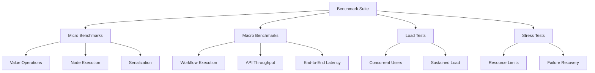

# Performance Benchmarks

## Overview

This document outlines the performance benchmarking strategy for Nebula, including benchmark suites, performance targets, optimization techniques, and continuous performance monitoring.

## Benchmark Architecture



## Micro Benchmarks

### Value System Benchmarks

```rust
// benches/value_benchmarks.rs
use criterion::{black_box, criterion_group, criterion_main, Criterion, BenchmarkId};
use nebula_value::prelude::*;

fn value_creation_benchmark(c: &mut Criterion) {
    let mut group = c.benchmark_group("value_creation");
    
    group.bench_function("string_small", |b| {
        b.iter(|| {
            let value = StringValue::new(black_box("hello world"));
            black_box(value);
        });
    });
    
    group.bench_function("string_large", |b| {
        let large_string = "x".repeat(10_000);
        b.iter(|| {
            let value = StringValue::new(black_box(&large_string));
            black_box(value);
        });
    });
    
    group.bench_function("integer", |b| {
        b.iter(|| {
            let value = IntegerValue::new(black_box(42));
            black_box(value);
        });
    });
    
    group.bench_function("array_small", |b| {
        b.iter(|| {
            let value = ArrayValue::from_vec(vec![
                Value::Integer(1),
                Value::Integer(2),
                Value::Integer(3),
            ]);
            black_box(value);
        });
    });
    
    group.bench_function("object_small", |b| {
        b.iter(|| {
            let mut map = HashMap::new();
            map.insert("name".to_string(), Value::String("test".into()));
            map.insert("age".to_string(), Value::Integer(25));
            let value = ObjectValue::from_map(map);
            black_box(value);
        });
    });
    
    group.finish();
}

fn value_validation_benchmark(c: &mut Criterion) {
    let mut group = c.benchmark_group("value_validation");
    
    let string_validator = StringValidator {
        min_length: Some(5),
        max_length: Some(100),
        pattern: Some(Regex::new(r"^[a-zA-Z0-9]+$").unwrap()),
    };
    
    group.bench_function("string_valid", |b| {
        let value = StringValue::new("hello123");
        b.iter(|| {
            let result = string_validator.validate(black_box(&value));
            black_box(result);
        });
    });
    
    group.bench_function("string_invalid", |b| {
        let value = StringValue::new("hi!");
        b.iter(|| {
            let result = string_validator.validate(black_box(&value));
            black_box(result);
        });
    });
    
    group.finish();
}

fn serialization_benchmark(c: &mut Criterion) {
    let mut group = c.benchmark_group("serialization");
    
    let test_value = Value::Object(ObjectValue::from_map(hashmap! {
        "id".to_string() => Value::Integer(12345),
        "name".to_string() => Value::String("Test User".into()),
        "tags".to_string() => Value::Array(vec![
            Value::String("admin".into()),
            Value::String("verified".into()),
        ].into()),
    }));
    
    group.bench_function("serialize_json", |b| {
        b.iter(|| {
            let json = serde_json::to_string(black_box(&test_value)).unwrap();
            black_box(json);
        });
    });
    
    group.bench_function("deserialize_json", |b| {
        let json = serde_json::to_string(&test_value).unwrap();
        b.iter(|| {
            let value: Value = serde_json::from_str(black_box(&json)).unwrap();
            black_box(value);
        });
    });
    
    group.bench_function("serialize_bincode", |b| {
        b.iter(|| {
            let bytes = bincode::serialize(black_box(&test_value)).unwrap();
            black_box(bytes);
        });
    });
    
    group.finish();
}

criterion_group!(
    benches,
    value_creation_benchmark,
    value_validation_benchmark,
    serialization_benchmark
);
criterion_main!(benches);
```

### Memory Management Benchmarks

```rust
// benches/memory_benchmarks.rs
use criterion::{criterion_group, criterion_main, Criterion, BenchmarkId};
use nebula_memory::prelude::*;

fn string_interning_benchmark(c: &mut Criterion) {
    let mut group = c.benchmark_group("string_interning");
    
    let interner = StringInterner::new();
    let test_strings: Vec<String> = (0..1000)
        .map(|i| format!("test_string_{}", i % 100))
        .collect();
    
    group.bench_function("intern_new", |b| {
        let mut i = 0;
        b.iter(|| {
            let interned = interner.intern(&test_strings[i]);
            i = (i + 1) % test_strings.len();
            black_box(interned);
        });
    });
    
    // Pre-intern common strings
    for s in &test_strings[..100] {
        interner.intern(s);
    }
    
    group.bench_function("intern_cached", |b| {
        let mut i = 0;
        b.iter(|| {
            let interned = interner.intern(&test_strings[i % 100]);
            i = (i + 1) % 100;
            black_box(interned);
        });
    });
    
    group.finish();
}

fn object_pool_benchmark(c: &mut Criterion) {
    let mut group = c.benchmark_group("object_pool");
    
    let pool: ObjectPool<Vec<u8>> = ObjectPool::new(
        || Vec::with_capacity(1024),
        |v| v.clear(),
    );
    
    group.bench_function("acquire_release", |b| {
        b.iter(|| {
            let mut obj = pool.acquire();
            obj.extend_from_slice(b"test data");
            black_box(&obj);
            // Automatic release on drop
        });
    });
    
    group.bench_function("vs_allocation", |b| {
        b.iter(|| {
            let mut vec = Vec::with_capacity(1024);
            vec.extend_from_slice(b"test data");
            black_box(vec);
        });
    });
    
    group.finish();
}

fn arena_allocation_benchmark(c: &mut Criterion) {
    let mut group = c.benchmark_group("arena_allocation");
    
    group.bench_function("arena_small_allocs", |b| {
        b.iter(|| {
            let arena = ExecutionArena::new();
            for i in 0..100 {
                let _value = arena.alloc(Value::Integer(i));
            }
            black_box(arena);
        });
    });
    
    group.bench_function("heap_small_allocs", |b| {
        b.iter(|| {
            let mut values = Vec::new();
            for i in 0..100 {
                values.push(Box::new(Value::Integer(i)));
            }
            black_box(values);
        });
    });
    
    group.finish();
}

criterion_group!(
    benches,
    string_interning_benchmark,
    object_pool_benchmark,
    arena_allocation_benchmark
);
criterion_main!(benches);
```

### Node Execution Benchmarks

```rust
// benches/node_benchmarks.rs
use criterion::{criterion_group, criterion_main, Criterion, BenchmarkId};
use nebula_sdk::prelude::*;

fn node_execution_benchmark(c: &mut Criterion) {
    let mut group = c.benchmark_group("node_execution");
    
    // Simple passthrough node
    let passthrough_node = PassthroughNode::new();
    let runtime = tokio::runtime::Runtime::new().unwrap();
    
    group.bench_function("passthrough", |b| {
        b.to_async(&runtime).iter(|| async {
            let ctx = TestContext::new();
            let input = Value::String("test".into());
            let result = passthrough_node.execute(input, &ctx).await.unwrap();
            black_box(result);
        });
    });
    
    // Transform node
    let transform_node = TransformTextNode {
        input: "hello world".to_string(),
        operation: TransformOperation::Uppercase,
    };
    
    group.bench_function("transform_text", |b| {
        b.to_async(&runtime).iter(|| async {
            let ctx = TestContext::new();
            let result = transform_node.execute(&ctx).await.unwrap();
            black_box(result);
        });
    });
    
    // JSON parsing node
    let json_node = JsonParseNode::new();
    let json_input = r#"{"users":[{"id":1,"name":"Alice"},{"id":2,"name":"Bob"}]}"#;
    
    group.bench_function("json_parse", |b| {
        b.to_async(&runtime).iter(|| async {
            let ctx = TestContext::new();
            let input = Value::String(json_input.into());
            let result = json_node.execute(input, &ctx).await.unwrap();
            black_box(result);
        });
    });
    
    group.finish();
}

criterion_group!(benches, node_execution_benchmark);
criterion_main!(benches);
```

## Macro Benchmarks

### Workflow Execution Benchmarks

```rust
// benches/workflow_benchmarks.rs
use criterion::{criterion_group, criterion_main, Criterion};
use nebula_engine::prelude::*;

async fn create_test_workflow(complexity: &str) -> Workflow {
    match complexity {
        "simple" => {
            // Linear workflow: A -> B -> C
            WorkflowBuilder::new("simple_workflow")
                .add_node("A", PassthroughNode::new())
                .add_node("B", TransformTextNode::uppercase())
                .add_node("C", PassthroughNode::new())
                .connect("A", "B")
                .connect("B", "C")
                .build()
                .unwrap()
        }
        "parallel" => {
            // Parallel workflow: A -> [B, C, D] -> E
            WorkflowBuilder::new("parallel_workflow")
                .add_node("A", PassthroughNode::new())
                .add_node("B", DelayNode::new(10))
                .add_node("C", DelayNode::new(10))
                .add_node("D", DelayNode::new(10))
                .add_node("E", MergeNode::new())
                .connect("A", "B")
                .connect("A", "C")
                .connect("A", "D")
                .connect("B", "E")
                .connect("C", "E")
                .connect("D", "E")
                .build()
                .unwrap()
        }
        "complex" => {
            // Complex workflow with 50 nodes
            let mut builder = WorkflowBuilder::new("complex_workflow");
            
            for i in 0..50 {
                builder.add_node(
                    &format!("node_{}", i),
                    TransformTextNode::new()
                );
            }
            
            for i in 0..49 {
                builder.connect(
                    &format!("node_{}", i),
                    &format!("node_{}", i + 1)
                );
            }
            
            builder.build().unwrap()
        }
        _ => panic!("Unknown complexity level"),
    }
}

fn workflow_execution_benchmark(c: &mut Criterion) {
    let mut group = c.benchmark_group("workflow_execution");
    let runtime = tokio::runtime::Runtime::new().unwrap();
    
    let engine = runtime.block_on(async {
        WorkflowEngine::builder()
            .with_worker_count(4)
            .build()
            .await
            .unwrap()
    });
    
    for complexity in &["simple", "parallel", "complex"] {
        let workflow = runtime.block_on(create_test_workflow(complexity));
        
        group.bench_function(BenchmarkId::new("execute", complexity), |b| {
            b.to_async(&runtime).iter(|| async {
                let execution = engine
                    .execute_workflow(&workflow, json!({"input": "test"}))
                    .await
                    .unwrap();
                    
                execution.wait_for_completion().await.unwrap();
            });
        });
    }
    
    group.finish();
}

criterion_group!(benches, workflow_execution_benchmark);
criterion_main!(benches);
```

### API Throughput Benchmarks

```rust
// benches/api_benchmarks.rs
use criterion::{criterion_group, criterion_main, Criterion, Throughput};
use nebula_api::test_helpers::*;

fn api_throughput_benchmark(c: &mut Criterion) {
    let mut group = c.benchmark_group("api_throughput");
    let runtime = tokio::runtime::Runtime::new().unwrap();
    
    let app = runtime.block_on(create_test_app());
    
    // GET workflow
    group.throughput(Throughput::Elements(1));
    group.bench_function("get_workflow", |b| {
        b.to_async(&runtime).iter(|| async {
            let response = app
                .oneshot(
                    Request::builder()
                        .uri("/api/v1/workflows/test-workflow")
                        .body(Body::empty())
                        .unwrap()
                )
                .await
                .unwrap();
                
            assert_eq!(response.status(), StatusCode::OK);
        });
    });
    
    // List workflows
    group.bench_function("list_workflows", |b| {
        b.to_async(&runtime).iter(|| async {
            let response = app
                .oneshot(
                    Request::builder()
                        .uri("/api/v1/workflows?limit=20")
                        .body(Body::empty())
                        .unwrap()
                )
                .await
                .unwrap();
                
            assert_eq!(response.status(), StatusCode::OK);
        });
    });
    
    // Create workflow
    let create_body = serde_json::to_vec(&json!({
        "name": "Test Workflow",
        "nodes": [
            {"id": "start", "type": "passthrough"}
        ]
    })).unwrap();
    
    group.bench_function("create_workflow", |b| {
        b.to_async(&runtime).iter_batched(
            || create_body.clone(),
            |body| async {
                let response = app
                    .oneshot(
                        Request::builder()
                            .method("POST")
                            .uri("/api/v1/workflows")
                            .header("content-type", "application/json")
                            .body(Body::from(body))
                            .unwrap()
                    )
                    .await
                    .unwrap();
                    
                assert_eq!(response.status(), StatusCode::CREATED);
            },
            BatchSize::SmallInput
        );
    });
    
    group.finish();
}

criterion_group!(benches, api_throughput_benchmark);
criterion_main!(benches);
```

## Load Testing

### K6 Load Test Scripts

```javascript
// load-tests/workflow-execution.js
import http from 'k6/http';
import { check, sleep } from 'k6';
import { Rate } from 'k6/metrics';

const errorRate = new Rate('errors');

export const options = {
    stages: [
        { duration: '2m', target: 100 },   // Ramp up
        { duration: '5m', target: 100 },   // Stay at 100 users
        { duration: '2m', target: 200 },   // Ramp up more
        { duration: '5m', target: 200 },   // Stay at 200 users
        { duration: '2m', target: 0 },     // Ramp down
    ],
    thresholds: {
        http_req_duration: ['p(95)<500', 'p(99)<1000'],
        errors: ['rate<0.01'], // Error rate < 1%
    },
};

const BASE_URL = __ENV.BASE_URL || 'http://localhost:8080';

export function setup() {
    // Create test workflow
    const workflow = {
        name: 'Load Test Workflow',
        nodes: [
            { id: 'start', type: 'passthrough' },
            { id: 'process', type: 'transform_text', config: { operation: 'uppercase' } },
            { id: 'end', type: 'passthrough' }
        ],
        connections: [
            { from: 'start', to: 'process' },
            { from: 'process', to: 'end' }
        ]
    };
    
    const res = http.post(`${BASE_URL}/api/v1/workflows`, JSON.stringify(workflow), {
        headers: { 'Content-Type': 'application/json' },
    });
    
    check(res, {
        'workflow created': (r) => r.status === 201,
    });
    
    return { workflowId: res.json('id') };
}

export default function (data) {
    // Execute workflow
    const payload = {
        input: {
            text: 'hello world from k6 load test',
            timestamp: new Date().toISOString(),
        }
    };
    
    const res = http.post(
        `${BASE_URL}/api/v1/workflows/${data.workflowId}/execute`,
        JSON.stringify(payload),
        {
            headers: { 'Content-Type': 'application/json' },
            timeout: '10s',
        }
    );
    
    const success = check(res, {
        'execution started': (r) => r.status === 200,
        'execution_id returned': (r) => r.json('execution_id') !== null,
        'response time OK': (r) => r.timings.duration < 500,
    });
    
    errorRate.add(!success);
    
    if (success) {
        // Poll for completion
        const executionId = res.json('execution_id');
        let completed = false;
        
        for (let i = 0; i < 10 && !completed; i++) {
            sleep(0.5);
            
            const statusRes = http.get(
                `${BASE_URL}/api/v1/executions/${executionId}`
            );
            
            if (statusRes.status === 200) {
                const status = statusRes.json('status');
                completed = status === 'completed' || status === 'failed';
            }
        }
    }
    
    sleep(1);
}
```

### Gatling Load Test

```scala
// load-tests/src/test/scala/WorkflowSimulation.scala
package nebula.loadtest

import io.gatling.core.Predef._
import io.gatling.http.Predef._
import scala.concurrent.duration._

class WorkflowSimulation extends Simulation {
    
    val httpProtocol = http
        .baseUrl(System.getenv("BASE_URL"))
        .acceptHeader("application/json")
        .contentTypeHeader("application/json")
    
    val workflowFeeder = Iterator.continually(Map(
        "workflowName" -> s"Workflow_${java.util.UUID.randomUUID}",
        "inputData" -> s"test_${System.currentTimeMillis}"
    ))
    
    val createAndExecuteScenario = scenario("Create and Execute Workflow")
        .feed(workflowFeeder)
        .exec(
            http("Create Workflow")
                .post("/api/v1/workflows")
                .body(ElFileBody("workflow_template.json"))
                .check(
                    status.is(201),
                    jsonPath("$.id").saveAs("workflowId")
                )
        )
        .pause(1)
        .exec(
            http("Execute Workflow")
                .post("/api/v1/workflows/${workflowId}/execute")
                .body(StringBody("""{"input": {"data": "${inputData}"}}"""))
                .check(
                    status.is(200),
                    jsonPath("$.execution_id").saveAs("executionId")
                )
        )
        .pause(2)
        .exec(
            http("Check Execution Status")
                .get("/api/v1/executions/${executionId}")
                .check(
                    status.is(200),
                    jsonPath("$.status").in("completed", "failed")
                )
        )
    
    setUp(
        createAndExecuteScenario.inject(
            rampUsersPerSec(1) to 10 during (1 minute),
            constantUsersPerSec(10) during (5 minutes),
            rampUsersPerSec(10) to 50 during (2 minutes),
            constantUsersPerSec(50) during (5 minutes),
            rampUsersPerSec(50) to 1 during (2 minutes)
        )
    ).protocols(httpProtocol)
     .assertions(
         global.responseTime.max.lt(2000),
         global.responseTime.mean.lt(500),
         global.responseTime.percentile(95).lt(1000),
         global.successfulRequests.percent.gt(99)
     )
}
```

## Stress Testing

### Resource Exhaustion Tests

```rust
// tests/stress/resource_exhaustion.rs
use nebula_worker::prelude::*;
use tokio::time::{timeout, Duration};

#[tokio::test]
async fn test_memory_exhaustion() {
    let worker = Worker::builder()
        .with_memory_limit(100 * 1024 * 1024) // 100MB
        .build()
        .await
        .unwrap();
    
    // Node that allocates large amounts of memory
    let memory_hog_node = MemoryHogNode {
        allocation_size: 200 * 1024 * 1024, // 200MB
    };
    
    let result = timeout(
        Duration::from_secs(10),
        worker.execute_node(&memory_hog_node, Value::Null)
    ).await;
    
    assert!(result.is_err() || result.unwrap().is_err());
    
    // Worker should still be healthy
    assert!(worker.is_healthy().await);
}

#[tokio::test]
async fn test_cpu_exhaustion() {
    let worker = Worker::builder()
        .with_cpu_limit(100) // 100 millicpu
        .build()
        .await
        .unwrap();
    
    // CPU intensive node
    let cpu_intensive_node = CpuIntensiveNode {
        iterations: 1_000_000_000,
    };
    
    let start = Instant::now();
    let result = worker.execute_node(&cpu_intensive_node, Value::Null).await;
    let duration = start.elapsed();
    
    // Should be throttled, taking much longer than normal
    assert!(duration > Duration::from_secs(5));
    assert!(result.is_ok());
}

#[tokio::test]
async fn test_concurrent_execution_limit() {
    let engine = WorkflowEngine::builder()
        .with_max_concurrent_executions(10)
        .build()
        .await
        .unwrap();
    
    let workflow = create_simple_workflow();
    
    // Try to start 20 executions
    let mut handles = Vec::new();
    for i in 0..20 {
        let handle = engine.execute_workflow(
            &workflow,
            json!({"id": i})
        ).await;
        
        handles.push(handle);
    }
    
    // First 10 should succeed
    for handle in &handles[..10] {
        assert!(handle.is_ok());
    }
    
    // Next 10 should be rejected
    for handle in &handles[10..] {
        assert!(matches!(
            handle,
            Err(Error::ResourceExhausted(_))
        ));
    }
}
```

### Chaos Testing

```yaml
# k8s/chaos-experiments.yaml
apiVersion: chaos-mesh.org/v1alpha1
kind: PodChaos
metadata:
  name: worker-pod-failure
spec:
  action: pod-kill
  mode: one
  selector:
    labelSelectors:
      app: nebula-worker
  scheduler:
    cron: "@every 10m"
---
apiVersion: chaos-mesh.org/v1alpha1
kind: NetworkChaos
metadata:
  name: api-network-delay
spec:
  action: delay
  mode: all
  selector:
    labelSelectors:
      app: nebula-api
  delay:
    latency: "100ms"
    correlation: "25"
    jitter: "10ms"
  duration: "5m"
  scheduler:
    cron: "@every 30m"
---
apiVersion: chaos-mesh.org/v1alpha1
kind: StressChaos
metadata:
  name: worker-memory-stress
spec:
  mode: one
  selector:
    labelSelectors:
      app: nebula-worker
  stressors:
    memory:
      workers: 1
      size: "256MB"
  duration: "3m"
```

## Performance Monitoring

### Continuous Benchmarking

```yaml
# .github/workflows/benchmarks.yml
name: Continuous Benchmarks

on:
  push:
    branches: [main]
  pull_request:
    branches: [main]

jobs:
  benchmark:
    name: Run Benchmarks
    runs-on: ubuntu-latest
    steps:
      - uses: actions/checkout@v4
      
      - name: Install Rust
        uses: dtolnay/rust-toolchain@stable
      
      - name: Cache dependencies
        uses: Swatinem/rust-cache@v2
      
      - name: Run benchmarks
        run: |
          cargo bench --all-features -- --output-format bencher | tee output.txt
          
      - name: Store benchmark result
        uses: benchmark-action/github-action-benchmark@v1
        with:
          name: Rust Benchmarks
          tool: 'cargo'
          output-file-path: output.txt
          github-token: ${{ secrets.GITHUB_TOKEN }}
          auto-push: ${{ github.ref == 'refs/heads/main' }}
          comment-on-alert: true
          alert-threshold: '110%'
          comment-always: true
          
      - name: Upload benchmark results
        uses: actions/upload-artifact@v3
        with:
          name: benchmark-results
          path: output.txt
```

### Performance Dashboard

```rust
// src/metrics/performance.rs
use prometheus::{
    register_histogram_vec, register_gauge_vec,
    HistogramVec, GaugeVec
};

lazy_static! {
    static ref REQUEST_DURATION: HistogramVec = register_histogram_vec!(
        "nebula_request_duration_seconds",
        "HTTP request duration",
        &["method", "endpoint", "status"],
        exponential_buckets(0.001, 2.0, 12).unwrap()
    ).unwrap();
    
    static ref WORKFLOW_QUEUE_SIZE: GaugeVec = register_gauge_vec!(
        "nebula_workflow_queue_size",
        "Number of workflows in queue",
        &["priority"]
    ).unwrap();
    
    static ref NODE_EXECUTION_TIME: HistogramVec = register_histogram_vec!(
        "nebula_node_execution_seconds",
        "Node execution time by type",
        &["node_type"],
        exponential_buckets(0.001, 2.0, 10).unwrap()
    ).unwrap();
    
    static ref MEMORY_USAGE: GaugeVec = register_gauge_vec!(
        "nebula_memory_usage_bytes",
        "Memory usage by component",
        &["component"]
    ).unwrap();
    
    static ref CACHE_HIT_RATE: GaugeVec = register_gauge_vec!(
        "nebula_cache_hit_rate",
        "Cache hit rate percentage",
        &["cache_type"]
    ).unwrap();
}

pub fn record_request_duration(
    method: &str,
    endpoint: &str,
    status: u16,
    duration: Duration,
) {
    REQUEST_DURATION
        .with_label_values(&[method, endpoint, &status.to_string()])
        .observe(duration.as_secs_f64());
}

pub fn update_memory_usage(component: &str) {
    let usage = get_current_memory_usage();
    MEMORY_USAGE
        .with_label_values(&[component])
        .set(usage as f64);
}

fn get_current_memory_usage() -> usize {
    #[cfg(target_os = "linux")]
    {
        use std::fs;
        if let Ok(status) = fs::read_to_string("/proc/self/status") {
            for line in status.lines() {
                if line.starts_with("VmRSS:") {
                    if let Some(kb_str) = line.split_whitespace().nth(1) {
                        if let Ok(kb) = kb_str.parse::<usize>() {
                            return kb * 1024; // Convert to bytes
                        }
                    }
                }
            }
        }
    }
    0
}