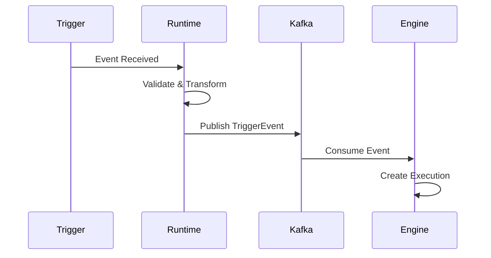
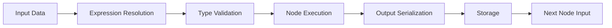
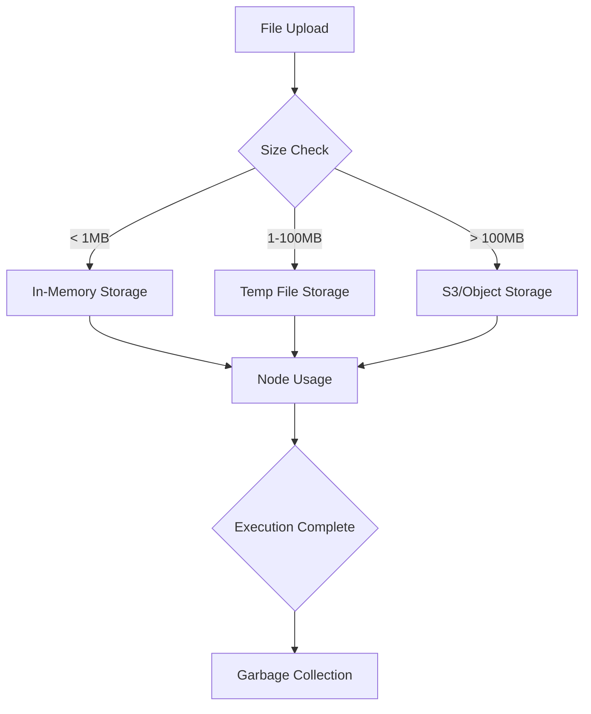
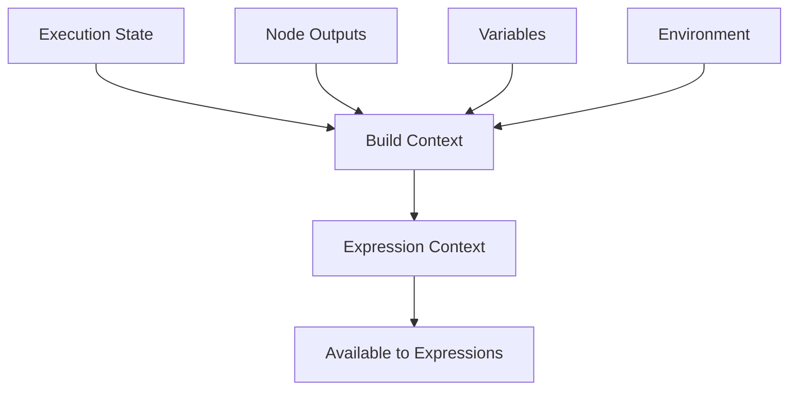
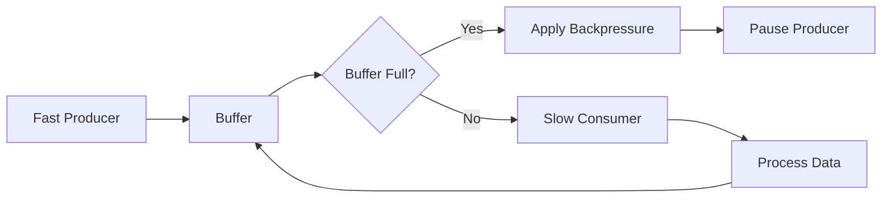
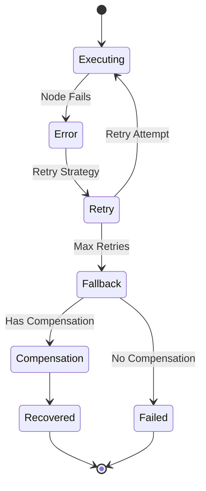

---

# Data Flow Architecture

## Overview

Данные в Nebula проходят через несколько уровней трансформации и оптимизации. Система спроектирована для эффективной обработки как маленьких JSON объектов, так и больших бинарных файлов.

## Workflow Execution Data Flow

### 1. Trigger Phase



### 2. Execution Phase



## Data Types and Storage

### Value Types Flow

```rust
// User Input → Typed Value → Validation → Storage → Next Node
pub enum DataLifecycle {
    UserInput(serde_json::Value),
    TypedValue(Value),
    ValidatedValue(ValidatedValue),
    StoredValue(StorageRef),
    RetrievedValue(Value),
}
```

### Binary Data Flow



## Expression Resolution Flow

### Expression Evaluation Pipeline

```rust
// Raw Expression → Parse → AST → Resolve References → Evaluate → Result
"$nodes.http.body.users[0].email" 
    → ParseExpression
    → AST { 
        Variable("nodes"),
        Property("http"),
        Property("body"),
        Property("users"),
        Index(0),
        Property("email")
    }
    → ResolveContext { execution_id, node_outputs }
    → "user@example.com"
```

### Context Building



## Streaming Data Flow

### Large Dataset Processing

```rust
pub enum ProcessingMode {
    // Entire dataset in memory
    Batch { data: Vec<Value> },
    
    // Streaming with backpressure
    Stream { 
        source: Box<dyn Stream<Item = Value>>,
        buffer_size: usize,
    },
    
    // Chunked processing
    Chunked {
        chunk_size: usize,
        processor: Box<dyn ChunkProcessor>,
    },
}
```

### Backpressure Handling



## Error Data Flow

### Error Propagation

```rust
pub enum ErrorFlow {
    // Node level error - can be caught
    NodeError { 
        node_id: NodeId,
        error: Error,
        recovery: RecoveryStrategy,
    },
    
    // Workflow level error - stops execution
    WorkflowError {
        execution_id: ExecutionId,
        error: Error,
    },
    
    // System level error - requires intervention
    SystemError {
        component: Component,
        error: Error,
        impact: Impact,
    },
}
```

### Error Recovery Flow



## Performance Optimizations

### Data Locality

```rust
// Keep data close to computation
pub struct DataLocality {
    // Prefer same worker for sequential nodes
    worker_affinity: Option<WorkerId>,
    
    // Cache hot data in worker memory
    local_cache: LruCache<DataKey, Value>,
    
    // Predictive prefetching
    prefetch_queue: VecDeque<DataKey>,
}
```

### Zero-Copy Strategies

```rust
// Avoid copying data when possible
pub enum DataTransfer {
    // Same process - use Arc
    SharedMemory(Arc<Value>),
    
    // Same machine - use mmap
    MemoryMapped(MmapFile),
    
    // Different machines - use streaming
    Network(TcpStream),
}
```

---

