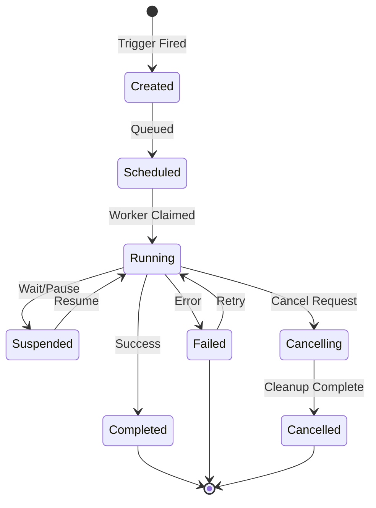
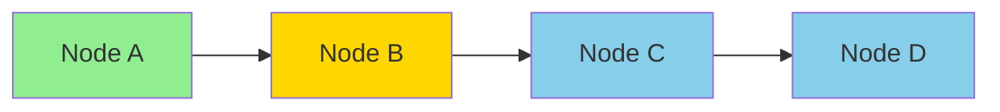
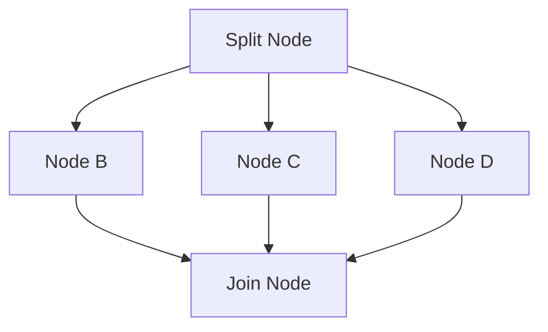
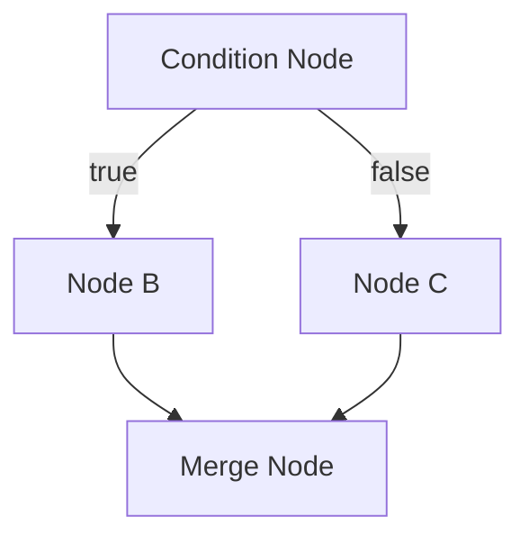
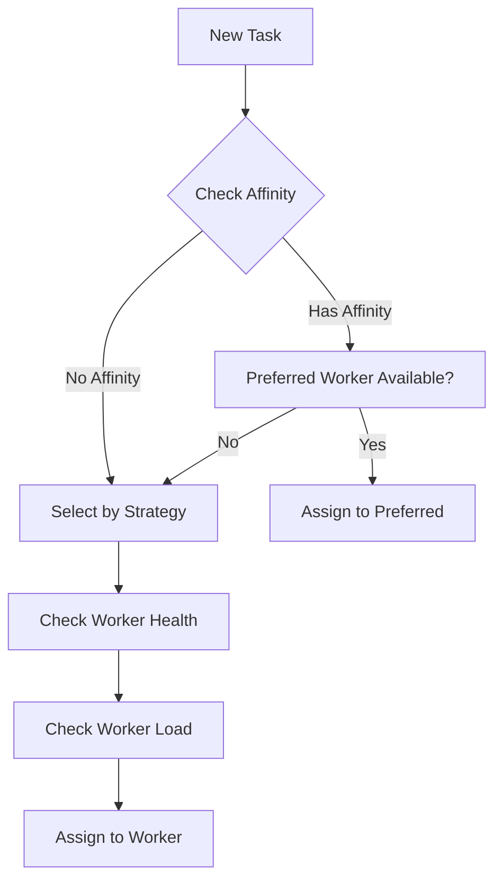
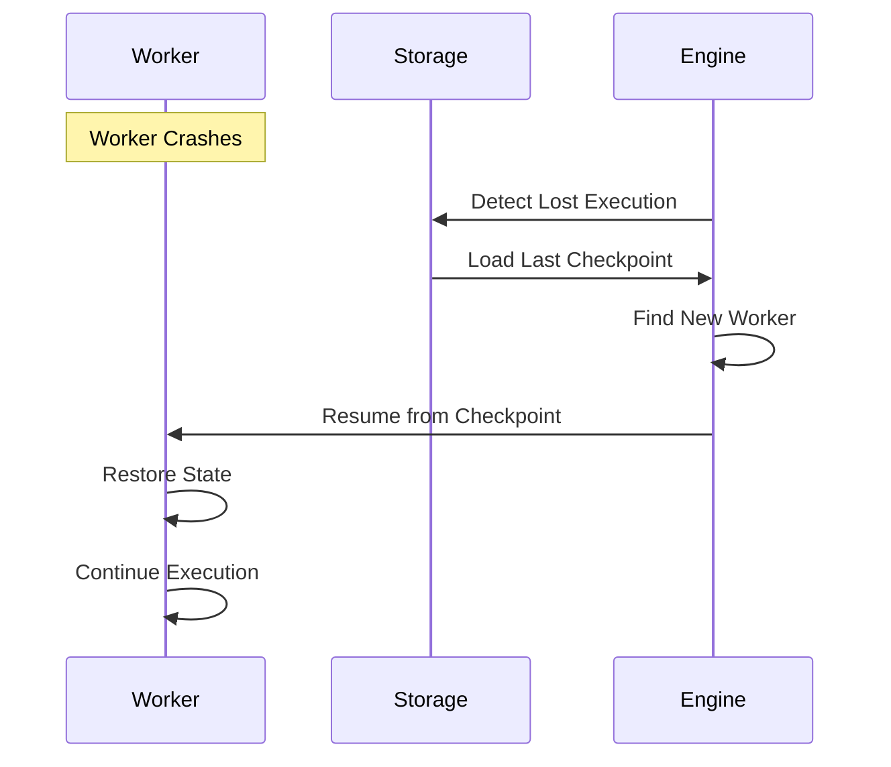

---

# Execution Model

## Overview

Nebula использует event-driven, асинхронную модель выполнения workflows. Каждый workflow execution проходит через определенные состояния и может быть приостановлен, возобновлен или отменен.

## Execution Lifecycle

### State Machine



### Execution States

```rust
pub enum ExecutionStatus {
    // Initial state
    Created { 
        created_at: DateTime<Utc>,
        trigger: TriggerInfo,
    },
    
    // Waiting for worker
    Scheduled {
        scheduled_at: DateTime<Utc>,
        priority: Priority,
    },
    
    // Active execution
    Running {
        started_at: DateTime<Utc>,
        current_node: NodeId,
        worker_id: WorkerId,
    },
    
    // Temporarily stopped
    Suspended {
        suspended_at: DateTime<Utc>,
        reason: SuspendReason,
        resume_condition: ResumeCondition,
    },
    
    // Terminal states
    Completed {
        completed_at: DateTime<Utc>,
        outputs: HashMap<NodeId, Value>,
    },
    
    Failed {
        failed_at: DateTime<Utc>,
        error: Error,
        failed_node: NodeId,
    },
    
    Cancelled {
        cancelled_at: DateTime<Utc>,
        reason: String,
    },
}
```

## Node Execution Model

### Sequential Execution



### Parallel Execution



### Conditional Execution



## Execution Context

### Context Hierarchy

```rust
pub struct ExecutionContext {
    // Global execution data
    pub execution: ExecutionMetadata,
    
    // Workflow-level context
    pub workflow: WorkflowContext,
    
    // Node-level context
    pub node: NodeContext,
    
    // Shared resources
    pub resources: ResourceContext,
    
    // Expression evaluation context
    pub expressions: ExpressionContext,
}

pub struct ExpressionContext {
    // Previous node outputs
    pub nodes: HashMap<NodeId, Value>,
    
    // User-defined variables
    pub vars: HashMap<String, Value>,
    
    // System variables
    pub system: SystemVariables,
    
    // Environment variables
    pub env: HashMap<String, String>,
}
```

### Resource Isolation

```rust
pub struct NodeSandbox {
    // Memory limits
    memory_limit: MemoryLimit,
    memory_used: AtomicUsize,
    
    // CPU limits
    cpu_quota: CpuQuota,
    cpu_used: AtomicU64,
    
    // I/O limits
    io_limits: IoLimits,
    io_stats: IoStats,
    
    // Network limits
    network_limits: NetworkLimits,
    network_stats: NetworkStats,
}
```

## Scheduling Model

### Work Distribution

```rust
pub enum SchedulingStrategy {
    // Round-robin distribution
    RoundRobin,
    
    // Least loaded worker
    LeastLoaded,
    
    // Worker affinity
    Affinity {
        prefer_same_worker: bool,
        node_affinity: HashMap<NodeType, WorkerId>,
    },
    
    // Priority-based
    Priority {
        queue: BinaryHeap<PriorityExecution>,
    },
}
```

### Worker Selection



## Concurrency Model

### Actor-based Workers

```rust
pub struct Worker {
    id: WorkerId,
    mailbox: mpsc::Receiver<WorkerMessage>,
    state: WorkerState,
}

pub enum WorkerMessage {
    ExecuteNode {
        execution_id: ExecutionId,
        node_id: NodeId,
        input: Value,
    },
    
    Shutdown,
    
    HealthCheck {
        response: oneshot::Sender<HealthStatus>,
    },
}
```

### Lock-Free Execution

```rust
// Using atomic operations for state management
pub struct LockFreeExecutionState {
    status: AtomicU8, // Maps to ExecutionStatus
    current_node: AtomicPtr<NodeId>,
    worker_id: AtomicU64,
    
    // Lock-free queue for events
    events: lockfree::queue::Queue<ExecutionEvent>,
}
```

## Fault Tolerance

### Checkpointing

```rust
pub struct Checkpoint {
    pub execution_id: ExecutionId,
    pub timestamp: DateTime<Utc>,
    pub completed_nodes: HashSet<NodeId>,
    pub node_outputs: HashMap<NodeId, Value>,
    pub variables: HashMap<String, Value>,
}

// Checkpoint after each node completion
impl Worker {
    async fn checkpoint(&self, execution: &Execution) -> Result<()> {
        let checkpoint = execution.create_checkpoint();
        self.storage.save_checkpoint(checkpoint).await
    }
}
```

### Recovery Model



---

