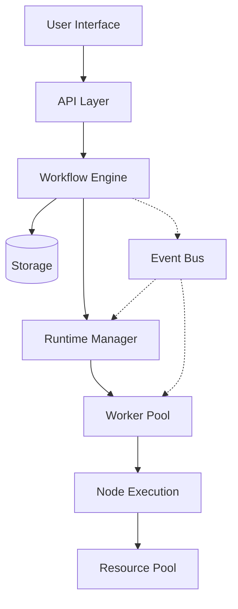

---

# Architecture Overview

## System Design Philosophy

Nebula следует принципам модульной архитектуры с четким разделением ответственности между компонентами. Система построена на следующих архитектурных паттернах:

### Layered Architecture

```
┌─────────────────────────────────────────────────────────┐
│                 Presentation Layer                       │
│            (UI, CLI, API Endpoints)                      │
├─────────────────────────────────────────────────────────┤
│                 Application Layer                        │
│         (Workflow Logic, Orchestration)                  │
├─────────────────────────────────────────────────────────┤
│                  Domain Layer                            │
│      (Core Types, Business Rules, Traits)                │
├─────────────────────────────────────────────────────────┤
│               Infrastructure Layer                       │
│    (Storage, Messaging, External Services)               │
└─────────────────────────────────────────────────────────┘
```

### Component Interaction Model



## Core Design Principles

### 1. Type Safety First
Максимальное использование системы типов Rust для предотвращения ошибок на этапе компиляции.

```rust
// Невозможно создать невалидный WorkflowId
pub struct WorkflowId(NonEmptyString);

// Невозможно подключить несовместимые nodes
pub struct Connection<From: OutputPort, To: InputPort<From::DataType>> {
    from: From,
    to: To,
}
```

### 2. Zero-Cost Abstractions
Абстракции не должны добавлять runtime overhead.

```rust
// Compile-time parameter validation
#[derive(Parameters)]
struct NodeParams {
    #[validate(required)]
    url: String, // NOT Option<String> - ошибка компиляции
}
```

### 3. Progressive Complexity
Простые вещи должны быть простыми, сложные - возможными.

```rust
// Простой node
#[node]
async fn uppercase(input: String) -> String {
    input.to_uppercase()
}

// Сложный node с полным контролем
impl Action for ComplexNode {
    // Full control over execution
}
```

### 4. Event-Driven Architecture
Loose coupling через события для масштабируемости.

```rust
pub enum SystemEvent {
    WorkflowDeployed { id: WorkflowId },
    ExecutionStarted { id: ExecutionId },
    NodeCompleted { execution: ExecutionId, node: NodeId },
}
```

## System Components

### Core Layer
- **nebula-core**: Фундаментальные типы и traits
- **serde / serde_json::Value**: Значения (crate nebula-value не используется)
- **nebula-memory**: Memory management и caching

### Execution Layer
- **nebula-engine**: Orchestration и scheduling
- **nebula-runtime**: Trigger management
- **nebula-worker**: Node execution environment

### Storage Layer
- **nebula-storage**: Storage abstractions
- **nebula-binary**: Binary data handling

### Developer Layer
- **nebula-derive**: Procedural macros
- **nebula-sdk**: Developer toolkit
- **nebula-expression**: Expression language

## Scalability Architecture

### Horizontal Scaling Model

```
Load Balancer
     │
     ├── API Server 1 ──┐
     ├── API Server 2   ├── Shared Event Bus (Kafka)
     └── API Server N ──┘
                │
     ┌──────────┴──────────┐
     │                     │
Runtime Pool          Worker Pool
┌─────────┐          ┌─────────┐
│Runtime 1│          │Worker 1 │
│Runtime 2│          │Worker 2 │
│   ...   │          │   ...   │
│Runtime N│          │Worker N │
└─────────┘          └─────────┘
```

### Resource Isolation

Каждый execution получает изолированные ресурсы:
- Memory sandbox с лимитами
- CPU throttling
- I/O rate limiting
- Network isolation

## Performance Architecture

### Memory Management Strategy

1. **Arena Allocation** для execution contexts
2. **Object Pooling** для переиспользуемых ресурсов
3. **String Interning** для повторяющихся строк
4. **Copy-on-Write** для больших immutable данных

### Caching Strategy

```rust
// Multi-level cache
L1: Process Memory (LRU)
L2: Redis (Distributed)
L3: Database (Persistent)
```

### Zero-Copy Data Flow

```rust
// Данные передаются по ссылке где возможно
pub enum DataRef<'a> {
    Borrowed(&'a [u8]),
    Owned(Vec<u8>),
    Mapped(MemoryMappedFile),
}
```

---

