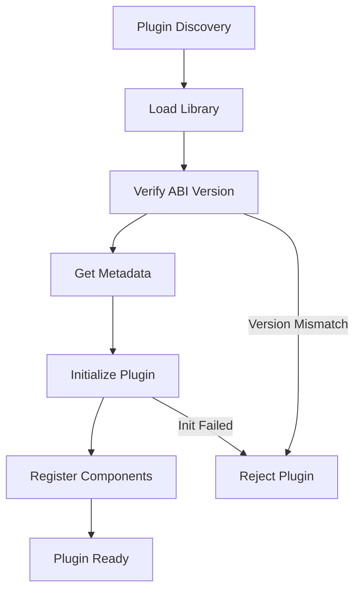
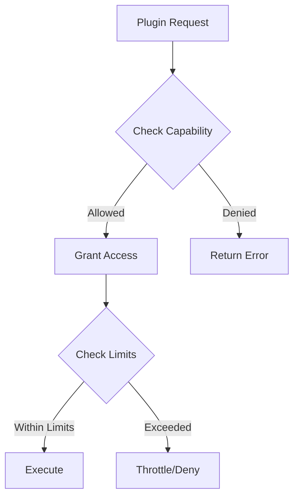
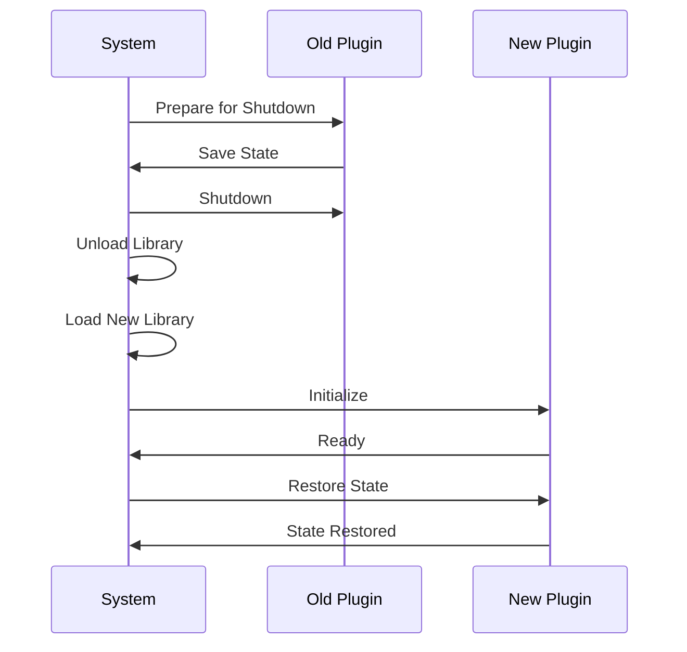

---

# Plugin System Architecture

## Overview

Nebula поддерживает расширение функциональности через систему плагинов. Плагины могут добавлять новые nodes, resources, и интеграции без изменения core системы.

## Plugin Architecture

### Plugin Structure

```rust
// Standard plugin interface
#[repr(C)]
pub struct PluginInterface {
    // ABI version for compatibility
    pub abi_version: u32,
    
    // Plugin metadata
    pub metadata: extern "C" fn() -> PluginMetadata,
    
    // Lifecycle hooks
    pub init: extern "C" fn(*mut PluginContext) -> i32,
    pub shutdown: extern "C" fn() -> i32,
    
    // Node registration
    pub register_nodes: extern "C" fn(*mut NodeRegistry) -> i32,
}

pub struct PluginMetadata {
    pub name: *const c_char,
    pub version: *const c_char,
    pub author: *const c_char,
    pub description: *const c_char,
    pub license: *const c_char,
}
```

### Plugin Loading Process



## Plugin Development

### Basic Plugin Structure

```rust
// my-plugin/src/lib.rs
use nebula_sdk::prelude::*;

// Define the plugin interface
#[no_mangle]
pub extern "C" fn plugin_interface() -> PluginInterface {
    PluginInterface {
        abi_version: NEBULA_ABI_VERSION,
        metadata: plugin_metadata,
        init: plugin_init,
        shutdown: plugin_shutdown,
        register_nodes: register_nodes,
    }
}

#[no_mangle]
pub extern "C" fn plugin_metadata() -> PluginMetadata {
    PluginMetadata {
        name: c_str!("My Plugin"),
        version: c_str!(env!("CARGO_PKG_VERSION")),
        author: c_str!("Author Name"),
        description: c_str!("Plugin description"),
        license: c_str!("MIT"),
    }
}

#[no_mangle]
pub extern "C" fn register_nodes(registry: *mut NodeRegistry) -> i32 {
    let registry = unsafe { &mut *registry };
    
    registry.register(Box::new(MyCustomNode::new()));
    registry.register(Box::new(AnotherNode::new()));
    
    0 // Success
}
```

### Plugin Manifest

```toml
# plugin.toml
[plugin]
name = "my-awesome-plugin"
version = "0.1.0"
authors = ["Your Name <email@example.com>"]
description = "Adds awesome functionality to Nebula"
license = "MIT"

[compatibility]
nebula = "^0.1"
abi_version = 1

[dependencies]
# Other plugins this plugin depends on
oauth-plugin = "^1.0"

[nodes]
# Nodes provided by this plugin
my_custom_node = { category = "Custom", icon = "custom.svg" }
another_node = { category = "Utilities", icon = "util.svg" }

[resources]
# Resources provided by this plugin
my_api_client = { type = "http_client", config = "api_config.toml" }
```

## Plugin Isolation

### Security Model

```rust
pub struct PluginSandbox {
    // Capability-based security
    capabilities: HashSet<Capability>,
    
    // Resource limits
    memory_limit: usize,
    cpu_quota: f64,
    
    // Network restrictions
    allowed_hosts: Vec<String>,
    blocked_ports: Vec<u16>,
    
    // Filesystem access
    allowed_paths: Vec<PathBuf>,
    temp_dir: PathBuf,
}

pub enum Capability {
    // Network access
    NetworkAccess,
    NetworkListen,
    
    // Filesystem
    FileRead(PathBuf),
    FileWrite(PathBuf),
    
    // System
    SpawnProcess,
    SystemInfo,
    
    // Resources
    CreateResource(ResourceType),
    AccessResource(ResourceType),
}
```

### Resource Access Control



## Plugin Registry

### Discovery Mechanisms

```rust
pub enum PluginSource {
    // Local filesystem
    Directory { path: PathBuf },
    
    // Git repository
    Git { 
        url: String,
        branch: Option<String>,
        subpath: Option<String>,
    },
    
    // Registry
    Registry {
        url: String,
        name: String,
        version: VersionReq,
    },
    
    // Direct download
    Url { url: String },
}
```

### Version Management

```rust
pub struct PluginVersion {
    pub version: semver::Version,
    pub compatibility: CompatibilityInfo,
    pub changelog: String,
    pub download_url: String,
    pub checksum: String,
}

pub struct CompatibilityInfo {
    pub min_nebula_version: semver::Version,
    pub max_nebula_version: Option<semver::Version>,
    pub abi_version: u32,
    pub breaking_changes: Vec<String>,
}
```

## Plugin Communication

### Inter-Plugin Communication

```rust
// Plugins can communicate through channels
pub struct PluginChannel {
    sender: mpsc::Sender<PluginMessage>,
    receiver: mpsc::Receiver<PluginMessage>,
}

pub enum PluginMessage {
    // Request-response pattern
    Request {
        id: MessageId,
        method: String,
        params: Value,
    },
    
    Response {
        id: MessageId,
        result: Result<Value, Error>,
    },
    
    // Event broadcasting
    Event {
        event_type: String,
        data: Value,
    },
}
```

### Shared State

```rust
// Plugins can share state through a controlled interface
pub struct SharedState {
    // Read-only access to global config
    config: Arc<Config>,
    
    // Shared cache with access control
    cache: Arc<RwLock<Cache>>,
    
    // Event bus for notifications
    event_bus: Arc<EventBus>,
}
```

## Hot Reloading

### Plugin Hot Reload Process



### State Migration

```rust
// Plugins must handle state migration
#[derive(Serialize, Deserialize)]
pub struct PluginState {
    version: u32,
    data: Value,
}

pub trait StateMigration {
    fn migrate_state(&self, old_state: PluginState) -> Result<PluginState, Error> {
        match old_state.version {
            1 => self.migrate_v1_to_v2(old_state),
            2 => Ok(old_state), // Current version
            _ => Err(Error::UnsupportedVersion),
        }
    }
}
```

---

