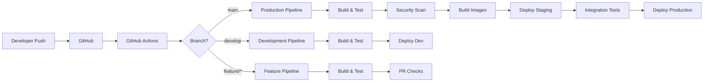

# Archived From "docs/archive/cicd-setup.md"

## CI/CD Architecture



---

## Testing Strategies

### Unit Test Execution

```yaml
# .github/workflows/test-matrix.yml
name: Test Matrix

on: [push, pull_request]

jobs:
  test:
    name: Test ${{ matrix.crate }}
    runs-on: ubuntu-latest
    strategy:
      matrix:
        crate:
          - nebula-core
          - nebula-memory
          - nebula-engine
          - nebula-worker
          - nebula-api
    steps:
      - uses: actions/checkout@v4
      
      - name: Run tests for ${{ matrix.crate }}
        run: |
          cd crates/${{ matrix.crate }}
          cargo test --all-features
```

### Integration Tests

```bash
#!/bin/bash
# scripts/integration-tests.sh

set -e

echo "Starting integration test environment..."

# Start test dependencies
docker-compose -f docker-compose.test.yml up -d

# Wait for services
./scripts/wait-for-it.sh localhost:5432 -- echo "PostgreSQL ready"
./scripts/wait-for-it.sh localhost:9092 -- echo "Kafka ready"

# Run integration tests
cargo test --test '*' --features integration-tests

# Cleanup
docker-compose -f docker-compose.test.yml down -v
```

### End-to-End Tests

```typescript
// e2e/workflow-execution.spec.ts
import { test, expect } from '@playwright/test';

test.describe('Workflow Execution', () => {
  test('should execute simple workflow', async ({ request }) => {
    // Create workflow
    const workflow = await request.post('/api/v1/workflows', {
      data: {
        name: 'Test Workflow',
        nodes: [
          {
            id: 'start',
            type: 'http_request',
            config: {
              url: 'https://api.example.com/data'
            }
          }
        ]
      }
    });
    
    expect(workflow.ok()).toBeTruthy();
    const workflowData = await workflow.json();
    
    // Execute workflow
    const execution = await request.post(
      `/api/v1/workflows/${workflowData.id}/execute`,
      {
        data: {
          input: { test: true }
        }
      }
    );
    
    expect(execution.ok()).toBeTruthy();
    const executionData = await execution.json();
    
    // Poll for completion
    let status;
    for (let i = 0; i < 30; i++) {
      const result = await request.get(
        `/api/v1/executions/${executionData.execution_id}`
      );
      const data = await result.json();
      status = data.status;
      
      if (status === 'completed' || status === 'failed') {
        break;
      }
      
      await new Promise(resolve => setTimeout(resolve, 1000));
    }
    
    expect(status).toBe('completed');
  });
});
```

---

## Release Process

### Semantic Versioning

```yaml
# .github/workflows/release.yml
name: Release

on:
  workflow_dispatch:
    inputs:
      version:
        description: 'Release version'
        required: true
        type: choice
        options:
          - patch
          - minor
          - major

jobs:
  release:
    name: Create Release
    runs-on: ubuntu-latest
    steps:
      - uses: actions/checkout@v4
        with:
          fetch-depth: 0
          
      - name: Configure Git
        run: |
          git config user.name github-actions
          git config user.email github-actions@github.com
          
      - name: Install cargo-release
        run: cargo install cargo-release
        
      - name: Bump version
        run: |
          cargo release version ${{ github.event.inputs.version }} \
            --no-confirm \
            --execute
            
      - name: Create changelog
        run: |
          cargo install git-cliff
          git cliff -o CHANGELOG.md
          
      - name: Commit changes
        run: |
          git add .
          git commit -m "chore: release v$(cargo metadata --no-deps --format-version 1 | jq -r '.packages[0].version')"
          git push
          
      - name: Create tag
        run: |
          VERSION=$(cargo metadata --no-deps --format-version 1 | jq -r '.packages[0].version')
          git tag -a "v$VERSION" -m "Release v$VERSION"
          git push origin "v$VERSION"
```

### Deployment Strategies

#### Blue-Green Deployment

```yaml
# k8s/blue-green-deployment.yaml
apiVersion: v1
kind: Service
metadata:
  name: nebula-api
spec:
  selector:
    app: nebula-api
    version: blue  # or green
  ports:
    - port: 80
      targetPort: 8080
---
apiVersion: apps/v1
kind: Deployment
metadata:
  name: nebula-api-blue
spec:
  replicas: 3
  selector:
    matchLabels:
      app: nebula-api
      version: blue
  template:
    metadata:
      labels:
        app: nebula-api
        version: blue
    spec:
      containers:
      - name: api
        image: ghcr.io/nebula/nebula:v1.0.0-api
---
apiVersion: apps/v1
kind: Deployment
metadata:
  name: nebula-api-green
spec:
  replicas: 3
  selector:
    matchLabels:
      app: nebula-api
      version: green
  template:
    metadata:
      labels:
        app: nebula-api
        version: green
    spec:
      containers:
      - name: api
        image: ghcr.io/nebula/nebula:v1.0.0-api

