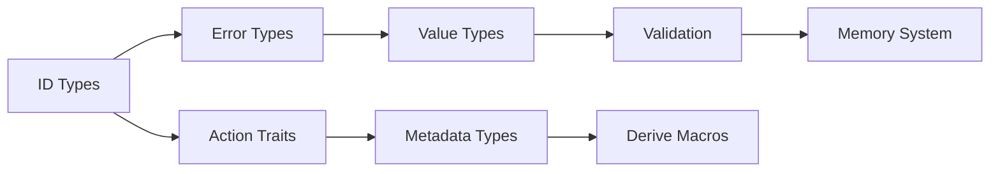

---

# nebula-memory

## Назначение

`nebula-memory` управляет in-memory состоянием системы, включая кеширование, resource pooling и оптимизацию использования памяти.

## Ответственность

- Execution state management
- Resource pooling (HTTP clients, DB connections)
- Caching (expressions, node outputs)
- Memory optimization (string interning, CoW)

## Архитектура

### Components

```rust
pub struct NebulaMemory {
    // Execution state
    execution_memory: Arc<ExecutionMemory>,
    
    // Resource pools
    resource_memory: Arc<ResourceMemory>,
    
    // Trigger state
    trigger_memory: Arc<TriggerMemory>,
    
    // Caching
    cache_memory: Arc<CacheMemory>,
}
```

### Memory Optimization

```rust
pub struct CacheMemory {
    // String interning
    string_interner: StringInterner,
    
    // Object pooling
    value_pool: ObjectPool<Value>,
    
    // Copy-on-write storage
    cow_storage: CowStorage<Value>,
}
```

## Roadmap

### Milestone 1: Basic Structure (Week 1)
- [ ] Core types
- [ ] Basic allocation
- [ ] Simple caching
- [ ] Tests

### Milestone 2: Resource Pooling (Week 2)
- [ ] Generic object pool
- [ ] HTTP client pool
- [ ] DB connection pool
- [ ] Pool metrics

### Milestone 3: Optimization (Week 2-3)
- [ ] String interning
- [ ] Copy-on-write
- [ ] Memory budgets
- [ ] Eviction policies

### Milestone 4: Monitoring (Week 3)
- [ ] Memory metrics
- [ ] Usage tracking
- [ ] Alerts
- [ ] Dashboard

## Usage Example

```rust
use nebula_memory::prelude::*;

// Create memory system
let memory = NebulaMemory::builder()
    .with_execution_cache_size(1000)
    .with_string_intern_capacity(10000)
    .build()?;

// Use in execution
let mut ctx = ExecutionContext::with_memory(memory);
ctx.set_node_output(node_id, large_value)?; // Automatically optimized

// Resource pooling
let client = ctx.memory()
    .resource_pool()
    .get::<HttpClient>()
    .await?;
```

## Performance Targets

- Execution state lookup: <1μs
- Resource acquisition: <10μs
- String interning: 90%+ hit rate
- Memory overhead: <20% vs raw data

[Продолжение для всех остальных файлов crates/...]

---
## FILE: docs/roadmaps/phase-1-core.md
---

# Phase 1: Core Foundation - Detailed Roadmap

## Overview

Phase 1 устанавливает фундамент для всей системы Nebula. Эта фаза критически важна, так как все последующие компоненты будут строиться на этой основе.

## Timeline: Weeks 1-3

### Week 1: Core Types and Traits

#### nebula-core (Days 1-3)
- **Day 1**: Setup и базовая структура
  - [ ] Инициализация crate
  - [ ] Настройка CI/CD
  - [ ] Базовые зависимости
  - [ ] Структура модулей

- **Day 2**: Identifier types
  - [ ] WorkflowId implementation
  - [ ] NodeId implementation  
  - [ ] ExecutionId implementation
  - [ ] TriggerId implementation
  - [ ] Tests для ID types

- **Day 3**: Error handling
  - [ ] Error enum design
  - [ ] Error contexts
  - [ ] Error conversion traits
  - [ ] Result type alias

#### Value layer: serde / serde_json::Value (Days 4-5)
- **Day 4**: Единый тип значений — `serde_json::Value`, интеграция с параметрами
- **Day 5**: Сериализация (serde), валидация поверх Value

### Week 1 Checklist
- [ ] CI/CD работает
- [ ] Все ID types готовы
- [ ] Error handling complete
- [ ] serde_json::Value в контуре данных
- [ ] Serialization тесты проходят

### Week 2: Advanced Types and Memory

#### Доп. валидация (Days 6-8)
- Валидаторы поверх serde_json::Value, извлечение типизированных полей

#### nebula-memory (Days 9-10)
- **Day 9**: Basic structure
  - [ ] NebulaMemory struct
  - [ ] ExecutionMemory
  - [ ] ResourceMemory
  - [ ] Basic allocation

- **Day 10**: Caching foundation
  - [ ] Cache traits
  - [ ] LRU implementation
  - [ ] Cache metrics
  - [ ] Eviction policies

### Week 2 Checklist
- [ ] Все value types готовы
- [ ] Validation работает
- [ ] Memory structure defined
- [ ] Basic caching работает
- [ ] 80%+ test coverage

### Week 3: Integration and Polish

#### nebula-core (Days 11-12)
- **Day 11**: Action traits
  - [ ] Action trait finalization
  - [ ] TriggerAction trait
  - [ ] SupplyAction trait
  - [ ] Trait composition tests

- **Day 12**: Metadata types
  - [ ] ActionMetadata
  - [ ] NodeMetadata
  - [ ] WorkflowMetadata
  - [ ] ParameterDescriptor

#### nebula-derive basics (Days 13-14)
- **Day 13**: Setup
  - [ ] Proc macro crate setup
  - [ ] Basic derive infrastructure
  - [ ] Error handling for macros

- **Day 14**: Simple derives
  - [ ] #[derive(NodeId)]
  - [ ] #[derive(WorkflowId)]
  - [ ] Basic validation

#### Integration (Day 15)
- **Day 15**: Cross-crate testing
  - [ ] Integration tests
  - [ ] Example workflows
  - [ ] Performance benchmarks
  - [ ] Documentation review

### Week 3 Checklist
- [ ] All traits finalized
- [ ] Basic derives working
- [ ] Integration tests pass
- [ ] Documentation complete
- [ ] Ready for Phase 2

## Success Metrics

### Code Quality
- Test coverage: >80%
- Documentation coverage: 100%
- Clippy warnings: 0
- Security audit: Pass

### Performance
- Value creation: <100ns
- Serialization: <1μs for simple values
- Memory allocation: <1KB per execution base

### Developer Experience
- Clear examples for each component
- Intuitive API
- Helpful error messages
- Complete rustdoc

## Risks and Mitigations

### Risk 1: API Design Changes
**Probability**: Medium
**Impact**: High
**Mitigation**: 
- Extensive design review
- Create POC before full implementation
- Get early feedback

### Risk 2: Performance Issues
**Probability**: Low
**Impact**: Medium
**Mitigation**:
- Benchmark from day 1
- Profile regularly
- Have optimization plan

### Risk 3: Complexity Explosion
**Probability**: Medium
**Impact**: Medium
**Mitigation**:
- Start simple
- Add features incrementally
- Regular refactoring

## Dependencies Between Tasks



## Definition of Done

### For each component:
- [ ] Code complete
- [ ] Unit tests (>80% coverage)
- [ ] Integration tests
- [ ] Documentation
- [ ] Examples
- [ ] Benchmarks
- [ ] Security review
- [ ] Performance validation

## Next Phase Preparation

### Handoff to Phase 2:
1. Stable API for core types
2. Working value system
3. Basic memory management
4. Clear integration patterns

### Required for Phase 2:
- Stable Action trait
- Working Value types
- Memory allocation system
- Error handling patterns

[Продолжение для остальных phase roadmaps...]

---
## FILE: docs/guides/getting-started.md
---

# Getting Started with Nebula

Welcome to Nebula! This guide will help you get started with creating your first workflow.

## Installation

### Prerequisites
- Rust 1.93 or higher
- PostgreSQL 14+
- Kafka (optional for development)

### Clone and Build
```bash
git clone https://github.com/yourusername/nebula.git
cd nebula
cargo build --release
```

## Your First Workflow

### 1. Create a Simple Node
```rust
use nebula_sdk::prelude::*;

#[derive(Action, Parameters)]
#[action(
    id = "hello_world",
    name = "Hello World",
    category = "Examples"
)]
pub struct HelloWorldNode {
    #[param(label = "Name", default = "World")]
    name: String,
}

#[async_trait]
impl ExecutableNode for HelloWorldNode {
    type Output = String;
    
    async fn execute(&self, ctx: &ExecutionContext) -> Result<Self::Output> {
        Ok(format!("Hello, {}!", self.name))
    }
}
```

### 2. Register Your Node
```rust
use nebula_node_registry::NodeRegistry;

let mut registry = NodeRegistry::new();
registry.register(HelloWorldNode)?;
```

### 3. Create a Workflow
```json
{
  "id": "my-first-workflow",
  "name": "My First Workflow",
  "nodes": [
    {
      "id": "hello",
      "type": "hello_world",
      "parameters": {
        "name": "Nebula User"
      }
    }
  ]
}
```

## Next Steps
- Read the [Node Development Guide](./node-development.md)
- Explore [Standard Nodes](../crates/)
- Join our [Community](https://github.com/yourusername/nebula/discussions)

---
## FILE: docs/guides/node-development.md
---

# Node Development Guide

This guide covers everything you need to know about developing custom nodes for Nebula.

## Basic Node Structure

### Simple Function Node
```rust
use nebula_sdk::prelude::*;

#[node]
async fn uppercase(input: String) -> Result<String> {
    Ok(input.to_uppercase())
}
```

### Parameterized Node
```rust
#[derive(Action, Parameters)]
pub struct HttpRequestNode {
    #[param(required, label = "URL")]
    url: String,
    
    #[param(
        label = "Method",
        default = "GET",
        options = ["GET", "POST", "PUT", "DELETE"]
    )]
    method: String,
    
    #[param(label = "Headers", optional)]
    headers: HashMap<String, String>,
}
```

## Parameter Types

### Text Parameters
```rust
#[param(
    type = "text",
    label = "API Key",
    placeholder = "Enter your API key",
    validation = "min_length:10"
)]
api_key: String,
```

### Number Parameters
```rust
#[param(
    type = "number",
    label = "Timeout",
    min = 1,
    max = 300,
    default = 30
)]
timeout_seconds: u32,
```

### Select Parameters
```rust
#[param(
    type = "select",
    label = "Region",
    options = ["us-east-1", "eu-west-1", "ap-south-1"],
    default = "us-east-1"
)]
region: String,
```

## Advanced Features

### Using Resources
```rust
impl ExecutableNode for DatabaseQueryNode {
    async fn execute(&self, ctx: &ExecutionContext) -> Result<Value> {
        // Get database connection from pool
        let db = ctx.resource_pool()
            .get::<DatabaseConnection>()
            .await?;
            
        let result = sqlx::query(&self.query)
            .fetch_all(&db)
            .await?;
            
        Ok(json!(result))
    }
}
```

### Error Handling
```rust
#[derive(Debug, thiserror::Error)]
pub enum MyNodeError {
    #[error("Invalid configuration: {0}")]
    InvalidConfig(String),
    
    #[error("External API error: {0}")]
    ApiError(#[from] reqwest::Error),
}
```

### Testing Your Node
```rust
#[cfg(test)]
mod tests {
    use super::*;
    use nebula_sdk::testing::*;
    
    #[tokio::test]
    async fn test_my_node() {
        let ctx = MockContext::new();
        let node = MyNode { param: "test".into() };
        
        let result = node.execute(&ctx).await;
        assert!(result.is_ok());
    }
}
```

## Best Practices

1. **Keep nodes focused** - Each node should do one thing well
2. **Use descriptive names** - Both for the node and its parameters
3. **Handle errors gracefully** - Provide helpful error messages
4. **Document your node** - Include examples and edge cases
5. **Test thoroughly** - Include unit and integration tests

---
## FILE: docs/guides/contributing.md
---

# Contributing to Nebula

Thank you for your interest in contributing to Nebula! This guide will help you get started.

## Getting Started

1. Fork the repository
2. Clone your fork
3. Create a feature branch
4. Make your changes
5. Submit a pull request

## Development Setup

```bash
# Clone the repo
git clone https://github.com/yourusername/nebula.git
cd nebula

# Install dependencies
cargo build

# Run tests
cargo test

# Run with all features
cargo test --all-features
```

## Code Style

We use standard Rust formatting:
```bash
cargo fmt -- --check
cargo clippy -- -D warnings
```

## Testing

All new features must include tests:
- Unit tests for individual components
- Integration tests for cross-crate functionality
- Documentation tests for examples

## Documentation

- All public APIs must be documented
- Include examples in doc comments
- Update relevant guides

## Pull Request Process

1. Update the CHANGELOG.md
2. Update documentation
3. Ensure all tests pass
4. Request review from maintainers

## Code of Conduct

Please note we have a code of conduct, please follow it in all your interactions with the project.

## Questions?

Feel free to open an issue or join our Discord community!


