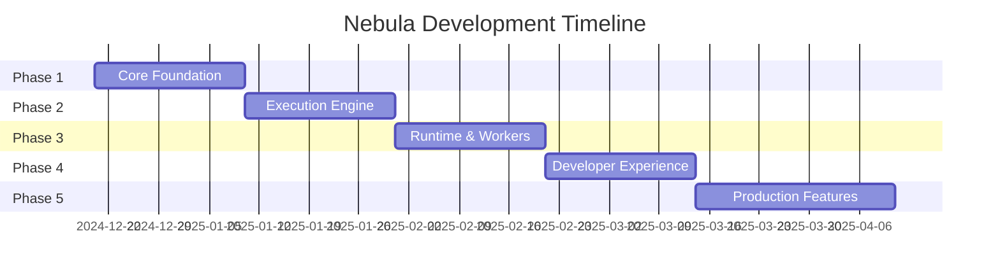
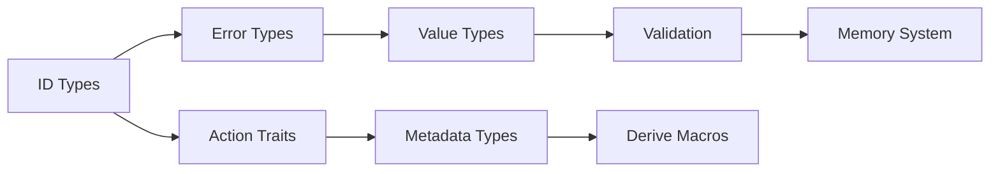

# Nebula Architecture Documentation

## 📁 Documentation Structure

```
docs/
├── README.md                    # Overview и навигация
├── ARCHITECTURE.md             # Общая архитектура системы
├── PROJECT_STATUS.md          # Текущий статус проекта
├── ROADMAP.md                 # Главный roadmap
├── TECHNICAL_NOTES.md         # Технические заметки и решения
│
├── architecture/
│   ├── overview.md            # Высокоуровневая архитектура
│   ├── data-flow.md          # Поток данных в системе
│   ├── execution-model.md    # Модель выполнения workflows
│   ├── plugin-system.md      # Система плагинов
│   └── security.md           # Безопасность и изоляция
│
├── crates/                    # Документация по каждому crate
│   ├── nebula-core.md
│   ├── nebula-value.md
│   ├── nebula-memory.md
│   ├── nebula-derive.md
│   ├── nebula-expression.md
│   ├── nebula-engine.md
│   ├── nebula-storage.md
│   ├── nebula-binary.md
│   ├── nebula-runtime.md
│   ├── nebula-worker.md
│   ├── nebula-api.md
│   ├── nebula-node-registry.md
│   └── nebula-sdk.md
│
├── roadmaps/                  # Детальные roadmaps
│   ├── phase-1-core.md
│   ├── phase-2-engine.md
│   ├── phase-3-runtime.md
│   ├── phase-4-dx.md
│   └── phase-5-production.md
│
└── guides/                    # Руководства
    ├── getting-started.md
    ├── node-development.md
    └── contributing.md
```

---

# 📋 README.md

# Nebula Workflow Engine

Nebula - это высокопроизводительный workflow engine, написанный на Rust, предназначенный для визуальной автоматизации процессов с фокусом на type safety, расширяемость и developer experience.

## 🎯 Ключевые особенности

- **Visual-first подход**: Интуитивный UI для создания workflows без программирования
- **Type-safe**: Строгая типизация на всех уровнях
- **Расширяемый**: Динамическая загрузка custom nodes
- **Производительный**: Zero-cost abstractions, эффективное использование памяти
- **Open Source**: Прозрачная разработка с фокусом на сообщество

## 📚 Документация

- [Архитектура](./ARCHITECTURE.md) - Общий обзор архитектуры
- [Статус проекта](./PROJECT_STATUS.md) - Текущее состояние разработки
- [Roadmap](./ROADMAP.md) - План развития
- [Технические заметки](./TECHNICAL_NOTES.md) - Детали реализации

### Документация по компонентам

- [Crates](./docs/crates/) - Описание каждого crate
- [Roadmaps](./docs/roadmaps/) - Детальные планы по фазам
- [Guides](./docs/guides/) - Руководства для разработчиков

---

# 🏗️ ARCHITECTURE.md

# Архитектура Nebula

## Общий обзор

Nebula построена как модульная система с четким разделением ответственности между компонентами.

### Основные принципы

1. **Type Safety First** - Максимальное использование системы типов Rust
2. **Zero-Cost Abstractions** - Производительность без компромиссов
3. **Progressive Complexity** - Простой старт, возможность глубокой кастомизации
4. **Event-Driven** - Асинхронная, event-based архитектура

### Высокоуровневая архитектура

```
┌─────────────────────────────────────────────────────────┐
│                    User Interface                        │
│              (Web UI / Desktop App / CLI)                │
└─────────────────────────────────────────────────────────┘
                            │
┌─────────────────────────────────────────────────────────┐
│                      API Layer                           │
│              (REST / GraphQL / WebSocket)                │
└─────────────────────────────────────────────────────────┘
                            │
┌─────────────────────────────────────────────────────────┐
│                  Orchestration Layer                     │
├─────────────────┬─────────────────┬────────────────────┤
│     Engine      │     Runtime     │      Workers       │
│  (Scheduling)   │   (Triggers)    │   (Execution)      │
└─────────────────┴─────────────────┴────────────────────┘
                            │
┌─────────────────────────────────────────────────────────┐
│                     Core Layer                           │
├─────────────────┬─────────────────┬────────────────────┤
│     Value       │     Memory      │    Expression      │
│    (Types)      │   (Caching)     │   (Evaluation)     │
└─────────────────┴─────────────────┴────────────────────┘
                            │
┌─────────────────────────────────────────────────────────┐
│                   Storage Layer                          │
├─────────────────┬─────────────────┬────────────────────┤
│   PostgreSQL    │  Object Store   │   Message Bus      │
│   (Metadata)    │   (Binary)      │    (Kafka)         │
└─────────────────┴─────────────────┴────────────────────┘
```

### Поток данных

1. **Workflow Definition** → API → Engine → Storage
2. **Trigger Event** → Runtime → Kafka → Engine
3. **Execution** → Worker → Node → Storage → Next Worker
4. **Results** → Storage → API → UI

### Компоненты системы

#### Core Components
- **nebula-core**: Базовые trait'ы и типы
- **nebula-value**: Типизированная система значений
- **nebula-memory**: In-memory состояние и кеширование

#### Execution Components
- **nebula-engine**: Orchestration и scheduling
- **nebula-runtime**: Управление triggers
- **nebula-worker**: Выполнение nodes

#### Storage Components
- **nebula-storage**: Абстракции хранилища
- **nebula-binary**: Управление бинарными данными

#### Developer Components
- **nebula-sdk**: All-in-one SDK
- **nebula-derive**: Procedural macros
- **nebula-node-registry**: Управление nodes

---

# 📊 PROJECT_STATUS.md

# Project Status

**Последнее обновление**: 2024-12-19

## Общий статус

🟡 **Pre-Alpha** - Активная разработка архитектуры

## Статус по компонентам

| Компонент | Статус | Прогресс | Примечания |
|-----------|--------|----------|------------|
| nebula-core | 🟡 Проектирование | 0% | Определены основные traits |
| nebula-value | 🟡 Проектирование | 0% | Спроектированы базовые типы |
| nebula-memory | 🟡 Проектирование | 0% | Определена архитектура |
| nebula-derive | 🔴 Не начато | 0% | Ожидает nebula-core |
| nebula-expression | 🔴 Не начато | 0% | Требует дизайн грамматики |
| nebula-engine | 🔴 Не начато | 0% | - |
| nebula-storage | 🔴 Не начато | 0% | - |
| nebula-binary | 🔴 Не начато | 0% | - |
| nebula-runtime | 🔴 Не начато | 0% | - |
| nebula-worker | 🔴 Не начато | 0% | - |
| nebula-api | 🔴 Не начато | 0% | - |
| nebula-node-registry | 🔴 Не начато | 0% | - |
| nebula-sdk | 🔴 Не начато | 0% | - |

### Легенда
- 🟢 Готово
- 🟡 В разработке
- 🔴 Не начато
- ⚫ Заблокировано

## Текущие задачи

1. Завершить проектирование архитектуры
2. Начать имплементацию nebula-core
3. Создать POC для validation концепции

## Блокеры

- Нет текущих блокеров

## Milestone 1: Core Foundation (Phase 1)

**Цель**: Базовые компоненты для построения системы

**Deadline**: TBD

**Компоненты**:
- [ ] nebula-core
- [ ] nebula-value  
- [ ] nebula-memory
- [ ] nebula-derive (basic)

---

# 🗺️ ROADMAP.md

# Nebula Roadmap

## Overview

Разработка Nebula разделена на 5 основных фаз, каждая из которых добавляет новую функциональность.

## Timeline



## Phase 1: Core Foundation (Weeks 1-3)

### Goals
- Установить базовую архитектуру
- Реализовать систему типов
- Создать основные абстракции

### Deliverables
- ✅ Архитектурная документация
- ⬜ nebula-core implementation
- ⬜ nebula-value implementation
- ⬜ nebula-memory implementation
- ⬜ Basic nebula-derive

### Success Criteria
- Можно создать простой Node
- Типы значений работают с валидацией
- Memory management функционирует

## Phase 2: Execution Engine (Weeks 4-6)

### Goals
- Реализовать workflow execution
- Добавить персистентность
- Интегрировать Kafka

### Deliverables
- ⬜ nebula-engine
- ⬜ nebula-storage + PostgreSQL
- ⬜ nebula-binary
- ⬜ Event system

### Success Criteria
- Можно выполнить простой workflow
- Состояние сохраняется в БД
- События проходят через Kafka

## Phase 3: Runtime & Workers (Weeks 7-9)

### Goals
- Реализовать trigger систему
- Добавить worker pool
- Plugin loading

### Deliverables
- ⬜ nebula-runtime
- ⬜ nebula-worker
- ⬜ nebula-node-registry
- ⬜ Basic triggers

### Success Criteria
- Triggers активируются и работают
- Workers выполняют nodes
- Можно загрузить external node

## Phase 4: Developer Experience (Weeks 10-12)

### Goals
- Создать удобный SDK
- Добавить API
- Базовые nodes

### Deliverables
- ⬜ nebula-sdk
- ⬜ nebula-api
- ⬜ Standard nodes
- ⬜ Documentation

### Success Criteria
- Легко создавать custom nodes
- API покрывает основные use cases
- Есть 10+ полезных nodes

## Phase 5: Production Features (Weeks 13-16)

### Goals
- Оптимизация производительности
- Monitoring и debugging
- Security hardening

### Deliverables
- ⬜ Performance optimizations
- ⬜ Monitoring integration
- ⬜ Security features
- ⬜ Production guides

### Success Criteria
- Производительность соответствует целям
- Есть полный monitoring
- Security audit пройден

## Beyond MVP

### Phase 6: Advanced Features
- Machine Learning nodes
- Distributed execution
- Multi-region support

### Phase 7: Enterprise
- SAML/OIDC
- Audit logging
- SLA guarantees

### Phase 8: Ecosystem
- Marketplace
- Community nodes
- Certification program

---

# 📝 TECHNICAL_NOTES.md

# Technical Notes

## Архитектурные решения

### 1. Почему Rust?

**Причины выбора**:
- Zero-cost abstractions для производительности
- Memory safety без GC
- Отличная поддержка async
- Strong type system
- Great ecosystem

**Альтернативы рассмотрены**:
- Go: Проще, но менее выразительная система типов
- C++: Сложнее, больше footguns
- Java/C#: GC overhead неприемлем для нашего use case

### 2. Event-driven vs Direct execution

**Выбрано**: Event-driven через Kafka

**Причины**:
- Лучшая масштабируемость
- Natural fault tolerance
- Easier debugging (event log)
- Возможность replay

**Trade-offs**:
- Сложнее initial setup
- Небольшой overhead на сериализацию
- Требует external dependency (Kafka)

### 3. Plugin system через dynamic libraries

**Выбрано**: libloading с convention-based discovery

**Причины**:
- Нативная производительность
- Простота для Rust разработчиков
- Нет overhead на IPC

**Альтернативы**:
- WASM: Безопаснее, но overhead и ограничения
- gRPC: Проще изоляция, но network overhead
- Embedded scripting: Ограниченные возможности

### 4. Type system design

**Принципы**:
- Максимум проверок at compile time
- Rich types вместо примитивов
- Explicit conversions
- No implicit coercions

**Примеры**:
```rust
// ❌ Плохо
fn set_timeout(seconds: i32) { }

// ✅ Хорошо  
fn set_timeout(timeout: Duration) { }
```

### 5. Memory management strategy

**Подход**:
- Arena allocation для execution context
- Object pooling для переиспользуемых ресурсов
- Copy-on-write для больших данных
- String interning для повторяющихся строк

**Метрики целевые**:
- Node execution overhead: <1ms
- Memory per execution: <10MB base
- Concurrent executions: 10k+ per worker

## Технические долги

### Признанные компромиссы

1. **Kafka dependency с самого начала**
   - Risk: Сложность для self-hosted
   - Mitigation: Абстракция для замены на Redis Streams

2. **PostgreSQL only для MVP**
   - Risk: Vendor lock-in
   - Mitigation: Storage trait позволит добавить другие БД

3. **No WASM support initially**
   - Risk: Ограничены Rust nodes
   - Mitigation: Можно добавить позже без breaking changes

## Производительность

### Целевые метрики

| Метрика | Цель | Примечание |
|---------|------|------------|
| Node execution latency | <10ms | Для простых nodes |
| Workflow start latency | <100ms | От trigger до первого node |
| Throughput | 1000 exec/sec | На single worker |
| Memory usage | <1GB | Base worker memory |
| Concurrent workflows | 10k+ | На single instance |

### Оптимизации

1. **Lazy loading** для nodes
2. **Batch processing** в Kafka
3. **Connection pooling** везде
4. **Smart caching** с TTL
5. **Zero-copy** где возможно

## Security Considerations

### Threat Model

1. **Malicious nodes**
   - Mitigation: Capability system
   - Future: Full sandboxing

2. **Resource exhaustion**
   - Mitigation: Resource limits
   - Monitoring

3. **Data leakage**
   - Mitigation: Execution isolation
   - Credential encryption

### Security Roadmap

- [ ] Phase 1: Basic validation
- [ ] Phase 2: Resource limits
- [ ] Phase 3: Capability system
- [ ] Phase 4: Sandboxing
- [ ] Phase 5: Full audit

---

# 📁 docs/crates/nebula-core.md

# nebula-core

## Назначение

`nebula-core` - это фундаментальный crate, содержащий базовые trait'ы, типы и абстракции, используемые во всей системе Nebula.

## Ответственность

- Определение основных trait'ов (Action, TriggerAction, etc.)
- Базовые типы данных (WorkflowId, NodeId, ExecutionId)
- Error types
- Common utilities

## Архитектура

### Основные компоненты

```rust
// Traits
pub trait Action { }
pub trait TriggerAction: Action { }
pub trait PollingAction: TriggerAction { }
pub trait SupplyAction: Action { }

// Types
pub struct Workflow { }
pub struct Node { }
pub struct Execution { }

// Identifiers  
pub struct WorkflowId(Uuid);
pub struct NodeId(String);
pub struct ExecutionId(Uuid);
```

### Зависимости

- Минимальные внешние зависимости
- Только стабильные, широко используемые crates

## Roadmap

### Milestone 1: Basic Types (Week 1)
- [x] Проектирование типов
- [ ] WorkflowId, NodeId, ExecutionId
- [ ] Error types
- [ ] Basic traits

### Milestone 2: Action System (Week 1-2)
- [ ] Action trait
- [ ] TriggerAction trait
- [ ] Metadata types
- [ ] Tests

### Milestone 3: Workflow Types (Week 2)
- [ ] Workflow struct
- [ ] Node struct
- [ ] Connection types
- [ ] Validation

### Milestone 4: Documentation (Week 2-3)
- [ ] API documentation
- [ ] Examples
- [ ] Integration guide

## API Design

```rust
// Example usage
use nebula_core::prelude::*;

#[derive(Debug)]
pub struct MyAction;

impl Action for MyAction {
    type Input = String;
    type Output = String;
    
    async fn execute(&self, input: Self::Input, ctx: &ActionContext) -> Result<Self::Output> {
        Ok(input.to_uppercase())
    }
}
```

## Testing Strategy

- Unit tests для каждого компонента
- Property-based testing для ID types
- Doc tests для всех примеров

## Performance Considerations

- Zero-cost abstractions
- No allocations в hot paths
- Efficient serialization

---

# 📁 docs/crates/nebula-value.md

# nebula-value

## Назначение

`nebula-value` предоставляет строго типизированную систему значений с встроенной валидацией для безопасной работы с данными в workflows.

## Ответственность

- Типизированные значения (StringValue, IntegerValue, etc.)
- Валидация значений
- Преобразование между типами
- Сериализация/десериализация

## Архитектура

### Type Hierarchy

```rust
pub enum Value {
    Null,
    String(StringValue),
    Integer(IntegerValue),
    Float(FloatValue),
    Boolean(BooleanValue),
    DateTime(DateTimeValue),
    Date(DateValue),
    Time(TimeValue),
    Code(CodeValue),
    Regex(RegexValue),
    Color(ColorValue),
    Expression(ExpressionValue),
    Array(ArrayValue),
    Object(ObjectValue),
    Binary(BinaryReference),
}
```

### Validation System

```rust
pub trait Validator<T> {
    fn validate(&self, value: &T) -> Result<(), ValidationError>;
}

pub struct StringValidator {
    min_length: Option<usize>,
    max_length: Option<usize>,
    pattern: Option<Regex>,
}
```

## Roadmap

### Milestone 1: Basic Types (Week 1)
- [ ] Value enum
- [ ] Basic type structs
- [ ] Serialization
- [ ] Basic validation

### Milestone 2: Advanced Types (Week 2)
- [ ] CodeValue with syntax
- [ ] RegexValue with compilation
- [ ] ColorValue with formats
- [ ] ExpressionValue

### Milestone 3: Validation (Week 2-3)
- [ ] Validator trait
- [ ] Built-in validators
- [ ] Custom validators
- [ ] Error messages

### Milestone 4: Conversions (Week 3)
- [ ] Type coercion rules
- [ ] Conversion methods
- [ ] Compatibility checks
- [ ] Tests

## API Examples

```rust
use nebula_value::prelude::*;

// Creating values
let name = StringValue::new("John Doe")
    .with_validation(StringValidator {
        min_length: Some(1),
        max_length: Some(100),
        pattern: None,
    });

// Type conversions
let number = IntegerValue::new(42);
let as_string: StringValue = number.convert()?;

// Validation
match name.validate() {
    Ok(()) => println!("Valid!"),
    Err(e) => println!("Invalid: {}", e),
}
```

## Performance Goals

- Minimal allocation for small values
- Efficient validation caching
- Fast serialization
- Copy-on-write for large values

---

# 📁 docs/crates/nebula-memory.md

# nebula-memory

## Назначение

`nebula-memory` управляет in-memory состоянием системы, включая кеширование, resource pooling и оптимизацию использования памяти.

## Ответственность

- Execution state management
- Resource pooling (HTTP clients, DB connections)
- Caching (expressions, node outputs)
- Memory optimization (string interning, CoW)

## Архитектура

### Components

```rust
pub struct NebulaMemory {
    // Execution state
    execution_memory: Arc<ExecutionMemory>,
    
    // Resource pools
    resource_memory: Arc<ResourceMemory>,
    
    // Trigger state
    trigger_memory: Arc<TriggerMemory>,
    
    // Caching
    cache_memory: Arc<CacheMemory>,
}
```

### Memory Optimization

```rust
pub struct CacheMemory {
    // String interning
    string_interner: StringInterner,
    
    // Object pooling
    value_pool: ObjectPool<Value>,
    
    // Copy-on-write storage
    cow_storage: CowStorage<Value>,
}
```

## Roadmap

### Milestone 1: Basic Structure (Week 1)
- [ ] Core types
- [ ] Basic allocation
- [ ] Simple caching
- [ ] Tests

### Milestone 2: Resource Pooling (Week 2)
- [ ] Generic object pool
- [ ] HTTP client pool
- [ ] DB connection pool
- [ ] Pool metrics

### Milestone 3: Optimization (Week 2-3)
- [ ] String interning
- [ ] Copy-on-write
- [ ] Memory budgets
- [ ] Eviction policies

### Milestone 4: Monitoring (Week 3)
- [ ] Memory metrics
- [ ] Usage tracking
- [ ] Alerts
- [ ] Dashboard

## Usage Example

```rust
use nebula_memory::prelude::*;

// Create memory system
let memory = NebulaMemory::builder()
    .with_execution_cache_size(1000)
    .with_string_intern_capacity(10000)
    .build()?;

// Use in execution
let mut ctx = ExecutionContext::with_memory(memory);
ctx.set_node_output(node_id, large_value)?; // Automatically optimized

// Resource pooling
let client = ctx.memory()
    .resource_pool()
    .get::<HttpClient>()
    .await?;
```

## Performance Targets

- Execution state lookup: <1μs
- Resource acquisition: <10μs
- String interning: 90%+ hit rate
- Memory overhead: <20% vs raw data

---

# 📁 docs/roadmaps/phase-1-core.md

# Phase 1: Core Foundation - Detailed Roadmap

## Overview

Phase 1 устанавливает фундамент для всей системы Nebula. Эта фаза критически важна, так как все последующие компоненты будут строиться на этой основе.

## Timeline: Weeks 1-3

### Week 1: Core Types and Traits

#### nebula-core (Days 1-3)
- **Day 1**: Setup и базовая структура
  - [ ] Инициализация crate
  - [ ] Настройка CI/CD
  - [ ] Базовые зависимости
  - [ ] Структура модулей

- **Day 2**: Identifier types
  - [ ] WorkflowId implementation
  - [ ] NodeId implementation  
  - [ ] ExecutionId implementation
  - [ ] TriggerId implementation
  - [ ] Tests для ID types

- **Day 3**: Error handling
  - [ ] Error enum design
  - [ ] Error contexts
  - [ ] Error conversion traits
  - [ ] Result type alias

#### nebula-value (Days 4-5)
- **Day 4**: Basic value types
  - [ ] Value enum
  - [ ] StringValue
  - [ ] IntegerValue
  - [ ] BooleanValue
  - [ ] FloatValue

- **Day 5**: Serialization
  - [ ] Serde implementation
  - [ ] JSON support
  - [ ] Custom serialization for efficiency
  - [ ] Deserialization validation

### Week 1 Checklist
- [ ] CI/CD работает
- [ ] Все ID types готовы
- [ ] Error handling complete
- [ ] Basic value types работают
- [ ] Serialization тесты проходят

### Week 2: Advanced Types and Memory

#### nebula-value (Days 6-8)
- **Day 6**: Complex value types
  - [ ] DateTimeValue
  - [ ] DateValue
  - [ ] TimeValue
  - [ ] ArrayValue
  - [ ] ObjectValue

- **Day 7**: Special value types
  - [ ] CodeValue с language support
  - [ ] RegexValue с компиляцией
  - [ ] ColorValue с форматами
  - [ ] BinaryReference

- **Day 8**: Validation system
  - [ ] Validator trait
  - [ ] StringValidator
  - [ ] NumberValidator
  - [ ] Custom validators
  - [ ] Validation errors

#### nebula-memory (Days 9-10)
- **Day 9**: Basic structure
  - [ ] NebulaMemory struct
  - [ ] ExecutionMemory
  - [ ] ResourceMemory
  - [ ] Basic allocation

- **Day 10**: Caching foundation
  - [ ] Cache traits
  - [ ] LRU implementation
  - [ ] Cache metrics
  - [ ] Eviction policies

### Week 2 Checklist
- [ ] Все value types готовы
- [ ] Validation работает
- [ ] Memory structure defined
- [ ] Basic caching работает
- [ ] 80%+ test coverage

### Week 3: Integration and Polish

#### nebula-core (Days 11-12)
- **Day 11**: Action traits
  - [ ] Action trait finalization
  - [ ] TriggerAction trait
  - [ ] SupplyAction trait
  - [ ] Trait composition tests

- **Day 12**: Metadata types
  - [ ] ActionMetadata
  - [ ] NodeMetadata
  - [ ] WorkflowMetadata
  - [ ] ParameterDescriptor

#### nebula-derive basics (Days 13-14)
- **Day 13**: Setup
  - [ ] Proc macro crate setup
  - [ ] Basic derive infrastructure
  - [ ] Error handling for macros

- **Day 14**: Simple derives
  - [ ] #[derive(NodeId)]
  - [ ] #[derive(WorkflowId)]
  - [ ] Basic validation

#### Integration (Day 15)
- **Day 15**: Cross-crate testing
  - [ ] Integration tests
  - [ ] Example workflows
  - [ ] Performance benchmarks
  - [ ] Documentation review

### Week 3 Checklist
- [ ] All traits finalized
- [ ] Basic derives working
- [ ] Integration tests pass
- [ ] Documentation complete
- [ ] Ready for Phase 2

## Success Metrics

### Code Quality
- Test coverage: >80%
- Documentation coverage: 100%
- Clippy warnings: 0
- Security audit: Pass

### Performance
- Value creation: <100ns
- Serialization: <1μs for simple values
- Memory allocation: <1KB per execution base

### Developer Experience
- Clear examples for each component
- Intuitive API
- Helpful error messages
- Complete rustdoc

## Risks and Mitigations

### Risk 1: API Design Changes
**Probability**: Medium
**Impact**: High
**Mitigation**: 
- Extensive design review
- Create POC before full implementation
- Get early feedback

### Risk 2: Performance Issues
**Probability**: Low
**Impact**: Medium
**Mitigation**:
- Benchmark from day 1
- Profile regularly
- Have optimization plan

### Risk 3: Complexity Explosion
**Probability**: Medium
**Impact**: Medium
**Mitigation**:
- Start simple
- Add features incrementally
- Regular refactoring

## Dependencies Between Tasks



## Definition of Done

### For each component:
- [ ] Code complete
- [ ] Unit tests (>80% coverage)
- [ ] Integration tests
- [ ] Documentation
- [ ] Examples
- [ ] Benchmarks
- [ ] Security review
- [ ] Performance validation

## Next Phase Preparation

### Handoff to Phase 2:
1. Stable API for core types
2. Working value system
3. Basic memory management
4. Clear integration patterns

### Required for Phase 2:
- Stable Action trait
- Working Value types
- Memory allocation system
- Error handling patterns