# Nebula Complete Documentation - Part 1

---
## FILE: docs/architecture/overview.md
---

# Architecture Overview

## System Design Philosophy

Nebula следует принципам модульной архитектуры с четким разделением ответственности между компонентами. Система построена на следующих архитектурных паттернах:

### Layered Architecture

```
┌─────────────────────────────────────────────────────────┐
│                 Presentation Layer                       │
│            (UI, CLI, API Endpoints)                      │
├─────────────────────────────────────────────────────────┤
│                 Application Layer                        │
│         (Workflow Logic, Orchestration)                  │
├─────────────────────────────────────────────────────────┤
│                  Domain Layer                            │
│      (Core Types, Business Rules, Traits)                │
├─────────────────────────────────────────────────────────┤
│               Infrastructure Layer                       │
│    (Storage, Messaging, External Services)               │
└─────────────────────────────────────────────────────────┘
```

### Component Interaction Model

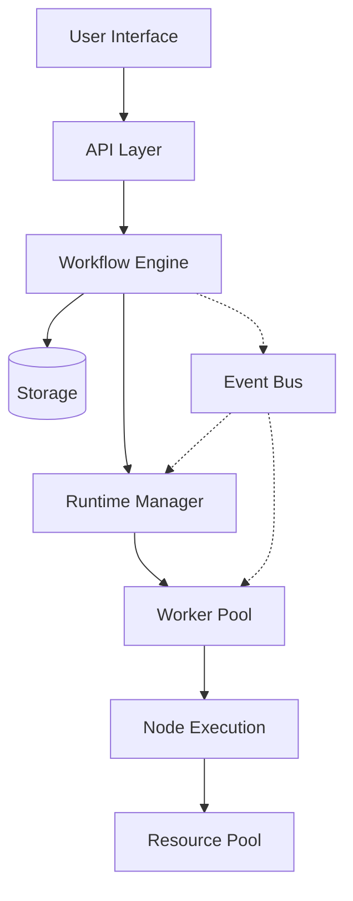

## Core Design Principles

### 1. Type Safety First
Максимальное использование системы типов Rust для предотвращения ошибок на этапе компиляции.

```rust
// Невозможно создать невалидный WorkflowId
pub struct WorkflowId(NonEmptyString);

// Невозможно подключить несовместимые nodes
pub struct Connection<From: OutputPort, To: InputPort<From::DataType>> {
    from: From,
    to: To,
}
```

### 2. Zero-Cost Abstractions
Абстракции не должны добавлять runtime overhead.

```rust
// Compile-time parameter validation
#[derive(Parameters)]
struct NodeParams {
    #[validate(required)]
    url: String, // NOT Option<String> - ошибка компиляции
}
```

### 3. Progressive Complexity
Простые вещи должны быть простыми, сложные - возможными.

```rust
// Простой node
#[node]
async fn uppercase(input: String) -> String {
    input.to_uppercase()
}

// Сложный node с полным контролем
impl Action for ComplexNode {
    // Full control over execution
}
```

### 4. Event-Driven Architecture
Loose coupling через события для масштабируемости.

```rust
pub enum SystemEvent {
    WorkflowDeployed { id: WorkflowId },
    ExecutionStarted { id: ExecutionId },
    NodeCompleted { execution: ExecutionId, node: NodeId },
}
```

## System Components

### Core Layer
- **nebula-core**: Фундаментальные типы и traits
- **nebula-value**: Type-safe value system
- **nebula-memory**: Memory management и caching

### Execution Layer
- **nebula-engine**: Orchestration и scheduling
- **nebula-runtime**: Trigger management
- **nebula-worker**: Node execution environment

### Storage Layer
- **nebula-storage**: Storage abstractions
- **nebula-binary**: Binary data handling

### Developer Layer
- **nebula-derive**: Procedural macros
- **nebula-sdk**: Developer toolkit
- **nebula-expression**: Expression language

## Scalability Architecture

### Horizontal Scaling Model

```
Load Balancer
     │
     ├── API Server 1 ──┐
     ├── API Server 2   ├── Shared Event Bus (Kafka)
     └── API Server N ──┘
                │
     ┌──────────┴──────────┐
     │                     │
Runtime Pool          Worker Pool
┌─────────┐          ┌─────────┐
│Runtime 1│          │Worker 1 │
│Runtime 2│          │Worker 2 │
│   ...   │          │   ...   │
│Runtime N│          │Worker N │
└─────────┘          └─────────┘
```

### Resource Isolation

Каждый execution получает изолированные ресурсы:
- Memory sandbox с лимитами
- CPU throttling
- I/O rate limiting
- Network isolation

## Performance Architecture

### Memory Management Strategy

1. **Arena Allocation** для execution contexts
2. **Object Pooling** для переиспользуемых ресурсов
3. **String Interning** для повторяющихся строк
4. **Copy-on-Write** для больших immutable данных

### Caching Strategy

```rust
// Multi-level cache
L1: Process Memory (LRU)
L2: Redis (Distributed)
L3: Database (Persistent)
```

### Zero-Copy Data Flow

```rust
// Данные передаются по ссылке где возможно
pub enum DataRef<'a> {
    Borrowed(&'a [u8]),
    Owned(Vec<u8>),
    Mapped(MemoryMappedFile),
}
```

---
## FILE: docs/architecture/data-flow.md
---

# Data Flow Architecture

## Overview

Данные в Nebula проходят через несколько уровней трансформации и оптимизации. Система спроектирована для эффективной обработки как маленьких JSON объектов, так и больших бинарных файлов.

## Workflow Execution Data Flow

### 1. Trigger Phase

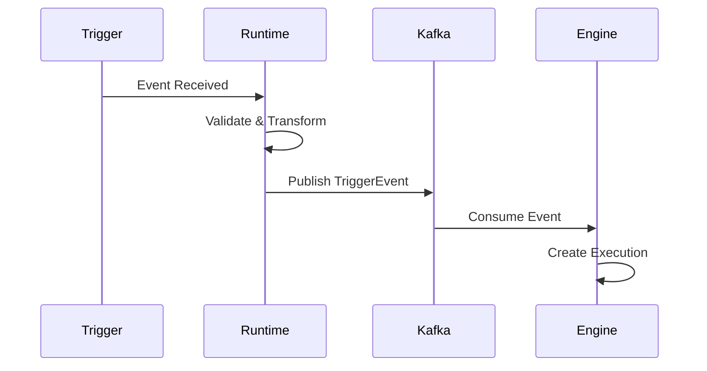

### 2. Execution Phase

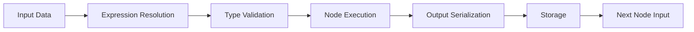

## Data Types and Storage

### Value Types Flow

```rust
// User Input → Typed Value → Validation → Storage → Next Node
pub enum DataLifecycle {
    UserInput(serde_json::Value),
    TypedValue(Value),
    ValidatedValue(ValidatedValue),
    StoredValue(StorageRef),
    RetrievedValue(Value),
}
```

### Binary Data Flow

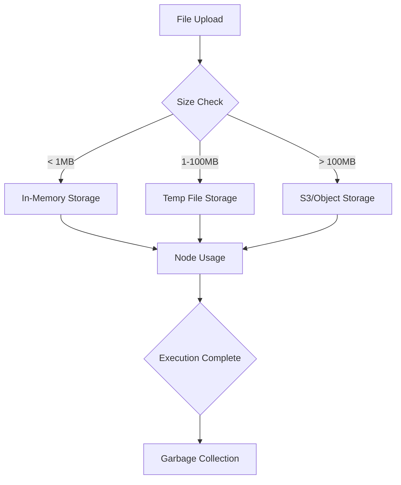

## Expression Resolution Flow

### Expression Evaluation Pipeline

```rust
// Raw Expression → Parse → AST → Resolve References → Evaluate → Result
"$nodes.http.body.users[0].email" 
    → ParseExpression
    → AST { 
        Variable("nodes"),
        Property("http"),
        Property("body"),
        Property("users"),
        Index(0),
        Property("email")
    }
    → ResolveContext { execution_id, node_outputs }
    → "user@example.com"
```

### Context Building

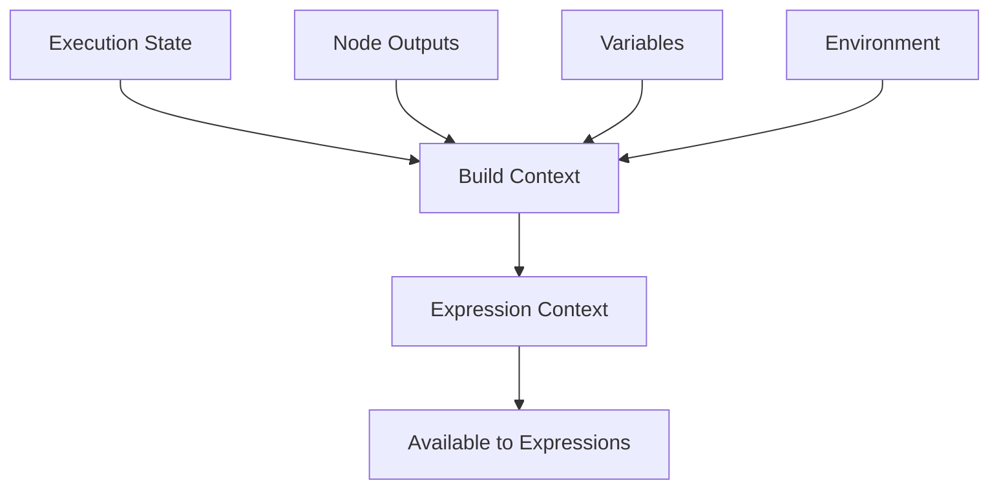

## Streaming Data Flow

### Large Dataset Processing

```rust
pub enum ProcessingMode {
    // Entire dataset in memory
    Batch { data: Vec<Value> },
    
    // Streaming with backpressure
    Stream { 
        source: Box<dyn Stream<Item = Value>>,
        buffer_size: usize,
    },
    
    // Chunked processing
    Chunked {
        chunk_size: usize,
        processor: Box<dyn ChunkProcessor>,
    },
}
```

### Backpressure Handling

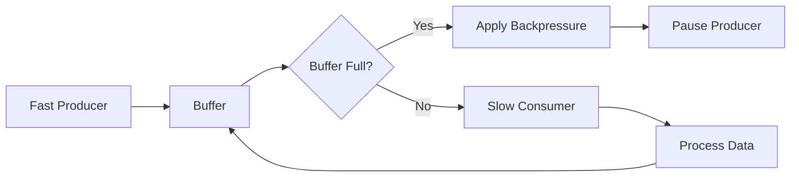

## Error Data Flow

### Error Propagation

```rust
pub enum ErrorFlow {
    // Node level error - can be caught
    NodeError { 
        node_id: NodeId,
        error: Error,
        recovery: RecoveryStrategy,
    },
    
    // Workflow level error - stops execution
    WorkflowError {
        execution_id: ExecutionId,
        error: Error,
    },
    
    // System level error - requires intervention
    SystemError {
        component: Component,
        error: Error,
        impact: Impact,
    },
}
```

### Error Recovery Flow

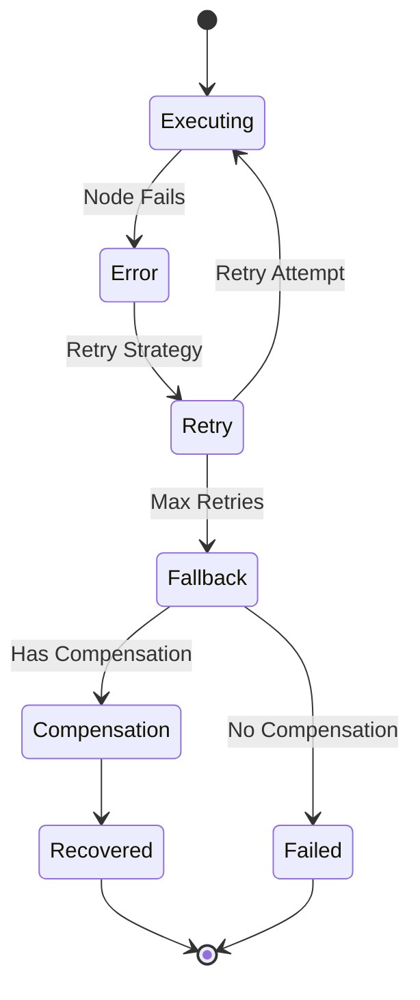

## Performance Optimizations

### Data Locality

```rust
// Keep data close to computation
pub struct DataLocality {
    // Prefer same worker for sequential nodes
    worker_affinity: Option<WorkerId>,
    
    // Cache hot data in worker memory
    local_cache: LruCache<DataKey, Value>,
    
    // Predictive prefetching
    prefetch_queue: VecDeque<DataKey>,
}
```

### Zero-Copy Strategies

```rust
// Avoid copying data when possible
pub enum DataTransfer {
    // Same process - use Arc
    SharedMemory(Arc<Value>),
    
    // Same machine - use mmap
    MemoryMapped(MmapFile),
    
    // Different machines - use streaming
    Network(TcpStream),
}
```

---
## FILE: docs/architecture/execution-model.md
---

# Execution Model

## Overview

Nebula использует event-driven, асинхронную модель выполнения workflows. Каждый workflow execution проходит через определенные состояния и может быть приостановлен, возобновлен или отменен.

## Execution Lifecycle

### State Machine

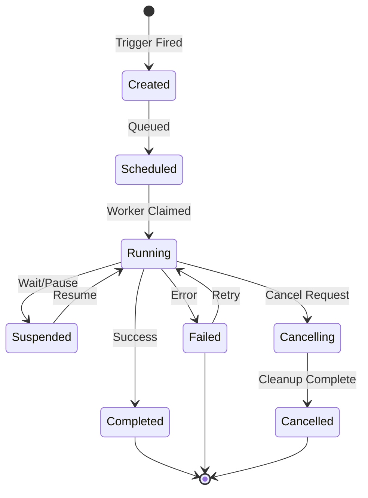

### Execution States

```rust
pub enum ExecutionStatus {
    // Initial state
    Created { 
        created_at: DateTime<Utc>,
        trigger: TriggerInfo,
    },
    
    // Waiting for worker
    Scheduled {
        scheduled_at: DateTime<Utc>,
        priority: Priority,
    },
    
    // Active execution
    Running {
        started_at: DateTime<Utc>,
        current_node: NodeId,
        worker_id: WorkerId,
    },
    
    // Temporarily stopped
    Suspended {
        suspended_at: DateTime<Utc>,
        reason: SuspendReason,
        resume_condition: ResumeCondition,
    },
    
    // Terminal states
    Completed {
        completed_at: DateTime<Utc>,
        outputs: HashMap<NodeId, Value>,
    },
    
    Failed {
        failed_at: DateTime<Utc>,
        error: Error,
        failed_node: NodeId,
    },
    
    Cancelled {
        cancelled_at: DateTime<Utc>,
        reason: String,
    },
}
```

## Node Execution Model

### Sequential Execution

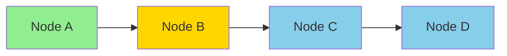

### Parallel Execution

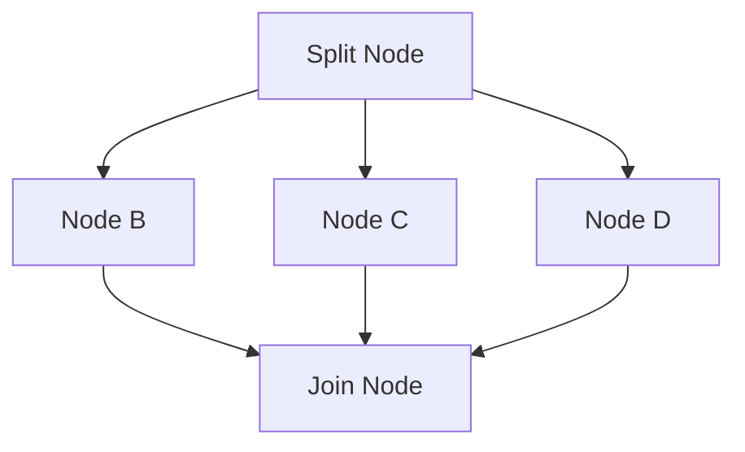

### Conditional Execution

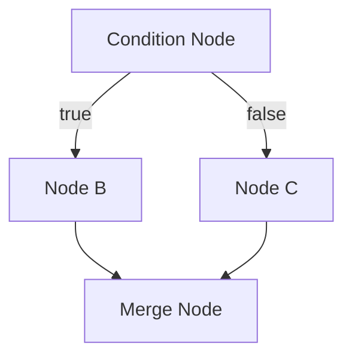

## Execution Context

### Context Hierarchy

```rust
pub struct ExecutionContext {
    // Global execution data
    pub execution: ExecutionMetadata,
    
    // Workflow-level context
    pub workflow: WorkflowContext,
    
    // Node-level context
    pub node: NodeContext,
    
    // Shared resources
    pub resources: ResourceContext,
    
    // Expression evaluation context
    pub expressions: ExpressionContext,
}

pub struct ExpressionContext {
    // Previous node outputs
    pub nodes: HashMap<NodeId, Value>,
    
    // User-defined variables
    pub vars: HashMap<String, Value>,
    
    // System variables
    pub system: SystemVariables,
    
    // Environment variables
    pub env: HashMap<String, String>,
}
```

### Resource Isolation

```rust
pub struct NodeSandbox {
    // Memory limits
    memory_limit: MemoryLimit,
    memory_used: AtomicUsize,
    
    // CPU limits
    cpu_quota: CpuQuota,
    cpu_used: AtomicU64,
    
    // I/O limits
    io_limits: IoLimits,
    io_stats: IoStats,
    
    // Network limits
    network_limits: NetworkLimits,
    network_stats: NetworkStats,
}
```

## Scheduling Model

### Work Distribution

```rust
pub enum SchedulingStrategy {
    // Round-robin distribution
    RoundRobin,
    
    // Least loaded worker
    LeastLoaded,
    
    // Worker affinity
    Affinity {
        prefer_same_worker: bool,
        node_affinity: HashMap<NodeType, WorkerId>,
    },
    
    // Priority-based
    Priority {
        queue: BinaryHeap<PriorityExecution>,
    },
}
```

### Worker Selection

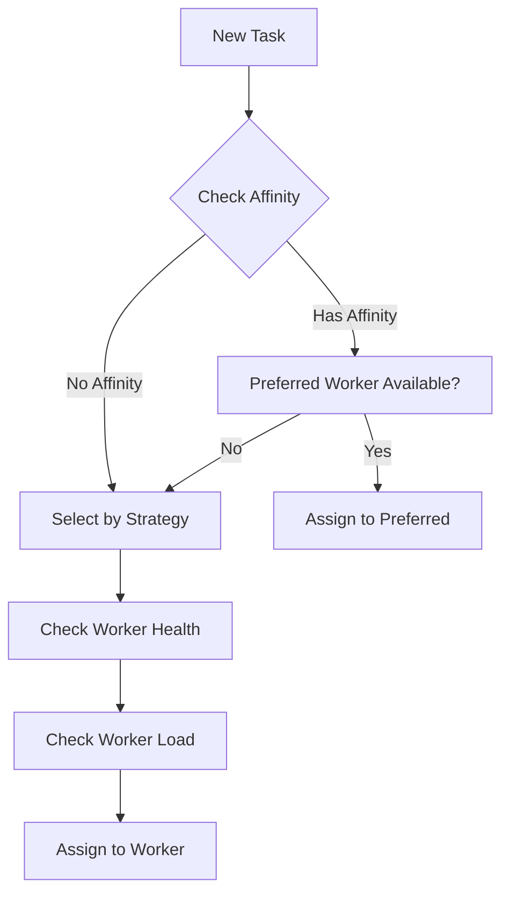

## Concurrency Model

### Actor-based Workers

```rust
pub struct Worker {
    id: WorkerId,
    mailbox: mpsc::Receiver<WorkerMessage>,
    state: WorkerState,
}

pub enum WorkerMessage {
    ExecuteNode {
        execution_id: ExecutionId,
        node_id: NodeId,
        input: Value,
    },
    
    Shutdown,
    
    HealthCheck {
        response: oneshot::Sender<HealthStatus>,
    },
}
```

### Lock-Free Execution

```rust
// Using atomic operations for state management
pub struct LockFreeExecutionState {
    status: AtomicU8, // Maps to ExecutionStatus
    current_node: AtomicPtr<NodeId>,
    worker_id: AtomicU64,
    
    // Lock-free queue for events
    events: lockfree::queue::Queue<ExecutionEvent>,
}
```

## Fault Tolerance

### Checkpointing

```rust
pub struct Checkpoint {
    pub execution_id: ExecutionId,
    pub timestamp: DateTime<Utc>,
    pub completed_nodes: HashSet<NodeId>,
    pub node_outputs: HashMap<NodeId, Value>,
    pub variables: HashMap<String, Value>,
}

// Checkpoint after each node completion
impl Worker {
    async fn checkpoint(&self, execution: &Execution) -> Result<()> {
        let checkpoint = execution.create_checkpoint();
        self.storage.save_checkpoint(checkpoint).await
    }
}
```

### Recovery Model

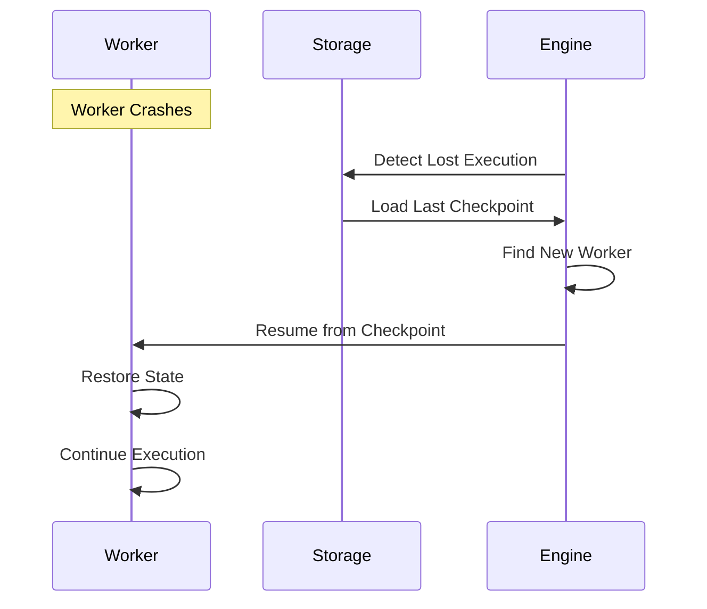

---
## FILE: docs/architecture/plugin-system.md
---

# Plugin System Architecture

## Overview

Nebula поддерживает расширение функциональности через систему плагинов. Плагины могут добавлять новые nodes, resources, и интеграции без изменения core системы.

## Plugin Architecture

### Plugin Structure

```rust
// Standard plugin interface
#[repr(C)]
pub struct PluginInterface {
    // ABI version for compatibility
    pub abi_version: u32,
    
    // Plugin metadata
    pub metadata: extern "C" fn() -> PluginMetadata,
    
    // Lifecycle hooks
    pub init: extern "C" fn(*mut PluginContext) -> i32,
    pub shutdown: extern "C" fn() -> i32,
    
    // Node registration
    pub register_nodes: extern "C" fn(*mut NodeRegistry) -> i32,
}

pub struct PluginMetadata {
    pub name: *const c_char,
    pub version: *const c_char,
    pub author: *const c_char,
    pub description: *const c_char,
    pub license: *const c_char,
}
```

### Plugin Loading Process

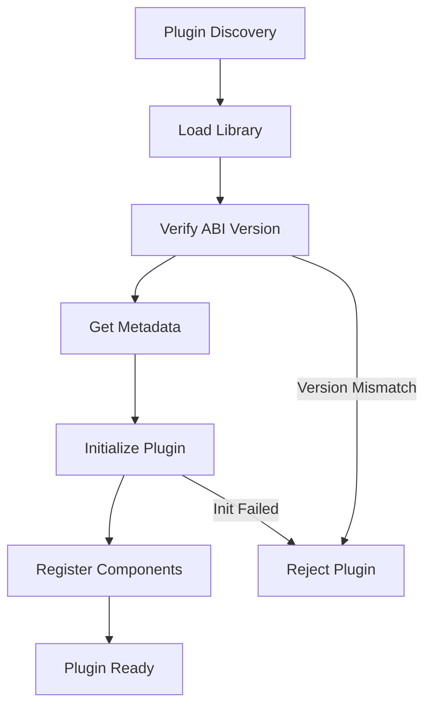

## Plugin Development

### Basic Plugin Structure

```rust
// my-plugin/src/lib.rs
use nebula_sdk::prelude::*;

// Define the plugin interface
#[no_mangle]
pub extern "C" fn plugin_interface() -> PluginInterface {
    PluginInterface {
        abi_version: NEBULA_ABI_VERSION,
        metadata: plugin_metadata,
        init: plugin_init,
        shutdown: plugin_shutdown,
        register_nodes: register_nodes,
    }
}

#[no_mangle]
pub extern "C" fn plugin_metadata() -> PluginMetadata {
    PluginMetadata {
        name: c_str!("My Plugin"),
        version: c_str!(env!("CARGO_PKG_VERSION")),
        author: c_str!("Author Name"),
        description: c_str!("Plugin description"),
        license: c_str!("MIT"),
    }
}

#[no_mangle]
pub extern "C" fn register_nodes(registry: *mut NodeRegistry) -> i32 {
    let registry = unsafe { &mut *registry };
    
    registry.register(Box::new(MyCustomNode::new()));
    registry.register(Box::new(AnotherNode::new()));
    
    0 // Success
}
```

### Plugin Manifest

```toml
# plugin.toml
[plugin]
name = "my-awesome-plugin"
version = "0.1.0"
authors = ["Your Name <email@example.com>"]
description = "Adds awesome functionality to Nebula"
license = "MIT"

[compatibility]
nebula = "^0.1"
abi_version = 1

[dependencies]
# Other plugins this plugin depends on
oauth-plugin = "^1.0"

[nodes]
# Nodes provided by this plugin
my_custom_node = { category = "Custom", icon = "custom.svg" }
another_node = { category = "Utilities", icon = "util.svg" }

[resources]
# Resources provided by this plugin
my_api_client = { type = "http_client", config = "api_config.toml" }
```

## Plugin Isolation

### Security Model

```rust
pub struct PluginSandbox {
    // Capability-based security
    capabilities: HashSet<Capability>,
    
    // Resource limits
    memory_limit: usize,
    cpu_quota: f64,
    
    // Network restrictions
    allowed_hosts: Vec<String>,
    blocked_ports: Vec<u16>,
    
    // Filesystem access
    allowed_paths: Vec<PathBuf>,
    temp_dir: PathBuf,
}

pub enum Capability {
    // Network access
    NetworkAccess,
    NetworkListen,
    
    // Filesystem
    FileRead(PathBuf),
    FileWrite(PathBuf),
    
    // System
    SpawnProcess,
    SystemInfo,
    
    // Resources
    CreateResource(ResourceType),
    AccessResource(ResourceType),
}
```

### Resource Access Control

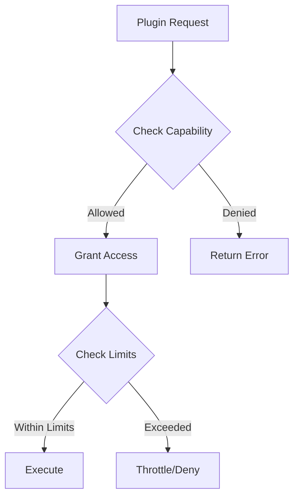

## Plugin Registry

### Discovery Mechanisms

```rust
pub enum PluginSource {
    // Local filesystem
    Directory { path: PathBuf },
    
    // Git repository
    Git { 
        url: String,
        branch: Option<String>,
        subpath: Option<String>,
    },
    
    // Registry
    Registry {
        url: String,
        name: String,
        version: VersionReq,
    },
    
    // Direct download
    Url { url: String },
}
```

### Version Management

```rust
pub struct PluginVersion {
    pub version: semver::Version,
    pub compatibility: CompatibilityInfo,
    pub changelog: String,
    pub download_url: String,
    pub checksum: String,
}

pub struct CompatibilityInfo {
    pub min_nebula_version: semver::Version,
    pub max_nebula_version: Option<semver::Version>,
    pub abi_version: u32,
    pub breaking_changes: Vec<String>,
}
```

## Plugin Communication

### Inter-Plugin Communication

```rust
// Plugins can communicate through channels
pub struct PluginChannel {
    sender: mpsc::Sender<PluginMessage>,
    receiver: mpsc::Receiver<PluginMessage>,
}

pub enum PluginMessage {
    // Request-response pattern
    Request {
        id: MessageId,
        method: String,
        params: Value,
    },
    
    Response {
        id: MessageId,
        result: Result<Value, Error>,
    },
    
    // Event broadcasting
    Event {
        event_type: String,
        data: Value,
    },
}
```

### Shared State

```rust
// Plugins can share state through a controlled interface
pub struct SharedState {
    // Read-only access to global config
    config: Arc<Config>,
    
    // Shared cache with access control
    cache: Arc<RwLock<Cache>>,
    
    // Event bus for notifications
    event_bus: Arc<EventBus>,
}
```

## Hot Reloading

### Plugin Hot Reload Process

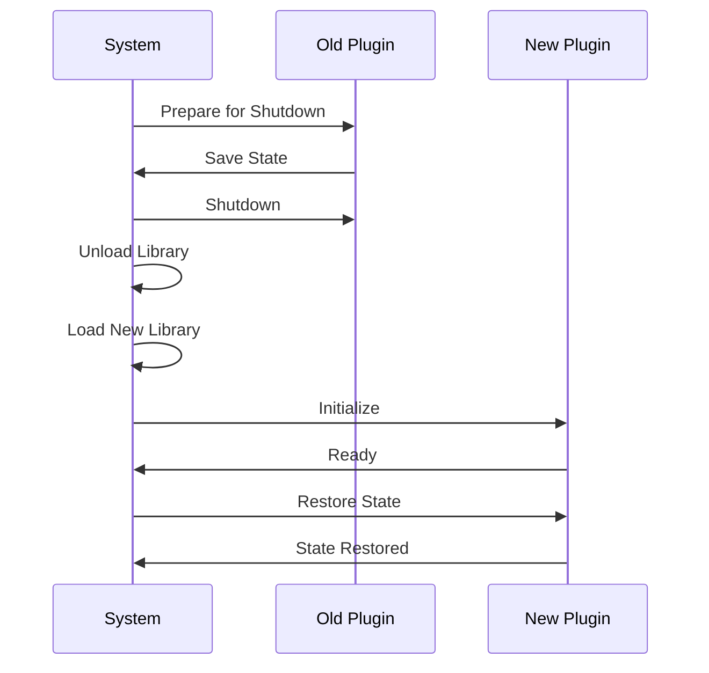

### State Migration

```rust
// Plugins must handle state migration
#[derive(Serialize, Deserialize)]
pub struct PluginState {
    version: u32,
    data: Value,
}

pub trait StateMigration {
    fn migrate_state(&self, old_state: PluginState) -> Result<PluginState, Error> {
        match old_state.version {
            1 => self.migrate_v1_to_v2(old_state),
            2 => Ok(old_state), // Current version
            _ => Err(Error::UnsupportedVersion),
        }
    }
}
```

---
## FILE: docs/architecture/security.md
---

# Security Architecture

## Overview

Nebula implements defense-in-depth security architecture с multiple layers of protection. Security considerations are built into every component from the ground up.

## Threat Model

### Identified Threats

1. **Malicious Nodes**
   - Arbitrary code execution
   - Resource exhaustion
   - Data exfiltration
   - Privilege escalation

2. **Data Security**
   - Unauthorized access to workflows
   - Credential leakage
   - Data tampering
   - Information disclosure

3. **System Integrity**
   - Workflow manipulation
   - State corruption
   - Replay attacks
   - Denial of service

4. **External Threats**
   - API authentication bypass
   - Injection attacks
   - MITM attacks
   - Brute force attacks

## Security Layers

### Layer 1: API Security

```rust
pub struct ApiSecurity {
    // Authentication methods
    auth: AuthenticationProvider,
    
    // Authorization engine
    authz: AuthorizationEngine,
    
    // Rate limiting
    rate_limiter: RateLimiter,
    
    // Request validation
    validator: RequestValidator,
}

pub enum AuthenticationMethod {
    // JWT tokens
    Jwt {
        issuer: String,
        audience: String,
        signing_key: JwkSet,
    },
    
    // API keys
    ApiKey {
        header_name: String,
        validator: Box<dyn ApiKeyValidator>,
    },
    
    // OAuth2
    OAuth2 {
        provider: OAuth2Provider,
        scopes: Vec<String>,
    },
    
    // mTLS
    MutualTls {
        ca_cert: Certificate,
        verify_depth: u32,
    },
}
```

### Layer 2: Workflow Security

```rust
pub struct WorkflowSecurity {
    // Workflow validation
    validator: WorkflowValidator,
    
    // Access control
    acl: AccessControlList,
    
    // Execution policies
    policies: ExecutionPolicies,
    
    // Audit logging
    audit: AuditLogger,
}

pub struct ExecutionPolicies {
    // Maximum execution time
    max_execution_time: Duration,
    
    // Resource limits
    resource_limits: ResourceLimits,
    
    // Allowed node types
    allowed_nodes: HashSet<NodeType>,
    
    // Network policies
    network_policies: NetworkPolicies,
}
```

### Layer 3: Node Isolation

```rust
pub struct NodeIsolation {
    // Memory isolation
    memory_sandbox: MemorySandbox,
    
    // Process isolation
    process_isolation: ProcessIsolation,
    
    // Capability system
    capabilities: CapabilitySystem,
    
    // Syscall filtering
    syscall_filter: SyscallFilter,
}

// Capability-based security
pub struct CapabilitySystem {
    // Grant minimal required capabilities
    granted: HashSet<Capability>,
    
    // Explicitly denied capabilities
    denied: HashSet<Capability>,
    
    // Dynamic capability checks
    checker: Box<dyn CapabilityChecker>,
}
```

### Layer 4: Data Protection

```rust
pub struct DataProtection {
    // Encryption at rest
    encryption: EncryptionProvider,
    
    // Key management
    key_manager: KeyManager,
    
    // Data classification
    classifier: DataClassifier,
    
    // Access logging
    access_logger: AccessLogger,
}

// Credential management
pub struct CredentialVault {
    // Encrypted storage
    backend: EncryptedBackend,
    
    // Access control
    acl: CredentialAcl,
    
    // Rotation policy
    rotation: RotationPolicy,
    
    // Audit trail
    audit: AuditTrail,
}
```

## Authentication & Authorization

### RBAC Model

```rust
pub struct RbacModel {
    // Users
    users: HashMap<UserId, User>,
    
    // Roles
    roles: HashMap<RoleId, Role>,
    
    // Permissions
    permissions: HashMap<PermissionId, Permission>,
    
    // Role assignments
    assignments: HashMap<UserId, Vec<RoleId>>,
}

pub struct Permission {
    pub resource: Resource,
    pub action: Action,
    pub constraints: Vec<Constraint>,
}

pub enum Resource {
    Workflow { id: Option<WorkflowId> },
    Execution { id: Option<ExecutionId> },
    Node { type_: Option<NodeType> },
    Credential { id: Option<CredentialId> },
}

pub enum Action {
    Create,
    Read,
    Update,
    Delete,
    Execute,
    Share,
}
```

### Token Security

```rust
pub struct TokenSecurity {
    // Token generation
    generator: TokenGenerator,
    
    // Token validation
    validator: TokenValidator,
    
    // Token storage
    store: TokenStore,
    
    // Revocation list
    revocation: RevocationList,
}

pub struct JwtToken {
    // Standard claims
    pub iss: String,  // Issuer
    pub sub: String,  // Subject
    pub aud: String,  // Audience
    pub exp: i64,     // Expiration
    pub iat: i64,     // Issued at
    pub jti: String,  // JWT ID
    
    // Custom claims
    pub roles: Vec<String>,
    pub permissions: Vec<String>,
    pub workflow_access: Vec<WorkflowId>,
}
```

## Secure Communication

### TLS Configuration

```rust
pub struct TlsConfig {
    // Minimum TLS version
    min_version: TlsVersion,
    
    // Cipher suites
    cipher_suites: Vec<CipherSuite>,
    
    // Certificate validation
    cert_verifier: CertificateVerifier,
    
    // ALPN protocols
    alpn_protocols: Vec<String>,
}

impl Default for TlsConfig {
    fn default() -> Self {
        Self {
            min_version: TlsVersion::Tls13,
            cipher_suites: vec![
                CipherSuite::TLS13_AES_256_GCM_SHA384,
                CipherSuite::TLS13_AES_128_GCM_SHA256,
            ],
            cert_verifier: CertificateVerifier::default(),
            alpn_protocols: vec!["h2".to_string(), "http/1.1".to_string()],
        }
    }
}
```

### End-to-End Encryption

```rust
pub struct E2EEncryption {
    // Key exchange
    key_exchange: KeyExchange,
    
    // Symmetric encryption
    cipher: SymmetricCipher,
    
    // Message authentication
    mac: MessageAuthenticationCode,
    
    // Perfect forward secrecy
    pfs: PerfectForwardSecrecy,
}
```

## Input Validation

### Request Validation

```rust
pub struct RequestValidator {
    // Schema validation
    schema_validator: SchemaValidator,
    
    // Input sanitization
    sanitizer: InputSanitizer,
    
    // Injection prevention
    injection_guard: InjectionGuard,
    
    // Size limits
    size_limiter: SizeLimiter,
}

pub struct InjectionGuard {
    // SQL injection
    sql_guard: SqlInjectionGuard,
    
    // NoSQL injection
    nosql_guard: NoSqlInjectionGuard,
    
    // Command injection
    command_guard: CommandInjectionGuard,
    
    // Path traversal
    path_guard: PathTraversalGuard,
}
```

## Audit & Compliance

### Audit Logging

```rust
pub struct AuditLogger {
    // Event types to audit
    event_types: HashSet<AuditEventType>,
    
    // Storage backend
    storage: AuditStorage,
    
    // Integrity protection
    integrity: IntegrityProtection,
    
    // Retention policy
    retention: RetentionPolicy,
}

pub struct AuditEvent {
    pub id: Uuid,
    pub timestamp: DateTime<Utc>,
    pub user: UserId,
    pub action: Action,
    pub resource: Resource,
    pub result: Result<(), Error>,
    pub metadata: HashMap<String, Value>,
    pub signature: Signature,
}
```

### Compliance Framework

```rust
pub struct ComplianceFramework {
    // GDPR compliance
    gdpr: GdprCompliance,
    
    // SOC2 compliance
    soc2: Soc2Compliance,
    
    // HIPAA compliance
    hipaa: HipaaCompliance,
    
    // Custom policies
    custom_policies: Vec<CompliancePolicy>,
}

pub trait CompliancePolicy {
    fn validate(&self, context: &ComplianceContext) -> Result<(), ComplianceViolation>;
    fn audit_requirements(&self) -> Vec<AuditRequirement>;
    fn data_retention_policy(&self) -> RetentionPolicy;
}
```

## Security Best Practices

### Secure Defaults

1. **Deny by default** - все permissions должны быть явно granted
2. **Least privilege** - минимальные необходимые права
3. **Defense in depth** - multiple security layers
4. **Zero trust** - verify everything, trust nothing

### Security Headers

```rust
pub fn security_headers() -> HeaderMap {
    let mut headers = HeaderMap::new();
    
    headers.insert("X-Content-Type-Options", "nosniff".parse().unwrap());
    headers.insert("X-Frame-Options", "DENY".parse().unwrap());
    headers.insert("X-XSS-Protection", "1; mode=block".parse().unwrap());
    headers.insert("Strict-Transport-Security", "max-age=31536000; includeSubDomains".parse().unwrap());
    headers.insert("Content-Security-Policy", "default-src 'self'".parse().unwrap());
    headers.insert("Referrer-Policy", "strict-origin-when-cross-origin".parse().unwrap());
    
    headers
}
```