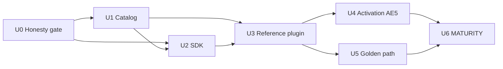

# feat: Integrator flagship platform (milestone 1)

## Summary

> **Doc gate:** [`2026-05-17-002-refactor-doc-consolidation-plan.md`](./2026-05-17-002-refactor-doc-consolidation-plan.md) completed (U8 verification green) — safe to start U0+.

Deliver the **integrator-ready platform** slice from `STRATEGY.md` Flagship **without
compounding existing mistakes**: fix false docs, weak scaffolds, and naming drift
**before** shipping new surface area. Includes a documented `Action` trait family,
an honest **credential catalog** (ApiKey, OAuth2 — correct crate ownership, no
duplicate OAuth stacks), a **reference plugin** on the `nebula-sdk` golden path,
and **proof tests** (knife-aligned + activation-chain) that match MATURITY **L3**
before any public claim. Agent hub, `nebula-agent`, MCP, visual editor, and
product copilot stay out of scope. (see origin: R13–R16, KD11)

**Execution posture:** treat wrong names, phantom README types, and “scaffold
forever” as **blockers**, not follow-up chores. If U1 discovers the contract crate
already owns the right generic types, **relocate or thin-wrap** — do not fork a
second catalog.

---

## Problem Frame

Strategy and brainstorm lock the 2026 bar and flagship definition, but
`nebula-credential-builtin` is still a **П1 scaffold** (no concrete OAuth2/API
key types), there is **no in-repo reference plugin** with `plugin.toml`, and
integrators cannot yet meet AE4 (“ship a plugin the same day”) without reading
engine folklore. This plan closes that gap without expanding into agent or MCP
work. (see origin: Problem Frame, F1, AE4)

---

## Requirements

- R1. **Credential catalog** — built-in, documented credential types for **API key**
  and **OAuth2** (and at least one additional common scheme if already specified
  in `nebula-credential` contract) that integrators subclass or register, not
  reimplement transport. (origin R8, R13, AE4)
- R2. **Reference plugin** — one first-party plugin bundle demonstrating
  Schema → Credential/Resource → Action → `Plugin` registration, runnable locally.
  (origin R13, F1, AE4)
- R3. **SDK golden path** — `nebula-sdk` prelude and README prove one-import
  authoring; no duplicate OAuth façade. (origin R12, ADR-0055)
- R4. **Activation honesty** — resource/action graphs fail at activation when a
  required credential slot is missing (Slack-style chain). (origin R9, AE5)
- R5. **Proof before claims** — extend or add tests so flagship dimensions touched
  here are **MATURITY L3**-honest; no marketing L3 without engine ownership.
  (origin R2, user decision OQ3 → L3 gate)
- R6. **Operational honesty** — canon §4.5: README/MATURITY/STRATEGY claims match
  what knife and new integrator tests prove. (origin SC3)
- R7. **Snowball prevention** — no new public names or docs that contradict code;
  retire phantom types, Cyrillic phase jargon in author-facing paths, and doc
  contradictions (plugin stable vs partial, SDK prelude vs README) in **U0** before
  expanding API surface. (user: tech-debt-first)

**Origin actors:** A1 Integration author, A3 Tech lead
**Origin flows:** F1 Integrator day-one, F3 Dependency chain resolve
**Origin acceptance examples:** AE4 Integrator flagship, AE5 SlackResource chain

---

## Scope Boundaries

### Deferred for later

- **MCP wire protocol** and external MCP server/client interop (origin scope).
- **`AgentAction` hub**, `AgentTool`, `ResourceTool`, `nebula-agent` crate
  (ADR-0057 remains proposed; separate milestone). (origin R10–R11, KD4)
- Product-user copilot (generate workflow, explain runs). (origin R17)
- Visual editor / ADR-0065 agent-hub rendering modes. (origin visual wedge)
- WASM/WASI-primary plugins. (origin scope)

### Outside this product's identity

- Pre-AI-only workflow engine.
- Scope-trimmed MVP cutting visual, agent, durable, or AI primitives.
- Calendar-month gating as primary plan language.
- Second LLM orchestration stack parallel to Nebula engine.
- Low-code as **primary** author surface.

### Deferred to Follow-Up Work

- **Unified run record / LLM journal events** — journal wedge; separate plan after
  flagship substrate is green.
- **time_to_first_typed_agent_tool** metric — agent milestone; this plan seeds
  **time_to_first_typed_integration** (classical golden path) only.
- **Full credential scheme matrix** (every vendor) — catalog covers canonical
  shapes; vendor-specific contrib crates later.

---

## Context & Research

### Relevant Code and Patterns

- `STRATEGY.md` — Flagship, SDK surface, dependency graph, MCP timing.
- `docs/PRODUCT_CANON.md` — §4.5 operational honesty, §11 durability, §12.5 credentials.
- `docs/adr/0055-nebula-sdk-facade.md` — single façade decision.
- `docs/adr/0033-integration-credentials-plane-b.md` — Plane B integration credentials.
- `docs/adr/0044-supersede-0036-resource-credential-singular.md` — slot-based credentials on resources.
- `crates/credential-builtin/src/lib.rs` — empty П3 scaffold; `sealed_caps` per ADR-0035.
- `crates/credential/README.md` — contract, ADR-0028–0032 pointers.
- `crates/sdk/README.md` — prelude re-export audit (P11).
- `crates/api/tests/knife.rs` — canon §13 knife scenario.
- `examples/examples/m6_*.rs` — reference patterns for resource/action demos (not full plugins).

### Institutional Learnings

- No `docs/solutions/` entries in repo (none applicable).

### External References

- None required — local patterns for credentials (engine refresh, api OAuth) and
  M6 examples are sufficient for milestone 1.

---

## Key Technical Decisions

| Decision | Choice | Rationale |
|----------|--------|-----------|
| Milestone boundary | Integrator flagship only | User-confirmed scope; avoids agent/MCP scope creep. |
| Public claim bar | **MATURITY L3** per touched dimension | User chose L3 over “integrator-ready + knife only”. |
| **Catalog ownership** | **Contract** (`nebula-credential`) owns generic `OAuth2Credential` / `ApiKeyCredential`; **builtin** owns **catalog entries** (metadata, keys, optional thin wrappers) — **no second OAuth HTTP stack** | Types already in `crates/credential/src/credentials/`; duplicating in builtin is the main snowball risk. |
| Builtin vs “vendor names” | Ship **scheme-level** catalog first (`api_key`, `oauth2`); vendor labels (`SlackOAuth2`, …) only as **registered instances** with honest `KEY`s — remove phantom README list until code exists | README currently lists types that do not exist. |
| Author language | English in integrator-facing READMEs, rustdoc, MATURITY rows touched by this milestone; replace **П1/П3** phase labels with neutral “scaffold” / “catalog” wording | Reduces confusion for international integrators and agents. |
| Reference plugin location | `plugins/reference/` workspace member if `deny.toml` allows; else `examples/reference-plugin` with explicit “not for production layout” banner | Must have real `plugin.toml`; m6_* examples are **not** plugins. |
| Plugin process model | **In-process `impl Plugin`** for golden path first; document out-of-process `plugin-sdk` as advanced | `PluginCtx` in plugin-sdk is still placeholder — do not pretend duplex RPC is day-one. |
| OAuth transport | Integrator docs state: **resolve/refresh HTTP = engine/api** (ADR-0031); SDK prelude exports contract types, not a self-contained OAuth client | Prevents AE4 failure when authors call `refresh` in isolation. |
| ADR hygiene | Renumber or retitle duplicate **`0042-*`** ADRs in a small docs PR (retry vs node-binding) | Wrong links accumulate in PRs. |
| Proof strategy | Knife unchanged + integrator golden-path + activation negative test | Operator vs author proof separation. |

---

## Tech-debt register (fix, don’t accumulate)

| ID | Severity | Issue | Fix in |
|----|----------|-------|--------|
| TD-1 | P0 | `credential-builtin` README lists vendor types **not in source** | U0 |
| TD-2 | P0 | Empty builtin scaffold marketed as “catalog” in STRATEGY/MATURITY | U0 + U1 |
| TD-3 | P0 | `nebula-sdk` README claims traits prelude does not export (`ResourceAction`, …) | U0 + U2 |
| TD-4 | P0 | No in-repo `plugin.toml` / reference bundle | U0 design + U3 |
| TD-5 | P0 | `examples/m6_*` cited as integration path but bypass `nebula-sdk` + `Plugin` | U0 docs + U3 |
| TD-6 | P1 | `nebula-plugin` README “partial / slice B” vs MATURITY **stable** | U0 + U6 |
| TD-7 | P1 | Resource MATURITY “stable” while bind-population / activation incomplete (blocks AE5) | U4 (test + honest row) |
| TD-8 | P1 | `deny.toml` self-only wrapper on `credential-builtin` blocks engine/server consumers | U0 + U1 |
| TD-9 | P2 | Duplicate ADR number `0042` | U0 or parallel docs chore |
| TD-10 | P2 | `AgentAction` in STRATEGY without trait in code | U0 STRATEGY wording |
| TD-11 | P2 | MATURITY links to archived `docs/superpowers/...` | U6 |

---

## High-Level Technical Design

*Directional guidance for review — not implementation specification.*

```text
Integrator author
    │
    ▼
nebula-sdk::prelude  ──► Schema (forms)
    │                      │
    │                      ├──► Credential builtin (ApiKey, OAuth2, …)
    │                      ├──► Resource (optional, e.g. Slack client)
    │                      └──► Action (StatelessAction / ResourceAction)
    ▼
Plugin manifest ──► ProcessSandbox load
    ▼
Engine activation graph validate ──► run (knife / golden-path test)
```

**Activation failure path (AE5):** `SlackResource` (or reference equivalent) declares
`#[credential]` slot → workflow node omits binding → activation returns structured
error before execute.

---

## System-Wide Impact

| Surface | Impact |
|---------|--------|
| `nebula-credential-builtin` | New public types; MATURITY row moves from scaffold → partial/stable per honest bar. |
| `nebula-sdk` | Prelude/README updates; possible new re-exports from builtin. |
| `deny.toml` | May need wrapper entry if `plugins/reference` is a new member. |
| `docs/MATURITY.md` | Rows updated only when L3 criteria met. |
| CI | New integration test target; `task dev:check` gate. |
| API/OpenAPI | No new public HTTP surface required for milestone 1. |

---

## Implementation Units

### U0. Baseline honesty and architecture lock (gate)

**Goal:** Stop false integrator signals and lock catalog architecture **before**
new types ship. No U1–U6 PR may merge without U0 (or explicit TD waiver in PR
description).

**Requirements:** R6, R7
**Dependencies:** none

**Files:**
- `crates/credential-builtin/README.md`, `crates/credential-builtin/src/lib.rs` (comments)
- `crates/sdk/README.md`
- `crates/plugin/README.md`
- `docs/MATURITY.md` (rows: credential-builtin, plugin, sdk — honesty pass only)
- `STRATEGY.md` (Flagship + examples note)
- `deny.toml` (draft diff for `plugins/reference` + builtin consumers — may land in U3)
- `docs/adr/` — optional: renumber `0042-layered-retry.md` → `0042a` or next free id (TD-9)

**Approach:**
1. **README truth:** Remove phantom vendor credential names; state “scheme catalog
   in progress”; point to contract `OAuth2Credential` / `ApiKeyCredential` for generics.
2. **Architecture memo** (short section in builtin README): contract = traits +
   generic schemes; builtin = first-party **catalog registrations**; plugins = own
   `sealed_caps` + `#[plugin_credential]` — **never** depend on builtin.
3. **SDK README:** Align exported trait list with `prelude.rs`; add “OAuth HTTP lives
   in engine/api” callout.
4. **Plugin README vs MATURITY:** Pick one story (code has manifest parsing + registry;
   update README if still “partial” incorrectly).
5. **STRATEGY:** Mark `AgentAction` / AI shapes as **deferred** in Flagship checklist;
   note m6 examples = resource topology only.
6. **`deny.toml` spike:** Confirm wrapper rows needed for reference plugin + who may
   depend on `nebula-credential-builtin`.

**Test scenarios:**
- Test expectation: none — review checklist: no doc claims types that `rg` cannot find.

**Verification:** Reviewer sign-off on TD-1–TD-6 cleared or explicitly deferred with issue link.

---

### U1. Credential catalog (ApiKey + OAuth2)

**Goal:** Ship reusable built-in credential types with `Schema` forms and ADR-0035
capability wiring so integrators do not reimplement auth plumbing.

**Requirements:** R1, R6, R7
**Dependencies:** U0

**Files:**
- `crates/credential-builtin/src/lib.rs`
- `crates/credential-builtin/src/*.rs` (new modules per scheme)
- `crates/credential-builtin/README.md`
- `crates/credential-builtin/Cargo.toml`
- `crates/credential-builtin/tests/` (integration + compile-fail as needed)
- `docs/MATURITY.md` (row update when L3-honest)

**Approach:**
- Follow U0 architecture lock: **extend** `crates/credential/src/credentials/{oauth2,api_key}.rs`
  only if generic behavior is missing; otherwise builtin adds **catalog types** that
  compose/register those generics (metadata `KEY`, schema fields, capability wiring).
- Remove `#[allow(dead_code)]` from `sealed_caps` when traits are used; no permanent
  dead_code escape hatch.
- Naming: stable `KEY` strings (`nebula.builtin.oauth2`, `nebula.builtin.api_key`) —
  no vendor-branded type names until impl exists.
- Expand `deny.toml` `[wrappers]` for legitimate consumers (engine catalog registration,
  sdk prelude) — avoid self-only trap (TD-8).
- Defer AwsSigV4 / vendor-specific types unless required for AE4; scheme-level catalog
  satisfies R1.

**Patterns to follow:**
- `crates/credential/src/credentials/oauth2.rs` (contract side)
- ADR-0034 `SecretValue` seam

**Test scenarios:**
- Happy path: register builtin OAuth2 + ApiKey types; resolve snapshot in test harness.
- Error path: invalid schema values rejected at activation boundary.
- Security: no plaintext secret in `Debug` output (canon §12.5 alignment).
- Integration: builtin types visible through `nebula_sdk::prelude` re-export path.

**Verification:** `cargo nextest run -p nebula-credential-builtin`; MATURITY row
reflects honest state (not `frontier` scaffold).

---

### U2. SDK golden path audit

**Goal:** One-import integrator DX documented and tested; prelude matches catalog types.

**Requirements:** R3, R6
**Dependencies:** U0, U1

**Files:**
- `crates/sdk/src/prelude.rs`
- `crates/sdk/README.md`
- `crates/sdk/tests/` (new: prelude smoke test importing catalog types)

**Approach:**
- Prelude: export **catalog** types from builtin **and** document contract generics;
  add missing DX traits to prelude **or** remove them from README (TD-3).
- Add `crates/sdk/tests/prelude_catalog.rs` — compile-time guard that README trait list
  matches `prelude.rs`.
- Golden path doc: explicit **runtime boundaries** table (author crate vs engine vs api).
- Do not add `examples/` dependency on sdk in this unit unless U3 requires it.

**Test scenarios:**
- Happy path: `use nebula_sdk::prelude::*` compiles with builtin credential types.
- Negative: document that engine resolver types remain outside SDK.

**Verification:** `cargo nextest run -p nebula-sdk`; README lists exact import table.

---

### U3. Reference plugin bundle

**Goal:** In-repo reference plugin authors can copy; demonstrates F1 integrator day-one.

**Requirements:** R2, R13
**Dependencies:** U0, U1, U2

**Files:**
- `plugins/reference/` (preferred; U0 deny spike) or `examples/reference-plugin/`
- `plugins/reference/Cargo.toml`, `plugins/reference/src/lib.rs`, `plugins/reference/plugin.toml`
- `plugins/reference/README.md`
- Root `Cargo.toml` workspace members
- `deny.toml` (if new member)

**Approach:**
- Crate name: `nebula-plugin-reference` (stable, searchable).
- **In-process** `impl Plugin` + valid `plugin.toml` (use runtime parser in
  `crates/plugin/src/plugin_toml.rs` — do not document fictional cargo-nebula-only flow).
- One catalog credential (ApiKey or OAuth2), one `StatelessAction`, optional Resource
  with required `#[credential]` slot for U4.
- README: step-by-step; **anti-patterns** section (“do not copy m6_* as plugin template”).
- Fix plugin README discovery story if still wrong (TD-6).

**Patterns to follow:**
- `crates/plugin/src/discovery.rs`, `plugin_toml.rs`
- `examples/examples/m6_resident_http.rs` — **resource lifecycle only**, not registration

**Test scenarios:**
- Happy path: plugin compiles; manifest lists expected action/credential keys.
- Integration: load/register in test harness or engine plugin test if present.
- AE4 narrative: README walkthrough completes without engine source reading.

**Verification:** `cargo build -p nebula-plugin-reference` (final name TBD); plugin README review.

---

### U4. Activation chain proof (AE5)

**Goal:** Required credential slot missing → activation fails with structured error.

**Requirements:** R4, R5
**Dependencies:** U3

**Files:**
- `crates/engine/tests/` or `crates/resource/tests/` (new integration test)
- Possibly `plugins/reference/` (Slack-like resource example)

**Approach:**
- Use reference plugin resource from U3 (not a one-off test-only type).
- If production bind-population still missing (TD-7), test may use **test harness**
  activation API but MATURITY must stay **honest** (partial/frontier on resource activation
  until production path lands).
- Assert structured error variant + stable error code/message prefix for missing slot.
- Tie test name/docs to AE5 and R9.

**Test scenarios:**
- Happy path: bound credential → activation succeeds (may use test doubles).
- Error path: missing slot binding → deterministic activation failure message.
- Edge: optional credential slot still allows activation when omitted (if reference includes optional case).

**Verification:** `cargo nextest run -p nebula-engine <test_name>` (or resource crate).

---

### U5. Integrator golden-path integration test

**Goal:** Executable proof for “same day plugin” independent of full knife operator flow.

**Requirements:** R5, R6, SC2
**Dependencies:** U3, U4

**Files:**
- `crates/engine/tests/integrator_golden_path.rs` (or `crates/sdk/tests/`)
- `STRATEGY.md` (metrics section — document `time_to_first_typed_integration` measurement hook if test encodes timing stub)

**Approach:**
- End-to-end via **engine test harness** (or sdk `TestRuntime` if sufficient): register
  reference plugin → activate workflow → execute one action.
- Must use **nebula-sdk** import path in test plugin code to prove golden path.
- Negative case: unregister credential type → activation or execute fails predictably.
- Do not claim L3 on dimensions this test does not cover.

**Test scenarios:**
- Happy path: full golden path in one test function with clear phases.
- Failure path: plugin missing registration → structured error.

**Verification:** Green in `task dev:check` / workspace nextest.

---

### U6. Honest labeling (MATURITY + strategy claims)

**Goal:** MATURITY L3 gate enforced in docs for dimensions this milestone actually completes.

**Requirements:** R5, R6, SC1, SC3
**Dependencies:** U1–U5

**Files:**
- `docs/MATURITY.md`
- `STRATEGY.md` (flagship “done” checklist only for completed bullets)
- `crates/credential-builtin/README.md`, `crates/sdk/README.md`

**Approach:**
- L3 checklist per crate: API stable + tests + engine integration + docs + SLI if applicable —
  **downgrade** rows that fail (e.g. resource activation partial stays partial).
- STRATEGY flagship: checkboxes only with test/README links; agent/MCP/AI shapes unchecked.
- Scrub MATURITY superpowers archive links → `docs/ARCHIVE.md` (TD-11).
- Add `docs/pitfalls.md` entry if new trap class discovered (phantom catalog types).

**Test scenarios:**
- Test expectation: none — documentation consistency review against test inventory.

**Verification:** Reviewer can map each flagship bullet to a test or README proof.

---

## Dependencies and Sequencing



Recommended PR waves:
0. **U0 only** (docs + deny spike + ADR renumber if quick) — merge first
1. U1 + U2 (catalog + SDK, architecture per U0)
2. U3 + U4 (reference plugin + activation test)
3. U5 + U6 (golden path + L3-honest labeling)

---

## Risks and Mitigations

| Risk | Mitigation |
|------|------------|
| Duplicate OAuth/catalog in U1 | U0 architecture lock; code review rejects copy-paste HTTP in builtin. |
| `credential-builtin` larger than one PR | Split U1: ApiKey catalog PR, OAuth2 catalog PR; U2 blocked until both merge. |
| `deny.toml` rejects `plugins/` member | U0 spike; fallback path documented in U3. |
| L3 claim pressure | U6 downgrades rows; STRATEGY checkboxes require test links. |
| OAuth2 e2e needs HTTP/idp | Harness + mocks; document engine/api boundary in README. |
| Snowball from bad names | U0 removes phantom types; stable `KEY` naming convention in U1. |
| Resource activation gap (TD-7) | U4 test + honest MATURITY; do not mark resource “stable activation” until production bind lands. |

---

## Verification Strategy (milestone exit)

- U0 gate: no README type name without matching `pub` symbol in tree (`rg` audit).
- `task dev:check` green on branch.
- `cargo nextest run -p nebula-credential-builtin -p nebula-sdk` + new integration tests.
- Knife (`crates/api/tests/knife.rs`) still green — no regression.
- MATURITY rows for touched crates reviewed for L3 honesty.
- AE4 and AE5 covered by named tests or README-linked procedures.

---

## Sources & References

- Origin: `docs/brainstorms/2026-05-17-strategy-llm-standard-bar-requirements.md`
- Strategy: `STRATEGY.md`
- Canon: `docs/PRODUCT_CANON.md`
- ADRs: `docs/adr/0033-integration-credentials-plane-b.md`, `docs/adr/0055-nebula-sdk-facade.md`, `docs/adr/0044-supersede-0036-resource-credential-singular.md`
