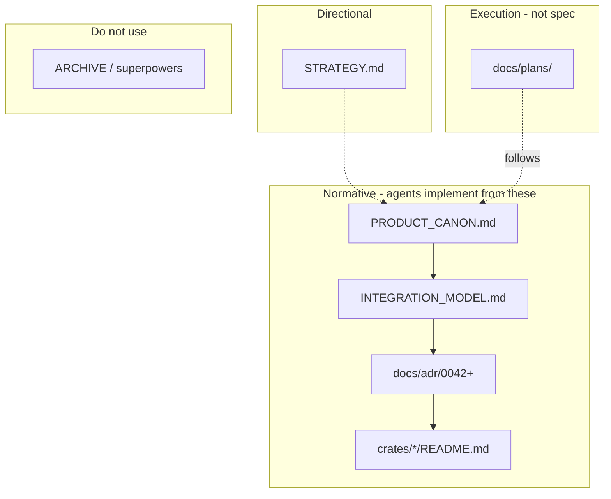
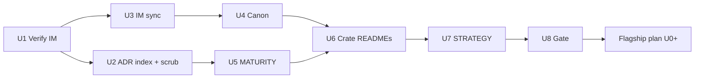

# refactor: Documentation consolidation (ADR → canon, remove noise)

## Summary

Build **one documentation stack** inside the Nebula git repo so humans, Cursor, and
Compound Engineering skills (`ce-plan`, `ce-work`, …) stop ingesting broken links,
archived `superpowers/` paths, and contradictory maturity claims. **Accepted ADRs**
remain the decision record; **canon + INTEGRATION_MODEL** carry invariants and
mechanics with **short pointers** to ADRs — not duplicate ADR prose. This plan is a
**hard gate** before the integrator flagship implementation plan (`2026-05-17-001`).

---

## Problem Frame

| Symptom | Impact |
|---------|--------|
| Canon cited `docs/INTEGRATION_MODEL.md` while file lived only outside the repo | Every integrator README link 404 in workspace |
| `docs/superpowers/` removed but **~15+** normative files still link there | Agents follow dead specs |
| Duplicate ADR number **0042** (binding vs retry) | Wrong decision cited in PRs |
| `credential-builtin` README lists types that **do not exist** | False flagship narrative |
| MATURITY vs crate README disagree (e.g. plugin stable vs partial) | L3 claims impossible to trust |
| No CE “ADR skill” — skills assume **you** maintain normative docs | Doc drift = bad plans and code |

---

## Progress (already landed)

| Item | Status | Evidence |
|------|--------|----------|
| `docs/INTEGRATION_MODEL.md` in repo | Done | Copied; `docs/adr/` link prefix applied |
| `docs/README.md` agent map + hierarchy | Done | Tier 0–1, CE/ADR note, conflict rule |
| `CLAUDE.md` + `INTEGRATION_MODEL` index row | Done | Documentation Index |
| ADR **0068** layered retry (was duplicate 0042) | Done | `docs/adr/0068-layered-retry.md`; ADR-0046 backlink fixed |
| `docs/ARCHIVE.md` | Done | Explains removed trees |
| `.cursorignore` / `.claudeignore` | Done | Hides historical ADR bulk + noise |

**Still open:** everything in Implementation Units below.

---

## How agents and CE skills use docs

There is **no** Compound Engineering “ADR skill”. Behavior:

| Skill | Reads ADRs? | Normative inputs |
|-------|-------------|------------------|
| `ce-brainstorm` | Optional cites | Requirements doc |
| `ce-strategy` | Align only | `STRATEGY.md` |
| `ce-plan` | Cites in plan | Plan + `docs/README.md` + cited ADRs |
| `ce-work` | Only if plan says so | Plan + canon + INTEGRATION_MODEL + crate README |
| Cursor / Claude | Follow `CLAUDE.md` | `docs/README.md` first |

**Rule:** `docs/README.md` → at most **one** ADR file if needed → crate README. Never
`glob docs/**` or bulk-read `docs/adr/000*`.

---

## Target documentation hierarchy

```text
CLAUDE.md / AGENTS.md
  └── docs/README.md          ← agent router (mandatory)
        ├── STRATEGY.md       ← direction, flagship, tracks
        ├── docs/PRODUCT_CANON.md
        ├── docs/INTEGRATION_MODEL.md
        ├── docs/adr/README.md + HISTORICAL.md
        ├── docs/MATURITY.md
        ├── docs/pitfalls.md
        ├── docs/plans/*.md   ← execution only (subordinate)
        └── crates/*/README.md
```

**Conflict resolution (authoritative order):**

1. `PRODUCT_CANON.md` — product invariants (L1–L4).
2. `INTEGRATION_MODEL.md` — integration mechanics.
3. **Accepted ADR** (`docs/adr/0042+`) — specific decision; amend (2) or (1) via **pointer**, not paste.
4. `STRATEGY.md` — direction only.
5. `docs/plans/` — how to implement; never override (1)–(3).
6. `docs/ARCHIVE.md` / git history — history only.



---

## Requirements

- **D-R1.** Every `INTEGRATION_MODEL` link from canon and crate READMEs resolves in-repo.
- **D-R2.** Zero `docs/superpowers/` links in normative paths (see allowlist below).
- **D-R3.** `docs/adr/README.md` complete index for **0042–0066** (one number = one file).
- **D-R4.** M6/M11 cascade ADRs reflected in INTEGRATION_MODEL **status boxes** (pointer only).
- **D-R5.** Canon §3.5 / §7 consistent with ADR-0044 (slot credentials, not singular associated type).
- **D-R6.** `MATURITY.md` and touched crate READMEs: English author-facing text, ADR/canon refs, no phantom types.
- **D-R7.** `STRATEGY.md` flagship/deferred sections match ADR-0057 (proposed) and doc map.
- **D-R8.** Doc gate clears before **flagship plan U0** (code honesty) starts.

**Allowlist for `docs/superpowers` mentions:** `docs/ARCHIVE.md`, `docs/plans/*` (historical context only), this plan’s verification section.

---

## Key technical decisions

| ID | Decision | Rationale |
|----|----------|-----------|
| KD-D1 | **Do not** copy sibling `RustroverProjects/docs/` wholesale | One repo truth; archive external tree separately. |
| KD-D2 | **INTEGRATION_MODEL** is mechanics; **ADRs** stay immutable decision records | Canon §14 anti–spec theater. |
| KD-D3 | Stale superpowers links → **ADR id** or delete sentence | Plans are not normative. |
| KD-D4 | Historical ADRs 0001–0041 stay on disk for code links but **out of agent index** | `.cursorignore` already set. |
| KD-D5 | Flagship **code** plan blocked until this plan’s verification passes | Prevents snowball on phantom catalog. |

---

## ADR → INTEGRATION_MODEL sync matrix (U3)

For each **accepted** in-repo ADR, add or update a **status box / §pointer** in
`docs/INTEGRATION_MODEL.md` (or the relevant §3.6–§3.9 section). Do **not** paste ADR body.

| ADR | Topic | INTEGRATION_MODEL target | Canon touch? |
|-----|-------|--------------------------|--------------|
| 0042 | Node binding | § binding / activation | Pointer in §3.5 if needed |
| 0043 | Dependency declaration DX | § Action/Resource deps | No |
| 0044 | Supersede 0036 slot credentials | § Resource + § Credential | **Yes** §3.5 one line |
| 0045 | EventTrigger deferral | § Action / trigger note | No |
| 0046 | Metrics/telemetry merge | § observability pointer → OBSERVABILITY.md | No |
| 0047 | OpenAPI | § api (pointer only) | No |
| 0048 | Idempotency store | § api | No |
| 0049 | Webhook convergence | § Action webhook | No |
| 0050 | W3C trace context | § observability | No |
| 0051 | External provider | § Credential | No |
| 0052 | Validator condition seam | § Schema | No |
| 0052-action-surface-hybrid | Action surface | §3.8 nebula-action | No |
| 0053 | Two-struct DX | §3.8 | No |
| 0054 | Typed capabilities | § Credential caps | No |
| 0055 | SDK facade | § Plugin / SDK pointer | Pointer §3.5 |
| 0056 | Type-safe DAG | § workflow (pointer) | No |
| 0057 | AI agent SDK (**proposed**) | § new “Deferred” box | STRATEGY only |
| 0058–0065 | Schema/UI/visual | § Schema + visual note | No |
| 0066 | Layered retry | § Action retry / resilience pointer | Canon §4.5 honesty if claimed |

---

## Stale link replacement guide (U2)

| File | Current bad ref | Replace with |
|------|-----------------|--------------|
| `docs/MATURITY.md` (6 hits) | `docs/superpowers/specs/...` | ADR-0041, ADR-0028–0032, or delete changelog sentence |
| `docs/OBSERVABILITY.md` (2) | security-hardening / refresh-coordination specs | ADR-0046, ADR-0041, or `docs/ARCHIVE.md` |
| `crates/storage/README.md` (2) | refresh-coordination spec, health audit | ADR-0041, ADR-0030 |
| `.github/workflows/auto-close-linked-issues.yml` (1) | stale-issue spec | Remove comment or ARCHIVE |
| `docs/plans/2026-05-17-001-...` (1) | TD-11 mention | Keep (meta) or point to D-R2 |

**Crate READMEs** (no superpowers today; verify INTEGRATION_MODEL paths):
`action`, `api`, `core`, `credential`, `plugin`, `plugin-sdk`, `resource`, `sandbox`, `sdk`, `validator` — audit in U5.

---

## Implementation Units

### U1. Verify INTEGRATION_MODEL import quality

**Goal:** Copied doc is link-clean and dated.

**Requirements:** D-R1
**Dependencies:** none (partial done)

**Files:**
- `docs/INTEGRATION_MODEL.md`

**Approach:**
- Spot-check 10 random `](docs/adr/` links.
- Fix any remaining `](adr/` or `docs/docs/adr/`.
- Update frontmatter `last-reviewed: 2026-05-17`.
- Add top banner: “Mechanics live here; decisions in `docs/adr/`; invariants in canon.”

**Verification:**
- `rg '\]\(adr/' docs/INTEGRATION_MODEL.md` → no matches
- All `docs/adr/00` targets exist

---

### U2. Complete ADR index and scrub superpowers links

**Goal:** One ADR number per file; no normative superpowers URLs.

**Requirements:** D-R2, D-R3
**Dependencies:** U1

**Files:**
- `docs/adr/README.md` — full table 0042–0066
- `docs/MATURITY.md`
- `docs/OBSERVABILITY.md`
- `crates/storage/README.md`
- `.github/workflows/auto-close-linked-issues.yml`

**Approach:**
- Expand README index (include 0049, 0051–0053, 0054–0065, **0066**).
- Apply stale link table above; prefer ADR over archive when decision exists.
- `rg 'docs/superpowers' --glob '*.md' --glob '!docs/plans/**' --glob '!docs/ARCHIVE.md'` → zero.

**Test scenarios:**
- Happy path: every removed superpowers URL replaced or sentence deleted.
- Edge: `docs/plans/` may mention superpowers historically — allowed.

**Verification:** See § Verification gate.

---

### U3. ADR → INTEGRATION_MODEL status sync

**Goal:** Mechanics doc reflects M6/M11 cascade without duplicating ADRs.

**Requirements:** D-R4
**Dependencies:** U1

**Files:**
- `docs/INTEGRATION_MODEL.md` (§3.6–§3.9, schema section, §7 plugin)

**Approach:**
- Work through **ADR sync matrix** table above.
- Each entry: 2–5 lines + `Accepted: ADR-NNNN` + link.
- Mark ADR-0057 as **Proposed / deferred** (align STRATEGY).
- Note ADR-0044 supersedes singular `Resource::Credential` in Resource §.

**Verification:** Matrix row count matches accepted ADR files in `docs/adr/` (0042–0066 minus proposed-only if any).

---

### U4. Canon pointer pass (minimal)

**Goal:** Canon accurate; no long M6 paste.

**Requirements:** D-R5
**Dependencies:** U3

**Files:**
- `docs/PRODUCT_CANON.md` — §3.5, §7, doc index table (~§18)

**Approach:**
- §3.5: one paragraph — slot-based credentials per ADR-0044; link INTEGRATION_MODEL.
- §7 / plugin: native process isolation; link ADR-0027 / plugin README; signing still planned.
- Doc index table: add `docs/plans/` as non-normative; confirm INTEGRATION_MODEL row.
- Do **not** expand canon with schema ratification detail (ADR-0061 belongs in INTEGRATION_MODEL + schema README).

**Verification:** `rg 'Resource::Credential' docs/PRODUCT_CANON.md` — no singular associated-type claims.

---

### U5. MATURITY.md honesty pass

**Goal:** Dashboard truthful; English; ADR-backed notes.

**Requirements:** D-R6
**Dependencies:** U2

**Files:**
- `docs/MATURITY.md`

**Approach:**
- Remove or rewrite **П1/П2/П3** phase jargon → “scaffold”, “landed”, “remaining”.
- Replace superpowers changelog bullets with ADR ids or delete.
- Reconcile `nebula-plugin` row with `crates/plugin/README.md` (pick stable vs partial honestly).
- `nebula-credential-builtin`: **frontier / scaffold** until catalog exists.
- `nebula-resource`: keep honest bind-population caveat (AE5).

**Verification:** MATURITY rows match crate README frontmatter where present.

---

### U6. Crate README link and honesty audit

**Goal:** All integrator-facing READMEs point at in-repo normative docs only.

**Requirements:** D-R1, D-R6
**Dependencies:** U2, U4

**Files:**
- `crates/credential-builtin/README.md` — **remove phantom vendor types**; scaffold truth
- `crates/credential/README.md` — OAuth boundary (engine/api); ADR-0033
- `crates/plugin/README.md` — discovery/runtime truth vs “partial slice B”
- `crates/sdk/README.md` — prelude vs README trait list
- `crates/action/README.md` — CheckpointPolicy planned note (keep, verify ADR)
- `crates/storage/README.md` — U2 replacements
- `.github/PULL_REQUEST_TEMPLATE.md` — INTEGRATION_MODEL checkbox still valid

**Approach:**
- Per crate: `INTEGRATION_MODEL` link works; no superpowers; no absolute `C:/` paths.
- credential-builtin: document **contract vs builtin** split (feeds flagship U0).

**Verification:** `rg 'docs/superpowers|SlackOAuth2' crates/ docs/PRODUCT_CANON.md` → zero phantom types.

---

### U7. STRATEGY, plans, and brainstorm alignment

**Goal:** Direction doc matches doc map and deferred work.

**Requirements:** D-R7
**Dependencies:** U3, U4

**Files:**
- `STRATEGY.md`
- `docs/brainstorms/2026-05-17-strategy-llm-standard-bar-requirements.md`
- `docs/plans/2026-05-17-001-feat-integrator-flagship-platform-plan.md` (frontmatter `blocked-by` or note)

**Approach:**
- STRATEGY Flagship: link **doc consolidation plan** as prerequisite; AgentAction/MCP explicitly deferred.
- Brainstorm: add header “Requirements satisfied by STRATEGY.md; implementation plans separate.”
- Flagship plan: note “Start U0 only after doc plan verification green.”

**Verification:** No STRATEGY checkbox implies shipped code without test link.

---

### U8. Documentation gate (release criterion)

**Goal:** Provable clean stack; unblock flagship code plan.

**Requirements:** D-R8
**Dependencies:** U1–U7

**Approach:** Run verification commands; paste summary in PR or issue.

**Verification:** All commands in § Verification gate pass.

---

## Sequencing and PR waves



| PR | Units | Focus |
|----|-------|--------|
| 1 | U1 + U2 | INTEGRATION_MODEL QA + superpowers purge + ADR README |
| 2 | U3 + U4 | ADR sync matrix + canon pointers |
| 3 | U5 + U6 | MATURITY + crate README honesty |
| 4 | U7 + U8 | STRATEGY/plan links + gate sign-off |

---

## Verification gate (run for U8)

```bash
# From repo root — expect zero matches (except allowlist)
rg 'docs/superpowers' docs crates CLAUDE.md AGENTS.md .github \
  --glob '*.md' --glob '!docs/plans/**' --glob '!docs/ARCHIVE.md'

# Phantom catalog types
rg 'SlackOAuth2|AnthropicApiKey|BitbucketOAuth2' crates/credential-builtin docs/MATURITY.md

# Broken ADR paths in INTEGRATION_MODEL
rg -o 'docs/adr/[0-9]{4}[^)]*' docs/INTEGRATION_MODEL.md | sort -u \
  | while read f; do test -f "$f" || echo "MISSING $f"; done

# Duplicate ADR numbers (should be none)
ls docs/adr/0042-*.md | wc -l   # expect 1 (node-binding only)

# INTEGRATION_MODEL exists
test -f docs/INTEGRATION_MODEL.md
```

**Human checklist:**
- [ ] `docs/README.md` read in &lt; 2 minutes explains full stack
- [ ] New contributor can open canon → INTEGRATION_MODEL → one ADR without archive
- [ ] Flagship plan 001 explicitly unblocked

---

## Scope boundaries

### Deferred for later

- Rewriting all 41 historical ADRs (0001–0041).
- Copying full external `RustroverProjects/docs/` tree.
- Implementing credential catalog or reference plugin **code** (flagship plan 001).

### Outside this product's identity

- Using archived superpowers plans as implementation spec.
- Bulk AI summarization of all ADRs into one mega-doc.

---

## Relationship to other plans

| Plan | Relationship |
|------|----------------|
| `2026-05-17-001-feat-integrator-flagship-platform-plan.md` | **Blocked** until U8 passes; U0 honesty overlaps U6 here |
| `2026-05-17-002` (this) | **Do first** |
| Brainstorm / STRATEGY | Direction only; mechanics after this plan |

---

## Risks and mitigations

| Risk | Mitigation |
|------|------------|
| INTEGRATION_MODEL drifts from code again | `last-reviewed` date + PR template checkbox |
| ADR accepted but IM not updated | U3 matrix is checklist per PR touching ADR |
| Editors re-introduce superpowers links | U8 `rg` in CI (optional follow-up) |
| Canon bloat returns | U4 limited to pointers; reject long paste in review |

---

## Sources

- `docs/brainstorms/2026-05-17-strategy-llm-standard-bar-requirements.md`
- `STRATEGY.md`
- `docs/README.md`, `docs/ARCHIVE.md`
- `docs/PRODUCT_CANON.md` §14 (spec theater, plans follow canon)
