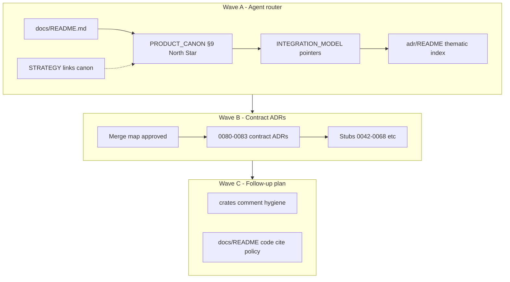

# refactor: Documentation stack — agent router, contract ADRs, code citation hygiene

## Summary

Deliver a **three-phase documentation refactor**: **Wave A** makes agents route through `docs/README.md` → canon → `INTEGRATION_MODEL` → thematic ADR groups (purge `docs/superpowers/`, demote `VISION.md`, unify North Star). **Wave B** merges feature-cascade ADRs into **contract ADRs** with stub redirects and a published merge map. **Wave C** (separate follow-up plan) strips `ADR-00xx` / `canon §` noise from Rust comments. This plan supersedes the **open** work in `docs/plans/2026-05-17-002` and unblocks the integrator flagship plan when the verification gate passes.

---

## Problem Frame

Agents and contributors still hit competing doc authorities, execution leftovers, and ~300+ `ADR-`/`canon §` pins in `crates/**/*.rs` that make source read like a bibliography. The origin requirements doc names agent routing as the top priority; Wave B and C follow. (see origin: `docs/brainstorms/2026-05-18-001-docs-stack-contract-consolidation-requirements.md`)

---

## Requirements

- **P-R1.** Preserve doc conflict order: canon → INTEGRATION_MODEL → accepted ADR → STRATEGY → crate README (`docs/README.md`).
- **P-R2.** North Star only in `PRODUCT_CANON.md` §9; `STRATEGY.md` links there.
- **P-R3.** Wave A: zero normative `docs/superpowers` dependencies; `ARCHIVE.md` matches repo.
- **P-R4.** Wave A: thematic ADR index + `INTEGRATION_MODEL` includes storage decision **0072**.
- **P-R5.** Wave B: no ADR file removal without merge-map row + stub redirect.
- **P-R6.** Wave B: reduce agent-facing ADR surface via contract merges (target ~12–15 **primary** contract files vs ~27 accepted files opened individually today).
- **P-R7.** Verification gate green before flagship plan **001** proceeds past doc-dependent units.
- **P-R8.** Wave C deferred to `docs/plans/2026-05-18-002-refactor-code-doc-citation-cleanup-plan.md` (create when A+B gate passes).

**Origin actors:** A1 AI agent, A2 integration author, A3 maintainer, A4 operator (indirect)

**Origin flows:** F1 agent routing, F2 ADR merge, F3 code citation cleanup (Wave C)

**Origin acceptance examples:** AE1–AE4 (origin doc)

---

## Scope Boundaries

- Rewriting bodies of ADRs **0001–0041** or removing them from git (index-only policy unchanged).
- Integrator flagship **code** (plan 001) except where README honesty overlaps Wave A.
- CI `rg` gate automation (recommended follow-up, not blocking).
- Bulk AI summarization of all ADRs into one mega-doc.

### Deferred to Follow-Up Work

- **Wave C — Rust citation cleanup:** `docs/plans/2026-05-18-002-refactor-code-doc-citation-cleanup-plan.md` (draft at end of Wave B gate; ~300+ ADR/canon refs in `crates/`).
- **Historical ADR export:** optional move of 0001–0041 full text out of repo (external archive).
- **Plan 002:** mark superseded; do not execute duplicate units already landed (see Progress table below).

---

## Context & Research

### Relevant Code and Patterns

- Agent router: `docs/README.md`, `CLAUDE.md` Documentation Index
- Normative stack: `docs/PRODUCT_CANON.md`, `docs/INTEGRATION_MODEL.md`, `docs/adr/README.md`
- Prior partial work: `docs/plans/2026-05-17-002-refactor-doc-consolidation-plan.md` (frontmatter `completed` but units open)
- Execution tail: `docs/superpowers/` (9 files); `docs/ARCHIVE.md` claims removed
- `VISION.md` ~958 lines, draft header, phantom **ADR-0069** reference
- Duplicate ADR number: `0052-schema-validator-condition-seam` + `0052-action-surface-hybrid`
- Active accepted ADRs: 0042–0068 + **0072** (gaps 0069–0071)
- **ADR-0057** status: **proposed** only

### Institutional Learnings

- No `docs/solutions/` tree; governance lives in `docs/README.md` and plan 002.
- Canon §14 anti–spec theater: IM/canon get **pointers**, not ADR paste.

### External References

- None required (repo-local doc patterns sufficient).

---

## Key Technical Decisions

| ID | Decision | Rationale |
|----|----------|-----------|
| KD-P1 | **Wave A before B** | Origin KD-1; agent router is user priority. |
| KD-P2 | **Contract ADRs = new numbers 0080+** | Avoid renumbering accepted 0042–0072 bodies; stubs preserve old URLs. |
| KD-P3 | **Renumber `0052-action-surface-hybrid` → `0069`** | Fills gap; removes duplicate `0052` for agents (origin R10). |
| KD-P4 | **ADR-0057 stays proposed** | Index + IM “Deferred / proposed” box; STRATEGY owns deferred AI SDK—no fake “accepted” row. |
| KD-P5 | **Wave C = separate plan** | Origin KD-4; large Rust churn (~300 files with ADR/canon refs) must not block doc gate. |
| KD-P6 | **Stub file shape** | Each superseded ADR becomes ≤30 lines: title, status `superseded`, link to contract ADR, one-line topic. |

---

## Open Questions

### Resolved During Planning

- **Merge map contents:** Proposed below (§ Wave B merge map); implementer must not delete sources until maintainer signs off on map in PR description.
- **VISION handling:** Compress to ≤120 lines + banner “Not for agents — see STRATEGY + canon” (preferred over full delete).
- **0057 handling:** Proposed-only with deferred box (KD-P4).

### Deferred to Implementation

- Exact contract ADR section outline after reading source ADRs (do not invent decisions during merge).
- Whether `0046` + `0050` get a merged observability contract or stay as two thin ADRs with IM pointers only.

---

## High-Level Technical Design

> *Directional guidance for review, not implementation specification.*



**Doc layers after Wave B (agent mental model):**

| Layer | Files | Agent rule |
|-------|-------|------------|
| Router | `docs/README.md` | Read first |
| Invariants | `PRODUCT_CANON.md` | North Star §9 |
| Mechanics | `INTEGRATION_MODEL.md` | Pointers only |
| Decisions | Contract ADRs 0080+ + thin singles (0072, 0055, …) | One group max per task |
| Direction | `STRATEGY.md` | No mechanics paste |
| Charter (human) | `VISION.md` (compressed) | Agents skip |
| History | `HISTORICAL.md` + stubs | Open only when code cites |

---

## Wave B merge map (proposed — PR must confirm)

**Rule:** For each row, create target contract ADR, move decision summary (not full duplicate of IM), replace each source file with stub pointing to target.

| Target contract ADR | Absorbs (sources → stub) | Rationale |
|---------------------|--------------------------|-----------|
| **0069** (renumber only) | `0052-action-surface-hybrid` → **0069-action-surface-hybrid** | Fix duplicate 0052; no merge |
| **0080-schema-validation-platform** | 0052-schema, 0058, 0059, 0060, 0061, 0062, 0063, 0064 | Single schema/UI contract |
| **0081-m6-resource-credential-integration** | 0042, 0043, 0044, 0045, 0051, 0066, 0067 | M6 + credential runtime cascade |
| **0082-api-webhooks-idempotency** | 0047, 0048, 0049 | API edge contracts |
| **Keep standalone** | 0046, 0050 | Short; OBSERVABILITY.md already central—optional merge later |
| **Keep standalone** | 0053, 0054, 0055, 0056, 0065, 0068, **0072** | Cross-cutting or already capstone |
| **Proposed (no merge)** | 0057 | Deferred box only |

**Post-Wave B agent index groups** (`docs/adr/README.md`):

1. Integration binding — **0081** (+ stubs 0042–0045, 0051, 0066–0067)
2. Schema & forms — **0080** (+ stubs 0052, 0058–0064)
3. Storage — **0072**
4. Action & retry — **0069**, 0053, 0068
5. SDK & capabilities — 0054, 0055
6. Workflow graph — 0056
7. Visual — 0065
8. API — **0082** (+ stubs 0047–0049)
9. Observability — 0046, 0050
10. AI (deferred) — 0057 proposed

---

## Progress from plan 002 (do not redo)

| Item | Status |
|------|--------|
| `INTEGRATION_MODEL` in repo | Done |
| `docs/README.md` map | Done |
| ADR 0068 layered retry | Done |
| `.cursorignore` historical ADRs | Done |
| Superpowers purge | **Open** |
| IM 0072 row | **Open** |
| MATURITY / crate README gate | **Open** |
| U8 verification | **Open** |

---

## Implementation Units

### U1. Align archive policy and remove superpowers tail

**Goal:** Repo matches `ARCHIVE.md`; normative paths never reference `docs/superpowers/`.

**Requirements:** P-R3, origin R4, AE2

**Dependencies:** None

**Files:**
- Delete: `docs/superpowers/**` (9 files)
- Modify: `docs/ARCHIVE.md`, `deny.toml`, `typos.toml`, `.github/CODEOWNERS` (remove or redirect superpowers paths)
- Modify: `docs/adr/0067-engine-owned-rotation-fanout-self-refresh-hook.md`, `docs/adr/0072-nebula-storage-spec16-port-adapter-tenancy.md` (replace superpowers spec links with contract/IM pointers)
- Modify: Rust files in `crates/` that link `docs/superpowers` (grep-driven list)

**Approach:**
- Delete tree; recover from git if humans need history (`docs/ARCHIVE.md` already documents).
- Replace ADR references to superpowers specs with “see INTEGRATION_MODEL §…” or historical ADR id.
- Crate comments: point to `crates/<crate>/README.md` or IM, not execution plans.

**Patterns to follow:** Allowlist in plan 002 (ARCHIVE + historical plans only).

**Test scenarios:**
- Happy path: `rg 'docs/superpowers' docs crates CLAUDE.md AGENTS.md .github --glob '!docs/plans/**' --glob '!docs/ARCHIVE.md' --glob '!docs/brainstorms/**'` → zero.
- Edge case: `docs/plans/2026-05-17-001` may mention superpowers in TD footnote — allowed.

**Verification:**
- Zero normative superpowers links; `docs/superpowers/` directory absent.

---

### U2. North Star and VISION demotion

**Goal:** Single North Star home; no competing SSOT in charter.

**Requirements:** P-R2, origin R2–R3, AE1

**Dependencies:** None

**Files:**
- Modify: `docs/PRODUCT_CANON.md` (§9 unchanged substantively; ensure doc index row)
- Modify: `STRATEGY.md` (replace any north-star prose with link to canon §9)
- Modify: `docs/VISION.md` (banner + compress to ≤120 lines OR move bulk to `docs/ARCHIVE.md` appendix note)
- Modify: `docs/README.md` (VISION row: “human charter draft — agents skip”)

**Approach:**
- Remove “single source of truth for what Nebula is” from VISION header.
- Fix phantom **ADR-0069** references → 0069 after U6 or remove.
- STRATEGY “Who it's for” / metrics stay; North Star defers to canon.

**Test scenarios:**
- Happy path: New reader finds three North Stars only in canon §9.
- Edge case: `crates/sdk/README.md` §4.4 north star phrase links to canon, not VISION.

**Verification:**
- `rg 'single source of truth' docs/VISION.md` → zero or qualified as non-normative history.

---

### U3. Thematic ADR index and 0052 / phantom cleanup

**Goal:** Agents browse by theme; duplicate 0052 resolved.

**Requirements:** P-R4, origin R5, R10

**Dependencies:** U2 (VISION phantom refs)

**Files:**
- Modify: `docs/adr/README.md`
- Rename: `docs/adr/0052-action-surface-hybrid.md` → `docs/adr/0069-action-surface-hybrid.md`
- Modify: inbound links to old path (grep `0052-action`)

**Approach:**
- Restructure README: thematic groups (see merge map) + flat table for stubs.
- Document suffix policy: only **0069** uses renumbered action-surface file.
- Update `INTEGRATION_MODEL` ADR table row 0052-action → 0069.

**Test scenarios:**
- Happy path: README lists themes above flat number table.
- Edge case: `ls docs/adr/0052-*.md` → exactly one file (`0052-schema-validator-condition-seam.md`).

**Verification:**
- No duplicate `0052-*` filenames; 0069 present; README links resolve.

---

### U4. INTEGRATION_MODEL sync and router banner

**Goal:** Mechanics doc current through **0072**; agents see banner.

**Requirements:** P-R1, P-R4, origin R6

**Dependencies:** U3

**Files:**
- Modify: `docs/INTEGRATION_MODEL.md`

**Approach:**
- Add **0072** to accepted-decisions index table.
- Ensure banner at top: mechanics here; decisions in ADRs; invariants in canon.
- Refresh `last-reviewed: 2026-05-18`.
- For each accepted ADR not yet in table (0049–0051, 0065–0068), add 2–3 line pointer rows (no body paste)—reuse plan 002 matrix as checklist.

**Test scenarios:**
- Happy path: Every `docs/adr/00xx` link in IM `](docs/adr/` resolves to file or stub.
- Integration: Table includes 0072 storage tenancy one-liner.

**Verification:**
- Link check script from plan 002 § Verification gate passes for IM.

---

### U5. MATURITY and integrator README honesty

**Goal:** Trustworthy L0–L4 and README claims.

**Requirements:** P-R7 (partial), origin R12

**Dependencies:** U1

**Files:**
- Modify: `docs/MATURITY.md`
- Modify: `crates/credential-builtin/README.md`, `crates/plugin/README.md`, `crates/sdk/README.md`, `crates/credential/README.md`, `crates/action/README.md`, `crates/storage/README.md`
- Modify: `.github/PULL_REQUEST_TEMPLATE.md` (doc checkbox still valid)

**Approach:**
- Execute plan 002 U5/U6 checklist: no phantom vendor types; plugin/sdk honesty; English where needed.
- Align `nebula-plugin` row with `crates/plugin/README.md`.

**Test scenarios:**
- Happy path: `rg 'SlackOAuth2|AnthropicApiKey' crates/credential-builtin docs/MATURITY.md` → zero.
- Edge case: MATURITY changelog cites ADR ids, not superpowers.

**Verification:**
- MATURITY rows match crate README frontmatter where present.

---

### U6. Supersede plan 002 and document verification gate

**Goal:** Single active doc plan; explicit gate for flagship 001.

**Requirements:** P-R7, origin R7

**Dependencies:** U1, U4, U5

**Files:**
- Modify: `docs/plans/2026-05-17-002-refactor-doc-consolidation-plan.md` (status → `superseded`, link to this plan)
- Modify: `docs/plans/2026-05-17-001-feat-integrator-flagship-platform-plan.md` (doc gate → this plan U8)
- Modify: `docs/plans/2026-05-18-001-refactor-docs-stack-contract-consolidation-plan.md` (this file — gate section below)

**Approach:**
- Copy verification commands from plan 002; add check for `docs/superpowers` absence and 0069 rename.

**Test scenarios:** Test expectation: none — documentation metadata only.

**Verification:**
- Plan 002 frontmatter `superseded-by: docs/plans/2026-05-18-001-...`

---

### U7. Wave A documentation gate

**Goal:** Wave A complete; Wave B may start.

**Requirements:** P-R7, AE1, AE2

**Dependencies:** U1–U6

**Files:** None (verification only)

**Approach:** Run gate; paste summary in PR.

**Verification gate:**

```bash
rg 'docs/superpowers' docs crates CLAUDE.md AGENTS.md .github \
  --glob '*.md' --glob '!docs/plans/**' --glob '!docs/ARCHIVE.md' --glob '!docs/brainstorms/**'

rg 'SlackOAuth2|AnthropicApiKey|BitbucketOAuth2' crates/credential-builtin docs/MATURITY.md

rg -o 'docs/adr/[0-9]{4}[^)]*' docs/INTEGRATION_MODEL.md | sort -u \
  | while read f; do test -f "$f" || echo "MISSING $f"; done

test ! -d docs/superpowers
ls docs/adr/0052-*.md | wc -l   # expect 1
test -f docs/adr/0069-action-surface-hybrid.md
```

**Human checklist:**
- [ ] Agent path README → canon → IM → one ADR explained in &lt;10 min
- [ ] North Star only in canon §9
- [ ] Flagship plan 001 unblocked for **doc-dependent** units only

---

### U8. Create contract ADR 0080 (schema platform)

**Goal:** First contract merge; stubs for schema cluster.

**Requirements:** P-R5, P-R6, origin R8–R9, AE3

**Dependencies:** U7

**Files:**
- Create: `docs/adr/0080-schema-validation-platform.md`
- Modify: sources 0052-schema, 0058–0064 → stubs
- Modify: `docs/adr/README.md`, `docs/INTEGRATION_MODEL.md` (pointers to 0080)
- Modify: `docs/adr/README.md` supersession table

**Approach:**
- Synthesize **decision record** sections from sources (context, decision, consequences)—do not duplicate IM mechanics.
- Each stub: frontmatter `superseded-by: 0080`, link, original title.

**Test scenarios:**
- Happy path: `docs/adr/0061-nebula-schema-core-ratification.md` opens stub → 0080.
- Error path: PR without supersession row → reviewer rejects.

**Verification:**
- Thematic index lists **0080** as schema group primary; 8 stubs exist.

---

### U9. Create contract ADR 0081 (M6 resource/credential)

**Goal:** Second contract merge for integration binding cascade.

**Requirements:** P-R5, P-R6, AE3

**Dependencies:** U8 (pattern proven)

**Files:**
- Create: `docs/adr/0081-m6-resource-credential-integration.md`
- Stub: 0042, 0043, 0044, 0045, 0051, 0066, 0067
- Modify: `docs/adr/README.md`, `docs/INTEGRATION_MODEL.md`, `docs/PRODUCT_CANON.md` (§3.5 pointer if needed)

**Approach:** Same stub discipline as U8; canon gets one-line ADR-0044 supersession reminder only.

**Test scenarios:**
- Integration: Code citing `docs/adr/0044-` still resolves via stub.

**Verification:**
- M6 theme shows **0081** primary in README.

---

### U10. Create contract ADR 0082 (API) and Wave B gate

**Goal:** Complete proposed merge map; close Wave B.

**Requirements:** P-R5, P-R6, P-R7

**Dependencies:** U9

**Files:**
- Create: `docs/adr/0082-api-webhooks-idempotency.md`
- Stub: 0047, 0048, 0049
- Modify: `docs/adr/README.md`, `INTEGRATION_MODEL.md`
- Create: `docs/plans/2026-05-18-002-refactor-code-doc-citation-cleanup-plan.md` (skeleton: Wave C scope from origin R14–R16)

**Approach:**
- Run full link check across `docs/` and `crates/**/*.md` for `docs/adr/`.
- Draft Wave C plan: phases by crate layer (storage-port/storage → engine → api → resource/credential).

**Test scenarios:**
- Happy path: Typical integrator question uses ≤2 ADR files from thematic index.
- Covers AE3: stub → contract navigation works.

**Verification:**
- Wave B merge map all rows **Done** or **Keep standalone** documented
- Flagship plan 001 doc gate = green
- Wave C plan file exists with scope only (status `draft`)

---

## System-Wide Impact

- **Interaction graph:** AI tools (`ce-plan`, `ce-work`, Cursor rules) read `docs/README.md` first; less token burn on VISION/historical ADR bulk.
- **Error propagation:** Broken doc links mislead agents into wrong implementation—gate prevents.
- **API surface parity:** OpenAPI/ADR 0047–0049 stubs must keep utoipa references in `crates/api` valid via stubs.
- **Unchanged invariants:** Product canon L1–L4 semantics; code behavior unchanged in Waves A–B (docs only).
- **Wave C blast radius:** Large comment-only diff across `crates/`—isolated plan to avoid review fatigue.

---

## Phased Delivery

### Phase 1 — Wave A (U1–U7)

Agent router, honesty, gate. **Unblocks** flagship doc dependencies.

### Phase 2 — Wave B (U8–U10)

Contract ADRs + stubs. Reduces agent ADR cardinality.

### Phase 3 — Wave C (separate plan)

Code citation hygiene per `docs/plans/2026-05-18-002-refactor-code-doc-citation-cleanup-plan.md`.

---

## Risks & Dependencies

| Risk | Mitigation |
|------|------------|
| Broken deep links from merged ADRs | Mandatory stubs; grep `docs/adr/` in PR |
| Contract ADR invents new product rules | Merge = editorial consolidation of accepted text only; IM/canon unchanged in substance |
| Wave B PR too large | Split U8/U9/U10 across three PRs |
| Agents still read VISION | README + `.cursor/rules` “do not read VISION” if needed |
| Code comments stale after stub | Wave C; stubs keep ADR numbers valid |

---

## Documentation Plan

- Update `docs/README.md` after Wave B with “contract ADR” tier explanation.
- Add short **Code documentation** subsection (Wave C preview): prefer behavior comments; module-level README link max once.
- Mark plan 002 superseded.

---

## Sources & References

- **Origin document:** `docs/brainstorms/2026-05-18-001-docs-stack-contract-consolidation-requirements.md`
- Supersedes open scope: `docs/plans/2026-05-17-002-refactor-doc-consolidation-plan.md`
- Blocks: `docs/plans/2026-05-17-001-feat-integrator-flagship-platform-plan.md`
- Strategy: `STRATEGY.md`
