# n8n Authentication & Credentials — Architecture Research

> Peer-research: как устроены OAuth2, OAuth1, SAML, OIDC, LDAP, MFA, API keys,
> External Secrets, Dynamic Credentials и остальные механизмы авторизации в n8n.
> Нужен как источник решений и антипаттернов для Nebula (credentials, SSO, MFA).

## Метаданные исследования

- **Последняя сверка:** 2026-04-20
- **Версия n8n:** ветка `n8n-io/n8n` master (апрель 2026)
- **Источники:**
  - DeepWiki: `https://deepwiki.com/n8n-io/n8n`
  - GitHub: все пути относительно `github.com/n8n-io/n8n/blob/master/…`
- **Зона охвата:** серверная часть; UI-слой упомянут только в flow-диаграммах.
- **Провенанс:** данные собраны через DeepWiki `ask_question` + `read_wiki_contents`;
  где DeepWiki не даёт однозначного ответа — отмечено как `⚠️ не подтверждено`.

---

## TL;DR — что взять в Nebula

1. **`auth_identity` join-table** `(providerId, providerType)` как composite PK, `userId` FK
   — закрывает SAML/OIDC/LDAP один таблицей. Одна строка на `(subject, IdP)`,
   один user может иметь много identity разных типов.
2. **`role_mapping_rule`** (SAML/OIDC claim → project role) сразу, не enterprise-afterthought.
   LDAP у n8n этого не имеет, и это реальный пробел.
3. **State envelope OAuth2** с полем `origin: 'static-credential' | 'dynamic-credential'`
   + `credentialResolverId?` — закладывает dynamic-credentials на будущее без breaking change.
4. **`hash(email+password)` в JWT payload** — бесплатный session-invalidation на смену пароля,
   без трогания denylist-таблицы.
5. **Project-scoped credentials + row-level RBAC через `shared_credentials`**
   (composite PK `(credentialsId, projectId)`, role VARCHAR) — не per-user, не per-workflow.
6. **External secrets как expression-time resolve** (`{{ $secrets.vault.key }}`),
   не хранить в encrypted credential blob.
7. **API key = JWT в уникально индексированной колонке** → O(1) validation + revocation через DELETE.
8. **Device-code flow для Nebula CLI** — правильнее чем `~/.nebula/config` с API key руками.
9. **JWT в cookie + `invalid_auth_token` denylist** — компромисс immediate-logout без session-table.
   Для Nebula → Redis TTL-set вместо отдельной таблицы.
10. **Credential encryption формат надо улучшить:** у n8n просто `iv:ciphertext` base64-строка
    без version/kek_id. В Nebula — envelope `{version, iv, ciphertext, kek_id}` сразу.

---

## 1. REST API Endpoints

Все internal routes — под `/rest/…`. Публичный API — под `/api/v1/…` (handled by
`packages/cli/src/public-api/`). Декораторы (`@RestController`, `@Get/@Post/@Patch/@Put/@Delete`,
`@GlobalScope`, `@ProjectScope`, `@Licensed`, `@Body`, `@Param`, `@Query`) определены
в `packages/@n8n/decorators/`.

### 1.1 Credentials CRUD + sharing

**Файл:** `packages/cli/src/credentials/credentials.controller.ts`
— base `@RestController('/credentials')`.

| Метод | Путь | Input | Gate |
|---|---|---|---|
| GET | `/rest/credentials` | Q: `CredentialsGetManyRequestQuery` (`includeScopes?, includeData?, onlySharedWithMe?, includeGlobal?, externalSecretsStore?`) + `listQueryOptions` | authenticated; row-filtering в сервисе |
| GET | `/rest/credentials/for-workflow` | Q: `{workflowId}` или `{projectId}` | authenticated |
| GET | `/rest/credentials/new` | Q: `GenerateCredentialNameRequestQuery` → `{name}` | authenticated |
| GET | `/rest/credentials/:credentialId` | Q: `{includeData?}` → `ICredentialsResponse & {scopes}` | `@ProjectScope('credential:read')` |
| POST | `/rest/credentials/test` | B: `INodeCredentialTestRequest` → `INodeCredentialTestResult` | authenticated |
| POST | `/rest/credentials` | B: `CreateCredentialDto` (`name, type, data, projectId?, uiContext?`) → `CredentialsEntity` | authenticated |
| PATCH | `/rest/credentials/:credentialId` | B: `ICredentialsDecrypted & {isGlobal?, isResolvable?}` | `@ProjectScope('credential:update')`; global-flip требует `@Licensed('feat:sharing')` + `credential:shareGlobally` |
| DELETE | `/rest/credentials/:credentialId` | — | `@ProjectScope('credential:delete')` |
| PUT | `/rest/credentials/:credentialId/share` | B: `{shareWithIds: string[]}` (project IDs) | `@Licensed('feat:sharing')` + dynamic `credential:share`/`unshare` |
| PUT | `/rest/credentials/:credentialId/transfer` | B: `{destinationProjectId}` | `@ProjectScope('credential:move')` |

**Замечания:**
- PATCH strip'ит `oauthTokenData` из входа (не даёт клиенту перезаписать токены).
- PUT `/share` получает целевой set project-ID, сервис делает diff `toShare`/`toUnshare` в транзакции.
- Public API параллельно: `/api/v1/credentials*` + `GET /api/v1/credentials/schema/:credentialType`.

### 1.2 OAuth2 / OAuth1

**Файлы:**
- `packages/cli/src/controllers/oauth/oauth2-credential.controller.ts` — `@RestController('/oauth2-credential')`
- `packages/cli/src/controllers/oauth/oauth1-credential.controller.ts` — `@RestController('/oauth1-credential')`

| Метод | Путь | Input | Gate |
|---|---|---|---|
| GET | `/rest/oauth2-credential/auth` | Q: `id` → authorize URL string | authenticated |
| GET | `/rest/oauth2-credential/callback` | Q: `code, state` → HTML template `oauth-callback` | `skipAuth: skipAuthOnOAuthCallback` (env `N8N_SKIP_AUTH_ON_OAUTH_CALLBACK`) |
| GET | `/rest/oauth1-credential/auth` | Q: `id` | authenticated |
| GET | `/rest/oauth1-credential/callback` | Q: `oauth_verifier, oauth_token, state` | `skipAuth` same |

**State envelope** (шифрованная и подписанная JSON-строка в query):
```
{
  cid: string,                           // credential ID
  origin: 'static-credential' | 'dynamic-credential',
  userId: string,
  credentialResolverId?: string,         // для dynamic
  authorizationHeader?: string,          // bearer для resolver
  authMetadata?: Record<string, unknown>
}
```

Origin branches в callback: `encryptAndSaveData` (static → в `credentials_entity.data`)
vs `saveDynamicCredential` (dynamic → HTTP вызов external resolver).

### 1.3 Auth / Session / Me

**Файлы:** `packages/cli/src/controllers/{auth,me,password-reset,invitation,owner,users}.controller.ts`.

| Метод | Путь | Body | Gate |
|---|---|---|---|
| POST | `/rest/login` | `LoginRequestDto {emailOrLdapLoginId, password, mfaCode?, mfaRecoveryCode?}` → `PublicUser` + `n8n-auth` cookie | `skipAuth`; IP RL 1000/5min; email RL 5/min |
| POST | `/rest/logout` | — | auth; **вставляет JWT в `invalid_auth_token`** |
| GET | `/rest/resolve-password-token` | Q: `{token}` | `skipAuth` |
| POST | `/rest/forgot-password` | `{email}` | `skipAuth` + body-keyed RL + jitter middleware |
| POST | `/rest/change-password` | `{token, password, mfaCode?}` | `skipAuth` |
| PATCH | `/rest/me` | `UserUpdateRequestDto` → `PublicUser` | auth; SSO users blocked |
| PATCH | `/rest/me/password` | `{currentPassword, newPassword}` | auth |
| POST | `/rest/me/survey` | `PersonalizationSurveyAnswersV4` | auth |
| PATCH | `/rest/me/settings` | `UserSelfSettingsUpdateRequestDto` | auth |
| GET | `/rest/resolve-signup-token` | Q: `{inviterId, inviteeId}` → `{inviter:{firstName,lastName}}` | `skipAuth` |
| POST | `/rest/invitations` | `{emails:[{email, role}]}` | `@GlobalScope('user:create')` |
| POST | `/rest/invitations/:id/accept` | `{inviterId, firstName, lastName, password}` → `PublicUser` | `skipAuth` |
| POST | `/rest/owner/setup` | `{email, password, firstName, lastName}` | только если owner ещё не существует |
| POST | `/rest/owner/dismiss-banner` | `{banner}` | `@GlobalScope('banner:dismiss')` |
| GET/PATCH/DELETE | `/rest/users`, `/rest/users/:id/*` | — | `@GlobalScope('user:*')` |

**Cookie `n8n-auth`:** HTTP-only. `AuthService.issueCookie` auto-refresh при <¼ lifetime.

### 1.4 MFA

**Файл:** `packages/cli/src/controllers/mfa.controller.ts` — `@RestController('/mfa')`.

| Метод | Путь | Body | Gate |
|---|---|---|---|
| POST | `/rest/mfa/enforce-mfa` | `{enforce: boolean}` | `@GlobalScope('user:enforceMfa')` (блок при `securityPolicyManagedByEnv`; self-lockout guard) |
| POST | `/rest/mfa/can-enable` | — | `allowSkipMFA: true`; external hook `mfa.beforeSetup` |
| GET | `/rest/mfa/qr` | — → `{secret, recoveryCodes[], qrCode}` | `allowSkipMFA: true` |
| POST | `/rest/mfa/enable` | `{mfaCode}` | auth; re-issues cookie с `usedMfa=true` |
| POST | `/rest/mfa/disable` | `{mfaCode?}` или `{mfaRecoveryCode?}` | IP + user RL |
| POST | `/rest/mfa/verify` | `{mfaCode}` | `allowSkipMFA: true`; user RL |

### 1.5 API keys

**Файл:** `packages/cli/src/controllers/api-keys.controller.ts` — `@RestController('/api-keys')`.
Все: `@GlobalScope('apiKey:manage')` + `isApiEnabledMiddleware`.

| Метод | Путь | Body | Response |
|---|---|---|---|
| POST | `/rest/api-keys` | `CreateApiKeyRequestDto {label, scopes[], expiresAt?}` | `ApiKey & {rawApiKey, expiresAt}` — **единственный** response с raw JWT |
| GET | `/rest/api-keys` | — | `ApiKey[]` с редактированным `apiKey` |
| PATCH | `/rest/api-keys/:id` | `UpdateApiKeyRequestDto {label?, scopes?}` | `ApiKey` |
| DELETE | `/rest/api-keys/:id` | — | void |
| GET | `/rest/api-keys/scopes` | — | `ApiKeyScope[]` (доступные для роли caller'а) |

**Заголовок для public API:** `X-N8N-API-KEY: <JWT>`.

### 1.6 LDAP

**Файл:** `packages/cli/src/modules/ldap.ee/ldap.controller.ee.ts` — `@RestController('/ldap')`.
Все под `@Licensed('feat:ldap')`.

| Метод | Путь | Input | Gate |
|---|---|---|---|
| GET | `/rest/ldap/config` | — → `LdapConfig` (sensitive-поля редактированы) | `@GlobalScope('ldap:manage')` |
| PUT | `/rest/ldap/config` | B: `LdapConfig` | same |
| POST | `/rest/ldap/test-connection` | — → 200/400 | same |
| GET | `/rest/ldap/sync` | Q: `{page, perPage}` → `AuthProviderSyncHistory[]` | `@GlobalScope('ldap:sync')` |
| POST | `/rest/ldap/sync` | `{type: 'dry' \| 'live'}` | same |

LDAP config хранится в таблице `settings` (ключ `features.ldap`), не в dedicated-таблице.

### 1.7 SAML

**Файл:** `packages/cli/src/modules/sso-saml/saml.controller.ee.ts` — `@RestController('/sso/saml')`.

| Метод | Путь | Input | Gate |
|---|---|---|---|
| GET | `/rest/sso/saml/metadata` | — → SP metadata XML (`text/xml`) | `skipAuth` |
| GET | `/rest/sso/saml/config` | — → `SamlPreferences` (signingPrivateKey редактирован) | `samlLicensedMiddleware` |
| POST | `/rest/sso/saml/config` | `SamlPreferences` | `samlLicensedMiddleware` + `@GlobalScope('saml:manage')` |
| POST | `/rest/sso/saml/config/toggle` | `SamlToggleDto {loginEnabled}` | same |
| POST | `/rest/sso/saml/config/test` | `SamlPreferences` → redirect URL / template | same |
| GET | `/rest/sso/saml/acs` | Q: SAML response (redirect binding) → template/redirect + cookie | `samlLicensedMiddleware`, `skipAuth` |
| POST | `/rest/sso/saml/acs` | `SamlAcsDto` (POST binding) | same |
| GET | `/rest/sso/saml/initsso` | Q: `{redirect?}` → redirect URL или POST form | `samlLicensedAndEnabledMiddleware`, `skipAuth` |

### 1.8 OIDC

**Файл:** `packages/cli/src/modules/sso-oidc/oidc.controller.ee.ts` — `@RestController('/sso/oidc')`.
Все под `@Licensed('feat:oidc')`.

| Метод | Путь | Input | Gate |
|---|---|---|---|
| GET | `/rest/sso/oidc/config` | — → `OidcConfigDto` (clientSecret редактирован) | `@GlobalScope('oidc:manage')` |
| POST | `/rest/sso/oidc/config` | `OidcConfigDto` | same; блок если env-managed |
| POST | `/rest/sso/oidc/config/test` | — → `{url}`; ставит `oidc_state`/`oidc_nonce` cookies (15 min) | same |
| GET | `/rest/sso/oidc/login` | — → 302 на IdP; ставит state/nonce cookies | `skipAuth` |
| GET | `/rest/sso/oidc/callback` | Q: `{code, state}` → redirect + auth cookie | `skipAuth` |

### 1.9 External Secrets

**Файлы (v1 legacy + v2 multi-connection):**
- `packages/cli/src/modules/external-secrets.ee/external-secrets.controller.ee.ts` — `@RestController('/external-secrets')`
- `packages/cli/src/modules/external-secrets.ee/secrets-providers-connections.controller.ee.ts` — `@RestController('/secret-providers/connections')`
- `packages/cli/src/modules/external-secrets.ee/secrets-providers-types.controller.ee.ts`
- `packages/cli/src/modules/external-secrets.ee/secrets-providers-project.controller.ee.ts`
- `packages/cli/src/modules/external-secrets.ee/secrets-providers-completions.controller.ee.ts`

**V1 (legacy) routes:**

| Метод | Путь | Gate |
|---|---|---|
| GET | `/rest/external-secrets/providers` | `externalSecretsProvider:list` |
| GET | `/rest/external-secrets/providers/:provider` | `:read` |
| POST | `/rest/external-secrets/providers/:provider` | `:create` (provider settings JSON) |
| POST | `/rest/external-secrets/providers/:provider/test` | `:update` |
| POST | `/rest/external-secrets/providers/:provider/connect` | `:update` `{connected}` |
| POST | `/rest/external-secrets/providers/:provider/update` | `:sync` |
| GET | `/rest/external-secrets/secrets` | `externalSecret:list` → secret name tree |

**V2** `/rest/secret-providers/connections` — multi-connection CRUD с
`CreateSecretsProviderConnectionDto`, gate флагами `externalSecretsForProjects`
+ `externalSecretsMultipleConnections`.

---

## 2. Database Schemas

Все entities — в `packages/@n8n/db/src/entities/`. Базовый класс `WithTimestamps`
даёт `createdAt` + `updatedAt` (PG `timestamp` / SQLite `DATETIME(3)`,
default `CURRENT_TIMESTAMP`). `WithTimestampsAndStringId` добавляет `id VARCHAR(36)` PK.

### 2.1 `user` (entities/user.ts)

| Колонка | Тип | Null | Default | Notes |
|---|---|---|---|---|
| `id` | uuid (PG) / VARCHAR(36) | no | generated | PK |
| `email` | VARCHAR(254) | yes | — | **@Unique**, lowercased transformer, `isValidEmail` в `@BeforeInsert/@BeforeUpdate` |
| `firstName` | VARCHAR(32) | yes | — | |
| `lastName` | VARCHAR(32) | yes | — | |
| `password` | TEXT | yes | — | bcrypt hash |
| `personalizationAnswers` | JSON | yes | — | `objectRetriever` transformer |
| `settings` | JSON | yes | — | |
| `roleSlug` | FK → `role.slug` | no | — | joined как `role: Role` |
| `disabled` | BOOLEAN | no | `false` | added by `1674509946020-CreateLdapEntities` |
| `mfaEnabled` | BOOLEAN | no | `false` | added by `1690000000040-AddMfaColumns` |
| `mfaSecret` | TEXT | yes | — | **шифрованный через Cipher** |
| `mfaRecoveryCodes` | TEXT (simple-array, comma-sep) | no | `''` | **не JSON**; шифрованные |
| `lastActiveAt` | DATE | yes | — | added by `1750252139166-AddLastActiveAtColumnToUser` |

**Удалённые колонки:**
- `apiKey` → перенесено в `user_api_keys` (миграция `1724951148974`)
- `resetPasswordToken*` → удалено (`1690000000030-RemoveResetPasswordColumns`)
- `role` enum → перенесено в FK (`1750252139168-LinkRoleToUserTable` и `1745934666077-DropRoleTable`)

**Computed property `isPending`:** `password===null && нет non-email auth_identity`.
LDAP-юзер без пароля считается НЕ-pending, потому что у него есть `auth_identity(providerType='ldap')`.

### 2.2 `credentials_entity` (entities/credentials-entity.ts)

| Колонка | Тип | Null | Default | Notes |
|---|---|---|---|---|
| `id` | VARCHAR(36) | no | nanoid | PK |
| `name` | VARCHAR(128) | no | — | `@IsString`, длина 3-128 |
| `data` | TEXT | no | — | **AES-256-CBC ciphertext**; формат `iv:encrypted` base64 одной строкой, без envelope, без versioning |
| `type` | VARCHAR(128) | no | — | **@Index** (hot-path filter by credential type) |
| `isManaged` | BOOLEAN | no | `false` | added by `1734479635324-AddManagedColumnToCredentialsTable` — для n8n Cloud free OpenAI credits |
| `isGlobal` | BOOLEAN | no | `false` | added by `1762771954619-AddIsGlobalColumnToCredentialsTable` |
| `isResolvable` | BOOLEAN | no | `false` | **dynamic-resolver flag**; added by `1765459448000-AddResolvableFieldsToCredentials` |
| `resolvableAllowFallback` | BOOLEAN | no | `false` | same migration |
| `resolverId` | VARCHAR | yes | — | same migration |

**Удалённые колонки:**
- `nodesAccess` — удалено `1712044305787-RemoveNodesAccess`.
  Per-node ACL killed, теперь governance через project/role scopes.

**Шифрование `data`:**
- `Cipher` service (in `n8n-core`) использует AES-256-CBC через Node `crypto`.
- Сериализация — конкатенация `iv:encrypted` base64 в одну строку.
- **Нет JSON-wrapper, нет версионности, нет kek_id.**
- Rotation master-key = decrypt-old + re-encrypt-new через CLI
  (`n8n export:credentials` → `n8n import:credentials`), не in-place migration.

### 2.3 `shared_credentials` (entities/shared-credentials.ts)

| Колонка | Тип | Null | Default | Notes |
|---|---|---|---|---|
| `credentialsId` | VARCHAR(36) | no | — | **PK part**, FK → `credentials_entity.id` |
| `projectId` | VARCHAR(36) | no | — | **PK part**, FK → `project.id` |
| `role` | VARCHAR | no | — | `CredentialSharingRole` = `'credential:owner'` \| `'credential:user'` |

Composite PK `(credentialsId, projectId)`. Share-endpoint diff keyed by this pair.

### 2.4 `auth_identity` (entities/auth-identity.ts)

| Колонка | Тип | Null | Default | Notes |
|---|---|---|---|---|
| `userId` | uuid / VARCHAR(36) | no | — | FK → `user.id` |
| `providerId` | VARCHAR(255) | no | — | **PK part** |
| `providerType` | VARCHAR(32) | no | — | **PK part**, values: `'email'` \| `'ldap'` \| `'saml'` \| `'oidc'` |

Composite PK `(providerId, providerType)` + явный `@Unique(['providerId','providerType'])`.
**`userId` — НЕ часть PK** — так что один subject (NameID/sub/GUID) в одном IdP
маппится ровно на одного user, но user может иметь несколько identity разных типов.

Migration: `1674509946020-CreateLdapEntities`.

### 2.5 `user_api_keys` (entities/api-key.ts)

Имя таблицы **`user_api_keys`** (отлично от имени entity class `ApiKey`).
Migration: `1724951148974-AddApiKeysTable`.

| Колонка | Тип | Null | Default | Notes |
|---|---|---|---|---|
| `id` | VARCHAR(36) | no | nanoid | PK |
| `userId` | VARCHAR (uuid) | no | — | FK → `user.id` ON DELETE CASCADE |
| `label` | VARCHAR(100) | no | — | **@Unique(userId, label)** |
| `apiKey` | VARCHAR (JWT) | no | — | **@Unique Index** (O(1) validation) |
| `scopes` | JSON `ApiKeyScope[]` | no | — | added by `1742918400000-AddScopesColumnToApiKeys`; backfill из role |
| `audience` | VARCHAR | no | `'public-api'` | `ApiKeyAudience`; added by `1758731786132-AddAudienceColumnToApiKey` |
| `expiresAt` | — | — | — | **НЕ колонка DB**; `exp` claim в JWT — source of truth |

Индексы: unique `(userId, label)` + unique `(apiKey)`.

### 2.6 `auth_provider_sync_history` (entities/auth-provider-sync-history.ts)

Migration: `1674509946020-CreateLdapEntities`.

| Колонка | Тип | Null | Notes |
|---|---|---|---|
| `id` | SERIAL (PG) / INTEGER AUTOINCREMENT (SQLite) | no | PK |
| `providerType` | TEXT | no | `'ldap'` и т.д. |
| `runMode` | TEXT | no | `'dry'` \| `'live'` |
| `status` | TEXT | no | `'success'` \| `'error'` |
| `startedAt` | timestamp/DATETIME | no | CURRENT_TIMESTAMP |
| `endedAt` | timestamp/DATETIME | no | CURRENT_TIMESTAMP |
| `scanned` | INTEGER | no | |
| `created` | INTEGER | no | |
| `updated` | INTEGER | no | |
| `disabled` | INTEGER | no | |
| `error` | TEXT | yes | |

### 2.7 `settings` (entities/settings.ts)

Generic key-value table.

| Колонка | Тип | Null | Notes |
|---|---|---|---|
| `key` | VARCHAR | no | PK |
| `value` | TEXT | no | JSON-encoded string |
| `loadOnStartup` | BOOLEAN | no | hot-cache on boot |

**Auth-related keys:**
- `features.ldap` — `LdapConfig` JSON (inserted на миграции с `LDAP_DEFAULT_CONFIGURATION`)
- `features.sso.saml` — `SamlPreferences` JSON (включая encrypted `signingPrivateKey`)
- `features.sso.oidc` — `OidcConfig` JSON

**No DB-level schema validation** — валидаторы в сервис-слое.

### 2.8 `project` + `project_relation`

**`project`** (entities/project.ts, migration `1714133768519-CreateProject`):

| Колонка | Тип | Null | Notes |
|---|---|---|---|
| `id` | VARCHAR(36) | no | PK |
| `name` | VARCHAR(255) | no | |
| `type` | VARCHAR(36) | no | `'personal'` \| `'team'` |
| `icon` | JSON | yes | `{type: 'emoji' \| 'icon', value: string}` |
| `description` | VARCHAR(512) | yes | added by `1747824239000-AddProjectDescriptionColumn` |
| `creatorId` | VARCHAR | yes | FK → `user.id` ON DELETE SET NULL; added by `1764276827837` |

**`project_relation`** (entities/project-relation.ts):

| Колонка | Тип | Null | Notes |
|---|---|---|---|
| `userId` | uuid / VARCHAR(36) | no | **PK part**, FK → `user.id` |
| `projectId` | VARCHAR(36) | no | **PK part**, FK → `project.id` |
| `role` | VARCHAR | no | FK → `role.slug` (`1753953244168-LinkRoleToProjectRelationTable`) |

У каждого user — hidden `type='personal'` project; team projects explicit.
`shared_credentials.projectId` → сюда.

### 2.9 `role` + `scope`

**`role`** (entities/role.ts; migration `1750252139167-AddRolesTables`):

| Колонка | Тип | Null | Notes |
|---|---|---|---|
| `slug` | VARCHAR | no | PK (`'global:owner'`, `'project:admin'`, …) |
| `displayName` | VARCHAR | no | |
| `description` | VARCHAR | yes | |
| `systemRole` | BOOLEAN | no | default `false`; если `true` — immutable |
| `roleType` | VARCHAR | no | `'global'` \| `'project'` \| `'workflow'` \| `'credential'` \| `'secretsProviderConnection'` |

`@ManyToMany` → `scope` через `role_scope` join-table.
Scopes — fine-grained permission strings (`'credential:read'`, `'workflow:update'`, …).

**Custom roles:** через `@RestController('/roles')` (`packages/cli/src/controllers/role.controller.ts`).

### 2.10 `invalid_auth_token` (entities/invalid-auth-token.ts)

Migration: `1723627610222-CreateInvalidAuthTokenTable`.

| Колонка | Тип | Null | Notes |
|---|---|---|---|
| `token` | VARCHAR | no | PK (сам JWT) |
| `expiresAt` | DATETIME | no | для periodic cleanup |

**Session revocation list.** `/rest/logout` вставляет текущий JWT. Middleware
проверяет membership перед доверием cookie. Auth не чисто stateless.

### 2.11 External secrets storage

**`secrets_provider_connection`** (migration `1769433700000-CreateSecretsProvidersConnectionTables`;
v1 settings migrated from `settings` table by `1771500000000-MigrateExternalSecretsToEntityStorage`):

| Колонка | Тип | Null | Notes |
|---|---|---|---|
| `id` | SERIAL / INTEGER | no | PK |
| `providerKey` | VARCHAR | no | **@Unique** — `$secrets.<key>.…` key в expressions |
| `type` | VARCHAR | no | `'awsSecretsManager'` \| `'gcpSecretsManager'` \| `'hashicorpVault'` \| `'azureKeyVault'` \| `'infisical'` |
| `encryptedSettings` | TEXT | no | encrypted JSON (connection config) |
| `isEnabled` | BOOLEAN | no | default `false` |

**`project_secrets_provider_access`:**

| Колонка | Тип | Null | Notes |
|---|---|---|---|
| `secretsProviderConnectionId` | INTEGER | no | **PK part**, FK |
| `projectId` | VARCHAR(36) | no | **PK part**, FK |
| `role` | VARCHAR(128) | no | `'secretsProviderConnection:user'` \| `':owner'` (`1772619247761`) |

Пустой `projectAccess` → провайдер глобально доступен.

### 2.12 Sessions

**Нет `session` таблицы.** Auth = JWT-in-cookie (`n8n-auth`, HTTP-only).
`invalid_auth_token` — denylist для logout. OAuth2 `state` — encrypted client-side в URL.
OIDC/SAML nonce/state — в short-lived client cookies (`oidc_state`, `oidc_nonce`, 15 min).

### 2.13 Другие auth-adjacent entities

- **`role_mapping_rule`** (entities/role-mapping-rule.ts, `1772800000000`) — SAML/OIDC claim → role;
  `@ManyToMany` с `Project`.
- **`deployment_key`** (entities/deployment-key.ts, `1777000000000`) — alt auth для CI-deploys.
  ⚠️ Детали не подтверждены в DeepWiki, требуется прямой просмотр файла.
- **Trusted key tables** (`1776000000000`) — inter-instance trust для source-control/env-management.
- **`token_exchange_jti`** (`1775116241000`) — replay protection для token-exchange.
- **`credential_dependency`** (entities/credential-dependency-entity.ts, `1773000000000`)
  — какие nodes/workflows используют credential (impact analysis on delete).
- **`dynamic_credential_entry`** (`1764689388394`) — external-resolver cache: `{credentialId, subjectId, resolverId, data}`.
- **`dynamic_credential_user_entry`** (`1768901721000`) — per-user variant для сценария
  «каждый юзер подключает свой аккаунт в рамках одного workflow».

---

## 3. End-to-End Flow Diagrams

Участники: **U** — пользователь, **UI** — браузер (Vue-клиент n8n),
**n8n** — backend (`/rest`), **DB** — Postgres/SQLite, **Provider** — внешний сервис.

### 3.1 OAuth2 — пользователь привязывает Google-аккаунт

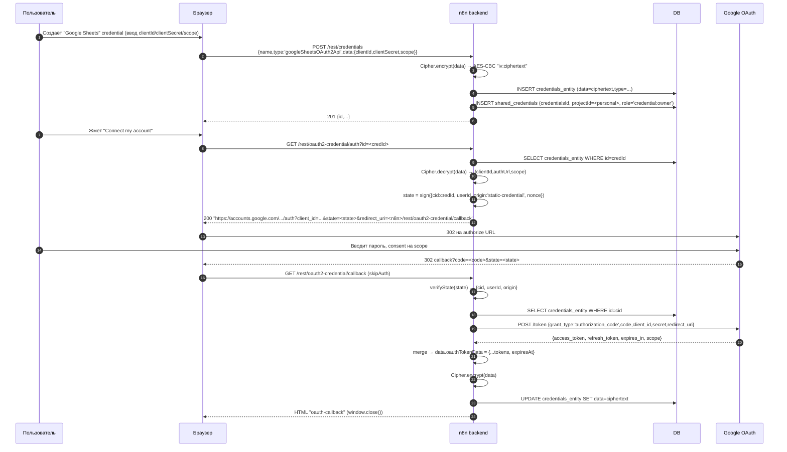

**Ключевое:**
- Токены не попадают в UI — только backend↔DB.
- `state` защищает от CSRF и несёт `origin` для развилки static/dynamic.
- Callback — единственный endpoint без auth (`skipAuth`), т.к. Google редиректит без n8n-auth cookie.

### 3.2 OAuth2 — refresh при выполнении workflow

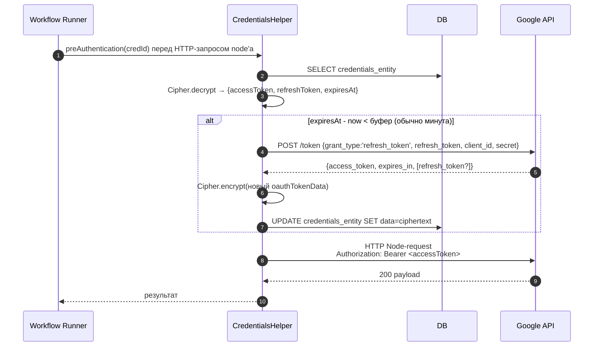

**Пробел n8n:** refresh только JIT. Для редко запускаемых workflow refresh-токен может истечь
(провайдерские TTL). В Nebula стоит иметь опциональный фоновый refresher для активных credentials.

### 3.3 SAML SSO login

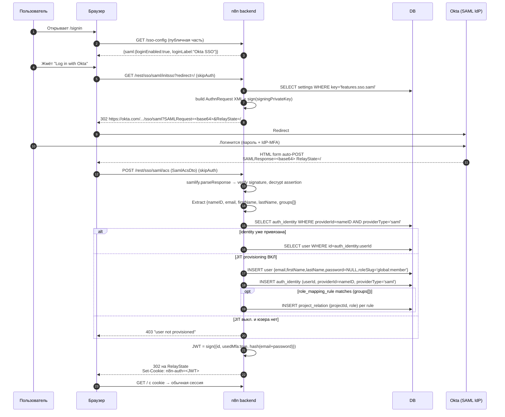

**Ключевое:**
- Два binding'а: redirect (GET) и POST (через auto-submit form).
- `usedMfa:true` — n8n доверяет IdP'шному MFA.
- `role_mapping_rule` — **только** SAML/OIDC имеют claim→role mapping. LDAP не имеет.

### 3.4 OIDC SSO login

```mermaid
sequenceDiagram
    autonumber
    participant U as Пользователь
    participant UI as Браузер
    participant n8n as n8n backend
    participant DB as DB
    participant IdP as Auth0 (OIDC)

    U->>UI: Клик "Sign in with Auth0"
    UI->>n8n: GET /rest/sso/oidc/login (skipAuth)
    n8n->>DB: SELECT settings WHERE key='features.sso.oidc'
    n8n->>n8n: state=uuid(), nonce=uuid()
    n8n-->>UI: 302 https://auth0/authorize?response_type=code&client_id=...&scope=openid%20email%20profile&state=<state>&nonce=<nonce>&redirect_uri=/callback<br/>Set-Cookie: oidc_state=<state>; oidc_nonce=<nonce> (TTL 15min, HttpOnly)

    UI->>IdP: Redirect
    U->>IdP: Логин
    IdP-->>UI: 302 /rest/sso/oidc/callback?code=<code>&state=<state>
    UI->>n8n: GET /callback (skipAuth) с cookies oidc_state/oidc_nonce

    n8n->>n8n: assert state === cookies.oidc_state
    n8n->>IdP: POST /token {grant_type:'authorization_code',code,redirect_uri,client_id,secret}
    IdP-->>n8n: {access_token, id_token, refresh_token?}
    n8n->>IdP: GET /.well-known/jwks (кешируется)
    n8n->>n8n: verify id_token signature, assert nonce === cookies.oidc_nonce
    n8n->>n8n: extract {sub, email, name, ...}

    n8n->>DB: SELECT auth_identity WHERE providerId=sub AND providerType='oidc'
    alt новый юзер и JIT on
        n8n->>DB: INSERT user + auth_identity
        opt role_mapping_rule matches
            n8n->>DB: INSERT project_relation
        end
    end
    n8n->>n8n: n8n-JWT = sign({id, usedMfa:true, ...})
    n8n-->>UI: 302 на / + Set-Cookie: n8n-auth<br/>Clear-Cookie: oidc_state, oidc_nonce
```

**Ключевое:** state и nonce живут в cookies, не в DB. Stateless-подход с TTL.

### 3.5 LDAP login + sync

**3.5a Login:**

```mermaid
sequenceDiagram
    autonumber
    participant U as Пользователь
    participant UI as Браузер
    participant n8n as n8n backend
    participant DB as DB
    participant LDAP as AD / OpenLDAP

    U->>UI: email+password в форму
    UI->>n8n: POST /rest/login {emailOrLdapLoginId, password}
    n8n->>DB: SELECT settings WHERE key='features.ldap'
    n8n->>LDAP: bind(bindingAdminDn, bindingAdminPassword) [admin]
    n8n->>LDAP: search(baseDn, userFilter replace(loginIdAttribute,<input>))
    LDAP-->>n8n: DN + {mail, givenName, sn, objectGUID}

    n8n->>LDAP: bind(userDN, <user password>) [проверка пароля]
    alt bind успешен
        n8n->>DB: SELECT auth_identity WHERE providerId=objectGUID AND providerType='ldap'
        alt первый вход
            n8n->>DB: INSERT user {email, firstName, lastName, password=NULL, disabled:false}
            n8n->>DB: INSERT auth_identity (userId, providerId=objectGUID, providerType='ldap')
        else существующий
            n8n->>DB: UPDATE user SET email, firstName, lastName (sync attrs)
        end
        n8n->>n8n: JWT = sign({id, usedMfa:false, ...})
        n8n-->>UI: 200 PublicUser + Set-Cookie: n8n-auth
    else bind failed
        n8n-->>UI: 401
    end
```

**3.5b Background sync (scheduler или POST `/ldap/sync`):**

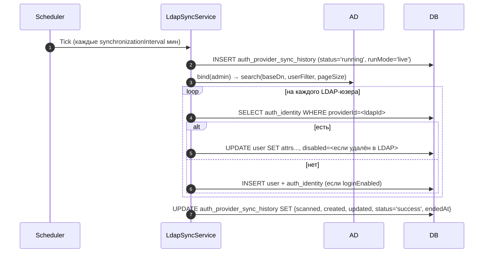

**Пробел:** ни на login, ни на sync нет `group → role mapping`. В Nebula — заложить сразу.

### 3.6 Local login + MFA (TOTP)

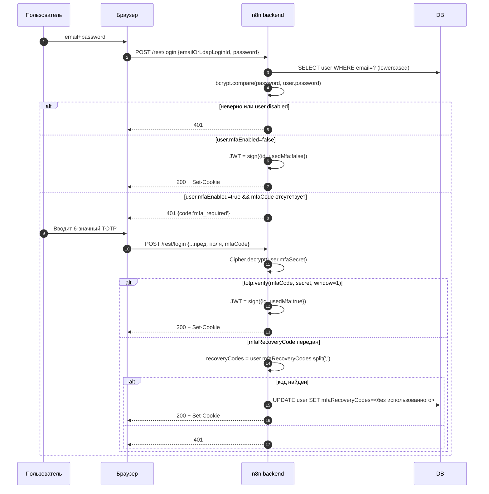

**На logout:** `POST /rest/logout` вставляет JWT в `invalid_auth_token` (denylist).

### 3.7 External Secrets — resolve во время выполнения workflow

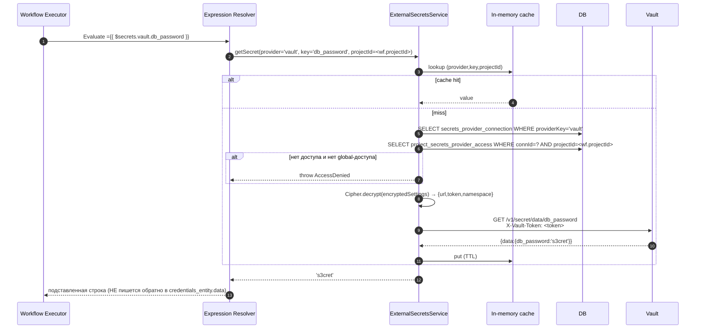

### 3.8 API key (public API)

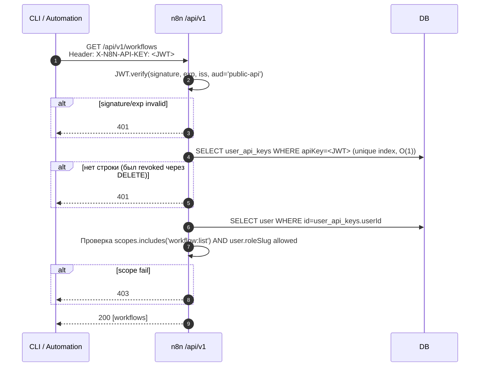

**Тонкость:** stateless JWT + возможность revocation через DELETE row.

### 3.9 Dynamic credentials — OAuth2 через external resolver

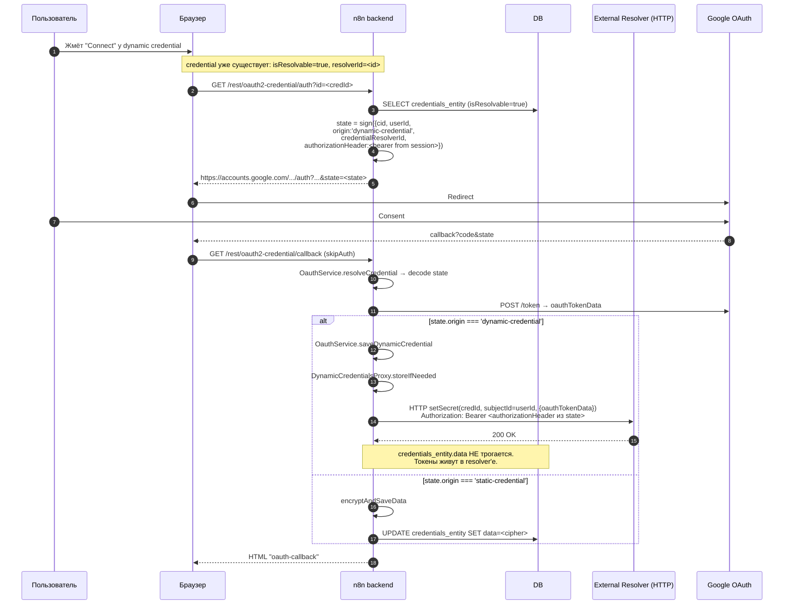

**Что это даёт:** при вайпе n8n tenant'а токены у resolver'а тоже вайпаются
— DB-дамп n8n бесполезен для похищения OAuth-токенов.

### 3.10 Dynamic credentials — runtime resolve

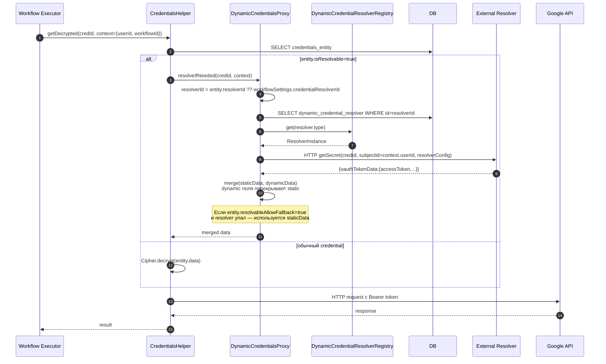

### 3.11 Invitation → первый login нового юзера

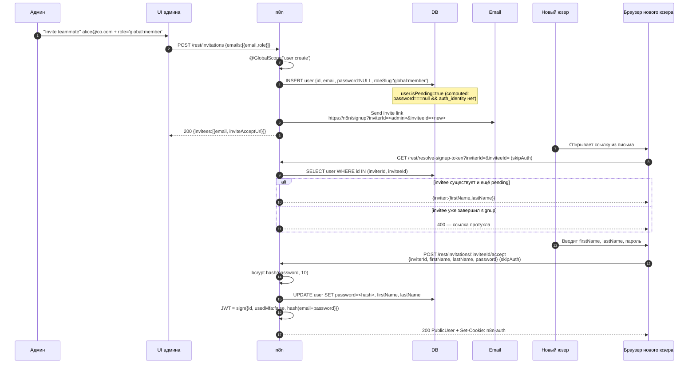

### 3.12 Password reset (локальные юзеры)

```mermaid
sequenceDiagram
    autonumber
    participant U as Пользователь
    participant UI as Браузер
    participant n8n as n8n
    participant DB as DB
    participant Mail as Email

    U->>UI: "Forgot password?" вводит email
    UI->>n8n: POST /rest/forgot-password {email}<br/>skipAuth + IP RL + body-keyed RL + jitter middleware
    n8n->>DB: SELECT user WHERE email=?
    alt user найден и не SSO-only
        n8n->>n8n: resetToken = sign({userId, purpose:'password-reset'}, TTL=30min)
        n8n->>Mail: Send link https://n8n/change-password?token=<resetToken>
    end
    n8n-->>UI: 200 ВСЕГДА<br/>(jitter + одинаковый response — чтобы не раскрыть существует ли email)

    U->>UI: Открывает ссылку из письма
    UI->>n8n: GET /rest/resolve-password-token?token=<token>
    n8n->>n8n: verify JWT signature, exp, purpose
    alt валидный
        n8n-->>UI: 200 (форма сброса)
    else протух/подделан
        n8n-->>UI: 404
    end

    U->>UI: Новый пароль (+ mfaCode если mfaEnabled)
    UI->>n8n: POST /rest/change-password {token, password, mfaCode?}
    n8n->>n8n: verify token; если mfa — totp.verify
    n8n->>n8n: bcrypt.hash(newPassword)
    n8n->>DB: UPDATE user SET password=<new hash>
    Note over n8n: Все старые n8n-auth cookies автоматически<br/>невалидны: их JWT payload содержит<br/>hash(email+oldPassword), который изменился
    n8n-->>UI: 200 (требуется re-login)
```

**Элегантный приём:** session invalidation происходит без трогания `invalid_auth_token`
— за счёт `hash(email+password)` в JWT payload.

### 3.13 Device-code flow — дизайн-предложение для Nebula CLI (в n8n нет)

```mermaid
sequenceDiagram
    autonumber
    participant CLI as nebula CLI
    participant API as Nebula API
    participant DB as DB
    participant U as Пользователь
    participant WebUI as Браузер (уже залогинен в Nebula)

    U->>CLI: nebula login
    CLI->>API: POST /rest/device/code (без auth)
    API->>API: device_code = rand32(); user_code = "ABCD-1234"
    API->>DB: INSERT device_auth_pending<br/>{device_code, user_code, expiresAt=now+10min, status='pending'}
    API-->>CLI: {device_code, user_code, verification_uri:"nebula.io/cli", interval:5, expires_in:600}
    CLI->>U: "Go to nebula.io/cli and enter ABCD-1234"

    par Polling
        loop каждые interval секунд
            CLI->>API: POST /rest/device/token {device_code}
            API->>DB: SELECT device_auth_pending WHERE device_code=?
            alt status='pending'
                API-->>CLI: 400 {error:'authorization_pending'}
            else status='denied'
                API-->>CLI: 400 {error:'access_denied'}
            else expired
                API-->>CLI: 400 {error:'expired_token'}
            end
        end
    and User approves в браузере
        U->>WebUI: Открывает nebula.io/cli
        WebUI->>API: POST /rest/device/verify {user_code} (cookie auth)
        API->>API: @GlobalScope('apiKey:manage')
        API->>DB: SELECT device_auth_pending WHERE user_code=? AND status='pending'
        alt найдено
            API-->>WebUI: {deviceInfo:{hostname, ip, requestedScopes}}
            U->>WebUI: "Approve"
            WebUI->>API: POST /rest/device/approve {user_code}
            API->>DB: UPDATE device_auth_pending SET userId=<current>, status='approved'
            API-->>WebUI: 200 "CLI authorized ✓"
        end
    end

    Note over CLI,API: Следующий poll
    CLI->>API: POST /rest/device/token {device_code}
    API->>DB: SELECT device_auth_pending WHERE device_code=? AND status='approved'
    API->>DB: INSERT user_api_keys<br/>{userId, apiKey=<JWT scope=cli:*>, label='CLI on <hostname>'}
    API->>DB: DELETE device_auth_pending WHERE device_code=?
    API-->>CLI: {access_token:<JWT>, token_type:'Bearer'}
    CLI->>CLI: save to ~/.nebula/credentials (chmod 600)
```

**Почему стоит иметь в Nebula:**
- Пользователь не копипастит секрет вручную.
- Можно показать **какая машина** запрашивает доступ до approve (hostname, IP, scopes).
- Device-code = public client, без `client_secret` в CLI — правильно.

---

## 4. Сводная карта flow'ов

| # | Flow | Назначение | Основные DB-таблицы |
|---|---|---|---|
| 3.1 | OAuth2 credential (static) | Привязка внешнего аккаунта к workflow | `credentials_entity`, `shared_credentials` |
| 3.2 | OAuth2 refresh | Обновление токена перед HTTP-вызовом | `credentials_entity` |
| 3.3 | SAML login | Корпоративный SSO | `auth_identity`, `user`, `settings[features.sso.saml]`, `role_mapping_rule` |
| 3.4 | OIDC login | SSO через Auth0/Google Workspace/… | те же + cookies `oidc_state/nonce` |
| 3.5 | LDAP login + sync | Корпоративный directory | `auth_identity`, `user`, `auth_provider_sync_history`, `settings[features.ldap]` |
| 3.6 | Local login + MFA | Email/password + TOTP | `user` (+ `invalid_auth_token` на logout) |
| 3.7 | External secrets | Подстановка `$secrets.…` в expression | `secrets_provider_connection`, `project_secrets_provider_access` |
| 3.8 | API key | Внешний caller для `/api/v1` | `user_api_keys` |
| 3.9 | Dynamic creds — OAuth2 | Токены вне n8n DB | `credentials_entity` (isResolvable), external resolver |
| 3.10 | Dynamic creds — runtime | Fetch токена на запуске node | `dynamic_credential_resolver`, resolver HTTP |
| 3.11 | Invitation | Админ приглашает team-member | `user` (password=NULL) |
| 3.12 | Password reset | Сброс локального пароля | `user` |
| 3.13 | Device-code (предложение) | CLI-авторизация в Nebula | `device_auth_pending` + `user_api_keys` |

---

## 5. Архитектурные решения n8n (неявные ADR)

1. **Credential type — декларативное node property, не trait impl.**
   Открывает community-package extension без code review.
2. **Project owns credentials, не user, не workflow.**
3. **OIDC — отдельный модуль от SAML** (`sso-saml/` vs `sso-oidc/`), не полиморфный `SsoService`.
4. **External secrets — expression-time, не credential-time.**
5. **Dynamic Credentials module** — runtime-резолв credentials из внешних источников.
6. **Master encryption key — файл-seed на первом буте** (опасно для distributed workers).
7. **Scan + explicit `package.json` registration** одновременно — redundant surface.

---

## 6. Паттерны для Nebula (TL;DR из §1-5)

1. **`origin` в state-envelope** (static/dynamic) — заложить сразу, даже если dynamic-credentials
   появятся через год.
2. **`hash(email+password)` в JWT payload** — бесплатный kill-switch сессий на смену пароля.
3. **`isPending` как computed, а не колонка** — один правильный путь через `auth_identity` + null-password.
4. **Device-code для Nebula CLI** — правильнее чем `~/.nebula/config` с API key руками.
5. **`invalid_auth_token` / OIDC `state/nonce` cookies / `token_exchange_jti`** —
   все в Redis с TTL, один store.
6. **`resolvableAllowFallback`** — graceful degradation когда resolver недоступен.
7. **Jitter + равный response** в `/forgot-password` — security hygiene.
8. **`auth_identity` composite PK `(providerId, providerType)`** + FK `userId` — один
   user может иметь много identity разных типов.
9. **`shared_credentials` composite PK `(credentialsId, projectId)` + role VARCHAR** —
   чище чем surrogate key + permission enum.
10. **API key = JWT в unique-indexed column** — O(1) validation + revocation через DELETE.

---

## 7. Пиитфоллы (не повторять)

1. **LDAP без group→role mapping** — заложить с day 1.
2. **Scan + explicit `package.json` registration** одновременно — дублирование.
   У Nebula уже есть plugin-manifest (ADR-0018).
3. **1000+ `.credentials.ts` файлов** — предпочесть data-driven registry (YAML/TOML).
4. **Master key файл-seed на первом буте** — опасно для distributed workers.
   Enforce env-only в distributed mode.
5. **JWT PATs без `jti` denylist** — задокументировать или добавить denylist.
6. **Refresh только on-demand** — для редких workflow refresh-token может истечь.
   Нужен background refresher для активных credentials.
7. **Credential encryption без envelope/version** — rotation становится painful.
   В Nebula — `{version, iv, ciphertext, kek_id}` с первого дня.
8. **Hardcoded config в `settings` key-value** для типизированных конфигов (LDAP/SAML/OIDC).
   Без DB-level validation. В Nebula — dedicated таблицы на провайдер.

---

## 8. Карта файлов для глубокого чтения

### Controllers (auth + credentials)
- `packages/cli/src/controllers/oauth/oauth1-credential.controller.ts`
- `packages/cli/src/controllers/oauth/oauth2-credential.controller.ts`
- `packages/cli/src/controllers/oauth/oauth2-dynamic-client-registration.schema.ts`
- `packages/cli/src/controllers/{auth,me,password-reset,invitation,owner,users,api-keys,mfa,role}.controller.ts`
- `packages/cli/src/oauth/oauth.service.ts`
- `packages/cli/src/auth/auth.service.ts`, `auth-handler.registry.ts`, `jwt.ts`, `handlers/`
- `packages/cli/src/mfa/{mfa.service.ts, totp.service.ts, helpers.ts}`

### Credentials service + dynamic
- `packages/cli/src/credentials/credentials.service.ts` (43 KB) + `.ee.ts`
- `packages/cli/src/credentials/credentials.controller.ts`
- `packages/cli/src/credentials/credentials-finder.service.ts`
- `packages/cli/src/credentials/dynamic-credentials-proxy.ts`
- `packages/cli/src/credentials/dynamic-credential-storage.interface.ts`
- `packages/cli/src/credentials/credential-resolution-provider.interface.ts`
- `packages/cli/src/credentials/external-secrets.utils.ts`

### SSO modules
- `packages/cli/src/modules/ldap.ee/`
- `packages/cli/src/modules/sso-saml/{saml.service.ee.ts, saml.controller.ee.ts, saml-helpers.ts, saml-validator.ts, service-provider.ee.ts, schema/, middleware/}`
- `packages/cli/src/modules/sso-oidc/`
- `packages/cli/src/modules/external-secrets.ee/`
- `packages/cli/src/modules/provisioning.ee/`
- `packages/cli/src/modules/encryption-key-manager/`
- `packages/cli/src/modules/dynamic-credentials.ee/`
- `packages/cli/src/sso.ee/sso-helpers.ts`

### Core (encryption + request helpers)
- `packages/core/src/Credentials.ts` — Cipher + in-memory encrypt/decrypt
- `packages/core/src/execution-engine/node-execution-context/utils/request-helper-functions.ts`
  — OAuth1/2 request helpers + `refreshOAuth2Token`

### Credential definitions (integration-level)
- `packages/nodes-base/credentials/*.credentials.ts` — 1 файл на интеграцию
  (например `TwitterOAuth1Api.credentials.ts`, `SalesforceOAuth2Api.credentials.ts`, ~1000+ файлов)

### Permissions
- `packages/@n8n/permissions/src/public-api-permissions.ee.ts` — API-key scopes

### DB entities (все в `packages/@n8n/db/src/entities/`)
- `user.ts`
- `credentials-entity.ts`
- `shared-credentials.ts`
- `auth-identity.ts`
- `api-key.ts` (таблица `user_api_keys`)
- `auth-provider-sync-history.ts`
- `invalid-auth-token.ts`
- `settings.ts`
- `project.ts`
- `project-relation.ts`
- `role.ts`, `scope.ts`
- `role-mapping-rule.ts`
- `deployment-key.ts` ⚠️ содержимое не подтверждено
- `secrets-provider-connection.ts`
- `project-secrets-provider-access.ts`
- `credential-dependency-entity.ts`
- `dynamic-credential-*` (несколько файлов)

### Ключевые миграции (все в `packages/@n8n/db/src/migrations/common/`)
- `1587669153312-InitialMigration.ts` (PG) / `1588102412422-InitialMigration.ts` (SQLite)
- `1646992772331-CreateUserManagement.ts`
- `1674509946020-CreateLdapEntities.ts` — `auth_identity`, `auth_provider_sync_history`, `disabled` на user
- `1690000000000-MigrateIntegerKeysToString.ts` — миграция ID на VARCHAR(36)
- `1690000000030-RemoveResetPasswordColumns.ts`
- `1690000000040-AddMfaColumns.ts`
- `1712044305787-RemoveNodesAccess.ts`
- `1714133768519-CreateProject.ts`
- `1723627610222-CreateInvalidAuthTokenTable.ts`
- `1724951148974-AddApiKeysTable.ts`
- `1734479635324-AddManagedColumnToCredentialsTable.ts`
- `1742918400000-AddScopesColumnToApiKeys.ts`
- `1745934666077-DropRoleTable.ts`
- `1747824239000-AddProjectDescriptionColumn.ts`
- `1750252139166-AddLastActiveAtColumnToUser.ts`
- `1750252139167-AddRolesTables.ts`
- `1750252139168-LinkRoleToUserTable.ts`
- `1753953244168-LinkRoleToProjectRelationTable.ts`
- `1756906557570-AddTimestampsToRoleAndRoleIndexes.ts`
- `1758731786132-AddAudienceColumnToApiKey.ts`
- `1762771954619-AddIsGlobalColumnToCredentialsTable.ts`
- `1764276827837-AddCreatorIdToProjectTable.ts`
- `1764689388394-AddDynamicCredentialEntryTable.ts`
- `1765459448000-AddResolvableFieldsToCredentials.ts`
- `1768901721000-AddDynamicCredentialUserEntryTable.ts`
- `1769433700000-CreateSecretsProvidersConnectionTables.ts`
- `1771500000000-MigrateExternalSecretsToEntityStorage.ts`
- `1772619247761-AddRoleColumnToProjectSecretsProviderAccess.ts`
- `1772800000000-CreateRoleMappingRuleTable.ts`
- `1773000000000-CreateCredentialDependencyTable.ts`
- `1775116241000-CreateTokenExchangeJtiTable.ts`
- `1776000000000-CreateTrustedKeyTables.ts`
- `1777000000000-CreateDeploymentKeyTable.ts`

---

## 9. Открытые вопросы на следующий раунд

1. **Deployment keys** — точная схема таблицы и endpoints (DeepWiki не проиндексировал).
   Прямой просмотр `packages/@n8n/db/src/migrations/common/1777000000000-CreateDeploymentKeyTable.ts`.
2. **Trusted keys** — как устроен inter-instance trust (source-control / env-management flow).
3. **Token exchange** — flow и semantic (`token_exchange_jti` hints на delegation-flow).
4. **n8n Cloud-specific auth** — есть ли дополнительные endpoints/таблицы сверх OSS.
5. **Credential дистрибуция на workers** — как worker получает master-key
   (env-var мандатно, но механика fetch'а credentials из central DB?).
6. **OAuth2 `authorization`-в-header vs body** — детали `ICredentialType.authentication`.
7. **Webhook auth** — HMAC, shared secrets, signature verification (не покрыто этим исследованием).
