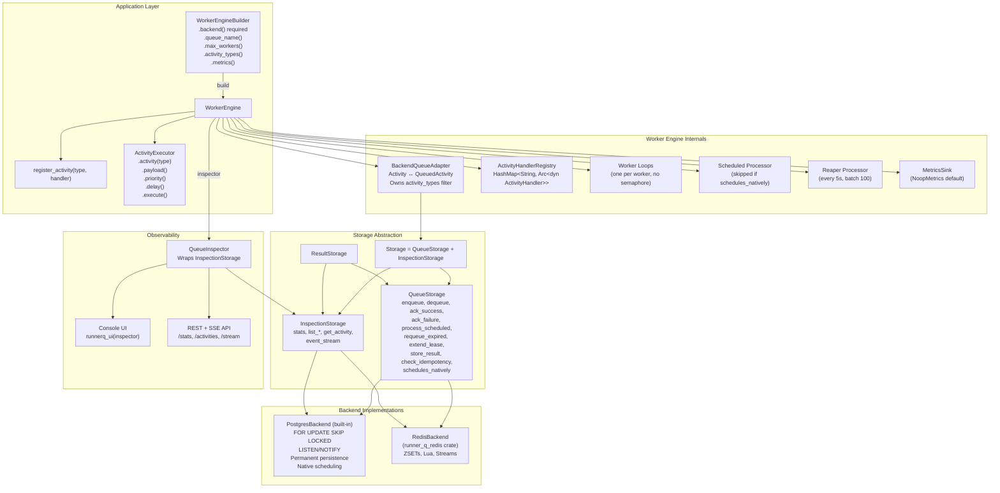
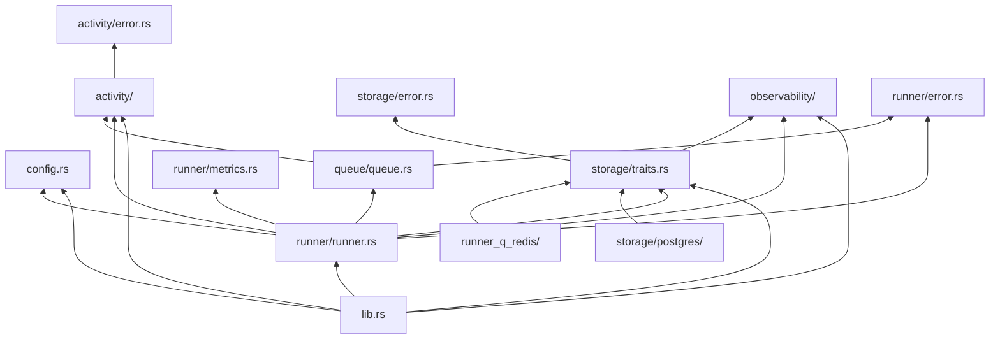
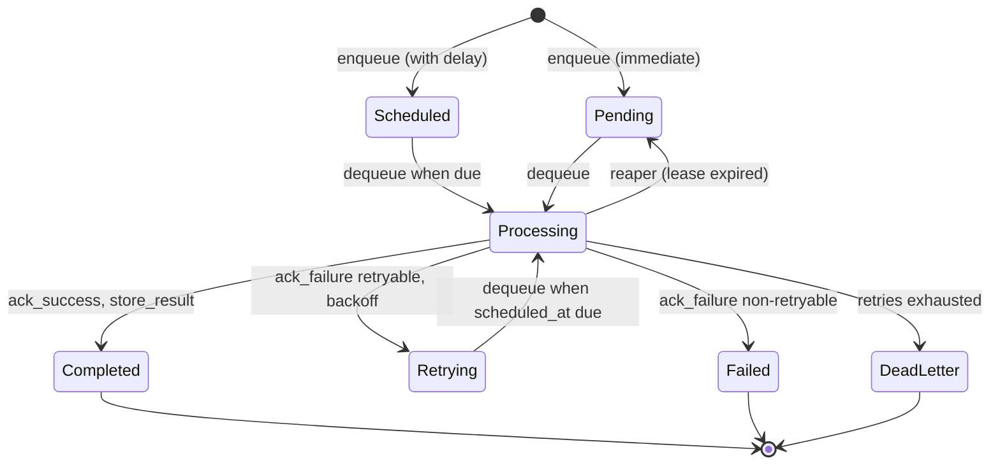
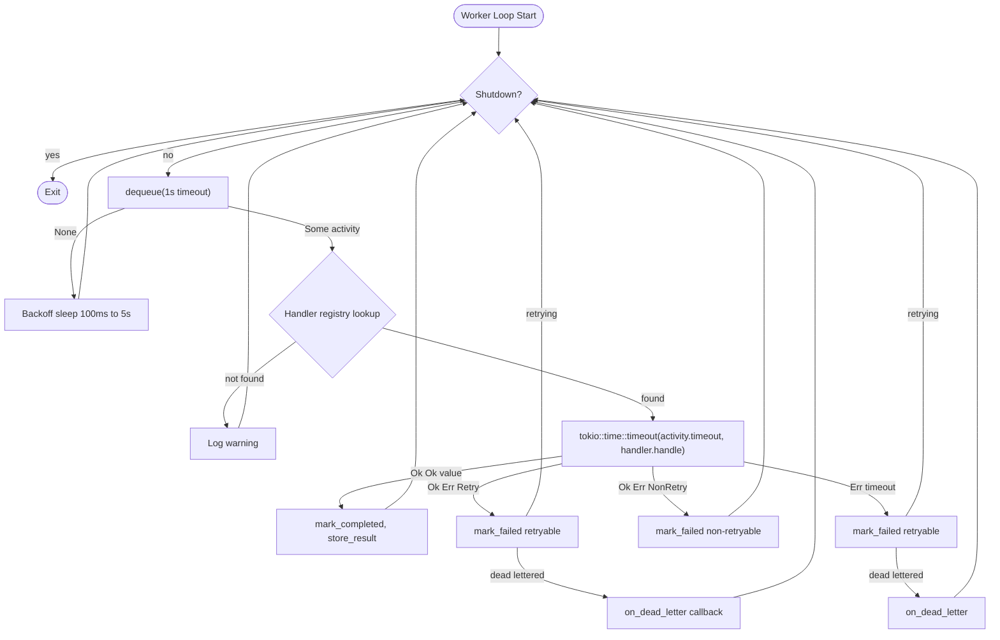
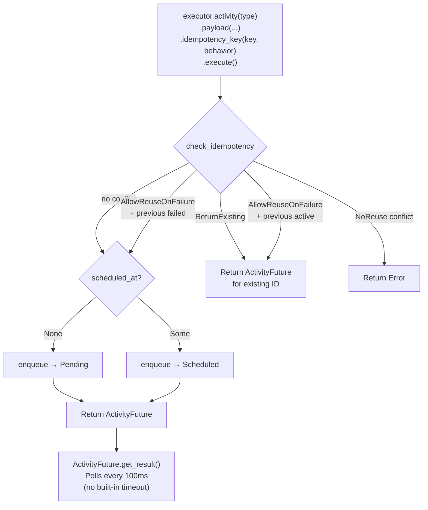
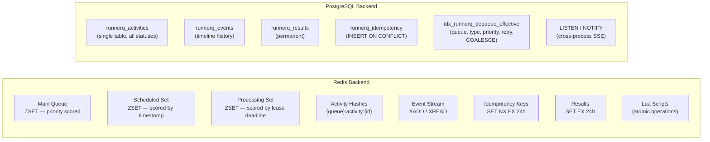
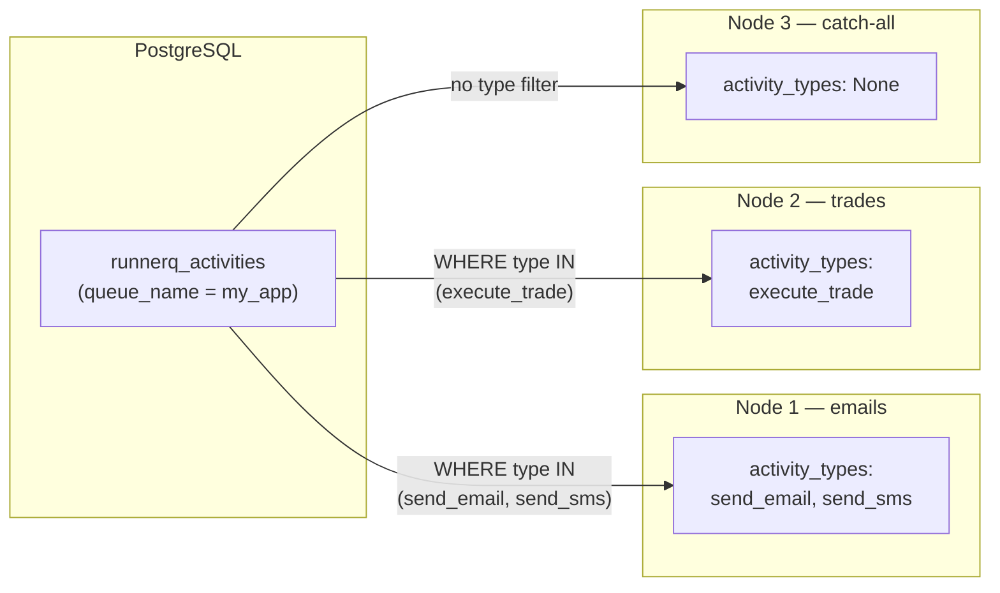
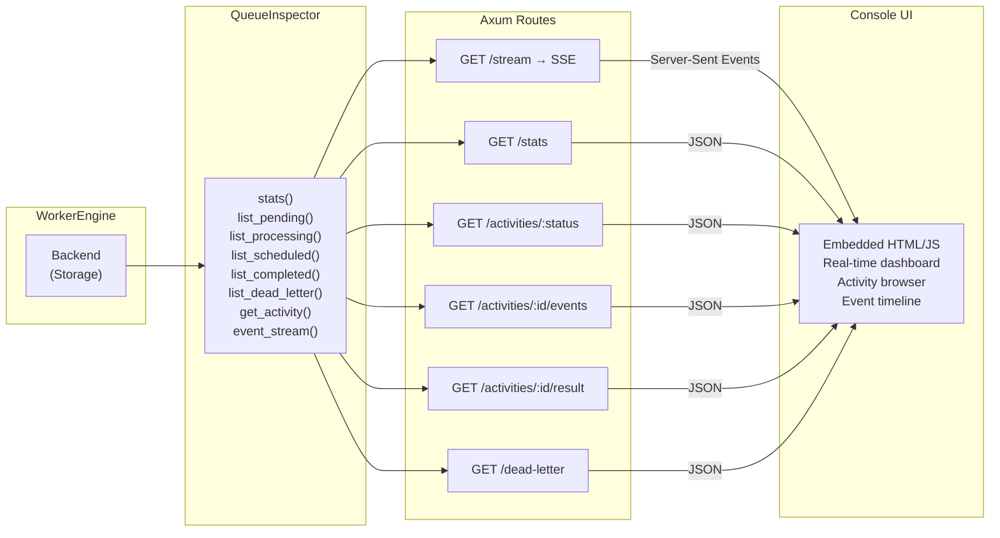

# RunnerQ Architecture

## System Overview



## Module Structure

```text
src/
├── lib.rs                  # Public API surface, re-exports
├── config.rs               # WorkerConfig
├── activity/               # Activity domain
│   ├── activity.rs         # Activity, ActivityContext, ActivityHandler, ActivityFuture, ActivityOption
│   └── error.rs            # ActivityError, RetryableError
├── queue/                  # Internal queue abstraction
│   └── queue.rs            # ActivityQueueTrait (internal), ActivityResult, ResultState
├── runner/                 # Worker engine
│   ├── error.rs            # WorkerError
│   ├── metrics.rs          # Metric name constants
│   └── runner.rs           # WorkerEngine, WorkerEngineBuilder, BackendQueueAdapter,
│                           # ActivityBuilder, ActivityExecutor, MetricsSink
├── storage/                # Backend abstraction
│   ├── error.rs            # StorageError
│   ├── traits.rs           # QueueStorage, InspectionStorage, Storage, ResultStorage
│   └── postgres/           # PostgreSQL implementation (built-in)
│       └── mod.rs          # PostgresBackend, all trait impls
│   # Redis: runner_q_redis crate (separate)
└── observability/          # Monitoring, UI
    ├── models.rs           # ActivitySnapshot, ActivityEvent, QueueStats, DeadLetterRecord
    ├── inspector.rs        # QueueInspector
    └── ui/
        ├── html.rs         # Embedded console HTML
        └── axum.rs         # observability_api(), runnerq_ui()
```

## Module Dependency Map



## Activity Lifecycle



### Status definitions

| Status | Meaning |
|--------|---------|
| **Pending** | Immediately available for dequeue |
| **Scheduled** | Waiting for `scheduled_at` to arrive |
| **Processing** | Claimed by a worker, lease held |
| **Retrying** | Failed but retriable; waiting with exponential backoff |
| **Completed** | Successfully finished |
| **Failed** | Non-retryable failure |
| **DeadLetter** | Exhausted all retries |

## Trait Hierarchy

```text
ResultStorage
├── get_result()
│
├── QueueStorage (extends ResultStorage)
│   ├── enqueue()
│   ├── dequeue(worker_id, timeout, activity_types)
│   ├── ack_success()
│   ├── ack_failure()
│   ├── process_scheduled()
│   ├── requeue_expired()
│   ├── extend_lease()
│   ├── store_result()
│   ├── check_idempotency()
│   └── schedules_natively()        — default: false
│
└── InspectionStorage (extends ResultStorage)
    ├── stats()
    ├── list_pending() / list_processing() / list_scheduled() / list_completed()
    ├── list_dead_letter()
    ├── get_activity()
    ├── get_activity_events()
    └── event_stream()              — SSE stream

Storage = QueueStorage + InspectionStorage   (blanket impl)
```

`ActivityQueueTrait` is the **internal** trait used by the worker engine. `BackendQueueAdapter` implements it over any `Storage`, converting between the internal `Activity` type and the backend `QueuedActivity` type.

## Core Components

### WorkerEngine

Owns and coordinates all runtime components:

- **`activity_queue`** — `BackendQueueAdapter` (implements `ActivityQueueTrait`)
- **`backend`** — `Arc<dyn Storage>` (the raw backend)
- **`activity_handlers`** — `HashMap<String, Arc<dyn ActivityHandler>>`
- **`config`** — `WorkerConfig` (queue name, concurrency, polling intervals, activity types)
- **`metrics`** — `Arc<dyn MetricsSink>`
- Shutdown coordination via `watch::channel` and `CancellationToken`

### WorkerEngineBuilder

Fluent API for constructing a `WorkerEngine`. You must call `.backend(...)` (e.g. `PostgresBackend::new(...)` or `runner_q_redis::RedisBackend::builder().build().await?`):

```rust
let backend = PostgresBackend::new("postgres://localhost/mydb", "my_app").await?;
WorkerEngine::builder()
    .backend(Arc::new(backend))
    .queue_name("my_app")
    .max_workers(8)
    .activity_types(&["send_email"])       // optional workload filter
    .schedule_poll_interval(Duration::from_secs(30))
    .metrics(Arc::new(PrometheusMetrics))
    .build()
    .await?
```

### BackendQueueAdapter

Bridges the internal `ActivityQueueTrait` and the public `Storage` trait:

- Converts `Activity` ↔ `QueuedActivity` and `OnDuplicate` ↔ `IdempotencyBehavior`
- **Owns the `activity_types` filter** and injects it into every `backend.dequeue()` call
- Delegates `schedules_natively()` to the backend

### ActivityHandlerRegistry

A `HashMap<String, Arc<dyn ActivityHandler>>`. The worker loop looks up a handler by `activity_type` string on every dequeued activity.

## Worker Loop

One dedicated loop per worker (no semaphore). Each loop continuously dequeues, executes, and acks:



### Concurrency control

`max_concurrent_activities` worker tasks are spawned; each runs a single loop that dequeues one activity at a time, executes it, then loops again. Concurrency is thus bounded by the number of worker loops, not a semaphore.

### Backoff on idle

When `dequeue` returns `None`, the worker sleeps with exponential backoff (100ms base, 5s max) to avoid hammering the backend.

### Panic safety

Handler execution is wrapped in `catch_unwind`. A panic is converted to `ActivityError::Retry` so the activity is retried rather than lost.

## Background Processors

### Scheduled Activities Processor

- Spawned at `engine.start()` **only if** `schedules_natively()` returns `false`
- Calls `process_scheduled()` every `schedule_poll_interval_seconds`
- **Redis:** Lua script moves up to 100 due items from the scheduled ZSET to the main queue
- **Postgres:** Returns `Ok(0)` (no-op) — scheduling is handled inline in `dequeue()`

### Reaper Processor

- Always spawned
- Calls `requeue_expired(batch_size)` every `reaper_interval_seconds` (default 5s)
- Reclaims activities stuck in `processing` whose lease has expired (worker crashed or timed out)
- Moves them back to `pending` status

## Activity Executor & Idempotency



### Idempotency behaviors

| Behavior | On conflict |
|----------|-------------|
| `AllowReuse` | Always create new activity, update idempotency record |
| `ReturnExisting` | Return `ActivityFuture` for the existing activity |
| `AllowReuseOnFailure` | Reuse only if previous activity failed; otherwise return existing |
| `NoReuse` | Return error |

### Backend implementations

- **Redis:** `SET key NX EX 24h`; on conflict, load snapshot and apply behavior
- **Postgres:** `INSERT ... ON CONFLICT DO NOTHING`; on conflict, join with activities table

## Storage Backends: Redis vs PostgreSQL



| Aspect | Redis | PostgreSQL |
|--------|-------|------------|
| **Data model** | ZSETs + hashes + streams | Relational tables |
| **Dequeue** | Lua `ZPOPMAX` + `ZADD` | `SELECT ... FOR UPDATE SKIP LOCKED` |
| **Scheduling** | `process_scheduled()` loop (100-item Lua batch) | Native in `dequeue()` — no loop |
| **Activity type filter** | Accepted but ignored | `AND activity_type = ANY($6)` in SQL |
| **Priority** | Score = age + retry boost + priority weight | `ORDER BY priority DESC, retry_count DESC, COALESCE(scheduled_at, created_at) ASC` |
| **Retention** | TTL-based (7d snapshots, 24h results, 1h events) | Permanent — no TTL |
| **Events** | Redis Streams (`XADD` / `XREAD`) | `LISTEN/NOTIFY` + `runnerq_events` table |
| **Idempotency** | `SET key NX EX` | `INSERT ... ON CONFLICT DO NOTHING` |
| **Concurrency** | Lua scripts (atomic) | Row-level locks (`SKIP LOCKED`) |

## Dequeue Ordering (PostgreSQL)

The `dequeue()` query evaluates candidates in three tiers:

```sql
ORDER BY
    priority DESC,          -- Critical(4) > High(3) > Normal(2) > Low(1)
    retry_count DESC,       -- more retries → higher urgency (starvation avoidance)
    COALESCE(scheduled_at, created_at) ASC  -- oldest-ready first (FIFO within tier)
```

`COALESCE(scheduled_at, created_at)` is the **effective ready time**:
- `pending` activities: `scheduled_at` is NULL → resolves to `created_at`
- `scheduled`/`retrying` activities: resolves to `scheduled_at`

This ensures activities are ordered by when they first became actionable.

## Workload Isolation (Activity Type Filtering)



- Configured via `.activity_types(&[...])` on the builder
- Stored in `BackendQueueAdapter`, injected into every `dequeue()` call
- `None` = catch-all (claims any type)
- At `engine.start()`, panics if any declared type has no registered handler
- Backed by the expression index `idx_runnerq_dequeue_effective` which includes `activity_type`

## Observability Stack



- `engine.inspector()` returns a `QueueInspector` wrapping the backend's `InspectionStorage`
- `runnerq_ui(inspector)` serves the embedded console + API routes (nest at any path)
- `observability_api(inspector)` serves the API routes only (for custom UIs)
- SSE uses Redis Streams (`XREAD` block) or PostgreSQL `LISTEN/NOTIFY`

## Metrics

The `MetricsSink` trait allows plugging in any monitoring system:

```rust
pub trait MetricsSink: Send + Sync + 'static {
    fn inc_counter(&self, name: &str, value: u64);
    fn observe_duration(&self, name: &str, dur: Duration);  // default: no-op
}
```

## Component Reference

| Component | Responsibility |
|-----------|---------------|
| `WorkerEngineBuilder` | Fluent config → builds `WorkerEngine` |
| `WorkerEngine` | Owns handlers, config, backend; spawns workers + reaper + scheduler |
| `BackendQueueAdapter` | Bridges `ActivityQueueTrait` ↔ `Storage`; owns `activity_types` filter |
| `ActivityHandlerRegistry` | `HashMap<String, Arc<dyn ActivityHandler>>` — handler dispatch |
| `QueueStorage` | Backend trait: enqueue, dequeue, ack, idempotency, scheduling |
| `InspectionStorage` | Backend trait: stats, listing, events |
| `Storage` | Blanket: `QueueStorage + InspectionStorage` |
| `QueueInspector` | Read-only wrapper over `InspectionStorage` for UI/API |
| `ActivityExecutor` | Enqueue interface (used by handlers for orchestration) |
| `ActivityBuilder` | Fluent API for configuring and executing activities |
| `ActivityFuture` | Polls `get_result()` every 100ms until activity completes (caller applies timeout if needed) |
| `MetricsSink` | Counter + histogram interface (plug in Prometheus, etc.) |
| `Reaper` | Re-queues activities with expired leases (crashed workers) |
| `Scheduled Processor` | Moves due activities to ready queue (Redis only; Postgres skips) |
