# Dependency Map

All inter-crate dependencies extracted from `Cargo.toml` files in the workspace.
Generated from the actual source — updated whenever a `Cargo.toml` changes.

---

## Quick Reference: What Each Crate Depends On

| Crate | Direct nebula-* dependencies |
|-------|------------------------------|
| `nebula-core` | *(none — foundation)* |
| `nebula-log` | *(none — foundation)* |
| `nebula-system` | *(none — foundation)* |
| `nebula-eventbus` | *(none — foundation)* |
| `nebula-validator` | *(none — foundation)* |
| `nebula-storage` | `core` |
| `nebula-workflow` | `core` |
| `nebula-telemetry` | `core` · `eventbus` |
| `nebula-memory` | `core` · `system` · `log` *(optional)* |
| `nebula-config` | `log` · `validator` |
| `nebula-parameter` | `validator` |
| `nebula-macros` | `validator` |
| `nebula-metrics` | `telemetry` |
| `nebula-resilience` | `core` · `config` · `log` |
| `nebula-expression` | `core` · `log` · `memory` |
| `nebula-credential` | `core` · `log` · `parameter` · `eventbus` · `storage` *(optional feat)* |
| `nebula-resource` | `core` · `credential` · `eventbus` · `metrics` · `telemetry` · `parameter` |
| `nebula-action` | `core` · `credential` · `parameter` · `resource` |
| `nebula-execution` | `core` · `workflow` · `action` |
| `nebula-plugin` | `core` · `action` · `credential` · `resource` |
| `nebula-runtime` | `core` · `action` · `plugin` · `metrics` · `telemetry` |
| `nebula-engine` | `core` · `action` · `expression` · `plugin` · `parameter` · `workflow` · `execution` · `resource` · `runtime` · `metrics` · `telemetry` |
| `nebula-sdk` | `core` · `action` · `workflow` · `parameter` · `credential` · `plugin` · `macros` · `validator` |
| `nebula-api` | `core` · `storage` · `config` |
| `nebula-webhook` | `core` · `resource` |

---

## Who Depends on Each Crate (Fan-in)

Useful for understanding blast radius — if you change crate X, these crates may be affected.

| Crate | Depended on by |
|-------|---------------|
| `nebula-core` | *everything* (22 crates) |
| `nebula-log` | `config` · `credential` · `expression` · `memory` · `resilience` |
| `nebula-system` | `memory` |
| `nebula-eventbus` | `credential` · `resource` · `telemetry` |
| `nebula-validator` | `config` · `macros` · `parameter` · `sdk` |
| `nebula-storage` | `api` · `credential` *(optional)* |
| `nebula-workflow` | `execution` · `engine` · `sdk` |
| `nebula-telemetry` | `metrics` · `resource` · `runtime` · `engine` |
| `nebula-memory` | `expression` |
| `nebula-config` | `resilience` · `api` |
| `nebula-parameter` | `action` · `credential` · `engine` · `resource` · `sdk` |
| `nebula-macros` | `sdk` |
| `nebula-metrics` | `engine` · `resource` · `runtime` |
| `nebula-resilience` | *(none yet — consumed by application-level code)* |
| `nebula-expression` | `engine` |
| `nebula-credential` | `action` · `plugin` · `resource` · `sdk` |
| `nebula-resource` | `action` · `plugin` · `engine` · `webhook` · `sdk` *(via action)* |
| `nebula-action` | `execution` · `engine` · `plugin` · `runtime` · `sdk` |
| `nebula-execution` | `engine` |
| `nebula-plugin` | `engine` · `runtime` · `sdk` |
| `nebula-runtime` | `engine` |
| `nebula-engine` | *(none yet — top of execution stack)* |
| `nebula-sdk` | *(none yet — developer-facing leaf)* |
| `nebula-api` | *(none yet — top of API stack)* |
| `nebula-webhook` | *(none yet — top of ingestion stack)* |

---

## Full Dependency Graph (Mermaid)

```mermaid
graph TD
    %% Foundation — no nebula-* dependencies
    core["nebula-core"]
    log["nebula-log"]
    system["nebula-system"]
    eventbus["nebula-eventbus"]
    validator["nebula-validator"]

    %% Layer 1 — depend only on foundations
    storage["nebula-storage"]
    workflow["nebula-workflow"]
    telemetry["nebula-telemetry"]
    memory["nebula-memory"]
    config["nebula-config"]

    storage --> core
    workflow --> core
    telemetry --> core
    telemetry --> eventbus
    memory --> core
    memory --> system
    memory -.->|optional| log

    config --> log
    config --> validator

    %% Layer 2
    parameter["nebula-parameter"]
    macros["nebula-macros"]
    metrics["nebula-metrics"]
    resilience["nebula-resilience"]
    expression["nebula-expression"]

    parameter --> validator
    macros --> validator
    metrics --> telemetry
    resilience --> core
    resilience --> config
    resilience --> log
    expression --> core
    expression --> log
    expression --> memory

    %% Layer 3 — credential
    credential["nebula-credential"]
    credential --> core
    credential --> log
    credential --> parameter
    credential --> eventbus
    credential -.->|optional feat| storage

    %% Layer 4 — resource
    resource["nebula-resource"]
    resource --> core
    resource --> credential
    resource --> eventbus
    resource --> metrics
    resource --> telemetry
    resource --> parameter

    %% Layer 5 — action
    action["nebula-action"]
    action --> core
    action --> credential
    action --> parameter
    action --> resource

    %% Layer 6
    execution["nebula-execution"]
    plugin["nebula-plugin"]

    execution --> core
    execution --> workflow
    execution --> action

    plugin --> core
    plugin --> action
    plugin --> credential
    plugin --> resource

    %% Layer 7 — runtime
    runtime["nebula-runtime"]
    runtime --> core
    runtime --> action
    runtime --> plugin
    runtime --> metrics
    runtime --> telemetry

    %% Layer 8 — engine (top of execution stack)
    engine["nebula-engine"]
    engine --> core
    engine --> action
    engine --> expression
    engine --> plugin
    engine --> parameter
    engine --> workflow
    engine --> execution
    engine --> resource
    engine --> runtime
    engine --> metrics
    engine --> telemetry

    %% API / Application (independent stack using storage+config)
    api["nebula-api"]
    api --> core
    api --> storage
    api --> config

    webhook["nebula-webhook"]
    webhook --> core
    webhook --> resource

    %% Developer tools
    sdk["nebula-sdk"]
    sdk --> core
    sdk --> action
    sdk --> workflow
    sdk --> parameter
    sdk --> credential
    sdk --> plugin
    sdk --> macros
    sdk --> validator

    %% Styles
    classDef foundation fill:#e8f4f8,stroke:#2196F3
    classDef crosscut fill:#f3e5f5,stroke:#9C27B0
    classDef business fill:#fff3e0,stroke:#FF9800
    classDef execution_layer fill:#fce4ec,stroke:#E91E63
    classDef infra fill:#e8f5e9,stroke:#4CAF50
    classDef api_layer fill:#fff8e1,stroke:#FFC107

    class core,log,system,eventbus,validator foundation
    class config,resilience,telemetry,metrics crosscut
    class credential,resource,resource_pg,action business
    class engine,runtime,execution,plugin execution_layer
    class storage,memory,expression,parameter,workflow,macros infra
    class api,webhook,sdk api_layer
```



---

## Layer-by-Layer Topology

Layers are ordered: a crate in layer N may only depend on crates in layers ≤ N.

### Layer 0 — Foundations (no nebula-* deps)

These crates have **zero** nebula-* dependencies. They are safe to import anywhere.

| Crate | Role |
|-------|------|
| `nebula-core` | IDs, scope, shared traits — the universal vocabulary |
| `nebula-log` | Structured logging — no business logic |
| `nebula-system` | Platform utilities — memory pressure, OS detection |
| `nebula-eventbus` | Pub/sub channels — no domain knowledge |
| `nebula-validator` | Validation combinators — pure library |

### Layer 1 — Infrastructure Primitives

| Crate | Depends on |
|-------|-----------|
| `nebula-storage` | `core` |
| `nebula-workflow` | `core` |
| `nebula-memory` | `core` · `system` · `log` *(opt)* |
| `nebula-telemetry` | `core` · `eventbus` |
| `nebula-config` | `log` · `validator` |

### Layer 2 — Data & Cross-Cutting Utilities

| Crate | Depends on |
|-------|-----------|
| `nebula-parameter` | `validator` |
| `nebula-macros` | `validator` |
| `nebula-metrics` | `telemetry` |
| `nebula-resilience` | `core` · `config` · `log` |
| `nebula-expression` | `core` · `log` · `memory` |

### Layer 3 — Security & Secrets

| Crate | Depends on |
|-------|-----------|
| `nebula-credential` | `core` · `log` · `parameter` · `eventbus` · `storage` *(opt)* |

### Layer 4 — Resources

| Crate | Depends on |
|-------|-----------|
| `nebula-resource` | `core` · `credential` · `eventbus` · `metrics` · `telemetry` · `parameter` |

### Layer 5 — Action Contract

| Crate | Depends on |
|-------|-----------|
| `nebula-action` | `core` · `credential` · `parameter` · `resource` |

### Layer 6 — Execution Model & Plugin Registry

| Crate | Depends on |
|-------|-----------|
| `nebula-execution` | `core` · `workflow` · `action` |
| `nebula-plugin` | `core` · `action` · `credential` · `resource` |

### Layer 7 — Action Runner

| Crate | Depends on |
|-------|-----------|
| `nebula-runtime` | `core` · `action` · `plugin` · `metrics` · `telemetry` |

### Layer 8 — Engine (Top of Execution Stack)

| Crate | Depends on |
|-------|-----------|
| `nebula-engine` | `core` · `action` · `expression` · `plugin` · `parameter` · `workflow` · `execution` · `resource` · `runtime` · `metrics` · `telemetry` |

### Application / Entry Points (parallel stacks)

| Crate | Depends on | Notes |
|-------|-----------|-------|
| `nebula-api` | `core` · `storage` · `config` | REST + WebSocket server; does **not** depend on engine yet |
| `nebula-webhook` | `core` · `resource` | Inbound webhook ingestion |
| `nebula-sdk` | `core` · `action` · `workflow` · `parameter` · `credential` · `plugin` · `macros` · `validator` | All-in-one developer entry point |

---

## Key Observations

### 1. `nebula-api` is not wired to `nebula-engine` yet

`nebula-api` currently depends only on `storage` + `config` + `core`. The engine integration (triggering workflow executions via REST) is a **Phase 2 task**.

### 2. `nebula-credential` has an optional `storage` feature

`nebula-credential` depends on `nebula-storage` only when the `storage-postgres` feature is enabled. By default it compiles without it.

### 3. Cross-cutting crates fan out broadly

`nebula-telemetry` is used by `metrics`, `resource`, `runtime`, and `engine` — changes to its public API have a wide blast radius. Same for `nebula-eventbus` (`credential`, `resource`, `telemetry`).

### 4. `nebula-webhook` is a leaf

It depends on other crates but nothing depends on it. It can be added/removed without touching any other workspace member.

### 5. Clean acyclic dependency order

The full topological sort (safe evaluation order):

```
core → log → system → eventbus → validator
  → storage → workflow → memory → telemetry → config
    → parameter → macros → metrics → resilience → expression
      → credential
        → resource
          → action
            → execution → plugin
              → runtime
                → engine
sdk, api, webhook (parallel entry points)
```
